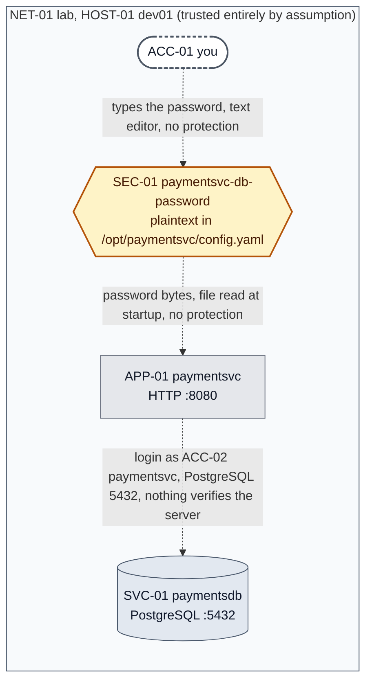
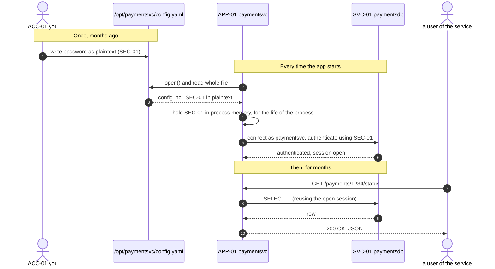

# Chapter 00, One laptop, one app, one password

**System before this Chapter.** Nothing. This is the origin.

**The pressure.** None yet, and that is deliberate. This Chapter establishes a system that
*works*, that a competent developer would plausibly have built on a Friday afternoon, and
that contains, unexamined, the seed of every problem in the rest of this build.

**What you'll have by the end of this Chapter.**

- A clear picture of the one system we are going to grow, and the four things in it.
- The visual language every diagram from here to the end is drawn in.
- The naming rules that are law for the entire build.
- A list of what to install before Chapter 01.
- One uncomfortable question that Chapter 01 will answer.

---

## 1. What we are doing, and how this works

You are going to learn key, PKI and secret management by building one system with me, from a
single machine to a global platform, and never skipping a wire.

Here is the rule that shapes everything that follows, and it is worth reading twice:

> **There is exactly one system. It starts as a password in a config file on one laptop.
> It ends as a hybrid, multi-cloud, multi-tenant platform serving a regulated multinational.
> It is never restarted. Every Chapter it grows by exactly as much as the next real problem
> requires, no more, no less.**

That means you will never see a chapter called "Introduction to Public Key Infrastructure".
You will see a Chapter where two of our services need to talk to each other without a third
party being able to read or impersonate the conversation, and certificates will appear
because that is the thing that solves it. Then, three Chapters later, we will have accumulated
enough certificates that renewing them by hand has already burned us once, and *that* is
when we build a certificate authority.

Almost every component in an enterprise key management platform exists because something
specific stopped working without it. Taught as a list of topics, you memorise what an HSM is.
Taught as a sequence of forced moves, you know *when* an HSM is the correct answer and when it
is forty thousand euros of expensive theatre. That difference is the whole distance between an
engineer and an architect.

The cost of this approach is that we have to live with our early bad decisions until a pressure
justifies fixing them. You will find that uncomfortable. Good, that discomfort is exactly what
a real system feels like, and learning to tolerate it while planning the fix is a skill.

### How each Chapter works

Each Chapter does four things:

1. Names the **specific pressure**, what works today, what just broke or became impossible.
2. **Builds** the next increment to solve exactly that, with commands that run and configs
   that are valid.
3. **Breaks it on purpose**, so you diagnose a real failure with your own hands. This is
   where the knowledge actually sticks.
4. Names the **next pressure** the new thing has created or exposed.

Each Chapter is a folder holding the chapter itself and every file its lab needs. Chapters are
never concatenated, and each one opens with a recap so it stands alone.

### One promise about depth

Nothing is out of scope. If a protocol exchange needs eight steps and a paragraph on each, it
gets them. If a decision has five options, you get all five and the honest reason we picked
one. When I simplify for you early on, I will say that I am simplifying and name the Chapter
where you get the full picture. What I will not do is give you a comfortable half-truth and
leave it standing.

---

## 2. The visual language

Read this section once. Every figure in every chapter obeys it, and by Chapter 20 you will be
reading dense architecture diagrams without thinking about the notation at all.

**The one rule underneath it: colour never carries meaning on its own.** Roughly one man in
twelve has a colour-vision deficiency, these chapters get pasted into greyscale documents,
and some Markdown viewers ignore diagram styling entirely. So every category is signalled
three ways, by **shape**, by **border**, and by colour. Any figure here is exactly as
readable in black and white.

### 2.1 What things are (node shapes)

| Category | What it means | Shape | Border | Colour |
|---|---|---|---|---|
| **Human** | A person acting interactively | stadium `( )` with rounded ends | 2px dashed | white/grey |
| **Application** | A workload that *consumes* secrets: app, job, script, container | plain rectangle | 1px solid | grey |
| **Control plane** | Something that *decides* or *issues*: a vault, a certificate authority, an identity provider, a key management API | rounded rectangle | 2px solid | blue |
| **Cryptographic boundary** | Where key material is created and used and from which it **cannot be extracted**, an HSM, a TPM, a secure enclave | rectangle with double side bars | **4px heavy** | red |
| **Data store** | A database, object store, or filesystem holding data | cylinder | 1px solid | slate |
| **Secret / key material** | The sensitive value itself, drawn as an object when *where it is* is the point | hexagon | 2px solid | amber |
| **Strongest option** | In a comparison, the option we chose | any | 3px solid | green |
| **Retired** | Removed this Chapter, kept visible so you can trace the lineage | any | 1px dotted | pale |

The heavy red double-barred box is the most important shape in this entire build. When you
see it, it means one specific thing: *the key inside that box has never existed anywhere
else, and cannot be made to leave.* We do not get to draw one until Stage 3, and we will
spend a long time earning it.

### 2.2 How well things are protected (line style)

| Line | Meaning |
|---|---|
| dotted `-.->` | **Unprotected.** Plaintext on disk or on the wire. No authentication, or authentication we do not trust. |
| solid `-->` | **Protected.** Encrypted and authenticated in transit. |
| thick `==>` | **Carries key material.** A key, a secret or a token crosses this edge. These are the edges an attacker cares about most. |

Every edge is labelled with three things in this order: *what crosses it, protocol and port,
how it is protected.* If an edge in any of my diagrams is missing one of those, that is a
bug and you should call it out.

### 2.3 Zones and change markers

A **trusted zone** is drawn with a solid slate border; an **untrusted zone**, the internet,
a third party, another tenant, the cloud provider's own substrate, with a dashed amber one.
Read "trusted" carefully: it means *trusted as of this Chapter*. Several later Chapters exist
precisely because something we drew as trusted turned out not to be.

New or changed elements are marked **★** in the label. Retired ones are marked **✕**. The
symbols are the authoritative signal because they survive every renderer.

---

## 3. The system, as it stands right now

### 3.1 The four things

You are one person with one laptop, building a small side project: a service that answers the
question *"what is the status of payment X?"*. It is useful, a handful of people use it, and it
works.

There are four moving parts you can point at.

**`HOST-01`, `dev01`, the machine.** Your development box. It is where you write the code,
where you run it, and where the database lives. Its full name in this build is
`dev01.lab.simurgh.example`. In the lab it will be a single Linux container on your laptop.

**`ACC-01`, `you`, the human.** You. And here is the first thing worth noticing: right now
you are simultaneously the developer, the operator, the database administrator, the security
team and the auditor. There is no separation between those roles because there is only one
of you. Every one of those roles will eventually become a different person with different
permissions, and each split will be forced on us by a specific event.

**`APP-01`, `paymentsvc`, the application.** A small HTTP service listening on port 8080.
When it starts, it reads a configuration file to find out where its database is and how to
log in. A **configuration file** is just a text file an application reads at startup to
learn things it should not have hard-coded, an address, a port, a timeout. Historically it
is also where credentials ended up, for the entirely understandable reason that the file was
already there and already being read.

**`SVC-01`, `paymentsdb`, the database.** PostgreSQL, listening on port 5432, holding the
payment records. It requires a username and password to connect. The username is a database
role called `paymentsvc`, that role gets its own ledger entry, `ACC-02`, because it is a
*principal*: something the database can identify and grant permissions to. Note that
`APP-01` (the application) and `ACC-02` (the identity it logs in as) are already two
different things, even though they share a name. That distinction is small now and becomes
one of the load-bearing ideas of the whole build.

### 3.2 The password

And so there is a fifth thing, which is really the subject of this entire build:

**`SEC-01`, `paymentsvc-db-password`.** The password that `paymentsvc` uses to log in to
`paymentsdb`. It lives on line 4 of `/opt/paymentsvc/config.yaml`, as ordinary readable
text:

```yaml
# /opt/paymentsvc/config.yaml
database:
  host: localhost
  port: 5432
  user: paymentsvc
  password: hunter2-payments-prod          # <-- SEC-01
  name: paymentsdb
server:
  listen: 0.0.0.0:8080
```

Three words for what that is, because we will use them constantly from here on:

A **secret** is a value whose entire usefulness depends on a limited set of parties knowing
it. Not "a value that is hidden", a value whose *disclosure destroys its purpose*. A
password is a secret. Your database schema is not, even if you would rather not publish it.
The test is whether disclosure breaks something.

A **credential** is a secret used specifically to *prove who or what you are*, in order to
get access to something. `SEC-01` is a credential: `paymentsvc` presents it and PostgreSQL
concludes "this connection is the `paymentsvc` role". Note the enormous assumption hiding
in that sentence, knowing the string *is* the proof of identity. Anything that learns the
string becomes `paymentsvc` as far as the database can tell. We will attack that assumption
hard, and eventually replace it entirely.

**Plaintext** means data in its ordinary readable form, not encrypted. The password above
is plaintext. Everyone says "cleartext" too; they mean the same thing here.

Two more terms to plant now, because they organise everything: data is either **at rest**
(written down somewhere, a disk, a backup, a log) or **in transit** (moving between two
parties, a network connection, a pipe, a copy-paste). Almost every control in this build
protects one or the other, and one of the most common real-world failures is protecting one
beautifully while leaving the other wide open. Right now `SEC-01` is unprotected in both.

### 3.3 The picture

Figure 0.1 is the entire system. It is the last time it fits comfortably in one small box.



**Figure 0.1, The starting state.** One box contains the entire system. Inside it: a human
(stadium shape), the password itself (amber hexagon) sitting as readable text in a config file,
the application (grey rectangle), and the database (cylinder). All three edges are dotted,
which in our language means *unprotected*, you type the password in the clear, the app reads it
from disk in the clear, and nothing on the third edge establishes that whatever answers on port
5432 is really the database. There is no blue anywhere, meaning nothing in this system
*decides* anything: no component asks whether `paymentsvc` should be allowed this password,
only whether the process can open the file. There is no red anywhere, meaning no key material
is protected by anything stronger than filesystem permissions. And there is no boundary drawn
inside the zone at all.

### 3.4 The same thing, in time

Figure 0.1 shows what exists. Figure 0.2 shows what *happens*, which is a different and
often more revealing view. This is a **sequence diagram**: parties across the top, time
flowing downward, each arrow a message.



**Figure 0.2, The lifetime of `SEC-01`, from a human typing it to the app serving traffic.**
Read it top to bottom. The password is written by hand exactly once (step 1) and then never
again, nobody changes it, because there is no mechanism to change it that does not mean
editing a file and restarting the service. It is read from disk at every startup (steps 2–3),
held in the application's memory for as long as the process lives (step 4), and used to
authenticate to the database (step 5). After that the app just reuses the session for months.

Look at step 4 for a moment. "Held in process memory, for the life of the process" is doing
a great deal of quiet work. That process might run for six months. Anything that can read
that process's memory, a debugger, a crash handler, a core dump, a memory-scraping tool,
the operating system's own swap file, gets the password. The config file is the copy you
know about.

That observation is where Chapter 01 starts.

**Step 5 is the one simplification in this chapter, and here is the notice promised in §1.**
"Authenticate using `SEC-01`" is deliberately vague about two things: whether the password
itself crosses the network, and whether anything encrypts that connection. Both have answers
that are not the obvious ones, neither is visible without a packet capture, and Chapter 01
takes a capture. Until then, treat step 5 as a description of intent rather than of bytes.

---

## 4. The naming rules

Because we never restart the system, we also never rename anything. If `dev01` became
`mylaptop` in Chapter 12, every earlier diagram and decision would silently rot, and you would
lose the single most valuable property of this build: being able to point at any box in the
final architecture and say which Chapter created it and why.

So the rules are fixed now, and the short version is:

- **Every object gets a stable ID**: `HOST-`, `NET-`, `ACC-`, `APP-`, `SVC-`, `SEC-`, `KEY-`,
  `CERT-`, `POL-`, `CLD-`, `TEN-`, `PROC-`, numbered in ascending order across the whole
  build and never reused, even after something is retired.
- **Two more prefixes name things that are not objects.** `OT-` is an **open thread**: a problem
  this build knows about and has not solved. `D-` is a **decision**, recorded with the options
  considered and what would reverse it. `AR-` is the rarer **accepted risk**, something chosen
  rather than a problem awaiting a fix. Each is numbered like everything else and never reused.
- **Every identifier is introduced in full where it first appears.** A chapter names the threads
  it creates at its end, under *Where this still hurts*, and its decisions under *Decisions we
  made*. So a bare reference like `OT-017` in a later chapter always traces back to a chapter
  that stated it in plain words. The cover's reference page indexes every thread and decision
  with the chapter that created it, so nothing here expects you to have memorised a code.
- **Hostnames** follow `<role><NN>.<zone>.simurgh.example`, `dev01`, `vault01`, `ca01`,
  `hsm01`. The `.example` top-level domain is reserved by RFC 2606 for documentation and can
  never collide with a real domain, which is exactly what we want. `simurgh` is the name
  this side project eventually grows into; we reserve it now so no hostname ever needs
  rewriting.
- **The value of a secret is never written into any file in this project.** The ledger
  records that `SEC-01` exists, what it protects and where it lives, never what it is.
  (The `hunter2-payments-prod` above is an illustration in a chapter, not a ledger entry,
  and it is about to become a very good example of why illustrations leak too.)

---

## 5. Getting your lab ready

Chapter 00 builds nothing. But Chapter 01 stands up the first container, so install these now.

| Tool | Why | Verify |
|---|---|---|
| Docker Desktop / Docker Engine / Podman + `podman-compose` | Each "machine" in the ledger is one Linux container | `docker --version` and `docker compose version` |
| Git | Everything here is text and you will want history | `git --version` |
| A terminal and a text editor | — | — |

```bash
sudo docker --version
sudo docker compose version
git --version
```

If all three print a version, you are ready.

**Why containers and not virtual machines.** By Stage 4 we need a dozen machines standing at
once, app servers, a vault, a certificate authority, a directory, an HSM, a Kubernetes
cluster, and they must survive between Chapters. VMs are more faithful but cost gigabytes of
RAM each and would not fit on a laptop. Containers give us many cheap machines, each with a full
Linux userland, its own networking and its own filesystem. Where the difference matters,
measured boot with a hardware TPM, an HSM's tamper response, I will say so explicitly
and tell you exactly what the software substitute does *not* prove.

Expect roughly 8 GB of disk and 6 GB of RAM once the whole build is standing. Chapter 01 needs
almost nothing.

---

## 6. Where this already hurts

The system works. Nobody has been harmed. And two questions have never been asked.

**First: who can read that file right now?** Not who *should*, who *can*. Think about every
account on that host, every process running as those accounts, every tool with filesystem
access, every automated agent that walks the disk.

**Second: where has that password already gone?** A secret written down once does not stay in
one place. It gets copied by mechanisms nobody chose, nobody configured, and nobody is
watching. The file is the only copy you know about. It is very unlikely to be the only copy
that exists.

You may already be reaching for the obvious answer, `chmod 600` the file and be done. Hold
that thought. It is an improvement and we will do it. It also closes a strikingly small
fraction of the actual exposure, and understanding precisely *which* fraction is the thing
that will drive the next several Chapters.

---

## 7. Chapter recap

- One system, grown continuously from here to a global platform. Never restarted, never renamed.
- Components appear only when a specific pressure forces them. No topic-driven chapters.
- The starting system: `HOST-01 dev01`, `ACC-01 you`, `APP-01 paymentsvc`, `SVC-01 paymentsdb`,
  and `SEC-01 paymentsvc-db-password` sitting in plaintext in a config file.
- A **secret** is a value whose disclosure destroys its purpose. A **credential** is a secret
  used to prove identity, which means anything that learns the string *becomes* that identity.
- Data is either **at rest** or **in transit**. `SEC-01` is currently unprotected in both.
- Right now you are the developer, operator, DBA, security team and auditor at once. Every one
  of those will eventually split, and each split will be forced by an event.
- The visual language: shape says *what*, line style says *how well protected*, colour never
  carries meaning alone. Heavy red double-bars mean key material that cannot leave, we have
  not earned one yet.
- `NET-01 lab` is trusted **by assumption**, not by verification. Remember the difference.
- The password has been read from disk and held in process memory at every startup for months.
  The config file is the copy you know about.
- Next: who can read it, and where has it already leaked?

---

## 8. Prove it to yourself

**Q1. What exactly makes something a "secret"? Is your database schema a secret?**

A secret is a value whose usefulness depends on a limited set of parties knowing it, its
disclosure *destroys its purpose*. Your schema is probably something you would rather not
publish, but publishing it does not stop it working. Publishing `SEC-01` immediately gives
anyone in the world full read/write access to your payment records. That is the test, and it
is a useful one to apply out loud, because organisations routinely spend heavily protecting
things that are merely embarrassing while leaving actual secrets in config files.

**Q2. `SEC-01` is a credential. What assumption does PostgreSQL make when `paymentsvc`
presents it, and why is that assumption dangerous?**

PostgreSQL assumes that *knowledge of the string is proof of identity*. It has no other way
to tell. That means possession and identity are the same thing: the moment any person,
process or backup file learns that string, it *is* `paymentsvc` as far as the database is
concerned, indistinguishably. There is no way to tell a legitimate use from a stolen one,
and no way to revoke one without revoking the other. Much of this build is a long campaign
to break the equation "knows the value = is the identity".

**Q3. In Figure 0.1, why are all three edges dotted rather than solid?**

Dotted covers two cases in our visual language, no protection at all and authentication we do
not trust, and the three edges are split between them. Typing the password into an editor
writes plaintext to disk, and the app reads plaintext from disk: those two are the first case.
The PostgreSQL connection is the second. Whatever it does or does not encrypt, the application
never establishes that the thing answering on port 5432 is its database, so any protection it
gets is protection against the wrong threat. That the connection is on `localhost` makes it
less *exposed*, not protected, and localhost stops being the answer the moment there are
two machines.

**Q4. Figure 0.1 contains no blue "control plane" node. What is the practical consequence?**

Nothing in the system *decides* whether `paymentsvc` should have this password. There is no
component that could say yes or no, apply a policy, record that access happened, or change
its mind later. The only gate is the filesystem: if a process can open the file, it has the
password, permanently and silently. Adding a component that can decide, and log, and
revoke, is the single biggest structural change coming in Stage 1.

**Q5. Look at step 4 in Figure 0.2, "hold SEC-01 in process memory, for the life of the
process". Name three things that can read a process's memory.**

A debugger attached to the process; a core dump written when it crashes (which usually lands
in a file readable by more people than the config was, and gets shipped to a crash-reporting
service); the operating system's swap file, if memory pressure pages that region to disk.
Others: `/proc/<pid>/mem` on Linux for a sufficiently privileged process, a memory-scraping
tool, a hypervisor snapshot of the whole VM, or a hibernation image. This is why "the secret
is only in the config file" is almost never true, and it is why later Chapters care about
`tmpfs`, disabling core dumps, and how long a secret is allowed to live in memory.

**Q6. Why does this build refuse to write actual secret values into the ledger, even though
this whole project is a training lab and none of these secrets are real?**

Two reasons. The practical one: the habit is the point. A repo that "only has test
credentials" is exactly how live credentials eventually get committed, someone copies the
pattern under time pressure. The structural one: a ledger's job is to
record *that a secret exists, what it protects, where it lives, when it was last rotated,
and who owns it*. The moment it also records values, it stops being an inventory and becomes
the highest-value target in your estate. Keep the map and the treasure in different places.

**Q7. Why does this build insist that colour never carries meaning on its own in diagrams?**

Because a diagram that only works in colour fails for readers with colour-vision deficiency
(around 1 in 12 men), fails when printed or pasted into a greyscale document, and fails
entirely in any Markdown viewer that ignores diagram styling. Since these figures are the
primary way architecture gets communicated, to auditors, to executives, to the on-call
engineer at 03:00, a figure that degrades to meaningless is a real operational risk, not an
aesthetic one. So shape carries the category and line style carries the protection level;
colour only reinforces them.

**Q8. What is the difference between a zone being "trusted" and a zone being "verified", and
which is `NET-01 lab` right now?**

Trusted-by-assumption means nothing has yet forced you to check. Verified means you have an
actual mechanism that establishes the property and would detect its absence. `NET-01 lab` is
trusted purely by assumption: it is trusted because there is only one machine and it is
yours, and no threat has been modelled against it. That is not automatically wrong, early
systems run on assumptions and should, but it becomes dangerous the instant it goes
unexamined while the system grows around it. Several later Chapters exist entirely because a
boundary somebody drew as trusted turned out not to be.

**Q9. Run the three verification commands from §5. What did each print, and what is the one
piece of the lab you do not yet have?**

You should have version strings from `docker --version`, `docker compose version` and
`git --version`. What you do not yet have is any *machine*: Chapter 00 stands nothing up, so
`docker ps` shows nothing of ours. `HOST-01 dev01` exists in the ledger as a name and a
commitment, not yet as a running container. That happens in Chapter 01.
