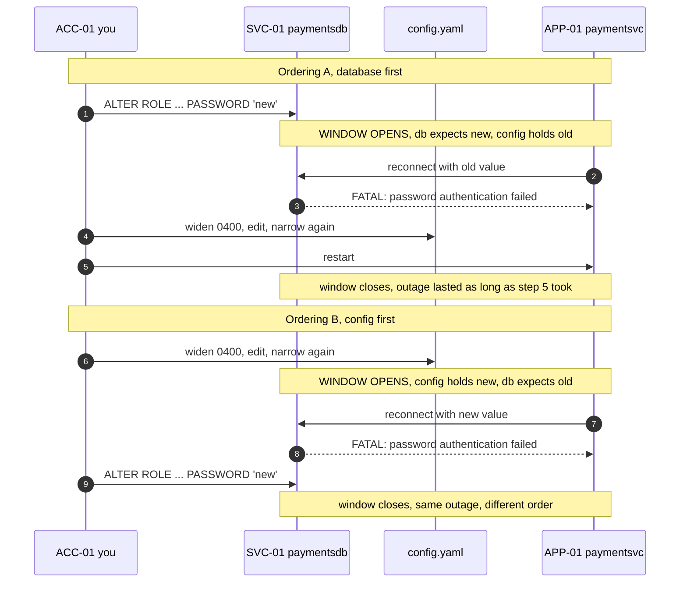
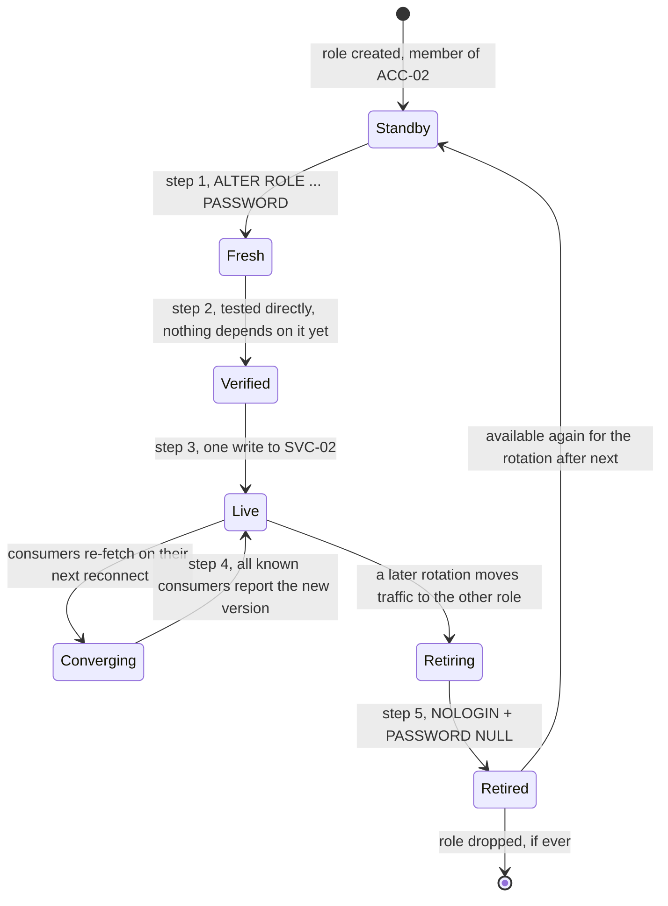
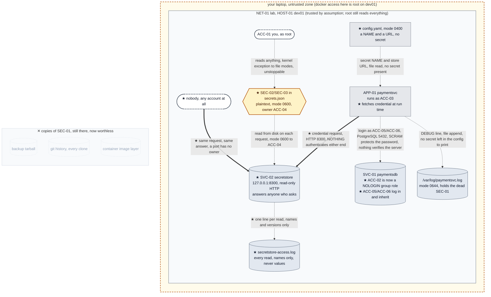

# Chapter 02, Rotating a credential that six systems are holding

**System before this Chapter.** One machine, `HOST-01 dev01`, running `APP-01 paymentsvc`
against `SVC-01 paymentsdb`. The app reads `SEC-01 paymentsvc-db-password` from
`/opt/paymentsvc/config.yaml`, now mode `0400` owned by `ACC-03`, and logs in to PostgreSQL
as role `ACC-02 paymentsvc`. Chapter 01 found `SEC-01` in sixteen places, closed three of them,
and proved that everything left is either off the machine or is root. The conclusion was
unavoidable: **`SEC-01` must be treated as compromised.**

**The pressure.** `OT-002`. The only remedy for a compromised credential is to change it.
Chapter 01 tried, and measured four costs: an outage, un-protecting a protected file, two writes
that must agree, and no way to verify the job was done. Any one of those makes rotation
something you avoid. Together they make it something you avoid for eleven years, which is
precisely why credentials in real companies are eleven years old.

This Chapter makes rotation an operation you would actually be willing to perform.

**What you'll have working by the end of this Chapter.**

- A proof, not an assertion, that with one credential and two systems holding it, **no
  order of operations avoids an outage.** You will run both orders and watch both fail.
- `SVC-02 secretstore`: one authoritative place holding the credential, which `APP-01` asks
  at run time instead of reading a file.
- An application that survives a credential change *while serving traffic*, without a
  restart, without an edit, and without anyone logging in to the host.
- A rotation procedure (`PROC-01`) with zero downtime, built on two credentials
  valid at once, and a verification step that tells you when it is safe to kill the old one.
- The first real win of this build: `SEC-01` retired, and all sixteen of its copies,
  including the one permanently in your git history, rendered worthless in a single command.
- An honest accounting of what you paid for it, which is considerable, and which is Chapter 03.

---

## 0. If your output differs

This chapter shows a lot of output from `SVC-02`, and some of it is machine-specific: the
timestamps, and the ephemeral source ports in `last_peer` and the access log (`127.0.0.1:54846`
and the like). Those will differ on your machine and nothing depends on them. Secret
**versions** are not machine-specific: if your version numbers drift from the ones shown, you
have run a `secretstore-set` the chapter did not ask for, and §8 will not line up.

Otherwise your output should match what is shown. If it does not, that is worth a minute
rather than a shrug; the two usual causes are a different PostgreSQL major version (check with
`sudo docker exec dev01 psql --version`) and a different Docker storage driver. Both are noted at
the points where they matter.

### Before you start: this chapter continues an existing lab

`dev01` is built **once**, in Chapter 01. Every chapter after that deploys into the same
running container. This folder carries every file the running system uses, so you can read the
whole thing in one place, but **building from here does not give you this chapter's starting
state.** That state is what running the earlier chapters leaves behind: OS accounts, file modes,
database rows and files that no image contains.

Note also that a `healthy` container tells you PostgreSQL is accepting connections and
**nothing about the application**, which is started by hand because `HOST-01` has no service
manager. A green container with a silent port 8080 is the normal look of a lab nobody has
started yet.

If you have not worked the earlier chapters, start at Chapter 01. If you have, check that the
lab is where this chapter expects it:

```bash
sudo docker exec dev01 id paymentsvc
sudo docker exec dev01 stat -c '%A %U:%G %n' /opt/paymentsvc/config.yaml
sudo docker exec dev01 su postgres -c "psql -d paymentsdb -tAc 'SELECT count(*) FROM payments'"
curl -s http://127.0.0.1:8080/healthz
```

Expected: a uid and gid for `paymentsvc`; `-r-------- paymentsvc:paymentsvc` on the config
file, which is the mode Chapter 01 §7 sets; `3`, the rows `initdb.sql` seeded; and
`{"status": "ok"}`.

If the container is stopped, or those commands cannot reach it, start it and `APP-01` first:

```bash
sudo docker start dev01
sleep 2
sudo docker exec -d -u paymentsvc dev01 \
    sh -c 'python3 /opt/paymentsvc/paymentsvc.py >>/var/log/paymentsvc.out 2>&1'
```

Expected: `{"status": "ok"}` from a `curl` to `/healthz`, and the state check above passing.

**If the state check still fails after that**, the container is not in this chapter's starting
state at all. The usual cause is having built the image from this folder instead of continuing
the container Chapter 01 built. There is no shortcut back:

```bash
sudo docker rm -f dev01
cd "../../Chapter 01/lab" && sudo docker compose up -d --build dev01
```

Then work Chapters 01 onward forward again.

---

## 1. What rotation is actually for

Before building anything, be precise about the goal, because "rotate your credentials" is
advice everyone repeats and few people can justify.

Chapter 01 ended with sixteen locations holding `SEC-01`, eight of them beyond any control on
`HOST-01`: a backup tarball, git history in every clone, a container image layer, a log line,
whatever went through human channels. You cannot recall any of them. You cannot even
enumerate them: you found the ones you found by going and looking, on a machine you built
yourself that afternoon.

So you have a value you cannot un-publish. There is exactly one operation that helps:

> **Make every existing copy worthless by changing what the copies are copies of.**

That is rotation, and reading it that way explains its properties. Rotation does not clean the
backup. It does not rewrite git history. It does not reach into the log aggregator. It does
none of the things people hope it does. It does something better: it makes all of that
irrelevant, because the bytes in those places stop being a credential and become a string.

It follows that rotation is not a hygiene task you do quarterly because a policy says so. It
is **the only defence you have against the copies you do not know about**, and you always
have copies you do not know about. A system that can rotate cheaply is a system where a leak
is an incident; a system that cannot is a system where a leak is a catastrophe, because the
only response available is one nobody is willing to perform.

Which brings us to why nobody is willing to perform it here.

---

## 2. The theorem: with one credential and two writes, no ordering works

Chapter 01 rotated `SEC-01` once, by hand, and listed the costs. We are going to look harder at
one of them, "two writes that must agree", because it is not an inconvenience. It is a
structural impossibility, and until you have felt it you will keep believing that a careful
enough runbook could fix this.

`SEC-01` exists in two systems that must agree about it:

1. **PostgreSQL**, which holds a verifier derived from it, changed with `ALTER ROLE`.
2. **`config.yaml`**, which holds the value, changed with an editor.

There is no transaction spanning those two systems. You cannot commit them together. So you
must do one, then the other, and there is a window in between. Run both orderings and watch.

Make sure the lab is up first:

```bash
sudo docker ps --filter name=dev01
curl -s http://127.0.0.1:8080/healthz
```

If the container is stopped, or the application is not answering, start them:

```bash
sudo docker start dev01
sleep 2
sudo docker exec -d -u paymentsvc dev01 \
    sh -c 'python3 /opt/paymentsvc/paymentsvc.py >>/var/log/paymentsvc.out 2>&1'
```

Expected: `dev01` running, and `{"status": "ok"}`.

### 2.1 Ordering A, change the database first

```bash
sudo docker exec dev01 su postgres -c \
    "psql -c \"ALTER ROLE paymentsvc PASSWORD 'rotation-attempt-A'\""

# the app is still running, still holding the OLD value in memory.
# it survives on its existing connection. Now force a reconnect:
sudo docker exec dev01 pkill -f paymentsvc.py || true
sudo docker exec -u paymentsvc dev01 python3 /opt/paymentsvc/paymentsvc.py 2>&1 | tail -3
```

Expected:

```
psycopg2.OperationalError: connection to server at "localhost" (127.0.0.1), port 5432 failed:
FATAL:  password authentication failed for user "paymentsvc"
```

The service is down. It stays down until you hand-edit `config.yaml`, a file you deliberately
made `0400` in Chapter 01, so you must widen it, edit it, narrow it again, and restart.

Note the nastiest detail: **the app kept working for a while.** Its existing connection was
already authenticated, and PostgreSQL does not re-check a credential on an open connection. So
the failure did not appear when you rotated. It appeared later, at the next reconnect, which
in production is a deploy, a network blip, or 3 a.m. The rotation and its consequence are
separated in time, which is the worst possible property for a change to have.

### 2.2 Ordering B, change the config first

Surely the fix is to do it the other way round. Restore the app to a working state, then try:

```bash
# put the database back so we start from a working system
sudo docker exec dev01 su postgres -c \
    "psql -c \"ALTER ROLE paymentsvc PASSWORD 'hunter2-payments-prod'\""
sudo docker exec -d -u paymentsvc dev01 \
    sh -c 'python3 /opt/paymentsvc/paymentsvc.py >>/var/log/paymentsvc.out 2>&1'
sleep 2
curl -s http://127.0.0.1:8080/healthz
```

Expected: `{"status": "ok"}`. Now change the config first:

```bash
sudo docker exec dev01 chmod 0600 /opt/paymentsvc/config.yaml
sudo docker exec dev01 sed -i "s/^  password: .*/  password: rotation-attempt-B/" \
    /opt/paymentsvc/config.yaml
sudo docker exec dev01 chmod 0400 /opt/paymentsvc/config.yaml

sudo docker exec dev01 pkill -f paymentsvc.py || true
sudo docker exec -u paymentsvc dev01 python3 /opt/paymentsvc/paymentsvc.py 2>&1 | tail -3
```

Expected: exactly the same failure, for the mirror-image reason,

```
FATAL:  password authentication failed for user "paymentsvc"
```

The config now says the new value; the database still expects the old one.

Restore the system before continuing:

```bash
sudo docker exec dev01 chmod 0600 /opt/paymentsvc/config.yaml
sudo docker exec dev01 sed -i "s/^  password: .*/  password: hunter2-payments-prod/" \
    /opt/paymentsvc/config.yaml
sudo docker exec dev01 chmod 0400 /opt/paymentsvc/config.yaml
sudo docker exec -d -u paymentsvc dev01 \
    sh -c 'python3 /opt/paymentsvc/paymentsvc.py >>/var/log/paymentsvc.out 2>&1'
sleep 2
curl -s http://127.0.0.1:8080/healthz
```

Also note, in passing, what you just had to do twice: **widen the permissions on the file
holding your secret in order to rotate your secret.** Every rotation re-opens the exposure
Chapter 01 closed. The two things you are told to do, restrict the file, and rotate often,
actively fight each other.

### 2.3 What both orderings have in common

Figure 2.1 puts them side by side.



**Figure 2.1, both orderings, both broken.** Time flows downward. In each ordering there is
an interval during which the two systems disagree about what the credential is, and any
connection attempt in that interval fails. Reordering the steps moves the window; it never
removes it. The width of the window is however long it takes a human to do the second step,
seconds if they are already logged in and ready, hours if the second step is a pull request.

The property we are missing has a name: **atomicity**, the guarantee that a set of changes
either all happen or none do, with no observable state in between. A database gives you that
*within* itself. Nothing gives it to you *across* PostgreSQL and a YAML file on a host,
because there is no component that spans both.

There are exactly two ways out of that, and it is worth seeing them clearly because every
real secret-management system is built on one or both:

1. **Reduce two writes to one** — make there be only one authoritative place, so there is
   nothing to disagree with. This is §4.
2. **Make the disagreement harmless** — arrange for *both* the old and the new credential to
   be valid at the same time, so that a consumer holding either one still works. This is §7.

We are going to need both. Neither is sufficient alone, which is a thing most people
discover the hard way.

---

## 3. Updating `dev01` without destroying it

We are about to add files to the machine. There is a wrong way to do this that will cost you
the rest of the build, so it gets its own short section.

**Do not rebuild the image.**

The container is not recreated between Chapters: state written inside it is expected to
persist. That state is not incidental: it *is* Chapter 01's result. Rebuilding
destroys, in one command:

- `ACC-03`'s ownership and the `0400` modes on both files (§7.3 of Chapter 01);
- the `payments` table and its rows;
- the `DEBUG` line in `/var/log/paymentsvc.log` that `OT-008` is about, and which later
  Chapters refer back to;
- `/root/pg_hba.conf.orig`, the known-good copy from Chapter 01 §5.5.

And `D-007` forbids bind mounts, because Docker Desktop on macOS rewrites ownership across
that boundary and would falsify every permission check we are about to make.

So we copy files in, with `docker cp`, and set ownership and modes explicitly inside the
container. That is also honest about what it models: in the real world, code arrives on a
running host by a deploy, not by re-imaging the machine.

This chapter's `lab/` folder holds the **whole lab**, not just what this chapter adds. Work
there; every command below assumes it is your working directory:

```bash
cd "Chapter 02/lab"
find . -type f | sort
```

Expected:

```
./dev01/Dockerfile
./dev01/app/config.yaml
./dev01/app/paymentsvc.py
./dev01/entrypoint.sh
./dev01/initdb.sql
./dev01/secretstore/secretstore-set.py
./dev01/secretstore/secretstore.py
./docker-compose.yml
```

### The lab in full

Everything needed to stand this system up is in front of you. What **this** chapter writes is
marked ★:

```
lab/
├── docker-compose.yml                Chapter 01
└── dev01/
    ├── Dockerfile                    Chapter 01
    ├── entrypoint.sh                 Chapter 01
    ├── initdb.sql                    Chapter 01   seed only, see below
    ├── app/
    │   ├── config.yaml             ★ rewritten: the secret becomes a reference
    │   └── paymentsvc.py           ★ rewritten: fetches at run time
    └── secretstore/
        ├── secretstore.py          ★ new: SVC-02
        └── secretstore-set.py      ★ new: the only way to write a value
```

**`initdb.sql` is a seed, not a description of the live database.** It runs once, at first
boot, and `entrypoint.sh` guards it with a marker file so it never runs again. It still says
`CREATE ROLE paymentsvc LOGIN PASSWORD 'hunter2-payments-prod'`, which stopped being true
during this chapter: §7 turns `paymentsvc` into a `NOLOGIN` group role and §9 retires that
password. The file is left exactly as Chapter 01 wrote it, deliberately, because it is one of
the sixteen places `SEC-01` lives and Chapter 01 recorded it as such. Read it as history.

**Do not rebuild here.** The compose file is byte-identical to Chapter 01's, so a plain
`docker compose up -d` is a harmless no-op on a lab that is already running. `--build` would
replace the container with a fresh one built from Chapter 01's image, which resets the lab to
where Chapter 01 started and loses everything above. If you ever do need that reset, it is a
legitimate recovery path: rebuild from Chapter 01's `lab/` folder and work forward again.

The `git` repository you created in Chapter 01 stays where it is, in *that* chapter's `lab/`
folder, still holding `hunter2-payments-prod` in its history. Leave it exactly as it is. §9 is
going to do something satisfying with it.

---

## 4. `SVC-02 secretstore`, one authoritative place

### 4.1 What it must do, and what it deliberately must not

The temptation at this point is to reach for a real secret-management product. We are not
going to, and the reason is `D-005`: technology arrives when a pressure demands it, and the
pressure in front of us is narrow. If we deploy something large now, it will solve problems we
have not felt yet, and you will learn its configuration file instead of learning why it exists.

So we build the smallest thing that answers `OT-002`, and we are precise about its scope.

**It must:**

- hold the credential in exactly one authoritative place, so a change is **one write**;
- serve the current value to a consumer at run time, so no file on any host holds it;
- version the value, so a consumer can say which one it has;
- record every read, so that for the first time in this build *something knows a secret was
  accessed*.

**It deliberately must not, each of these is a later Chapter:**

- **encrypt anything.** We have no key management, and this build has not yet earned the word
  "encryption". A store that holds plaintext is what we can honestly build today, and
  §10 records the risk rather than hiding it.
- **decide who may have the secret.** It will answer anyone who asks. That is not an
  oversight; it is the pressure this Chapter hands to the next one.
- **be highly available, replicated, or backed up.** One process, one file.

Call it a **secret store**, not a vault. A vault is a specific thing with specific properties,
sealing, policy, leases, an audit trail you can trust, and this has none of them. Naming it
accurately now keeps the eventual comparison honest.

Ledger allocations for this Chapter, in ascending order and permanent: `SVC-02` the store,
`ACC-04` the OS user it runs as, `ACC-05` and `ACC-06` two new database login roles, `SEC-02`
and `SEC-03` their passwords, `PROC-01` the rotation procedure.

### 4.2 The store

`dev01/secretstore/secretstore.py`. Standard library only, the image has no `pip`
and needs none.

```python
#!/usr/bin/env python3
"""SVC-02 secretstore, one authoritative place to hold a secret.

Chapter 02. This is deliberately the smallest thing that solves OT-002, and no
more. It does NOT encrypt anything, and it does NOT check who is asking.
Both of those are Chapters of their own.

Read-only over HTTP. The only way to CHANGE a value is secretstore-set,
which runs on this host as this service's own OS user and writes the file
directly. A network client cannot write.
"""

import json
import os
import sys
import time
from http.server import BaseHTTPRequestHandler, ThreadingHTTPServer

STORE_PATH = os.environ.get("SECRETSTORE_DB", "/var/lib/secretstore/secrets.json")
ACCESS_LOG = os.environ.get("SECRETSTORE_ACCESS_LOG", "/var/log/secretstore-access.log")
LISTEN_HOST = os.environ.get("SECRETSTORE_HOST", "127.0.0.1")
LISTEN_PORT = int(os.environ.get("SECRETSTORE_PORT", "8300"))


def load_store():
    with open(STORE_PATH) as fh:
        return json.load(fh)


def audit(client_ip, client_port, consumer, name, version, outcome):
    """Append one line per read. This is the entire audit story in Chapter 02.

    `consumer` is whatever the caller PUT IN A HEADER about itself. It is a
    claim, not a fact. Nothing here verifies it.
    """
    line = "\t".join([
        time.strftime("%Y-%m-%dT%H:%M:%S%z"),
        f"{client_ip}:{client_port}",
        consumer,
        name,
        str(version),
        outcome,
    ])
    with open(ACCESS_LOG, "a") as fh:
        fh.write(line + "\n")


def consumers_for(name):
    """Reconstruct 'who holds a copy of this secret' from observed reads.

    This can only ever see consumers that have actually asked us. A copy in
    a tarball, in git, or on a host that has not fetched since we started
    logging is invisible here. Chapter 02 says so out loud.
    """
    seen = {}
    try:
        with open(ACCESS_LOG) as fh:
            for raw in fh:
                parts = raw.rstrip("\n").split("\t")
                if len(parts) != 6:
                    continue
                ts, peer, consumer, sec_name, version, outcome = parts
                if sec_name != name or outcome != "served":
                    continue
                seen[consumer] = {
                    "consumer": consumer,
                    "last_peer": peer,
                    "last_seen": ts,
                    "last_version_served": int(version),
                }
    except FileNotFoundError:
        pass
    return sorted(seen.values(), key=lambda c: c["consumer"])


class Handler(BaseHTTPRequestHandler):
    server_version = "secretstore/0.1"

    def _json(self, code, payload):
        body = json.dumps(payload).encode()
        self.send_response(code)
        self.send_header("Content-Type", "application/json")
        self.send_header("Content-Length", str(len(body)))
        self.end_headers()
        self.wfile.write(body)

    def do_GET(self):
        peer_ip, peer_port = self.client_address[0], self.client_address[1]
        # Self-declared. Unverified. See section 10.
        consumer = self.headers.get("X-Consumer", "-")

        if self.path == "/healthz":
            return self._json(200, {"status": "ok"})

        parts = self.path.strip("/").split("/")

        if len(parts) == 3 and parts[0] == "v1" and parts[1] == "secrets":
            name = parts[2]
            store = load_store()
            if name not in store:
                audit(peer_ip, peer_port, consumer, name, -1, "not_found")
                return self._json(404, {"error": "no such secret"})
            entry = store[name]
            audit(peer_ip, peer_port, consumer, name, entry["version"], "served")
            return self._json(200, {
                "name": name,
                "version": entry["version"],
                "updated": entry["updated"],
                "value": entry["value"],
            })

        if (len(parts) == 4 and parts[0] == "v1" and parts[1] == "secrets"
                and parts[3] == "consumers"):
            name = parts[2]
            store = load_store()
            if name not in store:
                return self._json(404, {"error": "no such secret"})
            return self._json(200, {
                "name": name,
                "current_version": store[name]["version"],
                "consumers": consumers_for(name),
                "caveat": "derived from observed reads only; a consumer that "
                          "never asks us is invisible here",
            })

        return self._json(404, {"error": "not found"})

    def do_PUT(self):
        return self._json(405, {"error": "this store is read-only over HTTP"})

    do_POST = do_PUT
    do_DELETE = do_PUT

    def log_message(self, fmt, *args):
        sys.stdout.write("%s %s\n" % (self.address_string(), fmt % args))
        sys.stdout.flush()


if __name__ == "__main__":
    srv = ThreadingHTTPServer((LISTEN_HOST, LISTEN_PORT), Handler)
    print(f"secretstore listening on {LISTEN_HOST}:{LISTEN_PORT}, db={STORE_PATH}")
    sys.stdout.flush()
    srv.serve_forever()
```

Three design choices in there are worth more than the rest of the file put together.

**The HTTP surface is read-only.** `do_PUT`, `do_POST` and `do_DELETE` all return `405`.
Think about why that matters. If writing were an HTTP endpoint, then anything that can reach
the port could not merely *read* your database password, it could *replace* it, pointing
`APP-01` at a database of the attacker's choosing, or simply breaking payments until someone
noticed. An unauthenticated write is a far worse hole than an unauthenticated read, and since
we have no way to authenticate anyone yet, the honest move is to not expose the operation at
all. Writing happens locally, as the store's own user, gated by a file permission, which is a
control we *do* have, because Chapter 01 built it.

**The audit line records a claim, not a fact.** `X-Consumer` is a header the caller sets about
itself. Nothing verifies it. It is useful, and it is what makes §8's verification step
possible, but it would be worthless against anyone who did not want to be identified. We
write that limitation into the code comment rather than into a footnote, because in six months
the code is what someone will read.

**The access log holds names and versions, never values.** A log of secret accesses that
contains secrets is a new copy of every secret you own, with worse permissions and longer
retention. This is the mistake `OT-008` is about, and it would be embarrassing to make it
again, in the file whose whole purpose is to watch for it.

### 4.3 The writer

`dev01/secretstore/secretstore-set.py`:

```python
#!/usr/bin/env python3
"""secretstore-set, the ONLY way to change a value in SVC-02.

Deliberately not an HTTP endpoint. Writing runs on this host, as this
service's own OS user, gated by a file permission. That keeps the network
surface read-only: something that can reach the port can read a secret, but
cannot replace one.

Usage:  secretstore-set <name> <value>
        secretstore-set --show <name>      # metadata only, never the value
"""

import json
import os
import sys
import time

STORE_PATH = os.environ.get("SECRETSTORE_DB", "/var/lib/secretstore/secrets.json")


def load():
    with open(STORE_PATH) as fh:
        return json.load(fh)


def save(store):
    """Write via a temporary file and rename, so a reader never sees a
    half-written file. rename(2) is atomic within a filesystem."""
    tmp = STORE_PATH + ".tmp"
    with open(tmp, "w") as fh:
        json.dump(store, fh, indent=2, sort_keys=True)
        fh.write("\n")
    os.chmod(tmp, 0o600)
    os.replace(tmp, STORE_PATH)


def main(argv):
    if len(argv) == 3 and argv[1] == "--show":
        store = load()
        name = argv[2]
        if name not in store:
            print(f"no such secret: {name}", file=sys.stderr)
            return 1
        e = store[name]
        print(f"name={name} version={e['version']} updated={e['updated']} "
              f"bytes={len(e['value'])}")
        return 0

    if len(argv) != 3:
        print(__doc__.strip(), file=sys.stderr)
        return 2

    name, value = argv[1], argv[2]
    store = load()
    prev = store.get(name, {"version": 0})
    store[name] = {
        "version": prev["version"] + 1,
        "value": value,
        "updated": time.strftime("%Y-%m-%dT%H:%M:%S%z"),
    }
    save(store)
    # Never print the value back. The terminal is a place secrets go to die
    # slowly, in a scrollback buffer and a shell history file.
    print(f"{name}: version {prev['version']} -> {store[name]['version']}")
    return 0


if __name__ == "__main__":
    sys.exit(main(sys.argv))
```

`save()` writes to a temporary file and then `os.replace()`s it over the real one. `rename(2)`
is atomic within a filesystem: a reader either sees the entire old file or the entire new one,
never a half-written one. We got atomicity *inside* the store almost for free, which throws
into relief that the thing we could not get in §2 was atomicity *across* two systems.

`--show` prints the version and the length, never the value. Getting into the habit of
building tools that will not print a secret is worth more than it looks: the reason secrets
end up in scrollback buffers, shell history files, CI logs and screen-shares is that somebody
built a convenient command that echoes them.

### 4.4 Install it on `dev01`

```bash
sudo docker cp dev01/secretstore/secretstore.py     dev01:/opt/secretstore/secretstore.py
sudo docker cp dev01/secretstore/secretstore-set.py dev01:/usr/local/bin/secretstore-set
```

If the first `docker cp` fails because `/opt/secretstore` does not exist, create it and retry:

```bash
sudo docker exec dev01 mkdir -p /opt/secretstore
```

Now the identity it runs as. `ACC-04`, exactly like `ACC-03` in Chapter 01, its own system
account, no login shell:

```bash
sudo docker exec dev01 useradd --system --home-dir /opt/secretstore \
    --shell /usr/sbin/nologin secretstore
sudo docker exec dev01 id secretstore
```

Expected: a `uid`, a `gid`, and no supplementary groups.

Create the backing file and the access log, and set the modes deliberately rather than letting
them default, which is the entire lesson of Chapter 01:

```bash
sudo docker exec dev01 mkdir -p /var/lib/secretstore
sudo docker exec dev01 sh -c 'echo "{}" > /var/lib/secretstore/secrets.json'
sudo docker exec dev01 touch /var/log/secretstore-access.log /var/log/secretstore.out

sudo docker exec dev01 chown -R secretstore:secretstore \
    /opt/secretstore /var/lib/secretstore \
    /var/log/secretstore-access.log /var/log/secretstore.out
sudo docker exec dev01 chmod 0700 /var/lib/secretstore
sudo docker exec dev01 chmod 0600 /var/lib/secretstore/secrets.json
sudo docker exec dev01 chmod 0600 /var/log/secretstore-access.log
sudo docker exec dev01 chmod 0644 /var/log/secretstore.out
sudo docker exec dev01 chmod 0755 /usr/local/bin/secretstore-set

sudo docker exec dev01 namei -l /var/lib/secretstore/secrets.json
```

`/var/log/secretstore.out` has to be created and chowned **here**, before anything starts,
and it is the single most likely thing to waste your evening. `/var/log` is owned by root and
mode `0755`, so `ACC-04` cannot create a file in it. §4.5 starts the store with
`>>/var/log/secretstore.out`, and the shell performs that redirect *as `secretstore`*. If the
file does not already exist, the redirect fails, the process never starts, and `docker exec -d`
returns success while telling you nothing. This is the identical trap `entrypoint.sh` was
already working around for `/var/log/paymentsvc.out` in Chapter 01; it is worth recognising the
shape, because "the detached process silently did not start" is a category of bug you will
meet for the rest of your career.

Expected from `namei -l`: every directory traversable until `/var/lib/secretstore`, which is
`drwx------ secretstore secretstore`, and the file itself `-rw------- secretstore secretstore`.

`0600` on the backing file and `0700` on its directory, not `0400`, because unlike `APP-01`
this service legitimately *writes*: `secretstore-set` replaces the file. `D-009`'s reasoning
still applies; it just lands on a different answer for a component with different needs. That
is what a principle looks like when it is actually being applied rather than recited.

### 4.5 Seed it and start it

The store needs the credential put into it once. For now that is still the Chapter 01 value:
we are not rotating yet, only moving where the value lives.

```bash
sudo docker exec -u secretstore dev01 secretstore-set paymentsvc-db \
    '{"user": "paymentsvc", "password": "hunter2-payments-prod"}'
```

Expected: `paymentsvc-db: version 0 -> 1`

The value is a small JSON object holding **both** the username and the password, not just the
password. That looks like a detail and it is the hinge of §7: because the two travel together
as one versioned unit, a single write can switch the app onto a *different role entirely*, not
just a different password. Keep it in mind.

Start the store:

```bash
sudo docker exec -d -u secretstore dev01 \
    sh -c 'python3 /opt/secretstore/secretstore.py >>/var/log/secretstore.out 2>&1'
sleep 1
sudo docker exec dev01 curl -s http://127.0.0.1:8300/healthz
```

Expected: `{"status": "ok"}`

Note that `8300` is **not** published in `docker-compose.yml`, so it is not reachable from
your laptop. Do not mistake that for a security control. It is not reachable from your laptop;
it is reachable from every single thing running on `dev01`, which is the audience that matters
and the subject of §10.

### 4.6 Prove it serves

```bash
sudo docker exec dev01 curl -s -H 'X-Consumer: you@dev01' \
    http://127.0.0.1:8300/v1/secrets/paymentsvc-db
```

Expected:

```json
{"name": "paymentsvc-db", "version": 1, "updated": "2026-08-07T03:06:39+0200",
 "value": "{\"user\": \"paymentsvc\", \"password\": \"hunter2-payments-prod\"}"}
```

Note what you just did, because it comes back in §8: **that `curl` registered you as a
consumer.** The store has no way to tell a service from a human poking at it with a
command-line tool, so your one-off request is now in the access log looking exactly like an
application that depends on this secret. Remember it.

And the write surface, refused:

```bash
sudo docker exec dev01 curl -s -X PUT -d '{"value":"pwned"}' \
    http://127.0.0.1:8300/v1/secrets/paymentsvc-db
```

Expected:

```json
{"error": "this store is read-only over HTTP"}
```

with HTTP status `405`.

---

## 5. Teaching `APP-01` to fetch

### 5.1 The config file loses its secret

`dev01/app/config.yaml` becomes:

```yaml
# /opt/paymentsvc/config.yaml
database:
  host: localhost
  port: 5432
  name: paymentsdb
secret_store:
  url: http://127.0.0.1:8300
  secret_name: paymentsvc-db
server:
  listen: 0.0.0.0:8080
```

Read that against the Chapter 00 version and notice what is gone: `password`, and also `user`.
Both now arrive from `SVC-02` together.

`sslmode` goes back to `prefer`, the value it has when nobody sets it. Chapter 01 held it at
`disable` so a packet capture could show what the protocol puts on a wire; leaving it there
would mean carrying a deliberately weakened lab through the rest of the build. Be clear about
what `prefer` buys, because it is less than it sounds: it encrypts, and it verifies nothing at
all about the server on the other end. That is Chapter 04's subject.

What is left in the file is a **reference**, the name of a secret and where to ask for it,
rather than the secret itself. This indirection is the single most important structural idea
in the Chapter. A name is not sensitive. It can go in git, in a container image, in a config
management repository, in a ticket. Chapter 01 §4.2 had you commit `hunter2-payments-prod` and
then "fix" it by writing `password: ${PAYMENTSVC_DB_PASSWORD}`, a placeholder that was a lie,
because the real value still had to reach the file somehow. As of this Chapter it stops being a
lie: there is no secret in this file, and there is a real component whose job is to
supply it.

### 5.2 The application

`dev01/app/paymentsvc.py`, in full, Chapter 01's version with the credential path
replaced. Chapter 01 printed the whole file and so does this, so you never have to reconstruct it
from fragments:

```python
#!/usr/bin/env python3
"""APP-01 paymentsvc, answers 'what is the status of payment X?'

Chapter 02 change: the database credential is no longer in config.yaml. The app
asks SVC-02 secretstore for it at run time, and asks again when a connection
fails. That is what makes rotation possible without editing a file on a host.
"""

import json
import logging
import os
import sys
import urllib.request
from http.server import BaseHTTPRequestHandler, ThreadingHTTPServer

import psycopg2
import yaml
from psycopg2.extras import RealDictCursor

CONFIG_PATH = os.environ.get("PAYMENTSVC_CONFIG", "/opt/paymentsvc/config.yaml")
CONSUMER_ID = os.environ.get("PAYMENTSVC_CONSUMER", "paymentsvc@dev01")

logging.basicConfig(
    level=os.environ.get("LOG_LEVEL", "INFO").upper(),
    format="%(asctime)s %(levelname)s %(message)s",
    handlers=[
        logging.FileHandler("/var/log/paymentsvc.log"),
        logging.StreamHandler(sys.stdout),
    ],
)
log = logging.getLogger("paymentsvc")


def load_config(path):
    log.info("loading configuration from %s", path)
    with open(path) as fh:
        cfg = yaml.safe_load(fh)
    # Chapter 01 left this line in place deliberately (OT-008). It is now far
    # less dangerous than it was, for one reason only: as of Chapter 02 there is
    # no longer a secret in this file for it to print. The line is unchanged;
    # what changed is what it has access to.
    log.debug("effective configuration: %s", cfg)
    return cfg


def fetch_credential(store_url, secret_name, consumer=CONSUMER_ID, timeout=5):
    """Ask SVC-02 for the current database credential.

    Returns (user, password, version). Raises on any failure, an app that
    cannot get its credential must fail loudly, not start up half-working.
    """
    url = f"{store_url.rstrip('/')}/v1/secrets/{secret_name}"
    req = urllib.request.Request(url)
    # We tell the store who we are. Chapter 02 note: this is a claim about
    # ourselves that nothing verifies. It is good enough to build an
    # inventory from and nowhere near good enough to make a decision on.
    req.add_header("X-Consumer", consumer)
    with urllib.request.urlopen(req, timeout=timeout) as resp:
        payload = json.loads(resp.read().decode())
    cred = json.loads(payload["value"])
    log.info("fetched %s version %s from %s as user %s",
             secret_name, payload["version"], store_url, cred["user"])
    return cred["user"], cred["password"], payload["version"]


class Database:
    """Owns the connection and the credential it was made with."""

    def __init__(self, cfg):
        self.cfg = cfg
        self.conn = None
        self.user = None
        self.version = None
        self.connect()

    def connect(self):
        db = self.cfg["database"]
        user, password, version = fetch_credential(
            self.cfg["secret_store"]["url"], self.cfg["secret_store"]["secret_name"]
        )
        self.conn = psycopg2.connect(
            host=db["host"], port=db["port"], dbname=db["name"],
            user=user, password=password,
        )
        self.conn.autocommit = True
        self.user, self.version = user, version
        log.info("connected to %s@%s:%s/%s (credential version %s)",
                 user, db["host"], db["port"], db["name"], version)

    def query(self, sql, args):
        """Run a query; on a connection-level failure, re-fetch and retry once.

        This single retry is the entire propagation mechanism. It is why a
        rotation does not require anyone to restart this service.
        """
        try:
            return self._query(sql, args)
        except psycopg2.OperationalError as exc:
            log.warning("connection failed (%s), re-fetching credential", exc)
            self.connect()
            return self._query(sql, args)

    def _query(self, sql, args):
        with self.conn.cursor(cursor_factory=RealDictCursor) as cur:
            cur.execute(sql, args)
            return cur.fetchone()


cfg = load_config(CONFIG_PATH)
database = Database(cfg)


class Handler(BaseHTTPRequestHandler):
    server_version = "paymentsvc/0.2"

    def _json(self, code, payload):
        body = json.dumps(payload).encode()
        self.send_response(code)
        self.send_header("Content-Type", "application/json")
        self.send_header("Content-Length", str(len(body)))
        self.end_headers()
        self.wfile.write(body)

    def do_GET(self):
        if self.path == "/healthz":
            return self._json(200, {"status": "ok"})

        # Chapter 02: lets you see WHICH credential this process is actually
        # using, without revealing it. Rotation you cannot observe is
        # rotation you cannot verify.
        if self.path == "/credinfo":
            return self._json(200, {
                "db_user": database.user,
                "secret_name": cfg["secret_store"]["secret_name"],
                "credential_version": database.version,
            })

        parts = self.path.strip("/").split("/")
        if len(parts) == 3 and parts[0] == "payments" and parts[2] == "status":
            try:
                payment_id = int(parts[1])
            except ValueError:
                return self._json(400, {"error": "payment id must be an integer"})
            row = database.query(
                "SELECT id, reference, amount_cents, currency, status "
                "FROM payments WHERE id = %s",
                (payment_id,),
            )
            if row is None:
                return self._json(404, {"error": "no such payment"})
            return self._json(200, dict(row))

        return self._json(404, {"error": "not found"})

    def log_message(self, fmt, *args):
        log.info("%s %s", self.address_string(), fmt % args)


if __name__ == "__main__":
    host, _, port = cfg["server"]["listen"].rpartition(":")
    srv = ThreadingHTTPServer((host, int(port)), Handler)
    log.info("listening on %s", cfg["server"]["listen"])
    srv.serve_forever()
```

Compare the shape against Chapter 01's version. There, a module-level
`conn = psycopg2.connect(password=db["password"])` ran once at import and the handler used
that connection directly forever. Now the connection lives behind `Database`, which owns both
the connection *and* the credential it was made with, that pairing is what makes it possible
to notice a connection has died and go and get a current credential. The `/credinfo` endpoint
is new and exists purely so that rotation is *observable*: a rotation you cannot see the
effect of is a rotation you cannot verify.

Three things deserve comment.

**The credential is never written to a file.** It arrives over a socket into a local variable
and is handed to `psycopg2`. There is no moment at which it exists on `dev01`'s filesystem
outside the store's own backing file. That closes copies 1, 2 and 6 from Chapter 01's inventory
structurally rather than by permission: the config file, the `initdb.sql` copy and the editor
debris all stop being able to contain a live secret, because a live secret is never in a file
anyone edits. It does nothing at all about `OT-006`: the value is still in the heap, still in
any core dump, still in swap. Files were always the easy part.

**The retry is the whole propagation mechanism.** Nine lines. When a connection fails, the app
assumes its credential may be stale, asks the store again, and retries once. That is why
nobody has to restart anything during a rotation. It is also why the failure in §2.1,
"the app kept working and then broke later at a reconnect", turns from a landmine into a
non-event: the reconnect is exactly the moment the app goes and gets the current value.

**Failing to fetch is fatal at startup, deliberately.** If the store is unreachable, the app
raises and exits rather than starting up in some degraded state. An application that starts
without its credential and discovers the problem at the first request is an application that
passes its own health check while being unable to do its job.

The `log.debug("effective configuration: %s", cfg)` line from Chapter 01 is **still there,
unchanged**. `OT-008` is still open. What changed is that there is no longer a secret in that
config dictionary for it to print. Worth sitting with for a second: we did not fix the
dangerous line, and it stopped being dangerous, because we changed what it had access to.
That is nearly always a better outcome than remembering not to log things.

### 5.3 Deploy and restart

```bash
sudo docker cp dev01/app/paymentsvc.py dev01:/opt/paymentsvc/paymentsvc.py
sudo docker cp dev01/app/config.yaml   dev01:/opt/paymentsvc/config.yaml
sudo docker exec dev01 chown paymentsvc:paymentsvc \
    /opt/paymentsvc/paymentsvc.py /opt/paymentsvc/config.yaml
sudo docker exec dev01 chmod 0400 /opt/paymentsvc/config.yaml

sudo docker exec dev01 pkill -f paymentsvc.py || true
sudo docker exec -d -u paymentsvc dev01 \
    sh -c 'python3 /opt/paymentsvc/paymentsvc.py >>/var/log/paymentsvc.out 2>&1'
sleep 2
curl -s http://127.0.0.1:8080/payments/1001/status
curl -s http://127.0.0.1:8080/credinfo
```

Expected:

```json
{"id": 1001, "reference": "INV-2026-0001", "amount_cents": 249900, "currency": "EUR", "status": "settled"}
{"db_user": "paymentsvc", "secret_name": "paymentsvc-db", "credential_version": 1}
```

Note we keep `config.yaml` at `0400` even though it no longer holds a secret. It tells an
attacker where your secret store is and what the secret is called, which is reconnaissance
worth denying for free. But be clear about the change in *kind*: yesterday that file was a
disclosure, today it is a signpost.

### 5.4 A quick failure worth having now

Stop the store and restart the app:

```bash
sudo docker exec dev01 pkill -f secretstore.py || true
sudo docker exec dev01 pkill -f paymentsvc.py || true
sudo docker exec -u paymentsvc dev01 python3 /opt/paymentsvc/paymentsvc.py 2>&1 | tail -3
```

Expected, ending in:

```
urllib.error.URLError: <urlopen error [Errno 111] Connection refused>
```

We have created a **dependency**. `APP-01` cannot start unless `SVC-02` is running, and
nothing on `HOST-01` enforces or even knows about that ordering, because there is still no
service manager, `OT-009`, which has now gone from tidiness to an availability problem. The
store is on the critical path of every payment lookup this company can serve. That is logged
as `OT-012`; it is real, and it is the cost of centralising.

Bring both back, in the order that now matters:

```bash
sudo docker exec -d -u secretstore dev01 \
    sh -c 'python3 /opt/secretstore/secretstore.py >>/var/log/secretstore.out 2>&1'
sleep 1
sudo docker exec -d -u paymentsvc dev01 \
    sh -c 'python3 /opt/paymentsvc/paymentsvc.py >>/var/log/paymentsvc.out 2>&1'
sleep 2
curl -s http://127.0.0.1:8080/healthz
```

---

## 6. Rotate again, better, and still not good

We reduced two writes to one. Test whether that was enough. Rotate the password of the
existing `paymentsvc` role, the honest way, and watch what happens.

```bash
# 1. change it in the database
sudo docker exec dev01 su postgres -c \
    "psql -c \"ALTER ROLE paymentsvc PASSWORD 'rotation-attempt-C'\""

# 2. change it in the store, ONE write, no file editing, no chmod
sudo docker exec -u secretstore dev01 secretstore-set paymentsvc-db \
    '{"user": "paymentsvc", "password": "rotation-attempt-C"}'

# 3. what does the app think right now?
curl -s http://127.0.0.1:8080/credinfo

# 4. and does it still serve?
curl -s http://127.0.0.1:8080/payments/1001/status
```

Expected from step 2: `paymentsvc-db: version 1 -> 2`.

Expected from step 3: `"credential_version": 1`, the *old* one. The app fetched at startup
and has not needed to fetch since.

Expected from step 4: the payment record, served normally, on the connection it already had.

Three improvements, and they are not small:

- **One write, not two.** There is one authoritative place. Nothing can disagree with it.
- **No file was edited, no permission widened, nobody logged in to edit anything.**
- **No restart.** The app will pick the new value up by itself at its next reconnect.

And one thing is unchanged. Force the reconnect:

```bash
sudo docker exec dev01 su postgres -c \
    "psql -c \"SELECT pg_terminate_backend(pid) FROM pg_stat_activity
              WHERE usename = 'paymentsvc' AND pid <> pg_backend_pid()\""
curl -s http://127.0.0.1:8080/payments/1002/status
curl -s http://127.0.0.1:8080/credinfo
```

Expected: the payment record, then `"credential_version": 2`. The app noticed the dead
connection, re-fetched, reconnected with the new credential, and answered the request. From
the caller's point of view nothing happened.

The sequence in full: one write rotates the store, the app carries on believing the old
version until something forces it to reconnect, and at that moment it re-fetches, reconnects
on the new credential and answers the request that triggered it,

```
-- rotate the store (one write) --
paymentsvc-db: version 2 -> 3
app still believes: version 2

-- now the live connection dies --
query returned: {'id': 1001, 'status': 'settled'}
app now connected on: version 3
```

The middle line is the important one: **immediately after the rotation the app still believes
the old version.** Propagation is lazy, not instant. That is fine, and in §8 it becomes the
thing you must explicitly wait for before it is safe to kill the old credential.

So where is the remaining problem? Look again at the ordering. Between step 1 and step 2
there was an interval in which the database expected `rotation-attempt-C` and the store still
served the previous value. Any reconnect landing in that interval fails, and the app's
retry does not save it, because the retry re-fetches the *same stale value* and fails again.

The window shrank from "however long a human takes to edit a file" to "however long between
two commands", which is an improvement and is not a solution. Worse, the failure is now
*probabilistic*: it depends on whether a connection happens to drop in a two-second window. A
rotation procedure that works ninety-nine times and takes down payments on the hundredth is
not a procedure anyone will trust, and trust is the whole point: an operation people are
afraid of is an operation that does not get performed.

The window exists for one irreducible reason: **at any instant, exactly one credential is
valid.** So there is a moment when the thing a consumer holds is not the thing the database
accepts. No amount of ordering fixes that. The only fix is to stop it being true.

---

## 7. Overlap: two credentials, one identity

The answer is to have **two credentials valid at the same time**. Rotate onto the second while
the first still works; once every consumer has moved, retire the first. No instant exists at
which a correct consumer holds an invalid credential, so the window is gone, not narrowed.

### 7.1 Why PostgreSQL forces a role split

A PostgreSQL role has one password. `ALTER ROLE ... PASSWORD` replaces it; there is no way to
say "accept either of these two". So overlap cannot be done at the level of a single role.

It can be done one level up. Separate the **identity**, the thing that owns the table and has
the privileges, from the **credential**, the thing you log in with:

- `ACC-02 paymentsvc` stops being a login role. It keeps its `LOGIN`-less existence as the
  owner of `paymentsdb` and the `payments` table, and becomes a **group role**.
- Two new login roles, `ACC-05 paymentsvc_a` and `ACC-06 paymentsvc_b`, are members of it.
  Each has its own password. Either can log in and, through membership, act with the group's
  privileges.

Rotation becomes: set a fresh password on the standby role, point the store at it, wait for
consumers to move, then disable the previous one. Both are live throughout the switch.

Notice what the ledger does here, and that this is exactly what `D-002` was for. `ACC-02`
keeps its ID and its name. It is still "the thing that owns the payments data". What changed
is that it no longer holds a credential. **The identity is stable; the credential is
disposable.** That sentence is most of modern secret management, and it is worth noticing that
we reached it by being unable to rotate a password, not by reading it somewhere.

### 7.2 Make the split

All of this runs as the `postgres` superuser, which is what makes `GRANT` legal, granting
membership in a role requires admin rights over that role.

Note the `-i` on `docker exec`. Without it, `docker exec` does not attach stdin: the heredoc
below is never forwarded to the container, `psql` reads immediate end-of-file, and it exits
having executed nothing at all while reporting success. You would then spend twenty minutes
wondering why your roles do not exist. Any time you pipe or redirect input into `docker exec`,
it needs `-i`.

```bash
sudo docker exec -i dev01 su postgres -c "psql -d paymentsdb" <<'SQL'
-- the two login roles. Choose real values; these are placeholders.
CREATE ROLE paymentsvc_a LOGIN PASSWORD 'value-for-role-a';
CREATE ROLE paymentsvc_b LOGIN PASSWORD 'value-for-role-b';
\du
SQL
```

Expected from `\du`: `paymentsvc` with no attributes listed, `paymentsvc_a` and
`paymentsvc_b` each with no attributes and, importantly, **no "Member of" entry**.

Check that `pg_hba.conf` will let them in at all, before wondering why nothing works:

```bash
sudo docker exec dev01 grep -E '^(host|local)' /etc/postgresql/15/main/pg_hba.conf
```

Expected: the `host ... 127.0.0.1/32 ... scram-sha-256` line from Chapter 01 §5.5, matching
`all` roles. New roles are covered automatically. Good: nothing to change, and now you know
it rather than assume it.

Point the store at role `a` and force the app onto it:

```bash
sudo docker exec -u secretstore dev01 secretstore-set paymentsvc-db \
    '{"user": "paymentsvc_a", "password": "value-for-role-a"}'

sudo docker exec dev01 su postgres -c \
    "psql -c \"SELECT pg_terminate_backend(pid) FROM pg_stat_activity
              WHERE usename = 'paymentsvc' AND pid <> pg_backend_pid()\""
curl -s http://127.0.0.1:8080/payments/1001/status
```

### 7.3 It breaks

Expected:

```json
{"error": "not found"}
```

and in the log:

```bash
sudo docker exec dev01 tail -5 /var/log/paymentsvc.out
```

Expected, ending in:

```
psycopg2.errors.InsufficientPrivilege: permission denied for table payments
```

Read that error carefully, because it is a *different* error from every failure so far in this
build. It is not `password authentication failed`. The login **worked**. `paymentsvc_a`
authenticated successfully, got a session, and was then refused the data.

### 7.4 Diagnose it

Chapter 01's discipline: do not guess, ask the system three questions.

```bash
sudo docker exec -i dev01 su postgres -c "psql -d paymentsdb" <<'SQL'
-- 1. who owns the table, and what is granted on it?
\dp payments

-- 2. is paymentsvc_a a member of anything?
SELECT r.rolname AS member, g.rolname AS member_of
FROM pg_auth_members m
JOIN pg_roles r ON r.oid = m.member
JOIN pg_roles g ON g.oid = m.roleid;

-- 3. the direct question
SELECT has_table_privilege('paymentsvc_a', 'payments', 'SELECT');
SQL
```

Expected: `payments` owned by `paymentsvc` with no explicit grants to anyone else; the
membership query returning **no rows at all**; and `has_table_privilege` returning `f`.

Three facts compose to the answer, exactly as in Chapter 01 §7.2. The table's privileges
belong to `paymentsvc`. `paymentsvc_a` is a member of nothing. Therefore it has no path to
those privileges. `CREATE ROLE paymentsvc_a` created a *login*, and we assumed that a role
whose name looks related would be related. Names mean nothing to a database; membership does.

This is the same class of mistake as Chapter 01 §7.1, and it is worth naming the pattern because
you will make it again: **we created the credential and forgot the authorization.** Being able
to prove who you are and being allowed to do anything are two different mechanisms, and every
system in this build will keep insisting on the distinction.

### 7.5 Fix it

Grant the membership:

```bash
sudo docker exec -i dev01 su postgres -c "psql -d paymentsdb" <<'SQL'
GRANT paymentsvc TO paymentsvc_a;
GRANT paymentsvc TO paymentsvc_b;

-- verify rather than hope
SELECT has_table_privilege('paymentsvc_a', 'payments', 'SELECT') AS a_can_select,
       has_table_privilege('paymentsvc_b', 'payments', 'SELECT') AS b_can_select;
SQL
```

Expected: both columns `t`.

Both roles inherit the group's privileges because PostgreSQL roles are `INHERIT` by default: a
member automatically has use of the privileges of roles it belongs to, including the implicit
privileges an owner holds over its own objects. Run the `has_table_privilege` check rather
than trusting that paragraph: it is the one command that settles it, and if you ever create a
role with `NOINHERIT`, or you are on PostgreSQL 16 where membership grants gained explicit
`SET`/`INHERIT` options, it is the check that will tell you.

Now retry:

```bash
curl -s http://127.0.0.1:8080/payments/1001/status
curl -s http://127.0.0.1:8080/credinfo
```

Expected: the payment record, and `{"db_user": "paymentsvc_a", ...}`.

`APP-01` is now logging in as `ACC-05`, acting with `ACC-02`'s privileges, holding a credential
that came from `SVC-02` over a socket. `SEC-01` is not being used by anything.

---

## 8. `PROC-01`, the rotation procedure

Now assemble it into something you would be willing to run on a Friday afternoon.

**Preconditions:** two login roles exist as members of the group role; the store holds the
credential; consumers re-fetch on connection failure.

**The procedure.** Suppose `paymentsvc_a` is live and `paymentsvc_b` is standby.

### Step 1, set a fresh password on the standby role

```bash
sudo docker exec dev01 su postgres -c \
    "psql -c \"ALTER ROLE paymentsvc_b PASSWORD 'a-fresh-value-for-b'\""
```

**Zero risk.** Nothing is using `paymentsvc_b`. No consumer can be affected, because no
consumer holds this credential. This is the step that used to be dangerous, and it is now
completely inert. That is the entire trick.

### Step 2, verify the standby actually works, before anyone depends on it

```bash
sudo docker exec dev01 sh -c \
    "PGPASSWORD='a-fresh-value-for-b' psql -h 127.0.0.1 -U paymentsvc_b \
     -d paymentsdb -tAc 'SELECT count(*) FROM payments'"
```

Expected: `3`.

Do not skip this. Rotating onto a credential you have not tested is how a rotation becomes an
outage, and the whole point of the standby is that you can test it with nothing at stake.
(`PGPASSWORD` on the command line here is the lesser evil, Chapter 01 §3.3 showed `argv` is
world-readable, and `PGPASSWORD` in the environment is readable only by the process owner and
root. For a one-off verification as an administrator, accept it and move on; for anything
that runs repeatedly, do not.)

### Step 2b, give yourself a second consumer to watch

`PROC-01`'s verification step is only interesting with more than one consumer, and a real
system always has more than one. Simulate a second service, a nightly reporting job that also
uses this credential, by having it fetch once, now, *before* the rotation:

```bash
sudo docker exec dev01 curl -s -H 'X-Consumer: reporting-job@dev01' \
    http://127.0.0.1:8300/v1/secrets/paymentsvc-db >/dev/null
```

That is all it takes to appear in the inventory: ask once. Which is precisely the strength and
the weakness of deriving an inventory from observed reads. See step 4.

### Step 3, one write, and both credentials are now valid

```bash
sudo docker exec -u secretstore dev01 secretstore-set paymentsvc-db \
    '{"user": "paymentsvc_b", "password": "a-fresh-value-for-b"}'
```

Expected: `paymentsvc-db: version N -> N+1`

This is the rotation. One command, no downtime, and, the thing that makes it different from
every attempt so far, **`paymentsvc_a` is still perfectly valid at this instant.** A consumer
that has not yet re-fetched keeps working. There is no window.

### Step 4, verify convergence before killing anything

This is the step that answers Chapter 01's "no verification".

`APP-01` re-fetches only when a connection fails, so nothing has yet prompted it to move. In
production that prompt arrives on its own, at the next reconnect. Here, produce it
deliberately:

```bash
sudo docker exec dev01 su postgres -c \
    "psql -c \"SELECT pg_terminate_backend(pid) FROM pg_stat_activity
              WHERE usename LIKE 'paymentsvc%' AND pid <> pg_backend_pid()\""
curl -s http://127.0.0.1:8080/payments/1001/status
```

Expected: the payment record, served normally, the app hit a dead connection, re-fetched,
and reconnected as `paymentsvc_b` without dropping the request. Now ask the store who is
where:

```bash
sudo docker exec dev01 curl -s \
    http://127.0.0.1:8300/v1/secrets/paymentsvc-db/consumers
```

Expected, your `last_peer` ports and timestamps will differ:

```json
{
  "name": "paymentsvc-db",
  "current_version": 4,
  "consumers": [
    {
      "consumer": "paymentsvc@dev01",
      "last_peer": "127.0.0.1:54846",
      "last_seen": "2026-08-07T03:06:39+0200",
      "last_version_served": 4
    },
    {
      "consumer": "reporting-job@dev01",
      "last_peer": "127.0.0.1:54845",
      "last_seen": "2026-08-07T03:06:39+0200",
      "last_version_served": 3
    },
    {
      "consumer": "you@dev01",
      "last_peer": "127.0.0.1:54841",
      "last_seen": "2026-08-07T03:06:39+0200",
      "last_version_served": 1
    }
  ],
  "caveat": "derived from observed reads only; a consumer that never asks us is invisible here"
}
```

Stop and read that, because it is the most operationally valuable output in the chapter, and
all three rows say something different.

**`paymentsvc@dev01` is on version 4** — the current one. It has converged.

**`reporting-job@dev01` is on version 3.** If you disabled `paymentsvc_a` right now you would
break the reporting job. In the Chapter 01 world you would have discovered that on Monday, from a
user, with no idea why, days after the change that caused it. Here it is a line of JSON you
read *before* doing the irreversible thing. Wait for it, or go and prod it, and re-check.

**`you@dev01` is on version 1**, and it is not a consumer at all: it is the `curl` you ran by
hand back in §4.6. This is the honest limit of `D-018` showing itself in the output. The
inventory is a list of *things that have asked*, and it cannot distinguish a service that
depends on this credential from a human who looked at it once three sections ago. It will sit
there at version 1 forever, and if you treat the report as a checklist to be driven to all-green
you will wait for a consumer that does not exist.

So the rule for step 4 is: **every consumer you recognise must report `last_version_served`
equal to `current_version`**, and recognising them is a judgement you are making, not
something the store can do for you. It cannot, because it has no idea who any of these callers
actually are. That is `OT-010`, and this report is where you feel the cost of it most concretely.

Once your real consumers have converged, proceed.

### Step 5, retire the old credential

```bash
sudo docker exec dev01 su postgres -c \
    "psql -c \"ALTER ROLE paymentsvc_a NOLOGIN\""
sudo docker exec dev01 su postgres -c \
    "psql -c \"ALTER ROLE paymentsvc_a PASSWORD NULL\""
```

Both, and in that order, because they do different jobs. `NOLOGIN` stops the role being used
to open a session. `PASSWORD NULL` destroys the stored verifier, so that the old value is no
longer a credential for anything, even if someone later re-enables login by mistake. The first
closes the door; the second removes the lock the old key fits.

Confirm the old credential is dead:

```bash
sudo docker exec dev01 sh -c \
    "PGPASSWORD='value-for-role-a' psql -h 127.0.0.1 -U paymentsvc_a \
     -d paymentsdb -tAc 'SELECT 1'"
```

Expected:

```
psql: error: connection to server at "127.0.0.1", port 5432 failed:
FATAL:  role "paymentsvc_a" is not permitted to log in
```

### Step 6, the next rotation goes the other way

`paymentsvc_b` is now live and `paymentsvc_a` is the standby. Rotating again means running the
same six steps with the letters swapped. That symmetry is the point: **there is no "first time"
and no special case**, so the procedure can be run monthly, or on suspicion, or on a Friday,
without anybody's stomach dropping.

Figure 2.2 is the credential lifecycle this creates.



**Figure 2.2, the lifecycle of one credential under `PROC-01`.** Every credential moves
through the same states, and the two roles are always in different ones. The state that did
not exist before this Chapter is **Converging**: the interval in which both the old and the new
credential are valid and consumers are moving across at their own pace. That interval used to
be an outage; it is now the mechanism. Note also that *Retiring* → *Retired* is gated on a
verification, not on a timer: the old credential dies when you have evidence, not when you
feel like it.

---

## 9. The payoff: sixteen copies, all worthless

`SEC-01` is now used by nothing. `ACC-02 paymentsvc` is a group role that owns the data, and
`APP-01` logs in as `ACC-05` or `ACC-06`. So finish the job Chapter 01 could not:

```bash
sudo docker exec dev01 su postgres -c "psql -c \"ALTER ROLE paymentsvc NOLOGIN\""
sudo docker exec dev01 su postgres -c "psql -c \"ALTER ROLE paymentsvc PASSWORD NULL\""
```

Now go back to Chapter 01's exhibits and try them. The git history first, the copy we
established was permanent, immutable, distributed, and beyond any control on the host:

```bash
cd "../../Chapter 01/lab"        # the repository you created in Chapter 01 §4.2
git grep -n hunter2 $(git rev-list --all) -- dev01/app/config.yaml
```

Expected: **it is still there.** It always will be. Every clone still has it.

Now try to use it:

```bash
sudo docker exec dev01 sh -c \
    "PGPASSWORD='hunter2-payments-prod' psql -h 127.0.0.1 -U paymentsvc \
     -d paymentsdb -tAc 'SELECT * FROM payments'"
```

Expected:

```
psql: error: connection to server at "127.0.0.1", port 5432 failed:
FATAL:  role "paymentsvc" is not permitted to log in
```

That is the whole Chapter in two commands. We did not remove a single copy of `SEC-01`. The
backup tarball still contains it. The container image layer still contains it. The `DEBUG`
line in `/var/log/paymentsvc.log` still contains it. Whatever went through human channels is
still wherever it went. All sixteen locations from Chapter 01 are exactly as they were.

**And none of them is a credential any more.** They are strings.

This is what §1 promised and it is worth dwelling on, because it inverts the instinct almost
everyone starts with. The instinct after a leak is to go and delete things, scrub the repo,
purge the logs, rewrite history, chase the copies. That work is slow, incomplete, and can
never be finished, because you cannot enumerate the copies. Rotation does not compete with
that work; it makes it unnecessary. **You do not chase copies. You make copies obsolete.**

Chapter 01 ended by saying `SEC-01` must be treated as compromised, and having no way to act on
it. `SEC-01` is now marked `RETIRED (Chapter 02)` in the ledger, the first thing this build has
ever retired, and the first good news in two Chapters.

---

## 10. Did we just make it worse?

Yes, in ways that matter, and pretending otherwise would make everything else in these
chapters worth less. Chapter 01 established the standard: re-run the hunt after the fix.

Get a shell and try, as the most powerless account on the machine, the exact thing Chapter 01
made impossible:

```bash
sudo docker exec dev01 su -s /bin/sh nobody -c 'cat /opt/paymentsvc/config.yaml'
```

Expected: `Permission denied`. Still closed. Now:

```bash
sudo docker exec dev01 su -s /bin/sh nobody -c \
    'curl -s http://127.0.0.1:8300/v1/secrets/paymentsvc-db'
```

Expected: the credential, in full, as JSON.

An anonymous caller, sending no identifying header at all, served the current version:

```json
{"name": "paymentsvc-db", "version": 4, "updated": "2026-08-07T03:06:39+0200",
 "value": "{\"user\": \"paymentsvc_b\", \"password\": \"a-fresh-value-for-b\"}"}
```

Now do it once more, and simply make up a name for yourself. The access log this produced:

```
2026-08-07T03:06:39+0200  127.0.0.1:54845  reporting-job@dev01           paymentsvc-db  3  served
2026-08-07T03:06:39+0200  127.0.0.1:54846  paymentsvc@dev01              paymentsvc-db  4  served
2026-08-07T03:06:39+0200  127.0.0.1:54848  -                             paymentsvc-db  4  served
2026-08-07T03:06:39+0200  127.0.0.1:54849  backup-agent-i-just-made-up   paymentsvc-db  4  served
```

Read the last two lines. One caller declined to say who it was and was served. The next
described itself as `backup-agent-i-just-made-up`, a service that has never existed, and was
served, and the store wrote down the name it was told. Both hold the live production database
credential. Compare them against the first two lines, which are your genuine consumers: in the
log, they are indistinguishable.

**We replaced "who can read this file" with "who can reach this port", and a port has no
owner.** A file mode is a statement about an identity that the kernel enforces. A TCP listener
on loopback has no equivalent: every process on `HOST-01`, running as any account, gets the
same answer. In exchange for making rotation possible, we widened the read audience back out
to where Chapter 01 started, and added a component that will hand the credential to anything
that can open a socket.

The honest accounting:

| | Chapter 01 end state | Chapter 02 end state | Better or worse |
|---|---|---|---|
| Who can read the live credential on `HOST-01` | `ACC-03` and root | **Any process that can reach `127.0.0.1:8300`**, and root | **Worse** |
| Number of files holding a live secret | 2 (`config.yaml`, `initdb.sql`) | 1 (the store's backing file, `0600`) | Better |
| Copies of a live secret off the host | Many, unenumerable | None yet, the store's value has never left | Better |
| Rotation | Manual, breaking, unverifiable | One write, zero downtime, verified | **Much better** |
| Is any read recorded? | No, never | Yes, every one | Better |
| Can we say who holds a copy? | No | Partly, consumers that have asked us | Better, with limits |
| Blast radius of one component being compromised | The app's config file | **The store: every secret we will ever own** | **Worse** |
| Encrypted at rest | No | **Still no** | Unchanged |

Four things on that list are now the most important problems in the system.

**The store answers anyone.** It has no way to tell `APP-01` from `nobody` running `curl`,
and it never will until something in the system can establish what a process *is* rather than
what it *claims*. Logged as `OT-010`, and it is Chapter 03, because everything else we might
build is worth less until it is solved. Notice this is precisely the question `OT-002`
predicted we would hit: *how does the store know `APP-01` is `APP-01`?*

**We concentrated the risk.** Chapter 01's threat model was "an attacker who compromises the app
gets the app's config". Today it is "an attacker who compromises the store gets everything the
store holds", which is one credential now and will be all of them shortly. Centralising
secret management makes rotation possible and makes one component catastrophic. That trade is
real, it is the correct trade, and it is why the components later in this build are the most
heavily defended things in the architecture. `OT-011`.

**It is plaintext at rest.** `/var/lib/secretstore/secrets.json` is a JSON file with a password
in it. Root reads it (`OT-004`, unchanged and unchangeable). A backup of `/var/lib` captures
it. We have not made this worse than Chapter 01, a file holding a plaintext secret is exactly
what we had, but we have not improved it either, and we cannot yet, because encryption
requires keys and key management, and a key is just a secret with the same problem one level
down. That regress is not a joke; it is the shape of the field, and it is what Stage 3
is about. Recorded as **accepted risk `AR-001`** rather than as an open
thread, the build's first, because we are consciously choosing to live with it for several
Chapters, and it needs to stay visible without implying it is next.

**The credential crosses the loopback interface in plain HTTP**, and `APP-01` has no way to
verify that the thing answering on port 8300 is the real store. That is the same shape as the
hole Chapter 01 §5.4 found in the PostgreSQL connection, now with a secret on the wire rather
than payment data. `OT-013`.

---

## 11. What just changed in the architecture



**Figure 2.3, the architecture after Chapter 02.** New (★): `SVC-02`, its backing file, its
access log, a config file that no longer holds a secret, an app that fetches at run time, and
the split of `ACC-02` into a group role with two login members. The group on the right is
drawn `retired` (✕, dotted) for the first time in this build: those copies of `SEC-01` still
exist and no longer matter. Two edges are drawn **thick**, because thick means key material is
crossing: `APP-01 → SVC-02`, and, identically, `nobody → SVC-02`. The figure makes the
central problem of Chapter 03 visible without a word of explanation: two edges into the store,
carrying the same secret, and nothing distinguishes them.

**Now count the blue nodes.** There are none. There were none in Figure 1.4 either.

That is not an oversight in the drawing; it is the most useful thing the diagram can tell us.
Chapter 00's visual language reserves blue and the rounded shape for a **control plane**, something
that *decides* or *issues*. `SVC-02` does neither. It is drawn as a slate cylinder, the same
category as `SVC-01 paymentsdb`, because that is what it honestly is: a data store that hands
back whatever it is asked for. We built a **server**, not a **decision**.

The visual language, fixed in Chapter 00 before any of this existed, refused to let us
congratulate ourselves. `OT-003` (nothing decides, nothing is recorded) is now half
addressed: every read is recorded. The other half is untouched, and it is exactly the missing
blue node.

### Current one-line state

One machine; the live database credential exists in exactly one authoritative place and
reaches the application over a socket at run time; rotation is one write with zero downtime
and a verification step; `SEC-01` and all sixteen of its copies are dead, and the component
that made this possible will hand the credential to anything on the host that asks it,
records only what callers claim about themselves, and holds everything in plaintext.

---

## 12. Decisions we made (and what would change them)

| # | Decision | Options | Chosen | Why | What would flip it |
|---|---|---|---|---|---|
| D-013 | Update `dev01` with `docker cp` rather than by rebuilding the image | (a) rebuild the image each Chapter; (b) copy files into the running container and set modes explicitly | (b) | A rebuild destroys `ACC-03`'s ownership, the `0400` modes, the database rows, the `OT-008` log line and `/root/pg_hba.conf.orig`, that is Chapter 01's entire result. The container is not recreated between Chapters. It also models reality: code reaches a running host by a deploy, not a re-image. | A Chapter that deliberately rebuilds the host from scratch to prove something about image layers or cold start. Then it is the exercise, and the state loss is the point. |
| D-014 | Build the smallest possible secret store ourselves rather than deploy an existing one | (a) deploy a real secret-management product now; (b) write ~120 lines that solve exactly `OT-002` | (b) | `D-005`. A product would solve problems we have not felt, and the learner would absorb its configuration instead of its reasoning. Building it means every part of a real system later maps onto something we needed and wrote. It also makes the gaps *ours*, so §10's honest accounting is possible. | The moment the gaps we have listed need real answers, identity, encryption at rest, availability, policy. Re-implementing those badly teaches nothing. That is a later Stage, and it will arrive as a pressure. |
| D-015 | The store's HTTP surface is read-only; writes are local and gated by a file permission | (a) `PUT /v1/secrets/<name>`, symmetric and convenient; (b) reads over HTTP, writes only via a local CLI as the store's own OS user | (b) | We cannot authenticate anyone yet. An unauthenticated read discloses a credential; an unauthenticated **write** lets an attacker redirect `APP-01` to a database they control, or break payments at will. Exposing only the operation we cannot avoid exposing is the smallest honest surface. The local write is gated by `0600`/`0700`, a control we actually have. | Real authentication and authorization on the store, at which point a write API becomes reasonable and is how every real system does it. |
| D-016 | The credential is fetched at run time and re-fetched on connection failure; it is never written to a file | (a) fetch once at startup and cache in memory only; (b) fetch and write to `/run/paymentsvc/` for other tools to read; (c) fetch at startup and re-fetch on failure | (c) | (a) means every rotation needs a restart, which puts us back where we started. (b) recreates the file-on-disk problem the Chapter exists to remove, and would have pulled `/run/<appname>/` in before any pressure asked for it. (c) costs nine lines and makes rotation invisible to the caller. | A consumer that cannot be modified, a third-party binary that only reads a config file. That is a real and common constraint, it forces a file back into the picture, and it is what templating agents and `tmpfs` mounts exist for. It will arrive as its own pressure. |
| D-017 | Overlap via two login roles under a `NOLOGIN` group role, with `ACC-02` keeping its ID | (a) one role, rotate its password, accept the window; (b) two independent roles each granted privileges directly; (c) two login roles as members of the existing role, which becomes a group | (c) | A PostgreSQL role has exactly one password, so overlap is impossible within one role. (b) works but duplicates every future `GRANT` and lets the two drift apart. (c) keeps a single place where privileges live, so the *identity* is stable and only the *credential* moves, which is the idea the rest of this build depends on. `ACC-02` keeping its ID and name across the change is `D-002` paying off. | A datastore whose native model allows two valid credentials per principal, several do. Then use it, and the role split becomes unnecessary complexity. |
| D-018 | The consumer inventory is derived from observed reads, and its limits are stated in the output | (a) maintain a hand-written list of consumers; (b) derive it from the access log; (c) claim no inventory until we can do it properly | (b) | A hand-written list is wrong the day after it is written, Chapter 01 proved that by needing a human to build one. Derivation is free, always current for anything that actually talks to us, and turns rotation from an act of faith into a check. It is also structurally incomplete, so the `caveat` field ships *in the API response* rather than in documentation, where it would be read by nobody. | Consumers being able to prove their identity, which turns the log from a record of claims into a record of facts. `OT-010`. |
| D-019 | Accept plaintext at rest in the store for now, and record it as accepted risk `AR-001` | (a) encrypt the backing file with a key on the same host; (b) leave it plaintext and record the risk explicitly | (b) | (a) is theatre at this point: a key stored next to the data it protects, readable by the same account, defends against nothing except a stolen disk, and we have not yet earned the vocabulary to explain what it would and would not do. Worse, it would let us *feel* finished. Recording it as an accepted risk keeps it visible until a Chapter can do it honestly. | Reaching key management, a place to put a key that is not simply another file next to the secret. Stage 3. |
| D-020 | Retire `SEC-01` by disabling the credential, not by chasing its copies | (a) rewrite git history, purge logs, delete the backup, rebuild the image; (b) `NOLOGIN` + `PASSWORD NULL`, leave every copy where it is | (b) | The copies cannot be enumerated, so chasing them can never be completed, and every hour spent chasing is an hour the live credential is still valid. Two commands make all sixteen copies worthless, including the ones we do not know about. The copies are also *evidence*, and Chapter 01's git exhibit is now a permanent teaching artefact that costs nothing to keep. | A copy that is still a live credential somewhere we do not control, e.g. the same value reused for a different system. Then you must rotate *that* too, which is an argument against ever reusing a secret, not for chasing copies. |

---

## 13. Where this still hurts

**The store hands the credential to anything that can open a socket.** `nobody` gets the same
answer `APP-01` gets. There is no mechanism anywhere in the system for establishing what a
process *is*, only what it *says*. This is the top of the queue, `OT-010`.

**The audit log records claims, not facts.** `backup-agent-i-just-made-up` appears in the log
because it said so. A record of unverified assertions is useful for operations and
worthless for security, and it is important not to confuse the two.

**One component is now catastrophic.** Compromise `SVC-02` and you have everything it holds.
We traded a distributed, unmanageable problem for a concentrated, manageable, much
higher-stakes one. `OT-011`.

**Everything is still plaintext at rest**, and root still reads all of it. Accepted risk, and
the reason is that encrypting it requires a key, and a key is a secret with the same problem.

**The credential crosses the wire in plain HTTP** and `APP-01` cannot verify what it is
talking to. `OT-013`, and it is the same shape as `OT-005`.

**`APP-01` now cannot start without `SVC-02`**, and nothing manages that ordering because
there is still no service manager. `OT-012`, compounding `OT-009`.

**The inventory is structurally incomplete.** It sees consumers that ask; it cannot see the
tarball, the git history, or a host that has not fetched since we started logging. `PROC-01`
step 4 verifies "every consumer we have ever seen is on the new version", not "the rotation
is complete". Those are different sentences and the difference will eventually bite someone.

**Nothing expires on its own.** `PROC-01` is a procedure a human runs. `OT-007` is untouched:
the system still has no concept of a credential with a lifetime.

---

## 14. Chapter recap

- Rotation is not hygiene. It is the only way to make copies you cannot enumerate stop being
  credentials. You do not chase copies; you make them obsolete.
- With one credential held in two systems, **no ordering of the two writes avoids an outage**.
  You proved this by running both orders and watching both fail. The missing property is
  **atomicity across systems**, and nothing provides it.
- Rotating a secret in a `0400` file means widening the file to edit it. The advice "restrict
  the file" and the advice "rotate often" actively fight each other.
- Failures from a credential change are **separated in time from the change**, because an open
  connection is not re-authenticated. You rotate on Tuesday and it breaks at 3 a.m. on Friday.
- There are exactly two structural fixes, and you need both: **one authoritative place** so
  there is nothing to disagree with, and **two valid credentials at once** so disagreement is
  harmless.
- Put a *reference* in the config file, a name and a URL, not a value. A name is not
  sensitive; it can go in git, in an image, in a ticket.
- A store that lets you write over the network is far more dangerous than one that lets you
  read: an unauthenticated write redirects your app to an attacker's database. Expose only the
  operation you cannot avoid exposing.
- Never build a tool that prints a secret back at you. Terminals have scrollback; shells have
  history files; CI has logs.
- An audit log of secret *accesses* must never contain secret *values*, or it becomes a new
  copy of every secret you own, with worse permissions and longer retention.
- A role's password is not the role. Separating the **identity** (owns the data, holds the
  privileges) from the **credential** (what you log in with) is what makes overlap possible,
  and "the identity is stable, the credential is disposable" is most of modern secret
  management in one line.
- `permission denied for table payments` is a completely different failure from `password
  authentication failed`. The first means you got in and are not allowed; the second means you
  did not get in. Creating a credential and forgetting the authorization is a mistake you will
  make repeatedly.
- Verify a standby credential *before* anything depends on it. That step is free precisely
  because nothing depends on it.
- Retire an old credential with **both** `NOLOGIN` and `PASSWORD NULL`, one closes the door,
  the other removes the lock the old key fits.
- A rotation is complete when consumers have **converged**, not when you have written the new
  value. Verify convergence before killing the old credential, or you find the laggard on
  Monday.
- We made rotation cheap and safe, and in exchange: the store answers anyone who can reach the
  port, one component is now catastrophic if compromised, and everything is still plaintext.
  **A port has no owner.** That is Chapter 03.
- Figure 2.3 still contains no blue node. We built a server, not a decision.

---

## 15. Prove it to yourself

**Q1. You rotated the database first and the app kept serving traffic for several minutes
before anything failed. Explain the delay, and say why that property is worse than an
immediate failure.**

PostgreSQL authenticates a connection when it is established and does not re-check the
credential on an already-open connection. The app had a live, already-authenticated connection,
so it kept working; the credential only mattered again at the next reconnect. The delay is
worse than an immediate failure because it decouples cause from effect. An immediate failure
is diagnosed in seconds by the person who just made the change, with the change fresh in mind
and a terminal already open. A failure that surfaces at the next deploy, network blip or
process restart arrives hours or days later, to a different person, who has no reason to
connect it to a routine rotation nobody told them about. Changes that fail loudly and
immediately are far safer than changes that fail quietly and later.

**Q2. Prove that no ordering of the two writes avoids a window, in one or two sentences.**

The two systems must both change, there is no transaction spanning them, so one changes
strictly before the other; in the interval between them the two disagree, and because exactly
one credential is valid at a time, any authentication attempt in that interval uses a value
the other side does not accept. Reordering swaps which side is stale, it cannot make the
interval not exist.

**Q3. `SVC-02` refuses `PUT`. Why is an unauthenticated write a bigger problem than an
unauthenticated read, given that the read discloses a production password?**

The read gives an attacker the access the credential grants, bad, and bounded by what that
credential can do. The write gives them control of *where the application goes for its
credentials*: they can set the value to one pointing at a database they operate, and the app
will faithfully connect to it, sending queries and accepting whatever answers come back, a
system that makes decisions about real money, taking its data from an attacker. Or they can
simply write garbage and take payments down at will. Read is disclosure; write is integrity
and availability as well, and integrity failures are the ones that are hardest to detect and
most expensive to unwind. Since we could authenticate nobody, exposing only the unavoidable
operation was the smallest honest surface.

**Q4. The config file now says `secret_name: paymentsvc-db` instead of a password. Why is that
more than a cosmetic change, and what does it fix about Chapter 01's `${PAYMENTSVC_DB_PASSWORD}`
placeholder?**

Because a name is not sensitive, and that changes what the file *is*. It can be committed,
baked into an image, copied into a ticket, and read by every account on the box without
disclosing anything, so the entire family of Chapter 01 leak vectors that operate on that file
(mode `0644`, editor debris, backups, git history, image layers) stops being able to carry a
secret. Chapter 01's placeholder looked like the same idea and was not: `${PAYMENTSVC_DB_PASSWORD}`
was a promise that something else would supply the value, with no such something existing,
the real value still had to arrive in the file somehow, usually by a human or a deploy script
writing it there. The difference is that a reference is only meaningful if there is a
component whose job is to resolve it. Chapter 02 built that component.

**Q5. The app's `query()` catches `OperationalError`, re-fetches the credential and retries
once. Why does that make rotation invisible to callers, and what would go wrong if it retried
in a loop instead of once?**

Rotation's only visible symptom is a connection that stops working. The retry converts that
symptom into the trigger for getting the current value: the connection fails, the app assumes
its credential may be stale, asks the store, reconnects, and completes the request the caller
was waiting on. The caller sees a slightly slower response and no error. A retry *loop* would
be actively harmful: when the real problem is that the database is down, the store is down, or
the credential is genuinely wrong, a loop turns every request into a hammer on a failing
dependency, amplifying load during exactly the incident where that hurts most, and hiding the
failure behind timeouts instead of surfacing it. Retry once to survive a rotation; fail fast
to surface everything else.

**Q6. `paymentsvc_a` authenticated successfully and then got `permission denied for table
payments`. What are the three questions you ask the database, and what did each answer?**

`\dp payments`, who owns the table and what has been granted on it: owned by `paymentsvc`,
nothing granted to anyone else. The `pg_auth_members` join, is `paymentsvc_a` a member of
anything: no rows, it is a member of nothing. `has_table_privilege('paymentsvc_a', 'payments',
'SELECT')`, the direct question: `f`. Composed: the privileges live with `paymentsvc`, and
`paymentsvc_a` has no path to them, because `CREATE ROLE` created a login and nothing else.
A name that looks related is not a relationship; membership is.

**Q7. Why does overlap require two roles in PostgreSQL rather than two passwords on one, and
what does that force you to separate?**

A PostgreSQL role has exactly one password, `ALTER ROLE ... PASSWORD` replaces it, and there
is no way to have the server accept either of two values. So two simultaneously-valid
credentials require two roles. That forces you to separate the **identity** from the
**credential**: the privileges and object ownership stay with one stable principal (`ACC-02`,
now `NOLOGIN`), and the login roles that carry credentials become disposable members of it.
The consequence is worth more than the mechanism, once identity and credential are separate
things, a credential can be replaced without anything that depends on the identity noticing,
which is the property every dynamic-credential system in existence is built on.

**Q8. Step 5 runs both `NOLOGIN` and `PASSWORD NULL`. What does each do, and why is either
alone insufficient?**

`NOLOGIN` stops the role being used to open a session, the door is closed, but the stored
verifier still exists, so if anyone ever re-enables login (a mistaken `ALTER ROLE`, a restored
backup, a helpful colleague), the old value works again. `PASSWORD NULL` destroys the verifier,
so the old value authenticates nothing, but on its own it leaves a role that can still be
logged into by any *other* means the server might accept. Together: the role cannot be used
for a session, and the retired value is not a credential for anything. Belt and braces on a
step you perform precisely because you believe the old value has leaked.

**Q9. `PROC-01` step 4 checks that every consumer reports the current version. Why is that
verification and not proof, and name two consumers it structurally cannot see.**

Because the inventory is derived from observed reads: the store knows about a consumer only if
that consumer has asked it for something. It can prove that everything which has ever talked
to it is current; it cannot prove that nothing else exists. It cannot see the backup tarball or
the git history from Chapter 01, neither will ever make a request, and equally it cannot see a
host that has been powered off since before the log started, or a service that caches the value
for a week. So step 4 establishes "every consumer we know of has converged", which is a much
stronger position than Chapter 01 had and is not the same sentence as "the rotation is complete".
The gap closes only when consumers must identify themselves to obtain a secret in the first
place, so that the store's list is a list of facts.

**Q10. You retired `SEC-01` without deleting a single copy of it. Explain why that is a
complete answer, and what it would take for it not to be.**

A credential is only a credential because a system accepts it. Sixteen copies of a string that
authenticates nothing are sixteen copies of a string. `NOLOGIN` plus `PASSWORD NULL` removed
the only thing that gave those bytes meaning, and it did so for copies we know about and copies
we do not, at the same instant, at no cost. Chasing copies could never achieve that, because
the set is unenumerable and the work is unbounded, and every hour spent chasing is an hour the
live credential is still valid. It would *not* be a complete answer if the same value were
reused as a credential for some other system, which the retirement here does not touch. That is
an argument against ever reusing a secret across systems, not an argument for chasing copies.

**Q11. Chapter 01 made `nobody` unable to read the credential. Chapter 02 made `nobody` able to read
it again, over HTTP. Did we regress, and what exactly changed about the nature of the control?**

On that specific axis, yes, measurably, and §10 records it in a table rather than burying it.
What changed is the kind of thing standing between an attacker and the secret. A file mode is
a statement about an identity, enforced by the kernel on every `open(2)`. A TCP listener on
loopback has no such concept: it accepts a connection and has no idea who is at the other end,
so every process on the host gets the same answer regardless of what account it runs as. We
traded an enforced identity check for no identity check at all, and got rotation in return.
That trade is only acceptable as a step, the reason `OT-010` is the top of the queue is that
the next Chapter has to buy the identity check back, and this time at a layer that also works
when the app and the store are on different machines, where file modes would never have helped
anyway.

**Q12. `SVC-02` is drawn as a slate cylinder rather than a blue rounded node. Why, and what
does that tell you about what is still missing?**

Because the visual language reserves blue and the rounded shape for a control plane, a component
that *decides* or *issues*, and `SVC-02` does neither. It looks up a key and returns a value
to whoever asked, which is exactly what `SVC-01 paymentsdb` does, so it gets the same category.
The absence of any blue node in the figure is the visual statement of `OT-003`: there is still
nothing in this architecture that grants or refuses a request for a secret. We solved
*distribution* and *rotation* and left *authorization* untouched. That the notation caught this
before the prose did is the point of having fixed it in Chapter 00.

---

## 16. Leaving the lab standing

**Leave it running.** Chapter 03 builds directly on this.

Two processes now, and the order matters:

```bash
sudo docker start dev01
sudo docker exec -d -u secretstore dev01 \
    sh -c 'python3 /opt/secretstore/secretstore.py >>/var/log/secretstore.out 2>&1'
sleep 1
sudo docker exec -d -u paymentsvc dev01 \
    sh -c 'python3 /opt/paymentsvc/paymentsvc.py >>/var/log/paymentsvc.out 2>&1'
sleep 2
curl -s http://127.0.0.1:8080/healthz
curl -s http://127.0.0.1:8080/credinfo
```

Expected: `{"status": "ok"}`, then the current `db_user` and `credential_version`.

If the app fails with `Connection refused`, the store is not up. That is `OT-012`, and it will
keep happening until something manages service dependencies.

**Keep the git repository exactly as it is.** Its history still holds
`hunter2-payments-prod`, and that is now a better exhibit than it was: a permanent, immutable,
undeletable copy of a credential that cannot be used for anything. Later Chapters refer back to
it.

Cleanup: nothing from this Chapter is transient. The store, its data and its access
log are all standing infrastructure now.

**Full teardown**, only if you are abandoning the build:

```bash
sudo docker rm -f dev01
sudo docker image rm ksm/dev01:chapter01
```
