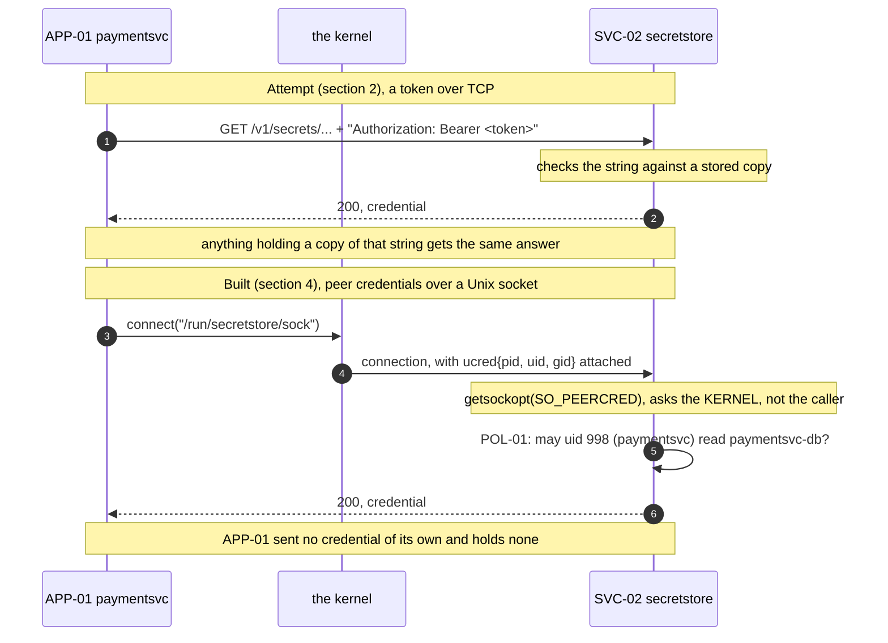
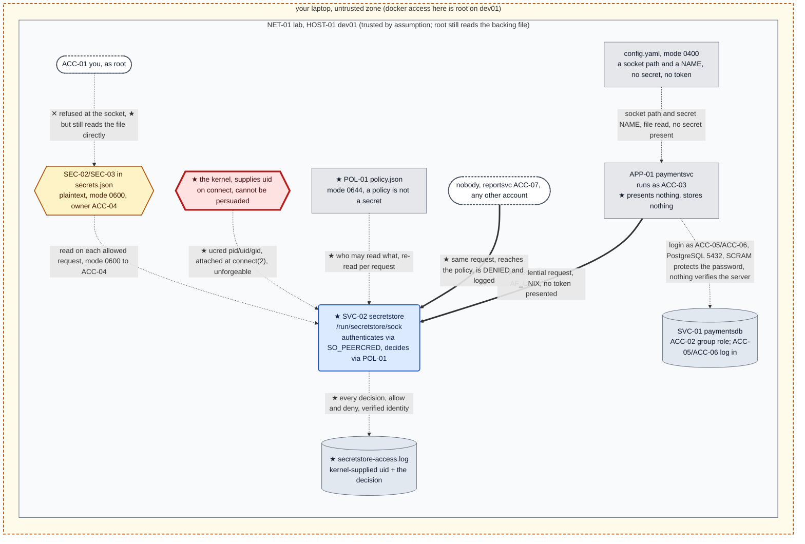

# Chapter 03, Who is asking?

**System before this chapter.** One machine, `HOST-01 dev01`. `APP-01 paymentsvc` fetches its
database credential at run time from `SVC-02 secretstore`, which holds it in one authoritative
place and serves it over `127.0.0.1:8300`. Rotation is one write with zero downtime, verified
by consumer convergence before the old credential dies. `SEC-01` and all sixteen of its copies
are dead. Chapter 02 closed a real problem and left a worse one behind.

**The pressure.** `OT-010`. `SVC-02` answers anyone who can open a socket to it. It cannot tell
`APP-01` from `nobody` running `curl`, and the "consumer" recorded in its audit log is a string
the caller wrote about itself. Chapter 02 §10 ended with a line that has been waiting for this
chapter:

> **A port has no owner.**

Everything built so far is worth less until that is fixed. Rotation is excellent and pointless
if the current value is available to any process on the box. An audit trail is excellent and
pointless if the identities in it are self-declared.

**What you'll have working by the end of this chapter.**

- A store that knows, as a matter of fact rather than assertion, which process is calling it,
  and refuses the ones it does not recognise.
- `POL-01`, the first authorization policy in this build: an explicit statement of which
  identity may read which secret, consulted on every request.
- An audit log whose every field comes from the kernel or from our own decision, so it records
  what happened rather than what someone said.
- The first **blue node** in the architecture. Chapter 02 ended by pointing out there wasn't
  one, and why that mattered.
- A precise account of what this identity is worth, where it stops working, and the one thing
  it quietly avoided having to solve.

---

## 0. If your output differs

Machine-specific values (process IDs, timestamps, uid numbers) appear as placeholders like
`<pid>`, or will simply differ from what is shown. **Uid numbers in particular will not match
yours**: Debian allocates system accounts from the top of a range downward, so `paymentsvc`
might be `998` here and `997` on your machine. Nothing depends on the number, only on the
mapping between number and name.

Otherwise your output should match. If it does not, the two usual causes are a different
PostgreSQL major version (`sudo docker exec dev01 psql --version`) and a different Docker storage
driver.

Work in this chapter's `lab/` folder, which holds the **whole lab**, not just what this
chapter adds:

```bash
cd "Chapter 03/lab"
find . -type f | sort
```

Expected:

```
./dev01/Dockerfile
./dev01/app/config.yaml
./dev01/app/paymentsvc.py
./dev01/entrypoint.sh
./dev01/initdb.sql
./dev01/secretstore/policy.json
./dev01/secretstore/secretstore-set.py
./dev01/secretstore/secretstore.py
./docker-compose.yml
```

### The lab in full

What **this** chapter writes is marked ★:

```
lab/
├── docker-compose.yml                Chapter 01
└── dev01/
    ├── Dockerfile                    Chapter 01
    ├── entrypoint.sh                 Chapter 01
    ├── initdb.sql                    Chapter 01   seed only, history not state
    ├── app/
    │   ├── config.yaml             ★ changed: a socket path, not a URL
    │   └── paymentsvc.py           ★ changed: Unix socket client, 403 is fatal
    └── secretstore/
        ├── secretstore.py          ★ changed: peer credentials and POL-01
        ├── secretstore-set.py        Chapter 02
        └── policy.json             ★ new: POL-01
```

**Do not rebuild here.** The compose file is byte-identical to Chapter 01's, so a plain
`docker compose up -d` is a no-op on a running lab. `--build` would replace the container with
a fresh one and reset three chapters of accumulated state. This chapter does not build a
machine: Chapter 01 did, and that container has been running ever since.

### Before you start: this chapter continues an existing lab

`dev01` is built **once**, in Chapter 01. Every chapter after that deploys into the same
running container. This folder carries every file the running system uses, so you can read the
whole thing in one place, but **building from here does not give you this chapter's starting
state.** That state is what running the earlier chapters leaves behind: OS accounts, file modes,
database rows and files that no image contains.

Note also that a `healthy` container tells you PostgreSQL is accepting connections and
**nothing about the application**, which is started by hand because `HOST-01` has no service
manager. A green container with a silent port 8080 is the normal look of a lab nobody has
started yet.

If you have not worked the earlier chapters, start at Chapter 01. If you have, check that the
lab is where this chapter expects it:

```bash
sudo docker exec dev01 id secretstore
sudo docker exec dev01 su postgres -c "psql -d paymentsdb -tAc \
  \"SELECT rolname, rolcanlogin FROM pg_roles WHERE rolname LIKE 'paymentsvc%' ORDER BY 1\""
curl -s http://127.0.0.1:8080/credinfo
```

Expected: a uid and gid for `secretstore`; `paymentsvc|f`, `paymentsvc_a|f`, `paymentsvc_b|t`,
which is Chapter 02's group-role split with the first credential already retired; and
`{"db_user": "paymentsvc_b", "secret_name": "paymentsvc-db", "credential_version": 4}`. The
`credinfo` reply has no `running_as` field yet: that is this chapter's work.

If the container is stopped, or those commands cannot reach it, start everything first.
`SVC-02` must be running before `APP-01`, which is `OT-012`:

```bash
sudo docker start dev01
sleep 2
sudo docker exec -d -u secretstore dev01 \
    sh -c 'python3 /opt/secretstore/secretstore.py >>/var/log/secretstore.out 2>&1'
sleep 1
sudo docker exec -d -u paymentsvc dev01 \
    sh -c 'python3 /opt/paymentsvc/paymentsvc.py >>/var/log/paymentsvc.out 2>&1'
```

Expected: `{"status": "ok"}` from a `curl` to `/healthz`, and the state check above passing.

**If the state check still fails after that**, the container is not in this chapter's starting
state at all. The usual cause is having built the image from this folder instead of continuing
the container Chapter 01 built. There is no shortcut back:

```bash
sudo docker rm -f dev01
cd "../../Chapter 01/lab" && sudo docker compose up -d --build dev01
```

Then work Chapters 01 onward forward again.

---

## 1. What "identity" has to mean here

Reproduce the problem in one command, so it is in front of you rather than in a previous
chapter:

```bash
sudo docker exec dev01 su -s /bin/sh nobody -c \
    'curl -s http://127.0.0.1:8300/v1/secrets/paymentsvc-db'
```

Expected: the production database credential, in full, handed to the most powerless account on
the machine.

`SVC-02` is not malfunctioning. It was asked a question and it answered. The problem is that it
has no way to ask a question of its own, namely: *what is at the other end of this connection?*

It is worth being precise about the two kinds of answer that question can have, because the
whole chapter is the difference between them.

**An answer the caller supplies.** A token in a header, a username and password, an API key, a
`X-Consumer` string. The caller constructs it and sends it. The store's job is to check it
against something it already knows. Call this a **claim**: it is only as good as the caller's
ability to keep the evidence to itself, and it is *transferable*, because anything that obtains
a copy can make the same claim.

**An answer the system observes.** The store does not ask the caller anything. It asks a third
party that already knows, and that the caller cannot influence. There is exactly one such party
available on a single machine, and Chapter 01 already introduced it: **the kernel**. It is the
thing that enforces file modes, the thing that decides that `nobody` is `nobody`, and the thing
that is not open to persuasion.

Chapter 01 leaned on the kernel via file permissions and it worked. Chapter 02 gave that up in
exchange for rotation, and the store lost the ability to tell callers apart. What we want is
the kernel's answer back, without giving up run-time delivery.

Start with the obvious approach anyway, because it is what most systems do and it is worth
understanding exactly how far it gets.

---

## 2. Attempt: give the application a token

Give `APP-01` a secret string. It presents it on every request; the store checks it. About
fifteen lines in the store:

```python
TOKEN_PATH = os.environ.get("SECRETSTORE_TOKEN", "/etc/secretstore/token")

def expected_token():
    with open(TOKEN_PATH) as fh:
        return fh.read().strip()

# ...at the top of do_GET, before anything else:
    presented = self.headers.get("Authorization", "")
    if presented != f"Bearer {expected_token()}":
        return self._json(401, {"error": "unauthorized"})
```

Run it and it does exactly what it says. Without a token:

```
401 {"error": "unauthorized"}
```

With a wrong token, the same `401`. With the right one:

```
200 {"name": "paymentsvc-db", "version": 4, "value": "{\"user\": \"paymentsvc_b\", ...
```

That is progress and it should be acknowledged: `nobody` running a bare `curl` no
longer gets the credential. Most production secret stores work broadly this way.

Now count what it did not do.

**The token is a secret in a file, so we have moved the problem rather than solved it.** To
present the token, `APP-01` has to read it from somewhere, and that somewhere is
`/etc/secretstore/token`, mode `0400`, owned by `paymentsvc`. Look at that sentence next to
Chapter 00's opening: a credential, in plaintext, in a file, protected by a file mode. We have
travelled three chapters to arrive back at the thing we started with, and this time there are
two of them.

**And that new secret had to get onto the machine somehow.** Someone or something put it there:
a human with `docker cp`, a deploy script, a configuration management tool, a container image
layer. Whatever did that needed its own credential to be trusted to do it. That regress has a
name, and this is the moment in the build to name it:

> **Secret zero** is the first secret in a chain: the one credential a system must already
> possess before it can obtain any of the others. Every system that authenticates with a stored
> secret has one, and it cannot be solved by adding another layer of stored secrets, because
> each layer needs its own.

**And a token is bearer.** This is the deepest problem and it is easy to miss because the token
"works". A bearer credential grants access to whoever presents it, with no reference to who
they are. Copy the token out of that file and you *are* `APP-01`, as far as the store can tell,
forever, from anywhere. The store is not identifying the application. It is identifying
*knowledge of a string*, and then assuming that only the application has it.

Which means the token is still a **claim**. It is a well-guarded claim, and guarding it better
is what most of the industry's effort goes into, but the store is still trusting something the
caller sent it.

So: discard it. It is not a bad idea; it is the right idea for a case we do not have yet, and
it will come back in a later chapter when the caller is on a different machine and there is no
alternative. On one machine, there is a strictly better answer available for free.

---

## 3. Ask the kernel instead

When a process connects to a **Unix domain socket**, the kernel knows exactly which process did
it, because the kernel is the thing that performed the connection. It will tell the listening
side, on request, via a socket option called `SO_PEERCRED`:

```python
raw = conn.getsockopt(socket.SOL_SOCKET, socket.SO_PEERCRED, struct.calcsize("3i"))
pid, uid, gid = struct.unpack("3i", raw)
```

Three integers, filled in by the kernel at `connect(2)` time from the peer's actual process
credentials. The caller does not send them. The caller cannot set them, spoof them, or decline
to provide them. There is no header to forge, because there is no header.

This is a different category of thing from a token, and the distinction is worth
holding on to for the rest of this build:

| | Token | `SO_PEERCRED` |
|---|---|---|
| Where the answer comes from | The caller | The kernel |
| Can the caller influence it? | Yes, it constructs it | No |
| Is it transferable? | Yes, copy it and you are them | No, you would have to *become* that uid |
| What must the caller store? | A secret | **Nothing** |
| Works across a network? | Yes | **No** |

Look at the last two rows together, because they are the trade this chapter makes. We get an
identity that cannot be stolen or replayed, that requires the application to hold no secret at
all, and therefore has no secret zero. In exchange, it works only between two processes sharing
a kernel.

Figure 3.1 shows the two exchanges side by side.



**Figure 3.1, a claim, and an observation.** In the upper exchange the store learns who is
calling from the caller, so its confidence is bounded by how well a string was kept. In the
lower exchange the store learns it from the kernel, which attached the peer's real credentials
to the connection when it set the connection up. Steps 5 and 6 are the two halves this chapter
adds: establish *who*, then *decide*. Note what is absent from the lower exchange: the
application transmits no secret and stores none.

There is a cost, and the ledger has been holding a space for it since Chapter 00. `SO_PEERCRED`
exists only for Unix domain sockets. There is no TCP equivalent, and there cannot be one: the
whole mechanism depends on a single kernel that saw both ends of the connection, and two
machines do not share one. So `SVC-02` has to stop listening on a TCP port and start listening
on a socket file.

That is also why the path `/run/secretstore/sock` is about to appear. Chapter 00's naming
rules reserved `/run/<appname>/` for "anything we later mount, inject or template", to be
introduced when a pressure required it rather than because it is conventional. This is the
pressure.

---

## 4. Build it

### 4.1 The store

`dev01/secretstore/secretstore.py`, replacing the Chapter 02 version. The differences are the
`peer_identity()` function, the policy check in `do_GET`, the audit format, and the server
class at the bottom.

```python
#!/usr/bin/env python3
"""SVC-02 secretstore, now it asks the kernel who is calling, and decides.

Chapter 03. Two changes from Chapter 02, and they are the whole chapter:

  1. It listens on a Unix domain socket instead of a TCP port, so the kernel
     can tell it the uid of the process at the other end. That is not a claim
     the caller makes. It is the same authority that enforces file modes.
  2. It consults POL-01 and REFUSES requests it is not willing to serve.

It still does not encrypt anything (AR-001), and it still cannot help you
once the caller is on a different machine, see OT-014.
"""

import json
import os
import pwd
import socket
import struct
import sys
import time
from http.server import BaseHTTPRequestHandler, ThreadingHTTPServer

STORE_PATH = os.environ.get("SECRETSTORE_DB", "/var/lib/secretstore/secrets.json")
POLICY_PATH = os.environ.get("SECRETSTORE_POLICY", "/etc/secretstore/policy.json")
ACCESS_LOG = os.environ.get("SECRETSTORE_ACCESS_LOG", "/var/log/secretstore-access.log")
SOCKET_PATH = os.environ.get("SECRETSTORE_SOCKET", "/run/secretstore/sock")


def load_store():
    with open(STORE_PATH) as fh:
        return json.load(fh)


def load_policy():
    """POL-01, re-read on every request so an edit takes effect immediately.

    Cheap here, and it means a policy change does not need a restart. A real
    system caches this and invalidates deliberately.
    """
    with open(POLICY_PATH) as fh:
        return json.load(fh)


def peer_identity(conn):
    """Ask the kernel who is at the other end of this socket.

    SO_PEERCRED returns a `struct ucred`, pid, uid, gid, filled in by the
    kernel at connect(2) time from the peer's actual process credentials.
    The caller does not supply it and cannot influence it.

    This is Linux-specific, and it is the reason this store now listens on a
    Unix socket rather than a TCP port: there is no equivalent for TCP,
    because there is no shared kernel to ask.
    """
    raw = conn.getsockopt(socket.SOL_SOCKET, socket.SO_PEERCRED,
                          struct.calcsize("3i"))
    pid, uid, gid = struct.unpack("3i", raw)
    return pid, uid, gid


def username_for(uid):
    try:
        return pwd.getpwuid(uid).pw_name
    except KeyError:
        return f"uid:{uid}"


def audit(pid, uid, name, secret, version, decision):
    """One line per request. Every field except `secret` now comes from the
    kernel or from our own policy evaluation. Nothing here is self-declared,
    which is the difference between this log and Chapter 02's.
    """
    line = "\t".join([
        time.strftime("%Y-%m-%dT%H:%M:%S%z"),
        f"pid={pid}", f"uid={uid}", name, secret, str(version), decision,
    ])
    with open(ACCESS_LOG, "a") as fh:
        fh.write(line + "\n")


def consumers_for(secret):
    """Who holds a copy of this secret, now a list of verified identities.

    Same structural limit as Chapter 02: it can only see consumers that have
    actually asked us. What changed is that the names in it are facts.
    """
    seen = {}
    try:
        with open(ACCESS_LOG) as fh:
            for raw in fh:
                p = raw.rstrip("\n").split("\t")
                if len(p) != 7:
                    continue
                ts, pid, uid, name, sec, version, decision = p
                if sec != secret or decision != "allow":
                    continue
                seen[name] = {
                    "consumer": name,
                    "uid": int(uid.split("=", 1)[1]),
                    "last_seen": ts,
                    "last_version_served": int(version),
                }
    except FileNotFoundError:
        pass
    return sorted(seen.values(), key=lambda c: c["consumer"])


class Handler(BaseHTTPRequestHandler):
    server_version = "secretstore/0.2"

    # client_address is '' on AF_UNIX; the peer's identity comes from the
    # kernel instead, so the default implementation would be both useless
    # and slow (it tries a reverse DNS lookup).
    def address_string(self):
        return "unix"

    def _json(self, code, payload):
        body = json.dumps(payload).encode()
        self.send_response(code)
        self.send_header("Content-Type", "application/json")
        self.send_header("Content-Length", str(len(body)))
        self.end_headers()
        self.wfile.write(body)

    def do_GET(self):
        pid, uid, _gid = peer_identity(self.connection)
        name = username_for(uid)

        if self.path == "/healthz":
            return self._json(200, {"status": "ok"})

        parts = self.path.strip("/").split("/")

        if len(parts) == 3 and parts[0] == "v1" and parts[1] == "secrets":
            secret = parts[2]
            store = load_store()
            if secret not in store:
                audit(pid, uid, name, secret, -1, "not_found")
                return self._json(404, {"error": "no such secret"})

            allowed = load_policy().get(secret, [])
            if name not in allowed:
                audit(pid, uid, name, secret, store[secret]["version"], "deny")
                return self._json(403, {
                    "error": "denied",
                    "secret": secret,
                    "you_are": name,
                    "detail": "POL-01 does not permit this identity to read "
                              "this secret",
                })

            entry = store[secret]
            audit(pid, uid, name, secret, entry["version"], "allow")
            return self._json(200, {
                "name": secret,
                "version": entry["version"],
                "updated": entry["updated"],
                "value": entry["value"],
            })

        if (len(parts) == 4 and parts[0] == "v1" and parts[1] == "secrets"
                and parts[3] == "consumers"):
            secret = parts[2]
            store = load_store()
            if secret not in store:
                return self._json(404, {"error": "no such secret"})
            return self._json(200, {
                "name": secret,
                "current_version": store[secret]["version"],
                "consumers": consumers_for(secret),
                "caveat": "derived from observed reads only; a consumer that "
                          "never asks us is invisible here",
            })

        return self._json(404, {"error": "not found"})

    def do_PUT(self):
        return self._json(405, {"error": "this store is read-only over the socket"})

    do_POST = do_PUT
    do_DELETE = do_PUT

    def log_message(self, fmt, *args):
        sys.stdout.write((fmt % args) + "\n")
        sys.stdout.flush()


class UnixHTTPServer(ThreadingHTTPServer):
    address_family = socket.AF_UNIX

    def server_bind(self):
        # ThreadingHTTPServer.server_bind wants a host/port to derive a
        # server name from; there is neither on AF_UNIX.
        socket.socket.bind(self.socket, self.server_address)
        self.server_name = "localhost"
        self.server_port = 0


if __name__ == "__main__":
    if os.path.exists(SOCKET_PATH):
        os.unlink(SOCKET_PATH)
    srv = UnixHTTPServer(SOCKET_PATH, Handler)
    # 0666 deliberately: anything may CONNECT, and the policy decides.
    # See Chapter 03 section 5, a narrower mode would make the filesystem
    # refuse callers silently, and we want every refusal in the audit log.
    os.chmod(SOCKET_PATH, 0o666)
    print(f"secretstore listening on {SOCKET_PATH}, policy={POLICY_PATH}")
    sys.stdout.flush()
    srv.serve_forever()
```

Three things in there repay a second look.

`peer_identity()` is four lines and it is the entire authentication mechanism of this chapter.
There is no password comparison, no signature check, no cryptography of any kind. Authentication
here is a *question to the operating system*, and it is stronger than anything we could have
built out of a shared string.

`address_string()` had to be overridden. On `AF_UNIX` there is no peer address at all, so
`client_address` is the empty string and the default implementation would try to reverse-DNS
it. That is a small practical detail with a large idea inside it: the socket genuinely has no
network identity to report. The only identity available is the process one, from the kernel.

`load_policy()` re-reads the file on every request. That is inefficient and deliberate: it means
you can edit `POL-01` and see the effect on the next call, which makes §7 possible to
experiment with. Note the comment saying a real system would cache it, so nobody copies this
into production and discovers it at scale.

### 4.2 The policy

`dev01/secretstore/policy.json`. This is `POL-01`, the first authorization policy in the build:

```json
{
  "paymentsvc-db": ["paymentsvc"]
}
```

One secret, one identity permitted to read it. That is the whole file, and its smallness is
worth noticing: everything expensive about authorization is in *establishing who is asking*,
which §3 did. Once you have a trustworthy answer to that, the decision itself is a dictionary
lookup.

The names on the right are **OS usernames**, resolved from the uid the kernel reported. Not
strings the caller chose.

### 4.3 The application

`dev01/app/config.yaml` loses the URL and gains a socket path:

```yaml
# /opt/paymentsvc/config.yaml
database:
  host: localhost
  port: 5432
  name: paymentsdb
secret_store:
  socket: /run/secretstore/sock
  secret_name: paymentsvc-db
server:
  listen: 0.0.0.0:8080
```

Still no secret in this file, and now not even a port. Note what a chapter about authentication
did *not* add to it: any credential for talking to the store.

`dev01/app/paymentsvc.py`, in full. Only two things changed from Chapter 02: how it reaches the
store, and what it does when refused.

```python
#!/usr/bin/env python3
"""APP-01 paymentsvc, answers 'what is the status of payment X?'

Chapter 03 change: the credential is fetched over a Unix domain socket
instead of a TCP port. The app sends no token and makes no claim about who
it is, the kernel tells SVC-02 that, and SVC-02 decides.

Note what is NOT here: no credential for the credential store. That absence
is the point of Chapter 03.
"""

import http.client
import json
import logging
import os
import pwd
import socket
import sys
from http.server import BaseHTTPRequestHandler, ThreadingHTTPServer

import psycopg2
import yaml
from psycopg2.extras import RealDictCursor

CONFIG_PATH = os.environ.get("PAYMENTSVC_CONFIG", "/opt/paymentsvc/config.yaml")

logging.basicConfig(
    level=os.environ.get("LOG_LEVEL", "INFO").upper(),
    format="%(asctime)s %(levelname)s %(message)s",
    handlers=[
        logging.FileHandler("/var/log/paymentsvc.log"),
        logging.StreamHandler(sys.stdout),
    ],
)
log = logging.getLogger("paymentsvc")


def load_config(path):
    log.info("loading configuration from %s", path)
    with open(path) as fh:
        cfg = yaml.safe_load(fh)
    log.debug("effective configuration: %s", cfg)
    return cfg


class UnixHTTPConnection(http.client.HTTPConnection):
    """An HTTP client that speaks over a Unix domain socket.

    The only difference from an ordinary HTTPConnection is where connect()
    points. Everything above it, requests, status codes, headers, is
    unchanged, which is why moving SVC-02 off TCP cost so little here.
    """

    def __init__(self, socket_path, timeout=5):
        super().__init__("localhost", timeout=timeout)
        self.socket_path = socket_path

    def connect(self):
        sock = socket.socket(socket.AF_UNIX, socket.SOCK_STREAM)
        sock.settimeout(self.timeout)
        sock.connect(self.socket_path)
        self.sock = sock


def fetch_credential(socket_path, secret_name):
    """Ask SVC-02 for the current database credential.

    We present no token and assert no identity. The kernel tells the store
    our uid when we connect, and the store applies POL-01 to it. If it says
    no, we get a 403 and fail loudly, being refused is not something to
    paper over.
    """
    conn = UnixHTTPConnection(socket_path)
    try:
        conn.request("GET", f"/v1/secrets/{secret_name}")
        resp = conn.getresponse()
        body = resp.read().decode()
        if resp.status == 403:
            raise PermissionError(
                f"secretstore refused this process: {json.loads(body).get('detail')}"
            )
        if resp.status != 200:
            raise RuntimeError(f"secretstore returned {resp.status}: {body}")
        payload = json.loads(body)
    finally:
        conn.close()
    cred = json.loads(payload["value"])
    log.info("fetched %s version %s as user %s",
             secret_name, payload["version"], cred["user"])
    return cred["user"], cred["password"], payload["version"]


class Database:
    """Owns the connection and the credential it was made with."""

    def __init__(self, cfg):
        self.cfg = cfg
        self.conn = None
        self.user = None
        self.version = None
        self.connect()

    def connect(self):
        db = self.cfg["database"]
        store = self.cfg["secret_store"]
        user, password, version = fetch_credential(
            store["socket"], store["secret_name"]
        )
        self.conn = psycopg2.connect(
            host=db["host"], port=db["port"], dbname=db["name"],
            user=user, password=password,
        )
        self.conn.autocommit = True
        self.user, self.version = user, version
        log.info("connected to %s@%s:%s/%s (credential version %s)",
                 user, db["host"], db["port"], db["name"], version)

    def query(self, sql, args):
        """Run a query; on a connection-level failure, re-fetch and retry once."""
        try:
            return self._query(sql, args)
        except psycopg2.OperationalError as exc:
            log.warning("connection failed (%s), re-fetching credential", exc)
            self.connect()
            return self._query(sql, args)

    def _query(self, sql, args):
        with self.conn.cursor(cursor_factory=RealDictCursor) as cur:
            cur.execute(sql, args)
            return cur.fetchone()


cfg = load_config(CONFIG_PATH)
database = Database(cfg)


class Handler(BaseHTTPRequestHandler):
    server_version = "paymentsvc/0.3"

    def _json(self, code, payload):
        body = json.dumps(payload).encode()
        self.send_response(code)
        self.send_header("Content-Type", "application/json")
        self.send_header("Content-Length", str(len(body)))
        self.end_headers()
        self.wfile.write(body)

    def do_GET(self):
        if self.path == "/healthz":
            return self._json(200, {"status": "ok"})

        if self.path == "/credinfo":
            return self._json(200, {
                "db_user": database.user,
                "secret_name": cfg["secret_store"]["secret_name"],
                "credential_version": database.version,
                "running_as": pwd.getpwuid(os.getuid()).pw_name,
                "uid": os.getuid(),
            })

        parts = self.path.strip("/").split("/")
        if len(parts) == 3 and parts[0] == "payments" and parts[2] == "status":
            try:
                payment_id = int(parts[1])
            except ValueError:
                return self._json(400, {"error": "payment id must be an integer"})
            row = database.query(
                "SELECT id, reference, amount_cents, currency, status "
                "FROM payments WHERE id = %s",
                (payment_id,),
            )
            if row is None:
                return self._json(404, {"error": "no such payment"})
            return self._json(200, dict(row))

        return self._json(404, {"error": "not found"})

    def log_message(self, fmt, *args):
        log.info("%s %s", self.address_string(), fmt % args)


if __name__ == "__main__":
    host, _, port = cfg["server"]["listen"].rpartition(":")
    srv = ThreadingHTTPServer((host, int(port)), Handler)
    log.info("listening on %s", cfg["server"]["listen"])
    srv.serve_forever()
```

`UnixHTTPConnection` is the whole transport change: a five-line subclass that redirects
`connect()` at a socket path. Everything above it, the request, the status code, the JSON, is
identical to Chapter 02, which is why moving `SVC-02` off TCP cost so little on this side.

`fetch_credential()` gained one branch, for `403`. Note that being refused is **fatal**, not
retried. A refusal is not a transient failure: the retry logic exists to survive a rotation,
and retrying a policy denial would just produce a stream of identical entries in someone's
audit log while delaying the moment a human notices the policy is wrong. Fail fast on a
decision; retry only on a fault.

`/credinfo` now reports `running_as` and `uid`, because in this chapter the identity the process
runs as is part of whether it works at all.

Everything else, including the re-fetch-on-failure retry that makes rotation invisible, is
exactly as Chapter 02 left it.

### 4.4 Deploy it

The store needs a directory for its socket, and the modes matter enough to get their own
section immediately after this one:

```bash
sudo docker exec dev01 mkdir -p /run/secretstore /etc/secretstore
sudo docker exec dev01 chown secretstore:secretstore /run/secretstore /etc/secretstore
sudo docker exec dev01 chmod 0755 /run/secretstore
sudo docker exec dev01 chmod 0755 /etc/secretstore
```

Copy the new files in:

```bash
sudo docker cp dev01/secretstore/secretstore.py dev01:/opt/secretstore/secretstore.py
sudo docker cp dev01/secretstore/policy.json    dev01:/etc/secretstore/policy.json
sudo docker cp dev01/app/paymentsvc.py          dev01:/opt/paymentsvc/paymentsvc.py
sudo docker cp dev01/app/config.yaml            dev01:/opt/paymentsvc/config.yaml

sudo docker exec dev01 chown secretstore:secretstore \
    /opt/secretstore/secretstore.py /etc/secretstore/policy.json
sudo docker exec dev01 chmod 0644 /etc/secretstore/policy.json
sudo docker exec dev01 chown paymentsvc:paymentsvc \
    /opt/paymentsvc/paymentsvc.py /opt/paymentsvc/config.yaml
sudo docker exec dev01 chmod 0400 /opt/paymentsvc/config.yaml
```

`policy.json` is `0644`, world-readable, on purpose. A policy is not a secret. Anyone able to
read it learns that `paymentsvc` may read `paymentsvc-db`, which tells them nothing they could
not infer, and being able to inspect the rules that govern you is a property worth having.
Compare `secrets.json` at `0600`: that one holds values.

Restart both processes, store first:

```bash
sudo docker exec dev01 pkill -f secretstore.py || true
sudo docker exec dev01 pkill -f paymentsvc.py || true

sudo docker exec -d -u secretstore dev01 \
    sh -c 'python3 /opt/secretstore/secretstore.py >>/var/log/secretstore.out 2>&1'
sleep 1
sudo docker exec dev01 ls -l /run/secretstore/
```

Expected: a socket file, shown with a leading `s`:

```
srw-rw-rw- 1 secretstore secretstore 0 <date> sock
```

That leading `s` is the file type: this is a socket, not a regular file. The `rw-rw-rw-` is
`0666`, and it is the subject of the next section.

---

## 5. Why the socket is world-writable on purpose

This looks like a mistake. It is the most considered line in the chapter.

Connecting to a Unix socket requires **write permission on the socket file**. You can verify
that the permission bits really do gate `connect(2)`:

```bash
sudo docker exec dev01 sh -c 'chmod 0000 /run/secretstore/sock && \
    su -s /bin/sh nobody -c "curl -s --unix-socket /run/secretstore/sock \
    http://localhost/healthz"; echo "exit=$?"'
```

Expected: curl fails to connect, non-zero exit. Put it back:

```bash
sudo docker exec dev01 chmod 0666 /run/secretstore/sock
```

So the socket mode is a real access control, and we have a choice:

| Mode | Who can connect | Who decides | What the audit log shows |
|---|---|---|---|
| `0660`, owner+group `secretstore` | Only `secretstore` and members of its group | **The filesystem** | Nothing. Refusals never reach the store. |
| `0666` | Anything on the host | **`SVC-02`, via `POL-01`** | Every attempt, allowed and denied, with the caller's real uid |

We choose `0666`, and the reason is the whole arc from Chapter 02 to here. Chapter 02 ended
with the observation that `SVC-02` was a data store rather than a control plane: it did not
*decide* anything. If we now gate access with a group membership, the filesystem goes on making
the decision silently and the store still decides nothing. We would have improved security and
learned nothing, and, more practically, a denied caller would produce no record anywhere.

Widening the socket so that every caller reaches the policy is what moves the decision into the
component that should be making it, and it is what makes refusals *visible*. An attacker
probing for the credential now appears in an audit log, which is worth considerably more than
their being bounced silently by a permission bit.

**The honest cost.** Any local process can now open a connection to the store, which means any
local process can waste its time: connection floods, slow-loris, filling the audit log with
junk. On a single-user machine this does not matter. In a real deployment it is a rate-limiting
and resource-control problem, and it is a new one that `0660` would not have had.

**What a reviewer would say, and they would be right:** do both. Gate the socket to a group
*and* enforce policy in the store, so that the common case is cheap and the policy is the
authoritative boundary. That is defence in depth, and it is the correct production answer. We
are not doing it here because it would obscure this chapter's point, which is that the store
must be able to decide for itself. Recorded as `D-027`.

Now the directory:

```bash
sudo docker exec dev01 namei -l /run/secretstore/sock
```

Expected: every directory on the path traversable (`r-x` for others), `/run/secretstore` owned
by `secretstore` and `drwxr-xr-x`, and the socket itself `srw-rw-rw-`.

`0755` on the directory, not `0700`, and both halves of that matter:

- **`r-x` for others** so that callers can traverse into the directory and reach the socket at
  all. With `0700` the filesystem would refuse them before the store ever saw them, which is the
  same silent-refusal problem as a narrow socket mode.
- **No `w` for others** so that nobody else can create files there. This is what stops an
  impostor: to pose as `SVC-02`, an attacker would have to place their own socket at that path,
  and only `secretstore` and root can write to the directory.

That second point closes something Chapter 02 left open. `OT-013` worried that `APP-01` had no
way to verify what answered on port 8300. It now does, transitively: the path is in a directory
only the store's own identity can write to, so whatever is listening there was put there by
`SVC-02` or by root.

---

## 6. Make it fail: start the application the way you always have

Start `APP-01` exactly as every previous chapter has, and note what is missing from the command:

```bash
sudo docker exec -d dev01 \
    sh -c 'python3 /opt/paymentsvc/paymentsvc.py >>/var/log/paymentsvc.out 2>&1'
sleep 2
curl -s http://127.0.0.1:8080/healthz
```

Expected: `curl` fails to connect. The service is not running.

```bash
sudo docker exec dev01 tail -4 /var/log/paymentsvc.out
```

Expected, ending in:

```
PermissionError: secretstore refused this process: POL-01 does not permit this identity to read this secret
```

### 6.1 Diagnose it

For the first time in this build, the audit log is the diagnostic tool:

```bash
sudo docker exec dev01 tail -3 /var/log/secretstore-access.log
```

Expected, with your own timestamp and pid:

```
2026-08-17T09:14:22+0200	pid=<pid>	uid=0	root	paymentsvc-db	4	deny
```

There is the answer, and it is a fact rather than a guess: the process that connected was
running as **uid 0, root**, and `POL-01` does not list `root` as permitted to read
`paymentsvc-db`.

The cause is the missing `-u paymentsvc` in the `docker exec` command. Without it the container
runs the process as root. Chapter 01 established `ACC-03` and every chapter since has started
the app with `-u paymentsvc`; here that flag stopped being a good habit and became load-bearing.

That is the lesson of this failure. In Chapter 01 the app's identity mattered because it
determined which *files* it could open. Now it determines what the application *is*, at run
time, to another component. Getting it wrong no longer produces a subtle permissions problem;
it produces a refusal, in a log, naming the identity that was refused.

### 6.2 Fix it

```bash
sudo docker exec dev01 pkill -f paymentsvc.py || true
sudo docker exec -d -u paymentsvc dev01 \
    sh -c 'python3 /opt/paymentsvc/paymentsvc.py >>/var/log/paymentsvc.out 2>&1'
sleep 2
curl -s http://127.0.0.1:8080/payments/1001/status
curl -s http://127.0.0.1:8080/credinfo
```

Expected:

```json
{"id": 1001, "reference": "INV-2026-0001", "amount_cents": 249900, "currency": "EUR", "status": "settled"}
{"db_user": "paymentsvc_b", "secret_name": "paymentsvc-db", "credential_version": 4, "running_as": "paymentsvc", "uid": 998}
```

`/credinfo` now reports the identity the process is running as, because in this chapter that is
part of what determines whether it works.

### 6.3 The part you must not misread

Root was refused. That is a real and satisfying thing to watch, and it is the first time in
three chapters that anything in this system has said no to root.

**It is also much narrower than it looks.** What was refused was root *as a requester*, coming
through the front door. Root as a filesystem principal is untouched:

```bash
sudo docker exec dev01 cat /var/lib/secretstore/secrets.json
```

Expected: the credential, in plaintext, straight out of the backing file, with no policy
consulted and no audit line written.

So `POL-01` does not contain root and cannot. `OT-004` has not moved. What has changed is
smaller and still worth having: a process running as root that goes through the store's
interface is now identified and refused *and logged*, which means an automated agent, a
misconfigured service, or a careless `docker exec` gets caught. An attacker who is already root
and knows where the file is does not.

Do not let the demonstration teach you that the policy protects you from root. It protects you
from everything that politely uses the door.

---

## 7. `POL-01` in action

The policy has one line, so let it earn its place by showing it discriminating between four
identities. First create a second service account, so there is a realistic thing to refuse that
is neither `nobody` nor root:

```bash
sudo docker exec dev01 useradd --system --shell /usr/sbin/nologin reportsvc
sudo docker exec dev01 id reportsvc
```

Expected: a uid and gid, no supplementary groups. That is `ACC-07`: a plausible second service
that has every reason to exist and no business reading the payments database credential.

Now ask the store the same question as four different identities:

```bash
for u in paymentsvc nobody root reportsvc; do
  printf '%-12s ' "$u"
  sudo docker exec dev01 su -s /bin/sh "$u" -c \
    'curl -s --unix-socket /run/secretstore/sock \
     http://localhost/v1/secrets/paymentsvc-db' | head -c 96
  echo
done
```

Expected:

```
paymentsvc   {"name": "paymentsvc-db", "version": 4, "updated": "...", "value": "{\"user\": \"payments
nobody       {"error": "denied", "secret": "paymentsvc-db", "you_are": "nobody", "detail": "POL-01 do
root         {"error": "denied", "secret": "paymentsvc-db", "you_are": "root", "detail": "POL-01 does
reportsvc    {"error": "denied", "secret": "paymentsvc-db", "you_are": "reportsvc", "detail": "POL-01
```

Compare that with the identical loop at the start of §1, where every one of them got the
credential.

Note the `you_are` field. The store is telling the caller what identity it was seen as, which is
an operational kindness: the single most common cause of a mysterious `403` is running as
an identity you did not expect, and this turns twenty minutes of confusion into one line.

### 7.1 The audit log now records facts

```bash
sudo docker exec dev01 tail -5 /var/log/secretstore-access.log
```

Expected:

```
2026-08-17T09:20:11+0200	pid=<pid>	uid=998	paymentsvc	paymentsvc-db	4	allow
2026-08-17T09:20:11+0200	pid=<pid>	uid=65534	nobody	paymentsvc-db	4	deny
2026-08-17T09:20:11+0200	pid=<pid>	uid=0	root	paymentsvc-db	4	deny
2026-08-17T09:20:11+0200	pid=<pid>	uid=997	reportsvc	paymentsvc-db	4	deny
```

Put that next to Chapter 02's log, which contained this line:

```
2026-08-07T03:06:39+0200  127.0.0.1:54849  backup-agent-i-just-made-up   paymentsvc-db  4  served
```

Every identity in the new log came from the kernel. There is no field a caller can write. The
`pid` is there because it lets you correlate a denial with an actual process while it is still
running (`ps -p <pid>`), which is the difference between "something was denied" and "*that* was
denied".

Both halves of `OT-003` are now answered: something records, and something decides.

### 7.2 The consumer inventory is now trustworthy

```bash
sudo docker exec dev01 su -s /bin/sh paymentsvc -c \
  'curl -s --unix-socket /run/secretstore/sock \
   http://localhost/v1/secrets/paymentsvc-db/consumers'
```

Expected:

```json
{"name": "paymentsvc-db", "current_version": 4,
 "consumers": [{"consumer": "paymentsvc", "uid": 998, "last_seen": "...", "last_version_served": 4}],
 "caveat": "derived from observed reads only; a consumer that never asks us is invisible here"}
```

Chapter 02's version of this report contained `you@dev01`, a phantom left behind by a manual
`curl`, and could not distinguish it from a real consumer. This one lists verified OS
identities, and only those whose requests were *allowed*, so a denied prober does not pollute
your rotation checklist.

The `caveat` has not changed and must not be dropped. Verified identities do not make the
inventory complete. It still sees only consumers that ask; the tarball and the git history from
Chapter 01 remain invisible to it. `D-018`'s limit stands, and `PROC-01` step 4 still verifies
"every consumer we have seen has converged", not "the rotation is complete".

### 7.3 `PROC-01` still works, with one changed command

Rotation is unaffected in substance, but its convergence check went through the TCP port, which
no longer exists. Step 4 becomes:

```bash
sudo docker exec dev01 su -s /bin/sh secretstore -c \
  'curl -s --unix-socket /run/secretstore/sock \
   http://localhost/v1/secrets/paymentsvc-db/consumers'
```

Two changes worth noting. The transport is `--unix-socket`. And the command now has to be run
*as an identity the policy permits*, which means the operator's own convenience command is
subject to the same rules as the application. The `/consumers` endpoint deliberately does not
check policy: it returns names and versions, never values. Reaching it still requires
connecting, though, and it is good discipline to run it as a permitted identity rather than
as root.

That is the only change; the six steps themselves are untouched.

---

## 8. What just changed in the architecture



**Figure 3.2, the architecture after Chapter 03.** Compare it with Chapter 02's Figure 2.3 and
one thing jumps out before you read a single label.

**`SVC-02` is blue, and rounded.** It is the first control-plane node this build has ever had.
Chapter 00's visual language reserves that shape and colour for something that *decides or
issues*, and until this chapter nothing in the architecture qualified. Chapter 02 ended by
counting the blue nodes and finding none, and observing that we had built a server rather than
a decision. The notation has now changed of its own accord, because the thing it describes did.

The kernel appears as a **heavy red node**, the category the visual language reserves for a
cryptographic boundary: somewhere key material or trust originates and from which it cannot be
extracted. There is no cryptography in it, which is exactly why it earns the shape here. It is
the root of trust for identity on this machine, it cannot be persuaded or impersonated by
anything running above it, and every claim in the audit log traces back to it.

Two edges are still thick, `APP-01 →` and `nobody →`, because both still carry a request for
key material. They are no longer identical: one is answered and one is denied, and both are
recorded. In Figure 2.3 the two edges were indistinguishable, and that was the whole problem.

The `✕` edge is root, refused at the socket, with a `★` edge beside it going straight to the
backing file. Both are true and the figure states them together on purpose.

### Current one-line state

One machine; the credential lives in one authoritative place and is handed out only to a
process whose identity the kernel vouches for, against a written policy, with every decision
recorded as fact; the application holds no credential of its own and therefore has no secret
zero; and none of this survives the application moving to a second machine.

---

## 9. What this does not survive

`OT-010` is closed and the way it closed has a shape worth understanding, because the next
problem is already visible in it.

**The kernel that vouches is a kernel both processes share.** That is not an implementation
detail; it is the mechanism. `SO_PEERCRED` works because one kernel performed both ends of the
connection and can therefore speak about both. The moment `APP-01` runs on a different machine
from `SVC-02`, there is no such kernel, no socket file to connect to, and nothing to ask. Not
"it gets weaker": it does not exist.

And this build has been promising that separation since Chapter 01: `D-006` says the database
moves to its own host at Stage 2, and `OT-005` is waiting for exactly that move. When it
happens, this chapter's authentication mechanism goes to zero and has to be replaced with
something that crosses a network.

**What would that something be?** Look back at the comparison table in §3. Across a network the
caller must *transmit* something, so we are back to the caller presenting evidence. That means
back to a secret the workload must already possess, which means back to **secret zero**, which
this chapter avoided rather than solved. We avoided it honestly: the application holds nothing
because it does not need to, and that is a property worth having on one host. It is not a
solution that travels.

The escape from that regress is the thing this build has been deferring since Chapter 00: a
credential that can be *verified by someone who does not hold a copy of it*. That is what
asymmetric cryptography buys and it is why certificates exist. `OT-005` and `OT-014` will
collect that debt together.

**Recorded as `OT-014`:** peer credentials do not cross a machine boundary, so `SVC-02` will be
unable to authenticate anything the day the architecture has two hosts.

---

## 10. Decisions we made (and what would change them)

| # | Decision | Options | Chosen | Why | What would flip it |
|---|---|---|---|---|---|
| D-024 | Authenticate callers with kernel-supplied peer credentials, not a shared token | (a) bearer token in a file; (b) mutual TLS; (c) `SO_PEERCRED` over a Unix socket | (c) | (a) is a claim: transferable, and it requires the workload to store a secret that something else had to deliver, so it creates a secret-zero problem to solve an authentication problem. (b) is the right long-term answer and requires certificates, a CA and a key lifecycle, none of which any pressure has yet demanded, building it now would teach the manifests and hide the reasoning (`D-005`). (c) is unforgeable, requires the workload to hold nothing at all, and costs about four lines. | The architecture gaining a second host, which removes the shared kernel the mechanism depends on. That is `OT-014`, and it is when (b) becomes correct. |
| D-025 | `SVC-02` moves from TCP `127.0.0.1:8300` to a Unix socket at `/run/secretstore/sock` | (a) keep TCP and add tokens; (b) Unix socket | (b) | Forced by `D-024`: `SO_PEERCRED` has no TCP equivalent, because there is no shared kernel to ask. The move also happens to close `OT-013`, traffic over `AF_UNIX` never reaches a network interface and cannot be captured with `tcpdump`, and the socket's path sits in a directory only `secretstore` can write to, so the client can no longer be redirected to an impostor. `/run/<appname>/` was reserved for exactly this in Chapter 00's naming rules. | A second host. Then the socket is useless and TCP returns, this time with TLS. |
| D-026 | The socket is mode `0666`; the policy is the access boundary | (a) `0660` with a shared group, letting the filesystem gate connections; (b) `0666`, letting everything reach the policy | (b) | With (a) the filesystem keeps making the decision, silently, and `SVC-02` remains a data store that has not decided anything, the exact criticism Chapter 02 ended on. Worse, a refused caller leaves no trace anywhere. With (b) every attempt reaches the component that owns the rule, is judged against a written policy, and is recorded with the caller's real identity. Making refusals *visible* is worth more than making them cheap. | A hostile multi-tenant host, where unauthenticated connection floods stop being theoretical. Then do both, per `D-027`. |
| D-027 | Do not also gate the socket by group, even though a reviewer would ask for it | (a) socket group + policy (defence in depth); (b) policy only | (b), for now, and recorded as a known deviation from what production should do | Two overlapping controls would make it impossible to tell which one refused a caller, and this chapter exists to demonstrate that the store can decide for itself. Production should do (a): cheap rejection at the filesystem for the common case, policy as the authoritative boundary. | Any deployment that is not a teaching lab. This is the one decision in the build so far that is deliberately *not* the production answer, and it is flagged as such. |
| D-028 | `policy.json` is world-readable (`0644`); `secrets.json` stays `0600` | (a) restrict the policy too, on general principle; (b) leave it readable | (b) | A policy is not a secret. It contains rules, not values, and knowing that `paymentsvc` may read `paymentsvc-db` tells an attacker nothing they could not infer from the process list. Being able to inspect the rules that govern you is a property worth defending, a policy nobody can read is a policy nobody can review. Contrast `secrets.json`, which holds values, at `0600`. | A policy whose *contents* are sensitive, e.g. one that enumerates systems an attacker would not otherwise know exist. Then split it: public rules, restricted rules. |

---

## 11. Where this still hurts

**Peer credentials stop at the machine boundary.** The mechanism depends on a shared kernel.
The day the architecture has two hosts, `SVC-02` cannot authenticate anything. `OT-014`, and it
is the pressure that finally introduces certificates.

**Secret zero is avoided, not solved.** `APP-01` holds nothing today only because the kernel can
vouch for it. Any authentication that crosses a network requires the workload to possess
something first, and getting that first something onto the machine safely is untouched.

**Root reads the backing file.** `POL-01` refuses root at the socket and does nothing about
`cat /var/lib/secretstore/secrets.json`. `OT-004`, unchanged, and now with a sharper edge: we
have a policy that appears to constrain root and does not.

**The store still audits itself.** The access log is written by the component it describes.
Anything that compromises `SVC-02` can rewrite its own history. A real audit trail is append-only
and lives somewhere the audited component cannot reach.

**Everything is still plaintext at rest.** `AR-001`, unchanged. Encrypting it needs a key, and
a key is a secret with the same problem.

**The policy is a static allow-list, hand-edited.** It has no notion of *why* an identity is
permitted, no expiry, no review, and no way to express "may read during a deployment window".
It also has to be edited on the host, which is the file-editing problem `OT-002` closed for
secrets and has now quietly reappeared one level up, for rules.

**`APP-01` still cannot start without `SVC-02`**, and nothing manages the ordering. `OT-012`,
compounded by `OT-009`.

**Nothing expires.** `OT-007`, untouched. `PROC-01` remains a procedure a human chooses to run.

---

## 12. Chapter recap

- A store that answers anyone is not improved by better secrets; it is missing an *identity*.
- There are two kinds of answer to "who is calling": one the caller **supplies** (a claim) and
  one the system **observes**. Only the second is not transferable.
- A bearer token is a claim. Whoever presents it *is* the caller, so the store authenticates
  knowledge of a string and then assumes only one process has it.
- Adding a token means adding a secret in a file that something had to deliver. That is
  **secret zero**: the credential you must already have before you can get any of the others,
  and you cannot fix it by adding more stored secrets.
- `SO_PEERCRED` gives the kernel's answer: pid, uid and gid, filled in at `connect(2)`, that the
  caller cannot construct, forge or withhold. Four lines, no cryptography, and stronger than
  anything built from a shared string.
- It requires a Unix socket, because there is no TCP equivalent and there cannot be: the
  mechanism depends on one kernel having seen both ends.
- **The application now holds no credential at all.** Its identity is *what it is*, not *what it
  knows*, which is why it has no secret zero.
- Connecting to a Unix socket needs write permission on the socket file, so the socket mode is
  a real control. Setting it to `0666` deliberately moves the decision from the filesystem into
  the store, and turns silent refusals into audit lines. That trade is the whole Chapter 02 →
  Chapter 03 arc expressed as one `chmod`.
- The directory is `0755`: traversable so callers reach the policy, unwritable so nobody can
  plant an impostor socket at that path.
- A policy is not a secret. `policy.json` is world-readable, because a rule nobody can read is
  a rule nobody can review. Values stay at `0600`.
- Once identity is trustworthy, authorization is a dictionary lookup. Everything expensive is in
  establishing *who*.
- `Errno 13` was Chapter 01's wrong identity for a file. A `403` from your own secret store is
  the same mistake one layer up, and the audit log names the identity that was refused.
- Root refused at the socket is real, and narrow: it stops root *as a requester*, not root *as a
  filesystem principal*, who still reads the backing file with no policy consulted and no log
  line written.
- The first blue node arrived because the system genuinely started deciding, not because we
  redrew the diagram.
- All of it dies at the machine boundary. That is `OT-014`, and it is why certificates exist.

---

## 13. Prove it to yourself

**Q1. A token and a peer credential both let the store refuse `nobody`. Name the difference that
actually matters, and give a concrete consequence of it.**

A token is *transferable* and a peer credential is not. The store checking a token is verifying
knowledge of a string, and any process that obtains that string produces an indistinguishable
request; the store cannot tell the application from a copy of its token. A peer credential is
supplied by the kernel from the connecting process's real credentials, so to be seen as
`paymentsvc` you must actually *be* uid 998, which requires already having compromised that
account or root. Concretely: if the token file is read by a backup agent that ships it off-host,
an attacker on a different machine can impersonate `APP-01` forever, and nothing in the store's
logs would look unusual. There is no equivalent theft for a peer credential, because there is
nothing to steal.

**Q2. What is secret zero, and why does adding another secret never solve it?**

Secret zero is the first credential in a chain: the one a system must already possess before it
can authenticate to anything and obtain the rest. If the app authenticates to the store with a
token, the token is secret zero, and it had to be delivered by something, a deploy pipeline,
config management, an image build, that needed its own credential to be trusted to deliver it.
Adding a layer just moves the question to the new layer, because every stored secret has to
arrive somehow. It is only escapable by identity that is not a stored secret at all: something
the environment can attest about the workload (this chapter's kernel), or a key generated on the
machine whose *public* half is enough for others to verify, which is where certificates and
hardware-backed identity eventually come in.

**Q3. Why can't `SO_PEERCRED` work over TCP? Answer with the mechanism, not "it isn't
supported".**

Because the credentials come from the kernel that created the connection, and it can only report
on processes it manages. For a Unix socket both endpoints are processes on one machine under one
kernel, so that kernel has the peer's real pid, uid and gid and attaches them at `connect(2)`.
Over TCP the peer is at the other end of a network, on a machine with a different kernel that
this one has no reason to believe anything about. Any identity would have to arrive *in the
data stream*, sent by the peer, which is precisely a claim again, with all the transferability
that implies. There is no third party in common to ask.

**Q4. The socket is `0666` and the directory is `0755`. Explain each, and what breaks if you swap
them for `0660` and `0700`.**

The socket is `0666` because connecting requires write permission, so a narrower mode would have
the *filesystem* refuse callers, silently and with no audit record, leaving `SVC-02` a component
that still decides nothing. At `0666` every caller reaches `POL-01`, gets a judgement from the
component that owns the rule, and appears in the log whether allowed or denied. The directory is
`0755` for two separate reasons: `r-x` for others so callers can traverse to the socket at all
(at `0700` they would be refused before the store saw them, reintroducing the silent-refusal
problem one level up), and no `w` for others so no one else can create a file at that path,
which is what prevents an attacker planting an impostor socket. Swapping to `0660`/`0700` would
give you a system that is arguably more secure and demonstrably less accountable, and would
undo the point of the chapter.

**Q5. Root got a `403`. Precisely what was and was not prevented?**

Prevented: a root-owned process asking the store, through its interface, for `paymentsvc-db` was
identified as uid 0, matched against `POL-01`, refused, and recorded. Any agent, script or
careless `docker exec` that goes through the front door is caught and leaves evidence. Not
prevented: anything at all that root does to the filesystem. `cat /var/lib/secretstore/secrets.json`
returns the credential with no policy consulted and no audit line written, because file-mode
checks are enforced by the kernel and root is the documented exception (Chapter 01). The policy
constrains requesters, not the machine's superuser, and reading the demonstration as "we
contained root" would be exactly the kind of overclaim this build exists to avoid.

**Q6. The application no longer stores any credential for the store. Is that a security
improvement or an accident of the mechanism?**

Both, and the order matters. It is a direct consequence of the mechanism: identity is derived
from *what the process is* rather than *what it knows*, so there is nothing to store, nothing
to leak, nothing to rotate, and no secret zero. That eliminates an entire class of problems
this build has spent two chapters on. But it is not a property we can carry forward by choice:
it holds only while a mutually trusted third party (the kernel) can attest to the caller. As
soon as the caller is remote, it must transmit evidence, and the class of problems returns. So
it is an improvement that is also a local accident of topology, which is why `OT-014` is filed
rather than the matter being considered settled.

**Q7. Chapter 02's audit log and Chapter 03's audit log both have a line per read. What changed,
and what did not?**

What changed: every identity field is now supplied by the kernel rather than by the caller, so
`backup-agent-i-just-made-up` is no longer possible; denials are recorded as well as successes,
so probing is visible; and the pid is captured, so a denial can be correlated with a live
process. What did not change: the log is still written by the component it audits, so anything
that compromises `SVC-02` can rewrite it, and the consumer inventory derived from it still only
sees consumers that ask. Verified identity makes the entries *true*; it does not make the
collection *complete*, and it does not make the record *tamper-evident*.

**Q8. `SVC-02` became a blue control-plane node in Figure 3.2 having been a slate cylinder in
Figure 2.3. What in the code justifies the change?**

The policy check in `do_GET`: the store now evaluates a request against `POL-01` and can return
`403` instead of a value. Chapter 00's visual language reserves blue and the rounded shape for
something that *decides or issues*, and until this chapter `SVC-02` looked up a key and
returned whatever it found, which is what a data store does. The category is determined by
behaviour, not by importance: Chapter 02's store was load-bearing, widely used and still slate,
because it never refused anyone. This is also why the notation was worth fixing in Chapter 00:
it made the gap visible before the prose named it.

**Q9. Give the shortest correct answer to "does this chapter fix `OT-013`?"**

Mostly, on one host. Confidentiality: traffic over `AF_UNIX` never touches a network interface,
so there is nothing to capture with `tcpdump`. Server authentication: the socket lives in a
directory writable only by `secretstore` and root, so nothing else can place an impostor at that
path and a client connecting to it reaches the real store. Both properties come from filesystem
permissions rather than from cryptography, which means both evaporate the moment the store is
reached over a network, at which point `OT-013` returns in its original form, alongside
`OT-014`.

**Q10. `POL-01` is four lines of JSON. Why is that not a sign it is too simple?**

Because the difficulty in authorization is almost never the decision, it is having something
trustworthy to decide *about*. Sections 2 and 3 are the expensive part: establishing an identity
that the caller cannot assert. Once the store has a fact of the form "uid 998, which is
`paymentsvc`", the rule "may `paymentsvc` read `paymentsvc-db`?" really is a dictionary lookup,
and a more elaborate policy language would add expressiveness, not security. The genuine
weaknesses of `POL-01` are elsewhere and are listed in §11: no expiry, no reason recorded, no
review process, and it is hand-edited on the host.

---

## 14. Leaving the lab standing

**Leave it running.** Chapter 04 builds on this.

Three processes to start now, and the order still matters:

```bash
sudo docker start dev01
sleep 2
sudo docker exec -d -u secretstore dev01 \
    sh -c 'python3 /opt/secretstore/secretstore.py >>/var/log/secretstore.out 2>&1'
sleep 1
sudo docker exec -d -u paymentsvc dev01 \
    sh -c 'python3 /opt/paymentsvc/paymentsvc.py >>/var/log/paymentsvc.out 2>&1'
sleep 2
curl -s http://127.0.0.1:8080/healthz
curl -s http://127.0.0.1:8080/credinfo
```

Expected: `{"status": "ok"}`, then `running_as: paymentsvc`.

Two failure modes to recognise, because they now look different from each other:

- `Connection refused` from `curl` on 8080, with `URLError` in `paymentsvc.out`: the store is
  not running. `OT-012`.
- `Connection refused` from `curl` on 8080, with `PermissionError ... POL-01 does not permit`
  in `paymentsvc.out`: the store *is* running and refused the app. You started it without
  `-u paymentsvc`.

The socket is recreated on every store start and does not survive a container restart, which is
correct: `/run` is for runtime state.

Nothing from this chapter is transient. `POL-01`, `ACC-07` and the socket are standing
infrastructure.

**Full teardown**, only if you are abandoning the build:

```bash
sudo docker rm -f dev01
sudo docker image rm ksm/dev01:chapter01
```
