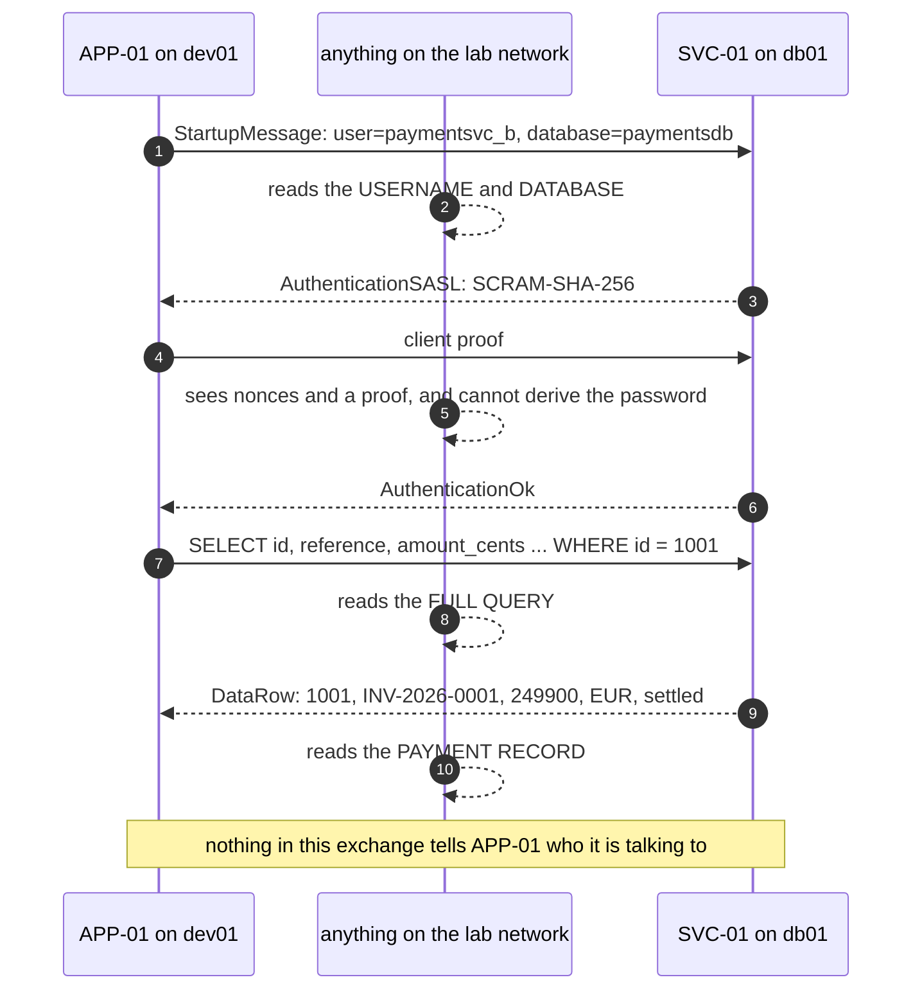
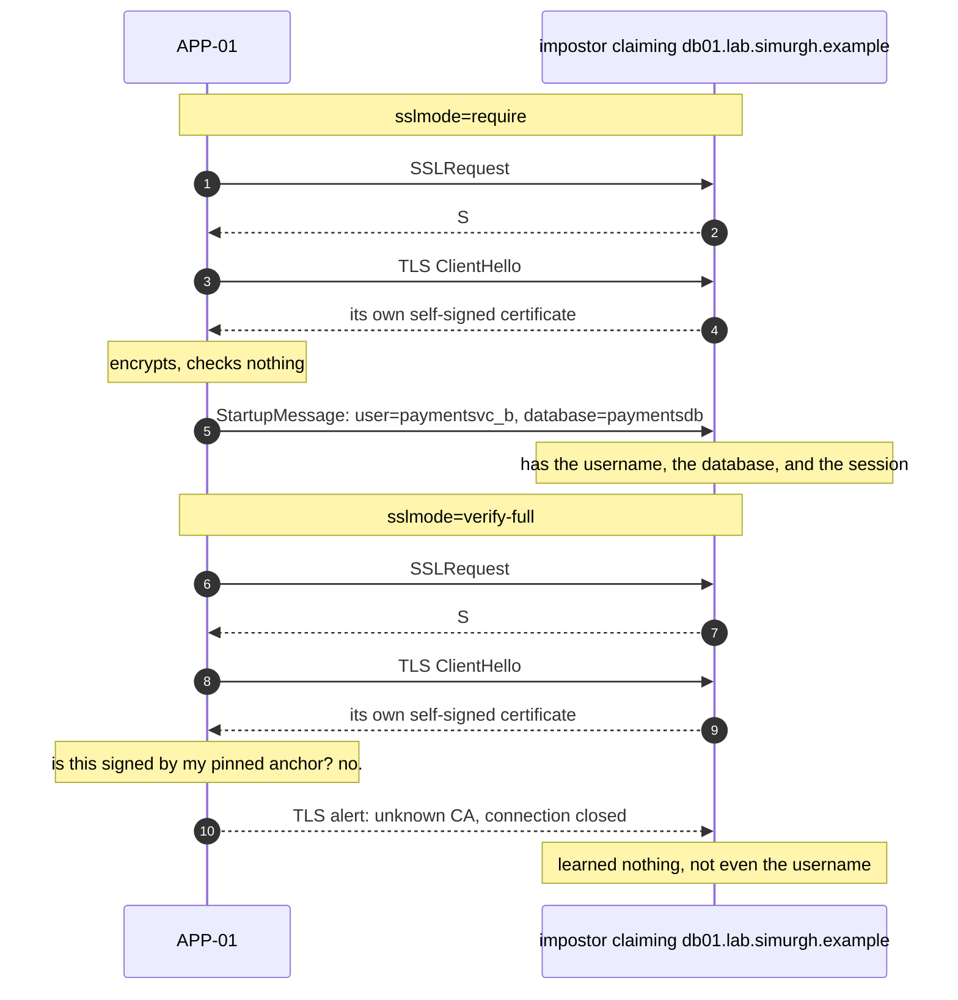
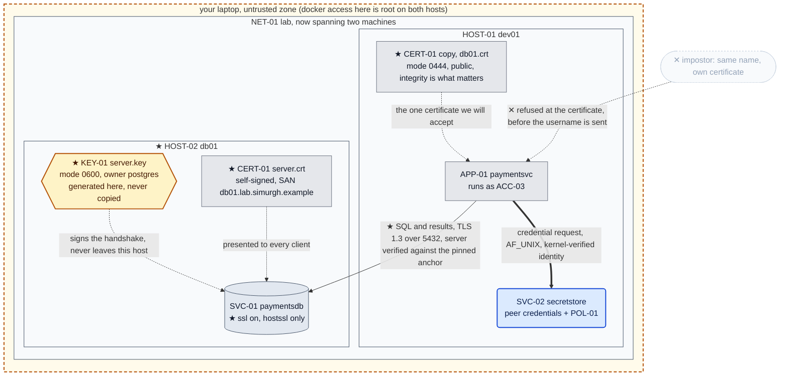

# Chapter 04, The database moves out

**System before this chapter.** One machine, `HOST-01 dev01`, carrying everything: the
application `APP-01 paymentsvc`, the database `SVC-01 paymentsdb`, and the secret store
`SVC-02 secretstore`. The store authenticates callers from kernel-supplied peer credentials
and refuses anything `POL-01` does not permit. The credential rotates with one write and zero
downtime. Every decision about a secret is recorded as fact.

**The pressure.** `OT-005`, raised in Chapter 01 and waiting ever since:

> The packet capture showed that `scram-sha-256` keeps the credential off the wire, and that
> everything else crosses in plaintext: full SQL statements and full result rows, including
> every payment record. Separately, nothing in the exchange authenticates the *server*.
> On loopback the audience is small. The day `SVC-01` moves to a second host, the audience is
> everyone on the network path.

This is that day. And the reason to move the database is not capacity, it is that three
chapters of access control currently guard a door with no wall beside it: anything that is root
on `dev01` reads the payment data straight off the disk without ever asking for a credential.

**What you'll have working by the end of this chapter.**

- `HOST-02 db01`, a second machine, added the way every machine from here on is added: as a
  service in the compose file.
- A packet capture of payment records crossing a real network in the clear, and an impostor
  that takes `APP-01`'s place and is handed the username and database it was about to
  authenticate with.
- `KEY-01` and `CERT-01`: the first key material this build owns, generated on the machine that
  uses it and never copied anywhere.
- The demonstration that **`sslmode=require` encrypts your conversation with the attacker**,
  and the two words that fix it.
- The first **solid edge** in the architecture. Every connection drawn so far has been dotted.

---

## 0. If your output differs

Machine-specific values (process IDs, IP addresses, container IDs, certificate serial numbers
and dates) will differ from what is shown. The lab network's subnet is assigned by Docker and
is not the same on every machine, which is why nothing in this chapter hard-codes an address.

Work in this chapter's `lab/` folder, which holds the whole lab:

```bash
cd "Chapter 04/lab"
find . -type f | sort
```

Expected:

```
./db01/Dockerfile
./db01/entrypoint.sh
./db01/impostor.py
./dev01/Dockerfile
./dev01/app/config.yaml
./dev01/app/paymentsvc.py
./dev01/entrypoint.sh
./dev01/initdb.sql
./dev01/secretstore/policy.json
./dev01/secretstore/secretstore-set.py
./dev01/secretstore/secretstore.py
./docker-compose.yml
```

### The lab in full

What **this** chapter writes is marked ★:

```
lab/
├── docker-compose.yml              ★ changed: db01 added as a second service
├── dev01/
│   ├── Dockerfile                    Chapter 01
│   ├── entrypoint.sh                 Chapter 01
│   ├── initdb.sql                    Chapter 01, seed for dev01 only, never re-run
│   ├── app/
│   │   ├── config.yaml             ★ changed: remote host, verify-full, pinned anchor
│   │   └── paymentsvc.py           ★ changed: verifies the database it connects to
│   └── secretstore/
│       ├── secretstore.py            Chapter 03
│       ├── secretstore-set.py        Chapter 02
│       └── policy.json               Chapter 03
└── db01/                           ★ new: HOST-02
    ├── Dockerfile                  ★ new
    ├── entrypoint.sh               ★ new
    └── impostor.py                 ★ new: the attacker, used in section 7
```

**`initdb.sql` is still Chapter 01's seed and is more dangerous than it looks now.** It creates
`paymentsvc` as a LOGIN role holding `SEC-01`, the credential Chapter 02 retired. `db01` is a
brand new empty PostgreSQL, and seeding it from that file would resurrect a dead credential.
Section 2.4 migrates the database with `pg_dump` instead, which is why `db01/entrypoint.sh`
deliberately seeds nothing.

### Before you start: this chapter continues an existing lab

`dev01` is built **once**, in Chapter 01. Every chapter after that deploys into the same
running container. This folder carries every file the running system uses, so you can read the
whole thing in one place, but **building from here does not give you this chapter's starting
state.** That state is what running the earlier chapters leaves behind: OS accounts, file modes,
database rows and files that no image contains.

Note also that a `healthy` container tells you PostgreSQL is accepting connections and
**nothing about the application**, which is started by hand because `HOST-01` has no service
manager. A green container with a silent port 8080 is the normal look of a lab nobody has
started yet.

If you have not worked the earlier chapters, start at Chapter 01. If you have, check that the
lab is where this chapter expects it:

```bash
sudo docker exec dev01 ls -l /run/secretstore/sock
sudo docker exec dev01 cat /etc/secretstore/policy.json
sudo docker exec dev01 id reportsvc
curl -s http://127.0.0.1:8080/credinfo
```

Expected: a socket owned by `secretstore`; `POL-01` naming `paymentsvc`; a uid and gid for
`reportsvc`; and a `credinfo` reply with `"running_as": "paymentsvc"`.

If the container is stopped, or those commands cannot reach it, start everything first.
`SVC-02` must be running before `APP-01`, which is `OT-012`. There is only one machine at this
point; `db01` does not exist until section 2:

```bash
sudo docker start dev01
sleep 2
sudo docker exec -d -u secretstore dev01 \
    sh -c 'python3 /opt/secretstore/secretstore.py >>/var/log/secretstore.out 2>&1'
sleep 1
sudo docker exec -d -u paymentsvc dev01 \
    sh -c 'python3 /opt/paymentsvc/paymentsvc.py >>/var/log/paymentsvc.out 2>&1'
```

Expected: `{"status": "ok"}` from a `curl` to `/healthz`, and the state check above passing.

**If the state check still fails after that**, the container is not in this chapter's starting
state at all. The usual cause is having built from this folder instead of continuing the
container Chapter 01 built, and this folder's compose file defines `db01` as well, so that build
also stood up a machine that is not supposed to exist until section 2. Take both down and start
over:

```bash
sudo docker compose down
cd "../../Chapter 01/lab" && sudo docker compose up -d --build dev01
```

`down` removes the containers and the network but keeps the images, so section 2 rebuilds `db01`
without downloading anything again. Then work Chapters 01 onward forward.

---

## 1. Why the database moves

Every control this build has added lives on `dev01`, and so does the data those controls
protect. Look at what that means concretely:

```bash
sudo docker exec dev01 su postgres -c "psql -d paymentsdb -tAc 'SELECT reference, amount_cents FROM payments'"
```

Expected: every payment record, printed by an administrator who was never asked for
`SEC-02`, never went near `SVC-02`, and left no line in the access log.

That is not a flaw in `POL-01`. It is the observation that a credential only protects a path,
and there is a second path: the data and the lock are on the same machine, so anything with
root there has both. Chapter 03's careful refusal of root at the socket sits directly next to a
filesystem root can read anyway.

Separating them is the first boundary this system has had. After it, an attacker who owns
`dev01` has the application and the secret store, and still has to get across a network to
reach the payments themselves. That is an improvement and it is the reason to do it.

It also does something less comfortable. The connection between `APP-01` and `SVC-01` has been
loopback since Chapter 00, which is why `OT-005` was tolerable: the audience for that traffic
was processes on one host. The moment the database is on another machine, that conversation
crosses a wire, and everything Chapter 01 measured about it becomes a live problem rather than
a filed one.

Both halves are true at once. Moving the database is the right call and it opens a hole. This
chapter does both.

---

## 2. `HOST-02 db01`

### 2.1 A second machine is a second compose service

`docker-compose.yml`, in full. Everything above `db01:` is unchanged from Chapter 01:

```yaml
# The lab substrate: one container per "machine" in the ledger.
#
# Bring each machine up ONCE, in the chapter that introduces it, naming the
# service so you only build that one:
#     Chapter 01:  docker compose up -d --build dev01
#     Chapter 04:  docker compose up -d --build db01
#
# After that, chapters deploy into the running container with `docker cp`.
# Rebuilding is not forbidden, it is a reset: a rebuilt dev01 starts from
# Chapter 01's image again and loses everything the later chapters built
# inside it, which is OS accounts, file modes, database rows and some
# deliberately left log lines. If you do rebuild, you are starting the lab
# over and need to work the chapters forward again.
#
# This file is identical in every chapter's lab/ folder until a chapter
# adds a machine, so `docker compose up -d` from any of them is a no-op on
# a lab that is already running.
#
# Processes inside the containers are still started by hand. That is not an
# oversight: these hosts have no service manager, and giving them one is a
# chapter of its own.

name: lab

services:
  dev01:                                    # HOST-01, where the app and the secret store live
    build:
      context: ./dev01
      dockerfile: Dockerfile
    image: ksm/dev01:chapter01              # named for the chapter that builds it
    container_name: dev01
    hostname: dev01.lab.simurgh.example

    # Published on the laptop's loopback only, never on the network. The
    # difference between 127.0.0.1:8080:8080 and 8080:8080 is the difference
    # between a service your laptop can reach and one the coffee shop can.
    ports:
      - "127.0.0.1:8080:8080"

    # tcpdump needs this to put an interface into the mode it wants.
    cap_add:
      - NET_ADMIN

    # Reap zombies and forward signals. The entrypoint ends in
    # `sleep infinity`, which is not a real init.
    init: true

    # Substrate only: reports, gates nothing.
    healthcheck:
      test: ["CMD", "pg_isready", "-q", "-h", "127.0.0.1", "-p", "5432"]
      interval: 10s
      timeout: 3s
      retries: 5
      start_period: 20s

    stop_grace_period: 5s

  db01:                                     # HOST-02, the database, added in Chapter 04
    build:
      context: ./db01
      dockerfile: Dockerfile
    image: ksm/db01:chapter04
    container_name: db01
    hostname: db01.lab.simurgh.example

    # The name the certificate is issued for, and the name APP-01 connects
    # to. Compose resolves the service name `db01` by default; this alias
    # adds the fully qualified name so `sslmode=verify-full` has something
    # to match against.
    networks:
      default:
        aliases:
          - db01.lab.simurgh.example

    # No `ports:` at all. The database is reachable from dev01 across the
    # lab network and from nowhere else. Chapter 01 published 8080 because
    # you need to curl it; nothing outside the lab has any business
    # reaching 5432.

    cap_add:
      - NET_ADMIN

    init: true

    healthcheck:
      test: ["CMD", "pg_isready", "-q", "-h", "127.0.0.1", "-p", "5432"]
      interval: 10s
      timeout: 3s
      retries: 5
      start_period: 20s

    stop_grace_period: 5s
```

Three things there are the point of the section.

**No `ports:` block.** `dev01` publishes 8080 to your laptop because you have to `curl` it.
`db01` publishes nothing. It is reachable from `dev01` over the lab network and from nowhere
else, which is what a database should be. The absence of a line is doing real work here.

**The network alias.** Compose gives every service a DNS name matching the service name, so
`db01` resolves already. The alias adds `db01.lab.simurgh.example`, the name the ledger gave
this host in Chapter 00. That matters more than tidiness: in section 8 the client checks the
name it dialled against the name in the certificate, and those have to be the same string.

**A machine is a declaration, not a command.** This is the pattern for the rest of the build.
When a certificate authority, a directory or a hardware security module arrives, each one is a
service here. Nothing is a `docker run` line you have to remember.

### 2.2 The machine itself

`db01/Dockerfile`. It is `dev01`'s, minus everything a database host has no business having:

```dockerfile
FROM debian:12-slim

ENV DEBIAN_FRONTEND=noninteractive

RUN apt-get update && apt-get install -y --no-install-recommends \
        postgresql-15 \
        openssl \
        procps iproute2 tcpdump curl less nano ca-certificates \
    && rm -rf /var/lib/apt/lists/*

# Same belt-and-braces as dev01: the Debian package normally creates the
# main cluster on install, but that step relies on an init system a build
# container does not have.
RUN pg_lsclusters | grep -q '^15 *main' || pg_createcluster 15 main

COPY entrypoint.sh /usr/local/bin/entrypoint.sh
RUN chmod +x /usr/local/bin/entrypoint.sh

EXPOSE 5432
ENTRYPOINT ["/usr/local/bin/entrypoint.sh"]
```

No `python3`, no application, no secret store. `openssl` is here because section 6 generates
the key on this machine, which is the whole point of that section. `tcpdump` is here because
section 3 captures on this host's interface.

`db01/entrypoint.sh`:

```sh
#!/bin/sh
set -e

# db01 carries no application and seeds no data. Chapter 04 migrates the
# database here from dev01 with pg_dump, so this only has to bring an empty
# cluster up and leave it accepting connections. Nothing here re-runs
# initdb.sql: that file would recreate paymentsvc as a LOGIN role holding
# the credential Chapter 02 retired.

pg_ctlcluster 15 main start

i=0
while [ $i -lt 30 ]; do
    su postgres -c "psql -tAc 'SELECT 1'" >/dev/null 2>&1 && break
    i=$((i + 1))
    sleep 1
done

echo "db01 ready, PostgreSQL is up."
exec sleep infinity
```

Compare it with `dev01`'s, which seeds the database from `initdb.sql` on first boot. This one
seeds nothing, deliberately, and section 2.3 is why.

### 2.3 Build only the new machine

```bash
sudo docker compose up -d --build db01
sudo docker compose ps
```

Expected: `dev01` untouched and still running, and `db01` going from `starting` to `healthy`
within about half a minute.

**Name the service.** `docker compose up -d --build` on its own rebuilds every service that has
a `build:` section, and a rebuilt `dev01` loses four chapters of accumulated state: `ACC-03`,
`ACC-04` and `ACC-07`, the `0400` modes, the payment rows, the deliberate DEBUG line in
`/var/log/paymentsvc.log`, `POL-01`, and the secret store's backing file. Naming `db01` is what
makes the command safe, and it is worth making a habit of.

### 2.4 Move the data, do not re-create it

`db01` is an empty cluster. There are two ways to give it the payments database and only one of
them is correct.

The wrong way is to run `initdb.sql` against it. That file is Chapter 01's seed, and it says:

```sql
CREATE ROLE paymentsvc LOGIN PASSWORD 'hunter2-payments-prod';
```

Chapter 02 spent an entire chapter killing that credential: `paymentsvc` became a `NOLOGIN`
group role, `ACC-05` and `ACC-06` became the login roles, and `SEC-01` was retired with
`PASSWORD NULL`. Seeding a fresh database from that file would undo all of it and hand a
retired password back its privileges.

So migrate the live state instead. Roles first, because the tables are owned by one of them:

```bash
sudo docker exec dev01 su postgres -c "pg_dumpall --roles-only" > roles.sql
sudo docker exec dev01 su postgres -c "pg_dump -d paymentsdb --create" > paymentsdb.sql
```

Look at what you just made before you use it:

```bash
grep -c 'SCRAM-SHA-256' roles.sql
grep -E '^(CREATE|ALTER) ROLE paymentsvc' roles.sql
```

Expected: a non-zero count of SCRAM verifiers, and `paymentsvc` created `NOLOGIN` with
`paymentsvc_a` and `paymentsvc_b` alongside it.

**`roles.sql` is a new location for sensitive material and it is sitting in your working
directory.** It holds the SCRAM verifiers for every role. Chapter 01 established that a
verifier is not password-equivalent, so this is not as bad as a plaintext password, but it is
credential-adjacent material in a file nobody has thought about, which is exactly how Chapter
01's sixteen locations happened. Restrict it now and delete it when you are done:

```bash
chmod 0600 roles.sql paymentsdb.sql
```

Load both into `db01`:

```bash
sudo docker exec -i db01 su postgres -c "psql -q" < roles.sql
sudo docker exec -i db01 su postgres -c "psql -q" < paymentsdb.sql
rm -f roles.sql paymentsdb.sql
```

Verify the state travelled rather than being re-created:

```bash
sudo docker exec db01 su postgres -c "psql -d paymentsdb -tAc \
  \"SELECT rolname, rolcanlogin FROM pg_roles WHERE rolname LIKE 'paymentsvc%' ORDER BY 1\""
sudo docker exec db01 su postgres -c "psql -d paymentsdb -tAc 'SELECT count(*) FROM payments'"
```

Expected:

```
paymentsvc|f
paymentsvc_a|f
paymentsvc_b|t
3
```

Read those four lines. `paymentsvc` cannot log in, which is Chapter 02's group-role split
surviving the move. `paymentsvc_a` cannot log in either, because Chapter 02 §8 retired it after
the rotation. `paymentsvc_b` can, and it is the credential `SVC-02` is currently serving. Three
payments. The system moved; it did not restart.

### 2.5 Let it listen, and stop the old one

Debian's PostgreSQL listens on localhost only. On `db01` that means nothing can reach it:

```bash
sudo docker exec db01 su postgres -c \
  "psql -tAc \"ALTER SYSTEM SET listen_addresses = '*'\""
sudo docker exec db01 pg_ctlcluster 15 main restart
sudo docker exec db01 su postgres -c "psql -tAc 'SHOW listen_addresses'"
```

Expected: `*`.

`ALTER SYSTEM` writes `postgresql.auto.conf` rather than editing `postgresql.conf` by hand,
which is the modern way and leaves the packaged config file alone.

Now stop the database on `dev01`. It has served since Chapter 00 and its data now lives
elsewhere:

```bash
sudo docker exec dev01 pg_ctlcluster 15 main stop
sudo docker exec dev01 pg_lsclusters
```

Expected: the cluster reported as `down`.

Leave the cluster installed and its data directory intact rather than purging it. It is the
state Chapters 01 to 03 were built against, and Chapter 01's `initdb.sql` exhibit still points
at it.

---

## 3. What the network shows

`APP-01` still thinks the database is on localhost, so point it at the new machine. Edit
`dev01/app/config.yaml` in your lab folder to read:

```yaml
# /opt/paymentsvc/config.yaml
database:
  host: db01.lab.simurgh.example
  port: 5432
  name: paymentsdb
  sslmode: verify-full
  sslrootcert: /opt/paymentsvc/db01.crt
secret_store:
  socket: /run/secretstore/sock
  secret_name: paymentsvc-db
server:
  listen: 0.0.0.0:8080
```

The `sslmode` and `sslrootcert` lines are what section 8 arrives at. We are going to get there
by watching what happens without them, so for the moment deploy the file with `sslmode`
**temporarily** set to `disable`, as Chapter 01 did for its capture:

```bash
sudo docker cp dev01/app/config.yaml dev01:/opt/paymentsvc/config.yaml
sudo docker exec dev01 sed -i 's/^  sslmode: .*/  sslmode: disable/' /opt/paymentsvc/config.yaml
sudo docker exec dev01 chown paymentsvc:paymentsvc /opt/paymentsvc/config.yaml
sudo docker exec dev01 chmod 0400 /opt/paymentsvc/config.yaml
```

`db01` also has to accept a connection from another host. Copy `pg_hba.conf` before touching
it, exactly as Chapter 01 §5.5 established:

```bash
sudo docker exec db01 cp /etc/postgresql/15/main/pg_hba.conf /root/pg_hba.conf.orig
sudo docker exec db01 sh -c \
  "echo 'host all all samenet scram-sha-256' >> /etc/postgresql/15/main/pg_hba.conf"
sudo docker exec db01 pg_ctlcluster 15 main reload
```

`samenet` means any address in a subnet this server is directly attached to. It is better than
`0.0.0.0/0`, which would be a lie about intent, and better than a hard-coded address, which
Docker is free to change on the next restart.

`dev01/app/paymentsvc.py` changes in one place, the call that opens the connection. Here it is
in full:

```python
#!/usr/bin/env python3
"""APP-01 paymentsvc, answers 'what is the status of payment X?'

Chapter 04 change: SVC-01 now lives on its own machine, so the database
connection crosses a network. It is made with TLS and the server
certificate is verified against a pinned copy, which is what stops anything
that answers on port 5432 from being handed our queries.

The credential still comes from SVC-02 over a Unix socket on this host, and
this process still stores no credential of its own.
"""

import http.client
import json
import logging
import os
import pwd
import socket
import sys
from http.server import BaseHTTPRequestHandler, ThreadingHTTPServer

import psycopg2
import yaml
from psycopg2.extras import RealDictCursor

CONFIG_PATH = os.environ.get("PAYMENTSVC_CONFIG", "/opt/paymentsvc/config.yaml")

logging.basicConfig(
    level=os.environ.get("LOG_LEVEL", "INFO").upper(),
    format="%(asctime)s %(levelname)s %(message)s",
    handlers=[
        logging.FileHandler("/var/log/paymentsvc.log"),
        logging.StreamHandler(sys.stdout),
    ],
)
log = logging.getLogger("paymentsvc")


def load_config(path):
    log.info("loading configuration from %s", path)
    with open(path) as fh:
        cfg = yaml.safe_load(fh)
    log.debug("effective configuration: %s", cfg)
    return cfg


class UnixHTTPConnection(http.client.HTTPConnection):
    """An HTTP client that speaks over a Unix domain socket.

    The only difference from an ordinary HTTPConnection is where connect()
    points. Everything above it, requests, status codes, headers, is
    unchanged, which is why moving SVC-02 off TCP cost so little here.
    """

    def __init__(self, socket_path, timeout=5):
        super().__init__("localhost", timeout=timeout)
        self.socket_path = socket_path

    def connect(self):
        sock = socket.socket(socket.AF_UNIX, socket.SOCK_STREAM)
        sock.settimeout(self.timeout)
        sock.connect(self.socket_path)
        self.sock = sock


def fetch_credential(socket_path, secret_name):
    """Ask SVC-02 for the current database credential.

    We present no token and assert no identity. The kernel tells the store
    our uid when we connect, and the store applies POL-01 to it. If it says
    no, we get a 403 and fail loudly, being refused is not something to
    paper over.
    """
    conn = UnixHTTPConnection(socket_path)
    try:
        conn.request("GET", f"/v1/secrets/{secret_name}")
        resp = conn.getresponse()
        body = resp.read().decode()
        if resp.status == 403:
            raise PermissionError(
                f"secretstore refused this process: {json.loads(body).get('detail')}"
            )
        if resp.status != 200:
            raise RuntimeError(f"secretstore returned {resp.status}: {body}")
        payload = json.loads(body)
    finally:
        conn.close()
    cred = json.loads(payload["value"])
    log.info("fetched %s version %s as user %s",
             secret_name, payload["version"], cred["user"])
    return cred["user"], cred["password"], payload["version"]


class Database:
    """Owns the connection and the credential it was made with."""

    def __init__(self, cfg):
        self.cfg = cfg
        self.conn = None
        self.user = None
        self.version = None
        self.connect()

    def connect(self):
        db = self.cfg["database"]
        store = self.cfg["secret_store"]
        user, password, version = fetch_credential(
            store["socket"], store["secret_name"]
        )
        self.conn = psycopg2.connect(
            host=db["host"], port=db["port"], dbname=db["name"],
            user=user, password=password,
            # sslmode=verify-full is the whole point of Chapter 04.
            # `require` would encrypt and verify nothing, which buys a
            # confidential conversation with whoever happens to answer.
            sslmode=db["sslmode"], sslrootcert=db["sslrootcert"],
        )
        self.conn.autocommit = True
        self.user, self.version = user, version
        log.info("connected to %s@%s:%s/%s (credential version %s, sslmode %s)",
                 user, db["host"], db["port"], db["name"], version, db["sslmode"])

    def query(self, sql, args):
        """Run a query; on a connection-level failure, re-fetch and retry once."""
        try:
            return self._query(sql, args)
        except psycopg2.OperationalError as exc:
            log.warning("connection failed (%s), re-fetching credential", exc)
            self.connect()
            return self._query(sql, args)

    def _query(self, sql, args):
        with self.conn.cursor(cursor_factory=RealDictCursor) as cur:
            cur.execute(sql, args)
            return cur.fetchone()


cfg = load_config(CONFIG_PATH)
database = Database(cfg)


class Handler(BaseHTTPRequestHandler):
    server_version = "paymentsvc/0.4"

    def _json(self, code, payload):
        body = json.dumps(payload).encode()
        self.send_response(code)
        self.send_header("Content-Type", "application/json")
        self.send_header("Content-Length", str(len(body)))
        self.end_headers()
        self.wfile.write(body)

    def do_GET(self):
        if self.path == "/healthz":
            return self._json(200, {"status": "ok"})

        if self.path == "/credinfo":
            return self._json(200, {
                "db_user": database.user,
                "secret_name": cfg["secret_store"]["secret_name"],
                "credential_version": database.version,
                "running_as": pwd.getpwuid(os.getuid()).pw_name,
                "uid": os.getuid(),
                "db_host": cfg["database"]["host"],
                "sslmode": cfg["database"]["sslmode"],
            })

        parts = self.path.strip("/").split("/")
        if len(parts) == 3 and parts[0] == "payments" and parts[2] == "status":
            try:
                payment_id = int(parts[1])
            except ValueError:
                return self._json(400, {"error": "payment id must be an integer"})
            row = database.query(
                "SELECT id, reference, amount_cents, currency, status "
                "FROM payments WHERE id = %s",
                (payment_id,),
            )
            if row is None:
                return self._json(404, {"error": "no such payment"})
            return self._json(200, dict(row))

        return self._json(404, {"error": "not found"})

    def log_message(self, fmt, *args):
        log.info("%s %s", self.address_string(), fmt % args)


if __name__ == "__main__":
    host, _, port = cfg["server"]["listen"].rpartition(":")
    srv = ThreadingHTTPServer((host, int(port)), Handler)
    log.info("listening on %s", cfg["server"]["listen"])
    srv.serve_forever()
```

The only new lines are `sslmode` and `sslrootcert` being passed through to `psycopg2.connect`,
and `/credinfo` reporting them so you can see from outside which mode a running process is
actually using. Everything else, including Chapter 03's Unix-socket credential fetch and the
re-fetch-on-failure retry, is untouched.

Now deploy it and start a capture on the database's network interface:

```bash
sudo docker cp dev01/app/paymentsvc.py dev01:/opt/paymentsvc/paymentsvc.py
sudo docker exec dev01 chown paymentsvc:paymentsvc /opt/paymentsvc/paymentsvc.py

sudo docker exec -d db01 sh -c 'tcpdump -i eth0 -s 0 -w /tmp/wire.pcap tcp port 5432'
sleep 2

sudo docker exec dev01 pkill -f paymentsvc.py || true
sudo docker exec -d -u paymentsvc dev01 \
    sh -c 'python3 /opt/paymentsvc/paymentsvc.py >>/var/log/paymentsvc.out 2>&1'
sleep 3
curl -s http://127.0.0.1:8080/payments/1001/status
sleep 1
sudo docker exec db01 pkill tcpdump || true
```

Expected: the payment record for 1001, served normally. The application does not care that the
database moved.

Now read the wire:

```bash
sudo docker exec db01 sh -c "grep -a -c 'INV-2026' /tmp/wire.pcap"
sudo docker exec db01 sh -c "grep -a -o 'INV-2026-[0-9]*' /tmp/wire.pcap | sort -u"
sudo docker exec db01 sh -c "grep -a -o 'SELECT id, reference[^\\\"]*' /tmp/wire.pcap | head -1"
sudo docker exec db01 sh -c "grep -a -c 'a-fresh-value-for-b' /tmp/wire.pcap"
```

Expected: a non-zero count, `INV-2026-0001`, the text of the query, and `0` for the password.

That last line is Chapter 01's result holding: SCRAM still keeps the credential off the wire.
Everything else is in the open, and this time "the wire" is a network segment rather than a
loopback interface. Figure 4.1 is what an observer on it sees.



**Figure 4.1, the conversation as the network sees it.** Steps 3 to 6 are the same SCRAM
exchange Chapter 01 captured, and they still work: the credential is not derivable from what
crosses. Everything else is plaintext, and the audience is no longer "processes on this host"
but "anything with a position on this network". The note at the bottom is the half that is
about to matter more than the reading.

---

## 4. Worse than reading: becoming the database

An eavesdropper is a bounded problem. The unbounded one is that `APP-01` has no idea what it is
connected to. It resolves a name, opens a socket, and starts talking.

`lab/db01/impostor.py` is a machine that pretends to be `SVC-01`:

```python
#!/usr/bin/env python3
"""A machine pretending to be SVC-01 paymentsdb.

It does not implement PostgreSQL. It implements exactly the first two things
a PostgreSQL client does, which turns out to be enough:

  1. answer the SSLRequest with "S", meaning "yes, I speak TLS"
  2. present a certificate and complete a TLS handshake

Then it prints whatever the client sends next and hangs up. What arrives is
the startup message: the database name and the username the client is about
to authenticate as. Chapter 04 section 7 is about which sslmode settings let
this happen.
"""

import socket
import ssl
import sys

LISTEN = ("0.0.0.0", 5432)
SSL_REQUEST = b"\x00\x00\x00\x08\x04\xd2\x16/"     # length 8, code 80877103


def main(certfile, keyfile):
    ctx = ssl.SSLContext(ssl.PROTOCOL_TLS_SERVER)
    ctx.load_cert_chain(certfile, keyfile)

    srv = socket.socket()
    srv.setsockopt(socket.SOL_SOCKET, socket.SO_REUSEADDR, 1)
    srv.bind(LISTEN)
    srv.listen(5)
    print(f"impostor listening on {LISTEN[0]}:{LISTEN[1]}", flush=True)

    while True:
        raw, peer = srv.accept()
        try:
            first = raw.recv(8)
            if first != SSL_REQUEST:
                print(f"{peer[0]} sent {first!r} in the clear, no TLS asked for", flush=True)
                print(f"  ...and then: {raw.recv(256)!r}", flush=True)
                raw.close()
                continue
            raw.sendall(b"S")                       # "yes, let us do TLS"
            with ctx.wrap_socket(raw, server_side=True) as tls:
                print(f"TLS handshake COMPLETED with {peer[0]}", flush=True)
                print(f"  the client told me: {tls.recv(256)!r}", flush=True)
        except ssl.SSLError as exc:
            print(f"client refused me: {exc.reason}", flush=True)
        except OSError as exc:
            print(f"connection dropped: {exc}", flush=True)


if __name__ == "__main__":
    main(sys.argv[1], sys.argv[2])
```

Fifty lines, and none of them are an exploit. It answers a socket.

We come back to it in section 7, once there is TLS for it to subvert. For now, note the shape
of the problem: the only thing standing between `APP-01` and this program is that the real
`db01` happens to be the one answering.

---

## 5. The words we have finally earned

Four chapters in, this build has used no cryptography it chose. SCRAM arrived as a PostgreSQL
default. The kernel's peer credentials involve none at all. To fix what section 3 measured we
need some, so here is the vocabulary, kept to what the next three sections use.

**Encryption** turns readable data into unreadable data using a **key**, in a way that can be
reversed by someone holding the right key and by nobody else. That is the whole idea. What
makes it useful and what makes it hard are both the same question: who has the key.

**Symmetric** encryption uses one key for both directions: the same secret locks and unlocks.
Fast, and it has the problem this build knows intimately, because a shared secret has to get to
both parties somehow.

**Asymmetric** encryption uses a **key pair**: two mathematically related keys where what one
does the other undoes. One is the **private key** and never leaves the machine that generated
it. The other is the **public key** and is meant to be handed out. The property that matters
here is that a holder of the private key can produce a value that anyone with the public key
can *check* but nobody can *forge*. That is a signature, and it is how a server proves itself
without telling you a secret.

Compare that to Chapter 03's token, and notice this is the escape from the trap that chapter
ended in. A token has to be *known* by both sides, so distributing it creates a secret zero. A
public key has to be known by both sides and **is not a secret**, so distributing it creates
nothing.

**A certificate** is a public key plus a statement about who it belongs to, in a standard
format called **X.509**, signed so that tampering is detectable. Ours will say: this public key
belongs to `db01.lab.simurgh.example`. The name lives in a field called the **Subject
Alternative Name**, and section 8 is about a client checking the name it dialled against that
field.

**Self-signed** means the certificate is signed by its own private key. It carries a claim and
no third-party endorsement, so it proves nothing on its own. It becomes useful when a client
has been given a copy in advance and told to trust exactly that one, which is called **pinning**
and is what we are going to do. Section 10 is about why that does not scale, and it is where
certificate authorities come from.

Two things this build still does not need and will not use yet: a **certificate authority**,
which is what you build when pinning stops working, and **mTLS**, where the client also proves
itself with a certificate. `APP-01` already authenticates with SCRAM. It is the server that is
unproven.

---

## 6. `KEY-01` and `CERT-01`

### 6.1 Generate the key on the machine that will use it

```bash
sudo docker exec db01 sh -c "cd /etc/postgresql/15/main && \
  openssl req -x509 -newkey ec -pkeyopt ec_paramgen_curve:prime256v1 \
    -keyout server.key -out server.crt -days 365 -nodes \
    -subj '/CN=db01.lab.simurgh.example' \
    -addext 'subjectAltName=DNS:db01.lab.simurgh.example,DNS:db01' \
    -addext 'basicConstraints=critical,CA:FALSE' \
    -addext 'keyUsage=critical,digitalSignature,keyEncipherment' \
    -addext 'extendedKeyUsage=serverAuth'"
```

Note where that ran. The private key is created **on `db01`**, in the directory that will use
it, and no step of this chapter copies it anywhere. That is the first rule of key handling and
it is nearly free to obey: a key that never travels cannot be intercepted in transit, cannot be
left in a `docker cp` shell history, and has exactly one location for the ledger to record.

Look at what you made:

```bash
sudo docker exec db01 sh -c "cd /etc/postgresql/15/main && \
  openssl x509 -in server.crt -noout -subject -issuer -dates \
    -ext subjectAltName,basicConstraints,extendedKeyUsage"
```

Expected:

```
subject=CN=db01.lab.simurgh.example
issuer=CN=db01.lab.simurgh.example
notBefore=Aug 17 12:44:40 2026 GMT
notAfter=Aug 17 12:44:40 2027 GMT
X509v3 Subject Alternative Name:
    DNS:db01.lab.simurgh.example, DNS:db01
X509v3 Basic Constraints: critical
    CA:FALSE
X509v3 Extended Key Usage:
    TLS Web Server Authentication
```

**Subject and issuer are the same string.** That is what self-signed means, printed. This
certificate asserts its own identity and nothing else vouches for it.

**`notAfter` is one year out.** Nothing in this system knows that date. Section 10 comes back
to it.

`prime256v1` is the NIST P-256 elliptic curve. An ECDSA key at that size gives comparable
strength to a 3072-bit RSA key with far smaller keys and faster handshakes, and the ledger's
naming convention was written for exactly this shape of name.

### 6.2 It refuses to start, and the reason is Chapter 01

Debian's PostgreSQL package already offers TLS, using a self-signed certificate it generates at
install time. See what it is currently prepared to present:

```bash
sudo docker exec db01 su postgres -c "psql -tAc 'SHOW ssl'"
sudo docker exec db01 su postgres -c "psql -tAc 'SHOW ssl_cert_file'"
```

Expected: `on`, and a path under `/etc/ssl/certs/`.

That certificate is useless to us: it was generated by a package script, no client has a copy,
and nothing can verify it. Point the server at the key and certificate you just made instead,
whose public half you *can* pin on the client. That difference is what separates section 7 from
section 8:

```bash
sudo docker exec db01 su postgres -c \
  "psql -tAc \"ALTER SYSTEM SET ssl_cert_file = '/etc/postgresql/15/main/server.crt'\""
sudo docker exec db01 su postgres -c \
  "psql -tAc \"ALTER SYSTEM SET ssl_key_file = '/etc/postgresql/15/main/server.key'\""
sudo docker exec db01 pg_ctlcluster 15 main restart
```

It fails. Check why:

```bash
sudo docker exec db01 tail -5 /var/log/postgresql/postgresql-15-main.log
```

Expected, ending in:

```
FATAL:  could not load private key file "/etc/postgresql/15/main/server.key": Permission denied
LOG:  database system is shut down
```

Now look at the file it could not read:

```bash
sudo docker exec db01 ls -l /etc/postgresql/15/main/server.key
```

Expected: `-rw-------`, mode `0600`, owner `root`.

Read those two outputs together, because what matters is the thing that is *not* wrong. The mode
is correct. `openssl` is one of the very few tools that refuses to let your umask decide the mode
of a private key: it writes `0600` whatever your shell would have produced, while the certificate
beside it obeys the umask like any ordinary file. Chapter 01 §3.1 was about a permission nobody
chose. Here the tool chose, and chose well.

It failed anyway, because a mode is only half an answer. The file belongs to `root` and the
process trying to read it runs as `postgres`. That is Chapter 01 §7.1 returning one layer up:
`chmod` says nothing until you have said *whose* access you are describing. There the file was
root-owned and the reader was root, so the permission was empty. Here the file is root-owned and
the reader is not, so the permission is a wall.

Note also what the error does not say. It does not mention modes, or list the permissions it
would accept. PostgreSQL does refuse a key file that is group or world readable, and that check
never fired here, because there was nothing wrong for it to catch. The message is the ordinary
`EACCES` from Chapter 01 §7.2, arriving from a different direction.

```bash
sudo docker exec db01 chown postgres:postgres /etc/postgresql/15/main/server.key
sudo docker exec db01 chmod 0600 /etc/postgresql/15/main/server.key
sudo docker exec db01 pg_ctlcluster 15 main restart
sudo docker exec db01 su postgres -c "psql -tAc 'SHOW ssl'"
```

Expected: `on`.

The `chown` is the operative half; the `chmod` restates a mode `openssl` had already set, and it
is worth running anyway so the end state is stated rather than assumed. `0600` and not `0400`,
because PostgreSQL wants the key owned by the user running the server and readable by it, and
`0600` is what the documentation specifies. The certificate stays `0644`: it is a public key
with a name attached, and it is meant to be copied.

### 6.3 Give the client the trust anchor

`APP-01` cannot verify a certificate it has never seen. Copy the **certificate** to `dev01`,
and only the certificate:

```bash
sudo docker cp db01:/etc/postgresql/15/main/server.crt ./db01.crt
sudo docker cp ./db01.crt dev01:/opt/paymentsvc/db01.crt
sudo docker exec dev01 chown paymentsvc:paymentsvc /opt/paymentsvc/db01.crt
sudo docker exec dev01 chmod 0444 /opt/paymentsvc/db01.crt
rm -f ./db01.crt
```

`0444`, world-readable, deliberately. A trust anchor is not a secret and treating it as one
teaches the wrong instinct. What it needs is **integrity**, not confidentiality: an attacker who
*reads* it gains nothing, and an attacker who *replaces* it owns every connection the app makes.
Those are different properties and file modes only give you the one we do not need here.

---

## 7. Deliberate failure: `sslmode=require`

Turn encryption on in the application, the way almost everyone does it first:

```bash
sudo docker exec dev01 chmod 0600 /opt/paymentsvc/config.yaml
sudo docker exec dev01 sed -i 's/^  sslmode: .*/  sslmode: require/' /opt/paymentsvc/config.yaml
sudo docker exec dev01 chmod 0400 /opt/paymentsvc/config.yaml

sudo docker exec dev01 pkill -f paymentsvc.py || true
sudo docker exec -d -u paymentsvc dev01 \
    sh -c 'python3 /opt/paymentsvc/paymentsvc.py >>/var/log/paymentsvc.out 2>&1'
sleep 3
curl -s http://127.0.0.1:8080/payments/1001/status
```

Expected: the payment record. Confirm the traffic is now encrypted by repeating section 3's
capture:

```bash
sudo docker exec -d db01 sh -c 'tcpdump -i eth0 -s 0 -w /tmp/tls.pcap tcp port 5432'
sleep 2
sudo docker exec dev01 pkill -f paymentsvc.py || true
sudo docker exec -d -u paymentsvc dev01 \
    sh -c 'python3 /opt/paymentsvc/paymentsvc.py >>/var/log/paymentsvc.out 2>&1'
sleep 3
curl -s http://127.0.0.1:8080/payments/1002/status >/dev/null
sleep 1
sudo docker exec db01 pkill tcpdump || true
sudo docker exec db01 sh -c "grep -a -c 'INV-2026' /tmp/tls.pcap"
```

Expected: `0`. The payment records are gone from the wire. `require` did what it says.

Now let the impostor have a turn.

The attacker will generate their own certificate claiming the same name. Anyone can do this: a
name in a certificate is a claim, and a self-signed certificate is a claim with nobody behind
it. Stop the real database and put the impostor in its place on the network:

```bash
sudo docker stop db01
sudo docker run -d --rm --name impostor --network lab_default \
  --network-alias db01.lab.simurgh.example \
  ksm/db01:chapter04 sleep infinity
sudo docker cp db01/impostor.py impostor:/root/impostor.py
sudo docker exec impostor sh -c "cd /root && \
  openssl req -x509 -newkey ec -pkeyopt ec_paramgen_curve:prime256v1 \
    -keyout imp.key -out imp.crt -days 365 -nodes \
    -subj '/CN=db01.lab.simurgh.example' \
    -addext 'subjectAltName=DNS:db01.lab.simurgh.example' >/dev/null 2>&1"
sudo docker exec -d impostor sh -c 'python3 /root/impostor.py /root/imp.crt /root/imp.key >/root/imp.log 2>&1'
sleep 1
```

Make the application reconnect:

```bash
sudo docker exec dev01 pkill -f paymentsvc.py || true
sudo docker exec -d -u paymentsvc dev01 \
    sh -c 'python3 /opt/paymentsvc/paymentsvc.py >>/var/log/paymentsvc.out 2>&1'
sleep 3
sudo docker exec impostor cat /root/imp.log
```

Expected:

```
impostor listening on 0.0.0.0:5432
TLS handshake COMPLETED with <dev01 ip>
  the client told me: b'\x00\x00\x00/user\x00paymentsvc_b\x00database\x00paymentsdb\x00\x00'
```

Read that carefully, because it is the reason this chapter exists.

The handshake **completed**. The connection is encrypted with a modern cipher suite. And the
thing on the other end of it is a fifty-line program that answered a socket, which now knows
the database name and the exact role `APP-01` is about to authenticate as. It could have
returned any rows it liked.

**`sslmode=require` means "encrypt this".** It does not mean "check who I am encrypting to".
Those are different requests and only one of them was made. What you get is a confidential
conversation with whoever picked up.

This is not a PostgreSQL quirk. It is the default shape of the mistake everywhere: encryption
without authentication protects the traffic from third parties and does nothing about the
second party being wrong.

Figure 4.2 puts the two settings side by side.



**Figure 4.2, the same attacker against two settings.** The exchanges are identical up to step
4 and diverge entirely at the check. Under `require` the client proceeds and hands over its
startup message. Under `verify-full` it aborts at the certificate, **before transmitting
anything about itself**. That last point is the one worth keeping: verification is not a
warning after the fact, it is a gate before the first disclosure.

---

## 8. `verify-full`

Two words in the config file:

```bash
sudo docker exec dev01 chmod 0600 /opt/paymentsvc/config.yaml
sudo docker exec dev01 sed -i 's/^  sslmode: .*/  sslmode: verify-full/' /opt/paymentsvc/config.yaml
sudo docker exec dev01 chmod 0400 /opt/paymentsvc/config.yaml

sudo docker exec dev01 pkill -f paymentsvc.py || true
sudo docker exec -u paymentsvc dev01 python3 /opt/paymentsvc/paymentsvc.py 2>&1 | tail -3
```

Expected: the app fails to start, with a `psycopg2.OperationalError` reporting that the
certificate could not be verified. The impostor's log agrees:

```bash
sudo docker exec impostor cat /root/imp.log
```

Expected, as the last line:

```
client refused me: TLSV1_ALERT_UNKNOWN_CA
```

The attacker's own program is reporting that it was rejected, and it never received a startup
message. Put the real database back:

```bash
sudo docker rm -f impostor
sudo docker start db01
sleep 5
sudo docker exec -d -u paymentsvc dev01 \
    sh -c 'python3 /opt/paymentsvc/paymentsvc.py >>/var/log/paymentsvc.out 2>&1'
sleep 3
curl -s http://127.0.0.1:8080/payments/1001/status
curl -s http://127.0.0.1:8080/credinfo
```

Expected: the payment record, and `"sslmode": "verify-full"` with
`"db_host": "db01.lab.simurgh.example"`.

### 8.1 The four settings that matter

`sslmode` has six values and the differences between them are the whole subject:

| `sslmode` | Encrypts | Checks the certificate is trusted | Checks the name | What it protects against |
|---|---|---|---|---|
| `disable` | No | No | No | Nothing. Section 3. |
| `require` | Yes | **No** | **No** | Passive eavesdropping only. Section 7. |
| `verify-ca` | Yes | Yes | **No** | Eavesdropping, and impostors without a trusted certificate. Not an impostor that *has* one. |
| `verify-full` | Yes | Yes | Yes | Eavesdropping, and any server that is not the one you asked for. |

The gap between `verify-ca` and `verify-full` is small and real. `verify-ca` asks "is this
certificate trusted?" and `verify-full` also asks "was it issued for the name I dialled?".
With one pinned self-signed certificate they are nearly the same. The moment there is an
authority issuing certificates to more than one machine, `verify-ca` accepts *any* host that
authority has certified, including one an attacker legitimately obtained a certificate for.
Use `verify-full`.

### 8.2 Close the door on the server side too

The client now refuses to connect insecurely. The server should refuse to *accept* an insecure
connection, and that is a separate setting in a separate file:

```bash
sudo docker exec db01 sed -i 's/^host all all samenet scram-sha-256$/hostssl all all samenet scram-sha-256/' \
  /etc/postgresql/15/main/pg_hba.conf
sudo docker exec db01 pg_ctlcluster 15 main reload
sudo docker exec db01 grep -E '^(host|hostssl|local)' /etc/postgresql/15/main/pg_hba.conf
```

Expected: the line now reads `hostssl`, and the packaged `local` and `127.0.0.1` lines are
unchanged.

`host` matches connections with or without TLS. `hostssl` matches only TLS connections, so a
client arriving with `sslmode=disable` is refused rather than served. Prove it:

```bash
sudo docker exec db01 sh -c "PGPASSWORD=x psql 'host=db01.lab.simurgh.example dbname=paymentsdb user=paymentsvc_b sslmode=disable' -c 'SELECT 1'"
```

Expected: a `FATAL` refusal saying no `pg_hba.conf` entry matches a connection with SSL off.

This matters because `sslmode` lives on the client, and clients are configured by people. A
server that only *offers* TLS is one bad config file away from plaintext. `hostssl` makes the
decision on the side that owns the data.

---

## 9. What just changed in the architecture



**Figure 4.3, the architecture after Chapter 04.** One edge in this figure is **solid**, and it
is the first in four chapters. Chapter 00's visual language reserves a solid line for a
connection that is encrypted *and* authenticated in transit, and until now every line in every
figure has been dotted. `APP-01` to `SVC-01` earned it in section 8, and it took a second
machine, a key pair, a certificate and two words in a config file.

`KEY-01` is an amber hexagon inside `HOST-02` with no edge leaving that box, which is the
figure's way of saying the private key was generated there and has never been copied.
`CERT-01` appears twice on purpose: once on `db01` where it is presented, once on `dev01` where
it is the trust anchor. Those are the same bytes and completely different roles, and confusing
them is how people end up shipping private keys.

The impostor is drawn `✕` retired, refused at the certificate rather than at the query.

**What has not changed:** `APP-01` and `SVC-02` are still on the same host, so Chapter 03's
peer-credential authentication still works exactly as it did. `OT-014` is about the day *those
two* are separated, and this chapter deliberately did not do that. One boundary at a time.

### Current one-line state

Two machines; the payments data has its own host and reaches the application over a connection
that is encrypted and whose server is verified against a pinned certificate; the private key
was generated where it is used and has never moved; and the trust anchor that makes it all work
is a file somebody copied by hand, which expires in a year and which nothing tracks.

---

## 10. What it cost

**A trust anchor is now a deployment artifact.** `APP-01` works because someone copied
`db01.crt` onto `dev01`. That copy is the entire basis of the verification: replace it and you
own every connection the app makes. It arrived by `docker cp`, with no signature, no checksum
and no record. One machine and one certificate makes that tolerable. Ten of each makes it a
distribution problem, and it is filed as `OT-017`.

**Pinning does not survive rotation.** The certificate expires in 365 days. Replacing it means
generating a new one on `db01` and copying it to every client that pinned the old one, and
between those two steps every client is broken. With one client that is a two-minute outage you
schedule. The failure mode scales badly and in the worst direction: the more clients you have,
the more simultaneous the breakage.

That pair is precisely the pressure that produces a **certificate authority**. If clients pin
one long-lived authority certificate instead of each server's, then a server can be re-issued
without touching a single client. We are not building one now, because with one server it would
be ceremony, and a CA introduced before the pain is a CA whose configuration you learn and
whose purpose you do not.

**Nothing knows the expiry date.** Not the application, not the store, not any monitoring. The
system will work perfectly for a year and then stop, and the failure will arrive as
"the payments service is down" rather than "a certificate expired". `OT-018`.

**We now own key material, and the ledger says so.** Its §8 has read "None yet, none that we
own" since Chapter 00. `KEY-01` ends that. Everything this build says from here about key
custody, rotation, hardware protection and crypto-periods applies to a real object we are
responsible for.

---

## 11. Decisions we made (and what would change them)

| # | Decision | Options | Chosen | Why | What would flip it |
|---|---|---|---|---|---|
| D-034 | The database moves to `HOST-02 db01` now | (a) leave it on `dev01` until capacity forces the split; (b) move it now, as a security boundary | (b) | Capacity is not the pressure and pretending it is would teach the wrong trigger. The real one is that `POL-01` guards a credential while the data sits on the same disk, so root on `dev01` bypasses every control this build has added. Separation is what makes the credential mean something. It also makes `OT-005` live, which is the point: the chapter has to pay for the boundary it just bought. | Nothing. This was committed in Chapter 01 as `D-006`'s exit condition. |
| D-035 | A self-signed certificate pinned by the client, not a certificate authority | (a) build a CA now; (b) self-signed, distributed to the client as a trust anchor | (b) | With exactly one server certificate, a CA is ceremony: it adds an issuing process, a key to protect and a revocation story, and buys nothing a pinned copy does not already give. The pressure for a CA is a *second* certificate, or the first renewal breaking every pinned client at once, and both are now filed (`OT-017`, `OT-018`). Building it early would teach `openssl ca` and hide why anyone bothers. | A second machine needing a certificate, or the renewal in `OT-018` coming due. Either makes pinning the expensive option. |
| D-036 | The private key is generated on `db01` and never copied | (a) generate on the laptop and distribute; (b) generate in place | (b) | A key that never travels cannot be intercepted in transit, cannot be left in a shell history or a `docker cp` invocation, and has exactly one location for the ledger to record. It costs nothing here and it is the habit that scales to hardware-backed keys, where the key *cannot* leave even if you want it to. | Nothing for server keys. A future need to escrow or back up a key is a different problem with a different answer, and it will be argued on its own. |
| D-037 | `sslmode=verify-full` on the client and `hostssl` on the server | (a) `require`; (b) `verify-ca`; (c) `verify-full`, plus `hostssl` in `pg_hba.conf` | (c) | Section 7 demonstrated what `require` buys: a confidential channel to an impostor that received the username and database before anything went wrong. `verify-ca` checks the certificate is trusted but not that it was issued for the host you dialled, which is a real gap the moment an authority certifies more than one machine. `hostssl` matters separately: `sslmode` is a client setting, clients are configured by people, and a server that merely *offers* TLS is one bad config file from plaintext. The decision belongs on the side that owns the data. | Nothing. `require` is not a weaker-but-acceptable setting, it is a different and mostly illusory guarantee. |
| D-038 | ECDSA P-256 rather than RSA | (a) RSA 2048 or 3072; (b) ECDSA P-256 | (b) | Comparable strength to RSA 3072 with far smaller keys and faster handshakes, universally supported by modern PostgreSQL and OpenSSL, and it matches the key-naming convention Chapter 00 wrote down. | A client library too old to negotiate an ECDSA cipher suite, which for anything in this build would mean upgrading the client rather than downgrading the key. |

---

## 12. Where this still hurts

**The trust anchor is copied by hand and nothing protects its integrity.** Replace
`/opt/paymentsvc/db01.crt` and you replace what `APP-01` believes about the world. `OT-017`.

**The certificate expires in a year and nothing knows.** `OT-018`, and it is the most certain
future outage in the system.

**Pinning does not scale, and this is the last chapter where it is comfortable.** One server,
one client, one copy. The next certificate makes it two distribution problems.

**Root still reads everything on each host,** and now there are two of them. `db01` has the
private key at `0600`, which root reads, and the payment data on disk. `OT-004`, unchanged in
character and doubled in surface.

**`SVC-02` still holds everything in plaintext,** and is still the single point whose
compromise gives up every secret. `OT-011`, `AR-001`.

**The database authenticates the client with a password.** SCRAM over TLS is an
improvement over SCRAM alone, but `ACC-06` still proves itself with something it knows, which
is the shape Chapter 03 spent a chapter arguing against. The certificate machinery now standing
on `db01` is most of what would be needed to fix that, and it will be revisited.

**Peer credentials still stop at the machine boundary.** `APP-01` and `SVC-02` remained
together, so Chapter 03's mechanism holds. `OT-014` is unchanged and now visibly closer.

**Nothing expires and nothing is renewed on its own,** which is `OT-007` collecting a second
kind of object: credentials and now certificates.

---

## 13. Chapter recap

- Moving the database is a security boundary before it is a capacity decision. Access control
  on the same machine as the data guards a door with no wall beside it.
- The boundary costs you a network. Everything Chapter 01 measured about the connection stopped
  being theoretical the moment there were two hosts.
- A second machine is a second compose service. `sudo docker compose up -d --build db01`, naming the
  service, because an unnamed rebuild takes the other machines with it.
- Migrate state, do not re-seed it. Running Chapter 01's `initdb.sql` against a fresh database
  would have resurrected a credential Chapter 02 retired.
- A role dump contains SCRAM verifiers. It is a new location for sensitive material, created by
  a routine operation, which is exactly how Chapter 01's sixteen locations happened.
- **Asymmetric cryptography is the escape from secret zero for *this* hop.** A token has to be
  known by both sides and is therefore a secret to distribute. A public key has to be known by
  both sides and is not a secret at all.
- A certificate is a public key plus a name, in a signed standard format. Self-signed means it
  vouches for itself, which is worth nothing until a client is told to trust that exact one.
- Generate the private key on the machine that uses it. A key that never travels cannot be
  intercepted, logged or forgotten in a shell history.
- `openssl` writes a private key `0600` whatever your umask says, which is rarer than it sounds
  and the opposite of Chapter 01's `0644`. PostgreSQL refused to start anyway, because the file
  was owned by `root` and the server runs as `postgres`. A correct mode on the wrong owner is
  Chapter 01 §7.1 again: a permission needs an identity to hang off.
- The certificate is `0644` and the trust anchor copy is `0444`, both deliberately public. What
  they need is **integrity**, not confidentiality, and a file mode gives you the wrong one.
- **`sslmode=require` encrypts your conversation with the attacker.** It asks for encryption
  and not for verification, and those are separate requests. An impostor completed a TLS
  handshake and received the username and database name.
- `verify-full` refuses **before** the client transmits anything about itself. Verification is a
  gate, not a warning.
- `verify-ca` checks the certificate is trusted; `verify-full` also checks it was issued for the
  name you dialled. Once an authority certifies more than one host, that difference is the whole
  protection.
- `sslmode` is a client setting and clients are configured by people. `hostssl` puts the same
  decision on the side that owns the data.
- The first solid edge in four chapters. It cost a machine, a key pair, a certificate and a
  hand-copied file.
- The hand-copied file, and the expiry date nobody tracks, are what certificate authorities are
  for. Not yet.

---

## 14. Prove it to yourself

**Q1. The database moved for security rather than capacity. Give the concrete bypass that
motivated it, and say what moving actually prevents.**

With the database on `dev01`, anyone who is root there runs
`su postgres -c "psql -d paymentsdb"` and reads every payment record without presenting a
credential, without contacting `SVC-02`, and without producing a line in the access log. Three
chapters of authentication and authorization sit beside a filesystem that answers the same
question directly. Moving the data to `db01` means an attacker who owns `dev01` gets the
application and the secret store and must still cross a network with a credential to reach the
payments. It does not prevent an attacker who owns `db01`, and it does not prevent one who owns
both, which on a laptop with Docker is anyone with a shell.

**Q2. Why is running `initdb.sql` against the new database the wrong way to seed it?**

Because it is Chapter 01's file and it says
`CREATE ROLE paymentsvc LOGIN PASSWORD 'hunter2-payments-prod'`. Chapter 02 turned `paymentsvc`
into a `NOLOGIN` group role, moved logins to `ACC-05`/`ACC-06`, and retired `SEC-01` with
`PASSWORD NULL`, which is what made sixteen leaked copies worthless. Seeding from that file
would recreate the role as a login role and give the retired password its privileges back, on a
machine holding the production data. `pg_dumpall --roles-only` plus `pg_dump` moves the state
that actually exists, including the retirement, and demonstrates that the system moved rather
than being rebuilt from an old description.

**Q3. Section 3's capture found payment records and no password. Is that the same result as
Chapter 01, and has anything got worse?**

The result is identical and the situation is much worse. SCRAM still keeps the credential off
the wire, and the queries and result rows still cross in the clear. What changed is the
audience. In Chapter 01 an observer had to be a process on `dev01`, which meant they had already
achieved something. Now the traffic crosses a network segment, and anyone with a position on it
reads payment references and amounts without touching either host. The measurement did not
change; the number of people it applies to did.

**Q4. Explain how a public key escapes the secret-zero problem that Chapter 03's token could
not.**

Both have to be known by both parties. The difference is what "known" costs. A token is a
secret, so getting it to the other side securely requires a channel that is already trusted,
which requires a credential, which is the regress Chapter 03 named. A public key is not a
secret: it can be published, printed, or read by an attacker with no loss, because possessing it
lets you *check* a signature and not *produce* one. Only the private key must be protected, and
it never leaves the machine that made it, so there is no distribution step to secure. The
problem shifts from confidentiality to **integrity**: you no longer need the copy to be secret,
you need it to be the right one, which is what `OT-017` is about.

**Q5. `sslmode=require` produced an encrypted connection with a modern cipher suite. Say
precisely what it failed to do, and what the impostor obtained.**

It failed to check that the certificate presented was one the client had any reason to trust,
and failed to check that it was issued for the name the client dialled. It asked for encryption,
which it got. The impostor obtained a completed TLS handshake and the startup message, which
carries the database name and the username `paymentsvc_b`. From there it could return any rows
it chose to an application that makes decisions about money, which is worse than reading the
traffic. It could not obtain the password, because SCRAM would not have completed, but by then
it does not need to: it is the thing answering the questions.

**Q6. Under `verify-full` the impostor logged `TLSV1_ALERT_UNKNOWN_CA`. Why is *when* this
happens as important as *that* it happens?**

Because the client aborted at the certificate, before sending its startup message. Nothing about
`APP-01` reached the attacker: not the username, not the database name, not a connection attempt
they could correlate with anything. A check that ran after the credentials were sent would still
prevent the impostor from serving fake data, and would have leaked the identity of a role worth
attacking. Verification is a gate placed before the first disclosure, which is why "the
connection failed" is the correct and complete outcome.

**Q7. `verify-ca` and `verify-full` look almost identical here. Construct the case where the
difference is total.**

Take a certificate authority that has issued certificates to twenty hosts, which is the normal
situation once you have one. An attacker legitimately obtains a certificate for a machine they
control, say `reporting.lab.simurgh.example`, from that same authority. Under `verify-ca` the
client asks only "is this certificate signed by my trusted authority?", the answer is yes, and
the connection proceeds to an attacker-controlled host. Under `verify-full` the client also asks
"does it say `db01.lab.simurgh.example`?", the answer is no, and it aborts. The gap is invisible
with one self-signed certificate and becomes the entire protection the moment an authority
exists, which is the next thing this build is going to want.

**Q8. Why is the server key `0600` while the certificate is `0644` and the client's copy is
`0444`? Answer in terms of properties, not modes.**

The key needs **confidentiality**: anyone who reads it can impersonate the server, so exactly
one identity may see it. PostgreSQL enforces both halves of that, refusing to start on a key
file that is group or world readable, and simply failing to open one owned by somebody else,
which is the half §6.2 actually hit. The
certificate needs neither confidentiality nor much else on the server; it is a public key with a
name, handed to every client that connects, so restricting it protects nothing. The client's
copy needs **integrity**: reading it gains an attacker nothing, but replacing it redirects every
connection `APP-01` makes to a server of their choosing. File modes give you confidentiality,
and for the anchor that is the property we do not need. Nothing in this chapter protects the
anchor's integrity, which is `OT-017`.

**Q9. Both `sslmode=verify-full` and `hostssl` were set. Is one redundant?**

No, they answer different questions and sit on different sides. `sslmode=verify-full` is the
client deciding what it will accept, and it is the only one of the two that verifies the
server's identity, so it cannot be dropped. `hostssl` is the server deciding what it will serve,
and it defends against a case the client setting cannot: a client configured wrongly. `sslmode`
lives in a config file managed by whoever deploys the application, and one edit, one copied
snippet or one library default returns you to plaintext with no error. `hostssl` puts a floor
under that on the machine that owns the data. Client-side verification and server-side
enforcement are complements, and the interesting one to lose would be `verify-full`.

**Q10. This chapter produced the first solid edge in the architecture. What exactly does the
notation now claim, and what does it still not claim?**

A solid line means encrypted and authenticated in transit, so it claims that traffic between
`APP-01` and `SVC-01` cannot be read or modified by a third party on the network, and that
`APP-01` has verified it is talking to the host named in the pinned certificate. It does not
claim the connection is safe from either endpoint: root on `db01` reads the data at rest and the
private key, root on `dev01` can replace the trust anchor, and `SVC-02` still holds the
credential in plaintext. It also says nothing about the *server* knowing who the client is
beyond a password, and nothing about what happens in a year when the certificate expires.

---

## 15. Leaving the lab standing

**Leave it running.** Chapter 05 builds on this.

Two machines and three processes now, in order:

```bash
sudo docker start db01
sleep 5
sudo docker start dev01
sleep 2
sudo docker exec dev01 pg_ctlcluster 15 main stop
sudo docker exec -d -u secretstore dev01 \
    sh -c 'python3 /opt/secretstore/secretstore.py >>/var/log/secretstore.out 2>&1'
sleep 1
sudo docker exec -d -u paymentsvc dev01 \
    sh -c 'python3 /opt/paymentsvc/paymentsvc.py >>/var/log/paymentsvc.out 2>&1'
sleep 3
curl -s http://127.0.0.1:8080/healthz
curl -s http://127.0.0.1:8080/credinfo
```

Expected: `{"status": "ok"}`, then `"sslmode": "verify-full"`.

`db01` first now, because `APP-01` fails at startup if it cannot reach the database.

The `pg_ctlcluster ... stop` is not a leftover. `dev01`'s entrypoint starts PostgreSQL on every
container start, so the cluster you stopped in section 2.5 comes back every time the container
does, and has to be stopped again. That is `OT-009` in a form worth naming: a host with no
service manager cannot remember that something is supposed to be **off** any more than it can
remember that something is supposed to be on.

Three failure modes that look alike from outside:

- `URLError` or `Connection refused` in `paymentsvc.out`: the **secret store** is not running.
- `PermissionError ... POL-01 does not permit`: the store is running and refused the app, which
  means it was started without `-u paymentsvc`.
- `OperationalError` mentioning the certificate or the connection: **`db01`** is not up, or the
  trust anchor at `/opt/paymentsvc/db01.crt` no longer matches the certificate `db01` presents.

Make sure the impostor is gone:

```bash
sudo docker ps -a --filter name=impostor
```

Expected: no output. If it is still there, `sudo docker rm -f impostor`.

Nothing else from this chapter is transient. `db01`, `KEY-01`, `CERT-01` and the trust anchor
are standing infrastructure.

**Full teardown**, only if you are abandoning the build:

```bash
sudo docker rm -f dev01 db01
sudo docker image rm ksm/dev01:chapter01 ksm/db01:chapter04
```
