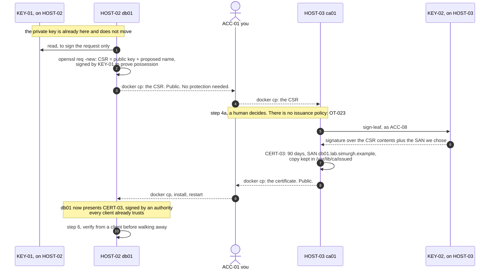
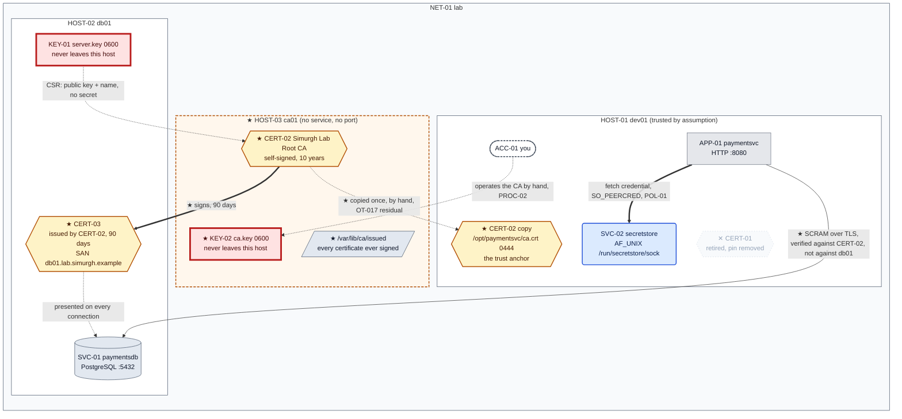

# Chapter 05, The certificate nobody can replace

**System before this chapter.** Two machines. `HOST-01 dev01` runs `APP-01 paymentsvc` and
`SVC-02 secretstore`; `HOST-02 db01` runs `SVC-01 paymentsdb`. The application fetches its
database credential over a Unix socket from a store that identifies callers by asking the
kernel, and connects to the database with `sslmode=verify-full` against `CERT-01`, a
self-signed certificate whose copy sits at `/opt/paymentsvc/db01.crt`. That connection is the
only solid edge in the architecture.

**The pressure.** `OT-017`. The solid edge rests on a file somebody copied by hand, and two
separate things are wrong with it.

> The anchor needs to be *the right bytes*, and it arrived with no signature, no checksum and
> no record. And `CERT-01` expires. Replacing it means generating a new certificate on `db01`
> and copying it to every client that pinned the old one, with every client broken in between.

The second half is the one that ends pinning. It is Chapter 02's theorem again, in a new
costume: two places must agree, nothing spans them, so there is a window. Last time the two
places were a database and a config file. This time they are a server and every client it has.

**What you'll have working by the end of this chapter.**

- A measured demonstration that re-issuing a pinned certificate breaks the client, and that no
  ordering of the two steps avoids it.
- `HOST-03 ca01`, a third machine whose only job is to hold one key and sign things with it.
- `KEY-02` and `CERT-02`: an authority. Clients pin the issuer once and stop caring what any
  individual server presents.
- A certificate signed for the wrong name, rejected by `verify-full` while `verify-ca` accepts
  it, which is the gap Chapter 04's table described and could not yet show you.
- `CERT-03` replacing `CERT-01`, then replaced again, with **no change on the client**. That
  second re-issue is the measurement that answers `OT-017`.
- The most dangerous object this build has ever owned, and an account of what now depends on
  a single file mode.

---

## 0. If your output differs

Machine-specific values (certificate serial numbers, dates, process IDs, container IDs) will
differ from what is shown. Serial numbers in particular are generated from a counter this
chapter creates, so yours will not match and nothing depends on them.

Dates matter in one place only: this chapter issues certificates valid for ninety days and a
root valid for ten years, so your `notAfter` values are ninety days and ten years from when you
run the commands.

Work in this chapter's `lab/` folder, which holds the whole lab:

```bash
cd "chapters/Chapter 05/lab"
ls
```

Expected: `docker-compose.yml`, and the directories `dev01/`, `db01/` and `ca01/`.

### The lab in full

What **this** chapter writes is marked ★:

```
lab/
├── docker-compose.yml              ★ changed: ca01 added as a third service
├── dev01/
│   ├── Dockerfile                    Chapter 01
│   ├── entrypoint.sh                 Chapter 01
│   ├── initdb.sql                    Chapter 01, seed for dev01 only, never re-run
│   ├── app/
│   │   ├── config.yaml             ★ changed: the anchor is now the authority
│   │   └── paymentsvc.py             Chapter 04, unchanged
│   └── secretstore/
│       ├── secretstore.py            Chapter 03
│       ├── secretstore-set.py        Chapter 02
│       └── policy.json               Chapter 03
├── db01/
│   ├── Dockerfile                    Chapter 04
│   ├── entrypoint.sh                 Chapter 04
│   └── impostor.py                   Chapter 04
└── ca01/                           ★ new: HOST-03
    ├── Dockerfile                  ★ new
    ├── entrypoint.sh               ★ new: starts nothing, and says why
    └── sign-leaf.sh                ★ new: the issuing half of PROC-02
```

**`paymentsvc.py` does not change in this chapter.** It already reads `sslrootcert` from the
config file and passes it to `psycopg2`. Swapping a pinned server certificate for an authority
is a change to *which file that path points at*, and the application has no opinion about it.
That is worth noticing before you build anything: the client-side cost of this entire chapter
is one line of YAML.

**A note on the Dockerfiles.** `dev01/Dockerfile` is still Chapter 01's, and it does not create
the `secretstore` or `reportsvc` accounts, nor copy `secretstore/`. Those arrived as chapter
work, by `docker cp` and `useradd`, exactly as the section below describes. The folder shows
you every file the running system uses; the `dev01` image does not build that system from
scratch and is not meant to.

### Before you start: this chapter continues an existing lab

`dev01` is built **once**, in Chapter 01, and `db01` once in Chapter 04. Every chapter deploys
into the same running containers. This folder carries every file the running system uses, so
you can read the whole thing in one place, but **building from here does not give you this
chapter's starting state.** That state is what running the earlier chapters leaves behind: OS
accounts, file modes, database rows and files that no image contains.

Note also that a `healthy` container tells you PostgreSQL is accepting connections and
**nothing about the application**, which is started by hand because these hosts have no service
manager. A green container with a silent port 8080 is the normal look of a lab nobody has
started yet.

If you have not worked the earlier chapters, start at Chapter 01. If you have, check that the
lab is where this chapter expects it:

```bash
sudo docker exec db01 ls -l /etc/postgresql/15/main/server.crt
sudo docker exec dev01 ls -l /opt/paymentsvc/db01.crt
curl -s http://127.0.0.1:8080/credinfo
```

Expected: a certificate on `db01`; the pinned anchor on `dev01` at mode `-r--r--r--`; and a
`credinfo` reply containing `"sslmode": "verify-full"` and
`"db_host": "db01.lab.simurgh.example"`.

If the containers are stopped, or those commands cannot reach them, start everything first.
`db01` comes up before `APP-01`, and `SVC-02` before it too, which is `OT-012`:

```bash
sudo docker start db01 dev01
sudo docker exec dev01 sh -c '
  for i in $(seq 1 30); do pg_isready -q -h 127.0.0.1 -p 5432 && break; sleep 1; done
  pg_ctlcluster 15 main stop'
sudo docker exec -d -u secretstore dev01 \
    sh -c 'python3 /opt/secretstore/secretstore.py >>/var/log/secretstore.out 2>&1'
sleep 1
sudo docker exec -d -u paymentsvc dev01 \
    sh -c 'python3 /opt/paymentsvc/paymentsvc.py >>/var/log/paymentsvc.out 2>&1'
```

Expected: `{"status": "ok"}` from a `curl` to `/healthz`, and the state check above passing.

The `pg_ctlcluster ... stop` is not a leftover. `dev01`'s entrypoint starts PostgreSQL on every
container start, so the cluster Chapter 04 §2.5 stopped comes back every time the container
does, and has to be stopped again. That is `OT-009`. The wait in front of it stops your `stop`
racing the entrypoint's `start`: lose that race and `pg_ctlcluster` says `Cluster is not
running.`, which looks like success while leaving the cluster running.

**If the state check still fails after that**, the container is not in this chapter's starting
state at all. The usual cause is having built from this folder instead of continuing the
containers the earlier chapters built. Take everything down and start over:

```bash
sudo docker compose down
cd "../../Chapter 01/lab" && sudo docker compose up -d --build dev01
```

Then work Chapters 01 onward forward.

---

## 1. Feel the renewal, before building anything to avoid it

`OT-017` claims that re-issuing `CERT-01` breaks `APP-01`. Chapter 04 asserted that and moved
on. Measure it, because the rest of this chapter is expensive and the pressure has to be real
before the spend is justified.

The application is running and healthy. On `db01`, generate a replacement certificate for the
same host, from the same key, exactly as you would the day the old one expires:

```bash
sudo docker exec db01 sh -c '
  openssl req -x509 -new -key /etc/postgresql/15/main/server.key -sha256 -days 365 \
    -out /etc/postgresql/15/main/server.crt.new \
    -subj "/CN=db01.lab.simurgh.example" \
    -addext "subjectAltName=DNS:db01.lab.simurgh.example,DNS:db01"'
sudo docker exec db01 ls -l /etc/postgresql/15/main/server.crt.new
```

Expected: a new certificate file. Nothing has changed yet; the server is still presenting the
old one.

Install it and restart PostgreSQL:

```bash
sudo docker exec db01 sh -c '
  cp /etc/postgresql/15/main/server.crt.new /etc/postgresql/15/main/server.crt
  chown postgres:postgres /etc/postgresql/15/main/server.crt
  chmod 0644 /etc/postgresql/15/main/server.crt'
sudo docker exec db01 pg_ctlcluster 15 main restart
```

Now make the application reconnect, which in production is a deploy, a network blip, or three
in the morning:

```bash
sudo docker exec dev01 pkill -f paymentsvc.py || true
sleep 1
sudo docker exec -u paymentsvc dev01 python3 /opt/paymentsvc/paymentsvc.py 2>&1 | tail -4
```

Expected, ending in a `psycopg2.OperationalError` reporting that the certificate could not be
verified: `self-signed certificate` or `unable to get local issuer certificate`, depending on
your OpenSSL build.

The service is down. Nothing was misconfigured and nobody made a mistake. The database
administrator renewed a certificate that was going to expire, which is the correct and
mandatory thing to do, and the application on another machine stopped working.

**Try the other ordering.** Copy the new certificate to `dev01` first, then restart the
database. It moves the outage rather than removing it: between the copy and the restart, the
client trusts a certificate the server is not yet presenting, and the same connections fail for
the mirror-image reason. This is the shape Chapter 02 §2 named, and it is worth seeing that a
theorem proved about a credential applies unchanged to a certificate. Two systems must agree,
nothing spans them, so one changes first and there is a window.

The window here is worse than Chapter 02's in one specific way. There, the two writes were both
yours and both quick. Here the second write is *to every client*, and clients are owned by other
teams, on other schedules, behind other change processes. With one client this is a two-minute
outage you schedule. With forty, the certificate expiry is an incident with a date on it.

Put the lab back before continuing, because the rest of the chapter needs a working system:

```bash
sudo docker cp db01:/etc/postgresql/15/main/server.crt /tmp/db01-renewed.crt
sudo docker cp /tmp/db01-renewed.crt dev01:/opt/paymentsvc/db01.crt
sudo docker exec dev01 chmod 0444 /opt/paymentsvc/db01.crt
sudo docker exec -d -u paymentsvc dev01 \
    sh -c 'python3 /opt/paymentsvc/paymentsvc.py >>/var/log/paymentsvc.out 2>&1'
sleep 2
curl -s http://127.0.0.1:8080/payments/1001/status
```

Expected: the payment record. You have just performed the manual anchor distribution that
`OT-017` is about, and it worked because there is exactly one client and you are also its
operator.

---

## 2. What an authority actually is

The fix is not a better copying procedure. It is to pin something that does not change when a
server certificate changes.

A **certificate authority** is a key pair whose public half every client trusts in advance, and
whose private half signs other certificates. Nothing more than that. The two words that matter
are *issuer* and *subject*: a certificate names its subject, and is signed by its issuer. When
`CERT-01` was self-signed those were the same string, which is what Chapter 04 §6.1 printed.
Under an authority they differ, and the difference is the whole mechanism.

The client's check becomes: *is this certificate signed by a key I already trust, and does it
name the host I dialled?* Both questions are answered from the certificate presented plus the
one anchor file, with no lookup and no network call. So:

- The server can be re-issued whenever it likes. The signature still traces to the same
  authority, and the client's anchor is untouched.
- The anchor is now long-lived by design. A root that lasts ten years is renewed once, on a
  schedule you choose, rather than every time a server certificate turns over.
- The blast radius moves. Nothing can forge a certificate without the authority's private key,
  and anything holding that key can forge **every identity in the estate**.

That last point is not a footnote, and §13 is about it.

Three more terms, kept to what the next sections use.

A **certificate signing request** (CSR) is a public key plus a proposed subject name, signed by
the corresponding private key to prove the requester holds it. It contains no secret. It is
designed to be handed to a stranger.

A **leaf** is a certificate for an end entity, a server or a client, as opposed to one that may
sign others. `CERT-01` was a leaf that happened to sign itself.

**Validity** is a window with a start and an end, carried in the certificate and checked by
every client. It is not revocation and it is not a heartbeat. A certificate is valid until its
`notAfter` no matter what has happened to the machine it was issued for, which is `OT-022`
below.

---

## 3. `HOST-03 ca01`

### 3.1 Why the authority gets its own machine

The key that can forge any identity in this estate should not live on the machine that runs the
application, and should not live on the machine that holds the payment data. Put it on either
and a compromise of that host is a compromise of the whole public key infrastructure, on top of
whatever else it was.

That reasoning is the same one Chapter 04 used to move the database, applied one level up, and
it is the pattern for the rest of this build: a component whose compromise is categorically
worse than its neighbours' gets its own boundary.

`ca01/Dockerfile`:

```dockerfile
# HOST-03 ca01, the certificate authority.
#
# Compare this with db01/Dockerfile. That machine runs a database and needs
# a database's dependencies. This one signs things. It has openssl and it
# has nothing else, because every package installed here is another way to
# reach KEY-02, and KEY-02 forges any identity in the estate.
FROM debian:12-slim

ENV DEBIAN_FRONTEND=noninteractive

RUN apt-get update \
 && apt-get install -y --no-install-recommends \
      openssl \
      ca-certificates \
 && rm -rf /var/lib/apt/lists/*

# ACC-08. The identity that owns KEY-02 and is the only one that may use it.
# System account, no login shell, exactly as ACC-03 and ACC-04 were created.
RUN useradd --system --home-dir /var/lib/ca --shell /usr/sbin/nologin ca

# /var/lib/ca   the authority's own state: KEY-02, CERT-02, the serial file
# /var/lib/ca/issued  a copy of every certificate this CA has ever signed
#
# 0700 on both. A CA that cannot say what it has issued cannot answer the
# only question that matters after a compromise, which is "what is out
# there signed by me".
RUN mkdir -p /var/lib/ca/issued \
 && chown -R ca:ca /var/lib/ca \
 && chmod 0700 /var/lib/ca /var/lib/ca/issued

COPY sign-leaf.sh  /usr/local/bin/sign-leaf
COPY entrypoint.sh /usr/local/bin/entrypoint.sh

# Pinned rather than inherited from your umask, for the same reason
# Chapter 01 pinned the modes on dev01: a file mode that depends on who
# built the image is not a file mode anyone chose.
RUN chmod 0755 /usr/local/bin/sign-leaf /usr/local/bin/entrypoint.sh

ENTRYPOINT ["/usr/local/bin/entrypoint.sh"]
```

`ca01/entrypoint.sh`:

```bash
#!/bin/sh
set -e

# There is nothing to start. ca01 runs no service, listens on no port and
# answers no request. It exists so that KEY-02 has somewhere to live that
# is neither the application host nor the database host.
#
# Chapter 03's secret store is a process because something had to answer
# APP-01 at run time. Nothing needs an answer from the CA at run time: a
# certificate is requested by a human, once, and is then valid for ninety
# days. Building an issuance API before anything needs one would mean
# designing its authentication and its issuance policy against no pressure
# at all, which is D-005.
#
# So the container sleeps, and the CA is a key, a script and a procedure.

exec sleep infinity
```

Read that entrypoint against Chapter 03's secret store. Both are components this build wrote
itself, and only one of them is a running service. The difference is that something needed an
answer from the store at run time, and nothing needs an answer from the authority at run time.
An issuance API would need authentication and an issuance policy, and no pressure has asked for
either yet. `OT-023` records the debt.

### 3.2 Build only the new machine

`docker-compose.yml`, in full. Everything above `ca01:` is unchanged from Chapter 04:

```yaml
# The lab substrate: one container per "machine" in the ledger.
#
# Bring each machine up ONCE, in the chapter that introduces it, naming the
# service so you only build that one:
#     Chapter 01:  docker compose up -d --build dev01
#     Chapter 04:  docker compose up -d --build db01
#     Chapter 05:  docker compose up -d --build ca01
#
# After that, chapters deploy into the running container with `docker cp`.
# Rebuilding is not forbidden, it is a reset: a rebuilt dev01 starts from
# Chapter 01's image again and loses everything the later chapters built
# inside it, which is OS accounts, file modes, database rows and some
# deliberately left log lines. If you do rebuild, you are starting the lab
# over and need to work the chapters forward again.
#
# This file is identical in every chapter's lab/ folder until a chapter
# adds a machine, so `docker compose up -d` from any of them is a no-op on
# a lab that is already running.
#
# Processes inside the containers are still started by hand. That is not an
# oversight: these hosts have no service manager, and giving them one is a
# chapter of its own.

name: lab

services:
  dev01:                                    # HOST-01, where the app and the secret store live
    build:
      context: ./dev01
      dockerfile: Dockerfile
    image: ksm/dev01:chapter01              # named for the chapter that builds it
    container_name: dev01
    hostname: dev01.lab.simurgh.example

    # Published on the laptop's loopback only, never on the network. The
    # difference between 127.0.0.1:8080:8080 and 8080:8080 is the difference
    # between a service your laptop can reach and one the coffee shop can.
    ports:
      - "127.0.0.1:8080:8080"

    # tcpdump needs this to put an interface into the mode it wants.
    cap_add:
      - NET_ADMIN

    # Reap zombies and forward signals. The entrypoint ends in
    # `sleep infinity`, which is not a real init.
    init: true

    # Substrate only: reports, gates nothing.
    healthcheck:
      test: ["CMD", "pg_isready", "-q", "-h", "127.0.0.1", "-p", "5432"]
      interval: 10s
      timeout: 3s
      retries: 5
      start_period: 20s

    stop_grace_period: 5s

  db01:                                     # HOST-02, the database, added in Chapter 04
    build:
      context: ./db01
      dockerfile: Dockerfile
    image: ksm/db01:chapter04
    container_name: db01
    hostname: db01.lab.simurgh.example

    # The name the certificate is issued for, and the name APP-01 connects
    # to. Compose resolves the service name `db01` by default; this alias
    # adds the fully qualified name so `sslmode=verify-full` has something
    # to match against.
    networks:
      default:
        aliases:
          - db01.lab.simurgh.example

    # No `ports:` at all. The database is reachable from dev01 across the
    # lab network and from nowhere else. Chapter 01 published 8080 because
    # you need to curl it; nothing outside the lab has any business
    # reaching 5432.

    cap_add:
      - NET_ADMIN

    init: true

    healthcheck:
      test: ["CMD", "pg_isready", "-q", "-h", "127.0.0.1", "-p", "5432"]
      interval: 10s
      timeout: 3s
      retries: 5
      start_period: 20s

    stop_grace_period: 5s

  ca01:                                     # HOST-03, the certificate authority, added in Chapter 05
    build:
      context: ./ca01
      dockerfile: Dockerfile
    image: ksm/ca01:chapter05
    container_name: ca01
    hostname: ca01.lab.simurgh.example

    # No ports, and no network alias. Nothing connects to this machine.
    # An authority that answers requests is a service with an attack
    # surface and an issuance policy; this one is a key, a procedure and
    # an operator, which is all OT-017 asked for. When something needs to
    # request a certificate without a human, that is its own chapter.

    init: true

    # No healthcheck. There is no process to be healthy: the CA is files
    # on a disk and a script somebody runs. `docker compose ps` will show
    # it as running because the entrypoint sleeps, and that is the whole
    # truth about it.

    stop_grace_period: 5s
```

Build it, and name the service:

```bash
sudo docker compose up -d --build ca01
sudo docker compose ps
```

Expected: `dev01` and `db01` untouched and still running, and `ca01` running with no health
status, because it declares no healthcheck.

**Name the service.** An unnamed `--build` rebuilds every service that has a `build:` section,
and a rebuilt `dev01` loses five chapters of accumulated state. This is the fourth chapter to
say so and the habit is the point.

---

## 4. `KEY-02` and `CERT-02`, the root

Generate the authority's key on the authority's machine, as `ACC-08`, and never copy it
anywhere. Chapter 04 established that rule for a server key; it matters more here by exactly
the margin between one host's identity and every host's identity:

```bash
sudo docker exec -u ca ca01 \
  openssl ecparam -name prime256v1 -genkey -noout -out /var/lib/ca/ca.key
sudo docker exec ca01 ls -l /var/lib/ca/ca.key
```

Expected: `-rw-------` owned by `ca:ca`, mode `0600`.

No `chmod` afterwards, and no `umask` beforehand, because neither is needed: `openssl` writes
private key files `0600` regardless of what your umask would have produced. Chapter 04 §6.2 is
where that becomes visible, and where it is also shown to be insufficient on its own, since the
key it produced was correctly `0600` and owned by the wrong account.

Here both halves are right at once, and the reason is the `-u ca`. The key is created **by the
identity that will use it**, so the ownership is a consequence of who ran the command rather
than something a later `chown` has to repair. That is worth preferring wherever it is available:
a correction you never have to make cannot be forgotten.

Now the self-signed root certificate:

```bash
sudo docker exec -u ca ca01 sh -c '
  openssl req -x509 -new -key /var/lib/ca/ca.key -sha256 -days 3650 \
    -out /var/lib/ca/ca.crt \
    -subj "/CN=Simurgh Lab Root CA" \
    -addext "basicConstraints=critical,CA:TRUE,pathlen:0" \
    -addext "keyUsage=critical,keyCertSign,cRLSign"'
sudo docker exec ca01 openssl x509 -in /var/lib/ca/ca.crt -noout \
    -subject -issuer -dates -ext basicConstraints,keyUsage
```

Expected: subject and issuer both `CN=Simurgh Lab Root CA`, ten years of validity,
`CA:TRUE, pathlen:0` marked critical, and `Certificate Sign, CRL Sign`.

Four things in that command are decisions rather than boilerplate.

**It is self-signed, and this time that is correct.** Chapter 04 §5 said a self-signed
certificate proves nothing on its own, and that was true of a *server* certificate. Every trust
chain terminates somewhere, and the thing it terminates at is always self-signed. What makes a
root trustworthy is not a signature above it but the fact that a client was deliberately given
it. Public roots work the same way: your operating system ships a few hundred self-signed
certificates and trusts them because the vendor put them there.

**`basicConstraints=CA:TRUE` is what makes it an authority**, and marking it `critical` means a
client that does not understand the extension must reject the certificate rather than ignore
it. Without this a client should refuse to accept signatures made by this key, and the absence
of that check on old clients is the root of a famous class of vulnerability, where any leaf
certificate could sign for any other name.

**`pathlen:0`** says this root may sign leaves and may not sign other authorities. We are not
building an intermediate, so saying so in the certificate costs nothing and closes off a
capability nobody should inherit by accident.

**`keyUsage=keyCertSign,cRLSign` and nothing else.** This key signs certificates and revocation
lists. It is not a server key, it is not for encryption, and the certificate says so. Compare
the leaf in §5, whose `extendedKeyUsage` is `serverAuth`: each certificate declares the one job
it is for.

**Ten years for the root and ninety days for the leaves is deliberate.** The root is the thing
whose renewal is expensive, because renewing it means touching every client, which is the
problem we are here to solve. The leaves are the things whose renewal must be cheap, because
that is now routine. Long roots and short leaves is the shape of every real PKI, and it follows
directly from where the cost sits.

---

## 5. What travels, and what does not

`KEY-01` is on `db01` and has never left it. It does not leave now. What crosses to the
authority is a request.

Generate the CSR on `db01`, from the key that is already there:

```bash
sudo docker exec db01 sh -c '
  openssl req -new -key /etc/postgresql/15/main/server.key \
    -out /tmp/db01.csr \
    -subj "/CN=db01.lab.simurgh.example"'
sudo docker exec db01 openssl req -in /tmp/db01.csr -noout -subject -verify
```

Expected: `Certificate request self-signature verify OK` and the subject.

That `-verify` is the interesting half. The CSR is signed by `KEY-01`, and checking that
signature proves the requester holds the private key matching the public key inside. It is the
only thing a CSR proves. It does not prove the requester is entitled to the name they asked
for, which is why issuance policy is a separate problem and why `OT-023` exists.

Move the request to the authority. There is no network path between these machines, so it goes
via your laptop, which is what happens in any deployment where the authority is deliberately
unreachable:

```bash
sudo docker cp db01:/tmp/db01.csr /tmp/db01.csr
sudo docker cp /tmp/db01.csr ca01:/tmp/db01.csr
sudo docker exec ca01 chown ca:ca /tmp/db01.csr
```

**Stop and account for what is now on your laptop.** `/tmp/db01.csr` is a public key and a
name. It is not sensitive, it cannot be used to impersonate anything, and it needs no
protection. Chapter 04 §2.4 made you restrict and delete `roles.sql` because it held SCRAM
verifiers. This file is the opposite case and it is worth being able to tell them apart
quickly: the question is never "is this cryptographic" but "what can someone do with it".

---

## 6. Make it fail: the certificate with the wrong name

Sign it by hand, the way you would if you were reading the `openssl` manual page for the first
time. The subject is right, the key is right, the authority is right:

```bash
sudo docker exec -u ca ca01 sh -c '
  printf "subjectAltName=DNS:db01\nbasicConstraints=critical,CA:FALSE\nkeyUsage=critical,digitalSignature,keyEncipherment\nextendedKeyUsage=serverAuth\n" > /tmp/leaf.ext
  openssl x509 -req -in /tmp/db01.csr \
    -CA /var/lib/ca/ca.crt -CAkey /var/lib/ca/ca.key -CAcreateserial \
    -days 90 -sha256 -extfile /tmp/leaf.ext \
    -out /var/lib/ca/issued/db01-wrong.crt'
sudo docker exec ca01 openssl x509 -in /var/lib/ca/issued/db01-wrong.crt -noout \
    -subject -issuer -ext subjectAltName
```

Expected: subject `CN=db01.lab.simurgh.example`, issuer `CN=Simurgh Lab Root CA`, and
`DNS:db01`.

Look at that output and it appears correct. The subject names the right host. It is signed by
the authority. Install it and see:

```bash
sudo docker cp ca01:/var/lib/ca/issued/db01-wrong.crt /tmp/db01-wrong.crt
sudo docker cp ca01:/var/lib/ca/ca.crt /tmp/ca.crt
sudo docker cp /tmp/db01-wrong.crt db01:/etc/postgresql/15/main/server.crt
sudo docker exec db01 sh -c '
  chown postgres:postgres /etc/postgresql/15/main/server.crt
  chmod 0644 /etc/postgresql/15/main/server.crt'
sudo docker exec db01 pg_ctlcluster 15 main restart
```

Give `dev01` the new anchor, the authority rather than the server. `dev01/app/config.yaml`
becomes:

```yaml
# /opt/paymentsvc/config.yaml
database:
  host: db01.lab.simurgh.example
  port: 5432
  name: paymentsdb
  sslmode: verify-full
  # Chapter 05: the anchor is the authority, not the server.
  #
  # This was /opt/paymentsvc/db01.crt, a copy of the certificate db01
  # presents. Pinning that meant re-issuing db01's certificate broke this
  # client, which is OT-017. Now it is CERT-02, the root, and db01 can be
  # re-issued as often as it likes without this line or this file changing.
  #
  # The path is the only thing that had to change on the client. That is
  # the whole payoff, and it is a one-time cost.
  sslrootcert: /opt/paymentsvc/ca.crt
secret_store:
  socket: /run/secretstore/sock
  secret_name: paymentsvc-db
server:
  listen: 0.0.0.0:8080
```

One line changed, `sslrootcert`, and it is the only client-side change this chapter makes.
Deploy it along with the anchor itself:

```bash
sudo docker cp /tmp/ca.crt dev01:/opt/paymentsvc/ca.crt
sudo docker exec dev01 chmod 0444 /opt/paymentsvc/ca.crt
sudo docker cp dev01/app/config.yaml dev01:/opt/paymentsvc/config.yaml
sudo docker exec dev01 chown paymentsvc:paymentsvc /opt/paymentsvc/config.yaml
sudo docker exec dev01 chmod 0400 /opt/paymentsvc/config.yaml
```

Restart the application:

```bash
sudo docker exec dev01 pkill -f paymentsvc.py || true
sleep 1
sudo docker exec -u paymentsvc dev01 python3 /opt/paymentsvc/paymentsvc.py 2>&1 | tail -4
```

Expected, ending in a `psycopg2.OperationalError` reporting that the server certificate does
not match the host name, naming `db01.lab.simurgh.example`.

### 6.1 Diagnose it

The certificate's subject is `CN=db01.lab.simurgh.example`, which is the exact name the client
dialled. The connection was refused anyway. Ask the two questions separately.

Is the certificate trusted?

```bash
sudo docker exec dev01 openssl verify -CAfile /opt/paymentsvc/ca.crt /tmp/nonexistent 2>/dev/null || true
sudo docker cp /tmp/db01-wrong.crt dev01:/tmp/db01-wrong.crt
sudo docker exec dev01 openssl verify -CAfile /opt/paymentsvc/ca.crt /tmp/db01-wrong.crt
```

Expected: `/tmp/db01-wrong.crt: OK`.

Is it valid for the name we dialled?

```bash
sudo docker exec dev01 openssl verify -CAfile /opt/paymentsvc/ca.crt \
    -verify_hostname db01.lab.simurgh.example /tmp/db01-wrong.crt
```

Expected: `error 62 at 0 depth lookup: hostname mismatch`, and a failure.

**There is Chapter 04's table, as two commands.** The first is what `verify-ca` does. The second
is what `verify-full` does. Same certificate, same authority, opposite answers, and the
difference is one property that Chapter 04 could only describe because a self-signed
certificate you generated yourself always has the name you gave it.

Now the part that surprises people. The rejected certificate's Common Name **is** the name the
client dialled. It did not help, and it never will:

> When a certificate carries a Subject Alternative Name extension containing at least one DNS
> entry, clients match the hostname against the SAN only, and **ignore the Common Name
> entirely.**

The certificate above has `subjectAltName=DNS:db01`, so `db01` is the only name it is good for,
and `CN=db01.lab.simurgh.example` is decoration. The CN is a legacy field that modern clients
consult only when there is no SAN at all, and relying on that fallback is not a plan.

This is why the failure is so easy to produce and so confusing to read. Everything you look at
first says the right name.

---

## 7. Fix it, and put the lesson in a script

The fix is to name every host name a client might dial, in the SAN. Rather than remember that,
put it in the tool. `ca01/sign-leaf.sh`, installed as `/usr/local/bin/sign-leaf`:

```bash
#!/bin/sh
# PROC-02, the issuing half. Signs a certificate request with KEY-02.
#
#   sign-leaf <csr-file> <fqdn> [additional-dns-name ...]
#
# What this script exists to prevent is the failure in Chapter 05 §6: a
# certificate signed with a Subject Alternative Name that does not contain
# the name the client actually dials. The Common Name is not consulted when
# a SAN is present, so a leaf whose CN is perfect and whose SAN is wrong is
# rejected, and the error says nothing about the CN. Doing this by hand is
# how that mistake gets made. Here the FQDN is a required argument and goes
# into the SAN before anything else can.
#
# It never reads, prints or copies KEY-02, and it never sees the subject's
# private key, which stayed on the subject's own host. Only a CSR arrives.

set -eu

CA_DIR=/var/lib/ca
CA_KEY="$CA_DIR/ca.key"          # KEY-02
CA_CRT="$CA_DIR/ca.crt"          # CERT-02
ISSUED="$CA_DIR/issued"
DAYS=90                          # leaves are short-lived; the root is not

if [ $# -lt 2 ]; then
    echo "usage: sign-leaf <csr-file> <fqdn> [additional-dns-name ...]" >&2
    exit 2
fi

CSR="$1"; FQDN="$2"; shift 2

[ -r "$CSR" ]    || { echo "sign-leaf: cannot read CSR: $CSR" >&2; exit 1; }
[ -r "$CA_KEY" ] || { echo "sign-leaf: cannot read KEY-02. Run as the 'ca' user." >&2; exit 1; }

# The FQDN is always the first SAN entry. Extra names are appended, which is
# how db01 keeps answering to the short name compose gives it as well as to
# the name the ledger assigned it.
SAN="DNS:$FQDN"
for name in "$@"; do
    SAN="$SAN,DNS:$name"
done

EXT=$(mktemp)
trap 'rm -f "$EXT"' EXIT
cat > "$EXT" <<EOF
subjectAltName=$SAN
basicConstraints=critical,CA:FALSE
keyUsage=critical,digitalSignature,keyEncipherment
extendedKeyUsage=serverAuth
EOF

OUT="$ISSUED/$FQDN.crt"

openssl x509 -req \
    -in "$CSR" \
    -CA "$CA_CRT" -CAkey "$CA_KEY" -CAcreateserial \
    -days "$DAYS" -sha256 \
    -extfile "$EXT" \
    -out "$OUT" 2>/dev/null

# Every certificate this CA signs is kept. A CA that cannot enumerate what
# it has issued cannot answer the first question asked after a compromise.
chmod 0644 "$OUT"

# Print what was actually produced rather than reporting success. The SAN is
# the field that decides whether a client will accept this, so it is the
# field the operator has to see.
echo "issued: $OUT"
openssl x509 -in "$OUT" -noout -serial -subject -dates
openssl x509 -in "$OUT" -noout -ext subjectAltName
```

Three choices in it are worth naming.

**The FQDN is a positional argument, not an option with a default.** You cannot run this script
without deciding what name the certificate is for, which is the decision §6 got wrong.

**It prints the SAN it produced rather than reporting success.** A tool that says `OK` invites
you to stop reading. The field that determines whether any client will accept this certificate
is the field the operator is shown.

**It writes into `/var/lib/ca/issued/` and keeps everything.** After a compromise the first
question is what is out there carrying your signature, and an authority that cannot answer it
has to assume the answer is *everything*.

Issue the certificate properly:

```bash
sudo docker exec -u ca ca01 sign-leaf /tmp/db01.csr db01.lab.simurgh.example db01
```

Expected: `issued: /var/lib/ca/issued/db01.lab.simurgh.example.crt`, a serial, the subject,
ninety days of validity, and
`DNS:db01.lab.simurgh.example, DNS:db01`.

That is `CERT-03`. Install it:

```bash
sudo docker cp ca01:/var/lib/ca/issued/db01.lab.simurgh.example.crt /tmp/db01.crt
sudo docker cp /tmp/db01.crt db01:/etc/postgresql/15/main/server.crt
sudo docker exec db01 sh -c '
  chown postgres:postgres /etc/postgresql/15/main/server.crt
  chmod 0644 /etc/postgresql/15/main/server.crt'
sudo docker exec db01 pg_ctlcluster 15 main restart
sudo docker exec -d -u paymentsvc dev01 \
    sh -c 'python3 /opt/paymentsvc/paymentsvc.py >>/var/log/paymentsvc.out 2>&1'
sleep 2
curl -s http://127.0.0.1:8080/payments/1001/status
curl -s http://127.0.0.1:8080/credinfo
```

Expected: the payment record, and `"sslmode": "verify-full"` with
`"db_host": "db01.lab.simurgh.example"`.

Confirm the client is verifying against the authority rather than against the server:

```bash
sudo docker exec dev01 grep sslrootcert /opt/paymentsvc/config.yaml
sudo docker exec dev01 openssl x509 -in /opt/paymentsvc/ca.crt -noout -subject
```

Expected: `sslrootcert: /opt/paymentsvc/ca.crt`, and `CN=Simurgh Lab Root CA`.

`CERT-01` is now used by nothing. Retire the stale pin so nobody mistakes it for live
configuration:

```bash
sudo docker exec dev01 rm -f /opt/paymentsvc/db01.crt
```

---

## 8. The payoff

Everything so far has replaced one working arrangement with another working arrangement, at the
cost of a machine, a key and a script. The measurement that decides whether it was worth it is
this one.

Re-issue `db01`'s certificate, exactly as §1 did, and change nothing on the client:

```bash
sudo docker exec -u ca ca01 sign-leaf /tmp/db01.csr db01.lab.simurgh.example db01
sudo docker cp ca01:/var/lib/ca/issued/db01.lab.simurgh.example.crt /tmp/db01-reissued.crt
sudo docker cp /tmp/db01-reissued.crt db01:/etc/postgresql/15/main/server.crt
sudo docker exec db01 sh -c '
  chown postgres:postgres /etc/postgresql/15/main/server.crt
  chmod 0644 /etc/postgresql/15/main/server.crt'
sudo docker exec db01 pg_ctlcluster 15 main restart
```

Confirm it really is a different certificate:

```bash
sudo docker exec db01 openssl x509 -in /etc/postgresql/15/main/server.crt -noout -serial
sudo docker exec dev01 openssl x509 -in /tmp/db01-wrong.crt -noout -serial
```

Expected: two different serial numbers.

Now force the application to reconnect, the step that failed in §1:

```bash
sudo docker exec dev01 pkill -f paymentsvc.py || true
sleep 1
sudo docker exec -d -u paymentsvc dev01 \
    sh -c 'python3 /opt/paymentsvc/paymentsvc.py >>/var/log/paymentsvc.out 2>&1'
sleep 2
curl -s http://127.0.0.1:8080/payments/1001/status
```

Expected: the payment record.

Nothing on `dev01` was touched. No file was copied to it, no configuration was edited, nobody
logged in to it, and `sslmode` is still `verify-full`, so the verification is as strict as it
was. The server presented a certificate the client had never seen and the client accepted it,
because it was signed by a key the client already trusted.

That is `OT-017` closed. Compare the two procedures:

| | Pinned server certificate | Pinned authority |
|---|---|---|
| Steps to renew one server | Re-issue, then copy to every client | Re-issue |
| Clients touched | All of them | None |
| Outage window | Between the two steps, unavoidable | None |
| Cost of a new server | A copy to every client | Nothing |
| What the client trusts | This one certificate | Anything this authority signs |

Read the last row as the price. Pinning a server certificate is the narrowest possible trust
statement: *this exact certificate and no other*. Pinning an authority is much broader: *any
certificate this key ever signs, for any name*. We bought operational sanity by widening what
the client will accept, and everything in §13 follows from that trade.

---

## 9. `PROC-02`, issuing a certificate

The six steps, in the order they actually happen, with the machine each runs on.

**Step 1, on the subject's host: generate a key, or keep the one you have.** `KEY-01` already
exists and stays. A key is replaced when there is a reason to believe it is compromised, not on
the certificate's schedule. Certificate renewal and key rotation are separate operations with
separate triggers, and conflating them is a common and expensive habit.

**Step 2, on the subject's host: produce a CSR.** It carries the public key and a proposed
name, signed by the private key to prove possession. Nothing secret leaves.

**Step 3, move the CSR to the authority.** By any means at all. It is public.

**Step 4, on the authority: decide, then sign.** In this build the deciding is a human looking
at the request, because there is no issuance policy (`OT-023`). `sign-leaf` handles the signing
and forces the FQDN into the SAN.

**Step 5, move the certificate back and install it.** Restart whatever presents it.

**Step 6, verify from a client, before you walk away.**

```bash
sudo docker cp db01:/etc/postgresql/15/main/server.crt /tmp/db01-live.crt
sudo docker cp /tmp/db01-live.crt dev01:/tmp/db01-live.crt
sudo docker exec dev01 openssl verify -CAfile /opt/paymentsvc/ca.crt \
    -verify_hostname db01.lab.simurgh.example /tmp/db01-live.crt
```

Expected: `OK`.

Note which certificate that fetches. It takes what `db01` is **presenting right now**, rather
than the file you believe you installed a moment ago, and it checks it inside `dev01` against
the anchor `APP-01` actually uses. Verifying the copy on your laptop with your laptop's trust
store would prove something about your laptop.

Step 6 is the one that gets skipped and is the reason §6 was possible. It costs one command and
it asks the same question the client will ask, before the client asks it in production at three
in the morning.

### 9.1 The same six steps, as a picture

Figure 5.1 is `PROC-02` with the machines drawn in. Read it for what crosses each boundary.



**Figure 5.1, what moves and what does not.** Two things are worth reading off it directly.

**Neither private key ever appears on an arrow between machines.** `KEY-01` is read only by the
host that owns it, and `KEY-02` only by `ca01`. Every edge that crosses a machine boundary
carries something public: a request, or a certificate. That is why none of those hops needed
protecting, and why `D-044` insists the subject generates its own key.

**The only unautomated step is the decision.** Steps 1 to 3 and 5 to 6 are mechanical. Step 4a,
where a human looks at the request and decides whether this requester may speak for this name, is
the one thing `sign-leaf` cannot do, because a CSR proves possession of a key and says nothing
about entitlement to a name. `OT-023`.

### 9.2 Why re-issuing costs the client nothing

Figure 5.2 is the same system as a trust chain rather than a timeline. It is the answer to
`OT-017` in one picture.

```mermaid
flowchart TD
    K2["KEY-02 ca.key 0600<br/>ACC-08 on HOST-03<br/>never leaves"]:::crypto
    ROOT{{"CERT-02 Simurgh Lab Root CA<br/>self-signed, 10 years"}}:::secret

    ANCH{{"CERT-02 copy<br/>/opt/paymentsvc/ca.crt on HOST-01<br/>the trust anchor"}}:::secret
    APP["APP-01 paymentsvc<br/>sslmode=verify-full"]:::app

    C3{{"CERT-03<br/>SAN db01.lab.simurgh.example<br/>90 days"}}:::secret
    C3B{{"CERT-03 re-issued<br/>same name, new serial<br/>90 more days"}}:::secret
    K1["KEY-01 server.key 0600<br/>postgres on HOST-02<br/>never leaves"]:::crypto
    DB[("SVC-01 paymentsdb")]:::store

    OLD{{"CERT-01<br/>self-signed, pinned directly"}}:::retired

    K2 ==>|"signs"| ROOT
    ROOT ==>|"signs"| C3
    ROOT ==>|"signs again, whenever we like"| C3B
    ROOT -.->|"copied once, by hand.<br/>Integrity unprotected: OT-021"| ANCH

    K1 -->|"paired with"| C3
    C3 -->|"presented on every connection"| DB
    C3B -.->|"replaces, no client change"| C3

    APP -->|"verifies the chain and the name<br/>against the anchor, not against db01"| DB
    ANCH -->|"the one thing APP-01 trusts"| APP

    OLD -.->|"✕ retired: pinning the leaf is what OT-017 was"| ANCH

    classDef human fill:#ffffff,stroke:#4b5563,stroke-width:2px,stroke-dasharray:4 3,color:#111827
    classDef app fill:#e5e7eb,stroke:#6b7280,stroke-width:1px,color:#111827
    classDef control fill:#dbeafe,stroke:#1d4ed8,stroke-width:2px,color:#0b1f4b
    classDef crypto fill:#fee2e2,stroke:#b91c1c,stroke-width:4px,color:#450a0a
    classDef store fill:#e2e8f0,stroke:#475569,stroke-width:1px,color:#0f172a
    classDef secret fill:#fef3c7,stroke:#b45309,stroke-width:2px,color:#451a03
    classDef best fill:#dcfce7,stroke:#15803d,stroke-width:3px,color:#052e16
    classDef retired fill:#f8fafc,stroke:#cbd5e1,stroke-width:1px,stroke-dasharray:2 4,color:#94a3b8
```



**Figure 5.2, the chain, and the one edge that does not change.** Follow the arrow into `APP-01`.
It comes from the anchor, and the anchor comes from `CERT-02`. Nothing `db01` does reaches that
path. `CERT-03` can be re-issued, given a new serial, renewed every ninety days for a decade, and
the client's side of the picture is untouched, which is why §8 changed nothing on `dev01` and
still worked.

Now compare the two thick edges out of `CERT-02` with the retired node at the bottom. Chapter 04
pinned the leaf, so the anchor and the server certificate were the same object and every
re-issue had to reach every client. Chapter 05 pins the issuer, so one long-lived object is
distributed once and everything below it becomes replaceable. **The certificates did not get more
secure. The thing the client points at moved one level up.**

Two costs are visible in the same figure and worth naming while you are looking at them. The
dotted edge into the anchor is still hand-copied with nothing protecting its integrity, and it
now authorises every name rather than one, which is `OT-021`. And `KEY-02` sits at the top of
the chain as the object every other object depends on, drawn in the notation's heaviest shape,
holding up the entire picture with a file mode.

---

## 10. What just changed in the architecture



**Figure 5.3, the architecture after Chapter 05.** The solid edge Chapter 04 earned is still
there and its label has changed: `APP-01` verifies against `CERT-02` rather than against a copy
of what `db01` presents. That is the whole chapter in one label.

`HOST-03` is drawn with a dashed amber border, the notation's mark for a zone that is not
trusted the way the others are. It is not untrusted in the sense the internet is untrusted. It
is a host whose compromise is categorically worse than any other host's, and drawing it the
same as `dev01` would be a lie the figure tells at a glance.

**Two heavy red nodes now.** `KEY-01` had that shape in Chapter 04. `KEY-02` joins it, and the
visual language does not distinguish between them, which is a limitation worth saying out loud:
`KEY-01` compromise means one server can be impersonated, `KEY-02` compromise means every name
in the estate can be. The notation says "key material that must not leave" and stops there.

**The edge from `KEY-01` to the authority is dotted and labelled as a CSR**, carrying a public
key and no secret. That dotted line is the one place in this figure where an unprotected edge is
the correct design rather than a debt.

**`CERT-02` still reaches `dev01` by a dotted hand-copied edge.** `OT-017` is closed for
*renewal* and not for *integrity*: the anchor is still a file somebody copied, still unsigned,
still replaceable by anything that is root on `HOST-01`. What changed is that this copy now
happens once per client for the life of the root, rather than once per client per server
certificate.

### Current one-line state

Three machines; the application verifies the database against an authority rather than against
the database, so a server certificate can be re-issued without touching any client; the
authority's key was generated on its own host and has never moved; and the estate now contains
one file whose disclosure would let an attacker impersonate every machine in it.

---

## 11. Decisions we made (and what would change them)

| # | Decision | Options | Chosen | Why | What would flip it |
|---|---|---|---|---|---|
| D-042 | Build a private CA rather than automate anchor distribution | (a) keep pinning and write tooling to push new anchors to clients; (b) use a public CA; (c) a private CA whose root the clients pin | (c) | (a) automates the outage rather than removing it: there is still an interval where server and client disagree, and it grows with the client count. (b) cannot work: a public CA will not issue for `.example`, and would mean any certificate it has ever signed is trusted by our clients. (c) removes the window entirely, because the client's anchor stops depending on the server's certificate. | Nothing, at this scale. Above a few dozen certificates, the answer is not "no CA" but "a CA with an issuance API and short-lived automation", which is `OT-023`. |
| D-043 | The authority gets its own host, `HOST-03 ca01` | (a) run it on `dev01`; (b) on `db01`; (c) its own machine | (c) | `KEY-02` forges any identity in the estate. On `dev01` it would be reachable by anything that compromises the application host, which is the host with the largest attack surface. On `db01` it would join the payment data, so one compromise takes both. Its own boundary is the same reasoning Chapter 04 used to move the database, applied to the object with the worst blast radius. | Nothing at this scale. The direction of travel is *further* out, not back: `OT-021` ends in hardware that will not export the key at all. |
| D-044 | `KEY-01` stays on `db01`; only a CSR travels | (a) generate the server key on `ca01` and send the key and certificate back together; (b) generate on the subject, send a CSR | (b) | (a) is common, convenient, and means the private key exists on two machines and crossed a channel, which destroys the property `D-036` bought. A CSR is public by construction. It also keeps the number of places a server key has ever existed at exactly one, which is the only claim about a key that is ever worth making. | A subject that cannot generate a key, which is real for some appliances and smartcards. Then the key ceremony becomes the interesting problem and gets a chapter. |
| D-045 | The root signs leaves directly; no intermediate | (a) offline root plus an online intermediate; (b) a single root that signs leaves | (b) | (a) is the correct production structure and its whole point is that the root can be kept offline while a compromised intermediate is replaced without touching clients. We have one authority, three machines, and no ability to keep anything meaningfully offline in a lab. Building the hierarchy now would teach the ceremony and hide the reason. Recorded as a deliberate deviation, like `D-027`. | A second issuing context, or any requirement to protect the root beyond a file mode. Both point at the same chapter, and `OT-021` is where it is filed. |
| D-046 | Ten-year root, ninety-day leaves | (a) matching lifetimes; (b) long root, short leaves | (b) | Renewal cost is asymmetric and the lifetimes should follow it. Renewing the root touches every client, so it must be rare. Renewing a leaf touches one server, so it can be frequent, and frequency is what makes the procedure reliable and keeps the damage window of an undetected key compromise short. Long root, short leaf is what every real PKI converges on for this reason. | Automated issuance, which pushes leaves shorter still, to days or hours. That is the direction, and it needs `OT-023` solved first. |
| D-047 | The Subject Alternative Name is the name; the Common Name is decoration | (a) rely on CN, which still works when no SAN is present; (b) always populate the SAN and treat CN as legacy | (b) | Measured in §6: a certificate whose CN is exactly the name the client dialled was rejected, because a SAN was present and clients then ignore the CN. Relying on the fallback means relying on the *absence* of a field, which the next tool to touch the certificate may add. `sign-leaf` makes the FQDN a required argument so the correct behaviour is the only reachable one. | Nothing. This is a floor. |
| D-048 | Chapter 05 discloses the `dev01/Dockerfile` divergence rather than resolving it | (a) bring every chapter's Dockerfile up to that chapter's cumulative state and print it; (b) state plainly in §0 that the image is Chapter 01's and the accounts came from chapter work | (b), for this chapter only | (a) is the right end state and costs three Dockerfile listings inside a chapter about certificate authorities, in service of a point that chapter is not making. (b) is honest, costs three sentences, and removes the trap for a reader comparing the folder with the image. | The next chapter that changes a Dockerfile for its own reasons. It should carry the cumulative fix with it, because the listing is already justified. `OT-020` stays open. |

---

## 12. Where this still hurts

**`KEY-02` is the most valuable object this build has ever created, and a file mode is all that
protects it.** Anything that becomes root on `ca01`, or `ACC-08`, can sign a certificate for any
name in the estate: `db01`, a future vault, a future directory. `APP-01` would accept it without
complaint, because accepting anything this key signs is precisely what we configured. `OT-021`,
and it is the top of the queue.

**There is no revocation.** `CERT-03` is valid until its `notAfter` regardless of what happens
to `db01`. If that host is compromised tomorrow, the certificate keeps working for up to ninety
days and there is no mechanism anywhere in this system to say otherwise. The ninety-day lifetime
is not a substitute for revocation, it is a cap on how wrong it can get. `OT-022`.

**Nothing decides who may have a certificate.** `sign-leaf` signs whatever CSR it is handed, for
whatever name is typed. Today the control is that a human runs it, which works because there is
one human. The moment issuance is automated it needs the equivalent of `POL-01`, and the
question it must answer is harder than the store's: not "may this identity read this secret" but
"may this identity speak for this name". `OT-023`.

**Nothing tracks expiry, and there is now more of it to track.** `OT-018` is unchanged and has
gone from one certificate a year to a certificate every ninety days plus a root every ten years.
Renewal is cheap now, which removes the excuse and not the requirement. The most certain future
outage in this system is still a date nobody wrote down.

**The anchor is still hand-copied.** `OT-017` is closed for renewal frequency and open for
integrity: replace `/opt/paymentsvc/ca.crt` and you own every database connection `APP-01`
makes, and now you also own every future connection to every future host, because the anchor
covers all of them. Widening what the anchor authorises also widened what replacing it buys an
attacker.

**Root still reads everything, on three hosts now.** `OT-004`, with `KEY-02` added to the list.

**`SVC-02` still holds every secret in plaintext** and is still the single point whose
compromise gives them all up. `OT-011`, `AR-001`.

**`SVC-01` still authenticates `APP-01` with a password.** The estate now contains a working
certificate authority, which is most of what client certificates would need, and `ACC-06` still
proves itself with something it knows. `OT-019`, and it is closer than it was.

**Peer credentials still stop at the machine boundary.** `APP-01` and `SVC-02` remain on the
same host. `OT-014`, unchanged.

---

## 13. Chapter recap

- Pinning a server certificate makes renewal a distributed outage. The two writes, re-issue and
  redistribute, have no transaction spanning them, so there is a window, and it is Chapter 02's
  theorem with different nouns.
- The window scales in the worst direction: more clients means more simultaneous breakage, and
  the clients belong to other people.
- A certificate authority is a key pair whose public half clients trust in advance. Clients pin
  the issuer instead of the server, and a server can then be re-issued without touching anyone.
- Every trust chain ends at something self-signed. What makes a root trustworthy is that a
  client was deliberately given it, not a signature above it.
- `basicConstraints=CA:TRUE` is what makes a certificate an authority, and marking it critical
  is what forces a client to notice.
- Long root, short leaves, because renewal cost is asymmetric: the root touches every client,
  a leaf touches one server.
- A CSR carries a public key and a name, signed to prove possession of the private key. It
  proves possession and **not** entitlement to the name, which is why issuance policy is a
  separate problem.
- The private key never travels. The subject generates it, the subject keeps it, and only the
  request crosses.
- **If a certificate carries a SAN, clients ignore the Common Name completely.** A leaf whose
  CN is exactly the name you dialled will be rejected when the SAN says something else, and
  every field you look at first will appear correct.
- `verify-ca` accepts that certificate and `verify-full` rejects it. That is Chapter 04's table,
  finally demonstrated on a real artifact rather than described.
- Put the lesson in the tool. `sign-leaf` makes the FQDN a required argument, so the mistake
  §6 made is not reachable through the supported path.
- Verify from a client before walking away. One command, and it asks the question production
  will ask later and less politely.
- The payoff is measurable: re-issue the server certificate, change nothing on the client,
  everything works. Nothing else in this chapter counts without that.
- The price is a widened trust statement. The client used to accept one certificate; it now
  accepts anything the authority signs, for any name, and the authority's key is one file.

---

## 14. Prove it to yourself

**Q1. Why does re-issuing a pinned certificate cause an outage no ordering can avoid, and which
earlier chapter proved the same thing about something else?**

Because two independent systems must agree and nothing spans them. The server presents one
certificate and the client trusts one certificate, and there is no transaction that changes both
at the same instant. Install on the server first and clients reject it until they are updated;
update clients first and they reject the certificate still being presented. Chapter 02 §2 proved
this for a credential held in a database and a config file, and called the missing property
atomicity. What is new here is the asymmetry of the second write: it goes to every client, so
the window does not merely exist, it widens with the size of the estate.

**Q2. A root certificate is self-signed, and Chapter 04 said a self-signed certificate proves
nothing. Reconcile those.**

Chapter 04's claim was about a *server* certificate presented to a client that had never seen
it: it asserts a name with nothing behind the assertion. A root is self-signed for a structural
reason, which is that every chain has to terminate, and the last certificate in it has nobody
above to sign it. What makes a root trustworthy is not its signature but its *provenance*: a
client was deliberately configured to trust that exact key, out of band. Your operating system
ships several hundred self-signed certificates on precisely that basis. The property that
matters is the same one Chapter 04 identified for the pinned anchor, integrity rather than
secrecy, and it is why `OT-017` is only half closed.

**Q3. The certificate in §6 had `CN=db01.lab.simurgh.example`, which is exactly the host the
client dialled. Why was it rejected, and what does that tell you about the CN field?**

Because it also carried `subjectAltName=DNS:db01`, and when a SAN with at least one DNS entry is
present, clients match the hostname against the SAN and ignore the Common Name entirely. So the
certificate was good for the name `db01` and nothing else, and the CN was decoration. The CN is
a legacy field consulted only when no SAN exists at all. Two consequences worth carrying: relying
on the CN fallback means relying on the absence of a field, which any tool that later touches the
certificate may add; and this failure is unusually hard to read, because the subject line you
check first says the right thing.

**Q4. `verify-ca` accepted the §6 certificate and `verify-full` rejected it. State precisely what
each checked.**

`verify-ca` checked that the certificate chains to a trusted anchor and is within its validity
window. That succeeded: it was signed by the authority the client trusts. `verify-full`
did all of that and additionally checked that one of the names in the certificate matches the
host the client asked for, which failed with `hostname mismatch`. The gap is exactly the case
where an attacker holds a certificate that is legitimately issued but issued for a different
name, which is why `verify-ca` stops being adequate the moment an authority certifies more than
one host, and why Chapter 04 chose `verify-full` before it could demonstrate this.

**Q5. Explain why only a CSR crossed from `db01` to `ca01`, and what would be lost by generating
the key on the authority instead.**

A CSR contains a public key, a proposed name, and a signature made with the private key to prove
the requester holds it. Nothing in it is secret, so it can cross any channel without protection.
Generating the key on `ca01` and shipping the key back would mean the private key existed on two
machines and travelled between them, which destroys the only claim about a key that is worth
making, that it has existed in exactly one place since it was created. It also adds a channel
that has to be protected and a copy that has to be destroyed, and "destroyed" is not a thing you
can verify about a file on someone else's machine.

**Q6. What did the client have to change when `db01`'s certificate was re-issued in §8, and why
is that the measurement that matters?**

Nothing. No file was copied, no configuration edited, nobody logged in, and `sslmode` stayed at
`verify-full`. The client accepted a certificate it had never seen because it was signed by a key
the client already trusted. It is the measurement that matters because everything else in the
chapter is cost: a machine, a key, a script and a procedure. Without a re-issue that costs the
client nothing, the chapter would have replaced one working arrangement with a more complicated
working arrangement and called it progress.

**Q7. What exactly did the client give up in exchange for that?**

Precision of trust. Pinning a server certificate is the narrowest possible statement: this exact
certificate, and nothing else, is acceptable. Pinning an authority says: any certificate this key
signs, for any name, at any time in the next ten years, is acceptable. The client's verification
is just as strict procedurally and much broader in what it will accept, and the difference is
concentrated into one file on one host. That is the whole reason `OT-021` is now the top of the
queue rather than an item on a list.

**Q8. `ca01` runs no service and listens on no port. Argue for and against that.**

For: an authority that answers requests needs authentication and an issuance policy, and this
build has no pressure demanding either, so building them now would mean designing them against
imagined requirements (`D-005`). Nothing needs an answer from the CA at run time, because a
certificate is requested once and then valid for ninety days, unlike the secret store which had
to answer `APP-01` at every startup. Not listening also means there is no network path to the
most dangerous key in the estate. Against: it means issuance is a human running a command, which
does not scale, cannot be audited beyond the `issued/` directory, and blocks the move to
short-lived automated certificates that the ninety-day lifetime is already gesturing at. Both are
true; the second becomes decisive as soon as there is a second subject to issue for, and it is
filed as `OT-023`.

**Q9. Why is the root valid for ten years and the leaf for ninety days?**

Because renewal cost is asymmetric and lifetimes should track it. Renewing the root means
distributing a new anchor to every client, which is the exact problem this chapter was written to
escape, so it must happen rarely. Renewing a leaf means re-issuing on one host with no client
involvement, so it can happen often, and often is better: frequent renewal keeps the procedure
exercised and working, and caps how long a compromised key stays useful. There is a trap in the
asymmetry, which is that a ten-year root eventually expires too, and the day it does every client
breaks at once with no warning. That is `OT-018` wearing its most expensive form.

**Q10. `KEY-02` is protected by mode `0600` and a system account. Say what that does and does not
defend against, and name the direction the fix has to go.**

It defends against every unprivileged process on `ca01`, which is the same protection Chapter 01
built for a config file and Chapter 03 built for the store's backing file. It does not defend
against root on `ca01`, against anyone with Docker access on the laptop (`docker exec -u 0` is a
root shell), against a backup of `/var/lib`, or against the key being copied while it is being
used. The fix cannot be a better file mode, because the problem is that the key is a file that
can be read at all. The direction is a boundary from which the key cannot be extracted even by
its legitimate user: the operation moves to the key rather than the key moving to the operation.
That is what the heavy red double-barred box in Chapter 00's visual language has been reserved
for since before any of this existed, and this build has not yet earned one.

---

## 15. Leaving the lab standing

**Leave it running.** Chapter 06 builds on this.

Three machines and three processes now, in order:

```bash
sudo docker start db01 ca01 dev01
sudo docker exec dev01 sh -c '
  for i in $(seq 1 30); do pg_isready -q -h 127.0.0.1 -p 5432 && break; sleep 1; done
  pg_ctlcluster 15 main stop'
sudo docker exec -d -u secretstore dev01 \
    sh -c 'python3 /opt/secretstore/secretstore.py >>/var/log/secretstore.out 2>&1'
sleep 1
sudo docker exec -d -u paymentsvc dev01 \
    sh -c 'python3 /opt/paymentsvc/paymentsvc.py >>/var/log/paymentsvc.out 2>&1'
sleep 2
curl -s http://127.0.0.1:8080/healthz
curl -s http://127.0.0.1:8080/credinfo
```

Expected: `{"status": "ok"}`, then `"sslmode": "verify-full"`.

`ca01` has nothing to start. It holds files, and starting the container is enough to make them
reachable by `docker exec`.

Four failure modes that look alike from outside:

- `URLError` or `Connection refused` in `paymentsvc.out`: the **secret store** is not running.
- `PermissionError ... POL-01 does not permit`: the store is running and refused the app, which
  means it was started without `-u paymentsvc`.
- `OperationalError` mentioning `certificate verify failed`: **the anchor and the certificate
  disagree.** Either `db01` is presenting something this authority did not sign, or
  `/opt/paymentsvc/ca.crt` is not `CERT-02`.
- `OperationalError` mentioning `does not match host name`: the certificate is trusted and was
  issued for the wrong name. That is §6, and `sign-leaf` is how you avoid repeating it.

Clean up the scratch copies this chapter left on your laptop and in the containers. None of them
is a secret, and leaving certificate files lying around is how a stale anchor gets picked up by
mistake six months later:

```bash
rm -f /tmp/db01.csr /tmp/db01.crt /tmp/ca.crt /tmp/db01-wrong.crt \
      /tmp/db01-reissued.crt /tmp/db01-renewed.crt /tmp/db01-live.crt
sudo docker exec dev01 rm -f /tmp/db01-wrong.crt /tmp/db01-live.crt
sudo docker exec -u ca ca01 rm -f /var/lib/ca/issued/db01-wrong.crt
```

`KEY-02`, `CERT-02` and the `issued/` directory stay exactly where they are. They are standing
infrastructure, and the `issued/` directory is the only record of what this authority has signed.

**Full teardown**, only if you are abandoning the build:

```bash
sudo docker compose down
sudo docker rmi ksm/dev01:chapter01 ksm/db01:chapter04 ksm/ca01:chapter05
```
