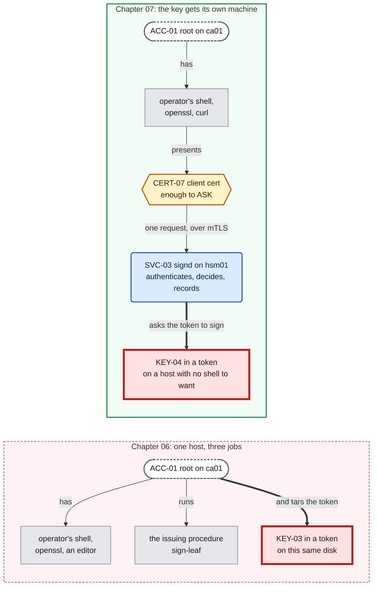
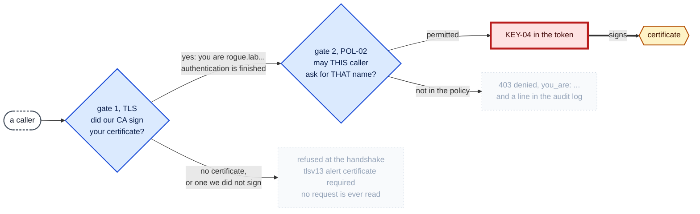
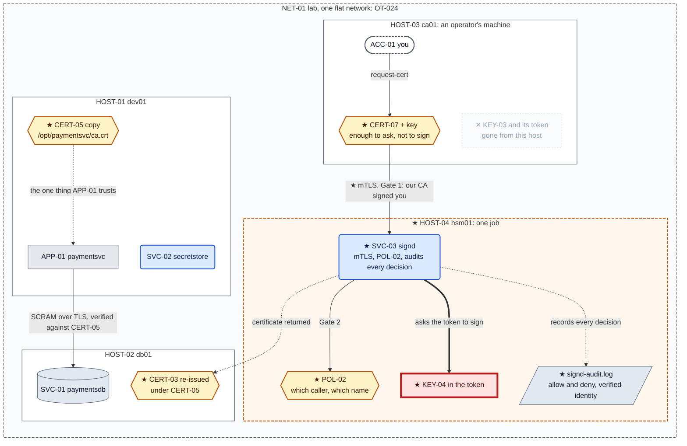

# Chapter 07, The key moves out

**System before this chapter.** Three machines. `HOST-01 dev01` runs `APP-01 paymentsvc` and
`SVC-02 secretstore`; `HOST-02 db01` runs `SVC-01 paymentsdb`; `HOST-03 ca01` holds `KEY-03`
inside a PKCS#11 token and signs certificates with it. The token refuses to export the key, and
Chapter 06 proved it: `sensitive, always sensitive, never extractable, local`.

**The pressure.** `OT-026`. The refusal is real and the box is portable.

> SoftHSM is a library reading files, and the files are on a general purpose host. Root cannot
> read `KEY-03` through the API and can carry the entire token away in a tar. Restore it
> somewhere else, supply the PIN, and sign.

Chapter 06 closed five of six disclosure paths and said so precisely. This chapter is about the
sixth, and about the fact that `ca01` is the wrong machine to be holding anything: it is where
an operator works, where a procedure runs, and where the key lives, all at once.

**What you'll have working by the end of this chapter.**

- The token stolen off `ca01` with `tar` and used on another machine, which is `OT-026` measured
  rather than asserted.
- `HOST-04 hsm01`, the smallest machine in this build: a token, one service, and nothing an
  operator would enjoy having a shell on.
- `SVC-03 signd`, which takes the caller's identity from the TLS layer rather than from the
  request, the way Chapter 03 took it from the kernel.
- A certificate **this build's own authority issued**, presented by a caller with no business
  signing, accepted by the handshake and refused by `POL-02`.
- The third root in three chapters, and an honest account of why that is a symptom.

---

## 0. If your output differs

Certificate serials, dates, container IDs and PKCS#11 slot numbers will differ. Slot numbers in
particular are assigned at random on every initialisation, so nothing here refers to one.

The PINs are `5678` and `1234` again, and are still lab values printed in a book.

Work in this chapter's `lab/` folder:

```bash
cd "chapters/Chapter 07/lab"
ls
```

Expected: `docker-compose.yml`, and the directories `dev01/`, `db01/`, `ca01/` and `hsm01/`.

### The lab in full

What **this** chapter writes is marked ★:

```
lab/
├── docker-compose.yml              ★ changed: hsm01 added, ca01 retagged
├── dev01/
│   ├── Dockerfile                    Chapter 01
│   ├── entrypoint.sh                 Chapter 01
│   ├── initdb.sql                    Chapter 01, seed for dev01 only, never re-run
│   ├── app/
│   │   ├── config.yaml               Chapter 05, unchanged: the anchor path is the same
│   │   └── paymentsvc.py             Chapter 04
│   └── secretstore/
│       ├── secretstore.py            Chapter 03
│       ├── secretstore-set.py        Chapter 02
│       └── policy.json               Chapter 03
├── db01/
│   ├── Dockerfile                    Chapter 04
│   ├── entrypoint.sh                 Chapter 04
│   └── impostor.py                   Chapter 04
├── ca01/
│   ├── Dockerfile                  ★ changed: no token, no PIN, no group. A client
│   ├── entrypoint.sh               ★ changed: sleeps for a smaller reason
│   └── request-cert.sh             ★ new: PROC-02, rewritten from signing to asking
└── hsm01/                          ★ new: HOST-04
    ├── Dockerfile                  ★ new
    ├── entrypoint.sh               ★ new
    ├── hsm-init.sh                 ★ moved from ca01: the ceremony happens here now
    ├── sign-leaf.sh                ★ moved and changed: gained --client
    ├── signd.py                    ★ new: SVC-03
    └── policy.json                 ★ new: POL-02
```

**`sign-leaf.sh` and `hsm-init.sh` moved rather than being copied.** They are not on `ca01` any
more. If a script that touches the key is still on the machine you were trying to take the key
off, the move did not happen.

### Before you start: this chapter continues an existing lab

`dev01` is built once in Chapter 01, `db01` once in Chapter 04, `ca01` in Chapter 05 and
rebuilt in Chapter 06. **Building from here does not give you this chapter's starting state.**
That state is what running the earlier chapters leaves behind.

If you have not worked the earlier chapters, start at Chapter 01. If you have, check that the
lab is where this chapter expects it:

```bash
sudo docker exec -u ca ca01 sh -c '
  pkcs11-tool --module /usr/lib/softhsm/libsofthsm2.so --token-label ca-token \
              --login --pin "$(cat /var/lib/ca/pin)" --list-objects | head -6'
sudo docker exec dev01 openssl x509 -in /opt/paymentsvc/ca.crt -noout -subject
curl -s http://127.0.0.1:8080/credinfo
```

Expected: a private key object reporting `sensitive, always sensitive, never extractable,
local`; an anchor on `dev01` whose subject is `CN = Simurgh Lab Root CA`; and `"sslmode":
"verify-full"`.

If the containers are stopped, start everything first:

```bash
sudo docker start db01 ca01 dev01
sudo docker exec dev01 sh -c '
  for i in $(seq 1 30); do pg_isready -q -h 127.0.0.1 -p 5432 && break; sleep 1; done
  pg_ctlcluster 15 main stop'
sudo docker exec -d -u secretstore dev01 \
    sh -c 'python3 /opt/secretstore/secretstore.py >>/var/log/secretstore.out 2>&1'
sleep 1
sudo docker exec -d -u paymentsvc dev01 \
    sh -c 'python3 /opt/paymentsvc/paymentsvc.py >>/var/log/paymentsvc.out 2>&1'
```

Expected: `{"status": "ok"}` from a `curl` to `/healthz`.

---

## 1. Take the box

Chapter 06 §9 showed the token could be copied and stopped there, because the chapter had run
its length. Finish the job, because the cost of this chapter is a third root and nobody should
pay that for a theoretical attack.

You are root on `ca01`. The API will not give you the key, so do not ask it:

```bash
sudo docker exec ca01 tar -cf /tmp/token.tar -C /var/lib/softhsm tokens
sudo docker exec ca01 cat /var/lib/ca/pin
sudo docker cp ca01:/tmp/token.tar /tmp/token.tar
ls -l /tmp/token.tar
```

Expected: the PIN, `5678`, and a tar of a few tens of kilobytes on your laptop.

Now use it somewhere else. A throwaway container with the same software, and nothing of ours:

```bash
sudo docker run --rm -v /tmp/token.tar:/tmp/token.tar:ro debian:12-slim sh -c '
  apt-get update -qq
  apt-get install -y -qq --no-install-recommends softhsm2 opensc openssl >/dev/null 2>&1
  tar -xf /tmp/token.tar -C /var/lib/softhsm
  openssl req -new -x509 -days 3650 -sha256 -engine pkcs11 -keyform engine \
    -key "pkcs11:token=ca-token;object=ca-key;type=private?pin-value=5678" \
    -subj "/CN=Simurgh Lab Root CA" -out /tmp/forged-root.crt 2>/dev/null
  openssl x509 -in /tmp/forged-root.crt -noout -subject -issuer'
```

Expected: subject and issuer both `CN = Simurgh Lab Root CA`.

**That machine is now the authority.** It never saw the key, because the key is still
unextractable, and it does not need to: it has the box the key is in, and the box does what it
is asked. Every promise Chapter 06 made is intact, and the outcome is the same as if none of
them had been made.

Read the shape of that carefully, because it is the difference between two things that are
constantly confused. The token enforces **a property of the key**: it will not be revealed. It
does not enforce **a property of the machine**: that only authorised callers may use it.
Chapter 06 bought the first and this chapter is about discovering the second was never
included.

Clean up, and note that you cannot clean up the copy somebody else took:

```bash
rm -f /tmp/token.tar
sudo docker exec ca01 rm -f /tmp/token.tar
```

---

## 2. What moving the key actually buys

The instinct after §1 is to protect the token directory harder. Do not follow it. Chapter 01
established that root is the kernel's exception to every file control, Chapter 06 established
that a token cannot be read through its API, and §1 just established that neither fact helps
when the attacker owns the host. There is no third file permission.

What is left is to change **which host**. Not to a machine that is protected better, to a
machine that is *smaller*:

> Give the key a machine whose only job is to hold it and answer one question. Then the
> population of things that can reach the key is the population of things on that machine, and
> you get to choose that population.

`ca01` today is the worst possible home for it. An operator has a shell there, a procedure runs
there, `openssl` and an editor are installed there, and the key is there. Any of those being
compromised is all of them being compromised.



**Figure 7.1, what the move changes.** Follow root on `ca01` in each panel. On the left every
arrow ends at something valuable, and the thick one ends at the key. On the right the same
attacker reaches a shell, some tools and a client certificate, and the thick edge is on the
other side of a boundary they are not on. What they gain is the ability to **ask**, which
`POL-02` then bounds.

**Be exact about what this is not.** Root on `hsm01` still tars that token, and §10 says so.
The claim is narrower and worth having: the population of people and processes that can become
root on `hsm01` is far smaller than on `ca01`, because there is nothing on `hsm01` to be root
*for*. Security by having less installed is unglamorous and it is most of what a bastion, a
jump host or an appliance is actually selling.

---

## 3. `HOST-04 hsm01`

`hsm01/Dockerfile`:

```dockerfile
# HOST-04 hsm01, the machine that holds the key and signs.
#
# This is the smallest machine in the build and that is the point. It holds
# KEY-04 and answers one question: "sign this". Everything a general purpose
# host carries is another way to reach the key, so nothing a general purpose
# host carries is installed. There is no application, no database, no secret
# store, no curl and no editor.
#
# Compare it with ca01 as Chapter 06 left it. That machine held the key AND
# ran the issuing procedure AND was where an operator worked. Chapter 07
# splits those, because OT-026 is about what root on a busy host can take.
FROM debian:12-slim

ENV DEBIAN_FRONTEND=noninteractive

# Chapter 06 adds three packages and they are worth naming separately:
#
#   softhsm2                  the token itself, a PKCS#11 implementation in
#                             software. Honest about being software, which
#                             is exactly why we start here.
#   opensc                    gives us pkcs11-tool, the way to talk to a
#                             token directly rather than through openssl.
#   libengine-pkcs11-openssl  the bridge. Lets openssl use a key it cannot
#                             read, by asking the token to sign instead.
RUN apt-get update \
 && apt-get install -y --no-install-recommends \
      openssl \
      ca-certificates \
      softhsm2 \
      opensc \
      libengine-pkcs11-openssl \
      python3 \
 && rm -rf /var/lib/apt/lists/*

# ACC-09. The identity that owns the token on THIS host and runs SVC-03.
# ACC-08 stays behind on ca01 and no longer has a key to own.
RUN useradd --system --home-dir /var/lib/ca --shell /usr/sbin/nologin signd \
 && usermod -aG softhsm signd

# The softhsm2 package gates /etc/softhsm and /var/lib/softhsm on the
# `softhsm` GROUP, mode 0750 and 2770, not on ownership. Chowning them to
# `ca` would fight the package and break on the next upgrade. Joining the
# group is how the platform intends this to work, and it is worth noticing
# what that means: membership of a Unix group is the access control on the
# signing key. That is OT-025.

# /var/lib/ca          CERT-04 and the record of what has been issued
# /var/lib/ca/issued   a copy of every certificate this CA has ever signed
# The token itself lives under /var/lib/softhsm/tokens, which the package
# owns and which `ca` reaches through group membership above. The PINs live
# in /var/lib/ca, which `ca` owns outright, rather than in /etc/softhsm,
# which it does not.
#
# Note what is no longer here: there is no ca.key. From Chapter 06 the
# private key is not a file this Dockerfile could create, chmod or copy.
RUN mkdir -p /var/lib/ca/issued /etc/signd \
 && chown -R signd:signd /var/lib/ca /etc/signd \
 && chmod 0700 /var/lib/ca /var/lib/ca/issued \
 && touch /var/log/signd-audit.log /var/log/signd.out \
 && chown signd:signd /var/log/signd-audit.log /var/log/signd.out \
 && chmod 0600 /var/log/signd-audit.log \
 && chmod 0644 /var/log/signd.out

# signd.out has to exist and be owned by ACC-09 BEFORE anything starts.
# /var/log is root-owned 0755, so `signd` cannot create a file in it, and
# the shell performs `>>/var/log/signd.out` as that user. If the file is
# missing the redirect fails, the process never starts, and docker exec -d
# returns success while telling you nothing. Chapter 01 hit this for
# paymentsvc.out and Chapter 02 section 4.4 hit it for secretstore.out.

COPY hsm-init.sh   /usr/local/bin/hsm-init
COPY sign-leaf.sh  /usr/local/bin/sign-leaf
COPY signd.py      /usr/local/bin/signd
COPY policy.json   /etc/signd/policy.json
COPY entrypoint.sh /usr/local/bin/entrypoint.sh

# Pinned rather than inherited from your umask, for the same reason
# Chapter 01 pinned the modes on dev01: a file mode that depends on who
# built the image is not a file mode anyone chose.
# POL-02 is 0644 for the same reason POL-01 is: a policy holds rules, not
# values, and a rule nobody can read is a rule nobody can review. D-028.
RUN chmod 0755 /usr/local/bin/hsm-init /usr/local/bin/sign-leaf \
               /usr/local/bin/signd /usr/local/bin/entrypoint.sh \
 && chmod 0644 /etc/signd/policy.json

ENTRYPOINT ["/usr/local/bin/entrypoint.sh"]
```

**`signd.out` is created in the Dockerfile and that line is load-bearing.** `/var/log` is
root-owned and `0755`, so `ACC-09` cannot create a file there, and the shell performs
`>>/var/log/signd.out` as that user. Without the file the redirect fails, the process never
starts, and `docker exec -d` returns success while telling you nothing. Chapter 01's entrypoint
does this for `paymentsvc.out` and Chapter 02 §4.4 does it for `secretstore.out`. It is the third
time, and it still costs an evening if you meet it cold.

The package list is the design. `python3` is there for `SVC-03` and there is no `curl`, no
editor and no application runtime, because each of those is a way to move data off a machine
whose whole purpose is that one thing cannot be moved off it.

`hsm01/entrypoint.sh`, which starts nothing, because `SVC-03` is started by hand like every
other process in this build:

```bash
#!/bin/sh
set -e

# hsm01 runs one thing, and unlike ca01 it does have something to start.
#
# Chapter 05 gave ca01 an entrypoint that slept, because a CA that nobody
# calls is a key and a procedure. Chapter 07 gives the authority a caller,
# so there is now a process that has to be listening. That process is the
# whole reason this host exists, and it is the only thing installed here.
#
# It is still started by hand, like every other process in this build.
# HOST-04 has no service manager either, which is OT-009 acquiring a
# fourth machine to be true on.

exec sleep infinity
```

And the compose file gains a fourth service. `docker-compose.yml`, in full:

```yaml
# The lab substrate: one container per "machine" in the ledger.
#
# Bring each machine up ONCE, in the chapter that introduces it, naming the
# service so you only build that one:
#     Chapter 01:  docker compose up -d --build dev01
#     Chapter 04:  docker compose up -d --build db01
#     Chapter 05:  docker compose up -d --build ca01
#     Chapter 06:  docker compose up -d --build ca01   (rebuild: ca01 gains a token)
#     Chapter 07:  docker compose up -d --build hsm01
#                  and rebuild ca01, which loses it again
#
# After that, chapters deploy into the running container with `docker cp`.
# Rebuilding is not forbidden, it is a reset: a rebuilt dev01 starts from
# Chapter 01's image again and loses everything the later chapters built
# inside it, which is OS accounts, file modes, database rows and some
# deliberately left log lines. If you do rebuild, you are starting the lab
# over and need to work the chapters forward again.
#
# This file is identical in every chapter's lab/ folder until a chapter
# adds a machine, so `docker compose up -d` from any of them is a no-op on
# a lab that is already running.
#
# Processes inside the containers are still started by hand. That is not an
# oversight: these hosts have no service manager, and giving them one is a
# chapter of its own.

name: lab

services:
  dev01:                                    # HOST-01, where the app and the secret store live
    build:
      context: ./dev01
      dockerfile: Dockerfile
    image: ksm/dev01:chapter01              # named for the chapter that builds it
    container_name: dev01
    hostname: dev01.lab.simurgh.example

    # Published on the laptop's loopback only, never on the network. The
    # difference between 127.0.0.1:8080:8080 and 8080:8080 is the difference
    # between a service your laptop can reach and one the coffee shop can.
    ports:
      - "127.0.0.1:8080:8080"

    # tcpdump needs this to put an interface into the mode it wants.
    cap_add:
      - NET_ADMIN

    # Reap zombies and forward signals. The entrypoint ends in
    # `sleep infinity`, which is not a real init.
    init: true

    # Substrate only: reports, gates nothing.
    healthcheck:
      test: ["CMD", "pg_isready", "-q", "-h", "127.0.0.1", "-p", "5432"]
      interval: 10s
      timeout: 3s
      retries: 5
      start_period: 20s

    stop_grace_period: 5s

  db01:                                     # HOST-02, the database, added in Chapter 04
    build:
      context: ./db01
      dockerfile: Dockerfile
    image: ksm/db01:chapter04
    container_name: db01
    hostname: db01.lab.simurgh.example

    # The name the certificate is issued for, and the name APP-01 connects
    # to. Compose resolves the service name `db01` by default; this alias
    # adds the fully qualified name so `sslmode=verify-full` has something
    # to match against.
    networks:
      default:
        aliases:
          - db01.lab.simurgh.example

    # No `ports:` at all. The database is reachable from dev01 across the
    # lab network and from nowhere else. Chapter 01 published 8080 because
    # you need to curl it; nothing outside the lab has any business
    # reaching 5432.

    cap_add:
      - NET_ADMIN

    init: true

    healthcheck:
      test: ["CMD", "pg_isready", "-q", "-h", "127.0.0.1", "-p", "5432"]
      interval: 10s
      timeout: 3s
      retries: 5
      start_period: 20s

    stop_grace_period: 5s

  ca01:                                     # HOST-03, the certificate authority, added in Chapter 05
    build:
      context: ./ca01
      dockerfile: Dockerfile
    image: ksm/ca01:chapter07
    container_name: ca01
    hostname: ca01.lab.simurgh.example

    # No ports, and no network alias. Nothing connects to this machine.
    # An authority that answers requests is a service with an attack
    # surface and an issuance policy; this one is a key, a procedure and
    # an operator, which is all OT-017 asked for. When something needs to
    # request a certificate without a human, that is its own chapter.

    init: true

    # No healthcheck. There is no process to be healthy: the CA is files
    # on a disk and a script somebody runs. `docker compose ps` will show
    # it as running because the entrypoint sleeps, and that is the whole
    # truth about it.

    stop_grace_period: 5s

  hsm01:                                    # HOST-04, the machine that holds the key, added in Chapter 07
    build:
      context: ./hsm01
      dockerfile: Dockerfile
    image: ksm/hsm01:chapter07
    container_name: hsm01
    hostname: hsm01.lab.simurgh.example

    # The name SVC-03's certificate is issued for, and the name ca01 dials.
    # verify-full on the client needs these to be the same string, which is
    # the lesson Chapter 05 section 6 paid for.
    networks:
      default:
        aliases:
          - hsm01.lab.simurgh.example

    # No ports. SVC-03 listens on 8443 and is reachable from the lab network
    # and from nowhere else. Nothing outside the lab has any business
    # reaching the machine that signs certificates, and OT-024 is the
    # observation that "the lab network" is still far too many things.

    init: true

    # No healthcheck. SVC-03 is started by hand like every other process in
    # this build, so a healthcheck would report on a service that is usually
    # not running yet and tell you nothing. OT-009, on a fourth machine.

    stop_grace_period: 5s
```

Build it, and name the service:

```bash
sudo docker compose up -d --build hsm01
sudo docker compose ps
```

Expected: `dev01`, `db01` and `ca01` untouched, and `hsm01` running with no health status.

---

## 4. The ceremony, on the machine that will keep the key

`hsm-init.sh` moved from `ca01` unchanged except for the object it names. Run it here, and note
that this is the **third** key ceremony in three chapters. §9 is about why.

`hsm01/hsm-init.sh`:

```bash
#!/bin/sh
# PROC-03, the key ceremony. Run once, as the `ca` user, on ca01.
#
#   hsm-init
#
# Creates the token, generates KEY-04 inside it, and proves the key cannot
# come back out. It never writes a private key to disk, because there is no
# point in the process at which one exists outside the token.
#
# Everything here is deliberately noisy. A key ceremony whose output nobody
# reads is a ceremony, in the pejorative sense.

set -eu

MODULE=/usr/lib/softhsm/libsofthsm2.so
TOKEN=ca-token
LABEL=ca-key
PIN_FILE=/var/lib/ca/pin          # SEC-04, the user PIN
SO_PIN_FILE=/var/lib/ca/so-pin    # SEC-05, the security officer PIN

[ -r "$PIN_FILE" ]    || { echo "hsm-init: cannot read $PIN_FILE. Run as the 'signd' user." >&2; exit 1; }
[ -r "$SO_PIN_FILE" ] || { echo "hsm-init: cannot read $SO_PIN_FILE." >&2; exit 1; }
PIN=$(cat "$PIN_FILE")
SO_PIN=$(cat "$SO_PIN_FILE")

echo "== 1. initialise the token =="
# --free takes the first uninitialised slot. The slot NUMBER it returns is
# assigned at random and differs on every machine, so nothing after this
# line refers to a slot. Tokens are addressed by label, always.
softhsm2-util --init-token --free --label "$TOKEN" \
              --so-pin "$SO_PIN" --pin "$PIN"

echo
echo "== 2. generate KEY-04 inside the token =="
# There is no --out. That is the whole point: the key is created in the
# token and the command has nowhere to put a copy even if it wanted one.
pkcs11-tool --module "$MODULE" --token-label "$TOKEN" --login --pin "$PIN" \
            --keypairgen --key-type EC:prime256v1 --label "$LABEL" --id 01

echo
echo "== 3. what the token says about it =="
pkcs11-tool --module "$MODULE" --token-label "$TOKEN" --login --pin "$PIN" \
            --list-objects

echo
echo "== 4. prove it cannot be extracted =="
# pkcs11-tool refuses to read a private key and STILL EXITS 0, so the exit
# status proves nothing. Check for the absence of the file instead. This is
# the same shape as Chapter 01 section 5.2: a measurement that cannot tell
# success from failure is not a measurement.
rm -f /tmp/extraction-attempt
pkcs11-tool --module "$MODULE" --token-label "$TOKEN" --login --pin "$PIN" \
            --read-object --type privkey --label "$LABEL" \
            -o /tmp/extraction-attempt 2>&1 || true
if [ -s /tmp/extraction-attempt ]; then
    echo "FAIL: something was written. The key is extractable and this token is useless." >&2
    rm -f /tmp/extraction-attempt
    exit 1
fi
rm -f /tmp/extraction-attempt
echo "OK: no key material was produced."

echo
echo "== 5. record what was created =="
date -u +"%Y-%m-%dT%H:%M:%SZ  KEY-04 generated in token $TOKEN, label $LABEL" \
    >> /var/lib/ca/ceremony.log
cat /var/lib/ca/ceremony.log
```


```bash
sudo docker exec hsm01 sh -c '
  printf "5678" > /var/lib/ca/pin
  printf "1234" > /var/lib/ca/so-pin
  chown signd:signd /var/lib/ca/pin /var/lib/ca/so-pin
  chmod 0400 /var/lib/ca/pin /var/lib/ca/so-pin'
sudo docker exec -u signd hsm01 hsm-init
```

Expected: a token initialised, `KEY-04` generated, `Access: sensitive, always sensitive, never
extractable, local`, then `OK: no key material was produced.` and a line in the ceremony log.

`KEY-04`, not `KEY-03` moved. A key that travelled to this machine would report `local: false`
and would have spent a chapter on `ca01`, which is the host we have just decided we do not
trust with it. `D-050` said provenance cannot be retrofitted; this is the same rule applied to
a machine rather than to a file.

Now `CERT-05`, the third root:

```bash
sudo docker exec -u signd hsm01 sh -c '
  openssl req -new -x509 -days 3650 -sha256 \
    -engine pkcs11 -keyform engine \
    -key "pkcs11:token=ca-token;object=ca-key;type=private?pin-value=$(cat /var/lib/ca/pin)" \
    -subj "/CN=Simurgh Lab Root CA" \
    -addext "basicConstraints=critical,CA:TRUE,pathlen:0" \
    -addext "keyUsage=critical,keyCertSign,cRLSign" \
    -out /var/lib/ca/ca.crt'
sudo docker exec hsm01 openssl x509 -in /var/lib/ca/ca.crt -noout -subject -dates
```

Expected: `CN = Simurgh Lab Root CA` and ten years of validity.

---

## 5. The bootstrap problem

`SVC-03` will authenticate its callers with certificates. `ca01` therefore needs a certificate.
Certificates come from the authority. The authority is the thing `ca01` is trying to reach.

That circle has a name and no clever escape: **you cannot use a system to issue the credential
that grants access to that system.** Every PKI meets it, and the answer is always the same
shape, which is that the first credentials are made during the ceremony, by hand, on the
machine that holds the key, before the service that will require them is running.

So issue three certificates here, locally, while nothing is enforcing anything:

```bash
sudo docker exec hsm01 sh -c '
  for who in signd ca01; do
    case $who in
      signd) cn=hsm01.lab.simurgh.example ;;
      ca01)  cn=ca01.lab.simurgh.example ;;
    esac
    openssl ecparam -name prime256v1 -genkey -noout -out /var/lib/ca/$who.key
    openssl req -new -key /var/lib/ca/$who.key -out /tmp/$who.csr -subj "/CN=$cn"
    chown signd:signd /var/lib/ca/$who.key /tmp/$who.csr
  done'
```

Now sign them. The server certificate first, which is the ordinary case:

```bash
sudo docker exec -u signd hsm01 sign-leaf /tmp/signd.csr hsm01.lab.simurgh.example
```

Expected: `issued: /var/lib/ca/issued/hsm01.lab.simurgh.example.crt`, ninety days, and
`TLS Web Server Authentication`.

### 5.1 Make it fail: the certificate that is valid and unusable

Do the client certificate the same way, because it is the same command:

```bash
sudo docker exec -u signd hsm01 sign-leaf /tmp/ca01.csr ca01.lab.simurgh.example
sudo docker exec hsm01 openssl x509 -noout -ext extendedKeyUsage \
    -in /var/lib/ca/issued/ca01.lab.simurgh.example.crt
```

Expected: `TLS Web Server Authentication`.

Nothing has broken yet, and it will, several sections from now, with an error that points
somewhere else entirely. When `ca01` presents this certificate the handshake fails with:

```
sslv3 alert unsupported certificate
```

That message names neither `extendedKeyUsage` nor client authentication, and it arrives
**before** `POL-02` is consulted, so the obvious reading is that the policy is wrong or the CA
is untrusted. It is neither. Chapter 05 §4 already said each certificate declares the one job
it exists to do, and this build has been stamping `serverAuth` on everything since then because
everything it issued was for a server.

`hsm01/sign-leaf.sh`, with the flag that fixes it:

```bash
#!/bin/sh
# PROC-02, the issuing half. Signs a certificate request with KEY-03.
#
#   sign-leaf [--client] <csr-file> <fqdn> [additional-dns-name ...]
#
# Chapter 07 adds --client. A certificate carries extendedKeyUsage, which
# states the one job it exists to do, and a client refuses a certificate
# issued for serverAuth exactly as firmly as it refuses an untrusted one.
# The error says `unsupported certificate` and mentions neither the field
# nor the purpose, which is why this is a flag and not something to
# remember.
#
# Chapter 06 changed one thing and it is the only thing worth noticing:
# there is no CA_KEY variable any more. The key is not a file this script
# could read, so it does not read one. It hands the request to the token
# and the token hands back a signature.
#
# What this script exists to prevent is still the failure in Chapter 05
# section 6: a certificate signed with a Subject Alternative Name that does
# not contain the name the client actually dials. The Common Name is not
# consulted when a SAN is present, so a leaf whose CN is perfect and whose
# SAN is wrong is rejected, and the error says nothing about the CN.

set -eu

CA_DIR=/var/lib/ca
CA_CRT="$CA_DIR/ca.crt"          # CERT-04, public, an ordinary file
ISSUED="$CA_DIR/issued"
DAYS=90                          # leaves are short-lived; the root is not

MODULE=/usr/lib/softhsm/libsofthsm2.so
TOKEN=ca-token
LABEL=ca-key
PIN_FILE=/var/lib/ca/pin        # SEC-04

EKU=serverAuth
if [ "${1:-}" = "--client" ]; then
    EKU=clientAuth
    shift
fi

if [ $# -lt 2 ]; then
    echo "usage: sign-leaf [--client] <csr-file> <fqdn> [additional-dns-name ...]" >&2
    exit 2
fi

CSR="$1"; FQDN="$2"; shift 2

[ -r "$CSR" ]      || { echo "sign-leaf: cannot read CSR: $CSR" >&2; exit 1; }
[ -r "$CA_CRT" ]   || { echo "sign-leaf: cannot read CERT-04: $CA_CRT" >&2; exit 1; }
[ -r "$PIN_FILE" ] || { echo "sign-leaf: cannot read the PIN. Run as the 'signd' user." >&2; exit 1; }
PIN=$(cat "$PIN_FILE")

# The token is addressed by label, never by slot: SoftHSM assigns slot
# numbers at random on every init, so a hard-coded slot works once, on one
# machine. The URI must be quoted or the shell eats the ; and the ?.
KEY_URI="pkcs11:token=$TOKEN;object=$LABEL;type=private?pin-value=$PIN"

# The FQDN is always the first SAN entry. Extra names are appended, which is
# how db01 keeps answering to the short name compose gives it as well as to
# the name the ledger assigned it.
SAN="DNS:$FQDN"
for name in "$@"; do
    SAN="$SAN,DNS:$name"
done

EXT=$(mktemp)
trap 'rm -f "$EXT"' EXIT
cat > "$EXT" <<EOF
subjectAltName=$SAN
basicConstraints=critical,CA:FALSE
keyUsage=critical,digitalSignature,keyEncipherment
extendedKeyUsage=$EKU
EOF

OUT="$ISSUED/$FQDN.crt"

# -CAkeyform engine is what redirects the signature into the token. The
# private key never enters this process; openssl sends the bytes to be
# signed and gets a signature back.
openssl x509 -req \
    -in "$CSR" \
    -CA "$CA_CRT" \
    -engine pkcs11 -CAkeyform engine -CAkey "$KEY_URI" \
    -CAcreateserial \
    -days "$DAYS" -sha256 \
    -extfile "$EXT" \
    -out "$OUT" 2>/dev/null

chmod 0644 "$OUT"

# Print what was actually produced rather than reporting success. The SAN is
# the field that decides whether any client will accept this certificate, so
# it is the field the operator has to see.
echo "issued: $OUT"
openssl x509 -in "$OUT" -noout -serial -subject -dates
openssl x509 -in "$OUT" -noout -ext subjectAltName,extendedKeyUsage
```

A certificate for a client has to say so:

```bash
sudo docker exec -u signd hsm01 sign-leaf --client /tmp/ca01.csr ca01.lab.simurgh.example
sudo docker exec hsm01 openssl x509 -noout -ext extendedKeyUsage \
    -in /var/lib/ca/issued/ca01.lab.simurgh.example.crt
```

Expected: `TLS Web Client Authentication`.

That flag is the whole fix, and the reason it is a flag rather than a thing to remember is that
the failure it prevents is unreadable. `extendedKeyUsage` is a field almost nobody looks at
until a handshake refuses a certificate that is signed correctly, in date, and for the right
name.

Install `SVC-03`'s own certificate and key where it expects them:

```bash
sudo docker exec hsm01 sh -c '
  cp /var/lib/ca/issued/hsm01.lab.simurgh.example.crt /var/lib/ca/signd.crt
  chown signd:signd /var/lib/ca/signd.crt /var/lib/ca/signd.key
  chmod 0600 /var/lib/ca/signd.key'
```

---

## 6. `SVC-03 signd`

`hsm01/signd.py`. Standard library only, and it holds no key:

```python
#!/usr/bin/env python3
"""SVC-03 signd, the signing service on HOST-04 hsm01.

The token lives here and nothing else does. Callers send a certificate request
over mTLS and get a certificate back; the key never leaves this machine, and
after Chapter 07 it never leaves this machine's token either.

Three things this deliberately does, and one it deliberately does not.

DOES take the caller's identity from the TLS layer rather than from the request.
The client certificate is checked against CERT-05 by the kernel of the TLS
handshake before a single byte of the request body is read, and the name comes
out of that certificate. It is Chapter 03's SO_PEERCRED argument moved onto a
network: an observation, not a claim.

DOES consult POL-02 on every request. mTLS answers "did our authority sign your
certificate" and nothing else. Any holder of any certificate we ever issued can
open this connection, which is exactly what Chapter 07 section 5 demonstrates,
so authentication and authorization stay separate questions.

DOES record every decision, allowed or refused, with the identity the TLS layer
reported and the name that was requested. SVC-02 has done this since Chapter 02
and the authority has never done it at all.

DOES NOT hold the key. It shells out to sign-leaf, which asks the token. This
process could be compromised entirely and the attacker would gain the ability to
request signatures while this process lives, not a key they can keep.
"""
import http.server
import json
import os
import re
import ssl
import subprocess
import sys
import tempfile
import datetime

LISTEN = ("0.0.0.0", 8443)
CA_CRT = "/var/lib/ca/ca.crt"                 # CERT-05, the root we verify clients against
SRV_CRT = "/var/lib/ca/signd.crt"             # CERT-06, what we present
SRV_KEY = "/var/lib/ca/signd.key"
POLICY = "/etc/signd/policy.json"             # POL-02
AUDIT = "/var/log/signd-audit.log"

# A name we will sign for has to look like a hostname. This is not a security
# control, it is a guard against a malformed request becoming a malformed
# openssl invocation; POL-02 is the control.
NAME_RE = re.compile(r"^[a-z0-9]([a-z0-9-]*[a-z0-9])?(\.[a-z0-9]([a-z0-9-]*[a-z0-9])?)*$")


def audit(caller, requested, decision, detail=""):
    """Append one line per decision. Allowed and refused both, or the log only
    tells you about the requests that worked."""
    line = "\t".join([
        datetime.datetime.now(datetime.timezone.utc).strftime("%Y-%m-%dT%H:%M:%SZ"),
        f"caller={caller}", f"requested={requested}",
        f"decision={decision}", detail,
    ])
    with open(AUDIT, "a") as fh:
        fh.write(line + "\n")
    print(line, flush=True)


def load_policy():
    """Re-read on every request, so an edit takes effect on the next call.
    Inefficient and deliberate, exactly as POL-01 is in SVC-02."""
    with open(POLICY) as fh:
        return json.load(fh)


class Handler(http.server.BaseHTTPRequestHandler):
    server_version = "signd/1.0"

    def _json(self, code, obj):
        body = json.dumps(obj).encode()
        self.send_response(code)
        self.send_header("Content-Type", "application/json")
        self.send_header("Content-Length", str(len(body)))
        self.end_headers()
        self.wfile.write(body)

    def peer_name(self):
        """Who is calling, according to the certificate they proved they hold.

        getpeercert() returns the parsed client certificate. It is present only
        because the context was built with CERT_REQUIRED, so by the time this
        runs the chain has already been verified against CERT-05. Nothing here
        trusts anything the caller wrote in the request.
        """
        cert = self.connection.getpeercert()
        if not cert:
            return None
        for dns in [v for k, v in cert.get("subjectAltName", ()) if k == "DNS"]:
            return dns
        subject = dict(x[0] for x in cert.get("subject", ()))
        return subject.get("commonName")

    def do_POST(self):
        caller = self.peer_name() or "unknown"
        if self.path != "/v1/sign":
            return self._json(404, {"error": "not found"})

        length = int(self.headers.get("Content-Length") or 0)
        if length <= 0 or length > 16384:
            audit(caller, "-", "deny", "detail=bad request size")
            return self._json(400, {"error": "csr required, 16k max"})
        try:
            req = json.loads(self.rfile.read(length))
            csr, fqdn = req["csr"], req["fqdn"]
            extra = req.get("alt_names", [])
        except Exception:
            audit(caller, "-", "deny", "detail=malformed json")
            return self._json(400, {"error": "malformed request"})

        for name in [fqdn] + list(extra):
            if not isinstance(name, str) or not NAME_RE.match(name):
                audit(caller, fqdn, "deny", f"detail=bad name {name!r}")
                return self._json(400, {"error": f"not a hostname: {name}"})

        # POL-02. mTLS said who is calling. This says whether they may speak
        # for the name they are asking for, which is a different question and
        # the one Chapter 03 section 7.4 is about.
        allowed = load_policy().get(caller, [])
        if fqdn not in allowed:
            audit(caller, fqdn, "deny", "detail=POL-02 does not permit")
            return self._json(403, {
                "error": "denied", "you_are": caller, "requested": fqdn,
                "detail": "POL-02 does not permit this caller to request this name",
            })

        with tempfile.TemporaryDirectory() as tmp:
            path = os.path.join(tmp, "req.csr")
            with open(path, "w") as fh:
                fh.write(csr)
            # sign-leaf owns the token interaction. This process never sees a
            # key, and could not leak one if it were compromised.
            proc = subprocess.run(
                ["/usr/local/bin/sign-leaf", path, fqdn] + list(extra),
                capture_output=True, text=True)
            if proc.returncode != 0:
                audit(caller, fqdn, "error", f"detail=sign-leaf exit {proc.returncode}")
                return self._json(500, {"error": "signing failed"})
            issued = f"/var/lib/ca/issued/{fqdn}.crt"
            with open(issued) as fh:
                cert = fh.read()

        audit(caller, fqdn, "allow", f"detail=issued {fqdn}")
        return self._json(200, {"certificate": cert, "issued_for": fqdn})

    def do_GET(self):
        if self.path == "/healthz":
            return self._json(200, {"status": "ok"})
        return self._json(404, {"error": "not found"})

    def log_message(self, *args):
        """Silence the default access log. Everything that matters goes through
        audit(), which records the verified identity rather than an IP."""
        return


def main():
    ctx = ssl.SSLContext(ssl.PROTOCOL_TLS_SERVER)
    ctx.load_cert_chain(SRV_CRT, SRV_KEY)
    ctx.load_verify_locations(CA_CRT)
    # Without this line the service would accept anyone and read a name out of
    # nothing. With it, the handshake fails before do_POST is ever entered.
    ctx.verify_mode = ssl.CERT_REQUIRED
    ctx.minimum_version = ssl.TLSVersion.TLSv1_2

    srv = http.server.ThreadingHTTPServer(LISTEN, Handler)
    srv.socket = ctx.wrap_socket(srv.socket, server_side=True)
    print(f"signd listening on {LISTEN[0]}:{LISTEN[1]}, mTLS required", flush=True)
    srv.serve_forever()


if __name__ == "__main__":
    sys.exit(main())
```

Three parts of that file decide what the service is.

**Identity comes off the connection, not out of the request.**

```python
    def peer_name(self):
        cert = self.connection.getpeercert()
        if not cert:
            return None
        for dns in [v for k, v in cert.get("subjectAltName", ()) if k == "DNS"]:
            return dns
```

`getpeercert()` returns something only because the context was built with `CERT_REQUIRED`, so
by the time this runs the chain has already been verified against `CERT-05`. This is Chapter
03's `SO_PEERCRED` moved onto a network. There, the kernel vouched because it had performed
both ends of the connection; here, the TLS layer vouches because it has verified a signature
chain. In both cases the caller is not asked and cannot answer.

**The policy is a separate gate.**

```python
        allowed = load_policy().get(caller, [])
        if fqdn not in allowed:
            audit(caller, fqdn, "deny", "detail=POL-02 does not permit")
            return self._json(403, {...})
```

**Every decision is recorded, including the refusals.**

```python
def audit(caller, requested, decision, detail=""):
```

A log of successes tells you what worked. A log that includes refusals tells you somebody
tried, which is the only kind that is useful after an incident. `SVC-02` has done this since
Chapter 02 and the authority has never done it at all.

Start it, and give `ca01` its credentials:

```bash
sudo docker exec -d -u signd hsm01 sh -c 'signd >>/var/log/signd.out 2>&1'
sleep 2
sudo docker exec hsm01 cat /var/log/signd.out

sudo docker cp hsm01:/var/lib/ca/ca.crt /tmp/ca-new.crt
sudo docker cp hsm01:/var/lib/ca/issued/ca01.lab.simurgh.example.crt /tmp/ca01.crt
sudo docker cp hsm01:/var/lib/ca/ca01.key /tmp/ca01.key
```

Expected: `signd listening on 0.0.0.0:8443, mTLS required`.

`ca01` changes shape completely, and the diff is the chapter. `ca01/Dockerfile`:

```dockerfile
# HOST-03 ca01, the machine that requests certificates.
#
# Read this against the Chapter 06 version, because the diff is the chapter.
# That image installed softhsm2, opensc and the PKCS#11 engine, created a
# token directory, and joined the `softhsm` group. None of that is here.
#
# The key, the PIN and the signing all moved to HOST-04 in Chapter 07, so
# what is left on this host is a client: openssl to build a request, curl to
# send it, and a certificate proving who is asking. Root here can read all
# of that, which is enough to ASK for a certificate and not enough to issue
# one. That difference is what OT-026 was about.
FROM debian:12-slim

ENV DEBIAN_FRONTEND=noninteractive

RUN apt-get update \
 && apt-get install -y --no-install-recommends \
      openssl \
      ca-certificates \
      curl \
 && rm -rf /var/lib/apt/lists/*

# ACC-08, unchanged in name and reduced in power. It owned a signing key in
# Chapter 06 and owns a client credential now. The ID stays because the
# identity is the same one, which is D-002 doing its job: what changed is
# what it can do, not who it is.
RUN useradd --system --home-dir /opt/ca-client --shell /usr/sbin/nologin ca

# /opt/ca-client   CERT-05 (the anchor we verify the service against),
#                  CERT-07 and its key (what we present to prove who we are).
#
# 0755, and only the key is restricted. Everything else here is a
# certificate, and a certificate is public by construction.
RUN mkdir -p /opt/ca-client \
 && chown -R ca:ca /opt/ca-client \
 && chmod 0755 /opt/ca-client

COPY request-cert.sh /usr/local/bin/request-cert
COPY entrypoint.sh   /usr/local/bin/entrypoint.sh

# Pinned rather than inherited from your umask, for the same reason
# Chapter 01 pinned the modes on dev01: a file mode that depends on who
# built the image is not a file mode anyone chose.
RUN chmod 0755 /usr/local/bin/request-cert /usr/local/bin/entrypoint.sh

ENTRYPOINT ["/usr/local/bin/entrypoint.sh"]
```

`ca01/entrypoint.sh`:

```bash
#!/bin/sh
set -e

# There is still nothing to start here, and the reason has changed.
#
# In Chapter 05 and Chapter 06 this host slept because the authority was a
# key, a script and a procedure, and nothing needed an answer from it at
# run time. In Chapter 07 the authority is a service, and it is not here:
# it runs on HOST-04 and this machine is one of its clients.
#
# So ca01 sleeps for a smaller reason than before. It is an operator's
# workstation with a client credential on it, and it does its work when a
# human runs request-cert. Nothing listens, nothing holds a key, and
# nothing is lost if this container is destroyed except a certificate that
# SVC-03 would happily issue again.
#
# That last sentence is the measure of what Chapter 07 moved.

exec sleep infinity
```

`ca01/request-cert.sh`, which is `PROC-02` rewritten from signing to asking:

```bash
#!/bin/sh
# PROC-02, rewritten. Requests a certificate from SVC-03 on hsm01.
#
#   request-cert <csr-file> <fqdn> [additional-dns-name ...]
#
# Chapter 06's version of this script signed. This one asks. Everything that
# touches KEY-04 now happens on a machine this one cannot log in to, so what
# is left here is a client: build a request, present a certificate proving
# who we are, and receive a certificate or a refusal.
#
# Note what ca01 no longer has, because it is the point of the chapter. No
# token, no PIN, no softhsm group, no signing key of any kind. Root here can
# read CERT-07 and its key, which is enough to ASK, and POL-02 decides what
# asking gets you. It is not enough to sign anything.

set -eu

SIGND=https://hsm01.lab.simurgh.example:8443/v1/sign
ANCHOR=/opt/ca-client/ca.crt        # CERT-05, so we verify the service
CLIENT_CRT=/opt/ca-client/ca01.crt  # CERT-07, so the service can verify us
CLIENT_KEY=/opt/ca-client/ca01.key

if [ $# -lt 2 ]; then
    echo "usage: request-cert <csr-file> <fqdn> [additional-dns-name ...]" >&2
    exit 2
fi
CSR="$1"; FQDN="$2"; shift 2

[ -r "$CSR" ]        || { echo "request-cert: cannot read CSR: $CSR" >&2; exit 1; }
[ -r "$CLIENT_KEY" ] || { echo "request-cert: cannot read CERT-07's key. Run as 'ca'." >&2; exit 1; }

# Build the JSON body without a JSON library, because this host has python3
# for the application and this script should not depend on it. The CSR is
# PEM, so the only escaping needed is the newlines.
ALT=""
for n in "$@"; do ALT="$ALT\"$n\","; done
ALT=$(printf '%s' "$ALT" | sed 's/,$//')
BODY=$(printf '{"csr": "%s", "fqdn": "%s", "alt_names": [%s]}' \
  "$(sed ':a;N;$!ba;s/\n/\\n/g' "$CSR")" "$FQDN" "$ALT")

# --cacert is not optional. Without it this client would hand a request to
# anything answering on that name, which is Chapter 04 section 7 in reverse:
# there, the app trusted an impostor database; here, we would trust an
# impostor authority and take back a certificate it signed.
RESP=$(curl -sS --fail-with-body \
  --cacert "$ANCHOR" --cert "$CLIENT_CRT" --key "$CLIENT_KEY" \
  -H 'Content-Type: application/json' \
  -X POST "$SIGND" -d "$BODY") || {
    echo "request-cert: refused or unreachable:" >&2
    echo "$RESP" >&2
    exit 1
  }

# Pull the PEM out of the JSON reply. sed rather than a parser, for the same
# reason as above; the field is the last one and the format is ours.
printf '%s' "$RESP" | sed -n 's/.*"certificate": "\(.*\)", "issued_for".*/\1/p' \
  | sed 's/\\n/\n/g'
```

Rebuild `ca01` without its token, and install the client credential:

```bash
sudo docker compose up -d --build ca01
sudo docker cp /tmp/ca-new.crt ca01:/opt/ca-client/ca.crt
sudo docker cp /tmp/ca01.crt   ca01:/opt/ca-client/ca01.crt
sudo docker cp /tmp/ca01.key   ca01:/opt/ca-client/ca01.key
sudo docker exec ca01 sh -c '
  chown ca:ca /opt/ca-client/*
  chmod 0644 /opt/ca-client/ca.crt /opt/ca-client/ca01.crt
  chmod 0400 /opt/ca-client/ca01.key'
rm -f /tmp/ca-new.crt /tmp/ca01.crt /tmp/ca01.key
```

Confirm the key is gone from `ca01`, which is the entire point of the chapter:

```bash
sudo docker exec ca01 sh -c 'ls /var/lib/softhsm 2>&1; which pkcs11-tool sign-leaf 2>&1'
```

Expected: no such directory, and neither command found.

---

## 7. Ask for a certificate

`db01`'s leaf must be re-issued under the new root. The request now goes over the network:

```bash
sudo docker exec db01 sh -c '
  openssl req -new -key /etc/postgresql/15/main/server.key \
    -out /tmp/db01.csr -subj "/CN=db01.lab.simurgh.example"'
sudo docker cp db01:/tmp/db01.csr /tmp/db01.csr
sudo docker cp /tmp/db01.csr ca01:/tmp/db01.csr
sudo docker exec -u ca ca01 request-cert /tmp/db01.csr db01.lab.simurgh.example db01
```

Expected: a PEM certificate on standard output.

Four things had to be true for that to work, and only one of them is about signing. `ca01`
verified `hsm01` against `CERT-05`; `hsm01` verified `ca01`'s certificate against the same
root; `POL-02` permitted that caller to ask for that name; and only then did the token sign.
The signature is the last and least interesting step.

---

## 8. Make it fail: a certificate we issued ourselves

`hsm01/policy.json` is `POL-02`, and it is as small as `POL-01` was:

```json
{
  "ca01.lab.simurgh.example": [
    "db01.lab.simurgh.example"
  ]
}
```

`POL-02` has looked like bureaucracy so far, because the only caller has been permitted. Give
the service a caller it should refuse, and note that this is not an attacker with a forged
certificate. It is a certificate **this authority issued**, to a real host, correctly:

```bash
sudo docker exec hsm01 sh -c '
  openssl ecparam -name prime256v1 -genkey -noout -out /tmp/rogue.key
  openssl req -new -key /tmp/rogue.key -out /tmp/rogue.csr -subj "/CN=rogue.lab.simurgh.example"
  chown signd:signd /tmp/rogue.csr'
sudo docker exec -u signd hsm01 sign-leaf --client /tmp/rogue.csr rogue.lab.simurgh.example
sudo docker cp hsm01:/var/lib/ca/issued/rogue.lab.simurgh.example.crt /tmp/rogue.crt
sudo docker cp hsm01:/tmp/rogue.key /tmp/rogue.key
sudo docker cp /tmp/rogue.crt ca01:/tmp/rogue.crt
sudo docker cp /tmp/rogue.key ca01:/tmp/rogue.key
```

Now ask, as that identity, for the database's name:

```bash
sudo docker exec -u ca ca01 sh -c '
  curl -sS --cacert /opt/ca-client/ca.crt --cert /tmp/rogue.crt --key /tmp/rogue.key \
    -H "Content-Type: application/json" \
    -X POST https://hsm01.lab.simurgh.example:8443/v1/sign \
    -d "{\"csr\": \"x\", \"fqdn\": \"db01.lab.simurgh.example\"}"'
```

Expected:

```
{"error": "denied", "you_are": "rogue.lab.simurgh.example",
 "requested": "db01.lab.simurgh.example",
 "detail": "POL-02 does not permit this caller to request this name"}
```

**The handshake succeeded.** TLS did its job perfectly: it verified a certificate signed by the
trusted authority and reported the name in it. Having done so, it had nothing further to say
about whether that caller should be issued a certificate for a database it has no relationship
with.



**Figure 7.2, two gates, and what each one actually answers.** Gate 1 has exactly one question
and answers it well. Notice what it does **not** ask: not who you are in any organisational
sense, not what you are for, not whether you should be here. It establishes a name and stops.
Every deployment that treats "the client presented a valid certificate" as authorization has
collapsed these two boxes into one, and the population it has then authorised is *everyone the
CA has ever issued to*.

This is the third time this build has made the same mistake in a different place. Chapter 03
§7.4 created `paymentsvc_a`, watched it authenticate, and watched it be refused the table,
because `CREATE ROLE` makes a login and not a permission. Chapter 04 §8.1 found that `verify-
ca` accepts any certificate the authority ever signed, including one an attacker legitimately
obtained. **Authentication tells you who. Authorization tells you whether. Building the first
and assuming the second is the most repeatable error in this field.**

Now read the record:

```bash
sudo docker exec hsm01 cat /var/log/signd-audit.log
```

Expected, two lines:

```
...  caller=ca01.lab.simurgh.example   requested=db01.lab.simurgh.example  decision=allow  ...
...  caller=rogue.lab.simurgh.example  requested=db01.lab.simurgh.example  decision=deny   ...
```

Both identities came off a TLS certificate rather than out of a request body, so unlike Chapter
02's `backup-agent-i-just-made-up` there is no field a caller could have written. The refusal
is recorded as well as the success, which is what makes this a record of attempts rather than a
record of outcomes.

Clean up the rogue credential:

```bash
rm -f /tmp/rogue.crt /tmp/rogue.key
sudo docker exec ca01 rm -f /tmp/rogue.crt /tmp/rogue.key
```

---

## 9. The third root, and why that is the real finding

Install the new leaf on `db01` and migrate the anchor, using Chapter 06 §8's overlap: trust
both roots, move the server, drop the old one.

```bash
sudo docker exec -u ca ca01 request-cert /tmp/db01.csr db01.lab.simurgh.example db01 \
  > /tmp/db01-new.crt
sudo docker cp hsm01:/var/lib/ca/ca.crt /tmp/ca-new.crt
sudo docker exec dev01 cp /opt/paymentsvc/ca.crt /tmp/ca-old.crt
sudo docker cp /tmp/ca-new.crt dev01:/tmp/ca-new.crt
sudo docker exec dev01 sh -c 'cat /tmp/ca-old.crt /tmp/ca-new.crt > /opt/paymentsvc/ca.crt'
sudo docker exec dev01 chmod 0444 /opt/paymentsvc/ca.crt

sudo docker cp /tmp/db01-new.crt db01:/etc/postgresql/15/main/server.crt
sudo docker exec db01 sh -c '
  chown postgres:postgres /etc/postgresql/15/main/server.crt
  chmod 0644 /etc/postgresql/15/main/server.crt'
sudo docker exec db01 pg_ctlcluster 15 main restart

sudo docker exec dev01 sh -c 'cat /tmp/ca-new.crt > /opt/paymentsvc/ca.crt'
sudo docker exec dev01 chmod 0444 /opt/paymentsvc/ca.crt
sudo docker exec dev01 pkill -f paymentsvc.py || true
sleep 1
sudo docker exec -d -u paymentsvc dev01 \
    sh -c 'python3 /opt/paymentsvc/paymentsvc.py >>/var/log/paymentsvc.out 2>&1'
sleep 3
curl -s http://127.0.0.1:8080/payments/1001/status
```

Expected: the payment record.

That worked, and it should not be comfortable. **This is the third root in three chapters.**
Chapter 05 built one, Chapter 06 replaced it to get the key into a token, and Chapter 07
replaced it again to get the token onto its own machine. Each migration was three writes and no
outage, and the reason is that this estate has one client.

Multiply it. Forty clients, owned by six teams, and each root migration becomes a project with
a change window and a rollback plan. The cost is not in the cryptography, it is in the
coordination, and it grows with the estate while the technical work stays constant.

**So the finding is not that root migrations are cheap. It is that we keep needing them.** Each
was forced by a decision about *where the key lives*, made after the key already existed. A
root is the one object in a PKI whose replacement touches everybody, which means it is the one
object whose custody has to be decided before it is created rather than discovered afterwards.

The structural answer is the one `D-045` deferred in Chapter 05: **an offline root that signs
one intermediate, and an intermediate that signs everything else.** Then the key's location can
change as often as operations demands, because replacing an intermediate touches no client at
all. That is Chapter 08.

---

## 10. What this bought, and what it did not

Repeat §1 against the new arrangement:

```bash
sudo docker exec ca01 sh -c 'tar -cf /tmp/token.tar -C /var/lib/softhsm tokens 2>&1'
sudo docker exec ca01 sh -c 'ls /var/lib/ca 2>&1'
```

Expected: no such file or directory, both times. There is no token on `ca01` and no PIN.

An attacker with root on `ca01` now has `CERT-07` and its key, which lets them **ask**, and
`POL-02` bounds what asking yields: one name, `db01.lab.simurgh.example`, and every request
recorded with their identity on it. Compare that with §1, where the same attacker walked away
with the authority itself.

| Attacker position | Chapter 06 | Now |
|---|---|---|
| Root on `ca01` | The whole authority, silently | May request one name, and it is logged |
| Root on `hsm01` | n/a | **The whole authority**, and still silently |
| A caller with any certificate we issued | n/a | Refused unless `POL-02` names them |
| A caller with no certificate | n/a | Refused at the handshake |
| Anyone reading the audit log | Nothing to read | Every attempt, with a verified identity |

**Row two is the honest one.** The attack from §1 works perfectly against `hsm01`, and nothing
in this chapter prevents it. What changed is who can get there: `hsm01` runs one service, has
no shell anybody wants, no editor, no application, and no reason for a human to log in.
Reducing the population that can reach a key is a real control and a weaker one than making the
key unreachable, and the two are constantly sold as the same thing.

The remaining distance to a hardware module is unchanged and is now the only thing left: a
device with no interface that emits the key, so that possession of the machine is not
possession of the key. `OT-026` stays open in that narrower form.

---

## 11. What just changed in the architecture



**Figure 7.3, the architecture after Chapter 07.** `HOST-03` has lost its heavy red node and
kept its human. That pairing is the chapter: the machine a person works on is no longer the
machine a key lives on.

**There are two blue nodes now**, `SVC-02` and `SVC-03`, and the second one arrived for the
same reason as the first. Chapter 03 made the secret store a control plane by giving it
something to decide; Chapter 07 does the same to the authority. Until now the CA issued
whatever it was handed, which made it a data store that happened to hold a key.

**`hsm01` is drawn with the dashed amber border** that `ca01` carried in Chapters 05 and 06. It
has moved with the key, because it marks the host whose compromise is categorically worse than
its neighbours', and that is now `HOST-04`.

### Current one-line state

Four machines; the signing key lives on a host that runs one service and nothing else, is used
through an interface that authenticates callers by certificate and authorises them against a
written policy, and records every attempt; the operator's machine holds a credential that can
ask and cannot sign; and root on the machine that holds the token still takes the token.

---

## 12. Decisions we made (and what would change them)

| # | Decision | Options | Chosen | Why | What would flip it |
|---|---|---|---|---|---|
| D-054 | Give the key its own host rather than harden `ca01` | (a) tighten the token directory on `ca01`; (b) move the token to a host that runs one service | (b) | There is no third file permission. Chapter 01 established root is the kernel's exception, Chapter 06 that the API refuses regardless, and §1 that neither helps when the attacker owns the host. What is left is to shrink the population that can be root on the machine holding the key. `hsm01` has no shell anybody wants, no editor and no application. | Hardware, which makes possession of the machine stop being possession of the key. `OT-026` in its remaining form. |
| D-055 | `SVC-03` is a network service with mTLS, not a shared filesystem or an SSH command | (a) mount the token over the network; (b) let `ca01` run `sign-leaf` over SSH; (c) an API the token host owns | (c) | (a) puts the key's bytes back on the client, which is the thing being prevented. (b) grants a shell on the machine whose value is that nobody has a shell on it. (c) exposes exactly one operation, so a compromised client can request signatures while it lives and cannot take anything with it. | Nothing at this scale. At larger scale this becomes a queue with approvals rather than a synchronous call, which is `OT-027`. |
| D-056 | Identity comes from the client certificate, never from the request | (a) an API token in a header; (b) a name in the request body; (c) the TLS client certificate | (c) | (a) and (b) are claims in Chapter 03's sense, and Chapter 02 §10 already showed what a self-declared consumer name is worth: `backup-agent-i-just-made-up` appeared in an audit log because it said so. A client certificate is verified against `CERT-05` before the request body is read, so the caller cannot assert it. This is `SO_PEERCRED`'s argument on a network. | Nothing. Where the kernel is unavailable, a verified certificate is the closest equivalent. |
| D-057 | `sign-leaf` gains `--client` rather than issuing both usages by default | (a) put `serverAuth,clientAuth` on everything; (b) an explicit flag per purpose | (b) | (a) is convenient and hands every server certificate the ability to authenticate as a client, which is the same least-privilege argument as `0400` over `0600` in `D-009`. The cost of (b) is one flag and one confusing failure, which §5.1 spends on purpose because `sslv3 alert unsupported certificate` names neither the field nor the purpose. | A deployment where one identity legitimately acts as both, such as a service mesh sidecar. Then say so explicitly rather than defaulting to it. |
| D-058 | Generate `KEY-04` on `hsm01` rather than move the token | (a) tar the token from `ca01` and restore it on `hsm01`; (b) a new ceremony, a new key, a third root | (b) | (a) is precisely the attack §1 demonstrates, performed by us. The key would have spent a chapter on a host we have just decided is unsuitable, and `local` would no longer mean what it says. `D-050`'s rule applies to machines as well as files. | Nothing, and the cost of obeying it is what §9 is about. |

---

## 13. Where this still hurts

**Root on `hsm01` takes the token, exactly as root on `ca01` did.** The attack in §1 works
unchanged against the new host. What improved is the number of ways to become root there, not
what happens when somebody does. `OT-026`, narrowed to its final form: only hardware closes it.

**The PIN is still a bearer credential, now on a smaller machine.** `SEC-04` sits in a `0400`
file beside the token, and `SVC-03` reads it. The service authenticates its callers properly
and then authenticates itself to the token with a shared secret. `OT-025`.

**One caller can still sign anything `POL-02` permits, alone.** There is no second approval, no
quorum and no separation between requesting and authorising. `POL-02` decides *which names*,
never *how many people must agree*. `OT-027`.

**`POL-02` is a static allow-list, hand-edited on the host.** It is `POL-01`'s weakness one
level up: no expiry, no reason recorded, no review, and editing it means a shell on `hsm01`,
which is the machine we just decided nobody should need a shell on. `OT-016` acquires a second
policy.

**The bootstrap credential has no lifecycle.** `CERT-07` was issued by hand during the ceremony
and expires in ninety days, at which point `ca01` cannot reach the service that would renew it.
Nothing tracks that, and the failure mode is a client locked out of the thing that issues its
own key to the door. `OT-018`, with a sharper edge.

**Everything on `NET-01` can reach `hsm01:8443`.** The service refuses unauthenticated callers,
so this is now a matter of attack surface rather than access, but the machine holding the key
accepts connections from every container in the lab. `OT-024`.

**Three roots in three chapters.** Each was forced by deciding where the key lives after
creating it. `OT-028`.

**Nothing can be revoked**, and there are now three roots' worth of certificates in the world,
including two roots this build has abandoned. `OT-022`.

---

## 14. Chapter recap

- A token that refuses to export a key does not stop somebody taking the token. §1 tarred it off
  `ca01` and signed with it on a machine that had never seen the key.
- The token enforces a property of the **key**, that it will not be revealed. It does not enforce
  a property of the **machine**, that only authorised callers may use it. Those get confused
  constantly.
- There is no third file permission. What is left is to change which host, and to a *smaller* one
  rather than a better defended one. Most of what a bastion or an appliance sells is having less
  installed.
- The key gets a machine with one job. `hsm01` has no editor, no application and no `curl`,
  because each of those is a way to move something off a machine whose purpose is that one thing
  cannot be moved off it.
- You cannot use a system to issue the credential that grants access to that system. The first
  certificates are made by hand during the ceremony, before the service that requires them runs.
- **`extendedKeyUsage` is not decoration.** A certificate issued for `serverAuth` is refused when
  presented by a client, with `sslv3 alert unsupported certificate`, which names neither the field
  nor the purpose and arrives before any policy is consulted.
- Identity comes off the TLS certificate, verified before the request body is read. That is
  Chapter 03's `SO_PEERCRED` argument moved onto a network: an observation, not a claim.
- **mTLS authenticates and does not authorise.** A certificate this authority issued, to a real
  host, was accepted by the handshake and refused by `POL-02`. Treating a valid client certificate
  as permission authorises everyone the CA has ever issued to.
- That is the third time this build has made the same mistake: `paymentsvc_a` in Chapter 03,
  `verify-ca` in Chapter 04, a client certificate here. Authentication tells you who; authorization
  tells you whether.
- Log refusals as well as successes, or the record tells you only about the attempts that worked.
- Three roots in three chapters is the real finding. Each was forced by deciding where the key
  lives after it already existed, and a root is the one object whose replacement touches everybody.

---

## 15. Prove it to yourself

**Q1. Chapter 06 proved the key was `never extractable`. §1 signed with it on a different
machine. Were both true?**

Both are true and they answer different questions. `never extractable` is a property of the key
inside the token: no PKCS#11 call returns its value, and none did in §1 either. What §1 took
was the token, meaning the encrypted object store the library reads, plus the PIN that unlocks
it. The attacker never learned the key and never needed to, because they acquired the thing
that performs operations with it. Confusing "the key cannot be read" with "the key cannot be
used by someone else" is the specific error this chapter exists to correct, and it is easy to
make because the first claim is completely true.

**Q2. Why is moving the key to `hsm01` an improvement, given that root there can do exactly
what root on `ca01` could?**

Because the improvement is in the size of the population, not the strength of the barrier.
`ca01` has an operator's shell, an editor, `openssl`, `curl` and a person logging into it;
every one of those is a way in, and any of them succeeding yields the key. `hsm01` runs one
service, has no editor and no application runtime, and has no reason for a human to connect.
The set of paths to root is much smaller and much easier to reason about. That is a real
control and it is weaker than making the key unreachable, and §10 states both rather than
letting the first imply the second.

**Q3. `ca01` needed a certificate to reach the service that issues certificates. How was that
resolved, and why is it not a trick?**

The first credentials were issued by hand on `hsm01`, during the ceremony, before `SVC-03` was
running and therefore before anything was enforcing anything. That is the only available
answer: you cannot use a system to issue the credential that grants access to that system, so
the chain has to start somewhere outside it. It is not a trick because it is bounded and
visible. Exactly two certificates were minted that way, at a known moment, on the machine that
holds the key, and everything afterwards goes through the authenticated path. Secret zero is
not eliminated here any more than it was in Chapter 03; it is made small, singular and
auditable, which is what "solving" it ever means in practice.

**Q4. The client certificate was signed correctly, in date, for the right name, and the
handshake refused it. Why, and why is the error unhelpful?**

It carried `extendedKeyUsage=serverAuth`, so it declares itself a certificate for a server to
present, and `SVC-03` was asked to accept it from a client. The peer rejects it with
`sslv3 alert unsupported certificate`, a TLS alert that names neither the extension nor the
purpose, and it arrives during the handshake, so `POL-02` is never consulted and the audit log
records nothing. Every visible signal points at the policy or the trust chain, and both are
fine. This is why `sign-leaf` grew a `--client` flag rather than a note in a runbook: the
failure gives the investigator no thread to pull.

**Q5. `SVC-03` reads the caller's name from the certificate rather than the request. Compare
that with Chapter 03 and with Chapter 02.**

Chapter 02's store recorded an `X-Consumer` header the caller wrote about itself, which is why
`backup-agent-i-just-made-up` appears in that audit log: a claim, worth exactly as much as the
caller's honesty. Chapter 03 replaced it with `SO_PEERCRED`, where the kernel reports the
peer's real uid because it performed both ends of the connection: an observation, unforgeable
and untransferable, and unavailable across a network. `SVC-03` is the network form of the same
idea. The TLS layer verifies a signature chain to `CERT-05` before the request body is read, so
the name is again something the caller proves rather than asserts. What it costs relative to
`SO_PEERCRED` is that the proof is a possessable key: steal `CERT-07`'s key and you are `ca01`,
which no amount of stealing achieves against a uid.

**Q6. The rogue caller's certificate was valid and it was refused. Which component refused it,
and what would have happened if that component did not exist?**

`POL-02`, inside `SVC-03`, after TLS had finished and reported the caller as
`rogue.lab.simurgh.example`. Without it the service would have signed, because every check that
had run at that point passed: the certificate chained to the trusted root, was in date, and
carried the right usage. The authorised population would then have been "every holder of any
certificate this CA has ever issued", which in a real estate is every host in it. That collapse
of authentication into authorization is the same error as `verify-ca` accepting any certificate
an authority signed, and as a database role that can log in being assumed to have privileges.

**Q7. Why did the token have to be re-created rather than moved to `hsm01`?**

Because moving it is the attack in §1. Restoring a token on another machine is exactly what an
attacker does with a stolen one, and a key that has been through that has no claim left about
where it has been. The token would still report `local`, since it was generated in that token,
and the attribute would have stopped meaning what a reader takes it to mean, which is that the
key has only ever existed inside this boundary on this machine. `D-050` said provenance cannot
be retrofitted for files; `D-058` applies the same rule to hosts, and §9 is the bill.

**Q8. Three roots in three chapters. Is that a failure of planning, and what is the fix?**

It is a consequence of deciding where the key lives after creating it, three times. Each
decision was correct when it was made and each invalidated the previous key, because a key's
custody is not something you can change without changing the key. The migrations were cheap
only because this estate has one client; with forty clients across six teams each becomes a
coordinated project. The fix is structural and is the thing `D-045` deferred: an offline root
that signs a single intermediate, and an intermediate that signs everything else. Custody of
the intermediate can then change as often as operations requires, because replacing it touches
no client. The root becomes the one thing you decide carefully, once.

**Q9. `POL-02` lives on `hsm01` and is edited by hand. What is wrong with that, given the
chapter just argued nobody should have a shell there?**

The two statements are in direct conflict, which is the finding rather than an oversight.
Editing the policy requires exactly the access the chapter spent its length removing, so either
the policy never changes, which is false, or somebody keeps a way in, which reopens the path.
That is the same shape as Chapter 02 §2.2, where rotating a secret required widening the
permissions on the file holding it: two pieces of advice that fight each other. The resolution
is that policy changes become a reviewed, authenticated operation rather than a text edit,
which needs the thing `OT-016` is about and this chapter did not build.

**Q10. What is the one attack the remaining distance to hardware is about, stated precisely?**

An attacker with root on the machine running the token copies the token's backing files and the
PIN, restores them elsewhere, and performs signing operations indefinitely, undetectably, and
without ever learning the key. Every software boundary fails to this, because the boundary is
enforced by code reading files that root can read. Hardware changes the sentence to require
physical possession of a device that will destroy the key rather than surrender it, so the same
attacker gets nothing from the filesystem. Note what hardware does not fix: the PIN is still a
bearer credential, one person can still sign alone, and both remain open as `OT-025` and
`OT-027`.

---

## 16. Leaving the lab standing

**Leave it running.** Chapter 08 builds on this.

Four machines now, and `SVC-03` starts before anything needs a certificate:

```bash
sudo docker start db01 hsm01 ca01 dev01
sudo docker exec dev01 sh -c '
  for i in $(seq 1 30); do pg_isready -q -h 127.0.0.1 -p 5432 && break; sleep 1; done
  pg_ctlcluster 15 main stop'
sudo docker exec -d -u signd hsm01 sh -c 'signd >>/var/log/signd.out 2>&1'
sudo docker exec -d -u secretstore dev01 \
    sh -c 'python3 /opt/secretstore/secretstore.py >>/var/log/secretstore.out 2>&1'
sleep 1
sudo docker exec -d -u paymentsvc dev01 \
    sh -c 'python3 /opt/paymentsvc/paymentsvc.py >>/var/log/paymentsvc.out 2>&1'
sleep 3
curl -s http://127.0.0.1:8080/healthz
sudo docker exec hsm01 tail -2 /var/log/signd.out
```

Expected: `{"status": "ok"}`, and `signd listening on 0.0.0.0:8443, mTLS required`.

**The token survives a restart and the ceremony is not repeated.** Running `hsm-init` again
would create a second token and a second key that no client trusts.

Failure modes that look alike from outside:

- `sslv3 alert unsupported certificate` from `request-cert`: the client certificate was issued
  without `--client`. §5.1.
- `tlsv13 alert certificate required`: no client certificate was presented at all.
- `403 ... POL-02 does not permit`: authentication worked and the policy refused. Check
  `/etc/signd/policy.json` on `hsm01`.
- `Connection refused` to 8443: `SVC-03` is not running. `OT-009`, on a fourth machine.
- `certificate verify failed` from `APP-01`: the anchor on `dev01` and what `db01` presents
  disagree. After this chapter the anchor holds exactly `CERT-05`.

Nothing from this chapter is transient. The token, `CERT-05`, `POL-02`, the audit log and the
ceremony log are standing infrastructure.

**Full teardown**, only if you are abandoning the build:

```bash
sudo docker compose down
sudo docker rmi ksm/dev01:chapter01 ksm/db01:chapter04 \
                ksm/ca01:chapter07 ksm/hsm01:chapter07
```
