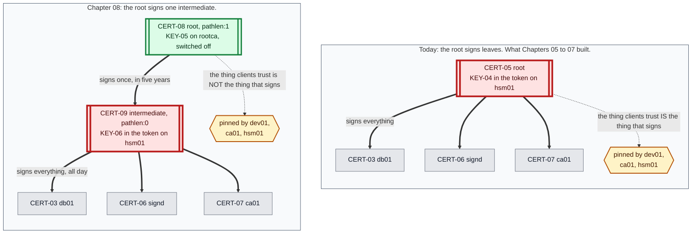
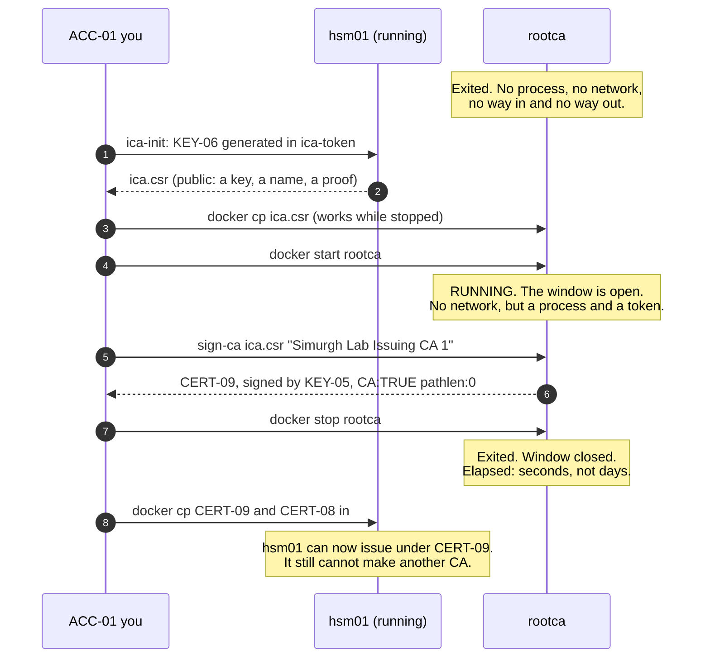
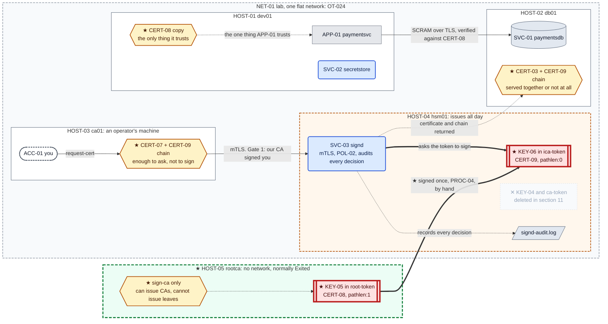

# Chapter 08 — The last root

## The system before this chapter

Four machines. `dev01` runs the application and the secret store. `db01` runs the database.
`ca01` is an operator's workstation holding a client certificate and no key. `hsm01` holds
`KEY-04` inside a PKCS#11 token, runs `SVC-03 signd`, takes the caller's identity from a verified
client certificate, checks it against `POL-02`, and audits every decision it makes.

Two clients pin `CERT-05`, the root: `dev01` verifies the database against it, and `ca01`
verifies `signd` against it. Everything works.

## The pressure

`OT-028`. This build has created three roots in three chapters.

Chapter 05 created one because the estate needed an authority. Chapter 06 replaced it because the
key was a file and two `cat` commands could steal it. Chapter 07 replaced it again because the
token was on the machine an operator worked on. Each decision was right. Each one invalidated the
previous key, because **a key's custody cannot be changed without changing the key**.

Each migration cost three writes and no outage. That number is a property of this estate, not of
the technique: one anchor file on `dev01`, one on `ca01`, one certificate to re-issue. With forty
clients across six teams, each of those migrations is a project with a change window, a rollback
plan and six calendars to align. **The technical work stays constant while the coordination grows
with the estate**, and a root is the one object in a PKI whose replacement touches everybody.

So the pressure is not "the root is insecure". The root is fine. The pressure is that we keep
having to replace the thing that is most expensive to replace, and nothing in the current shape
stops it happening a fourth time.

---

## 0. If your output differs

Certificate serials, dates, container IDs and PKCS#11 slot numbers will differ. Slot numbers are
assigned at random on every initialisation, and this chapter puts **two tokens on one machine**,
which is exactly the situation where a hard-coded slot number picks the wrong one. Nothing here
refers to a slot.

New PINs appear in this chapter: `8765` and `4321` on `rootca`, `2468` and `1357` for the new
token on `hsm01`. They are lab values printed in a book, and the reason they differ from the ones
you already have is `§6.3`.

Work in this chapter's `lab/` folder:

```bash
cd "chapters/Chapter 08/lab"
ls
```

Expected: `docker-compose.yml`, and the directories `dev01/`, `db01/`, `ca01/`, `hsm01/` and
`rootca/`.

### The lab in full

What **this** chapter writes is marked ★:

```
lab/
├── docker-compose.yml              ★ changed: rootca added, with no network at all
├── dev01/
│   ├── Dockerfile                    Chapter 01
│   ├── entrypoint.sh                 Chapter 01
│   ├── initdb.sql                    Chapter 01, seed for dev01 only, never re-run
│   ├── app/
│   │   ├── config.yaml               Chapter 05, unchanged: the anchor path is the same
│   │   └── paymentsvc.py             Chapter 04
│   └── secretstore/
│       ├── secretstore.py            Chapter 03
│       ├── secretstore-set.py        Chapter 02
│       └── policy.json               Chapter 03
├── db01/
│   ├── Dockerfile                    Chapter 04
│   ├── entrypoint.sh                 Chapter 04
│   └── impostor.py                   Chapter 04
├── ca01/
│   ├── Dockerfile                    Chapter 07
│   ├── entrypoint.sh                 Chapter 07
│   └── request-cert.sh             ★ changed: writes two files, because there are now two
├── hsm01/
│   ├── Dockerfile                    Chapter 07
│   ├── entrypoint.sh                 Chapter 07
│   ├── hsm-init.sh                   Chapter 07, and about to be history
│   ├── ica-init.sh                 ★ new: PROC-06, the intermediate's key ceremony
│   ├── sign-leaf.sh                ★ changed: signs with an intermediate, emits a chain
│   ├── signd.py                    ★ changed: one field, and it is the whole operational cost
│   ├── stop-signd.sh               ★ new: this machine has no ps, pgrep or pkill
│   └── policy.json                   Chapter 07
└── rootca/                         ★ new: HOST-05
    ├── Dockerfile                  ★ new
    ├── entrypoint.sh               ★ new
    ├── root-init.sh                ★ new: PROC-05, the root ceremony
    └── sign-ca.sh                  ★ new: the only signing tool here, and it can only make CAs
```

**Only `rootca` is built in this chapter.** Everything else is updated in place with `docker cp`,
and that is not a shortcut. `hsm01` has to hold the old key and the new one at the same time for
the length of the migration, and a rebuilt container starts from its image with neither.

### Before you start: this chapter continues an existing lab

`dev01` is built once in Chapter 01, `db01` in Chapter 04, `ca01` in Chapter 05 and `hsm01` in
Chapter 07. **Building from here does not give you this chapter's starting state.** That state is
what running the earlier chapters leaves behind.

If you have not worked the earlier chapters, start at Chapter 01. If you have, check that the lab
is where this chapter expects it:

```bash
sudo docker start db01 ca01 hsm01 dev01
sudo docker exec -u signd hsm01 sh -c '
  pkcs11-tool --module /usr/lib/softhsm/libsofthsm2.so --token-label ca-token \
              --login --pin "$(cat /var/lib/ca/pin)" --list-objects | head -6'
sudo docker exec dev01 openssl x509 -in /opt/paymentsvc/ca.crt -noout -subject
```

Expected: a private key object on `hsm01` reporting `sensitive, always sensitive, never
extractable, local`; and an anchor on `dev01` whose subject is `CN = Simurgh Lab Root CA`.

Then start the processes, which no machine here does for itself:

```bash
sudo docker exec dev01 sh -c '
  for i in $(seq 1 30); do pg_isready -q -h 127.0.0.1 -p 5432 && break; sleep 1; done
  pg_ctlcluster 15 main stop'
sudo docker exec -d -u secretstore dev01 \
    sh -c 'python3 /opt/secretstore/secretstore.py >>/var/log/secretstore.out 2>&1'
sleep 1
sudo docker exec -d -u paymentsvc dev01 \
    sh -c 'python3 /opt/paymentsvc/paymentsvc.py >>/var/log/paymentsvc.out 2>&1'
sudo docker exec -d -u signd hsm01 \
    sh -c 'python3 /usr/local/bin/signd >>/var/log/signd.out 2>&1'
sleep 1
curl -s http://127.0.0.1:8080/healthz
curl -s http://127.0.0.1:8080/payments/1001/status
```

Expected: `{"status": "ok"}`, then the payment record.

Both, not just the first. `/healthz` answers from the process and never opens a connection, so it
says `ok` on an application that cannot reach its database at all. The query is what proves the
starting state, and this chapter spends `§10` on a failure that `/healthz` reports as healthy.

---

## 1. What a root migration actually costs, counted

Before designing an escape, count the thing being escaped. Every place the current root is
pinned:

```bash
sudo docker exec dev01 openssl x509 -in /opt/paymentsvc/ca.crt -noout -subject -fingerprint
sudo docker exec ca01 openssl x509 -in /opt/ca-client/ca.crt -noout -subject -fingerprint
sudo docker exec -u signd hsm01 openssl x509 -in /var/lib/ca/ca.crt -noout -subject -fingerprint
```

Expected: three identical fingerprints, all with subject `CN = Simurgh Lab Root CA`.

Three copies of one certificate, on three machines, each installed by hand at some point in
Chapters 05 to 07. Now count the certificates that stop verifying if that fingerprint changes:

```bash
sudo docker exec db01 openssl x509 -in /etc/postgresql/15/main/server.crt -noout -subject -issuer
sudo docker exec -u signd hsm01 openssl x509 -in /var/lib/ca/signd.crt -noout -subject -issuer
sudo docker exec ca01 openssl x509 -in /opt/ca-client/ca01.crt -noout -subject -issuer
```

Expected: three certificates, three different subjects, and the same issuer on all three: `CN =
Simurgh Lab Root CA`.

**Six objects, and the number is the point.** Three anchors to replace and three certificates to
re-issue, because the thing that signed them is being retired. Six is manageable. Six is also
what this estate happens to have: one application, one database, one authority and one operator's
machine. The same table in a company with two hundred services has two hundred rows in the second
half, and every one of them is a service owner who has to be told, scheduled and verified.

Nothing about the *technique* gets harder. What grows is the coordination, and coordination is
what makes a change get postponed until it is done under pressure.

**So the goal for this chapter, stated precisely:** an arrangement in which the key that signs
certificates day to day can be replaced without any of those six objects changing.

---

## 2. The shape that fixes it

Split the authority in two.

A **root** that signs exactly one thing, once, and then does nothing for a decade. Clients pin
it. An **intermediate**, signed by the root, that does all the day-to-day issuing. Clients never
hear of it directly; it arrives attached to the certificates it signs.

Now replay the last three chapters against that shape. Chapter 06 wanted the key in a token:
generate a new intermediate key in the token, have the root sign it, retire the old intermediate.
No client changes. Chapter 07 wanted the key on its own host: generate a new intermediate key on
the new host, have the root sign it, retire the old one. No client changes. Both migrations
collapse from "visit every client" to "run one ceremony", because the object being replaced is no
longer the object anybody pinned.

Figure 8.1 puts the two arrangements side by side, with the compromise of the signing machine
drawn in both.

**Figure 8.1 — the same compromise, under two hierarchies**



**Read one thing off it: which box the dotted line touches.** In the upper arrangement the
certificate clients pin and the key that signs are the same object, so replacing the key means
replacing the pin. In the lower one they are two objects, and the heavy red box, the one an
attacker wants and the one operations keeps needing to move, is no longer the one anybody pinned.

That is the entire idea. Everything remaining in this chapter is the cost of getting there.

---

## 3. Make it fail: build the intermediate under the root we already have

The obvious move is to keep `CERT-05` and put an intermediate under it. No new root, no
migration, no clients touched. Try it.

This runs on `ca01` with throwaway keys in a scratch directory, because it is a question about
X.509 path validation and nothing else. Bringing the token into it would only add ways for it to
fail for unrelated reasons. The scratch directory is under `/opt/ca-client`, which `ACC-08` owns,
and not `/tmp`, for the reason Chapter 07 gives: work that matters does not belong in a directory
every process on the host can write to.

```bash
sudo docker exec -u ca ca01 sh -c '
  mkdir -p /opt/ca-client/scratch && cd /opt/ca-client/scratch
  # a would-be intermediate: a key and a request, exactly as ica-init will make later
  openssl ecparam -name prime256v1 -genkey -noout -out ica.key
  openssl req -new -key ica.key -out ica.csr -subj "/CN=Simurgh Lab Issuing CA 1"
  echo "requested: an authority under the root we already have"'
```

Expected: the `echo`, and no errors. Nothing has been signed yet.

We cannot sign this with the real root without the PIN on `hsm01`, and we do not need to. The
question is whether `CERT-05` is *allowed* to have a CA beneath it, and that is answered by a
field in `CERT-05` itself:

```bash
sudo docker exec -u ca ca01 openssl x509 -in /opt/ca-client/ca.crt -noout \
    -ext basicConstraints,keyUsage
```

Expected:

```
X509v3 Basic Constraints: critical
    CA:TRUE, pathlen:0
X509v3 Key Usage: critical
    Certificate Sign, CRL Sign
```

`pathlen:0`. Chapter 05 §4 wrote that line, and said this about it:

> **`pathlen:0`** says this root may sign leaves and may not sign other authorities. We are not
> building an intermediate, so saying so in the certificate costs nothing and closes off a
> capability nobody should inherit by accident.

It was a correct description and the wrong prediction. Watch what it costs. Build the whole
hierarchy locally, with a stand-in root that has the same constraint, and ask a verifier what it
thinks:

```bash
sudo docker exec -u ca ca01 sh -c '
  cd /opt/ca-client/scratch
  # a stand-in root carrying the same pathlen:0 as CERT-05
  openssl ecparam -name prime256v1 -genkey -noout -out root.key
  openssl req -new -x509 -key root.key -out root.crt -days 3650 \
      -subj "/CN=Stand-in Root" \
      -addext "basicConstraints=critical,CA:TRUE,pathlen:0" \
      -addext "keyUsage=critical,keyCertSign,cRLSign"

  # sign the intermediate with it
  printf "%s\n" \
    "basicConstraints=critical,CA:TRUE,pathlen:0" \
    "keyUsage=critical,keyCertSign,cRLSign" > ica.ext
  openssl x509 -req -in ica.csr -CA root.crt -CAkey root.key -CAcreateserial \
      -out ica.crt -days 1825 -extfile ica.ext 2>/dev/null

  # and a leaf under the intermediate
  openssl ecparam -name prime256v1 -genkey -noout -out leaf.key
  openssl req -new -key leaf.key -out leaf.csr -subj "/CN=db01.lab.simurgh.example"
  printf "%s\n" \
    "basicConstraints=critical,CA:FALSE" \
    "subjectAltName=DNS:db01.lab.simurgh.example" > leaf.ext
  openssl x509 -req -in leaf.csr -CA ica.crt -CAkey ica.key -CAcreateserial \
      -out leaf.crt -days 90 -extfile leaf.ext 2>/dev/null

  echo "--- three certificates, all signed without complaint ---"
  ls -1 root.crt ica.crt leaf.crt'
```

Expected: the three filenames. **Every signature succeeded.** Nothing refused anything, and if
you stopped here you would deploy this.

Now verify the chain the way a client will:

```bash
sudo docker exec -u ca ca01 sh -c '
  cd /opt/ca-client/scratch
  openssl verify -CAfile root.crt -untrusted ica.crt leaf.crt'
```

Expected:

```
CN=Stand-in Root
error 25 at 2 depth lookup: path length constraint exceeded
error leaf.crt: verification failed
```

**`error 25`, at depth 2, which is the root.** The verifier walked from the leaf up to the
intermediate, up to the root, and the root told it that no CA is permitted to follow it in a
path. The intermediate is a perfectly well-formed certificate that no client will ever accept.

### 3.1 Why the field cannot simply be ignored

`basicConstraints` here is marked `critical`, which is the X.509 way of saying that a client
which does not understand this extension must reject the certificate rather than skip it. There
is no lenient mode and no client flag to talk it out of this. The constraint is *in the signed
bytes* of `CERT-05`, so the only way to change it is to produce a different certificate.

And a different certificate means a different root, because the subject, the key and the
extensions are all covered by the self-signature. Confirm the fix is the constraint and not
something else about the setup, by changing exactly one character:

```bash
sudo docker exec -u ca ca01 sh -c '
  cd /opt/ca-client/scratch
  openssl req -new -x509 -key root.key -out root1.crt -days 3650 \
      -subj "/CN=Stand-in Root" \
      -addext "basicConstraints=critical,CA:TRUE,pathlen:1" \
      -addext "keyUsage=critical,keyCertSign,cRLSign"
  printf "%s\n" \
    "basicConstraints=critical,CA:TRUE,pathlen:0" \
    "keyUsage=critical,keyCertSign,cRLSign" > ica.ext
  openssl x509 -req -in ica.csr -CA root1.crt -CAkey root.key -CAcreateserial \
      -out ica1.crt -days 1825 -extfile ica.ext 2>/dev/null
  openssl x509 -req -in leaf.csr -CA ica1.crt -CAkey ica.key -CAcreateserial \
      -out leaf1.crt -days 90 -extfile leaf.ext 2>/dev/null
  openssl verify -CAfile root1.crt -untrusted ica1.crt leaf1.crt'
```

Expected:

```
leaf1.crt: OK
```

`pathlen:0` to `pathlen:1`, and the same three keys now produce a chain that verifies. **One
digit in one field of one certificate is the difference between the hierarchy this chapter needs
and a root that has to be replaced.**

Clean up the scratch directory; nothing here is part of the lab:

```bash
sudo docker exec -u ca ca01 rm -rf /opt/ca-client/scratch
```

### 3.2 What `pathlen` actually counts, in one line

`pathlen:N` means **at most N CA certificates may appear below this one in a chain**, not
counting the leaf. So `pathlen:0` permits leaves only, `pathlen:1` permits one intermediate, and
the root and intermediate together fix the depth of the hierarchy in signed bytes that nobody
holding them can alter.

That is why `CERT-09` gets `pathlen:0` and not something roomier. The issuing CA can sign every
server and client certificate in the estate, and it cannot create another authority, so a
compromise of `hsm01` cannot be used to build a parallel hierarchy that outlives the intermediate
being revoked.

---

## 4. The fourth root, and why it is the last

Two separate things force a new root here, and it matters that they are separate, because the
first one alone would tempt a much cheaper answer.

**The first is `pathlen:0`, and it forces a new *certificate* only.** `KEY-04` is still in the
token on `hsm01` and is perfectly good. We could self-sign a fresh root certificate from that
same key with `pathlen:1`, and the fingerprint would change, so every anchor would still have to
be replaced, but no key ceremony would be needed.

**The second is where the root should live, and that forces a new *key*.** A root that sits in
the same token as the intermediate, on the machine that answers network requests all day, is a
root that gains nothing from being a root. The whole value of the split is that compromising the
issuing machine does not reach the anchor. And a key's custody cannot be changed without changing
the key: `KEY-04` cannot move to another machine, because a token that could export it would not
be a token. That is `D-050` in Chapter 06 and `D-058` in Chapter 07, and it has not stopped being
true.

So: a new machine, a new key generated on it, and a new self-signed root. `D-059`.

**Why this is the last one.** Every previous root replacement was forced by a decision about
custody that was made after the key existed. From here, custody decisions are made about the
intermediate, and the intermediate is designed to be replaced. The root's own custody question is
answered once, in this chapter, before `KEY-05` is generated: it lives on a machine that is
switched off. There is no remaining "where should the key live" question for it to lose.

The honest caveat is in `§11`, and it is that "switched off" here means a stopped container on
the same laptop as everything else.

---

## 5. `HOST-05 rootca`, and what offline can honestly mean

Every machine in this lab is a container. So what can "offline" possibly mean?

Three properties are worth separating, because real offline roots have all three and this one has
two.

| Property | Real offline root | `rootca` here |
|---|---|---|
| Not reachable over any network | Yes: no NIC, air-gapped room | **Yes**: `network_mode: none` |
| Not running | Yes: powered down in a safe | **Yes**: container state `Exited` |
| Not physically obtainable | Yes: safe, two custodians, a log | **No**: the token is a file on your laptop |

The third is the one a container cannot give us, and pretending otherwise would be the kind of
claim this build exists to avoid. What the first two do buy is real, though: there is no process
to exploit, no port to reach, and no path from a compromised `hsm01` to the root key that does
not go through the Docker daemon on the host. That is a meaningfully smaller surface than a root
key sitting in a second token on the machine that answers requests.

`D-060` records the deviation, and `OT-029` records what is left open.

### 5.1 The compose service

The whole file, because a machine deliberately outside the network is a claim about the substrate
and the substrate is this file. The new service is last; everything above it is unchanged from
Chapter 07.

```yaml
# The lab substrate: one container per "machine" in the ledger.
#
# Bring each machine up ONCE, in the chapter that introduces it, naming the
# service so you only build that one:
#     Chapter 01:  docker compose up -d --build dev01
#     Chapter 04:  docker compose up -d --build db01
#     Chapter 05:  docker compose up -d --build ca01
#     Chapter 06:  docker compose up -d --build ca01   (rebuild: ca01 gains a token)
#     Chapter 07:  docker compose up -d --build hsm01
#                  and rebuild ca01, which loses it again
#     Chapter 08:  docker compose up -d --build rootca
#                  then STOP it again, which is the whole point of it
#
# After that, chapters deploy into the running container with `docker cp`.
# Rebuilding is not forbidden, it is a reset: a rebuilt dev01 starts from
# Chapter 01's image again and loses everything the later chapters built
# inside it, which is OS accounts, file modes, database rows and some
# deliberately left log lines. If you do rebuild, you are starting the lab
# over and need to work the chapters forward again.
#
# This file is identical in every chapter's lab/ folder until a chapter
# adds a machine, so `docker compose up -d` from any of them is a no-op on
# a lab that is already running.
#
# Processes inside the containers are still started by hand. That is not an
# oversight: these hosts have no service manager, and giving them one is a
# chapter of its own.

name: lab

services:
  dev01:                                    # HOST-01, where the app and the secret store live
    build:
      context: ./dev01
      dockerfile: Dockerfile
    image: ksm/dev01:chapter01              # named for the chapter that builds it
    container_name: dev01
    hostname: dev01.lab.simurgh.example

    # Published on the laptop's loopback only, never on the network. The
    # difference between 127.0.0.1:8080:8080 and 8080:8080 is the difference
    # between a service your laptop can reach and one the coffee shop can.
    ports:
      - "127.0.0.1:8080:8080"

    # tcpdump needs this to put an interface into the mode it wants.
    cap_add:
      - NET_ADMIN

    # Reap zombies and forward signals. The entrypoint ends in
    # `sleep infinity`, which is not a real init.
    init: true

    # Substrate only: reports, gates nothing.
    healthcheck:
      test: ["CMD", "pg_isready", "-q", "-h", "127.0.0.1", "-p", "5432"]
      interval: 10s
      timeout: 3s
      retries: 5
      start_period: 20s

    stop_grace_period: 5s

  db01:                                     # HOST-02, the database, added in Chapter 04
    build:
      context: ./db01
      dockerfile: Dockerfile
    image: ksm/db01:chapter04
    container_name: db01
    hostname: db01.lab.simurgh.example

    # The name the certificate is issued for, and the name APP-01 connects
    # to. Compose resolves the service name `db01` by default; this alias
    # adds the fully qualified name so `sslmode=verify-full` has something
    # to match against.
    networks:
      default:
        aliases:
          - db01.lab.simurgh.example

    # No `ports:` at all. The database is reachable from dev01 across the
    # lab network and from nowhere else. Chapter 01 published 8080 because
    # you need to curl it; nothing outside the lab has any business
    # reaching 5432.

    cap_add:
      - NET_ADMIN

    init: true

    healthcheck:
      test: ["CMD", "pg_isready", "-q", "-h", "127.0.0.1", "-p", "5432"]
      interval: 10s
      timeout: 3s
      retries: 5
      start_period: 20s

    stop_grace_period: 5s

  ca01:                                     # HOST-03, the certificate authority, added in Chapter 05
    build:
      context: ./ca01
      dockerfile: Dockerfile
    image: ksm/ca01:chapter07
    container_name: ca01
    hostname: ca01.lab.simurgh.example

    # No ports, and no network alias. Nothing connects to this machine.
    # An authority that answers requests is a service with an attack
    # surface and an issuance policy; this one is a key, a procedure and
    # an operator, which is all OT-017 asked for. When something needs to
    # request a certificate without a human, that is its own chapter.

    init: true

    # No healthcheck. There is no process to be healthy: the CA is files
    # on a disk and a script somebody runs. `docker compose ps` will show
    # it as running because the entrypoint sleeps, and that is the whole
    # truth about it.

    stop_grace_period: 5s

  hsm01:                                    # HOST-04, the machine that holds the key, added in Chapter 07
    build:
      context: ./hsm01
      dockerfile: Dockerfile
    image: ksm/hsm01:chapter07
    container_name: hsm01
    hostname: hsm01.lab.simurgh.example

    # The name SVC-03's certificate is issued for, and the name ca01 dials.
    # verify-full on the client needs these to be the same string, which is
    # the lesson Chapter 05 section 6 paid for.
    networks:
      default:
        aliases:
          - hsm01.lab.simurgh.example

    # No ports. SVC-03 listens on 8443 and is reachable from the lab network
    # and from nowhere else. Nothing outside the lab has any business
    # reaching the machine that signs certificates, and OT-024 is the
    # observation that "the lab network" is still far too many things.

    init: true

    # No healthcheck. SVC-03 is started by hand like every other process in
    # this build, so a healthcheck would report on a service that is usually
    # not running yet and tell you nothing. OT-009, on a fourth machine.

    stop_grace_period: 5s

  rootca:                                   # HOST-05, the offline root, added in Chapter 08
    build:
      context: ./rootca
      dockerfile: Dockerfile
    image: ksm/rootca:chapter08
    container_name: rootca
    hostname: rootca.lab.simurgh.example

    # THE IMPORTANT LINE IN THIS FILE.
    #
    # network_mode: none gives this container a loopback interface and
    # nothing else. It is not on the lab network, it has no address there,
    # it cannot resolve db01 or hsm01 and they cannot reach it. Compare
    # ca01, which has no `ports:` and is still on the network with everyone
    # else; that is a machine nobody happens to dial, and this is a machine
    # nobody can.
    #
    # Note that it therefore cannot have a `networks:` key. The two are
    # mutually exclusive, and compose will refuse the file if both appear.
    #
    # The build itself needs the network, to fetch packages. That is not a
    # contradiction, it is the ordinary shape of the thing: a machine is
    # provisioned once with a network and then runs without one, and the
    # window in which it was reachable is a window worth being aware of.
    network_mode: "none"

    # No restart policy, and D-033 is not the reason this time. Every other
    # machine here has none because service management is a chapter of its
    # own. This one must not have one, because its correct steady state is
    # `Exited` and a restart policy would fight the ceremony that stops it.
    #
    # There is no `docker compose up` for this machine in normal operation.
    # It is started by PROC-04 and stopped by PROC-04.

    init: true

    stop_grace_period: 5s
```

**`ca01` and `rootca` are not the same kind of unreachable**, and the distinction is worth being
precise about. `ca01` has no published ports, so nothing outside the lab reaches it, but it is on
`NET-01` with everything else and any container there can open a socket to it. `rootca` is not on
`NET-01` at all. The first is a machine nobody happens to dial. The second is a machine nobody
can.

### 5.2 The Dockerfile

```dockerfile
# HOST-05 rootca, the machine that holds the root key and is almost never
# running.
#
# Compare it with hsm01, which is already the smallest machine in the build.
# This one is smaller. hsm01 holds a key AND answers a network request AND
# runs a policy engine, because something has to issue certificates all day.
# This machine issues one certificate every few years, so it needs none of
# that: no python3, no service, no listening socket, and in the compose file
# no network at all.
#
# The interesting property is not in this file. It is that the container
# built from it spends its life in state `Exited`, and is started only for
# the length of a ceremony. That is what "offline" can honestly mean when
# every machine in the lab is a container on one laptop, and D-060 is where
# the limits of that claim are written down.
FROM debian:12-slim

ENV DEBIAN_FRONTEND=noninteractive

# The same three packages Chapter 06 introduced, and nothing else. There is
# deliberately no curl and no python3: this host has nothing to talk to.
RUN apt-get update \
 && apt-get install -y --no-install-recommends \
      openssl \
      ca-certificates \
      softhsm2 \
      opensc \
      libengine-pkcs11-openssl \
 && rm -rf /var/lib/apt/lists/*

# ACC-10. A third account that owns a token, on a third machine, and the
# reason it is not ACC-09 is D-002: this is a different principal on a
# different host, and the whole point of the chapter is that the two are
# not the same and must not be able to act for each other.
RUN useradd --system --home-dir /var/lib/rootca --shell /usr/sbin/nologin rootca \
 && usermod -aG softhsm rootca

# /var/lib/rootca          CERT-08 and the ceremony log
# /var/lib/rootca/issued   every CA certificate this root has ever signed.
#                          There will be one. That is the measure of the
#                          chapter: a root that signs once is a root whose
#                          log you can read in full.
# /var/lib/rootca/requests incoming CSRs, for the reason hsm01's Dockerfile
#                          gives: a request that arrives in a world-writable
#                          directory can be swapped between landing and
#                          being signed.
RUN mkdir -p /var/lib/rootca/issued /var/lib/rootca/requests \
 && chown -R rootca:rootca /var/lib/rootca \
 && chmod 0700 /var/lib/rootca /var/lib/rootca/issued /var/lib/rootca/requests

COPY root-init.sh  /usr/local/bin/root-init
COPY sign-ca.sh    /usr/local/bin/sign-ca
COPY entrypoint.sh /usr/local/bin/entrypoint.sh

RUN chmod 0755 /usr/local/bin/root-init /usr/local/bin/sign-ca \
               /usr/local/bin/entrypoint.sh

# There is no sign-leaf here, and its absence is a control rather than an
# omission. The only tool this machine has stamps CA:TRUE on everything it
# signs, so the root cannot issue a server certificate by accident even if
# somebody starts the container and asks it to. hsm01 has the mirror of
# this: sign-leaf stamps CA:FALSE and has no way to produce an authority.
# D-063.

ENTRYPOINT ["/usr/local/bin/entrypoint.sh"]
```

**The last comment is a control, not a remark.** `rootca` cannot issue a server certificate,
because the only tool it has hard-codes `CA:TRUE`. `hsm01` cannot issue an authority, because
`sign-leaf` hard-codes `CA:FALSE`. Neither restriction depends on anybody remembering which
machine they are logged into at two in the morning, which is the hour when the distinction stops
being obvious. `D-063`.

And the entrypoint:

```sh
#!/bin/sh
set -e

# This entrypoint sleeps, like ca01's, and for a third distinct reason.
#
# ca01 sleeps because it is an operator's workstation and does its work when
# a human runs a command. hsm01 sleeps because the process it exists to run
# is started by hand, OT-009. This machine sleeps because it is not supposed
# to be running at all.
#
# Everything a container does while it is up is attack surface, so the goal
# here is for `docker ps` to show nothing and `docker ps -a` to show
# `Exited`. The container is started for the length of a ceremony and
# stopped again in the same procedure, and PROC-04 ends with the stop for
# the same reason a safe is closed after the document comes out.
#
# If you ever find this container running and cannot say which ceremony is
# in progress, that is the finding.

exec sleep infinity
```

### 5.3 Build it, and confirm what it cannot do

```bash
cd "chapters/Chapter 08/lab"
sudo docker compose up -d --build rootca
```

Expected: `rootca` is built and started. Name the service, as always: an unnamed `--build`
rebuilds every machine and resets the lab.

Confirm the isolation before trusting it. First, that it has no route anywhere:

```bash
sudo docker exec rootca sh -c 'ip -brief address; echo "--- routes ---"; ip route show'
```

Expected: a `lo` interface and nothing else, and an empty route table. There is no `eth0`.

Then, that the lab cannot see it and it cannot see the lab:

```bash
sudo docker exec ca01 getent hosts rootca.lab.simurgh.example || echo "ca01 cannot resolve rootca"
sudo docker exec rootca getent hosts hsm01.lab.simurgh.example || echo "rootca cannot resolve hsm01"
```

Expected: both fallback messages. Neither machine can name the other, let alone reach it.

---

## 6. The root ceremony

### 6.1 The PINs

`SEC-06` and `SEC-07`, written before anything else, because `root-init` refuses to run without
them:

```bash
sudo docker exec rootca sh -c '
  printf "4321" > /var/lib/rootca/pin
  printf "8765" > /var/lib/rootca/so-pin
  chown rootca:rootca /var/lib/rootca/pin /var/lib/rootca/so-pin
  chmod 0400 /var/lib/rootca/pin /var/lib/rootca/so-pin
  ls -l /var/lib/rootca/'
```

Expected: two files, `-r--------`, owned by `rootca`.

### 6.2 `root-init`, and the one line that is different

```sh
#!/bin/sh
# PROC-05, the root ceremony. Run once, as the `rootca` user, on rootca.
#
#   root-init
#
# Creates the token, generates KEY-05 inside it, self-signs CERT-08, and
# proves the key cannot come back out. It is Chapter 07's hsm-init with two
# differences, and both are the chapter.
#
# FIRST: it produces the certificate as well as the key. On hsm01 those were
# separate steps because the key was generated in one chapter and the root
# certificate in another. Here they are one ceremony, because splitting them
# would mean starting this container twice.
#
# SECOND, and this is the one that matters: pathlen:1 rather than pathlen:0.
# Chapter 05 wrote pathlen:0 and said it "costs nothing" because we were not
# building an intermediate. It cost this root. A pathlen:0 authority may sign
# leaves and may not sign other authorities, so the moment we wanted a CA
# beneath the root, the root itself had to be replaced. D-062.
#
# pathlen:1 says: one CA may follow me in a path, and no more. It permits the
# intermediate and forbids the intermediate from having children.

set -eu

MODULE=/usr/lib/softhsm/libsofthsm2.so
TOKEN=root-token
LABEL=root-key
DIR=/var/lib/rootca
PIN_FILE=$DIR/pin           # SEC-06, the user PIN
SO_PIN_FILE=$DIR/so-pin     # SEC-07, the security officer PIN
DAYS=3650                   # ten years. D-046, unchanged.

[ -r "$PIN_FILE" ]    || { echo "root-init: cannot read $PIN_FILE. Run as the 'rootca' user." >&2; exit 1; }
[ -r "$SO_PIN_FILE" ] || { echo "root-init: cannot read $SO_PIN_FILE." >&2; exit 1; }
PIN=$(cat "$PIN_FILE")
SO_PIN=$(cat "$SO_PIN_FILE")

echo "== 1. initialise the token =="
softhsm2-util --init-token --free --label "$TOKEN" \
              --so-pin "$SO_PIN" --pin "$PIN"

echo
echo "== 2. generate KEY-05 inside the token =="
# No --out, on the machine where that matters most. This is the key that,
# if it leaves, makes every certificate in the estate forgeable.
pkcs11-tool --module "$MODULE" --token-label "$TOKEN" --login --pin "$PIN" \
            --keypairgen --key-type EC:prime256v1 --label "$LABEL" --id 01

echo
echo "== 3. what the token says about it =="
pkcs11-tool --module "$MODULE" --token-label "$TOKEN" --login --pin "$PIN" \
            --list-objects

echo
echo "== 4. prove it cannot be extracted =="
# The refusal exits 0, so check for the absence of the file and not the
# status. Chapter 06 measured this and it has not stopped being true.
rm -f "$DIR/extraction-attempt"
pkcs11-tool --module "$MODULE" --token-label "$TOKEN" --login --pin "$PIN" \
            --read-object --type privkey --label "$LABEL" \
            -o "$DIR/extraction-attempt" 2>&1 || true
if [ -s "$DIR/extraction-attempt" ]; then
    echo "FAIL: something was written. The key is extractable and this root is worthless." >&2
    rm -f "$DIR/extraction-attempt"
    exit 1
fi
rm -f "$DIR/extraction-attempt"
echo "OK: no key material was produced."

echo
echo "== 5. self-sign CERT-08, the root that permits one CA below it =="
KEY_URI="pkcs11:token=$TOKEN;object=$LABEL;type=private?pin-value=$PIN"

openssl req -new -x509 \
    -engine pkcs11 -keyform engine -key "$KEY_URI" \
    -out "$DIR/root.crt" -days "$DAYS" -sha256 \
    -subj "/CN=Simurgh Lab Root CA" \
    -addext "basicConstraints=critical,CA:TRUE,pathlen:1" \
    -addext "keyUsage=critical,keyCertSign,cRLSign" \
    -addext "subjectKeyIdentifier=hash" 2>/dev/null

chmod 0644 "$DIR/root.crt"

echo "  the field this chapter exists because of:"
openssl x509 -in "$DIR/root.crt" -noout -ext basicConstraints,keyUsage
openssl x509 -in "$DIR/root.crt" -noout -subject -dates

echo
echo "== 6. record what was created =="
date -u +"%Y-%m-%dT%H:%M:%SZ  KEY-05 generated in token $TOKEN, label $LABEL; CERT-08 self-signed, pathlen:1" \
    >> "$DIR/ceremony.log"
cat "$DIR/ceremony.log"
```

Run it:

```bash
sudo docker exec -u rootca rootca root-init
```

Expected, with the slot number and the dates differing:

```
== 1. initialise the token ==
Slot 0 has a free/uninitialized token.
The token has been initialized and is reassigned to slot 1234567890

== 2. generate KEY-05 inside the token ==
Key pair generated:
Private Key Object; EC
  label:      root-key
  ID:         01
  Usage:      sign, derive
  Access:     sensitive, always sensitive, never extractable, local
...

== 4. prove it cannot be extracted ==
OK: no key material was produced.

== 5. self-sign CERT-08, the root that permits one CA below it ==
  the field this chapter exists because of:
X509v3 Basic Constraints: critical
    CA:TRUE, pathlen:1
X509v3 Key Usage: critical
    Certificate Sign, CRL Sign
subject=CN=Simurgh Lab Root CA
notBefore=...
notAfter=...
```

**`CA:TRUE, pathlen:1`.** That is the difference between this root and the three before it, and
it is the only difference that matters.

### 6.3 Why new PINs, and not the ones you already have

`SEC-04` and `SEC-05` authorise the token on `hsm01`. If `SEC-06` were the same value, then
anyone who obtained the issuing host's PIN would hold the root's PIN too, and the separation this
chapter just built between the two machines would exist on paper only. Two custodies, two
secrets.

This is also the point at which the PIN model starts to creak, because these are still bearer
values in files, readable by root on their hosts, and the token authenticates a PIN rather than a
person. That is `OT-025`, unchanged, now true on a machine where it matters more.

---

## 7. The intermediate's key, on the machine that will use it

The intermediate's key is generated on `hsm01`, inside a token, and never leaves. This is `D-058`
applied one level down: the key belongs to the machine that will use it, so it is created there,
and only a request travels.

### 7.1 A second token, not a second key in the first one

`hsm01` already has `ca-token`, holding `KEY-04`, the root this chapter retires. Two options:

| | Re-initialise `ca-token` | A second token, new label |
|---|---|---|
| `KEY-04` | destroyed immediately | stays until the end of the chapter |
| If the ceremony fails halfway | no way back | the old hierarchy is still serving |
| Addressing | one label, unambiguous | **two labels, which must differ** |

The second, and `D-061`. The overlap is the whole reason: for the length of this migration
`hsm01` has to be able to serve the old hierarchy while the new one is being assembled, and a
token that has been re-initialised cannot.

**The labels must differ, and this is the trap.** Every tool in this build addresses tokens by
label rather than by slot, because SoftHSM assigns slot numbers at random on each initialisation
(`D-051`). Two tokens sharing a label would make every subsequent command ambiguous, and it would
be ambiguous *quietly*: a command that picks the wrong token still exits 0 and still produces a
certificate, signed by the wrong key.

### 7.2 The PINs, then the ceremony

```bash
sudo docker exec hsm01 sh -c '
  printf "1357" > /var/lib/ca/ica-pin
  printf "2468" > /var/lib/ca/ica-so-pin
  chown signd:signd /var/lib/ca/ica-pin /var/lib/ca/ica-so-pin
  chmod 0400 /var/lib/ca/ica-pin /var/lib/ca/ica-so-pin'
```

Expected: no output.

`ica-init.sh` is new. Deploy it, then read it:

```bash
sudo docker cp hsm01/ica-init.sh hsm01:/usr/local/bin/ica-init
sudo docker exec hsm01 chmod 0755 /usr/local/bin/ica-init
```

```sh
#!/bin/sh
# PROC-06, the intermediate's key ceremony. Run once, as the `signd` user,
# on hsm01.
#
#   ica-init
#
# Generates KEY-06 inside a token on this machine and produces a certificate
# request for it. It does not produce a certificate, and cannot: the only
# thing that can turn this request into an authority is KEY-05, which is on
# a machine that is switched off.
#
# WHY A SECOND TOKEN AND NOT A SECOND KEY IN THE FIRST ONE. hsm01 already
# has `ca-token` holding KEY-04, the root this chapter retires. Two options
# were available and only one of them is safe:
#
#   Re-initialise ca-token. Destroys KEY-04 immediately, which sounds tidy
#   and means the old root is gone before the new hierarchy is proven to
#   work. There is no way back from that if the ceremony fails halfway.
#
#   A new token with a new label. KEY-04 stays addressable during the
#   overlap and is destroyed explicitly at the end of the chapter, once
#   nothing depends on it.
#
# The second, and note that both tokens must have DIFFERENT LABELS. Every
# tool here addresses tokens by label because SoftHSM assigns slot numbers
# at random, so two tokens sharing a label would make every later command
# ambiguous, and it would be ambiguous silently. D-061.

set -eu

MODULE=/usr/lib/softhsm/libsofthsm2.so
TOKEN=ica-token
LABEL=ica-key
DIR=/var/lib/ca
PIN_FILE=$DIR/ica-pin           # SEC-08
SO_PIN_FILE=$DIR/ica-so-pin     # SEC-09
CN="Simurgh Lab Issuing CA 1"   # quoted, and it has to be: without the quotes the
                                # shell reads this as CN=Simurgh followed by the
                                # command `Lab`, and `sh -n` accepts it happily
                                # because an assignment prefix before a command is
                                # valid syntax. It fails at run time with
                                # `Lab: not found`.

[ -r "$PIN_FILE" ]    || { echo "ica-init: cannot read $PIN_FILE. Run as the 'signd' user." >&2; exit 1; }
[ -r "$SO_PIN_FILE" ] || { echo "ica-init: cannot read $SO_PIN_FILE." >&2; exit 1; }
PIN=$(cat "$PIN_FILE")
SO_PIN=$(cat "$SO_PIN_FILE")

echo "== 1. initialise a SECOND token on this machine =="
# --free takes the first uninitialised slot, so this does not disturb
# ca-token. The label is what everything downstream will use.
softhsm2-util --init-token --free --label "$TOKEN" \
              --so-pin "$SO_PIN" --pin "$PIN"

echo
echo "== 2. both tokens, so you can see there are now two =="
softhsm2-util --show-slots | grep -E "^Slot|    Label:" | sed 's/^/  /'

echo
echo "== 3. generate KEY-06 inside the new token =="
pkcs11-tool --module "$MODULE" --token-label "$TOKEN" --login --pin "$PIN" \
            --keypairgen --key-type EC:prime256v1 --label "$LABEL" --id 01

echo
echo "== 4. what the token says about it =="
pkcs11-tool --module "$MODULE" --token-label "$TOKEN" --login --pin "$PIN" \
            --list-objects

echo
echo "== 5. build the certificate request =="
# A CSR is a public key, a proposed name, and a signature proving the
# requester holds the matching private key. That signature is made by the
# token, which is why this needs the engine: there is no key file to read.
#
# It carries no extensions. What this certificate is allowed to be is
# decided by the root when it signs, not by the applicant when it asks,
# which is the same principle as POL-02 refusing to read a name out of the
# request body.
KEY_URI="pkcs11:token=$TOKEN;object=$LABEL;type=private?pin-value=$PIN"

openssl req -new \
    -engine pkcs11 -keyform engine -key "$KEY_URI" \
    -out "$DIR/requests/ica.csr" -sha256 \
    -subj "/CN=$CN" 2>/dev/null

chmod 0644 "$DIR/requests/ica.csr"

echo "  the request, which is public and which you are about to carry by hand:"
openssl req -in "$DIR/requests/ica.csr" -noout -subject -verify 2>&1 | sed 's/^/  /'

echo
echo "== 6. record what was created =="
date -u +"%Y-%m-%dT%H:%M:%SZ  KEY-06 generated in token $TOKEN, label $LABEL; CSR written for CN=$CN" \
    >> "$DIR/ceremony.log"
tail -3 "$DIR/ceremony.log"
```


Run it:

```bash
sudo docker exec -u signd hsm01 ica-init
```

Expected: a second token initialised, then **two labels listed in step 2**, `ca-token` and
`ica-token`, then a key pair reporting `never extractable, local`, then:

```
== 5. build the certificate request ==
  the request, which is public and which you are about to carry by hand:
  Certificate request self-signature verify OK
  subject=CN=Simurgh Lab Issuing CA 1
```

**Step 2 is the check that matters.** If you see one label, or the same label twice, stop: every
signing command from here on is ambiguous about which key it used, and it will not tell you.

### 7.3 Nothing on this machine can turn that request into an authority

Worth proving rather than asserting, because it is the property the split exists for:

```bash
sudo docker exec hsm01 ls /usr/local/bin/
```

Expected: `entrypoint.sh`, `hsm-init`, `ica-init`, `sign-leaf`, `signd`. There is no `sign-ca`.
The request that `ica-init` just produced is inert on the machine that made it, and stays inert
until it is carried to a host that is currently switched off.

---

## 8. `PROC-04`, the ceremony

A request has to reach a machine with no network, be signed there, and come back. There is
exactly one channel: the Docker daemon on your laptop, which is the lab's stand-in for a person
walking a USB stick between two rooms.

The shape of the procedure is fixed by one asymmetry worth knowing before you rely on it:
**`docker cp` works against a stopped container and `docker exec` does not.** Files can be moved
in and out of a machine that is not running; nothing can be executed there. So the ceremony has
to start the container, and starting it is the moment the root stops being offline.

Figure 8.2 is the procedure over time, with the state of `rootca` on the left.

**Figure 8.2 — `PROC-04`, and the window it opens**



**Read the two `Note over R` blocks that bracket the window.** Everything the root's isolation
buys is suspended between them, so the length of that gap is a number worth caring about. Here it
is seconds. In an organisation it is the duration of a scheduled ceremony with named attendees,
and the reason ceremonies are scheduled rather than performed on demand is precisely that the
window has to be short, witnessed and rare.

### 8.1 `sign-ca`, the only tool on the root

```sh
#!/bin/sh
# The signing half of PROC-04, the intermediate issuance ceremony. Signs one
# certificate authority with KEY-05.
#
#   sign-ca <csr-file> <common-name>
#
# This is the only signing tool on this machine, and it can only produce a
# CA. There is no flag to make it emit a leaf and no sign-leaf beside it to
# borrow. That is deliberate: the root's job is to sign exactly one thing
# every few years, and a tool that can only do that job cannot be talked
# into doing another one at three in the morning. hsm01 has the mirror,
# where sign-leaf stamps CA:FALSE and cannot mint an authority. D-063.
#
# WHY -extfile AND NOT -addext. `openssl x509 -req` has no -addext; it
# rejects the option outright with "Extra (unknown) options". Extensions on
# a signed certificate come from an extension file, which is also why
# sign-leaf has always used one. It is worth knowing because the two
# subcommands look interchangeable and are not: `req` takes -addext,
# `x509 -req` takes -extfile.
#
# WHAT THE INTERMEDIATE GETS, and why it is not what the root has:
#
#   pathlen:0   The intermediate may sign leaves and may not sign another
#               authority. The root is pathlen:1, meaning one CA may follow
#               it. Together those two numbers say "exactly this hierarchy
#               and no deeper", and a certificate that says so is a
#               certificate that cannot be extended by whoever holds it.

set -eu

DIR=/var/lib/rootca
ROOT_CRT="$DIR/root.crt"        # CERT-08, public, an ordinary file
ISSUED="$DIR/issued"
DAYS=1825                       # five years: longer than a leaf because
                                # replacing it is a project, shorter than
                                # the root because replacing it is possible.
                                # D-065.

MODULE=/usr/lib/softhsm/libsofthsm2.so
TOKEN=root-token
LABEL=root-key
PIN_FILE=$DIR/pin               # SEC-06

if [ $# -ne 2 ]; then
    echo "usage: sign-ca <csr-file> <common-name>" >&2
    exit 2
fi
CSR="$1"; CN="$2"

[ -r "$CSR" ]      || { echo "sign-ca: cannot read CSR: $CSR" >&2; exit 1; }
[ -r "$ROOT_CRT" ] || { echo "sign-ca: cannot read CERT-08: $ROOT_CRT. Run root-init first." >&2; exit 1; }
[ -r "$PIN_FILE" ] || { echo "sign-ca: cannot read the PIN. Run as the 'rootca' user." >&2; exit 1; }
PIN=$(cat "$PIN_FILE")

# Refuse a request whose subject is not the name we were told to sign. The
# root signs so rarely that every field is worth checking by hand, and this
# check is what stops a ceremony from signing the wrong request because two
# CSRs were in the directory.
CSR_CN=$(openssl req -in "$CSR" -noout -subject -nameopt multiline \
         | sed -n 's/ *commonName *= *//p')
if [ "$CSR_CN" != "$CN" ]; then
    echo "sign-ca: the request says CN=$CSR_CN, you asked for CN=$CN. Refusing." >&2
    exit 1
fi

KEY_URI="pkcs11:token=$TOKEN;object=$LABEL;type=private?pin-value=$PIN"

EXT=$(mktemp)
trap 'rm -f "$EXT"' EXIT
cat > "$EXT" <<EOF
basicConstraints=critical,CA:TRUE,pathlen:0
keyUsage=critical,keyCertSign,cRLSign
subjectKeyIdentifier=hash
authorityKeyIdentifier=keyid:always
EOF

OUT="$ISSUED/$CN.crt"

openssl x509 -req \
    -in "$CSR" \
    -CA "$ROOT_CRT" \
    -engine pkcs11 -CAkeyform engine -CAkey "$KEY_URI" \
    -CAcreateserial \
    -days "$DAYS" -sha256 \
    -extfile "$EXT" \
    -out "$OUT" 2>/dev/null

chmod 0644 "$OUT"

# Print the fields, not a success message. The two extensions below are the
# entire difference between an intermediate and a very long-lived leaf, and
# an operator who signs one certificate every five years should read them.
echo "issued: $OUT"
openssl x509 -in "$OUT" -noout -serial -subject -issuer -dates
openssl x509 -in "$OUT" -noout -ext basicConstraints,keyUsage

date -u +"%Y-%m-%dT%H:%M:%SZ  signed CA $CN, serial $(openssl x509 -in "$OUT" -noout -serial | cut -d= -f2)" \
    >> "$DIR/ceremony.log"
```

**The subject check is not defensive programming.** A directory with two CSRs in it and an
operator working from memory is how the wrong request gets signed, and the wrong request signed
by a root is the worst outcome available on this machine. Stating the expected name on the
command line and refusing when it does not match turns a silent mistake into a stop.

### 8.2 Run it

Carry the request in. `rootca` is stopped, and `docker cp` does not mind:

```bash
sudo docker cp hsm01:/var/lib/ca/requests/ica.csr /tmp/ica.csr
sudo docker cp /tmp/ica.csr rootca:/var/lib/rootca/requests/ica.csr
sudo docker exec rootca chown rootca:rootca /var/lib/rootca/requests/ica.csr
```

Expected: the third command fails.

```
Error response from daemon: Container ... is not running
```

**`docker cp` worked and `docker exec` did not**, which is the asymmetry Figure 8.2 is built
around and the reason the ceremony has a start step. Note also that the copy landed the file
owned by root, so the ownership still has to be fixed once the machine is up.

Open the window:

```bash
sudo docker start rootca
sudo docker exec rootca chown rootca:rootca /var/lib/rootca/requests/ica.csr
sudo docker exec -u rootca rootca sign-ca /var/lib/rootca/requests/ica.csr "Simurgh Lab Issuing CA 1"
```

Expected:

```
issued: /var/lib/rootca/issued/Simurgh Lab Issuing CA 1.crt
serial=...
subject=CN=Simurgh Lab Issuing CA 1
issuer=CN=Simurgh Lab Root CA
notBefore=...
notAfter=...
X509v3 Basic Constraints: critical
    CA:TRUE, pathlen:0
X509v3 Key Usage: critical
    Certificate Sign, CRL Sign
```

Prove the subject check works, while the machine is still up, because it costs one command:

```bash
sudo docker exec -u rootca rootca sign-ca /var/lib/rootca/requests/ica.csr "Something Else"
```

Expected:

```
sign-ca: the request says CN=Simurgh Lab Issuing CA 1, you asked for CN=Something Else. Refusing.
```

Take out what was made, then close the window:

```bash
sudo docker cp "rootca:/var/lib/rootca/issued/Simurgh Lab Issuing CA 1.crt" /tmp/ica.crt
sudo docker cp rootca:/var/lib/rootca/root.crt /tmp/root-new.crt
sudo docker stop rootca
sudo docker ps -a --filter name=rootca --format '{{.Names}}  {{.Status}}'
```

Expected: `rootca  Exited (137) ...`, or `Exited (0)`. **`Exited` is the correct state for this
machine**, and every state check from this chapter onward asserts it rather than tolerating it.

Verify the chain before deploying anything, with the two files now on your laptop:

```bash
sudo docker cp /tmp/root-new.crt ca01:/opt/ca-client/root-new.crt
sudo docker cp /tmp/ica.crt      ca01:/opt/ca-client/ica.crt
sudo docker exec ca01 chown ca:ca /opt/ca-client/root-new.crt /opt/ca-client/ica.crt
sudo docker exec -u ca ca01 openssl verify -CAfile /opt/ca-client/root-new.crt \
    /opt/ca-client/ica.crt
```

Expected:

```
/opt/ca-client/ica.crt: OK
```

The hierarchy `§3` could not build now builds. One field, one ceremony.

---

## 9. Move the estate onto the new root

Three anchors, three certificates, and an order that keeps everything working throughout. The
order matters more than any individual step: **add the new anchor everywhere before issuing
anything under it, and remove the old anchor only when nothing is signed by it.**

### 9.1 Add the new root beside the old one

A trust anchor is a bundle, not a certificate. That single fact is what made the Chapter 06 and
Chapter 07 migrations survivable, and it is what makes this one survivable too:

```bash
sudo docker exec dev01 sh -c 'cp /opt/paymentsvc/ca.crt /tmp/ca-old.crt'
sudo docker cp dev01:/tmp/ca-old.crt /tmp/ca-old.crt

for host in dev01 ca01 hsm01; do
  sudo docker cp /tmp/ca-old.crt   $host:/tmp/ca-old.crt
  sudo docker cp /tmp/root-new.crt $host:/tmp/root-new.crt
done

sudo docker exec dev01 sh -c 'cat /tmp/ca-old.crt /tmp/root-new.crt > /opt/paymentsvc/ca.crt'
sudo docker exec ca01  sh -c 'cat /tmp/ca-old.crt /tmp/root-new.crt > /opt/ca-client/ca.crt
                              chown ca:ca /opt/ca-client/ca.crt'
sudo docker exec hsm01 sh -c 'cat /tmp/ca-old.crt /tmp/root-new.crt > /var/lib/ca/ca.crt
                              chown signd:signd /var/lib/ca/ca.crt'
```

Expected: no output. Check that all three now hold two:

```bash
for host in dev01 ca01 hsm01; do
  case $host in
    dev01) f=/opt/paymentsvc/ca.crt ;;
    ca01)  f=/opt/ca-client/ca.crt ;;
    hsm01) f=/var/lib/ca/ca.crt ;;
  esac
  printf '%s: ' "$host"
  sudo docker exec $host grep -c "BEGIN CERTIFICATE" $f
done
```

Expected: `2` from each.

Nothing has changed for anybody. Every certificate in the estate is still signed by the old root,
which is still in every bundle, and the new root is trusted by everyone and has signed nothing
anyone uses.

### 9.2 Give `hsm01` the intermediate and the new code

```bash
sudo docker cp /tmp/ica.crt hsm01:/var/lib/ca/ica.crt
sudo docker cp hsm01/sign-leaf.sh  hsm01:/usr/local/bin/sign-leaf
sudo docker cp hsm01/signd.py      hsm01:/usr/local/bin/signd
sudo docker cp hsm01/stop-signd.sh hsm01:/usr/local/bin/stop-signd
sudo docker exec hsm01 sh -c '
  chown signd:signd /var/lib/ca/ica.crt
  chmod 0644 /var/lib/ca/ica.crt
  chmod 0755 /usr/local/bin/sign-leaf /usr/local/bin/signd /usr/local/bin/stop-signd'
```

Expected: no output.

### 9.2.1 A machine with no `ps`

`SVC-03` has to be restarted three times in this chapter, and the command every earlier chapter
uses does not exist here:

```
OCI runtime exec failed: ... exec: "pkill": executable file not found in $PATH
```

`pkill` comes from `procps`. `dev01` and `db01` install it; `ca01` and `hsm01` do not, because
`D-054` says this machine carries nothing a general purpose host carries and that was not a
slogan. Every `pkill` in Chapters 01 to 07 runs against `dev01`, so this is the first time the
absence has mattered.

**The failure is worse than a missing command**, because the next line starts the new service:

```
OSError: [Errno 98] Address already in use
```

The stop did nothing, the old process kept 8443, and the new one died. A stop that silently does
nothing is worse than no stop at all, and this one is not silent only because something else
happened to fail loudly afterwards.

So `hsm01` gets a stop tool built from what it has: `/proc`, which is the kernel and cannot be
uninstalled, read by the `python3` that is here only because `SVC-03` is written in it.

```sh
#!/bin/sh
# Stop SVC-03, on a machine that has no process tools.
#
#   stop-signd
#
# WHY THIS EXISTS. Every other chapter stops a process with `pkill -f`, and
# every one of those runs on dev01 or db01, which install `procps`. hsm01
# does not. There is no ps here, no pgrep and no pkill, because D-054 says
# this machine carries nothing a general purpose host carries and that was
# not a slogan. The first command in Chapter 08 that assumed otherwise got:
#
#   OCI runtime exec failed: ... exec: "pkill": executable file not found
#
# followed, one line later, by the consequence:
#
#   OSError: [Errno 98] Address already in use
#
# because the old service was still holding 8443 when the new one started.
# A stop that silently does nothing is worse than no stop at all.
#
# WHAT IT USES INSTEAD. /proc, which is the kernel and cannot be uninstalled,
# read by the python3 that is here only because SVC-03 is written in it.
#
# Two things keep it from killing the wrong process, and it is worth being
# exact about which does what, because one of them is weaker than it looks.
#
#   The PID check skips this process. That is what stops the searcher from
#   killing itself, and it is the load-bearing one.
#
#   The match is on a whole argv entry rather than a substring. That rules
#   out lookalikes such as /usr/local/bin/signd-old, and it rules out this
#   script's own shell, whose argv holds /usr/local/bin/stop-signd. It does
#   NOT rule out a process that merely has the exact path as an argument:
#   `grep /usr/local/bin/signd` would still match. There is no such process
#   here because this reads /proc directly instead of shelling out to grep,
#   which is the actual reason the pipeline-searching-for-itself problem
#   does not arise.

set -eu

exec python3 - <<'PY'
import os
import signal
import sys
import time

TARGET = "/usr/local/bin/signd"


def pids_running():
    """Every PID whose argv contains TARGET as a whole argument, except ours."""
    me = os.getpid()
    out = []
    for entry in os.listdir("/proc"):
        if not entry.isdigit():
            continue
        pid = int(entry)
        if pid == me:
            continue
        try:
            with open("/proc/%d/cmdline" % pid, "rb") as fh:
                argv = fh.read().decode("utf-8", "replace").split("\0")
        except OSError:
            # The process exited between listdir and open. Normal, not an error.
            continue
        if TARGET in argv:
            out.append(pid)
    return out


targets = pids_running()
if not targets:
    print("stop-signd: nothing running")
    sys.exit(0)

for pid in targets:
    print("stop-signd: sending TERM to %d" % pid)
    try:
        os.kill(pid, signal.SIGTERM)
    except OSError as exc:
        print("stop-signd: cannot signal %d: %s" % (pid, exc))

# Wait for it to actually go, rather than assuming. The next thing the
# chapter does is bind 8443 again, and a `sleep 1` that happens to be long
# enough on this laptop is not a check.
for _ in range(50):
    if not pids_running():
        print("stop-signd: stopped, 8443 released")
        sys.exit(0)
    time.sleep(0.1)

print("stop-signd: still running after 5s, sending KILL")
for pid in pids_running():
    try:
        os.kill(pid, signal.SIGKILL)
    except OSError:
        pass
time.sleep(0.5)
sys.exit(0 if not pids_running() else 1)
PY
```

**It waits for the process to go rather than assuming it has.** The next thing the chapter does
is bind 8443 again, and a `sleep 1` that happens to be long enough on one laptop is not a check.
That is the same argument as Chapter 06's `pkcs11-tool` refusal exiting 0: if the verification
cannot distinguish success from failure, it is decoration.

`sign-leaf` changes three variables, the token label, the key label and the certificate it signs
against, and gains four lines at the end. The three variables are why this host no longer touches
a root. The four lines are the one operational cost of the hierarchy:

```sh
#!/bin/sh
# PROC-02, the issuing half. Signs a certificate request with KEY-06.
#
#   sign-leaf [--client] <csr-file> <fqdn> [additional-dns-name ...]
#
# Chapter 08 changes three lines and none of them are interesting on their
# own: the token label, the key label, and the certificate this signs
# against. What they add up to is that this script no longer touches a root.
# It signs with an intermediate, and the root that authorised that
# intermediate is on a machine that is switched off.
#
# That is the whole point of the hierarchy. If this host is compromised
# tomorrow, an attacker gets the ability to issue certificates under
# CERT-09 until CERT-09 is replaced, and replacing it is a ceremony on
# rootca that touches no client. Before Chapter 08 the same compromise got
# them the estate's trust anchor and every client had to be visited.
#
# --client, from Chapter 07: a certificate carries extendedKeyUsage, which
# states the one job it exists to do, and a client refuses a certificate
# issued for serverAuth exactly as firmly as it refuses an untrusted one.
# The error says `unsupported certificate` and mentions neither the field
# nor the purpose, which is why this is a flag and not something to
# remember.
#
# There is still no CA_KEY variable. The key is not a file this script could
# read, so it does not read one. It hands the request to the token and the
# token hands back a signature.
#
# What this script exists to prevent is still the failure in Chapter 05
# section 6: a certificate signed with a Subject Alternative Name that does
# not contain the name the client actually dials. The Common Name is not
# consulted when a SAN is present, so a leaf whose CN is perfect and whose
# SAN is wrong is rejected, and the error says nothing about the CN.
#
# And it can only ever produce CA:FALSE. There is no flag here that makes an
# authority, just as there is no flag on rootca's sign-ca that makes a leaf.
# D-063.

set -eu

CA_DIR=/var/lib/ca
CA_CRT="$CA_DIR/ica.crt"         # CERT-09, the intermediate. Public, an
                                 # ordinary file, and the thing every leaf
                                 # this script signs must be presented with.
ISSUED="$CA_DIR/issued"
DAYS=90                          # leaves are short-lived; the root is not

MODULE=/usr/lib/softhsm/libsofthsm2.so
TOKEN=ica-token
LABEL=ica-key
PIN_FILE=/var/lib/ca/ica-pin    # SEC-08

EKU=serverAuth
if [ "${1:-}" = "--client" ]; then
    EKU=clientAuth
    shift
fi

if [ $# -lt 2 ]; then
    echo "usage: sign-leaf [--client] <csr-file> <fqdn> [additional-dns-name ...]" >&2
    exit 2
fi

CSR="$1"; FQDN="$2"; shift 2

[ -r "$CSR" ]      || { echo "sign-leaf: cannot read CSR: $CSR" >&2; exit 1; }
[ -r "$CA_CRT" ]   || { echo "sign-leaf: cannot read CERT-09: $CA_CRT" >&2; exit 1; }
[ -r "$PIN_FILE" ] || { echo "sign-leaf: cannot read the PIN. Run as the 'signd' user." >&2; exit 1; }
PIN=$(cat "$PIN_FILE")

# The token is addressed by label, never by slot: SoftHSM assigns slot
# numbers at random on every init, so a hard-coded slot works once, on one
# machine. There are two tokens on this host during the overlap, which is
# exactly when addressing by slot would have picked the wrong one. The URI
# must be quoted or the shell eats the ; and the ?.
KEY_URI="pkcs11:token=$TOKEN;object=$LABEL;type=private?pin-value=$PIN"

# The FQDN is always the first SAN entry. Extra names are appended, which is
# how db01 keeps answering to the short name compose gives it as well as to
# the name the ledger assigned it.
SAN="DNS:$FQDN"
for name in "$@"; do
    SAN="$SAN,DNS:$name"
done

EXT=$(mktemp)
trap 'rm -f "$EXT"' EXIT
cat > "$EXT" <<EOF
subjectAltName=$SAN
basicConstraints=critical,CA:FALSE
keyUsage=critical,digitalSignature,keyEncipherment
extendedKeyUsage=$EKU
EOF

OUT="$ISSUED/$FQDN.crt"

# -CAkeyform engine is what redirects the signature into the token. The
# private key never enters this process; openssl sends the bytes to be
# signed and gets a signature back.
openssl x509 -req \
    -in "$CSR" \
    -CA "$CA_CRT" \
    -engine pkcs11 -CAkeyform engine -CAkey "$KEY_URI" \
    -CAcreateserial \
    -days "$DAYS" -sha256 \
    -extfile "$EXT" \
    -out "$OUT" 2>/dev/null

chmod 0644 "$OUT"

# Chapter 08 adds this file and it is the one operational cost of the
# hierarchy. A leaf signed by an intermediate does not verify against the
# root on its own: the verifier has to be given the intermediate as well.
# Writing the chain out here, next to the leaf, means the only file anyone
# has to remember to install is the one that already works.
cat "$OUT" "$CA_CRT" > "$ISSUED/$FQDN.chain.crt"
chmod 0644 "$ISSUED/$FQDN.chain.crt"

# Print what was actually produced rather than reporting success. The SAN is
# the field that decides whether any client will accept this certificate, so
# it is the field the operator has to see.
echo "issued: $OUT"
echo "chain:  $ISSUED/$FQDN.chain.crt"
openssl x509 -in "$OUT" -noout -serial -subject -issuer -dates
openssl x509 -in "$OUT" -noout -ext subjectAltName,extendedKeyUsage
```

`signd.py` changes less than anything else in this chapter, which is worth noticing. The service
that issues every certificate in the estate did not need to know that the key behind it stopped
being a root. It gained one field in its reply and three comments:

```python
#!/usr/bin/env python3
"""SVC-03 signd, the signing service on HOST-04 hsm01.

The token lives here and nothing else does. Callers send a certificate request
over mTLS and get a certificate back; the key never leaves this machine, and
after Chapter 07 it never leaves this machine's token either.

CHAPTER 08 CHANGES ALMOST NOTHING HERE, WHICH IS THE POINT. The key this
service signs with is now an intermediate rather than a root, and the code did
not need to know: sign-leaf changed a token label and this file gained one
field in its reply. What changed is what a compromise of this host costs. An
attacker who takes this machine can issue certificates under CERT-09 until
CERT-09 is replaced, and replacing it is a ceremony on a machine that is
switched off, which touches no client at all. Before Chapter 08 the same
attacker took the estate's trust anchor.

The one field is `chain`. A leaf signed by an intermediate does not verify
against the root on its own, so every reply now carries the issuer beside the
certificate. Callers that ignore it get a certificate that works nowhere, with
an error naming neither this service nor the missing file.

Three things this deliberately does, and one it deliberately does not.

DOES take the caller's identity from the TLS layer rather than from the request.
The client certificate is checked against CERT-05 by the kernel of the TLS
handshake before a single byte of the request body is read, and the name comes
out of that certificate. It is Chapter 03's SO_PEERCRED argument moved onto a
network: an observation, not a claim.

DOES consult POL-02 on every request. mTLS answers "did our authority sign your
certificate" and nothing else. Any holder of any certificate we ever issued can
open this connection, which is exactly what Chapter 07 section 5 demonstrates,
so authentication and authorization stay separate questions.

DOES record every decision, allowed or refused, with the identity the TLS layer
reported and the name that was requested. SVC-02 has done this since Chapter 02
and the authority has never done it at all.

DOES NOT hold the key. It shells out to sign-leaf, which asks the token. This
process could be compromised entirely and the attacker would gain the ability to
request signatures while this process lives, not a key they can keep.
"""
import http.server
import json
import os
import re
import ssl
import subprocess
import sys
import tempfile
import datetime

LISTEN = ("0.0.0.0", 8443)
CA_CRT = "/var/lib/ca/ca.crt"                 # CERT-08, the root we verify clients
                                              # against. Holds TWO roots during
                                              # the Chapter 08 overlap, because a
                                              # trust anchor is a bundle and not
                                              # a certificate. That is the fact
                                              # that made all three of this
                                              # build's root migrations survivable.
SRV_CRT = "/var/lib/ca/signd.crt"             # CERT-06 followed by CERT-09. This
                                              # file must hold the CHAIN, not the
                                              # leaf alone, or no client can build
                                              # a path from us to the root.
SRV_KEY = "/var/lib/ca/signd.key"
ICA_CRT = "/var/lib/ca/ica.crt"               # CERT-09, returned with every leaf
POLICY = "/etc/signd/policy.json"             # POL-02
AUDIT = "/var/log/signd-audit.log"

# A name we will sign for has to look like a hostname. This is not a security
# control, it is a guard against a malformed request becoming a malformed
# openssl invocation; POL-02 is the control.
NAME_RE = re.compile(r"^[a-z0-9]([a-z0-9-]*[a-z0-9])?(\.[a-z0-9]([a-z0-9-]*[a-z0-9])?)*$")


def audit(caller, requested, decision, detail=""):
    """Append one line per decision. Allowed and refused both, or the log only
    tells you about the requests that worked."""
    line = "\t".join([
        datetime.datetime.now(datetime.timezone.utc).strftime("%Y-%m-%dT%H:%M:%SZ"),
        f"caller={caller}", f"requested={requested}",
        f"decision={decision}", detail,
    ])
    with open(AUDIT, "a") as fh:
        fh.write(line + "\n")
    print(line, flush=True)


def load_policy():
    """Re-read on every request, so an edit takes effect on the next call.
    Inefficient and deliberate, exactly as POL-01 is in SVC-02."""
    with open(POLICY) as fh:
        return json.load(fh)


class Handler(http.server.BaseHTTPRequestHandler):
    server_version = "signd/1.0"

    def _json(self, code, obj):
        body = json.dumps(obj).encode()
        self.send_response(code)
        self.send_header("Content-Type", "application/json")
        self.send_header("Content-Length", str(len(body)))
        self.end_headers()
        self.wfile.write(body)

    def peer_name(self):
        """Who is calling, according to the certificate they proved they hold.

        getpeercert() returns the parsed client certificate. It is present only
        because the context was built with CERT_REQUIRED, so by the time this
        runs the chain has already been verified against CERT-05. Nothing here
        trusts anything the caller wrote in the request.
        """
        cert = self.connection.getpeercert()
        if not cert:
            return None
        for dns in [v for k, v in cert.get("subjectAltName", ()) if k == "DNS"]:
            return dns
        subject = dict(x[0] for x in cert.get("subject", ()))
        return subject.get("commonName")

    def do_POST(self):
        caller = self.peer_name() or "unknown"
        if self.path != "/v1/sign":
            return self._json(404, {"error": "not found"})

        length = int(self.headers.get("Content-Length") or 0)
        if length <= 0 or length > 16384:
            audit(caller, "-", "deny", "detail=bad request size")
            return self._json(400, {"error": "csr required, 16k max"})
        try:
            req = json.loads(self.rfile.read(length))
            csr, fqdn = req["csr"], req["fqdn"]
            extra = req.get("alt_names", [])
        except Exception:
            audit(caller, "-", "deny", "detail=malformed json")
            return self._json(400, {"error": "malformed request"})

        for name in [fqdn] + list(extra):
            if not isinstance(name, str) or not NAME_RE.match(name):
                audit(caller, fqdn, "deny", f"detail=bad name {name!r}")
                return self._json(400, {"error": f"not a hostname: {name}"})

        # POL-02. mTLS said who is calling. This says whether they may speak
        # for the name they are asking for, which is a different question and
        # the one Chapter 03 section 7.4 is about.
        allowed = load_policy().get(caller, [])
        if fqdn not in allowed:
            audit(caller, fqdn, "deny", "detail=POL-02 does not permit")
            return self._json(403, {
                "error": "denied", "you_are": caller, "requested": fqdn,
                "detail": "POL-02 does not permit this caller to request this name",
            })

        with tempfile.TemporaryDirectory() as tmp:
            path = os.path.join(tmp, "req.csr")
            with open(path, "w") as fh:
                fh.write(csr)
            # sign-leaf owns the token interaction. This process never sees a
            # key, and could not leak one if it were compromised.
            proc = subprocess.run(
                ["/usr/local/bin/sign-leaf", path, fqdn] + list(extra),
                capture_output=True, text=True)
            if proc.returncode != 0:
                audit(caller, fqdn, "error", f"detail=sign-leaf exit {proc.returncode}")
                return self._json(500, {"error": "signing failed"})
            issued = f"/var/lib/ca/issued/{fqdn}.crt"
            with open(issued) as fh:
                cert = fh.read()

        # The issuer travels with the certificate. It is public, it is the
        # same bytes for every caller, and sending it is the difference
        # between a certificate that works and one that fails at whichever
        # client is unlucky enough to be first.
        with open(ICA_CRT) as fh:
            chain = fh.read()

        audit(caller, fqdn, "allow", f"detail=issued {fqdn}")
        return self._json(200, {"certificate": cert, "chain": chain,
                                "issued_for": fqdn})

    def do_GET(self):
        if self.path == "/healthz":
            return self._json(200, {"status": "ok"})
        return self._json(404, {"error": "not found"})

    def log_message(self, *args):
        """Silence the default access log. Everything that matters goes through
        audit(), which records the verified identity rather than an IP."""
        return


def main():
    ctx = ssl.SSLContext(ssl.PROTOCOL_TLS_SERVER)
    ctx.load_cert_chain(SRV_CRT, SRV_KEY)
    ctx.load_verify_locations(CA_CRT)
    # Without this line the service would accept anyone and read a name out of
    # nothing. With it, the handshake fails before do_POST is ever entered.
    ctx.verify_mode = ssl.CERT_REQUIRED
    ctx.minimum_version = ssl.TLSVersion.TLSv1_2

    srv = http.server.ThreadingHTTPServer(LISTEN, Handler)
    srv.socket = ctx.wrap_socket(srv.socket, server_side=True)
    print(f"signd listening on {LISTEN[0]}:{LISTEN[1]}, mTLS required", flush=True)
    srv.serve_forever()


if __name__ == "__main__":
    sys.exit(main())
```

**Read the docstring's second paragraph and then the `chain` field.** Everything else about this
process is identical to Chapter 07: the same mTLS gate, the same `POL-02` lookup, the same audit
line, and the same refusal to hold a key. What changed is not the code, it is what a compromise
of this host costs, and that is the difference the hierarchy bought.

### 9.3 `ca01` stops printing a certificate and starts writing two

`request-cert` is the operator's whole interface to the authority, and the hierarchy changes what
it has to hand back. Deploy it, then read what changed:

```bash
sudo docker cp ca01/request-cert.sh ca01:/usr/local/bin/request-cert
sudo docker exec ca01 chmod 0755 /usr/local/bin/request-cert
```

```sh
#!/bin/sh
# PROC-02, rewritten. Requests a certificate from SVC-03 on hsm01.
#
#   request-cert <csr-file> <fqdn> [additional-dns-name ...]
#
# Chapter 06's version of this script signed. Chapter 07's asked. Everything
# that touches the signing key happens on a machine this one cannot log in
# to, so what is left here is a client: build a request, present a
# certificate proving who we are, and receive a certificate or a refusal.
#
# Note what ca01 does not have, because it is the point of Chapter 07. No
# token, no PIN, no softhsm group, no signing key of any kind. Root here can
# read CERT-07 and its key, which is enough to ASK, and POL-02 decides what
# asking gets you. It is not enough to sign anything.
#
# CHAPTER 08 STOPS PRINTING THE CERTIFICATE TO STDOUT, and the reason is the
# hierarchy rather than taste. There used to be one file to install. There
# are now two, the leaf and the chain, and a script that prints one of them
# to a pipe is a script whose caller loses the other one without being told.
# So this writes both, next to each other, and prints where they went.
#
# Install the CHAIN, not the leaf. Every failure this chapter demonstrates
# comes from someone installing the leaf on its own.

set -eu

SIGND=https://hsm01.lab.simurgh.example:8443/v1/sign
DIR=/opt/ca-client
ANCHOR=$DIR/ca.crt              # CERT-08, so we verify the service
CLIENT_CRT=$DIR/ca01.crt        # CERT-07 followed by CERT-09: our own chain.
                                # A client presents a chain for the same
                                # reason a server does, and gets the same
                                # unhelpful error when it does not.
CLIENT_KEY=$DIR/ca01.key
ISSUED=$DIR/issued

if [ $# -lt 2 ]; then
    echo "usage: request-cert <csr-file> <fqdn> [additional-dns-name ...]" >&2
    exit 2
fi
CSR="$1"; FQDN="$2"; shift 2

[ -r "$CSR" ]        || { echo "request-cert: cannot read CSR: $CSR" >&2; exit 1; }
[ -r "$CLIENT_KEY" ] || { echo "request-cert: cannot read CERT-07's key. Run as 'ca'." >&2; exit 1; }

# Build the JSON body without a JSON library, because this host has no
# python3 and this script should not be the reason it acquires one. The CSR
# is PEM, so the only escaping needed is the newlines.
ALT=""
for n in "$@"; do ALT="$ALT\"$n\","; done
ALT=$(printf '%s' "$ALT" | sed 's/,$//')
BODY=$(printf '{"csr": "%s", "fqdn": "%s", "alt_names": [%s]}' \
  "$(sed ':a;N;$!ba;s/\n/\\n/g' "$CSR")" "$FQDN" "$ALT")

# --cacert is not optional. Without it this client would hand a request to
# anything answering on that name, which is Chapter 04 section 7 in reverse:
# there, the app trusted an impostor database; here, we would trust an
# impostor authority and take back a certificate it signed.
RESP=$(curl -sS --fail-with-body \
  --cacert "$ANCHOR" --cert "$CLIENT_CRT" --key "$CLIENT_KEY" \
  -H 'Content-Type: application/json' \
  -X POST "$SIGND" -d "$BODY") || {
    echo "request-cert: refused or unreachable:" >&2
    echo "$RESP" >&2
    exit 1
  }

# Pull the two PEMs out of the JSON reply. sed rather than a parser, for the
# same reason as above; the fields are ours and their order is fixed.
mkdir -p "$ISSUED"
printf '%s' "$RESP" | sed -n 's/.*"certificate": "\(.*\)", "chain".*/\1/p' \
  | sed 's/\\n/\n/g' > "$ISSUED/$FQDN.crt"
printf '%s' "$RESP" | sed -n 's/.*"chain": "\(.*\)", "issued_for".*/\1/p' \
  | sed 's/\\n/\n/g' > "$ISSUED/ica.crt"

cat "$ISSUED/$FQDN.crt" "$ISSUED/ica.crt" > "$ISSUED/$FQDN.chain.crt"
chmod 0644 "$ISSUED/$FQDN.crt" "$ISSUED/ica.crt" "$ISSUED/$FQDN.chain.crt"

echo "leaf:  $ISSUED/$FQDN.crt"
echo "chain: $ISSUED/$FQDN.chain.crt   <- install this one"
openssl x509 -in "$ISSUED/$FQDN.crt" -noout -subject -issuer -dates
```

**The change is that it no longer prints the certificate to stdout.** Chapter 07's version ended
with a `sed` that pulled one PEM out of the reply and wrote it to the terminal, which is exactly
right when there is one file to install. There are now two, and a script that prints one of them
to a pipe is a script whose caller loses the other one without being told. So it writes both,
side by side, and prints where they went and which one to install.

That is `D-064` seen from the client end: the chain is produced at the point of issue, once,
correctly ordered, rather than assembled later by every holder that needs one.

### 9.4 Re-issue `signd`'s own certificate, and get it wrong first

`SVC-03` presents `CERT-06` to its callers. That certificate is signed by the old root, so it has
to be re-issued under the intermediate, and `signd` cannot ask itself for it while it is not
running with a valid certificate. This is Chapter 07 §5's bootstrap problem again: the first
certificate in any hierarchy is issued by hand.

`CERT-06`'s key stays where it is. Only a request travels, even when it travels nowhere:

```bash
sudo docker exec -u signd hsm01 sh -c '
  openssl req -new -key /var/lib/ca/signd.key \
      -out /var/lib/ca/requests/signd.csr \
      -subj "/CN=hsm01.lab.simurgh.example"
  sign-leaf /var/lib/ca/requests/signd.csr hsm01.lab.simurgh.example'
```

Expected: `issued:` and `chain:` lines, then the certificate's fields, with `issuer=CN=Simurgh
Lab Issuing CA 1`.

Now install it, the obvious way, and restart the service:

```bash
sudo docker exec -u signd hsm01 sh -c '
  cp /var/lib/ca/issued/hsm01.lab.simurgh.example.crt /var/lib/ca/signd.crt'
sudo docker exec -u signd hsm01 stop-signd
sudo docker exec -d -u signd hsm01 \
    sh -c 'python3 /usr/local/bin/signd >>/var/log/signd.out 2>&1'
sleep 1
sudo docker exec -u signd hsm01 tail -1 /var/log/signd.out
```

Expected: `signd listening on 0.0.0.0:8443, mTLS required`. The service is up and looks healthy.

Ask it for something:

```bash
sudo docker exec -u ca ca01 sh -c '
  openssl ecparam -name prime256v1 -genkey -noout -out /opt/ca-client/probe.key
  openssl req -new -key /opt/ca-client/probe.key -out /opt/ca-client/requests/probe.csr \
      -subj "/CN=db01.lab.simurgh.example"
  request-cert /opt/ca-client/requests/probe.csr db01.lab.simurgh.example db01'
```

Expected:

```
request-cert: refused or unreachable:
curl: (60) SSL certificate problem: unable to get local issuer certificate
```

**Read what that error does not say.** It does not name a missing file, it does not mention a
chain, and it does not say which certificate it could not find an issuer for. `ca01` trusts both
roots, and `signd` is presenting a certificate signed by an intermediate that `ca01` has never
been given. There is no path from the leaf to anything trusted, so the handshake stops.

The service is fine. The key is fine. The certificate is fine. **What is missing is the
certificate in the middle**, and the file `sign-leaf` wrote for exactly this reason has been
sitting next to the one that was installed:

```bash
sudo docker exec -u signd hsm01 sh -c '
  ls -1 /var/lib/ca/issued/hsm01.lab.simurgh.example*
  cp /var/lib/ca/issued/hsm01.lab.simurgh.example.chain.crt /var/lib/ca/signd.crt
  grep -c "BEGIN CERTIFICATE" /var/lib/ca/signd.crt'
sudo docker exec -u signd hsm01 stop-signd
sudo docker exec -d -u signd hsm01 \
    sh -c 'python3 /usr/local/bin/signd >>/var/log/signd.out 2>&1'
sleep 1
```

Expected: both filenames, then `2`. The file a TLS server presents is not its certificate, it is
its certificate **followed by every issuer up to but not including the anchor**.

Try again:

```bash
sudo docker exec -u ca ca01 request-cert /opt/ca-client/requests/probe.csr \
    db01.lab.simurgh.example db01
```

Expected:

```
leaf:  /opt/ca-client/issued/db01.lab.simurgh.example.crt
chain: /opt/ca-client/issued/db01.lab.simurgh.example.chain.crt   <- install this one
subject=CN=db01.lab.simurgh.example
issuer=CN=Simurgh Lab Issuing CA 1
notBefore=...
notAfter=...
```

The hierarchy is working end to end: `ca01` proved who it was with a certificate signed by the
old root, `signd` proved who it was with one signed by the new intermediate, both were verified
against a bundle holding both roots, and `POL-02` allowed the request. Three eras of this build's
PKI cooperating in one call, which is what the overlap is for.

### 9.5 Re-issue `ca01`'s client certificate

Same operation, one level along, and this time install the chain first time. A client presents a
chain for exactly the reason a server does, and gets exactly the same unhelpful error when it
does not:

```bash
sudo docker exec -u ca ca01 sh -c '
  openssl req -new -key /opt/ca-client/ca01.key \
      -out /opt/ca-client/requests/ca01.csr \
      -subj "/CN=ca01.lab.simurgh.example"'
sudo docker cp ca01:/opt/ca-client/requests/ca01.csr /tmp/ca01.csr
sudo docker cp /tmp/ca01.csr hsm01:/var/lib/ca/requests/ca01.csr
sudo docker exec hsm01 chown signd:signd /var/lib/ca/requests/ca01.csr
sudo docker exec -u signd hsm01 \
    sign-leaf --client /var/lib/ca/requests/ca01.csr ca01.lab.simurgh.example
```

Expected: an issued certificate with `issuer=CN=Simurgh Lab Issuing CA 1` and `X509v3 Extended
Key Usage: TLS Web Client Authentication`.

`--client` matters here for the reason Chapter 07 §5.1 paid for: a certificate stamped
`serverAuth` is refused by a server asking for a client certificate, with an error that names
neither the field nor the purpose.

Install the chain:

```bash
sudo docker cp hsm01:/var/lib/ca/issued/ca01.lab.simurgh.example.chain.crt /tmp/ca01-new.crt
sudo docker cp /tmp/ca01-new.crt ca01:/opt/ca-client/ca01.crt
sudo docker exec ca01 chown ca:ca /opt/ca-client/ca01.crt
sudo docker exec -u ca ca01 request-cert /opt/ca-client/requests/probe.csr \
    db01.lab.simurgh.example db01
```

Expected: an issued certificate, as before. `ca01` is now presenting a two-certificate chain and
`signd` builds the path to the new root without ever being told about the intermediate directly.

---

## 10. Make it fail again: the same mistake, wearing a different error

`db01` is the last certificate signed by the old root. Re-issue it through the real flow, which
is the one this build has had since Chapter 07: `db01` generates a request, `ca01` asks on its
behalf, `signd` decides.

```bash
sudo docker exec db01 sh -c '
  openssl req -new -key /etc/postgresql/15/main/server.key \
      -out /tmp/db01.csr -subj "/CN=db01.lab.simurgh.example"'
sudo docker cp db01:/tmp/db01.csr /tmp/db01.csr
sudo docker cp /tmp/db01.csr ca01:/opt/ca-client/requests/db01.csr
sudo docker exec ca01 chown ca:ca /opt/ca-client/requests/db01.csr
sudo docker exec -u ca ca01 request-cert /opt/ca-client/requests/db01.csr \
    db01.lab.simurgh.example db01
```

Expected: `leaf:` and `chain:` lines, and an issuer of `CN = Simurgh Lab Issuing CA 1`.

The key never moved. `D-044` from Chapter 05 still holds: `KEY-01` has existed in exactly one
place since the day it was created, and only a request has ever travelled.

Now install it, taking the file whose name matches what PostgreSQL's setting is called:

```bash
sudo docker cp ca01:/opt/ca-client/issued/db01.lab.simurgh.example.crt /tmp/db01-new.crt
sudo docker cp /tmp/db01-new.crt db01:/etc/postgresql/15/main/server.crt
sudo docker exec db01 sh -c '
  chown postgres:postgres /etc/postgresql/15/main/server.crt
  chmod 0644 /etc/postgresql/15/main/server.crt
  pg_ctlcluster 15 main restart'
```

Expected: no output. The cluster restarts cleanly, because nothing about serving a leaf-only
certificate is wrong from the server's side.

Ask the application. `/healthz` is no use here and it is worth knowing why: it answers from the
process itself and never opens a connection, so it reports `ok` on an application that cannot
reach its database at all. The endpoint that runs a query is the one that tells you anything:

```bash
curl -s http://127.0.0.1:8080/payments/1001/status
```

Expected: nothing, or a `curl` complaint about an empty reply. `APP-01` connects at startup, and
the connection it is holding was established before the certificate changed, so what you are
watching is the retry: `pg_ctlcluster restart` dropped the old connection, the query caught the
failure and called `connect()` again, and this time verification refuses.

Stop guessing at it and watch it fail in the open, which is the technique Chapter 05 §6 used for
the same class of problem:

```bash
sudo docker exec dev01 pkill -f 'python3 /opt/paymentsvc/paymentsvc.py' || true
sudo docker exec -u paymentsvc dev01 python3 /opt/paymentsvc/paymentsvc.py 2>&1 | tail -4
```

Expected, ending in:

```
psycopg2.OperationalError: connection to server at "db01.lab.simurgh.example" (172.x.x.x),
port 5432 failed: SSL error: certificate verify failed
```

The application refuses to start at all, which is the honest outcome: it has one job, it cannot
do it, and `D-011` said it should fail loudly rather than continue without the protection it was
configured to require.

**This is the same defect you fixed in `§9.4`, eleven minutes ago, and it looks nothing like
it.** There the error was `curl: (60) SSL certificate problem: unable to get local issuer
certificate`. Here it is `SSL error: certificate verify failed`, from a different library,
through a Python driver, in an application log rather than a terminal. Neither message mentions a
chain. Neither names the file that is missing. Neither tells you that the certificate itself is
perfectly valid.

Ask a verifier directly and it will say the useful thing:

```bash
sudo docker cp dev01:/opt/paymentsvc/ca.crt /tmp/anchor.crt
sudo docker cp /tmp/anchor.crt ca01:/opt/ca-client/anchor.crt
sudo docker exec ca01 chown ca:ca /opt/ca-client/anchor.crt
sudo docker exec -u ca ca01 openssl verify -CAfile /opt/ca-client/anchor.crt \
    /opt/ca-client/issued/db01.lab.simurgh.example.crt
```

Expected:

```
CN=db01.lab.simurgh.example
error 20 at 0 depth lookup: unable to get local issuer certificate
error /opt/ca-client/issued/db01.lab.simurgh.example.crt: verification failed
```

`error 20`, at depth 0, which is the leaf. Compare `§3`, where the same tool said `error 25` at
depth 2. **Two different failures, and the difference between them is worth holding on to:**

| | `error 25`, depth 2 | `error 20`, depth 0 |
|---|---|---|
| Says | `path length constraint exceeded` | `unable to get local issuer certificate` |
| Means | the hierarchy is forbidden by the root | the hierarchy is fine, you did not send it |
| Fix | a new root certificate | install the chain file, not the leaf |
| Where it bites | at design time, once | at deploy time, on every new holder, forever |

The second one is the tax this chapter introduces, and it is permanent. Every certificate holder
in the estate, from now on, must be given two certificates instead of one, and the failure when
somebody gives it one is invisible until a client tries.

Install the chain:

```bash
sudo docker cp ca01:/opt/ca-client/issued/db01.lab.simurgh.example.chain.crt /tmp/db01-chain.crt
sudo docker cp /tmp/db01-chain.crt db01:/etc/postgresql/15/main/server.crt
sudo docker exec db01 sh -c '
  chown postgres:postgres /etc/postgresql/15/main/server.crt
  chmod 0644 /etc/postgresql/15/main/server.crt
  grep -c "BEGIN CERTIFICATE" /etc/postgresql/15/main/server.crt
  pg_ctlcluster 15 main restart'
sudo docker exec -d -u paymentsvc dev01 \
    sh -c 'python3 /opt/paymentsvc/paymentsvc.py >>/var/log/paymentsvc.out 2>&1'
sleep 2
curl -s http://127.0.0.1:8080/payments/1001/status
```

Expected: `2`, then the payment record.

`CERT-03` is re-issued under the intermediate, the application verifies it against a bundle that
contains the new root, and nothing on `dev01` was edited to make that work. **That is the
property the whole chapter was built to obtain**, and it is worth noticing that the client which
had to change nothing is the only one in the estate that belongs to somebody else.

---

## 11. Drop the old root, and destroy the old key

Everything is now signed by the intermediate. The old root is trusted and signs nothing, which
makes it the one thing left to remove.

```bash
for host in dev01 ca01 hsm01; do
  sudo docker cp /tmp/root-new.crt $host:/tmp/root-new.crt
done
sudo docker exec dev01 sh -c 'cp /tmp/root-new.crt /opt/paymentsvc/ca.crt'
sudo docker exec ca01  sh -c 'cp /tmp/root-new.crt /opt/ca-client/ca.crt
                              chown ca:ca /opt/ca-client/ca.crt'
sudo docker exec hsm01 sh -c 'cp /tmp/root-new.crt /var/lib/ca/ca.crt
                              chown signd:signd /var/lib/ca/ca.crt'
sudo docker exec -u signd hsm01 stop-signd
sudo docker exec -d -u signd hsm01 \
    sh -c 'python3 /usr/local/bin/signd >>/var/log/signd.out 2>&1'
sleep 1
sudo docker exec dev01 pkill -f 'python3 /opt/paymentsvc/paymentsvc.py' || true
sleep 1
sudo docker exec -d -u paymentsvc dev01 \
    sh -c 'python3 /opt/paymentsvc/paymentsvc.py >>/var/log/paymentsvc.out 2>&1'
sleep 2
curl -s http://127.0.0.1:8080/payments/1001/status
sudo docker exec -u ca ca01 request-cert /opt/ca-client/requests/probe.csr \
    db01.lab.simurgh.example db01
```

Expected: the payment record, and an issued certificate. One root in every bundle, and everything
still works.

**Both halves matter and they test different things.** The payment record says a client that
trusts only `CERT-08` accepts a server certificate signed by `CERT-09`, which is the chain
working. The issued certificate says `SVC-03` still authenticates `ca01` after both of them
stopped trusting the root that introduced them.

`CERT-05` is retired. Now the key behind it:

```bash
sudo docker exec -u signd hsm01 sh -c '
  softhsm2-util --delete-token --token ca-token
  echo "--- tokens remaining ---"
  softhsm2-util --show-slots | grep -E "^Slot|    Label:"'
```

Expected: a deletion message, then one initialised token, `ica-token`, and one free slot.
`KEY-04` no longer exists anywhere. Neither does `KEY-02` or `KEY-03`, and this build has now
generated and destroyed three certificate authority keys in four chapters.

Clean up the files that were only ever staging:

```bash
sudo docker exec -u signd hsm01 rm -f /var/lib/ca/pin /var/lib/ca/so-pin
sudo docker exec -u ca ca01 rm -f /opt/ca-client/root-new.crt /opt/ca-client/anchor.crt \
    /opt/ca-client/probe.key /opt/ca-client/requests/probe.csr
rm -f /tmp/ica.csr /tmp/ica.crt /tmp/root-new.crt /tmp/ca-old.crt /tmp/ca01.csr \
      /tmp/ca01-new.crt /tmp/db01.csr /tmp/db01-new.crt /tmp/db01-chain.crt /tmp/anchor.crt
```

Expected: no output. `SEC-04` and `SEC-05` are gone with the token they authorised.

---

## 12. The payoff, measured

The point of all this was a claim about the future: that the machine which signs certificates can
be replaced without touching a client. Test the half of it that can be tested today.

**The root is switched off and issuance works.**

```bash
sudo docker ps -a --filter name=rootca --format '{{.Names}}  {{.Status}}'
sudo docker exec db01 sh -c '
  openssl req -new -key /etc/postgresql/15/main/server.key \
      -out /tmp/again.csr -subj "/CN=db01.lab.simurgh.example"'
sudo docker cp db01:/tmp/again.csr /tmp/again.csr
sudo docker cp /tmp/again.csr ca01:/opt/ca-client/requests/again.csr
sudo docker exec ca01 chown ca:ca /opt/ca-client/requests/again.csr
sudo docker exec -u ca ca01 request-cert /opt/ca-client/requests/again.csr \
    db01.lab.simurgh.example db01
```

Expected: `rootca  Exited (...)`, followed by an issued certificate.

**A certificate was issued by an estate whose root is powered down**, and that is the sentence
the chapter exists to be able to say. Everything the root can do, it did once, in `§8`, in a
window measured in seconds.

**And what a compromise of `hsm01` now costs.** Nothing here needs running; it is arithmetic on
what is where:

| If an attacker takes root on `hsm01` | Before Chapter 08 | After |
|---|---|---|
| Can they issue certificates? | Yes, until stopped | Yes, until stopped |
| Do they get the key? | No, both chapters | No |
| What do you replace? | `CERT-05`, the anchor | `CERT-09`, the intermediate |
| Who has to act? | every client, everywhere | one ceremony on `rootca` |
| Do clients change? | **yes, all of them** | **no** |

The top three rows are identical, which is worth saying plainly: **the hierarchy did not make
`hsm01` harder to compromise.** It made the compromise recoverable without a coordinated project,
and that is a different property and the one that was missing.

The bottom row is `OT-028` closed.

---

## 13. What this bought, and what it did not

**Bought.** Day-to-day signing is done by a key whose replacement touches nobody. The root signs
once every five years, in a procedure with a defined start and end, on a machine with no network
and no running process. The depth of the hierarchy is fixed in signed bytes that nobody holding
either certificate can alter. And the two machines have tools that can only do their own job:
`rootca` cannot mint a server certificate, `hsm01` cannot mint an authority.

**Not bought, and worth being exact about each.**

**"Offline" here is a stopped container on the same laptop as everything else.** One `docker
start` opens it, and whoever can run that command can also read the token file directly out of
the container's filesystem without starting anything. There is no safe, no second custodian, and
no log of who opened it. `OT-029`.

**Nothing distributes the intermediate.** Every certificate holder now needs two certificates,
and the mechanism for getting the second one to them is a human remembering. This chapter
demonstrated the failure twice, deliberately, and both times the fix was a person noticing.
`OT-030`.

**The ceremony is still one person.** `§8` was performed by whoever was at the keyboard, with no
second party, no witness and no approval. It happens to be recorded in `ceremony.log`, by the
script, on the machine that performed it. That is `OT-027`, and this chapter has made it worse by
giving that one person a root key whose signature is trusted for ten years.

**Nothing revokes.** If `CERT-09` is compromised tomorrow, the ceremony to replace it exists and
takes minutes, and the compromised intermediate stays valid for the rest of its five years
regardless. Replacement is not revocation. `OT-022`, and it has been sharpened from a general
complaint into a specific one about a specific certificate.

**The audit log lives on the machine it audits.** `signd-audit.log` records every decision
`SVC-03` makes, and anything that compromises `hsm01` can rewrite it. `OT-015`, unchanged, now
covering a machine that issues on behalf of a root.

---

## 14. What just changed in the architecture

**Figure 8.3 — after Chapter 08**



**There are two heavy red boxes now, and one of them is outside the network.** That is the
chapter. Until now every key this build owned was inside `NET-01`, reachable by anything else on
it. `KEY-05` is not on that network and is not running.

**The thick edge from `rootca` to `hsm01` is drawn once and labelled "by hand".** Every other
thick edge in this build's diagrams is a protocol. This one is a person and a procedure, and it
is thick because what crosses it is the authority to issue.

**Two certificates now appear in three of the amber hexagons.** A chain is not a convenience, it
is the object that has to be installed, and drawing it as one thing would hide the failure `§9.4`
and `§10` both demonstrate.

**`HOST-04` keeps its dashed amber border** and has not become safer. It has become replaceable.

### Current one-line state

Five machines. An offline root on `HOST-05` signs one intermediate; the intermediate, in a token
on `HOST-04`, signs everything else through `SVC-03`, which authenticates callers with mTLS,
authorises them against `POL-02` and audits every decision. Clients pin `CERT-08` and are given
chains. Nothing revokes, nothing renews, nothing distributes the intermediate, and the ceremony
that made all of it is one person at a keyboard.

---

## 15. Decisions we made (and what would change them)

| ID | Decision |
|---|---|
| `D-059` | A fourth root, and it is the last |
| `D-060` | Offline means no network and not running, and not a safe |
| `D-061` | A second token with a new label, rather than re-initialising `ca-token` |
| `D-062` | The root is `pathlen:1` and the intermediate is `pathlen:0` |
| `D-063` | Each machine's tools can only do that machine's job |
| `D-064` | The chain travels with the certificate, from `sign-leaf` outward |
| `D-065` | A five-year intermediate |

Full statements, with the alternatives and what would reverse each, are in the ledger of
decisions this build maintains. The two worth restating here:

**`D-059`, why a fourth root is not a failure of the method.** Two independent things forced it:
`pathlen:0` forbade the hierarchy, and moving the root's custody to a machine of its own forced a
new key. Only the second is about custody, and it is the last custody question the root has,
because the answer is "a machine that is switched off" and there is nowhere further to go.

**`D-064`, why `sign-leaf` writes the chain rather than the caller assembling it.** Every holder
that assembles its own chain is a holder that can assemble it wrongly, in the wrong order, or not
at all, and the failure is silent until a client connects. Producing the file at the point of
issue means there is one correct artefact and its name says which one to install.

---

## 16. Where this still hurts

**`OT-029` — the root is offline by convention, not by control.** `rootca` has no network and is
not running, and both of those are one `docker` command away from being untrue. The token is a
file on the same disk as everything else, readable by whoever can reach the container's
filesystem, without starting it. What is missing is physical custody, and no arrangement of
containers supplies it.

**`OT-030` — nothing distributes `CERT-09`.** Every holder needs the chain, `sign-leaf` produces
it, and getting it installed is a human remembering to copy the right file. This chapter
demonstrated the failure twice, in two libraries, with two error messages that share no words. A
third holder added next month will hit it a third time.

**`OT-031` — three anchors are maintained by hand, and now so are the chains.** `§9.1` edited
three files on three machines with three different paths and owners, and got it right because
there are three. `OT-017` asked for an authority and got one; nothing yet asks how the
authority's own certificates reach the machines that need them.

**`OT-022` widened — replacement is not revocation.** The chapter can replace `CERT-09` in
minutes and cannot invalidate it. A compromised intermediate stays valid for the rest of its five
years, and every certificate it signed stays valid too. This is now the largest single gap in the
PKI.

**`OT-027` widened — one person performed a root ceremony.** No second party, no witness, no
approval, and the only record is a log file written by the script on the machine that did it.
`§8` took under a minute, which is the problem: nothing about it was hard enough to require help.

**`OT-020` widened — `hsm01` now runs two scripts its Dockerfile does not install.** `ica-init`
was deployed with `docker cp`, as `sign-leaf` and `signd` were re-deployed. The folder holds the
whole lab and the image does not build it, which is the same complaint Chapter 04 raised about
`dev01`.

---

## 17. Chapter recap

- Counted the cost of a root migration in this estate: three anchors and three certificates, and
  observed that only the second number grows with the organisation.
- Tried to put an intermediate under the existing root and were refused by `pathlen:0`, a field
  Chapter 05 added and described as costing nothing.
- Established what `pathlen` counts, and why the root gets `1` and the intermediate `0`.
- Separated the two forcing functions: the constraint forces a new certificate, the custody
  decision forces a new key.
- Built `HOST-05 rootca` with `network_mode: none`, and confirmed it has no interface and cannot
  resolve or be resolved.
- Ran the root ceremony, generating `KEY-05` in a token and self-signing `CERT-08` with
  `pathlen:1`.
- Generated `KEY-06` in a second token on `hsm01`, with a distinct label, and produced a request
  that machine has no tool to sign.
- Ran `PROC-04` across the boundary: `docker cp` into a stopped container, start, sign, stop, and
  measured the window that opens in between.
- Migrated the estate on a two-root bundle, and failed twice on purpose by installing a leaf
  where a chain was required, once through `curl` and once through `libpq`.
- Dropped the old root, deleted `ca-token`, and issued a certificate with the root powered down.

---

## 18. Prove it to yourself

**Q1. `CERT-05` was a valid, working, uncompromised root. Why did it have to be replaced?**

Because of `pathlen:0` in its `basicConstraints`, marked critical. That says no CA may appear
below it in a chain, so an intermediate signed by it produces `error 25, path length constraint
exceeded` at every client. The field is inside the signed bytes, so changing it means producing a
different certificate, and a different certificate means every anchor changes. Nothing was wrong
with the key or the algorithm or the expiry.

**Q2. Chapter 05 wrote that `pathlen:0` "costs nothing". What was wrong with that reasoning?**

Not the description, which was accurate, but the scope. It priced the constraint against the
system as it stood, where there was no intermediate and never would be within that chapter. A
constraint that costs nothing today and forecloses an option you have not yet needed is a bet on
never needing it. The correct question is not "does this cost anything now" but "what does this
make impossible, and how expensive is it to undo".

**Q3. Why generate a new key for the root instead of re-using `KEY-04` and just re-issuing the
certificate with `pathlen:1`?**

Because the certificate was not the only problem. A root sharing a token with the intermediate,
on the machine that answers network requests all day, gains nothing from being a root: one
compromise takes both. Putting it on its own machine is a change of custody, and custody cannot
change without changing the key, because a token that could export it would not be a token. The
`pathlen` fix alone would have produced a fourth root that was no safer than the third.

**Q4. `rootca` and `ca01` both have no published ports. Why is only one of them isolated?**

`ca01` is on `NET-01` with every other machine; it has no ports mapped to your laptop, but any
container on the lab network can open a socket to it. `rootca` has `network_mode: none`, so it
has no interface on that network at all: it cannot resolve `hsm01` and `hsm01` cannot resolve it.
The first is a machine nobody happens to dial. The second is a machine nobody can.

**Q5. In `§9.4` `curl` said `unable to get local issuer certificate` and in `§10` the application
log said `certificate verify failed`. What did the two have in common?**

The same defect: a leaf installed where a chain was required. In both cases the certificate was
valid, correctly signed, correctly named and unexpired, and the verifier could not build a path
from it to a trusted root because the intermediate was not sent. Neither message mentions a
chain, an intermediate or a missing file, and they share no words with each other, which is the
reason this failure is worth meeting twice.

**Q6. Why does the intermediate get `pathlen:0` rather than something roomier?**

Because it fixes the depth of the hierarchy in bytes nobody holding the intermediate can change.
`hsm01` can sign every server and client certificate in the estate and cannot create another
authority. Without it, an attacker who took `hsm01` could mint a sub-CA whose certificates would
outlive the revocation of the intermediate itself, so the constraint bounds the blast radius of a
compromise rather than the convenience of an operator.

**Q7. `§8` starts `rootca`, signs, and stops it. What exactly is the risk during those seconds,
and why is a short window better than a long one if the machine has no network either way?**

While it runs there is a process, a mounted token and a logged-in PKCS#11 session on a machine
that otherwise has none of those. Anything that can execute on your laptop can `docker exec` into
it during that window and use the key without ever extracting it. No network does not mean no
access; it means no *remote* access. A short window is better because the exposure is measured in
time multiplied by what can reach it, and the ceremony can only control the first factor.

**Q8. The chapter says `hsm01` did not become harder to compromise. What did change?**

The recovery. Before, an attacker with `hsm01` held the key behind the estate's trust anchor, so
recovering meant issuing a new root and visiting every client. Now they hold an intermediate, and
recovering means one ceremony on a machine that is switched off, with no client touched. The
probability of compromise is unchanged; the cost of it fell from a coordinated project to an
afternoon.

**Q9. Why does `sign-ca` refuse when the CSR's Common Name does not match its second argument,
when the operator supplied both?**

Because they come from different places. The name on the command line is what the operator
believes they are signing; the name in the request is what they are actually signing. A directory
holding two CSRs and an operator working from memory is how those diverge, and a root signing the
wrong request is the worst thing this machine can do. The check turns a silent mistake into a
refusal, at the cost of one argument.

**Q10. If `CERT-09` were compromised this afternoon, walk through what you would and would not be
able to do.**

You could generate `KEY-07` in a new token on `hsm01` or on a replacement machine, produce a
request, run `PROC-04` to have the root sign it, re-issue the estate's leaves, and distribute the
new chain, all without changing a single anchor. You could not stop the compromised intermediate
from working: every client trusts `CERT-08`, `CERT-08` signed `CERT-09`, and nothing consults
anything about whether `CERT-09` is still supposed to be valid. Both certificates would be
accepted side by side until `CERT-09` expires in five years. That is `OT-022`, and it is why the
next pressure is revocation.

---

## 19. Leaving the lab standing

Leave the four running machines running and `rootca` stopped. `Exited` is its correct state, and
the next chapter's state check asserts it rather than tolerating it.

```bash
sudo docker ps -a --format '{{.Names}}\t{{.Status}}'
```

Expected: `dev01`, `db01`, `ca01` and `hsm01` `Up`, and `rootca` `Exited`.

If you stop everything between sessions, the start sequence is the one in `§0`, plus nothing for
`rootca`. It is not supposed to come back.
