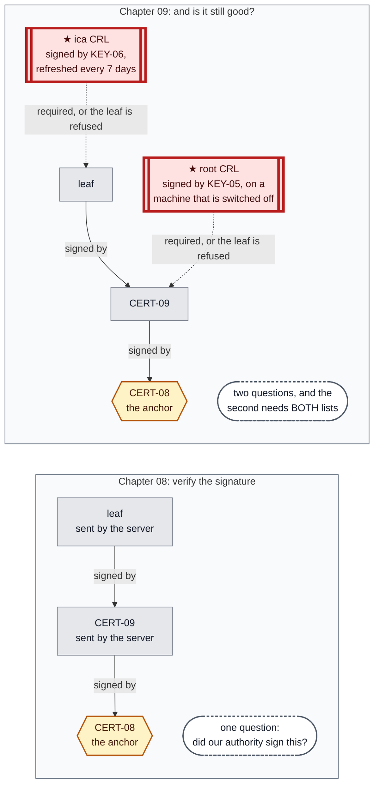
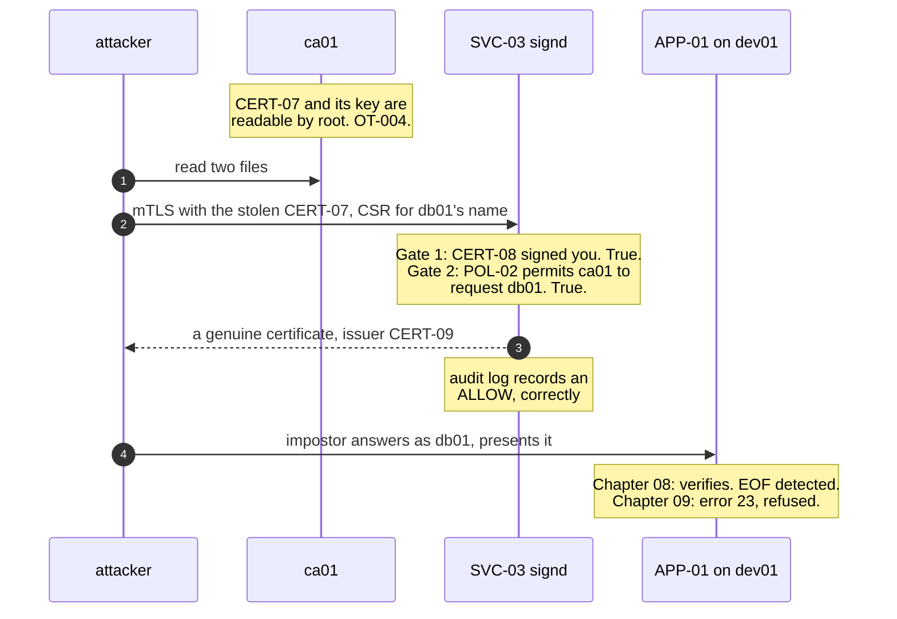
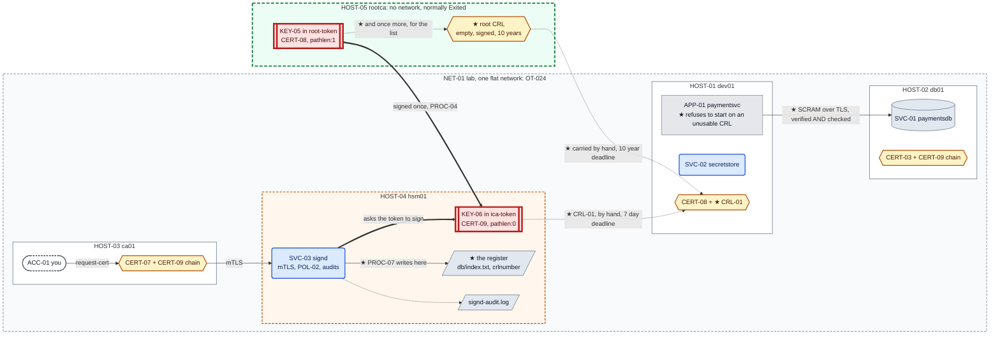

# Chapter 09 — Taking it back

## The system before this chapter

Five machines. An offline root on `HOST-05` signs one intermediate; the intermediate, in a token
on `HOST-04`, signs everything else through `SVC-03`, which authenticates callers with mTLS,
authorises them against `POL-02` and audits every decision. Clients pin `CERT-08` and are given
chains.

Chapter 08 made the signing key replaceable without touching a client. It did nothing at all
about the certificates that key has already signed.

## The pressure

`OT-022`. Nothing in this estate can be taken back.

Every certificate here is valid until its `notAfter` and no component has any way to say
otherwise. Chapter 08 sharpened that from a general complaint into a specific one: `CERT-09` can
be **replaced** in minutes and cannot be **invalidated**, and both it and its replacement would
be accepted side by side for five years.

Replacement is not revocation, and the difference is the whole chapter. Replacing a certificate
answers "what should we use from now on". Revoking one answers "stop trusting what we handed out
before", and only the second is any use once something has already leaked.

---

## 0. If your output differs

Certificate serials, CRL numbers, dates and container IDs will differ. The PINs are the ones
Chapter 08 set: `4321` and `8765` on `rootca`, `1357` and `2468` for `ica-token` on `hsm01`.

Work in this chapter's `lab/` folder:

```bash
cd "chapters/Chapter 09/lab"
ls
```

Expected: `docker-compose.yml`, and the directories `dev01/`, `db01/`, `ca01/`, `hsm01/` and
`rootca/`.

### The lab in full

What **this** chapter writes is marked ★:

```
lab/
├── docker-compose.yml                Chapter 08
├── dev01/
│   ├── Dockerfile                    Chapter 01
│   ├── entrypoint.sh                 Chapter 01
│   ├── initdb.sql                    Chapter 01, seed for dev01 only, never re-run
│   ├── app/
│   │   ├── config.yaml             ★ changed: names a CRL, which is not a small switch
│   │   └── paymentsvc.py           ★ changed: refuses to start if that CRL is unusable
│   └── secretstore/
│       ├── secretstore.py            Chapter 03
│       ├── secretstore-set.py        Chapter 02
│       └── policy.json               Chapter 03
├── db01/
│   ├── Dockerfile                    Chapter 04
│   ├── entrypoint.sh                 Chapter 04
│   └── impostor.py                   Chapter 04, and it comes back in section 1
├── ca01/
│   ├── Dockerfile                    Chapter 07
│   ├── entrypoint.sh                 Chapter 07
│   └── request-cert.sh               Chapter 08
├── hsm01/
│   ├── Dockerfile                    Chapter 07
│   ├── entrypoint.sh                 Chapter 07
│   ├── hsm-init.sh                   Chapter 07, history
│   ├── ica-init.sh                   Chapter 08
│   ├── sign-leaf.sh                  Chapter 08
│   ├── signd.py                      Chapter 08
│   ├── stop-signd.sh                 Chapter 08
│   ├── policy.json                   Chapter 07
│   ├── ca.cnf                      ★ new: the authority acquires a register
│   ├── crl-refresh.sh              ★ new: publishes CRL-01, and must keep doing it
│   └── revoke-cert.sh              ★ new: PROC-07
└── rootca/
    ├── Dockerfile                    Chapter 08
    ├── entrypoint.sh                 Chapter 08
    ├── root-init.sh                  Chapter 08
    ├── sign-ca.sh                    Chapter 08
    ├── root.cnf                    ★ new: the offline root needs a register too
    └── root-crl.sh                 ★ new: and it has to be started to use it
```

**Nothing is rebuilt.** Every file is deployed into a running container with `docker cp`, and
`rootca` is started once, briefly, in `§5`.

### Before you start

`dev01` is built in Chapter 01, `db01` in Chapter 04, `ca01` in Chapter 05, `hsm01` in Chapter 07
and `rootca` in Chapter 08. **Building from here does not give you this chapter's starting
state.**

```bash
sudo docker start db01 ca01 hsm01 dev01
sudo docker exec dev01 openssl x509 -in /opt/paymentsvc/ca.crt -noout -subject
sudo docker exec dev01 grep -c "BEGIN CERTIFICATE" /opt/paymentsvc/ca.crt
sudo docker exec -u signd hsm01 openssl x509 -in /var/lib/ca/ica.crt -noout -subject -issuer
sudo docker ps -a --filter name=rootca --format '{{.Names}}  {{.Status}}'
```

Expected: subject `CN = Simurgh Lab Root CA`; **`1`**, because Chapter 08 §11 dropped the old
root from the bundle; an intermediate `CN = Simurgh Lab Issuing CA 1` issued by `CN = Simurgh Lab
Root CA`; and `rootca  Exited`, which is its correct state.

Then start the processes:

```bash
sudo docker exec dev01 sh -c '
  for i in $(seq 1 30); do pg_isready -q -h 127.0.0.1 -p 5432 && break; sleep 1; done
  pg_ctlcluster 15 main stop'
sudo docker exec -d -u secretstore dev01 \
    sh -c 'python3 /opt/secretstore/secretstore.py >>/var/log/secretstore.out 2>&1'
sleep 1
sudo docker exec -d -u paymentsvc dev01 \
    sh -c 'python3 /opt/paymentsvc/paymentsvc.py >>/var/log/paymentsvc.out 2>&1'
sudo docker exec -d -u signd hsm01 \
    sh -c 'python3 /usr/local/bin/signd >>/var/log/signd.out 2>&1'
sleep 2
curl -s http://127.0.0.1:8080/payments/1001/status
```

Expected: the payment record. `/healthz` answers from the process and never opens a connection,
so it is no use as a state check; Chapter 08 §10 is what that costs.

---

## 1. Make it fail: the impostor comes back, with real papers

Chapter 04 §7 stopped `db01`, put an impostor on the network under its name, and watched
`verify-full` refuse it. The impostor was turned away for one reason: nothing our authority had
signed said it was `db01`.

That reason is now purchasable.

### 1.1 What an attacker takes from `ca01`

`ca01` is an operator's workstation. `CERT-07` and its key sit on it so that a human can request
certificates, and root on that host can read both, which is `OT-004` and has been true since
Chapter 01. Take them:

```bash
sudo docker cp ca01:/opt/ca-client/ca01.crt /tmp/stolen.crt
sudo docker cp ca01:/opt/ca-client/ca01.key /tmp/stolen.key
sudo docker exec ca01 openssl x509 -in /opt/ca-client/ca01.crt -noout -subject -enddate
```

Expected: `subject=CN=ca01.lab.simurgh.example`, expiring about ninety days from when Chapter 08
issued it.

Nothing about that is an exploit. It is two file reads by the account that owns the machine, and
the estate has no way to notice it happened.

### 1.2 The attacker asks the authority nicely

Stop the real database and put a machine on the network under its name, exactly as Chapter 04
did:

```bash
sudo docker stop db01
sudo docker run -d --rm --name attacker --network lab_default \
    --network-alias db01.lab.simurgh.example \
    --entrypoint sleep ksm/dev01:chapter01 infinity
sudo docker cp /tmp/stolen.crt attacker:/root/stolen.crt
sudo docker cp /tmp/stolen.key attacker:/root/stolen.key
```

Expected: a container id, then two copies.

`--entrypoint sleep` and the alias are both load-bearing, for the reasons Chapter 04 §7 gives:
the image's entrypoint would otherwise start PostgreSQL and take port 5432, and without the alias
nothing resolves `db01.lab.simurgh.example` to this machine.

Now the part that matters. The attacker generates **its own** key, and asks `SVC-03` for a
certificate naming the database:

```bash
sudo docker cp attacker:/dev/null /dev/null 2>/dev/null || true
sudo docker exec attacker sh -c '
  cd /root
  openssl ecparam -name prime256v1 -genkey -noout -out imp.key
  openssl req -new -key imp.key -out imp.csr -subj "/CN=db01.lab.simurgh.example"
  CSR=$(sed ":a;N;\$!ba;s/\n/\\\\n/g" imp.csr)
  printf "{\"csr\": \"%s\", \"fqdn\": \"db01.lab.simurgh.example\", \"alt_names\": [\"db01\"]}" \
      "$CSR" > body.json
  curl -sS -k --cert /root/stolen.crt --key /root/stolen.key \
      -H "Content-Type: application/json" \
      -X POST https://hsm01.lab.simurgh.example:8443/v1/sign \
      -d @body.json > reply.json
  sed -n "s/.*\"certificate\": \"\(.*\)\", \"chain\".*/\1/p" reply.json | sed "s/\\\\n/\n/g" > imp.crt
  sed -n "s/.*\"chain\": \"\(.*\)\", \"issued_for\".*/\1/p"    reply.json | sed "s/\\\\n/\n/g" > ica.crt
  cat imp.crt ica.crt > imp.chain.crt
  openssl x509 -in imp.crt -noout -subject -issuer -dates'
```

Expected:

```
--- asking signd, using ca01's stolen credential ---
subject=CN=db01.lab.simurgh.example
issuer=CN=Simurgh Lab Issuing CA 1
notBefore=...
notAfter=...
```

`-k` tells `curl` not to verify `signd`'s certificate. The attacker does not care whether the
authority is genuine; they care that the authority believes **they** are. Verification protects
the client, and this client has nothing to protect.

**Read the issuer.** That is our intermediate. `SVC-03` verified the client certificate against
`CERT-08`, found `ca01.lab.simurgh.example`, looked that name up in `POL-02`, found
`db01.lab.simurgh.example` on its list of permitted names, and issued. Every gate did exactly
what Chapter 07 built it to do.

Confirm the authority thinks so too:

```bash
sudo docker exec -u signd hsm01 tail -2 /var/log/signd-audit.log
```

Expected two lines, the second reading `caller=ca01.lab.simurgh.example`,
`requested=db01.lab.simurgh.example`, `decision=allow`.

**The audit log records a legitimate request.** It is not wrong. From where `SVC-03` stands,
`ca01` asked for a name `ca01` is allowed to ask for. There is no field in that record that could
have been different, which is worth sitting with before reaching for a better policy: `POL-02`
was not bypassed, it was **used**.

The attacker now holds a certificate our own authority issued, for the database's name, against a
key we have never seen. `KEY-01` never moved. It is still on `db01`, still the only copy, still
exactly as `D-036` and `D-044` describe it, and it made no difference at all.

### 1.3 The application accepts it

`SVC-03` returned the chain alongside the certificate, so the attacker already has both. Keep a
copy of the pair on the host, because `§7` and `§8` need the same credential again and the
container is disposable:

```bash
sudo docker cp attacker:/root/imp.chain.crt /tmp/imp.chain.crt
sudo docker cp attacker:/root/imp.key       /tmp/imp.key
sudo docker cp db01/impostor.py attacker:/root/impostor.py
sudo docker exec -d attacker \
    sh -c 'python3 /root/impostor.py /root/imp.chain.crt /root/imp.key >/root/imp.log 2>&1'
sleep 1
sudo docker exec attacker cat /root/imp.log
```

Expected: `impostor listening on 0.0.0.0:5432`.

The chain matters here for the same reason it mattered in Chapter 08 §10, and the attacker had to
get it right too. A leaf on its own would be refused, and the refusal would look like a defence.

Point the application at it:

```bash
sudo docker exec dev01 pkill -f 'python3 /opt/paymentsvc/paymentsvc.py' || true
sudo docker exec -u paymentsvc dev01 python3 /opt/paymentsvc/paymentsvc.py 2>&1 | tail -4
```

Expected, ending in:

```
psycopg2.OperationalError: connection to server at "db01.lab.simurgh.example" (172.x.x.x),
port 5432 failed: SSL SYSCALL error: EOF detected
```

**`EOF detected` is the finding, and it is easy to misread as a failure.** Compare Chapter 04 §7,
where the same experiment produced `certificate verify failed`. That was a refusal: the client
looked at the certificate and would not proceed.

This is not a refusal. `EOF detected` means the TLS handshake **completed**. The client verified
the certificate against `CERT-08`, checked the name, accepted it, started talking PostgreSQL, and
the impostor hung up because fifty lines of Python do not implement the wire protocol. Had the
attacker written another two hundred lines, the application would be talking to them right now
and the log would say nothing at all.

Prove the acceptance rather than inferring it from an error message:

```bash
sudo docker cp /tmp/imp.chain.crt ca01:/opt/ca-client/imp.chain.crt
sudo docker cp dev01:/opt/paymentsvc/ca.crt /tmp/anchor.crt
sudo docker cp /tmp/anchor.crt ca01:/opt/ca-client/anchor.crt
sudo docker exec ca01 chown ca:ca /opt/ca-client/imp.chain.crt /opt/ca-client/anchor.crt
sudo docker exec -u ca ca01 openssl verify -CAfile /opt/ca-client/anchor.crt \
    -untrusted /opt/ca-client/imp.chain.crt /opt/ca-client/imp.chain.crt
```

Expected:

```
/opt/ca-client/imp.chain.crt: OK
```

The estate's own verifier, using the estate's own anchor, says the impostor's certificate is
good. Because it is.

### 1.4 What is actually missing

Take stock before reaching for a mechanism, because three plausible fixes are all wrong.

**Not "tighten `POL-02`".** The policy allowed exactly what it was written to allow. Narrowing it
would help against a future request and does nothing about the certificate already issued.

**Not "rotate `CERT-07`".** Issuing `ca01` a new client credential stops the attacker asking for
*more* certificates. The one they have keeps working for ninety days.

**Not "re-issue `CERT-03`".** Giving `db01` a fresh certificate changes what the real database
presents and has no effect whatever on what the impostor presents. Two valid certificates for one
name is not a conflict; it is what a CA is for.

The gap is narrower than any of those and it has a name. Every client in this estate can ask "did
our authority sign this". None of them can ask **"does our authority still stand behind it"**,
and until Chapter 09 the authority had no way to answer even if asked.

Clean up the impostor, and leave `db01` down for now:

```bash
sudo docker stop attacker
```

Expected: `attacker`. The container was started with `--rm` and removes itself.

---

## 2. Why the authority cannot answer

The answer would be a list of certificates the authority has taken back, signed so nobody can
edit it. Before we can publish one we have to be able to say what is on it, and that turns out to
be the problem.

Look at what the authority knows:

```bash
sudo docker exec -u signd hsm01 ls -1 /var/lib/ca/issued/
sudo docker exec -u signd hsm01 ls -la /var/lib/ca/ | grep -Ev 'pin|^total'
```

Expected: a handful of `.crt` and `.chain.crt` files, and a directory listing with no database of
any kind in it.

**`/var/lib/ca/issued/` is a directory, not a register.** It holds a copy of some certificates,
under filenames derived from the name requested, which means the second certificate issued for
`db01.lab.simurgh.example` overwrote the first. It cannot answer what has been issued, what is
still valid, or what was taken back. Ask it about the certificate the attacker just obtained:

```bash
sudo docker exec -u signd hsm01 \
    openssl x509 -in /var/lib/ca/issued/db01.lab.simurgh.example.crt -noout -serial -dates
```

Expected: a serial and dates. Whether that is the attacker's certificate or the legitimate one
depends on which was issued last, and nothing in the directory records the difference.

The cause is one line, four chapters old. `sign-leaf` signs with `openssl x509 -req`, which takes
a request, produces a certificate, and records nothing:

```bash
sudo docker exec -u signd hsm01 grep -n "openssl x509 -req" -A 8 /usr/local/bin/sign-leaf
```

Expected: the signing call, with `-CAcreateserial` and no database of any sort.

**`OT-022` and `OT-018` turn out to be the same gap seen from two sides.** An authority that
cannot list what it issued cannot say what it has revoked, and cannot say what is about to expire
either. The missing thing is not a protocol. It is a register.

---

## 3. The register

`openssl ca` is the subcommand that keeps one, and `openssl ca -gencrl` is the only thing in
OpenSSL that produces a revocation list. So the authority acquires a database.

It acquires it **for revocation, not for issuance**. `sign-leaf` is unchanged and still uses
`openssl x509 -req`. That split looks untidy and is deliberate: rewriting issuance to go through
`openssl ca` would change the code path that every certificate in the estate depends on, in a
chapter whose subject is something else. `D-069`.

### 3.1 What goes in the register, and what does not

```ini
# The authority's register, and the smallest configuration that operates it.
#
# WHY THIS FILE EXISTS AT ALL. Every certificate this build has issued since
# Chapter 05 was produced with `openssl x509 -req`, which signs whatever it
# is handed and records nothing. /var/lib/ca/issued/ is a directory of files,
# not a register: it cannot answer "what have we issued", "what is still
# valid", or "what did we take back". An authority that cannot answer the
# third question cannot revoke, which is OT-022.
#
# `openssl ca` is the subcommand that keeps a register, and -gencrl is the
# only thing in OpenSSL that produces a CRL. So the CA acquires a database
# here, and it acquires it for revocation rather than for issuance: sign-leaf
# is unchanged and still uses `x509 -req`. That split is deliberate and D-069
# is where it is argued.
#
# NOTE WHAT IS NOT IN THIS FILE: private_key.
#
# `openssl ca` normally names the signing key here, and a pkcs11 URI with
# pin-value= in it would work. It was measured, and it works. It is not used,
# because that would put SEC-08 into a file on disk, which is Chapter 01's
# entire subject. The key is named on the command line by revoke-cert and
# crl-refresh instead, exactly as sign-leaf names it with -CAkey. D-067.
#
# Consequently this file holds no secret and is 0644, for the same reason
# POL-02 is: a configuration nobody can read is a configuration nobody can
# review.

[ ca ]
default_ca = CA_default

[ CA_default ]
dir               = /var/lib/ca

# The register. One line per certificate the authority has been told about,
# with its status, its expiry, its serial and its subject.
database          = $dir/db/index.txt

# A monotonic counter, separate from the certificate serial counter. Every
# CRL carries one, and a client that has seen number 7 can tell that number 6
# is stale. Without it a replayed old CRL is indistinguishable from a current
# one, which matters because a CRL is a public file an attacker may be the
# one delivering.
crlnumber         = $dir/db/crlnumber

# CERT-09, the intermediate. The CRL must be signed by the same authority
# that signed the certificates it revokes, which is why the root's CRL is a
# separate problem this chapter does not solve. See OT-034.
certificate       = $dir/ica.crt

default_md        = sha256

# SEVEN DAYS, AND THIS NUMBER IS THE CHAPTER'S SHARPEST TRADE-OFF.
#
# A CRL carries nextUpdate. Past it, every verifier that is checking
# revocation refuses EVERY certificate, not just revoked ones, with
# `error 12: CRL has expired`. Measured, not assumed.
#
# So this number is not "how long a CRL is good for". It is "how long the
# estate keeps working if nobody refreshes it". Short means an attacker's
# window after a revocation is small and the operational burden is constant.
# Long means the reverse. Seven days is chosen because this lab has a human
# running crl-refresh by hand and no scheduler; a real estate runs it far
# more often precisely because it has one. D-070, and OT-033.
default_crl_days  = 7

crl_extensions    = crl_ext

[ crl_ext ]
# Which key signed this list. A verifier holding two intermediates needs to
# know which one is speaking, and this is how it tells.
authorityKeyIdentifier = keyid:always
```

Deploy it, and create the two files it names:

```bash
sudo docker cp hsm01/ca.cnf hsm01:/var/lib/ca/ca.cnf
sudo docker exec hsm01 sh -c '
  mkdir -p /var/lib/ca/db
  touch /var/lib/ca/db/index.txt
  test -f /var/lib/ca/db/crlnumber || echo 1000 > /var/lib/ca/db/crlnumber
  chown -R signd:signd /var/lib/ca/db /var/lib/ca/ca.cnf
  chmod 0644 /var/lib/ca/ca.cnf
  ls -l /var/lib/ca/db/'
```

Expected: `index.txt`, empty, and `crlnumber` containing `1000`, both owned by `signd`.

**The register starts empty and that is correct.** It is not a history of what was issued, which
we cannot reconstruct, it is a record of what has been taken back, which is currently nothing.
That distinction is `D-069` and it is why the retrofit costs nothing: `openssl ca -revoke` adds a
certificate it has never seen to the database on sight, so a certificate issued three chapters
ago can be revoked today.

**`crlnumber` is not the certificate serial counter.** Every CRL carries a monotonic number of
its own, and a client that has seen number 7 can tell that number 6 is stale. Without it, an
attacker who can serve you an old list can undo a revocation by replaying it.

---

## 4. Revoke, and publish

Two tools, and the split between them is the point. `revoke-cert` records a decision.
`crl-refresh` publishes one. The second has to keep happening long after the first has been
forgotten.

### 4.1 `crl-refresh`

```sh
#!/bin/sh
# Publish CRL-01. Run as the `signd` user on hsm01.
#
#   crl-refresh
#
# Regenerates the certificate revocation list from the register and writes it
# where clients collect it. It takes no arguments and revokes nothing: this is
# the routine half of revocation, and the one that has to keep happening after
# everybody has forgotten there was an incident.
#
# WHY A SEPARATE TOOL FROM revoke-cert. A CRL expires. Past its nextUpdate a
# verifier that is checking revocation refuses every certificate it is shown,
# including healthy ones, with `error 12: CRL has expired`. So the list has to
# be republished on a schedule whether or not anything was revoked, and a
# procedure that only runs when something goes wrong will not do that.
#
# Nothing on this host runs it on a schedule. That is OT-009 acquiring a
# consequence it did not have before: until Chapter 09 an unstarted process
# meant a service was down, and now an unrun command means the estate stops
# trusting itself. OT-033.
#
# WHY THE OUTPUT IS TWO LISTS IN ONE FILE. libpq sets CRL_CHECK_ALL and
# demands a list from every authority in the chain. Measured: given only this
# authority's CRL it refuses a healthy certificate, and given only the
# root's it does the same. Both together, concatenated, and it connects.
#
# So the artefact clients need is not the list this machine produces, it is
# that list plus the root's. Assembling it here means there is exactly one
# file to distribute and it is the one that works, which is D-064 applied to
# revocation: produce the correct thing at the point of production rather
# than asking every holder to assemble it.

set -eu

DIR=/var/lib/ca
CNF="$DIR/ca.cnf"
ICA_CRL="$DIR/ica-crl.pem"          # what this authority signs
ROOT_CRL="$DIR/root-crl.pem"        # what the ceremony on rootca produced
OUT="$DIR/crl.pem"                  # CRL-01, the two of them, for clients

MODULE=/usr/lib/softhsm/libsofthsm2.so
TOKEN=ica-token
LABEL=ica-key
PIN_FILE=$DIR/ica-pin               # SEC-08

[ -r "$CNF" ]      || { echo "crl-refresh: cannot read $CNF" >&2; exit 1; }
[ -r "$PIN_FILE" ] || { echo "crl-refresh: cannot read the PIN. Run as the 'signd' user." >&2; exit 1; }
[ -r "$ROOT_CRL" ] || {
    echo "crl-refresh: no root CRL at $ROOT_CRL." >&2
    echo "  Publishing without it produces a file that every client refuses," >&2
    echo "  including for healthy certificates. Run root-crl on rootca first." >&2
    exit 1
}
PIN=$(cat "$PIN_FILE")

# The key is named here rather than in ca.cnf, so that SEC-08 is not written
# into a file that persists. Both forms were measured and both work; this one
# does not leave the PIN on disk. D-067.
KEY_URI="pkcs11:token=$TOKEN;object=$LABEL;type=private?pin-value=$PIN"

# Written to a temporary file and moved into place. A client that reads
# crl.pem while it is half-written gets a parse error rather than a CRL, and
# on a verifier that is failing closed a parse error is an outage. mv within
# one filesystem is atomic; `>` is not.
TMP=$(mktemp "$DIR/crl.XXXXXX")
trap 'rm -f "$TMP"' EXIT

openssl ca -config "$CNF" \
    -engine pkcs11 -keyform engine -keyfile "$KEY_URI" \
    -gencrl -out "$ICA_CRL" 2>/dev/null
chmod 0644 "$ICA_CRL"

cat "$ICA_CRL" "$ROOT_CRL" > "$TMP"
mv "$TMP" "$OUT"
chmod 0644 "$OUT"
trap - EXIT

# Print both lists. The serial entries matter to verifiers; the dates matter
# to whoever is on call, and the EARLIER of the two nextUpdate values is the
# one that takes the estate down.
echo "published: $OUT"
for f in "$ICA_CRL" "$ROOT_CRL"; do
    printf '  %s\n' "$(openssl crl -in "$f" -noout -issuer | cut -d= -f2-)"
    openssl crl -in "$f" -noout -crlnumber -lastupdate -nextupdate | sed 's/^/    /'
done
echo "revoked entries here: $(grep -c '^R' "$DIR/db/index.txt" 2>/dev/null || echo 0)"
```

### 4.2 `revoke-cert`, which is `PROC-07`

```sh
#!/bin/sh
# PROC-07, the revoking half. Run as the `signd` user on hsm01.
#
#   revoke-cert <certificate-file> [reason]
#
# Adds a certificate to the register as revoked, then republishes CRL-01 so
# the decision reaches anybody who is checking. Both steps, always: a
# revocation that is recorded and not published has changed nothing at all,
# and that is the failure mode worth designing against, because it looks like
# success on the machine where you typed it.
#
# WHAT YOU HAND IT is the certificate, not a serial. The serial is what ends
# up in the list, but a human reading a serial cannot tell whether it is the
# right one, and revoking the wrong certificate is an outage you then have to
# diagnose without the thing that would have told you. So the tool takes the
# file, prints its subject and serial, and lets you see what you are about to
# take back.
#
# ON `reason`. X509 CRLs carry an optional reason code, and it is not
# decoration: `keyCompromise` and `cessationOfOperation` mean genuinely
# different things to anybody reading the list later, and only one of them
# means the certificate must never be trusted again for any period. Default
# here is unspecified, because guessing is worse than saying nothing.
#
# Valid reasons, from `openssl ca`:
#   unspecified, keyCompromise, CACompromise, affiliationChanged,
#   superseded, cessationOfOperation, certificateHold, removeFromCRL

set -eu

DIR=/var/lib/ca
CNF="$DIR/ca.cnf"

MODULE=/usr/lib/softhsm/libsofthsm2.so
TOKEN=ica-token
LABEL=ica-key
PIN_FILE=$DIR/ica-pin               # SEC-08

if [ $# -lt 1 ] || [ $# -gt 2 ]; then
    echo "usage: revoke-cert <certificate-file> [reason]" >&2
    exit 2
fi
CERT="$1"
REASON="${2:-unspecified}"

[ -r "$CERT" ]     || { echo "revoke-cert: cannot read $CERT" >&2; exit 1; }
[ -r "$CNF" ]      || { echo "revoke-cert: cannot read $CNF" >&2; exit 1; }
[ -r "$PIN_FILE" ] || { echo "revoke-cert: cannot read the PIN. Run as the 'signd' user." >&2; exit 1; }
PIN=$(cat "$PIN_FILE")

# Refuse a certificate this authority did not sign. Without this check the
# register would happily accept anything: `openssl ca -revoke` adds unknown
# certificates to the database on sight, which is what makes the retrofit in
# section 4 possible and also means the tool has no opinion of its own about
# what belongs. Revoking a certificate we never issued would publish a serial
# that means nothing, and mean the real one is still trusted.
if ! openssl verify -partial_chain -CAfile "$DIR/ica.crt" "$CERT" >/dev/null 2>&1; then
    echo "revoke-cert: $CERT was not issued by CERT-09. Refusing." >&2
    echo "  its issuer: $(openssl x509 -in "$CERT" -noout -issuer)" >&2
    exit 1
fi

echo "== about to revoke =="
openssl x509 -in "$CERT" -noout -subject -serial -dates
echo "reason: $REASON"
echo

KEY_URI="pkcs11:token=$TOKEN;object=$LABEL;type=private?pin-value=$PIN"

echo "== 1. record it in the register =="
openssl ca -config "$CNF" \
    -engine pkcs11 -keyform engine -keyfile "$KEY_URI" \
    -revoke "$CERT" -crl_reason "$REASON" 2>&1 | grep -v "^Engine" || true

echo
echo "== 2. publish, because step 1 on its own changes nothing =="
crl-refresh

echo
echo "== 3. the register now says =="
cat "$DIR/db/index.txt"
```

**It takes the certificate, not the serial.** A serial is fifteen unmemorable bytes and a human
reading one cannot tell whether it is the right one. Revoking the wrong certificate is an outage
you then have to diagnose without the thing that would have told you, so the tool prints the
subject and dates of what it is about to take back.

**It refuses a certificate this authority did not sign.** That check is necessary precisely
because `openssl ca -revoke` is so accommodating: it adds anything it is handed. Publishing a
serial that belongs to somebody else's hierarchy means nothing, and means the real certificate is
still trusted.

Deploy both:

```bash
sudo docker cp hsm01/crl-refresh.sh hsm01:/usr/local/bin/crl-refresh
sudo docker cp hsm01/revoke-cert.sh hsm01:/usr/local/bin/revoke-cert
sudo docker exec hsm01 chmod 0755 /usr/local/bin/crl-refresh /usr/local/bin/revoke-cert
```

Expected: no output.

### 4.3 Try it, and be stopped

```bash
sudo docker exec -u signd hsm01 crl-refresh
```

Expected:

```
crl-refresh: no root CRL at /var/lib/ca/root-crl.pem.
  Publishing without it produces a file that every client refuses,
  including for healthy certificates. Run root-crl on rootca first.
```

That refusal is `§5`, and it was not in the plan.

---

## 5. The offline root has to speak

A revocation list is signed by the authority that issued the certificates it covers. `CERT-09`
signed everything in this estate, so `CERT-09` signs the list, and that would be the end of it if
clients checked the way `openssl verify -crl_check` does.

They do not. **libpq sets `CRL_CHECK_ALL`**, which means it demands a list from every authority
in the chain, the root included. Given only the intermediate's list it refuses a perfectly
healthy certificate, because it cannot establish the root's opinion at all.

So switching revocation on anywhere in this estate requires `CERT-08` to publish a list.
`CERT-08` is on a machine with no network that spends its life in state `Exited`.

**Figure 9.1 — what a verifier needs, before and after**



**Read the two dotted arrows on the right.** Neither is optional and neither depends on anything
having been revoked. A client checking revocation refuses the leaf unless it holds a current,
signed statement from **both** authorities, even when both statements say "I have taken back
nothing".

That is the sentence worth keeping: **the absence of a list and a list saying nothing are
completely different statements**, and only one of them lets the estate work.

### 5.1 The root's register

```ini
# The root's register, on the machine that is normally switched off.
#
# WHY THE ROOT NEEDS ONE AT ALL, which was a surprise. libpq does not check
# revocation the way `openssl verify -crl_check` does. It sets
# CRL_CHECK_ALL, which means it wants a revocation list from EVERY authority
# in the chain, not just the one that signed the leaf. Measured: a client
# given only the intermediate's CRL refuses a perfectly healthy certificate.
#
# So switching revocation on anywhere in this estate requires CERT-08 to
# publish a list, and CERT-08 lives here, on a host with no network that
# spends its life in state `Exited`. The offline root has to speak.
#
# That is the tension Chapter 09 could not design around: the machine whose
# entire value is being unreachable is now on the critical path of every TLS
# handshake in the estate. It speaks once, during a ceremony, and the list it
# produces has to last until the next one.
#
# No private_key here, for the same reason ca.cnf on hsm01 has none: it would
# put SEC-06 in a file. root-crl names the key on the command line. D-067.

[ ca ]
default_ca = CA_default

[ CA_default ]
dir               = /var/lib/rootca
database          = $dir/db/index.txt
crlnumber         = $dir/db/crlnumber
certificate       = $dir/root.crt
default_md        = sha256

# TEN YEARS, matching CERT-08's own validity, and the reasoning is the
# opposite of the intermediate's seven days.
#
# A CRL cannot usefully outlive the authority that signed it, so ten years is
# the ceiling. It is also close to the floor, because the only way to
# republish this list is a ceremony: start a machine that is deliberately
# off, unlock a token, sign, stop it again. A one-year root CRL would put a
# hard annual deadline on the whole estate, enforced by every client
# refusing every certificate the morning it lapses.
#
# Real hierarchies do use months rather than years here, and they can,
# because they have a scheduled ceremony and people whose job it is. This
# lab has neither, and a teaching lab that bricks itself on an anniversary
# teaches the wrong lesson. The trade is argued in D-072 and the gap it
# leaves is OT-035: a root CRL this long means a compromised intermediate
# stays trusted until somebody convenes a ceremony, which is exactly as slow
# as it sounds.
default_crl_days  = 3650

crl_extensions    = crl_ext

[ crl_ext ]
authorityKeyIdentifier = keyid:always
```

### 5.2 The ceremony half

```sh
#!/bin/sh
# The CRL half of the root ceremony. Run as the `rootca` user, on rootca,
# while the machine is briefly started.
#
#   root-crl
#
# Publishes the root's revocation list. It revokes nothing: at the time of
# writing CERT-08 has signed exactly one certificate, CERT-09, and that one
# is fine. The list is empty and it is still mandatory, which is the part
# worth understanding.
#
# WHY AN EMPTY LIST IS NOT A NO-OP. libpq sets CRL_CHECK_ALL, so a client
# checking revocation demands a list from every authority in the chain. Given
# only the intermediate's list it refuses a healthy certificate, because it
# cannot establish the root's opinion at all. An empty CRL is that opinion:
# "I have revoked nothing, and here is my signature saying so, valid until
# nextUpdate."
#
# The absence of a list and a list saying nothing are completely different
# statements, and only one of them lets the estate work.
#
# This runs inside PROC-04's window, between `docker start` and `docker stop`.
# It is the second thing the root does in its life and, if nothing is ever
# compromised, the last.

set -eu

DIR=/var/lib/rootca
CNF="$DIR/root.cnf"
OUT="$DIR/root-crl.pem"

MODULE=/usr/lib/softhsm/libsofthsm2.so
TOKEN=root-token
LABEL=root-key
PIN_FILE=$DIR/pin           # SEC-06

[ -r "$CNF" ]      || { echo "root-crl: cannot read $CNF" >&2; exit 1; }
[ -r "$PIN_FILE" ] || { echo "root-crl: cannot read the PIN. Run as the 'rootca' user." >&2; exit 1; }
PIN=$(cat "$PIN_FILE")

mkdir -p "$DIR/db"
[ -f "$DIR/db/index.txt" ] || : > "$DIR/db/index.txt"
[ -f "$DIR/db/crlnumber" ] || echo 1000 > "$DIR/db/crlnumber"

KEY_URI="pkcs11:token=$TOKEN;object=$LABEL;type=private?pin-value=$PIN"

openssl ca -config "$CNF" \
    -engine pkcs11 -keyform engine -keyfile "$KEY_URI" \
    -gencrl -out "$OUT" 2>/dev/null

chmod 0644 "$OUT"

echo "published: $OUT"
openssl crl -in "$OUT" -noout -issuer -crlnumber -lastupdate -nextupdate

echo
echo "This file is public and must reach every client in the estate. Until it"
echo "does, any client configured to check revocation refuses everything."

date -u +"%Y-%m-%dT%H:%M:%SZ  root CRL published, nextUpdate $(openssl crl -in "$OUT" -noout -nextupdate | cut -d= -f2)" \
    >> "$DIR/ceremony.log"
```

### 5.3 Run it, inside `PROC-04`'s window

This is the second time `rootca` has been started in its life. The shape is Chapter 08 `§8`'s
procedure with a different verb in the middle:

```bash
sudo docker cp rootca/root.cnf   rootca:/var/lib/rootca/root.cnf
sudo docker cp rootca/root-crl.sh rootca:/usr/local/bin/root-crl
sudo docker start rootca
sudo docker exec rootca sh -c '
  chown rootca:rootca /var/lib/rootca/root.cnf
  chmod 0644 /var/lib/rootca/root.cnf
  chmod 0755 /usr/local/bin/root-crl'
sudo docker exec -u rootca rootca root-crl
```

Expected:

```
published: /var/lib/rootca/root-crl.pem
issuer=CN = Simurgh Lab Root CA
crlNumber=1000
lastUpdate=...
nextUpdate=...  (ten years out)

This file is public and must reach every client in the estate. Until it
does, any client configured to check revocation refuses everything.
```

Take it out and close the window:

```bash
sudo docker cp rootca:/var/lib/rootca/root-crl.pem /tmp/root-crl.pem
sudo docker stop rootca
sudo docker ps -a --filter name=rootca --format '{{.Names}}  {{.Status}}'
```

Expected: `rootca  Exited`.

**The window was open for about four commands.** That is the same measure Chapter 08 §8
introduced, and this is the first time it has been opened for a reason other than the ceremony
that created the hierarchy. It will have to be opened again every time this list approaches its
`nextUpdate`, and that is a calendar entry the estate now depends on.

### 5.4 Ten years, and why it is not seven days

The intermediate's list lives seven days. The root's lives ten. The reasoning runs in opposite
directions and both are in the configuration files above.

A short list is good: it caps how long a revocation takes to reach everybody, and it keeps the
publishing procedure exercised. `crl-refresh` runs on a machine that is up, so seven days costs
nothing but a habit.

The root's list can only be republished by starting a machine that is deliberately off, unlocking
a token and signing. A one-year root CRL would put a hard annual deadline on the entire estate,
enforced by every client refusing every certificate on the morning it lapsed. Real hierarchies do
use months here, and they can, because they have a scheduled ceremony and people whose job it is.
Ten years matches `CERT-08`'s own validity, which is the ceiling, since a list cannot usefully
outlive the authority that signed it. `D-072`.

What that buys is a lab that does not brick itself on an anniversary. What it costs is `OT-035`:
a compromised intermediate stays trusted until somebody convenes a ceremony.

---

## 6. Publish, and revoke the certificate that should never have existed

Give `hsm01` the root's list, then publish:

```bash
sudo docker cp /tmp/root-crl.pem hsm01:/var/lib/ca/root-crl.pem
sudo docker exec hsm01 sh -c '
  chown signd:signd /var/lib/ca/root-crl.pem
  chmod 0644 /var/lib/ca/root-crl.pem'
sudo docker exec -u signd hsm01 crl-refresh
```

Expected:

```
published: /var/lib/ca/crl.pem
  CN = Simurgh Lab Issuing CA 1
    crlNumber=1000
    lastUpdate=...
    nextUpdate=...  (seven days out)
  CN = Simurgh Lab Root CA
    crlNumber=1000
    lastUpdate=...
    nextUpdate=...  (ten years out)
revoked entries here: 0
```

**Two lists, one file, and the earlier `nextUpdate` is the one that matters.** Seven days from
now this file stops working, and it stops working for healthy certificates.

Now take back what the attacker holds. The certificate is still on `hsm01`, because `sign-leaf`
kept a copy when it issued it:

```bash
sudo docker exec -u signd hsm01 \
    revoke-cert /var/lib/ca/issued/db01.lab.simurgh.example.crt keyCompromise
```

Expected: the subject and serial, then `Revoking Certificate <serial>`, then `Database updated`,
then a republished CRL reporting `revoked entries here: 1`, then the register itself:

```
R	<expiry>	<revocation date>	<serial>	unknown	/CN=db01.lab.simurgh.example
```

**`keyCompromise` is not decoration.** A CRL entry carries an optional reason, and this one says
that the private key is in someone else's hands, which is a different statement from `superseded`
or `cessationOfOperation`. Only `keyCompromise` means the certificate must never be trusted again
for any period, and somebody reading this list in two years needs to know which of those
happened.

Confirm the list says so:

```bash
sudo docker exec -u signd hsm01 sh -c '
  openssl crl -in /var/lib/ca/ica-crl.pem -noout -text | grep -A3 "Serial Number"'
```

Expected: the serial, its revocation date, and `X509v3 CRL Reason Code: Key Compromise`.

---

## 7. Make the client check

The list exists and nothing reads it. Distribute it, then turn checking on.

```bash
sudo docker cp hsm01:/var/lib/ca/crl.pem /tmp/crl.pem
sudo docker cp /tmp/crl.pem dev01:/opt/paymentsvc/crl.pem
sudo docker exec dev01 sh -c '
  chown paymentsvc:paymentsvc /opt/paymentsvc/crl.pem
  chmod 0644 /opt/paymentsvc/crl.pem
  grep -c "BEGIN X509 CRL" /opt/paymentsvc/crl.pem'
```

Expected: `2`.

`config.yaml` gains one line, and it is worth reading the comment above it before adding it:

```yaml
# /opt/paymentsvc/config.yaml
database:
  host: db01.lab.simurgh.example
  port: 5432
  name: paymentsdb
  sslmode: verify-full
  # Chapter 05: the anchor is the authority, not the server.
  #
  # This was /opt/paymentsvc/db01.crt, a copy of the certificate db01
  # presents. Pinning that meant re-issuing db01's certificate broke this
  # client, which is OT-017. Now it is CERT-02, the root, and db01 can be
  # re-issued as often as it likes without this line or this file changing.
  #
  # The path is the only thing that had to change on the client. That is
  # the whole payoff, and it is a one-time cost.
  sslrootcert: /opt/paymentsvc/ca.crt
  # Chapter 09: check whether the certificate has been taken back.
  #
  # The anchor above answers "did our authority sign this". It cannot answer
  # "does our authority still stand behind it", and those became different
  # questions the moment a credential was stolen. This line is the second
  # question.
  #
  # It is not a free improvement. With this set, libpq refuses any
  # certificate whose revocation status it cannot establish: no file, an
  # unreadable file, or a list past its nextUpdate all stop this application
  # from starting, healthy certificates included. Deleting the line turns
  # revocation checking off and everything works again, which is exactly why
  # it is worth knowing that the line is load-bearing.
  sslcrl: /opt/paymentsvc/crl.pem
secret_store:
  socket: /run/secretstore/sock
  secret_name: paymentsvc-db
server:
  listen: 0.0.0.0:8080
```

`paymentsvc.py` gains a preflight check, for reasons `§8` demonstrates:

```python
#!/usr/bin/env python3
"""APP-01 paymentsvc, answers 'what is the status of payment X?'

Chapter 04 change: SVC-01 now lives on its own machine, so the database
connection crosses a network. It is made with TLS and the server
certificate is verified against a pinned copy, which is what stops anything
that answers on port 5432 from being handed our queries.

The credential still comes from SVC-02 over a Unix socket on this host, and
this process still stores no credential of its own.
"""

import http.client
import json
import logging
import os
import pwd
import socket
import subprocess
import sys
from http.server import BaseHTTPRequestHandler, ThreadingHTTPServer

import psycopg2
import yaml
from psycopg2.extras import RealDictCursor

CONFIG_PATH = os.environ.get("PAYMENTSVC_CONFIG", "/opt/paymentsvc/config.yaml")

logging.basicConfig(
    level=os.environ.get("LOG_LEVEL", "INFO").upper(),
    format="%(asctime)s %(levelname)s %(message)s",
    handlers=[
        logging.FileHandler("/var/log/paymentsvc.log"),
        logging.StreamHandler(sys.stdout),
    ],
)
log = logging.getLogger("paymentsvc")


def load_config(path):
    log.info("loading configuration from %s", path)
    with open(path) as fh:
        cfg = yaml.safe_load(fh)
    log.debug("effective configuration: %s", cfg)
    return cfg


class UnixHTTPConnection(http.client.HTTPConnection):
    """An HTTP client that speaks over a Unix domain socket.

    The only difference from an ordinary HTTPConnection is where connect()
    points. Everything above it, requests, status codes, headers, is
    unchanged, which is why moving SVC-02 off TCP cost so little here.
    """

    def __init__(self, socket_path, timeout=5):
        super().__init__("localhost", timeout=timeout)
        self.socket_path = socket_path

    def connect(self):
        sock = socket.socket(socket.AF_UNIX, socket.SOCK_STREAM)
        sock.settimeout(self.timeout)
        sock.connect(self.socket_path)
        self.sock = sock


def fetch_credential(socket_path, secret_name):
    """Ask SVC-02 for the current database credential.

    We present no token and assert no identity. The kernel tells the store
    our uid when we connect, and the store applies POL-01 to it. If it says
    no, we get a 403 and fail loudly, being refused is not something to
    paper over.
    """
    conn = UnixHTTPConnection(socket_path)
    try:
        conn.request("GET", f"/v1/secrets/{secret_name}")
        resp = conn.getresponse()
        body = resp.read().decode()
        if resp.status == 403:
            raise PermissionError(
                f"secretstore refused this process: {json.loads(body).get('detail')}"
            )
        if resp.status != 200:
            raise RuntimeError(f"secretstore returned {resp.status}: {body}")
        payload = json.loads(body)
    finally:
        conn.close()
    cred = json.loads(payload["value"])
    log.info("fetched %s version %s as user %s",
             secret_name, payload["version"], cred["user"])
    return cred["user"], cred["password"], payload["version"]


def check_crl_usable(path):
    """Refuse to start rather than run with revocation checking silently off.

    THIS FUNCTION EXISTS BECAUSE libpq FAILS OPEN, AND IT WAS MEASURED.

    Naming a CRL is supposed to turn revocation checking on. libpq only turns
    it on if the file loads; if it cannot, the flags are never set, the
    connection succeeds, and a revoked certificate is accepted exactly as
    before. Four ways of being unusable were tested against PostgreSQL 15 and
    all four connected: the file missing, the file unreadable, the file
    containing something that is not a CRL, and the file empty.

    None of them warned. The last is the one that happens in real life: a
    fetch that failed and left a zero-byte file behind, after which the
    estate stops checking revocation and nothing anywhere says so.

    So the application checks on the platform's behalf, and refuses to start
    when the answer is no. That is D-011: a service configured to require a
    protection should fail loudly rather than run without it. A crash at
    startup is a page; a silently disabled security control is a year of
    believing something that is not true.

    Note what is NOT checked here: whether the file carries a list from every
    authority in the chain. libpq fails CLOSED on that one, refusing healthy
    certificates, so it is already loud and needs no help.
    """
    if not os.path.exists(path):
        raise SystemExit(f"sslcrl is set to {path}, which does not exist. "
                         "Refusing to start: revocation checking would be off.")
    if not os.access(path, os.R_OK):
        raise SystemExit(f"sslcrl is set to {path}, which is not readable by "
                         f"{pwd.getpwuid(os.getuid()).pw_name}. Refusing to start.")
    if os.path.getsize(path) == 0:
        raise SystemExit(f"sslcrl is set to {path}, which is empty. "
                         "Refusing to start: a failed download looks exactly like this.")

    # Parse every list in the file and report the issuers, so the log says
    # what is actually being enforced rather than that a setting is spelled.
    proc = subprocess.run(["openssl", "crl", "-in", path, "-noout", "-issuer"],
                          capture_output=True, text=True)
    if proc.returncode != 0:
        raise SystemExit(f"sslcrl is set to {path}, which openssl cannot parse. "
                         "Refusing to start.")
    log.info("CRL file %s parses, first issuer %s", path, proc.stdout.strip())


class Database:
    """Owns the connection and the credential it was made with."""

    def __init__(self, cfg):
        self.cfg = cfg
        self.conn = None
        self.user = None
        self.version = None
        self.connect()

    def connect(self):
        db = self.cfg["database"]
        store = self.cfg["secret_store"]
        user, password, version = fetch_credential(
            store["socket"], store["secret_name"]
        )
        conn_args = dict(
            host=db["host"], port=db["port"], dbname=db["name"],
            user=user, password=password,
            # sslmode=verify-full is the whole point of Chapter 04.
            # `require` would encrypt and verify nothing, which buys a
            # confidential conversation with whoever happens to answer.
            sslmode=db["sslmode"],
        )
        # The anchor is optional, and leaving it out is not neutral. libpq
        # verifies the server certificate whenever a root CA file is
        # present, even under sslmode=require, so naming one here makes a
        # weak-looking config stronger than it reads. Section 7 is what
        # happens when the line is missing and nobody noticed it mattered.
        if db.get("sslrootcert"):
            conn_args["sslrootcert"] = db["sslrootcert"]
        # Chapter 09. Naming a CRL turns revocation checking ON, and that is
        # not a small switch: libpq then refuses any certificate it cannot
        # check, not merely the ones that were revoked. A missing file, an
        # unreadable one, or a list whose nextUpdate has passed all stop this
        # application from starting. That is correct and it is expensive, and
        # section 7 is what it looks like when nobody refreshed the list.
        if db.get("sslcrl"):
            check_crl_usable(db["sslcrl"])
            conn_args["sslcrl"] = db["sslcrl"]
        self.conn = psycopg2.connect(**conn_args)
        self.conn.autocommit = True
        self.user, self.version = user, version
        log.info("connected to %s@%s:%s/%s (credential version %s, sslmode %s, crl %s)",
                 user, db["host"], db["port"], db["name"], version, db["sslmode"],
                 "on" if db.get("sslcrl") else "off")

    def query(self, sql, args):
        """Run a query; on a connection-level failure, re-fetch and retry once."""
        try:
            return self._query(sql, args)
        except psycopg2.OperationalError as exc:
            log.warning("connection failed (%s), re-fetching credential", exc)
            self.connect()
            return self._query(sql, args)

    def _query(self, sql, args):
        with self.conn.cursor(cursor_factory=RealDictCursor) as cur:
            cur.execute(sql, args)
            return cur.fetchone()


cfg = load_config(CONFIG_PATH)
database = Database(cfg)


class Handler(BaseHTTPRequestHandler):
    server_version = "paymentsvc/0.4"

    def _json(self, code, payload):
        body = json.dumps(payload).encode()
        self.send_response(code)
        self.send_header("Content-Type", "application/json")
        self.send_header("Content-Length", str(len(body)))
        self.end_headers()
        self.wfile.write(body)

    def do_GET(self):
        if self.path == "/healthz":
            return self._json(200, {"status": "ok"})

        if self.path == "/credinfo":
            return self._json(200, {
                "db_user": database.user,
                "secret_name": cfg["secret_store"]["secret_name"],
                "credential_version": database.version,
                "running_as": pwd.getpwuid(os.getuid()).pw_name,
                "uid": os.getuid(),
                "db_host": cfg["database"]["host"],
                "sslmode": cfg["database"]["sslmode"],
                # Chapter 09: whether this client is checking revocation at
                # all. Worth exposing, because the difference between
                # checking and not checking is invisible from the outside
                # and is the difference between refusing a revoked
                # certificate and accepting one.
                # Effect, not intent. Reporting that a setting is spelled
                # would be the Chapter 08 /healthz defect again: with an
                # unusable file libpq checks nothing while the config still
                # says sslcrl. The process refuses to start in that case, so
                # if this says true it is true.
                "crl_checking": bool(cfg["database"].get("sslcrl")),
            })

        parts = self.path.strip("/").split("/")
        if len(parts) == 3 and parts[0] == "payments" and parts[2] == "status":
            try:
                payment_id = int(parts[1])
            except ValueError:
                return self._json(400, {"error": "payment id must be an integer"})
            row = database.query(
                "SELECT id, reference, amount_cents, currency, status "
                "FROM payments WHERE id = %s",
                (payment_id,),
            )
            if row is None:
                return self._json(404, {"error": "no such payment"})
            return self._json(200, dict(row))

        return self._json(404, {"error": "not found"})

    def log_message(self, fmt, *args):
        log.info("%s %s", self.address_string(), fmt % args)


if __name__ == "__main__":
    host, _, port = cfg["server"]["listen"].rpartition(":")
    srv = ThreadingHTTPServer((host, int(port)), Handler)
    log.info("listening on %s", cfg["server"]["listen"])
    srv.serve_forever()
```

Deploy both:

```bash
sudo docker cp dev01/app/config.yaml   dev01:/opt/paymentsvc/config.yaml
sudo docker cp dev01/app/paymentsvc.py dev01:/opt/paymentsvc/paymentsvc.py
sudo docker exec dev01 sh -c '
  chown paymentsvc:paymentsvc /opt/paymentsvc/config.yaml /opt/paymentsvc/paymentsvc.py
  chmod 0400 /opt/paymentsvc/config.yaml
  chmod 0444 /opt/paymentsvc/paymentsvc.py'
```

Expected: no output.

### 7.1 The real database comes back

```bash
sudo docker start db01
sudo docker exec dev01 sh -c '
  for i in $(seq 1 30); do getent hosts db01.lab.simurgh.example >/dev/null && break; sleep 1; done'
sudo docker exec -d -u paymentsvc dev01 \
    sh -c 'python3 /opt/paymentsvc/paymentsvc.py >>/var/log/paymentsvc.out 2>&1'
sleep 2
curl -s http://127.0.0.1:8080/payments/1001/status
curl -s http://127.0.0.1:8080/credinfo
```

Expected: the payment record, and `"crl_checking": true` in the second reply.

The legitimate certificate verifies with revocation checking on, which is the case that has to
keep working and is the one nobody tests.

### 7.2 And the impostor does not

Bring the attacker back with the same certificate:

```bash
sudo docker stop db01
sudo docker run -d --rm --name attacker --network lab_default \
    --network-alias db01.lab.simurgh.example \
    --entrypoint sleep ksm/dev01:chapter01 infinity
sudo docker cp /tmp/imp.chain.crt attacker:/root/imp.chain.crt
sudo docker cp /tmp/imp.key       attacker:/root/imp.key
sudo docker cp db01/impostor.py   attacker:/root/impostor.py
sudo docker exec -d attacker \
    sh -c 'python3 /root/impostor.py /root/imp.chain.crt /root/imp.key >/root/imp.log 2>&1'
sleep 1
sudo docker exec dev01 pkill -f 'python3 /opt/paymentsvc/paymentsvc.py' || true
sudo docker exec -u paymentsvc dev01 python3 /opt/paymentsvc/paymentsvc.py 2>&1 | tail -4
```

Expected, ending in:

```
psycopg2.OperationalError: connection to server at "db01.lab.simurgh.example" (172.x.x.x),
port 5432 failed: SSL error: certificate verify failed
```

**`certificate verify failed`, not `EOF detected`.** Compare `§1.3`. The handshake no longer
completes: the client fetched the impostor's certificate, found its serial on a signed list from
the authority that issued it, and stopped before saying anything. The same certificate, the same
key, the same name, the same anchor, and now a refusal.

Ask a verifier what changed, because the application's message does not say:

```bash
sudo docker cp /tmp/crl.pem ca01:/opt/ca-client/crl.pem
sudo docker exec ca01 chown ca:ca /opt/ca-client/crl.pem
sudo docker exec -u ca ca01 openssl verify -crl_check \
    -CAfile /opt/ca-client/anchor.crt \
    -untrusted /opt/ca-client/imp.chain.crt \
    -CRLfile /opt/ca-client/crl.pem \
    /opt/ca-client/imp.chain.crt
```

Expected:

```
CN=db01.lab.simurgh.example
error 23 at 0 depth lookup: certificate revoked
error /opt/ca-client/imp.chain.crt: verification failed
```

`error 23`, at depth 0. Add it to the two Chapter 08 collected: `error 25` for a hierarchy the
root forbids, `error 20` for a chain that was not sent, and now `error 23` for a certificate the
authority has taken back. All three arrive at the application as the same eight words.

Clean up:

```bash
sudo docker stop attacker
sudo docker start db01
sudo docker exec dev01 sh -c '
  for i in $(seq 1 30); do getent hosts db01.lab.simurgh.example >/dev/null && break; sleep 1; done'
sudo docker exec -d -u paymentsvc dev01 \
    sh -c 'python3 /opt/paymentsvc/paymentsvc.py >>/var/log/paymentsvc.out 2>&1'
sleep 2
curl -s http://127.0.0.1:8080/payments/1001/status
```

Expected: the payment record.

---

## 8. Make it fail: the control that turns itself off

`§7` looks finished. A certificate was revoked, a client refused it, and the legitimate path
still works. The chapter could stop here and the estate would be worse than it was.

Break the CRL file in the least dramatic way available:

```bash
sudo docker exec dev01 sh -c '
  cp /opt/paymentsvc/crl.pem /opt/paymentsvc/crl.pem.good
  : > /opt/paymentsvc/crl.pem
  ls -l /opt/paymentsvc/crl.pem'
```

Expected: `crl.pem`, zero bytes. That is not sabotage, it is what `curl -o crl.pem` leaves behind
when a fetch fails halfway.

Now start the application the way the lab has started it since Chapter 01:

```bash
sudo docker exec dev01 pkill -f 'python3 /opt/paymentsvc/paymentsvc.py' || true
sudo docker exec -d -u paymentsvc dev01 \
    sh -c 'python3 /opt/paymentsvc/paymentsvc.py >>/var/log/paymentsvc.out 2>&1'
sleep 2
sudo docker exec dev01 tail -2 /var/log/paymentsvc.out
```

Expected:

```
sslcrl is set to /opt/paymentsvc/crl.pem, which is empty. Refusing to start: a failed
download looks exactly like this.
```

The application refused to start. **That is not libpq's behaviour, it is ours**, and the
difference is the whole section. Take the check out and see what the platform does on its own:

```bash
sudo docker exec dev01 sh -c '
  sed -i "s/^            check_crl_usable/            pass  # check_crl_usable/" \
      /opt/paymentsvc/paymentsvc.py
  grep -n "check_crl_usable" /opt/paymentsvc/paymentsvc.py | head -3'
sudo docker exec -u paymentsvc dev01 python3 /opt/paymentsvc/paymentsvc.py 2>&1 | tail -3 &
sleep 3
curl -s http://127.0.0.1:8080/payments/1001/status
curl -s http://127.0.0.1:8080/credinfo
```

Expected: the payment record, and `"crl_checking": true`.

**It connected.** With an empty CRL file, `sslmode=verify-full`, and `sslcrl` naming that file,
the application starts, connects, and reports that it is checking revocation. It is not. libpq
sets the revocation flags **only if the CRL file loads**; when it does not, the flags are never
set, and the connection proceeds with revocation checking silently switched off.

Four ways of being unusable were tried against PostgreSQL 15 and all four connected:

| The CRL file is | libpq |
|---|---|
| missing entirely | connects, checking off |
| present, mode `0000` | connects, checking off |
| present, containing text that is not a CRL | connects, checking off |
| present, zero bytes | connects, checking off |
| present, valid, but missing one authority's list | **refuses**, healthy certificates included |
| present, valid, past `nextUpdate` | **refuses**, healthy certificates included |

The last two fail closed and are loud. The first four fail open and say nothing.

**Prove that the hole is real** rather than theoretical, by putting the revoked impostor back in
front of an application that believes it is checking:

```bash
sudo docker stop db01
sudo docker run -d --rm --name attacker --network lab_default \
    --network-alias db01.lab.simurgh.example \
    --entrypoint sleep ksm/dev01:chapter01 infinity
sudo docker cp /tmp/imp.chain.crt attacker:/root/imp.chain.crt
sudo docker cp /tmp/imp.key attacker:/root/imp.key
sudo docker cp db01/impostor.py attacker:/root/impostor.py
sudo docker exec -d attacker \
    sh -c 'python3 /root/impostor.py /root/imp.chain.crt /root/imp.key >/root/imp.log 2>&1'
sleep 1
sudo docker exec dev01 pkill -f 'python3 /opt/paymentsvc/paymentsvc.py' || true
sudo docker exec -u paymentsvc dev01 python3 /opt/paymentsvc/paymentsvc.py 2>&1 | tail -4
```

Expected: `SSL SYSCALL error: EOF detected`.

**`EOF detected` again.** The revoked certificate is accepted. Everything built in `§3` to `§7`
still exists, the list still names the serial, the configuration still names the list, and none
of it is running.

Put it all back:

```bash
sudo docker stop attacker
sudo docker exec dev01 sh -c '
  mv /opt/paymentsvc/crl.pem.good /opt/paymentsvc/crl.pem'
sudo docker cp dev01/app/paymentsvc.py dev01:/opt/paymentsvc/paymentsvc.py
sudo docker exec dev01 sh -c '
  chown paymentsvc:paymentsvc /opt/paymentsvc/paymentsvc.py /opt/paymentsvc/crl.pem
  chmod 0444 /opt/paymentsvc/paymentsvc.py'
sudo docker start db01
sudo docker exec dev01 sh -c '
  for i in $(seq 1 30); do getent hosts db01.lab.simurgh.example >/dev/null && break; sleep 1; done'
sudo docker exec -d -u paymentsvc dev01 \
    sh -c 'python3 /opt/paymentsvc/paymentsvc.py >>/var/log/paymentsvc.out 2>&1'
sleep 2
curl -s http://127.0.0.1:8080/payments/1001/status
```

Expected: the payment record.

### 8.1 Why the application has to check on the platform's behalf

`D-011` said in Chapter 01 that a service configured to require a protection should fail loudly
rather than run without it. This is the sharpest case of that rule the build has met, because the
protection removes itself.

A crash at startup is a page at three in the morning. A silently disabled security control is a
year of believing something that is not true, and then an incident review in which somebody
discovers that revocation has not worked since a fetch failed the previous March.

Note what `check_crl_usable` deliberately does **not** test: whether the file carries a list from
every authority in the chain. libpq fails closed on that one, refusing healthy certificates, so
it is already loud and needs no help. The check exists exactly where the platform is quiet.

**And it is why `/credinfo` reports effect rather than intent.** Reporting
`bool(cfg["database"]["sslcrl"])` would say `true` whenever the setting is spelled, which is the
Chapter 08 `/healthz` defect wearing different clothes: a health field that answers a question
about the configuration file while the reader believes it is answering one about the system. It
is true now only because the process refuses to start when it would be false. `OT-036`.

---

## 9. What this bought, and what it did not

**Bought.** The estate can take a certificate back. A compromised credential stops working within
one CRL refresh instead of ninety days, the decision is recorded with a reason code that survives
the incident, and the authority finally has a register. `error 23` is now a thing this system can
produce.

**Not bought, and each of these is worse than it sounds.**

**The list is distributed by hand.** `§7` copied one file to one client. Every certificate holder
that verifies anything needs it, every seven days, and the mechanism is a person remembering.
`OT-032`.

**Revocation is now an availability dependency.** Before this chapter a stale file was untidy.
Now a CRL past its `nextUpdate` stops **healthy** certificates verifying, estate-wide, and
nothing here runs `crl-refresh` on a schedule. `OT-033` is `OT-009` with much sharper teeth: an
unstarted process used to mean one service was down, and an unrun command now means the estate
stops trusting itself.

**The intermediate cannot be revoked in any useful time.** `CERT-09` is revoked by publishing a
root CRL that names it, and that requires a ceremony on a machine that is switched off. The
mechanism exists and the response time is measured in whenever people can be assembled. `OT-035`.

**Nothing checked revocation before today and nothing forces it now.** `signd` verifies client
certificates against `CERT-08` and does not look at a CRL, so the stolen `CERT-07` still works
for requesting certificates. Revoking it is one command and closing the gap properly means every
verifier in the estate checking, which is a different job from any one of them checking.
`OT-037`.

**And the register only knows what it was told.** It lists revoked certificates, not issued ones,
so it still cannot answer what is about to expire. `OT-018` is untouched.

---

## 10. What just changed in the architecture

**Figure 9.2 — the attack, end to end**



**Read step 4 and the note under it.** Nothing was bypassed. Both gates answered the question
they were built to answer, and the audit log is accurate. What the estate lacked was any way to
change its mind afterwards.

**Figure 9.3 — after Chapter 09**



**Two dotted arrows now arrive at `dev01`, and both carry a deadline.** That is what Chapter 09
added to the picture: not a new machine, but two files with expiry dates that the estate stops
working without.

**`rootca` has an arrow leaving it that is not the intermediate.** Chapter 08 drew the root as
something that spoke once. It speaks twice, and the second time is on a schedule it cannot keep
by itself.

### Current one-line state

Five machines. An offline root signs one intermediate and one revocation list; the intermediate
signs everything else and publishes its own list every seven days; clients pin `CERT-08` and
check both lists, refusing anything the authority has taken back. Distribution of all of it is a
person with `docker cp`, nothing renews, nothing is scheduled, and an unusable list disables the
check rather than raising one.

---

## 11. Decisions we made (and what would change them)

| ID | Decision |
|---|---|
| `D-066` | A CRL, not OCSP |
| `D-067` | The PIN stays on the command line; the CA configuration holds no secret |
| `D-068` | `CRL-` becomes an identifier prefix |
| `D-069` | The register is for revocation; issuance is unchanged |
| `D-070` | Seven days for the intermediate's list |
| `D-071` | The application refuses to start on an unusable CRL |
| `D-072` | Ten years for the root's list |

Two are worth restating.

**`D-066`, why a CRL and not OCSP.** OCSP answers per certificate and would give this estate a
much shorter revocation delay. It also puts a responder in the authentication path of every
connection, so an attacker who can block it has defeated revocation whenever clients are
configured to soft-fail, which is what almost everyone configures because hard-fail means an
outage. A CRL moves the same trade into a file with an expiry date, where it is visible and where
`§8` can show you what it costs. We are not choosing the better mechanism, we are choosing the
one whose failure mode this chapter can put on screen.

**`D-071`, why the application does work the platform should do.** libpq fails open on an
unusable CRL, measured four ways. A control that silently disables itself is worse than one that
was never configured, because the configuration file goes on saying it is enabled and everybody
reading it believes that. The application checks and refuses to start. It is `D-011` applied to a
protection that removes itself rather than one that fails.

---

## 12. Where this still hurts

**`OT-032` — the revocation list is distributed by hand.** Two files with expiry dates, on a
growing number of clients, copied by a person. This is `OT-030` and `OT-031` acquiring a
deadline: an undistributed chain is a certificate that does not work, and an undistributed CRL is
an estate that stops verifying.

**`OT-033` — revocation is an availability dependency and nothing keeps it fed.** `crl-refresh`
has to run before `nextUpdate` or every client refuses every certificate. Nothing on `hsm01` runs
it. `OT-009` used to mean a service was down; it now means the estate stops trusting itself, and
the failure arrives seven days after the mistake.

**`OT-035` — the intermediate cannot be revoked in any useful time.** Naming `CERT-09` on a root
CRL requires starting a machine that is deliberately off. The mechanism exists; the response time
is however long it takes to assemble people. `OT-027` is why that is not simply a matter of
typing faster.

**`OT-036` — nothing verifies that a security control is actually running.** `check_crl_usable`
catches the four ways libpq fails open on a CRL, and it is one check, written by hand, for one
control, on one client. Nothing enumerates the protections this estate believes it has and
confirms each is switched on.

**`OT-037` — the verifiers do not agree with each other.** `APP-01` checks revocation. `SVC-03`
does not, so the stolen `CERT-07` still opens a connection to the authority. Revocation is only
as good as the least diligent verifier, and this estate has not decided that every verifier must
check.

**`OT-018`, unchanged and now conspicuous.** The register lists what was taken back and not what
was issued, so the authority still cannot say what expires next week. Every certificate here is
short lived and nothing watches any of them.

---

## 13. Chapter recap

- Stole `CERT-07` from `ca01` with two file reads, and used it to obtain a **genuine**
  certificate for the database's name against a key of the attacker's own.
- Watched `POL-02` permit it, correctly, and the audit log record an allow, correctly.
- Watched `verify-full` accept the impostor, and learned to read `EOF detected` as acceptance
  rather than failure.
- Found that the authority had no register: `/var/lib/ca/issued/` is a directory whose filenames
  collide, and `openssl x509 -req` records nothing.
- Gave the authority a register, for revocation rather than issuance.
- Discovered that libpq wants a revocation list from **every** authority in the chain, which
  forced the offline root to be started and to publish an empty list of its own.
- Revoked the fraudulent certificate with reason `keyCompromise` and watched the same impostor,
  with the same key, be refused: `error 23, certificate revoked`.
- Broke the CRL file the way a failed download breaks it, and found that libpq disables
  revocation checking silently rather than complaining.
- Made the application refuse to start rather than run with a protection that has removed itself.

---

## 14. Prove it to yourself

**Q1. `POL-02` was not bypassed and the audit log is accurate. So what exactly failed in `§1`?**

Nothing failed. Every control did what it was built to do, which is why no control could have
prevented it. The gap was elsewhere: an estate that can only ask "did our authority sign this"
has no way to act on anything it learns afterwards. Authorisation decides what to issue;
revocation decides what to keep honouring. Chapter 07 built the first and Chapter 09 is the first
time the second existed.

**Q2. Why does re-issuing `CERT-03` not help?**

Because the impostor does not present `CERT-03`. It presents a different certificate, for the
same name, that our authority also signed. Two valid certificates for one name is not a conflict,
it is ordinary CA behaviour. Re-issuing changes what the real database offers and has no effect
on what anybody else offers.

**Q3. `EOF detected` and `certificate verify failed` both look like errors. What is the
difference?**

`certificate verify failed` happens during the handshake: the client examined the certificate and
refused. `EOF detected` happens after it: the handshake completed, the client accepted the
certificate, began speaking PostgreSQL, and the other end hung up. The first is a defence
working. The second is a defence that did not fire, and it looks like a failure only because our
impostor is fifty lines long. A competent one would produce no error at all.

**Q4. The root has revoked nothing. Why does it have to publish a list?**

Because libpq uses `CRL_CHECK_ALL` and demands a current, signed statement from every authority
in the chain. Without the root's list the client cannot establish the root's opinion, so it
refuses the leaf, healthy or not. An empty CRL is the statement "I have taken back nothing, and
here is my signature saying so". The absence of a list is not that statement, it is silence, and
a verifier cannot tell silence from an answer it failed to fetch.

**Q5. Why seven days for one list and ten years for the other?**

Because the cost of republishing differs by orders of magnitude. `crl-refresh` runs on a machine
that is up, so a short life is nearly free and caps how long a revocation takes to propagate. The
root's list can only be republished by starting a machine that is deliberately off and unlocking
a token, so a short life would put a hard deadline on the whole estate enforced by every client
refusing everything the day it lapsed. The number tracks the difficulty of renewal, which is
`D-046` for certificates applied to lists.

**Q6. In `§8` the application reported `"crl_checking": true` while checking nothing. Whose bug
is that?**

Ours, and it was nearly shipped. The field reported whether `sslcrl` was set in the
configuration, which is a fact about a file rather than about the system, and libpq had switched
checking off without saying so. It is the same defect as a health endpoint that reports `ok`
without touching the database. A status field must report what the system is doing, not what it
was asked to do, and the two diverge exactly when it matters most.

**Q7. What would an attacker who reads this chapter do differently?**

Take the certificate and then wait for the CRL to go stale, or make it go stale. Every client
refuses everything when the list expires, which is loud, but a client that never receives an
updated list at all is quiet, and `§8` shows what happens when the file is merely unusable. The
uncomfortable version: the attacker does not need to break revocation, only to break the
distribution of a file that nothing monitors. `OT-032` and `OT-036` are that, and they are open.

**Q8. `signd` does not check revocation. Given that, how much did `§7` actually buy?**

For the database connection, everything: a revoked certificate is now refused. For the estate,
less than it looks. The stolen `CERT-07` still authenticates to the authority, so the attacker
can keep requesting certificates, and each new one is valid until somebody revokes it
individually. Revocation is only as strong as the least diligent verifier, and this estate has
one verifier that checks and one that does not. That asymmetry is `OT-037` and it is the honest
measure of `§7`.

---

## 15. Leaving the lab standing

Four machines running, `rootca` stopped, and `attacker` gone.

```bash
sudo docker ps -a --format '{{.Names}}\t{{.Status}}'
sudo docker exec dev01 openssl crl -in /opt/paymentsvc/crl.pem -noout -nextupdate
```

Expected: `dev01`, `db01`, `ca01` and `hsm01` `Up`; `rootca` `Exited`; no `attacker`; and a
`nextUpdate` seven days out.

**Write that date down.** When it passes, this lab stops working and the error will say
`certificate verify failed`, which names nothing. The fix is one command on `hsm01`:

```bash
sudo docker exec -u signd hsm01 crl-refresh
sudo docker cp hsm01:/var/lib/ca/crl.pem /tmp/crl.pem
sudo docker cp /tmp/crl.pem dev01:/opt/paymentsvc/crl.pem
sudo docker exec dev01 chown paymentsvc:paymentsvc /opt/paymentsvc/crl.pem
```

That you have to remember it is `OT-033`, and that you have to copy it is `OT-032`. Both are the
next chapter's problem.
