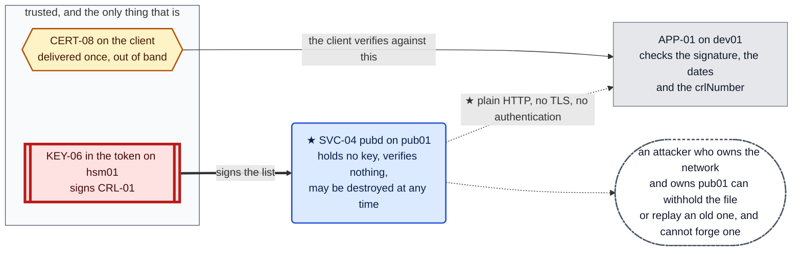
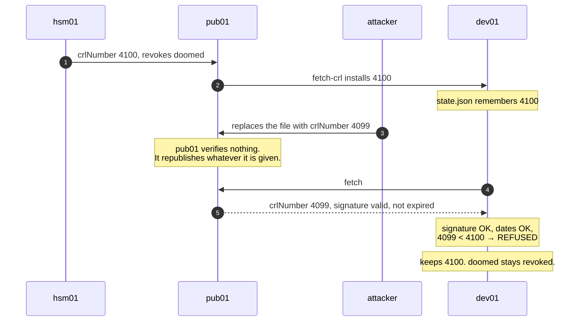

# Chapter 10 — Fetching, not copying

## The system before this chapter

Five machines. An offline root signs one intermediate and one revocation list; the intermediate
signs everything else and publishes its own list; `APP-01` checks both lists and refuses anything
the authority has taken back.

Chapter 09 built revocation and left it being carried by hand.

## The pressure

`OT-032`. The estate's revocation list is copied from machine to machine by a person, and it
expires.

That is two problems wearing one name. A file copied by hand is a file somebody forgets, which is
`OT-030` and `OT-031` and has been open since Chapter 05. A file that **expires** is different:
it does not sit there being slightly out of date, it stops working, and it stops working for
healthy certificates. Chapter 09 measured both halves. `error 12, CRL has expired` refuses
everything; a list that never arrived at all goes on trusting what the authority has already
withdrawn.

So the deadline is the new thing. The estate now has a clock running against it, and the only
mechanism for beating that clock is somebody remembering.

---

## 0. If your output differs

Serials, CRL numbers, dates and container IDs will differ. The PINs are unchanged: `4321` and
`8765` on `rootca`, `1357` and `2468` for `ica-token` on `hsm01`.

Work in this chapter's `lab/` folder:

```bash
cd "chapters/Chapter 10/lab"
ls
```

Expected: `docker-compose.yml`, and the directories `dev01/`, `db01/`, `ca01/`, `hsm01/`,
`rootca/` and `pub01/`.

### The lab in full

What **this** chapter writes is marked ★:

```
lab/
├── docker-compose.yml              ★ changed: pub01 added
├── dev01/
│   ├── Dockerfile                    Chapter 01
│   ├── entrypoint.sh                 Chapter 01
│   ├── initdb.sql                    Chapter 01
│   ├── fetch-crl.py                ★ new: what a client must check before it installs
│   ├── app/
│   │   ├── config.yaml             ★ changed: the CRL moves to agent-owned state
│   │   └── paymentsvc.py             Chapter 09
│   └── secretstore/
│       ├── secretstore.py            Chapter 03
│       ├── secretstore-set.py        Chapter 02
│       └── policy.json               Chapter 03
├── db01/
│   ├── Dockerfile                    Chapter 04
│   ├── entrypoint.sh                 Chapter 04
│   └── impostor.py                   Chapter 04
├── ca01/
│   ├── Dockerfile                    Chapter 07
│   ├── entrypoint.sh                 Chapter 07
│   └── request-cert.sh               Chapter 08
├── hsm01/
│   ├── Dockerfile                    Chapter 07
│   ├── entrypoint.sh                 Chapter 07
│   ├── hsm-init.sh                   Chapter 07
│   ├── ica-init.sh                   Chapter 08
│   ├── sign-leaf.sh                ★ changed: certificates say where their list lives
│   ├── signd.py                    ★ changed: a second listener, and a stated deviation
│   ├── stop-signd.sh                 Chapter 08
│   ├── policy.json                   Chapter 07
│   ├── ca.cnf                        Chapter 09
│   ├── crl-refresh.sh                Chapter 09
│   └── revoke-cert.sh                Chapter 09
├── rootca/
│   ├── Dockerfile                    Chapter 08
│   ├── entrypoint.sh                 Chapter 08
│   ├── root-init.sh                  Chapter 08
│   ├── sign-ca.sh                    Chapter 08
│   ├── root.cnf                      Chapter 09
│   └── root-crl.sh                   Chapter 09
└── pub01/                          ★ new: HOST-06
    ├── Dockerfile                  ★ new
    ├── entrypoint.sh               ★ new
    ├── pubd.py                     ★ new: SVC-04, and it verifies nothing on purpose
    └── pull-artifacts.py           ★ new
```

**Only `pub01` is built.** Everything else is deployed into a running container with `docker cp`.

### Before you start

`dev01` is built in Chapter 01, `db01` in Chapter 04, `ca01` in Chapter 05, `hsm01` in Chapter 07
and `rootca` in Chapter 08. **Building from here does not give you this chapter's starting
state.**

```bash
sudo docker start db01 ca01 hsm01 dev01
sudo docker exec dev01 grep -c "BEGIN X509 CRL" /opt/paymentsvc/crl.pem
sudo docker exec -u signd hsm01 grep -c "^R" /var/lib/ca/db/index.txt
sudo docker ps -a --filter name=rootca --format '{{.Names}}  {{.Status}}'
```

Expected: `2`, because Chapter 09 installed both lists; `1`, the certificate revoked in Chapter
09 §6; and `rootca  Exited`.

Then start the processes:

```bash
sudo docker exec dev01 sh -c '
  for i in $(seq 1 30); do pg_isready -q -h 127.0.0.1 -p 5432 && break; sleep 1; done
  pg_ctlcluster 15 main stop'
sudo docker exec -d -u secretstore dev01 \
    sh -c 'python3 /opt/secretstore/secretstore.py >>/var/log/secretstore.out 2>&1'
sleep 1
sudo docker exec -d -u paymentsvc dev01 \
    sh -c 'python3 /opt/paymentsvc/paymentsvc.py >>/var/log/paymentsvc.out 2>&1'
sudo docker exec -d -u signd hsm01 \
    sh -c 'python3 /usr/local/bin/signd >>/var/log/signd.out 2>&1'
sleep 2
curl -s http://127.0.0.1:8080/payments/1001/status
```

Expected: the payment record.

---

## 1. The authority has changed its mind and nobody told the client

Chapter 09 finished with a revoked certificate and a client that refuses it. Both of those are
still true, and neither is connected to the other by anything except a person.

Prove that by making the authority take something else back. Issue a throwaway certificate first,
so nothing that matters is harmed:

```bash
sudo docker exec -u signd hsm01 sh -c '
  openssl ecparam -name prime256v1 -genkey -noout -out /var/lib/ca/requests/temp.key
  openssl req -new -key /var/lib/ca/requests/temp.key \
      -out /var/lib/ca/requests/temp.csr -subj "/CN=temp.lab.simurgh.example"
  sign-leaf /var/lib/ca/requests/temp.csr temp.lab.simurgh.example' | head -4
```

Expected: `issued:` and `chain:` lines, and the certificate's subject and issuer.

Now revoke it:

```bash
sudo docker exec -u signd hsm01 \
    revoke-cert /var/lib/ca/issued/temp.lab.simurgh.example.crt superseded | tail -6
```

Expected: the republished list, and `revoked entries here: 2`.

The authority's opinion has changed. Ask both machines what they believe:

```bash
echo "--- what the authority publishes ---"
sudo docker exec -u signd hsm01 sh -c '
  openssl crl -in /var/lib/ca/ica-crl.pem -noout -crlnumber -lastupdate -nextupdate
  echo "entries: $(openssl crl -in /var/lib/ca/ica-crl.pem -noout -text | grep -c "Serial Number:")"'
echo "--- what the client believes ---"
sudo docker exec dev01 sh -c '
  openssl crl -in /opt/paymentsvc/crl.pem -noout -crlnumber -lastupdate -nextupdate
  echo "entries: $(openssl crl -in /opt/paymentsvc/crl.pem -noout -text | grep -c "Serial Number:")"'
```

Expected: two different `crlNumber` values and two different entry counts. The authority is at
`0x1002` with two revocations; the client is at `0x1001` with one.

**Nothing is broken and nothing will report a problem.** The client's list is validly signed, not
expired, and accepted by libpq without complaint. It is simply not current, and there is no
mechanism anywhere in this estate by which it could become current except somebody running
`docker cp`.

### 1.1 Count the work, then multiply it

```bash
sudo docker exec dev01 openssl crl -in /opt/paymentsvc/crl.pem -noout -nextupdate
```

Expected: a date about seven days after you ran Chapter 09.

That date is a deadline, and Chapter 09 measured what happens after it: `error 12, CRL has
expired`, and **every** certificate is refused, healthy ones included. So the estate's real
maintenance obligation is:

| | Today | With twenty clients |
|---|---|---|
| Files to copy | 1 | 20 |
| Deadline to beat | every 7 days | every 7 days |
| Places a mistake is invisible | 1 | 20 |
| Anything that reminds you | none | none |

The middle row is the one that does not improve. Copying is not slow, it is **unprompted**: no
component in this system knows when the file was last refreshed, and the failure arrives a week
after the omission with an error that names nothing.

**The fix is not a better copying procedure.** It is to reverse the direction. A client that
fetches knows when it last succeeded, can do it far more often than a human would, and fails in a
way it can report. Everything in this chapter follows from turning one arrow around.

---

## 2. What a client can safely fetch, and from whom

Reversing the arrow raises a question the estate has not had to answer before: if the CRL arrives
over the network, from a machine that might be lying, what stops the lie?

Take the three plausible answers in turn.

**"Fetch it over TLS."** This is the reflex and it is the wrong control. TLS would tell the
client which host it is talking to. It would not tell it whether the file is genuine, because the
host could be genuine and the file could still be wrong, and it would not tell it whether the
file is current, which is the failure that actually happens.

**"Only fetch from the authority."** This makes `hsm01` the machine every client in the estate
polls forever. The machine holding the signing key should be the one nothing has to reach.

**"Verify the file."** A CRL is signed by a key the client already trusts, carries a `crlNumber`,
and states its own validity period. All three properties travel **in the file**. A forger who
controls the entire network cannot produce one, cannot alter one, and cannot suppress one without
the client noticing that its copy is going stale.

The third is the answer, and it has a consequence worth stating plainly because it looks like
carelessness: **the transport does not need to be secure, and the publisher does not need to be
trusted.** That is what makes it possible to put the publication point on a machine that holds
nothing and can be destroyed at any time.

**Figure 10.1 — where the trust actually lives**



**Read the dotted line from `pub01` to the client, and then read the note.** The channel is
unprotected and the publisher is untrusted, and neither matters for forgery. What they do buy an
attacker is **withholding** and **replay**, and those are the two failures the rest of the
chapter is about.

---

## 3. The authority publishes

Something has to hand `pub01` the files. `SVC-03` already runs on `hsm01`, so it gains a second
listener, and this is a deviation from `D-054` that is worth arguing rather than hiding.

### 3.1 The deviation, stated

`D-054` says `hsm01` carries nothing a general purpose host carries. A second listening socket on
the machine that holds the key is exactly the sort of thing that decision exists to refuse.

The alternative was a shared volume between `hsm01` and `pub01`, and it is not available:
**adding a volume to a compose service makes `docker compose up` recreate the container**, and
recreating `hsm01` destroys `ica-token`, `KEY-06`, `CERT-09` and the register. There is no
ceremony to get those back that does not also produce a new intermediate.

So the deviation is taken deliberately and bounded three ways. The listener serves an
**allow-list of two filenames**, never a path the caller supplies. It has no write path. And
`pub01` exists precisely so that nothing except `pub01` ever has to reach it.

A real estate does this the other way around: the CA pushes its artefacts outward and runs no
inbound listener at all. `D-075`.

### 3.2 The listener

```python
#!/usr/bin/env python3
"""SVC-03 signd, the signing service on HOST-04 hsm01.

The token lives here and nothing else does. Callers send a certificate request
over mTLS and get a certificate back; the key never leaves this machine, and
after Chapter 07 it never leaves this machine's token either.

CHAPTER 08 CHANGES ALMOST NOTHING HERE, WHICH IS THE POINT. The key this
service signs with is now an intermediate rather than a root, and the code did
not need to know: sign-leaf changed a token label and this file gained one
field in its reply. What changed is what a compromise of this host costs. An
attacker who takes this machine can issue certificates under CERT-09 until
CERT-09 is replaced, and replacing it is a ceremony on a machine that is
switched off, which touches no client at all. Before Chapter 08 the same
attacker took the estate's trust anchor.

The one field is `chain`. A leaf signed by an intermediate does not verify
against the root on its own, so every reply now carries the issuer beside the
certificate. Callers that ignore it get a certificate that works nowhere, with
an error naming neither this service nor the missing file.

Three things this deliberately does, and one it deliberately does not.

DOES take the caller's identity from the TLS layer rather than from the request.
The client certificate is checked against CERT-05 by the kernel of the TLS
handshake before a single byte of the request body is read, and the name comes
out of that certificate. It is Chapter 03's SO_PEERCRED argument moved onto a
network: an observation, not a claim.

DOES consult POL-02 on every request. mTLS answers "did our authority sign your
certificate" and nothing else. Any holder of any certificate we ever issued can
open this connection, which is exactly what Chapter 07 section 5 demonstrates,
so authentication and authorization stay separate questions.

DOES record every decision, allowed or refused, with the identity the TLS layer
reported and the name that was requested. SVC-02 has done this since Chapter 02
and the authority has never done it at all.

DOES NOT hold the key. It shells out to sign-leaf, which asks the token. This
process could be compromised entirely and the attacker would gain the ability to
request signatures while this process lives, not a key they can keep.
"""
import http.server
import json
import os
import re
import ssl
import subprocess
import sys
import threading
import tempfile
import datetime

LISTEN = ("0.0.0.0", 8443)
CA_CRT = "/var/lib/ca/ca.crt"                 # CERT-08, the root we verify clients
                                              # against. Holds TWO roots during
                                              # the Chapter 08 overlap, because a
                                              # trust anchor is a bundle and not
                                              # a certificate. That is the fact
                                              # that made all three of this
                                              # build's root migrations survivable.
SRV_CRT = "/var/lib/ca/signd.crt"             # CERT-06 followed by CERT-09. This
                                              # file must hold the CHAIN, not the
                                              # leaf alone, or no client can build
                                              # a path from us to the root.
SRV_KEY = "/var/lib/ca/signd.key"
ICA_CRT = "/var/lib/ca/ica.crt"               # CERT-09, returned with every leaf
CRL = "/var/lib/ca/crl.pem"                   # CRL-01, both lists, public
PUBLIC_LISTEN = ("0.0.0.0", 8080)             # see PublicHandler
POLICY = "/etc/signd/policy.json"             # POL-02
AUDIT = "/var/log/signd-audit.log"

# A name we will sign for has to look like a hostname. This is not a security
# control, it is a guard against a malformed request becoming a malformed
# openssl invocation; POL-02 is the control.
NAME_RE = re.compile(r"^[a-z0-9]([a-z0-9-]*[a-z0-9])?(\.[a-z0-9]([a-z0-9-]*[a-z0-9])?)*$")


def audit(caller, requested, decision, detail=""):
    """Append one line per decision. Allowed and refused both, or the log only
    tells you about the requests that worked."""
    line = "\t".join([
        datetime.datetime.now(datetime.timezone.utc).strftime("%Y-%m-%dT%H:%M:%SZ"),
        f"caller={caller}", f"requested={requested}",
        f"decision={decision}", detail,
    ])
    with open(AUDIT, "a") as fh:
        fh.write(line + "\n")
    print(line, flush=True)


def load_policy():
    """Re-read on every request, so an edit takes effect on the next call.
    Inefficient and deliberate, exactly as POL-01 is in SVC-02."""
    with open(POLICY) as fh:
        return json.load(fh)


class Handler(http.server.BaseHTTPRequestHandler):
    server_version = "signd/1.0"

    def _json(self, code, obj):
        body = json.dumps(obj).encode()
        self.send_response(code)
        self.send_header("Content-Type", "application/json")
        self.send_header("Content-Length", str(len(body)))
        self.end_headers()
        self.wfile.write(body)

    def peer_name(self):
        """Who is calling, according to the certificate they proved they hold.

        getpeercert() returns the parsed client certificate. It is present only
        because the context was built with CERT_REQUIRED, so by the time this
        runs the chain has already been verified against CERT-05. Nothing here
        trusts anything the caller wrote in the request.
        """
        cert = self.connection.getpeercert()
        if not cert:
            return None
        for dns in [v for k, v in cert.get("subjectAltName", ()) if k == "DNS"]:
            return dns
        subject = dict(x[0] for x in cert.get("subject", ()))
        return subject.get("commonName")

    def do_POST(self):
        caller = self.peer_name() or "unknown"
        if self.path != "/v1/sign":
            return self._json(404, {"error": "not found"})

        length = int(self.headers.get("Content-Length") or 0)
        if length <= 0 or length > 16384:
            audit(caller, "-", "deny", "detail=bad request size")
            return self._json(400, {"error": "csr required, 16k max"})
        try:
            req = json.loads(self.rfile.read(length))
            csr, fqdn = req["csr"], req["fqdn"]
            extra = req.get("alt_names", [])
        except Exception:
            audit(caller, "-", "deny", "detail=malformed json")
            return self._json(400, {"error": "malformed request"})

        for name in [fqdn] + list(extra):
            if not isinstance(name, str) or not NAME_RE.match(name):
                audit(caller, fqdn, "deny", f"detail=bad name {name!r}")
                return self._json(400, {"error": f"not a hostname: {name}"})

        # POL-02. mTLS said who is calling. This says whether they may speak
        # for the name they are asking for, which is a different question and
        # the one Chapter 03 section 7.4 is about.
        allowed = load_policy().get(caller, [])
        if fqdn not in allowed:
            audit(caller, fqdn, "deny", "detail=POL-02 does not permit")
            return self._json(403, {
                "error": "denied", "you_are": caller, "requested": fqdn,
                "detail": "POL-02 does not permit this caller to request this name",
            })

        with tempfile.TemporaryDirectory() as tmp:
            path = os.path.join(tmp, "req.csr")
            with open(path, "w") as fh:
                fh.write(csr)
            # sign-leaf owns the token interaction. This process never sees a
            # key, and could not leak one if it were compromised.
            proc = subprocess.run(
                ["/usr/local/bin/sign-leaf", path, fqdn] + list(extra),
                capture_output=True, text=True)
            if proc.returncode != 0:
                audit(caller, fqdn, "error", f"detail=sign-leaf exit {proc.returncode}")
                return self._json(500, {"error": "signing failed"})
            issued = f"/var/lib/ca/issued/{fqdn}.crt"
            with open(issued) as fh:
                cert = fh.read()

        # The issuer travels with the certificate. It is public, it is the
        # same bytes for every caller, and sending it is the difference
        # between a certificate that works and one that fails at whichever
        # client is unlucky enough to be first.
        with open(ICA_CRT) as fh:
            chain = fh.read()

        audit(caller, fqdn, "allow", f"detail=issued {fqdn}")
        return self._json(200, {"certificate": cert, "chain": chain,
                                "issued_for": fqdn})

    def do_GET(self):
        if self.path == "/healthz":
            return self._json(200, {"status": "ok"})
        return self._json(404, {"error": "not found"})

    def log_message(self, *args):
        """Silence the default access log. Everything that matters goes through
        audit(), which records the verified identity rather than an IP."""
        return


class PublicHandler(http.server.BaseHTTPRequestHandler):
    """Serves the artefacts that are public by construction, over plain HTTP.

    WHY THIS IS NOT ON THE mTLS LISTENER. A client needs CERT-08 and CRL-01 in
    order to verify anybody, including us. Requiring a verified connection to
    collect the things you need in order to verify is a bootstrap that does not
    close. So these are served unauthenticated.

    WHY PLAIN HTTP IS NOT A MISTAKE. Every file here is signed by a key the
    client already trusts, carries a serial or a crlNumber, and has dates in
    it. A forger gains nothing from controlling the channel because they cannot
    produce a signature. Verifying the transport would be a second and weaker
    control than verifying the content, and it would tempt a client into
    skipping the check that actually matters.

    WHAT IT IS NOT SAFE AGAINST is replay: an authentic OLD file, served by
    anybody. That is not fixable here, at the source, because the file is
    genuine. It is fixed at the client, which remembers the highest crlNumber
    it has installed and refuses to go backwards.

    THE DEVIATION, STATED. D-054 says hsm01 carries nothing a general purpose
    host carries, and this is a second listening socket on the machine that
    holds the key. A real estate has the CA push its artefacts outward and run
    no inbound listener at all. This one cannot: adding a shared volume to this
    service would make compose recreate the container, and recreating it
    destroys ica-token and everything Chapter 08 and 09 built inside it. The
    surface is one GET over an allow-list of two filenames, and pub01 exists so
    that nothing except pub01 ever needs to reach it.
    """

    server_version = "signd-public/1.0"

    # An allow-list, not a directory. Serving a path the caller supplies is how
    # a static file server becomes a way to read /var/lib/ca/ica-pin.
    FILES = {
        "/crl.pem": (CRL, "application/x-pem-file"),
        "/ca-bundle.pem": (None, "application/x-pem-file"),  # assembled below
    }

    def _send(self, code, body, ctype="text/plain"):
        if isinstance(body, str):
            body = body.encode()
        self.send_response(code)
        self.send_header("Content-Type", ctype)
        self.send_header("Content-Length", str(len(body)))
        self.end_headers()
        self.wfile.write(body)

    def do_GET(self):
        if self.path not in self.FILES:
            return self._send(404, "not found\n")
        path, ctype = self.FILES[self.path]
        try:
            if self.path == "/ca-bundle.pem":
                # Assembled on every request rather than cached, so it cannot
                # be stale. Two certificates: the anchor, and the intermediate
                # a client needs in order to check the intermediate's own CRL.
                with open(CA_CRT) as fh:
                    body = fh.read()
                with open(ICA_CRT) as fh:
                    body += fh.read()
            else:
                with open(path) as fh:
                    body = fh.read()
        except OSError as exc:
            audit("public", self.path, "error", f"detail={exc}")
            return self._send(503, "not available yet\n")
        return self._send(200, body, ctype)

    def do_POST(self):
        return self._send(405, "read only\n")

    do_PUT = do_DELETE = do_POST

    def log_message(self, *args):
        return


def main():
    ctx = ssl.SSLContext(ssl.PROTOCOL_TLS_SERVER)
    ctx.load_cert_chain(SRV_CRT, SRV_KEY)
    ctx.load_verify_locations(CA_CRT)
    # Without this line the service would accept anyone and read a name out of
    # nothing. With it, the handshake fails before do_POST is ever entered.
    ctx.verify_mode = ssl.CERT_REQUIRED
    ctx.minimum_version = ssl.TLSVersion.TLSv1_2

    # The public listener runs in a daemon thread beside the mTLS one. It is
    # started first so that a client polling for the CRL gets an answer even
    # while the signing side is still coming up.
    pub = http.server.ThreadingHTTPServer(PUBLIC_LISTEN, PublicHandler)
    threading.Thread(target=pub.serve_forever, daemon=True).start()
    print(f"signd public artefacts on {PUBLIC_LISTEN[0]}:{PUBLIC_LISTEN[1]}, "
          "no authentication, read only", flush=True)

    srv = http.server.ThreadingHTTPServer(LISTEN, Handler)
    srv.socket = ctx.wrap_socket(srv.socket, server_side=True)
    print(f"signd listening on {LISTEN[0]}:{LISTEN[1]}, mTLS required", flush=True)
    srv.serve_forever()


if __name__ == "__main__":
    sys.exit(main())
```

Deploy it and restart the service:

```bash
sudo docker cp hsm01/signd.py hsm01:/usr/local/bin/signd
sudo docker exec hsm01 chmod 0755 /usr/local/bin/signd
sudo docker exec -u signd hsm01 stop-signd
sudo docker exec -d -u signd hsm01 \
    sh -c 'python3 /usr/local/bin/signd >>/var/log/signd.out 2>&1'
sleep 1
sudo docker exec -u signd hsm01 tail -2 /var/log/signd.out
```

Expected:

```
signd public artefacts on 0.0.0.0:8080, no authentication, read only
signd listening on 0.0.0.0:8443, mTLS required
```

Check it from `ca01`, which is the only machine in the lab with `curl`:

```bash
sudo docker exec ca01 sh -c '
  echo "--- the CRL ---"
  curl -sS http://hsm01.lab.simurgh.example:8080/crl.pem | grep -c "BEGIN X509 CRL"
  echo "--- the bundle ---"
  curl -sS http://hsm01.lab.simurgh.example:8080/ca-bundle.pem | grep -c "BEGIN CERTIFICATE"
  echo "--- anything else ---"
  curl -sS -o /dev/null -w "%{http_code}\n" http://hsm01.lab.simurgh.example:8080/ica-pin
  echo "--- writing ---"
  curl -sS -o /dev/null -w "%{http_code}\n" -X POST http://hsm01.lab.simurgh.example:8080/crl.pem'
```

Expected: `2`, `2`, `404`, `405`.

**`404` on `/ica-pin` is not a coincidence and not a filter.** The handler holds a dictionary of
two names and looks the request up in it. There is no code path that joins a caller's string onto
a directory, which is how a static file server becomes a way to read a PIN.

**And `ca-bundle.pem` is assembled on every request** rather than written to disk, so it cannot
be stale. It is `CERT-08` followed by `CERT-09`: the anchor, and the intermediate a client needs
in order to check the intermediate's own list.

---

## 4. `HOST-06 pub01`, the machine that holds nothing

### 4.1 Why a sixth machine

`hsm01` could serve every client directly. The reason it should not is not secrecy, since the
files are public. It is that a publication point is read by every client in the estate, on a
timer, forever, and that traffic should not land on the machine holding the signing key.

`pub01` is the first machine in this build whose compromise costs nothing. It has no key, no
certificate, no PIN, no token and no anchor. An attacker who owns it completely can withhold
files and replay old ones, which are exactly the two things `§2` established that no publisher
can be prevented from doing anyway.

That is why it can be thrown away and rebuilt in a minute with no ceremony, and it is the whole
argument for separating publication from signing.

```dockerfile
# HOST-06 pub01, the publication point.
#
# The smallest machine in the build, and the first one whose compromise costs
# nothing at all. It holds no key, no certificate, no PIN and no token. Every
# file it serves is public by construction and signed by somebody else.
#
# WHY IT EXISTS, given that hsm01 already serves these files. So that nothing
# except this machine ever has to reach hsm01. A publication point is read by
# every client in the estate, on a schedule, forever; the machine holding the
# signing key should not be the one absorbing that. In a real estate this is a
# CDN or a bucket, and the CA pushes to it and runs no listener at all.
#
# WHY IT VALIDATES NOTHING. It is a cache. If it checked signatures, somebody
# would eventually rely on the fact that it checked, and the whole design rests
# on clients verifying content rather than trusting a channel or a host. A
# publication point that is trusted is a publication point that has to be
# secured; this one does not, which is why it can be thrown away and rebuilt at
# any time without a ceremony.
FROM debian:12-slim

ENV DEBIAN_FRONTEND=noninteractive

# python3 for the two scripts, ca-certificates because Debian is unhappy
# without it. No openssl: this machine has no reason to inspect what it
# serves, and not installing the tool is the clearest way to say so.
RUN apt-get update \
 && apt-get install -y --no-install-recommends \
      python3 \
      ca-certificates \
 && rm -rf /var/lib/apt/lists/*

# ACC-11. Runs SVC-04 and owns what it publishes. It cannot write to the
# scripts it runs, which is the same split every other service here has.
RUN useradd --system --home-dir /srv/pub --shell /usr/sbin/nologin pub

# /srv/pub is world readable on purpose. Everything in it is public: a
# revocation list, a root certificate and an intermediate. A file mode
# protecting a published certificate would be a mode protecting nothing while
# suggesting otherwise.
RUN mkdir -p /srv/pub \
 && chown -R pub:pub /srv/pub \
 && chmod 0755 /srv/pub \
 && touch /var/log/pubd.out /var/log/pull-artifacts.out \
 && chown pub:pub /var/log/pubd.out /var/log/pull-artifacts.out \
 && chmod 0644 /var/log/pubd.out /var/log/pull-artifacts.out

# Both log files exist and are owned before anything starts, because the
# shell performs `>>/var/log/...` as the unprivileged user and /var/log is
# root owned. Chapter 01, Chapter 02 section 4.4 and Chapter 07 all lost time
# to this; it is written into the image here so a fourth chapter does not.

COPY pubd.py            /usr/local/bin/pubd
COPY pull-artifacts.py  /usr/local/bin/pull-artifacts
COPY entrypoint.sh      /usr/local/bin/entrypoint.sh

RUN chmod 0755 /usr/local/bin/pubd /usr/local/bin/pull-artifacts \
               /usr/local/bin/entrypoint.sh

ENTRYPOINT ["/usr/local/bin/entrypoint.sh"]
```

```sh
#!/bin/sh
set -e

# Sleeps, like every other machine here, and for the ordinary reason: the
# processes on it are started by hand because this build has no service
# manager on any host. OT-009, on a sixth machine.
#
# Two things will be started on this one: pubd, which serves /srv/pub, and
# pull-artifacts, which fills it. Neither is running yet, and a container
# reporting healthy while serving nothing is exactly the shape Chapter 08
# section 0 warns about.

exec sleep infinity
```

The compose file gains one service. Everything above it is unchanged from Chapter 08:

```yaml
# The lab substrate: one container per "machine" in the ledger.
#
# Bring each machine up ONCE, in the chapter that introduces it, naming the
# service so you only build that one:
#     Chapter 01:  docker compose up -d --build dev01
#     Chapter 04:  docker compose up -d --build db01
#     Chapter 05:  docker compose up -d --build ca01
#     Chapter 06:  docker compose up -d --build ca01   (rebuild: ca01 gains a token)
#     Chapter 07:  docker compose up -d --build hsm01
#                  and rebuild ca01, which loses it again
#     Chapter 08:  docker compose up -d --build rootca
#                  then STOP it again, which is the whole point of it
#     Chapter 10:  docker compose up -d --build pub01
#
# After that, chapters deploy into the running container with `docker cp`.
# Rebuilding is not forbidden, it is a reset: a rebuilt dev01 starts from
# Chapter 01's image again and loses everything the later chapters built
# inside it, which is OS accounts, file modes, database rows and some
# deliberately left log lines. If you do rebuild, you are starting the lab
# over and need to work the chapters forward again.
#
# This file is identical in every chapter's lab/ folder until a chapter
# adds a machine, so `docker compose up -d` from any of them is a no-op on
# a lab that is already running.
#
# Processes inside the containers are still started by hand. That is not an
# oversight: these hosts have no service manager, and giving them one is a
# chapter of its own.

name: lab

services:
  dev01:                                    # HOST-01, where the app and the secret store live
    build:
      context: ./dev01
      dockerfile: Dockerfile
    image: ksm/dev01:chapter01              # named for the chapter that builds it
    container_name: dev01
    hostname: dev01.lab.simurgh.example

    # Published on the laptop's loopback only, never on the network. The
    # difference between 127.0.0.1:8080:8080 and 8080:8080 is the difference
    # between a service your laptop can reach and one the coffee shop can.
    ports:
      - "127.0.0.1:8080:8080"

    # tcpdump needs this to put an interface into the mode it wants.
    cap_add:
      - NET_ADMIN

    # Reap zombies and forward signals. The entrypoint ends in
    # `sleep infinity`, which is not a real init.
    init: true

    # Substrate only: reports, gates nothing.
    healthcheck:
      test: ["CMD", "pg_isready", "-q", "-h", "127.0.0.1", "-p", "5432"]
      interval: 10s
      timeout: 3s
      retries: 5
      start_period: 20s

    stop_grace_period: 5s

  db01:                                     # HOST-02, the database, added in Chapter 04
    build:
      context: ./db01
      dockerfile: Dockerfile
    image: ksm/db01:chapter04
    container_name: db01
    hostname: db01.lab.simurgh.example

    # The name the certificate is issued for, and the name APP-01 connects
    # to. Compose resolves the service name `db01` by default; this alias
    # adds the fully qualified name so `sslmode=verify-full` has something
    # to match against.
    networks:
      default:
        aliases:
          - db01.lab.simurgh.example

    # No `ports:` at all. The database is reachable from dev01 across the
    # lab network and from nowhere else. Chapter 01 published 8080 because
    # you need to curl it; nothing outside the lab has any business
    # reaching 5432.

    cap_add:
      - NET_ADMIN

    init: true

    healthcheck:
      test: ["CMD", "pg_isready", "-q", "-h", "127.0.0.1", "-p", "5432"]
      interval: 10s
      timeout: 3s
      retries: 5
      start_period: 20s

    stop_grace_period: 5s

  ca01:                                     # HOST-03, the certificate authority, added in Chapter 05
    build:
      context: ./ca01
      dockerfile: Dockerfile
    image: ksm/ca01:chapter07
    container_name: ca01
    hostname: ca01.lab.simurgh.example

    # No ports, and no network alias. Nothing connects to this machine.
    # An authority that answers requests is a service with an attack
    # surface and an issuance policy; this one is a key, a procedure and
    # an operator, which is all OT-017 asked for. When something needs to
    # request a certificate without a human, that is its own chapter.

    init: true

    # No healthcheck. There is no process to be healthy: the CA is files
    # on a disk and a script somebody runs. `docker compose ps` will show
    # it as running because the entrypoint sleeps, and that is the whole
    # truth about it.

    stop_grace_period: 5s

  hsm01:                                    # HOST-04, the machine that holds the key, added in Chapter 07
    build:
      context: ./hsm01
      dockerfile: Dockerfile
    image: ksm/hsm01:chapter07
    container_name: hsm01
    hostname: hsm01.lab.simurgh.example

    # The name SVC-03's certificate is issued for, and the name ca01 dials.
    # verify-full on the client needs these to be the same string, which is
    # the lesson Chapter 05 section 6 paid for.
    networks:
      default:
        aliases:
          - hsm01.lab.simurgh.example

    # No ports. SVC-03 listens on 8443 and is reachable from the lab network
    # and from nowhere else. Nothing outside the lab has any business
    # reaching the machine that signs certificates, and OT-024 is the
    # observation that "the lab network" is still far too many things.

    init: true

    # No healthcheck. SVC-03 is started by hand like every other process in
    # this build, so a healthcheck would report on a service that is usually
    # not running yet and tell you nothing. OT-009, on a fourth machine.

    stop_grace_period: 5s

  pub01:                                    # HOST-06, the publication point, added in Chapter 10
    build:
      context: ./pub01
      dockerfile: Dockerfile
    image: ksm/pub01:chapter10
    container_name: pub01
    hostname: pub01.lab.simurgh.example

    # The name every client fetches from. It goes into the
    # crlDistributionPoints extension of certificates issued from Chapter 10
    # on, so a new client is told where to look by the certificate itself
    # rather than by a runbook.
    networks:
      default:
        aliases:
          - pub01.lab.simurgh.example

    # No `ports:`. Everything that reads this is inside the lab. A real
    # publication point IS reachable from outside, because certificates issued
    # to public names carry a public URL, and that is the one respect in which
    # this machine is not like its real counterpart.

    init: true

    # No healthcheck, for the reason every other service here has none: pubd
    # is started by hand. Note that pubd's own /healthz reports on the FILES
    # rather than on the process, because a publication point answering `ok`
    # while serving nothing is precisely the failure it exists to avoid.

    stop_grace_period: 5s

  rootca:                                   # HOST-05, the offline root, added in Chapter 08
    build:
      context: ./rootca
      dockerfile: Dockerfile
    image: ksm/rootca:chapter08
    container_name: rootca
    hostname: rootca.lab.simurgh.example

    # THE IMPORTANT LINE IN THIS FILE.
    #
    # network_mode: none gives this container a loopback interface and
    # nothing else. It is not on the lab network, it has no address there,
    # it cannot resolve db01 or hsm01 and they cannot reach it. Compare
    # ca01, which has no `ports:` and is still on the network with everyone
    # else; that is a machine nobody happens to dial, and this is a machine
    # nobody can.
    #
    # Note that it therefore cannot have a `networks:` key. The two are
    # mutually exclusive, and compose will refuse the file if both appear.
    #
    # The build itself needs the network, to fetch packages. That is not a
    # contradiction, it is the ordinary shape of the thing: a machine is
    # provisioned once with a network and then runs without one, and the
    # window in which it was reachable is a window worth being aware of.
    network_mode: "none"

    # No restart policy, and D-033 is not the reason this time. Every other
    # machine here has none because service management is a chapter of its
    # own. This one must not have one, because its correct steady state is
    # `Exited` and a restart policy would fight the ceremony that stops it.
    #
    # There is no `docker compose up` for this machine in normal operation.
    # It is started by PROC-04 and stopped by PROC-04.

    init: true

    stop_grace_period: 5s
```

**`pub01` has a network alias and no `ports:`.** The alias is the name that goes into every
certificate's distribution point from `§8` onward, so a client is told where to look by the
certificate rather than by a runbook. The absence of `ports:` is the one respect in which this
machine is unlike its real counterpart: a real publication point is reachable from outside,
because certificates issued to public names carry public URLs.

### 4.2 `SVC-04 pubd`

```python
#!/usr/bin/env python3
"""SVC-04 pubd, the publication point on HOST-06 pub01.

Serves the contents of /srv/pub over plain HTTP and does nothing else. No
authentication, no TLS, no write path, and no opinion about what it is
serving.

THREE THINGS IT DELIBERATELY DOES NOT DO.

DOES NOT verify anything. Every file here is signed by an authority the client
already trusts, so the client checks it. If this service checked too, somebody
would eventually rely on the fact that it checked, and a publication point that
is trusted is a publication point that has to be defended. This one does not:
it can be destroyed and rebuilt in a minute with no ceremony, which is the
property that makes it a safe place to absorb every client's polling.

DOES NOT serve TLS. The reflex is that everything should be encrypted, and here
it buys nothing. A CRL is signed, numbered and dated. An attacker who controls
the channel cannot forge one, cannot alter one, and cannot strip one without the
client noticing that its file has stopped arriving. What they CAN do is replay
an old and genuine list, and TLS would not stop that either, because the file
would be authentic. That is fixed at the client with crlNumber, not here.

DOES NOT accept writes. pull-artifacts puts files here by writing to the
filesystem as ACC-11. There is no upload endpoint, so there is no upload
endpoint to get wrong.

WHAT IT IS FOR. Nothing in the estate should have to reach hsm01 to collect a
public file. Every client polls this instead, forever, and the machine holding
the signing key never sees them.
"""
import http.server
import os
import sys

LISTEN = ("0.0.0.0", 80)
ROOT = "/srv/pub"

# An allow-list of names, not a directory listing and not a path the caller
# supplies. `GET /../../etc/shadow` is the oldest bug in static file serving,
# and the way not to have it is to never join a caller's string onto a path.
FILES = {
    "/crl.pem": "crl.pem",
    "/ca-bundle.pem": "ca-bundle.pem",
}


class Handler(http.server.BaseHTTPRequestHandler):
    server_version = "pubd/1.0"

    def _send(self, code, body, ctype="text/plain"):
        if isinstance(body, str):
            body = body.encode()
        self.send_response(code)
        self.send_header("Content-Type", ctype)
        self.send_header("Content-Length", str(len(body)))
        # A client that caches a CRL past its nextUpdate stops verifying
        # anything, so say plainly that this is not to be cached.
        self.send_header("Cache-Control", "no-store")
        self.end_headers()
        self.wfile.write(body)

    def do_GET(self):
        if self.path == "/healthz":
            # Reports on the files, not on the process. A publication point
            # that answers "ok" while serving nothing is the Chapter 08
            # /healthz defect, and this service exists to be polled.
            present = {n: os.path.getsize(os.path.join(ROOT, f))
                       for n, f in FILES.items()
                       if os.path.exists(os.path.join(ROOT, f))}
            if len(present) != len(FILES):
                return self._send(503, f"missing: "
                                       f"{sorted(set(FILES) - set(present))}\n")
            return self._send(200, "".join(f"{n} {s} bytes\n"
                                           for n, s in sorted(present.items())))

        name = FILES.get(self.path)
        if name is None:
            return self._send(404, "not found\n")
        path = os.path.join(ROOT, name)
        try:
            with open(path, "rb") as fh:
                body = fh.read()
        except OSError:
            # Nothing has been published yet, or the pull is mid-flight. 503
            # rather than 404: the resource exists, this server just cannot
            # hand it over, and a client should retry rather than conclude the
            # URL is wrong.
            return self._send(503, "not published yet\n")
        if not body:
            return self._send(503, "published file is empty\n")
        return self._send(200, body, "application/x-pem-file")

    def do_POST(self):
        return self._send(405, "read only\n")

    do_PUT = do_DELETE = do_PATCH = do_POST

    def log_message(self, fmt, *args):
        print(f"{self.address_string()} {fmt % args}", flush=True)


def main():
    if not os.path.isdir(ROOT):
        print(f"pubd: {ROOT} does not exist", file=sys.stderr)
        return 1
    srv = http.server.ThreadingHTTPServer(LISTEN, Handler)
    print(f"pubd serving {ROOT} on {LISTEN[0]}:{LISTEN[1]}, read only, no TLS",
          flush=True)
    srv.serve_forever()
    return 0


if __name__ == "__main__":
    sys.exit(main())
```

**It validates nothing, and that is a decision rather than an omission.** If `pubd` checked
signatures, somebody would eventually rely on the fact that it checked, and a publication point
that is trusted is a publication point that has to be defended. `D-074`.

**Its `/healthz` reports on the files rather than on the process**, which Chapter 08 §10 is the
reason for. A publication point answering `ok` while serving nothing is precisely the failure it
exists to avoid.

### 4.3 `pull-artifacts`

```python
#!/usr/bin/env python3
"""Fill /srv/pub from the authority. Run as ACC-11 on HOST-06 pub01.

    pull-artifacts --from http://hsm01.lab.simurgh.example:8080 [--once]

Fetches the public artefacts from SVC-03 and writes them where pubd serves
them. That is the whole job.

WHAT IT DOES NOT CHECK, AND WHY THAT IS THE DESIGN. It does not verify a
signature, an issuer, a date or a crlNumber. It cannot: this machine holds no
anchor and is not trusted by anybody. If it validated, the estate would grow a
second opinion about what is current, and two opinions that can disagree are
worse than one. The client verifies. This moves bytes.

THE ONE THING IT IS CAREFUL ABOUT is not making things worse. A fetch that
fails must leave the previously published file exactly where it was, because a
client that finds a truncated CRL turns revocation checking off without saying
so, which Chapter 09 section 8 measured. So every write is to a temporary file
in the same directory followed by an atomic rename, and a failed fetch writes
nothing at all.

Serving yesterday's list is a known and bounded problem: it expires, and the
client refuses it. Serving half a list is an unbounded one: the client stops
checking. When those are the two options, keep the old file.
"""
import argparse
import os
import sys
import tempfile
import time
import urllib.request
from datetime import datetime, timezone

ROOT = "/srv/pub"
ARTEFACTS = ["crl.pem", "ca-bundle.pem"]


def stamp():
    return datetime.now(timezone.utc).strftime("%Y-%m-%dT%H:%M:%SZ")


def fetch_one(base, name):
    """Return (changed, message). Never raises, never leaves a partial file."""
    url = f"{base.rstrip('/')}/{name}"
    try:
        with urllib.request.urlopen(url, timeout=15) as resp:
            if resp.status != 200:
                return False, f"{name}: upstream said {resp.status}, keeping what we have"
            body = resp.read()
    except Exception as exc:
        return False, f"{name}: {exc}, keeping what we have"

    if not body.strip():
        return False, f"{name}: upstream served an empty file, keeping what we have"

    dest = os.path.join(ROOT, name)
    try:
        with open(dest, "rb") as fh:
            if fh.read() == body:
                return False, f"{name}: unchanged, {len(body)} bytes"
    except OSError:
        pass

    # Same directory, so the rename is atomic. A client reading mid-write would
    # otherwise get a parse error, and to a verifier failing closed a parse
    # error is an outage.
    try:
        with tempfile.NamedTemporaryFile("wb", dir=ROOT, delete=False) as tmp:
            tmp.write(body)
            staged = tmp.name
        os.chmod(staged, 0o644)
        os.replace(staged, dest)
    except OSError as exc:
        return False, f"{name}: cannot publish: {exc}"
    return True, f"{name}: published, {len(body)} bytes"


def main():
    ap = argparse.ArgumentParser()
    ap.add_argument("--from", dest="base", required=True)
    ap.add_argument("--interval", type=int, default=300,
                    help="seconds between polls. Not a schedule: this process "
                         "is started by hand like everything else here, and if "
                         "nobody starts it nothing is published. OT-009")
    ap.add_argument("--once", action="store_true")
    args = ap.parse_args()

    if not os.path.isdir(ROOT):
        print(f"pull-artifacts: {ROOT} does not exist", file=sys.stderr)
        return 1

    while True:
        for name in ARTEFACTS:
            changed, msg = fetch_one(args.base, name)
            print(f"{stamp()}  {'*' if changed else ' '} {msg}", flush=True)
        if args.once:
            return 0
        time.sleep(args.interval)


if __name__ == "__main__":
    sys.exit(main())
```

**The one thing it is careful about is not making things worse.** Every write is a temporary file
in the same directory followed by an atomic rename, and a failed fetch writes nothing at all.

Serving yesterday's list is a bounded problem: it expires, and the client refuses it. Serving
half a list is unbounded: Chapter 09 §8 measured that a client with an unusable CRL turns
revocation checking off and connects. When those are the two options, keep the old file.

### 4.4 Build it and fill it

```bash
sudo docker compose up -d --build pub01
sudo docker exec -d -u pub pub01 sh -c 'python3 /usr/local/bin/pubd >>/var/log/pubd.out 2>&1'
sleep 1
sudo docker exec -u pub pub01 \
    pull-artifacts --from http://hsm01.lab.simurgh.example:8080 --once
```

Expected:

```
<timestamp>  * crl.pem: published, NNN bytes
<timestamp>  * ca-bundle.pem: published, NNN bytes
```

Name the service in the build, as always. An unnamed `--build` rebuilds every machine and resets
the lab.

Check what it serves, from `ca01`:

```bash
sudo docker exec ca01 sh -c '
  curl -sS http://pub01.lab.simurgh.example/healthz
  curl -sS -o /dev/null -w "traversal: %{http_code}\n" \
      http://pub01.lab.simurgh.example/../../etc/passwd
  curl -sS -o /dev/null -w "write:     %{http_code}\n" \
      -X POST http://pub01.lab.simurgh.example/crl.pem'
```

Expected: two lines naming the files and their sizes, then `traversal: 404` and `write: 405`.

**Leave it on `--once` for now.** `pull-artifacts` is meant to run on a loop, and the loop is
started in `§15`, at the end, deliberately.

`§5` to `§7` break the publication point on purpose, and a poller doing its job repairs the
damage within a minute. That is correct behaviour and it makes three demonstrations impossible to
observe: you sabotage `/srv/pub`, read the next paragraph, and by the time you run the command
the estate has healed itself and the output is the one from before the sabotage.

**If you have already started the loop**, stop it. `pub01` has no `procps`, so there is no
`pkill` here, and the way to stop a process on a machine that holds nothing is to stop the
machine:

```bash
sudo docker restart pub01
sudo docker exec -d -u pub pub01 sh -c 'python3 /usr/local/bin/pubd >>/var/log/pubd.out 2>&1'
sleep 1
sudo docker exec -u pub pub01 \
    pull-artifacts --from http://hsm01.lab.simurgh.example:8080 --once
sudo docker exec ca01 curl -sS http://pub01.lab.simurgh.example/healthz
```

Expected: two published lines, then two lines naming the files and their sizes. `pubd` is serving
again and nothing is polling.

**That `docker restart` is worth a moment rather than a skim.** On `hsm01` it would be
unthinkable: restarting the container that holds the token is how you lose `KEY-06` and every
certificate under it. Here it costs nothing, takes a second, and needs no ceremony. That
difference is the entire argument for `HOST-06` existing.

---

## 5. Make it fail: the obvious client

The client side looks like one line, and every estate writes it at least once:

```bash
sudo docker exec dev01 sh -c '
  cp /opt/paymentsvc/crl.pem /opt/paymentsvc/crl.pem.keep
  curl -sS -o /opt/paymentsvc/crl.pem http://pub01.lab.simurgh.example/crl.pem
  openssl crl -in /opt/paymentsvc/crl.pem -noout -crlnumber'
```

Expected: `crlNumber=0x1002`. It worked. The client is now current, `§1`'s gap is closed, and
this chapter could be four sections long.

Now run it while the publication point is having a bad day. Not down, which would be obvious.
Answering:

```bash
sudo docker exec -u pub pub01 sh -c 'mv /srv/pub/crl.pem /srv/pub/crl.pem.keep'
sudo docker exec dev01 sh -c '
  curl -sS -o /opt/paymentsvc/crl.pem http://pub01.lab.simurgh.example/crl.pem
  echo "curl exit: $?"
  ls -l /opt/paymentsvc/crl.pem
  cat /opt/paymentsvc/crl.pem'
```

Expected:

```
curl exit: 0
-rw-r--r-- 1 paymentsvc paymentsvc 18 ... /opt/paymentsvc/crl.pem
not published yet
```

**Read the exit code first.** `curl` reported success. It then wrote `pubd`'s `503` body into the
file, on top of a working revocation list, and said nothing about it.

That is not a bug in `curl`. Without `--fail` it treats an HTTP error as a response like any
other: there were bytes, it was asked to put bytes in a file, and it did. The estate's revocation
list is now the string `not published yet`.

Ask the application what it makes of that:

```bash
sudo docker exec dev01 pkill -f 'python3 /opt/paymentsvc/paymentsvc.py' || true
sudo docker exec -d -u paymentsvc dev01 \
    sh -c 'python3 /opt/paymentsvc/paymentsvc.py >>/var/log/paymentsvc.out 2>&1'
sleep 2
sudo docker exec dev01 tail -2 /var/log/paymentsvc.out
```

Expected:

```
sslcrl is set to /opt/paymentsvc/crl.pem, which openssl cannot parse. Refusing to start.
```

**That check was written in Chapter 09 §8 for a failure nobody had automated yet.** Without it,
libpq would have loaded nothing, turned revocation checking off, and the application would be
running now, reporting healthy, checking nothing.

### 5.1 `--fail` fixes one case and not the one that matters

The obvious repair is to tell `curl` that an HTTP error is an error:

```bash
sudo docker exec dev01 sh -c '
  cp /opt/paymentsvc/crl.pem.keep /opt/paymentsvc/crl.pem
  curl -sS --fail -o /opt/paymentsvc/crl.pem http://pub01.lab.simurgh.example/crl.pem
  echo "curl exit: $?"
  openssl crl -in /opt/paymentsvc/crl.pem -noout -crlnumber'
```

Expected: `curl exit: 22`, and the previous `crlNumber` intact. Better. The live file survived
because `curl` refused to write a response it had been told to reject.

Now consider what `--fail` cannot see. Restore the publication point, then damage what it serves
rather than how it answers:

```bash
sudo docker exec -u pub pub01 sh -c '
  mv /srv/pub/crl.pem.keep /srv/pub/crl.pem
  cp /srv/pub/crl.pem /srv/pub/crl.pem.keep
  head -c 200 /srv/pub/crl.pem.keep > /srv/pub/crl.pem'
sudo docker exec dev01 sh -c '
  curl -sS --fail -o /opt/paymentsvc/crl.pem http://pub01.lab.simurgh.example/crl.pem
  echo "curl exit: $?"
  ls -l /opt/paymentsvc/crl.pem
  grep -c "BEGIN X509 CRL" /opt/paymentsvc/crl.pem'
```

Expected: `curl exit: 0`, a file of about 200 bytes, and `1`.

**A `200 OK` carrying half a file is a successful download.** `--fail` inspects the status line
and nothing else, so a truncated, corrupted or simply wrong body is delivered and installed. The
estate now holds one list where it needs two, which Chapter 09 measured as libpq refusing
**every** certificate, healthy ones included.

Three failure modes, and the tool catches one:

| What happens | `curl -o` | `curl --fail -o` | What the client needs |
|---|---|---|---|
| Connection refused, DNS failure | exits non-zero, file intact | same | nothing more |
| Server answers `503` | **exit 0, file destroyed** | exits 22, file intact | `--fail` |
| Server answers `200` with a bad body | **exit 0, file destroyed** | **exit 0, file destroyed** | check the content |

**Automating a bad procedure does not make it slightly worse.** A human copying a file is present
when it goes wrong. A timer does the same thing at three in the morning with nobody watching, and
does it again an hour later. Automation does not reduce mistakes, it removes the observer, so a
procedure that fails quietly must be made loud **before** it is put on a schedule.

Put everything back:

```bash
sudo docker exec -u pub pub01 sh -c 'mv /srv/pub/crl.pem.keep /srv/pub/crl.pem'
sudo docker exec dev01 sh -c 'mv /opt/paymentsvc/crl.pem.keep /opt/paymentsvc/crl.pem'
sudo docker exec dev01 pkill -f 'python3 /opt/paymentsvc/paymentsvc.py' || true
sudo docker exec -d -u paymentsvc dev01 \
    sh -c 'python3 /opt/paymentsvc/paymentsvc.py >>/var/log/paymentsvc.out 2>&1'
sleep 2
curl -s http://127.0.0.1:8080/payments/1001/status
```

Expected: the payment record.

---

## 6. What a client actually has to check

`§5` left the publication point damaged twice and put it back twice. Before relying on that, ask
rather than assume:

```bash
sudo docker exec -u pub pub01 pull-artifacts --from http://hsm01.lab.simurgh.example:8080 --once
sudo docker exec ca01 curl -sS http://pub01.lab.simurgh.example/healthz
```

Expected: two lines reporting `unchanged` or `published`, then two lines naming the files and
their sizes, with `crl.pem` several hundred bytes rather than two hundred.

**Running that is not superstition.** A section that breaks something and repairs it at the end
leaves the repair as the easiest line in the chapter to skip, and the next section then fails
with an error about its own subject rather than about the thing that is actually wrong.
`pull-artifacts --once` is idempotent, so this costs a second and removes the dependency.

Four things, and only the first is obvious.

**The signature**, against the authority that issued it. Otherwise anybody who can answer on that
name can revoke or un-revoke whatever they like.

**Every list in the bundle, not the file.** `CRL-01` holds two, and this was measured: `openssl
crl -in` reads the **first block only** and exits `0` having never looked at the second. A client
that validates the bundle with one call has checked half of it and been told it passed.

**The dates.** A list past its `nextUpdate` refuses every certificate, so installing an expired
one is an outage the client inflicts on itself.

**The `crlNumber`, against what is already installed.** This is `§7`.

```python
#!/usr/bin/env python3
"""Fetch CRL-01 from the publication point, check it, and install it.

Run on any client that verifies certificates. On HOST-01 that is:

    fetch-crl --url http://pub01.lab.simurgh.example/crl.pem \\
              --anchors /opt/paymentsvc/ca-bundle.pem \\
              --install /var/lib/fetch-crl/crl.pem \\
              --state   /var/lib/fetch-crl/state.json

WHY THIS IS NOT `curl -o /opt/paymentsvc/crl.pem`.

That one-liner is the obvious implementation and it is worse than doing nothing,
for three separate measured reasons.

FIRST, it writes to the live file. A fetch that fails halfway leaves a truncated
or empty crl.pem, and Chapter 09 section 8 measured what libpq does with an
unusable CRL: it turns revocation checking off and connects. Automating a
procedure that fails that way means it now fails that way every hour, unattended.

SECOND, a single `openssl crl -verify` on this file checks half of it. CRL-01
holds two lists, the intermediate's and the root's, and `openssl crl -in` reads
only the first block. It exits 0 having never looked at the second. So this
splits the bundle and checks every block.

THIRD, and this is the one that is an attack rather than an accident: an OLD
CRL is still a valid CRL. Every signature verifies. Serve a client the list
published before a revocation and the revoked certificate works again. OpenSSL
does not remember it has seen a higher crlNumber, so nothing in the stack
catches this and the check has to live here. That is what --state is for.

WHAT THIS DELIBERATELY DOES NOT DO: fetch over TLS. A CRL is signed, numbered
and dated by an authority whose key we already trust, so the transport adds
nothing a forger could defeat. Verifying the signature is the security control;
verifying the channel would be a second, weaker one. The publication point is
deliberately a dumb static server that holds no key at all.
"""
import argparse
import json
import os
import pwd
import re
import subprocess
import sys
import tempfile
import urllib.request
from datetime import datetime, timezone

BEGIN = "-----BEGIN X509 CRL-----"
END = "-----END X509 CRL-----"


def die(msg):
    print(f"fetch-crl: {msg}", file=sys.stderr)
    sys.exit(1)


def openssl(args, stdin_path):
    """Run `openssl crl` against one file and return (rc, stdout+stderr)."""
    proc = subprocess.run(["openssl", "crl", "-in", stdin_path, "-noout"] + args,
                          capture_output=True, text=True)
    return proc.returncode, (proc.stdout + proc.stderr).strip()


def split_blocks(text):
    """Every PEM CRL in the file, in order.

    Not a parser. The bundle is produced by crl-refresh with `cat`, so the
    blocks are whole and in order; this only has to find the boundaries. If it
    finds none, the file is not a CRL bundle and the caller stops.
    """
    out, cur = [], None
    for line in text.splitlines():
        if line.strip() == BEGIN:
            cur = [line]
        elif cur is not None:
            cur.append(line)
            if line.strip() == END:
                out.append("\n".join(cur) + "\n")
                cur = None
    return out


def field(path, flag, pattern):
    rc, text = openssl([flag], path)
    if rc != 0:
        return None
    m = re.search(pattern, text)
    return m.group(1).strip() if m else None


def parse_openssl_time(value):
    """`Sep  2 13:38:36 2026 GMT` as an aware datetime.

    Parsed here rather than shelled out to `date -d`, which is a GNU extension
    this build should not depend on, and which would put the comparison in a
    place no test can reach.
    """
    return datetime.strptime(value, "%b %d %H:%M:%S %Y %Z").replace(tzinfo=timezone.utc)


def inspect(path, anchors):
    """Everything we need to decide about one CRL, or a reason to refuse it."""
    rc, text = openssl(["-CAfile", anchors, "-verify"], path)
    if rc != 0:
        return None, f"signature check failed: {text.splitlines()[0] if text else 'no output'}"

    issuer = field(path, "-issuer", r"issuer=(.*)")
    number = field(path, "-crlnumber", r"crlNumber=(\S+)")
    nextup = field(path, "-nextupdate", r"nextUpdate=(.*)")
    if not issuer or not nextup:
        return None, "parses as a CRL but has no issuer or no nextUpdate"

    try:
        expires = parse_openssl_time(nextup)
    except ValueError:
        return None, f"cannot read nextUpdate {nextup!r}"

    now = datetime.now(timezone.utc)
    if expires <= now:
        return None, f"expired at {nextup}. Installing it would refuse every certificate"

    # crlNumber is optional in X.509 and mandatory for us: without it there is
    # no way to tell a current list from a replayed one.
    if number is None:
        return None, "has no crlNumber, so replay cannot be detected"
    return {"issuer": issuer, "number": int(number, 16 if number.lower().startswith("0x") else 10),
            "next_update": nextup, "expires": expires.isoformat()}, None


def main():
    ap = argparse.ArgumentParser()
    ap.add_argument("--url", required=True)
    ap.add_argument("--anchors", required=True,
                    help="CERT-08 and CERT-09, so both lists can be checked")
    ap.add_argument("--install", required=True)
    ap.add_argument("--state", required=True)
    ap.add_argument("--expect-lists", type=int, default=2,
                    help="how many authorities must be represented. libpq wants "
                         "one per CA in the chain and refuses everything otherwise")
    args = ap.parse_args()

    if not os.path.exists(args.anchors):
        die(f"{args.anchors} does not exist. Nothing can be checked against nothing.")

    # Checked up front, because the alternative is a traceback from tempfile
    # after every other check has passed, and a tool whose whole subject is
    # careful failure should not fail carelessly.
    #
    # The temporary file MUST live in the install directory. os.replace is
    # atomic only within one filesystem, and staging in /tmp then moving would
    # be a copy, which is exactly the non-atomic write this avoids. So the
    # agent needs write permission on the directory, not merely on the file.
    #
    # That is why the CRL does not live beside the application's configuration.
    # /opt/paymentsvc is root-owned so that APP-01 cannot rewrite its own
    # config, which has been true since Chapter 01 and should stay true. A
    # revocation list is not configuration: it is state this agent maintains,
    # so it belongs somewhere the agent owns.
    dest_dir = os.path.dirname(os.path.abspath(args.install)) or "."
    if not os.access(dest_dir, os.W_OK | os.X_OK):
        die(f"{dest_dir} is not writable by "
            f"{pwd.getpwuid(os.getuid()).pw_name}. An atomic replace needs a "
            f"temporary file in the same directory as {args.install}, so the "
            "install path must be somewhere this account owns.")

    # Fetch into a temporary file. The live file is not touched until every
    # check has passed, so a failed download cannot disable revocation checking.
    tmpdir = tempfile.mkdtemp(prefix="fetch-crl.")
    fetched = os.path.join(tmpdir, "candidate.pem")
    try:
        with urllib.request.urlopen(args.url, timeout=15) as resp:
            if resp.status != 200:
                die(f"{args.url} answered {resp.status}")
            body = resp.read()
    except Exception as exc:
        die(f"cannot fetch {args.url}: {exc}")

    if not body.strip():
        die("the publication point served an empty file")
    with open(fetched, "wb") as fh:
        fh.write(body)

    blocks = split_blocks(body.decode("utf-8", "replace"))
    if not blocks:
        die("what was served is not a PEM CRL bundle")
    if len(blocks) < args.expect_lists:
        die(f"served {len(blocks)} list(s), expected at least {args.expect_lists}. "
            "A bundle missing one authority refuses every certificate, healthy included.")

    # Check EVERY block. `openssl crl -in bundle` would look at the first and
    # report success, which is the measurement that produced this loop.
    found = {}
    for i, pem in enumerate(blocks, 1):
        part = os.path.join(tmpdir, f"block{i}.pem")
        with open(part, "w") as fh:
            fh.write(pem)
        info, why = inspect(part, args.anchors)
        if info is None:
            die(f"list {i} of {len(blocks)}: {why}")
        found[info["issuer"]] = info

    if len(found) != len(blocks):
        die("two lists from the same issuer. One of them is not what it claims.")

    # Replay check. An older list is authentic and wrong.
    state = {}
    if os.path.exists(args.state):
        try:
            with open(args.state) as fh:
                state = json.load(fh)
        except (OSError, ValueError):
            state = {}
    seen = state.get("highest", {})

    for issuer, info in found.items():
        previous = seen.get(issuer)
        if previous is not None and info["number"] < previous:
            die(f"ROLLBACK REFUSED. {issuer} served crlNumber {info['number']}, "
                f"lower than {previous}, already installed. An old list is still a "
                "validly signed list, and installing it would un-revoke whatever "
                "was revoked in between.")

    # Everything passed. Install atomically: a client reading the file mid-write
    # gets a parse error, and to a verifier failing closed a parse error is an
    # outage.
    with tempfile.NamedTemporaryFile("wb", dir=dest_dir, delete=False) as out:
        out.write(body)
        staged = out.name
    os.chmod(staged, 0o644)
    os.replace(staged, args.install)

    os.makedirs(os.path.dirname(os.path.abspath(args.state)) or ".", exist_ok=True)
    state["highest"] = {i: v["number"] for i, v in found.items()}
    state["installed_from"] = args.url
    state["installed_at"] = datetime.now(timezone.utc).strftime("%Y-%m-%dT%H:%M:%SZ")
    with open(args.state, "w") as fh:
        json.dump(state, fh, indent=2, sort_keys=True)

    print(f"installed: {args.install}")
    for issuer, info in sorted(found.items()):
        print(f"  {issuer}")
        print(f"    crlNumber {info['number']}, nextUpdate {info['next_update']}")
    soonest = min(v["expires"] for v in found.values())
    print(f"  earliest expiry: {soonest}")
    return 0


if __name__ == "__main__":
    sys.exit(main())
```


Deploy it, and give it somewhere to work:

```bash
sudo docker cp dev01/fetch-crl.py dev01:/usr/local/bin/fetch-crl
sudo docker exec dev01 sh -c '
  chmod 0755 /usr/local/bin/fetch-crl
  mkdir -p /var/lib/fetch-crl
  chown paymentsvc:paymentsvc /var/lib/fetch-crl
  chmod 0755 /var/lib/fetch-crl
  ls -ld /opt/paymentsvc /var/lib/fetch-crl'
```

Expected: `/opt/paymentsvc` owned by `root`, and `/var/lib/fetch-crl` owned by `paymentsvc`.

**That difference is why the CRL is about to move.** An atomic replace needs a temporary file in
the same directory as the target, so an unprivileged agent needs write permission on the
**directory**, not merely on the file. `/opt/paymentsvc` is root-owned so that `APP-01` cannot
rewrite its own configuration, which has been true since Chapter 01 and should stay true.

A revocation list is not configuration. It is state this agent maintains, so it belongs where the
agent can own it, and `config.yaml` says so:

```yaml
# /opt/paymentsvc/config.yaml
database:
  host: db01.lab.simurgh.example
  port: 5432
  name: paymentsdb
  sslmode: verify-full
  # Chapter 05: the anchor is the authority, not the server.
  #
  # This was /opt/paymentsvc/db01.crt, a copy of the certificate db01
  # presents. Pinning that meant re-issuing db01's certificate broke this
  # client, which is OT-017. Now it is CERT-02, the root, and db01 can be
  # re-issued as often as it likes without this line or this file changing.
  #
  # The path is the only thing that had to change on the client. That is
  # the whole payoff, and it is a one-time cost.
  sslrootcert: /opt/paymentsvc/ca.crt
  # Chapter 09: check whether the certificate has been taken back.
  #
  # The anchor above answers "did our authority sign this". It cannot answer
  # "does our authority still stand behind it", and those became different
  # questions the moment a credential was stolen. This line is the second
  # question.
  #
  # It is not a free improvement. With this set, libpq refuses any
  # certificate whose revocation status it cannot establish: no file, an
  # unreadable file, or a list past its nextUpdate all stop this application
  # from starting, healthy certificates included. Deleting the line turns
  # revocation checking off and everything works again, which is exactly why
  # it is worth knowing that the line is load-bearing.
  #
  # Chapter 10: moved out of this directory, and the reason is least privilege
  # rather than tidiness. The list is now maintained by fetch-crl, running as
  # `paymentsvc`, and an atomic replace needs a temporary file in the same
  # directory as the target. Granting that here would make /opt/paymentsvc
  # writable by the application, which would let APP-01 rewrite its own
  # configuration, and that has been forbidden since Chapter 01.
  #
  # A revocation list is not configuration. It is state an agent maintains, so
  # it lives where the agent can own it.
  sslcrl: /var/lib/fetch-crl/crl.pem
secret_store:
  socket: /run/secretstore/sock
  secret_name: paymentsvc-db
server:
  listen: 0.0.0.0:8080
```

```bash
sudo docker cp dev01/app/config.yaml dev01:/opt/paymentsvc/config.yaml
sudo docker exec dev01 sh -c '
  chown paymentsvc:paymentsvc /opt/paymentsvc/config.yaml
  chmod 0400 /opt/paymentsvc/config.yaml
  grep sslcrl: /opt/paymentsvc/config.yaml'
```

Expected: `sslcrl: /var/lib/fetch-crl/crl.pem`.

The client also needs the anchors to check both lists against. It has `CERT-08` already; what it
lacks is `CERT-09`, and that is fetchable and verifiable:

```bash
sudo docker exec dev01 sh -c '
  curl -sS -o /tmp/bundle.pem http://pub01.lab.simurgh.example/ca-bundle.pem
  echo "--- does it contain the anchor we already trust? ---"
  openssl x509 -in /opt/paymentsvc/ca.crt -noout -fingerprint
  awk "/BEGIN/{n++} n==1" /tmp/bundle.pem | openssl x509 -noout -fingerprint
  echo "--- and does the second certificate verify against the first? ---"
  awk "/BEGIN/{n++} n==2" /tmp/bundle.pem > /tmp/ica.pem
  openssl verify -CAfile /opt/paymentsvc/ca.crt /tmp/ica.pem'
```

Expected: two identical fingerprints, then `/tmp/ica.pem: OK`.

**That is the bootstrap, and it is as good as it gets.** The anchor cannot be fetched, because
fetching it would mean trusting whoever answered. It arrives out of band, once, per client, and
`OT-031` narrows to exactly that and no further. Everything else in the estate is verifiable from
it, including the intermediate, which is why the bundle can come over plain HTTP from an
untrusted host.

Install it and run the real client:

```bash
sudo docker exec dev01 sh -c '
  cp /tmp/bundle.pem /opt/paymentsvc/ca-bundle.pem
  chown paymentsvc:paymentsvc /opt/paymentsvc/ca-bundle.pem
  chmod 0644 /opt/paymentsvc/ca-bundle.pem'
sudo docker exec -u paymentsvc dev01 fetch-crl \
    --url http://pub01.lab.simurgh.example/crl.pem \
    --anchors /opt/paymentsvc/ca-bundle.pem \
    --install /var/lib/fetch-crl/crl.pem \
    --state /var/lib/fetch-crl/state.json
```

Expected:

```
installed: /var/lib/fetch-crl/crl.pem
  CN=Simurgh Lab Issuing CA 1
    crlNumber 4098, nextUpdate ...
  CN=Simurgh Lab Root CA
    crlNumber 4096, nextUpdate ...
  earliest expiry: ...
```

Confirm it refuses the things it should. A truncated list, served by a publication point having a
different sort of bad day:

```bash
sudo docker exec -u pub pub01 sh -c '
  cp /srv/pub/crl.pem /srv/pub/crl.pem.keep
  head -c 200 /srv/pub/crl.pem.keep > /srv/pub/crl.pem'
sudo docker exec -u paymentsvc dev01 fetch-crl \
    --url http://pub01.lab.simurgh.example/crl.pem \
    --anchors /opt/paymentsvc/ca-bundle.pem \
    --install /var/lib/fetch-crl/crl.pem \
    --state /var/lib/fetch-crl/state.json
echo "exit: $?"
sudo docker exec dev01 openssl crl -in /var/lib/fetch-crl/crl.pem -noout -crlnumber
```

Expected:

```
fetch-crl: what was served is not a PEM CRL bundle
exit: 1
crlNumber=0x1002
```

**The installed file did not change.** That is the difference between `§5` and `§6` in one line:
the same bad input, and the live file survives because nothing touches it until every check has
passed.

Restore the publication point:

```bash
sudo docker exec -u pub pub01 sh -c 'mv /srv/pub/crl.pem.keep /srv/pub/crl.pem'
```

---

## 7. Make it fail: the list that is authentic and wrong

Everything so far defends against damage. This one is not damaged.

An attacker who can answer on `pub01`'s name, or who has taken `pub01` itself, does not need to
forge anything. They serve a **genuine** list from before a revocation. Every signature verifies,
every date is current, and the certificate the authority took back last week works again.

Set it up. Keep a copy of an older list, then revoke something new so the current one differs:

```bash
sudo docker exec -u signd hsm01 sh -c 'cp /var/lib/ca/crl.pem /var/lib/ca/crl-old.pem'
sudo docker exec -u signd hsm01 sh -c '
  openssl ecparam -name prime256v1 -genkey -noout -out /var/lib/ca/requests/doomed.key
  openssl req -new -key /var/lib/ca/requests/doomed.key \
      -out /var/lib/ca/requests/doomed.csr -subj "/CN=doomed.lab.simurgh.example"
  sign-leaf /var/lib/ca/requests/doomed.csr doomed.lab.simurgh.example' >/dev/null
sudo docker exec -u signd hsm01 \
    revoke-cert /var/lib/ca/issued/doomed.lab.simurgh.example.crt keyCompromise | tail -3
```

Expected: the republished list, `revoked entries here: 3`.

Bring the client up to date, then let the attacker roll it back:

```bash
sudo docker exec -u pub pub01 \
    pull-artifacts --from http://hsm01.lab.simurgh.example:8080 --once | head -1
sudo docker exec -u paymentsvc dev01 fetch-crl \
    --url http://pub01.lab.simurgh.example/crl.pem \
    --anchors /opt/paymentsvc/ca-bundle.pem \
    --install /var/lib/fetch-crl/crl.pem \
    --state /var/lib/fetch-crl/state.json | head -3
echo "=== now the attacker replaces what pub01 serves with the OLD list ==="
sudo docker cp hsm01:/var/lib/ca/crl-old.pem /tmp/crl-old.pem
sudo docker cp /tmp/crl-old.pem pub01:/srv/pub/crl.pem
sudo docker exec pub01 chown pub:pub /srv/pub/crl.pem
```

Expected: a published line, an `installed:` block reporting the newest `crlNumber`, then three
copies with no output.

Confirm that what `pub01` now serves is beyond reproach:

```bash
sudo docker exec ca01 sh -c '
  curl -sS -o /tmp/served.pem http://pub01.lab.simurgh.example/crl.pem
  awk "/BEGIN/{n++} n==1" /tmp/served.pem > /tmp/served-ica.pem
  openssl crl -in /tmp/served-ica.pem -noout -CAfile /opt/ca-client/ca.crt -verify 2>&1 || true
  openssl crl -in /tmp/served-ica.pem -noout -crlnumber -nextupdate'
```

Expected: a signature complaint about the anchor only if `ca01` lacks the intermediate, then a
`crlNumber` **lower** than the one the client installed, with a `nextUpdate` still in the future.

The file is real. It was signed by the authority, it has not expired, and nothing about it is
malformed. It is simply **old**.

Now the client:

```bash
sudo docker exec -u paymentsvc dev01 fetch-crl \
    --url http://pub01.lab.simurgh.example/crl.pem \
    --anchors /opt/paymentsvc/ca-bundle.pem \
    --install /var/lib/fetch-crl/crl.pem \
    --state /var/lib/fetch-crl/state.json
echo "exit: $?"
sudo docker exec dev01 openssl crl -in /var/lib/fetch-crl/crl.pem -noout -crlnumber
```

Expected:

```
fetch-crl: ROLLBACK REFUSED. CN=Simurgh Lab Issuing CA 1 served crlNumber 4099, lower than
4100, already installed. An old list is still a validly signed list, and installing it would
un-revoke whatever was revoked in between.
exit: 1
crlNumber=0x1004
```

### 7.1 Why nothing else in the stack catches this

Measured, and it is worth knowing exactly where the responsibility sits.

`openssl verify -crl_check` given the old list accepts the revoked certificate, because the list
is valid and the certificate is not on it. Run the same command twice, once with the new list and
once with the old, and the second call accepts what the first refused. **OpenSSL keeps no memory
across invocations**, and neither does libpq.

`crlNumber` exists in X.509 for exactly this reason and nothing consumes it automatically. It is
a number in a file that means "this list supersedes every list with a lower number", and somebody
has to be the one who remembers. In this estate that is `fetch-crl` and its state file. `D-076`.

**This is also why a CRL cannot be cached like an ordinary file.** `pubd` sends `Cache-Control:
no-store` for that reason: an intermediary holding yesterday's copy is performing the same attack
by accident.

Put the publication point back:

```bash
sudo docker exec -u pub pub01 \
    pull-artifacts --from http://hsm01.lab.simurgh.example:8080 --once | head -1
sudo docker exec -u paymentsvc dev01 fetch-crl \
    --url http://pub01.lab.simurgh.example/crl.pem \
    --anchors /opt/paymentsvc/ca-bundle.pem \
    --install /var/lib/fetch-crl/crl.pem \
    --state /var/lib/fetch-crl/state.json | head -1
```

Expected: a published line and an `installed:` line.

---

## 8. Certificates that say where their list lives

A client still has to be told a URL. That is a runbook entry, and runbook entries go stale.

X.509 has a place to put it. `sign-leaf` now stamps every certificate with a distribution point:

```bash
sudo docker cp hsm01/sign-leaf.sh hsm01:/usr/local/bin/sign-leaf
sudo docker exec hsm01 chmod 0755 /usr/local/bin/sign-leaf
sudo docker exec -u signd hsm01 sh -c '
  openssl req -new -key /var/lib/ca/requests/temp.key \
      -out /var/lib/ca/requests/cdp.csr -subj "/CN=cdp-demo.lab.simurgh.example"
  sign-leaf /var/lib/ca/requests/cdp.csr cdp-demo.lab.simurgh.example' | tail -4
```

Here is the whole script, with the three new lines in the middle:

```sh
#!/bin/sh
# PROC-02, the issuing half. Signs a certificate request with KEY-06.
#
#   sign-leaf [--client] <csr-file> <fqdn> [additional-dns-name ...]
#
# Chapter 08 changes three lines and none of them are interesting on their
# own: the token label, the key label, and the certificate this signs
# against. What they add up to is that this script no longer touches a root.
# It signs with an intermediate, and the root that authorised that
# intermediate is on a machine that is switched off.
#
# That is the whole point of the hierarchy. If this host is compromised
# tomorrow, an attacker gets the ability to issue certificates under
# CERT-09 until CERT-09 is replaced, and replacing it is a ceremony on
# rootca that touches no client. Before Chapter 08 the same compromise got
# them the estate's trust anchor and every client had to be visited.
#
# --client, from Chapter 07: a certificate carries extendedKeyUsage, which
# states the one job it exists to do, and a client refuses a certificate
# issued for serverAuth exactly as firmly as it refuses an untrusted one.
# The error says `unsupported certificate` and mentions neither the field
# nor the purpose, which is why this is a flag and not something to
# remember.
#
# There is still no CA_KEY variable. The key is not a file this script could
# read, so it does not read one. It hands the request to the token and the
# token hands back a signature.
#
# What this script exists to prevent is still the failure in Chapter 05
# section 6: a certificate signed with a Subject Alternative Name that does
# not contain the name the client actually dials. The Common Name is not
# consulted when a SAN is present, so a leaf whose CN is perfect and whose
# SAN is wrong is rejected, and the error says nothing about the CN.
#
# And it can only ever produce CA:FALSE. There is no flag here that makes an
# authority, just as there is no flag on rootca's sign-ca that makes a leaf.
# D-063.

set -eu

CA_DIR=/var/lib/ca
CA_CRT="$CA_DIR/ica.crt"         # CERT-09, the intermediate. Public, an
                                 # ordinary file, and the thing every leaf
                                 # this script signs must be presented with.
ISSUED="$CA_DIR/issued"
DAYS=90                          # leaves are short-lived; the root is not

MODULE=/usr/lib/softhsm/libsofthsm2.so
TOKEN=ica-token
LABEL=ica-key
PIN_FILE=/var/lib/ca/ica-pin    # SEC-08

EKU=serverAuth
if [ "${1:-}" = "--client" ]; then
    EKU=clientAuth
    shift
fi

if [ $# -lt 2 ]; then
    echo "usage: sign-leaf [--client] <csr-file> <fqdn> [additional-dns-name ...]" >&2
    exit 2
fi

CSR="$1"; FQDN="$2"; shift 2

[ -r "$CSR" ]      || { echo "sign-leaf: cannot read CSR: $CSR" >&2; exit 1; }
[ -r "$CA_CRT" ]   || { echo "sign-leaf: cannot read CERT-09: $CA_CRT" >&2; exit 1; }
[ -r "$PIN_FILE" ] || { echo "sign-leaf: cannot read the PIN. Run as the 'signd' user." >&2; exit 1; }
PIN=$(cat "$PIN_FILE")

# The token is addressed by label, never by slot: SoftHSM assigns slot
# numbers at random on every init, so a hard-coded slot works once, on one
# machine. There are two tokens on this host during the overlap, which is
# exactly when addressing by slot would have picked the wrong one. The URI
# must be quoted or the shell eats the ; and the ?.
KEY_URI="pkcs11:token=$TOKEN;object=$LABEL;type=private?pin-value=$PIN"

# The FQDN is always the first SAN entry. Extra names are appended, which is
# how db01 keeps answering to the short name compose gives it as well as to
# the name the ledger assigned it.
SAN="DNS:$FQDN"
for name in "$@"; do
    SAN="$SAN,DNS:$name"
done

# Chapter 10 adds crlDistributionPoints, and it is worth being exact about
# what it does. It is NOT consulted by the verifier: measured, a certificate
# with this extension and one without verify identically when the CRL is
# handed over as a file, which is how every client in this estate works. It is
# documentation, written into the certificate, telling an agent where to fetch
# from. That matters because the alternative is telling every new client the
# URL out of band, and a URL in a runbook is a URL that goes stale.
CDP=http://pub01.lab.simurgh.example/crl.pem

EXT=$(mktemp)
trap 'rm -f "$EXT"' EXIT
cat > "$EXT" <<EOF
subjectAltName=$SAN
basicConstraints=critical,CA:FALSE
keyUsage=critical,digitalSignature,keyEncipherment
extendedKeyUsage=$EKU
crlDistributionPoints=URI:$CDP
EOF

OUT="$ISSUED/$FQDN.crt"

# -CAkeyform engine is what redirects the signature into the token. The
# private key never enters this process; openssl sends the bytes to be
# signed and gets a signature back.
openssl x509 -req \
    -in "$CSR" \
    -CA "$CA_CRT" \
    -engine pkcs11 -CAkeyform engine -CAkey "$KEY_URI" \
    -CAcreateserial \
    -days "$DAYS" -sha256 \
    -extfile "$EXT" \
    -out "$OUT" 2>/dev/null

chmod 0644 "$OUT"

# Chapter 08 adds this file and it is the one operational cost of the
# hierarchy. A leaf signed by an intermediate does not verify against the
# root on its own: the verifier has to be given the intermediate as well.
# Writing the chain out here, next to the leaf, means the only file anyone
# has to remember to install is the one that already works.
cat "$OUT" "$CA_CRT" > "$ISSUED/$FQDN.chain.crt"
chmod 0644 "$ISSUED/$FQDN.chain.crt"

# Print what was actually produced rather than reporting success. The SAN is
# the field that decides whether any client will accept this certificate, so
# it is the field the operator has to see.
echo "issued: $OUT"
echo "chain:  $ISSUED/$FQDN.chain.crt"
openssl x509 -in "$OUT" -noout -serial -subject -issuer -dates
openssl x509 -in "$OUT" -noout -ext subjectAltName,extendedKeyUsage,crlDistributionPoints
```

Expected: the issued certificate's `subjectAltName`, `extendedKeyUsage`, and:

```
X509v3 CRL Distribution Points:
    Full Name:
      URI:http://pub01.lab.simurgh.example/crl.pem
```

**Be exact about what that extension does, because it looks like a mechanism and is not.**
Measured: a certificate carrying a distribution point and one without it verify **identically**
when the CRL is supplied as a file, which is how every client in this estate works. libpq does
not fetch it. `openssl verify` does not fetch it.

It is documentation, written into the certificate, so that an agent can discover where to look
instead of being told. That is worth having: a URL in a certificate travels with the certificate,
and a URL in a runbook is a URL somebody has to maintain. But a chapter that implied the verifier
acts on it would be teaching a mechanism that does not exist. `D-078`.

---

## 9. What this bought, and what it did not

**Bought.** The client fetches instead of being copied to, so the estate's revocation state
converges without anybody remembering. The client checks four things before installing, and a bad
fetch leaves the working file untouched. An authentic but old list is refused. The publication
point holds nothing, trusts nothing, is trusted by nobody, and can be destroyed and rebuilt in a
minute.

**Not bought.**

**Nothing runs any of it.** `crl-refresh` on `hsm01`, `pull-artifacts` on `pub01` and `fetch-crl`
on `dev01` are three processes started by hand, and the estate now depends on all three
continuing to happen. `OT-033` is unchanged and has acquired two more links in its chain.
`OT-009` is now true of six machines and of a pipeline.

**Nothing watches the deadline.** No component reports how long the installed list has left. The
information exists in the file and nothing reads it for that purpose, so the first sign of
trouble is an outage. `OT-039`.

**The publication point is now a single point of availability failure.** Not of confidentiality
or integrity, which is the whole design, but every client in the estate depends on it answering.
Take it away for longer than a CRL's life and everything stops verifying. `OT-038`.

**The anchor still arrives by hand.** It has to. `OT-031` narrows to one file, once, per client,
and cannot narrow further without something already trusted to deliver it.

**And `SVC-03` still does not check revocation.** `OT-037` is untouched: the estate has one
verifier that checks and one that does not, and the one that does not is the authority.

---

## 10. What just changed in the architecture

**Figure 10.2 — the rollback, in order**



**Read step 5 and the note under it.** The publication point hands back a list whose signature
verifies and whose dates are current, and it is the wrong list. Every cryptographic check passes.
The only thing that refuses it is a number the client wrote down at step 2, which is why
`state.json` is not an optimisation.

**Note also what is not numbered.** The three annotations carry the reasoning and Mermaid numbers
messages rather than notes, so the diagram has five steps and four notes. The attack is one
message, step 3, and everything that makes it survivable happens in the notes.

**Figure 10.3 — after Chapter 10**

```mermaid
flowchart LR
    subgraph OFF["HOST-05 rootca: no network, normally Exited"]
        ROOT[["KEY-05, CERT-08<br/>root CRL, 10 years"]]:::crypto
    end

    subgraph LAB["NET-01 lab, one flat network: OT-024"]
        direction TB

        subgraph H4["HOST-04 hsm01"]
            SIGND("SVC-03 signd<br/>mTLS 8443 + ★ public 8080"):::control
            ICA[["KEY-06 in ica-token<br/>CERT-09"]]:::crypto
            REG[/"the register"/]:::store
        end

        subgraph H6["★ HOST-06 pub01: holds nothing"]
            PUBD("★ SVC-04 pubd<br/>no key, no anchor,<br/>verifies nothing"):::control
            FILES[/"★ /srv/pub<br/>crl.pem, ca-bundle.pem"/]:::store
        end

        subgraph H1["HOST-01 dev01"]
            APP["APP-01 paymentsvc"]:::app
            AGENT("★ fetch-crl<br/>signature, dates, crlNumber"):::control
            ST{{"★ state.json<br/>the highest number seen"}}:::secret
            ANCH{{"CERT-08, out of band, once"}}:::secret
        end

        subgraph H3["HOST-03 ca01"]
            OPS(["ACC-01 you"]):::human
        end

        subgraph H2["HOST-02 db01"]
            DB[("SVC-01 paymentsdb")]:::store
        end
    end

    ROOT ==>|"signed once"| ICA
    ICA ==>|"signs CRL-01"| SIGND
    SIGND -.->|"★ pull-artifacts, plain HTTP"| PUBD
    PUBD -.->|"★ fetch, plain HTTP, untrusted"| AGENT
    AGENT -->|"installs only if it checks out"| APP
    ST -.->|"★ refuses a lower number"| AGENT
    ANCH -->|"what everything is checked against"| AGENT
    APP -->|"TLS, verified and revocation-checked"| DB
    OPS -->|"request-cert"| SIGND

    style OFF fill:#ecfdf5,stroke:#15803d,stroke-width:3px,stroke-dasharray:8 4
    style LAB fill:#f8fafc,stroke:#475569,stroke-width:1px,stroke-dasharray:6 3
    style H1 fill:#ffffff,stroke:#475569,stroke-width:1px
    style H2 fill:#ffffff,stroke:#475569,stroke-width:1px
    style H3 fill:#ffffff,stroke:#475569,stroke-width:1px
    style H4 fill:#fff7ed,stroke:#b45309,stroke-width:2px,stroke-dasharray:6 3
    style H6 fill:#f1f5f9,stroke:#94a3b8,stroke-width:1px

    classDef human fill:#ffffff,stroke:#4b5563,stroke-width:2px,stroke-dasharray:4 3,color:#111827
    classDef app fill:#e5e7eb,stroke:#6b7280,stroke-width:1px,color:#111827
    classDef control fill:#dbeafe,stroke:#1d4ed8,stroke-width:2px,color:#0b1f4b
    classDef crypto fill:#fee2e2,stroke:#b91c1c,stroke-width:4px,color:#450a0a
    classDef store fill:#e2e8f0,stroke:#475569,stroke-width:1px,color:#0f172a
    classDef secret fill:#fef3c7,stroke:#b45309,stroke-width:2px,color:#451a03
```



**`HOST-06` is drawn in plain grey and it is the only machine in this build that is.** No heavy
red border, no dashed amber zone, no key of any kind. That is the point of it: a machine
everybody depends on and nobody has to trust.

**Every arrow into `dev01` is dotted except one.** The fetches are unprotected and it does not
matter. The solid arrow is the anchor, delivered once by hand, and it is the only thing in the
picture whose delivery has to be trusted.

### Current one-line state

Six machines. An offline root signs one intermediate; the intermediate signs everything and
publishes a revocation list; a publication point that holds nothing republishes it over plain
HTTP; and clients fetch it, verify the signature, the dates and the sequence number, and install
it only if all three hold. Nothing schedules any of it, nothing watches the deadline, and the
authority itself still does not check revocation.

---

## 11. Decisions we made (and what would change them)

| ID | Decision |
|---|---|
| `D-073` | Fetch over plain HTTP; verify the content, not the channel |
| `D-074` | The publication point verifies nothing |
| `D-075` | A separate machine publishes, and `hsm01` keeps a listener anyway |
| `D-076` | The client remembers the highest `crlNumber` it has installed |
| `D-077` | Every list in the bundle is checked, not the file |
| `D-078` | `crlDistributionPoints` is documentation, not a mechanism |

Three worth restating.

**`D-073`, why not TLS.** A CRL is signed by a key the client trusts, numbered, and dated. An
attacker controlling the channel cannot forge one or alter one. What they can do is withhold it
or replay an old one, and TLS prevents neither: a withheld file is a connection that fails, and a
replayed file is authentic. Adding TLS would protect nothing that is not already protected while
suggesting to the next engineer that the transport is what makes this safe.

**`D-074`, why the publisher checks nothing.** Because the moment it does, somebody relies on it.
A publication point that is trusted has to be defended, monitored and kept current, and this one
is valuable precisely because it can be destroyed and rebuilt without a ceremony. Verification
belongs where the trust anchor is, which is the client.

**`D-076`, why the state file is not an optimisation.** Measured: OpenSSL and libpq keep no
memory of `crlNumber` between invocations, so an authentic old list silently un-revokes whatever
was revoked since. Nothing in the platform will catch it. Remove `state.json` and `§7`'s attack
succeeds.

---

## 12. Where this still hurts

**`OT-038` — the publication point is a single point of availability failure.** Not of
confidentiality or integrity, which is the design working. But every client depends on `pub01`
answering, and if it is gone for longer than a CRL's life the whole estate stops verifying. The
machine that was made disposable is the machine everything now waits on.

**`OT-039` — nothing watches the deadline.** The installed list states when it expires and no
component reads it for that purpose. There is no report, no alert and no threshold, so the first
symptom of a broken pipeline is an outage a week later. Three of this estate's controls now have
expiry dates and none of them is monitored.

**`OT-033`, unchanged and longer.** Revocation is an availability dependency, and it now depends
on three hand-started processes in a chain rather than one hand-run copy. Each link fails
silently in its own way.

**`OT-009`, on six machines and now on a pipeline.** Nothing restarts after a reboot and nothing
runs on a schedule. Until Chapter 09 that meant a service was down and you noticed; it now means
the estate's revocation state quietly stops converging.

**`OT-037`, untouched and increasingly odd.** `SVC-03` publishes the list every client uses and
does not consult it. The authority is the least diligent verifier in the estate.

**`OT-031`, narrowed as far as it goes.** The anchor arrives out of band, once, per client.
Nothing can fix that without something already trusted to deliver it, which is the definition of
the problem.

---

## 13. Chapter recap

- Revoked a certificate on the authority and watched the client go on believing an older list,
  with nothing anywhere reporting a difference.
- Counted the maintenance obligation and found the part that does not improve with practice: it
  is unprompted, and the failure arrives a week after the omission.
- Established why the transport does not need protecting and the publisher does not need
  trusting, and what that does and does not buy an attacker.
- Gave `SVC-03` a public read-only listener over an allow-list of two names, as a stated
  deviation from `D-054`, because a shared volume would have destroyed the token.
- Built `HOST-06 pub01`, the first machine in this build that holds nothing and can be discarded.
- Wrote the obvious one-line client, broke the publication point, and watched `curl -o` destroy a
  working file before discovering the fetch had failed.
- Replaced it with a client that checks the signature of every list in the bundle, the dates, and
  the sequence number, and touches nothing until all of them pass.
- Served an authentic list from before a revocation and had it refused by a number the client had
  written down, after every cryptographic check passed.
- Stamped a distribution point into new certificates, and were precise that no verifier reads it.

---

## 14. Prove it to yourself

**Q1. `pub01` holds no key and verifies nothing. What exactly stops an attacker who owns it from
telling every client that a compromised certificate is fine?**

The signature. A CRL is signed by `CERT-09`, which chains to the anchor each client already has,
so a list the attacker composes will not verify. What owning `pub01` does buy them is withholding
the file, which the client eventually notices as its copy going stale, and replaying an authentic
older list, which is `§7` and is stopped by `crlNumber` rather than by cryptography.

**Q2. Would fetching over HTTPS have made `§7`'s attack harder?**

No. The replayed list is genuine, so an attacker in the position to serve it over HTTP is in the
position to serve it over HTTPS. TLS answers "which host am I talking to", and the attack does
not depend on the host being wrong; it depends on the *file* being old. Adding TLS would have
protected nothing new and encouraged the belief that the channel was what made this safe.

**Q3. Why must `fetch-crl` split the bundle instead of running `openssl crl -verify` on the
file?**

Because `openssl crl -in` reads the first PEM block and stops. `CRL-01` holds two lists, so a
single call validates the intermediate's and exits `0` without looking at the root's. The root's
half could be truncated, expired or absent and the check would report success, after which libpq
refuses every certificate with a message that names nothing. The command was correct; its scope
was not what the caller assumed.

**Q4. `curl -o` and `fetch-crl` both fetch a file. Why is one of them dangerous?**

`curl -o` truncates the destination before it knows whether the fetch will succeed, so a failed
attempt destroys the working file. On a client checking revocation that is not a missing update,
it is a control switching itself off, which Chapter 09 §8 measured. `fetch-crl` writes to a
temporary file, runs every check against it, and only then renames it into place, so a failure
leaves the last good list exactly where it was.

**Q5. Automating the copy made one failure mode worse. Which, and why?**

Every failure mode. A human copying a file is present when it goes wrong, sees the error, and
fixes it. A timer does the same thing at three in the morning with nobody watching, and does it
again an hour later. Automation does not reduce the number of mistakes, it removes the observer,
so any procedure that fails quietly should be made loud **before** it is put on a schedule and
not after.

**Q6. The `crlNumber` check lives in our client. Should it not be in libpq or OpenSSL?**

Arguably, and it is not. Measured: verify with the current list, then immediately with the older
one, and the second call accepts what the first refused. Neither library keeps state between
invocations, and there is nowhere obvious for them to keep it, since the same process may verify
against several authorities. Somebody has to own the memory, and the only component that knows
what it installed last time is the thing that installed it.

**Q7. `pub01` was built to be disposable, and `§12` calls it a single point of failure. Are those
not contradictory?**

They are two different properties and it is worth separating them. Nothing is lost if `pub01` is
destroyed: no key, no state, no secret, and a rebuild takes a minute. But while it is gone, no
client can refresh, and after a CRL's lifetime every client refuses every certificate. It is
disposable in the sense that it holds nothing and critical in the sense that everything waits on
it, and the second is `OT-038`.

**Q8. A new client joins the estate tomorrow. What has to happen by hand, and why can it not be
automated away?**

Exactly one thing: the anchor. `CERT-08` has to reach it through some channel that is already
trusted, because a client with no anchor cannot verify anything it fetches, including an anchor.
Everything else, the intermediate and both revocation lists, is then verifiable from it and can
travel over plain HTTP from an untrusted host. That is `OT-031` narrowed as far as the
mathematics allows, and every real PKI has the same irreducible step.

---

## 15. Leaving the lab standing

Start the pull loop, which every section until now has deliberately been without:

```bash
sudo docker exec -d -u pub pub01 sh -c \
    'python3 /usr/local/bin/pull-artifacts --from http://hsm01.lab.simurgh.example:8080 \
     --interval 60 >>/var/log/pull-artifacts.out 2>&1'
sleep 2
sudo docker ps -a --format '{{.Names}}\t{{.Status}}'
sudo docker exec -u pub pub01 tail -3 /var/log/pull-artifacts.out
sudo docker exec dev01 cat /var/lib/fetch-crl/state.json
```

Expected: `dev01`, `db01`, `ca01`, `hsm01` and `pub01` `Up`, `rootca` `Exited`; lines reporting
`unchanged`, since it has just fetched what it already has; and a state file naming both
authorities with the highest number seen for each.

`pull-artifacts` now runs on a sixty-second loop inside `pub01`. Nothing runs `fetch-crl` on
`dev01` and nothing runs `crl-refresh` on `hsm01`, so the estate's revocation state converges
from the authority as far as the publication point and no further.

**That gap is deliberate and it is the next chapter's problem.** The pipeline exists, every link
works, and no clock drives any of it.
