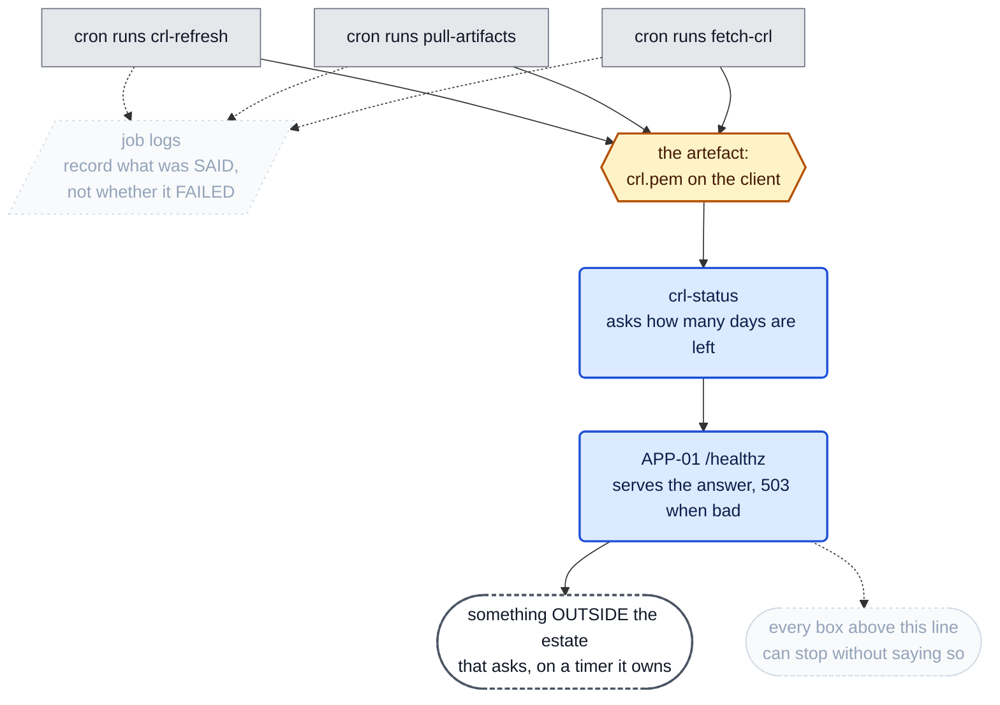
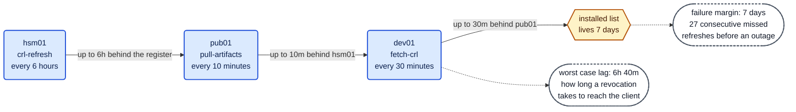
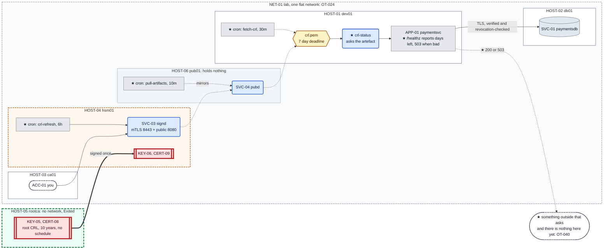

# Chapter 11 — Nobody is watching

## The system before this chapter

Six machines. An offline root signs one intermediate; the intermediate signs everything and
publishes a revocation list; `pub01` mirrors it; `fetch-crl` on the client verifies every list in
the bundle, the dates and the sequence number before installing.

Chapter 10 built a pipeline and left no clock driving any of it.

## The pressure

`OT-033`, and `OT-039` standing behind it.

Three commands now have to happen forever: `crl-refresh` on `hsm01`, `pull-artifacts` on `pub01`,
`fetch-crl` on `dev01`. Nothing runs any of them. Seven days after the last time somebody
remembered, every client refuses every certificate, healthy ones included, with an error that
names nothing.

That is one problem. There is a second one hiding behind it, and it is the harder of the two:
**nothing would tell you.** No component in this estate reports how long the installed list has
left, so the first symptom of a broken pipeline is the outage itself.

Fixing only the first makes things worse in a specific way. An estate with a scheduler and no
monitoring has the same failure at the same moment, plus a crontab entry that everybody believes
is handling it.

---

## 0. If your output differs

Serials, CRL numbers, dates and container IDs will differ. Two sections wait for a clock to turn,
so `§1` and `§7` each take a couple of minutes of real time.

Work in this chapter's `lab/` folder:

```bash
cd "chapters/Chapter 11/lab"
ls
```

Expected: `docker-compose.yml`, and the directories `dev01/`, `db01/`, `ca01/`, `hsm01/`,
`rootca/` and `pub01/`.

### The lab in full

What **this** chapter writes is marked ★:

```
lab/
├── docker-compose.yml                Chapter 10
├── dev01/
│   ├── Dockerfile                    Chapter 01
│   ├── entrypoint.sh                 Chapter 01
│   ├── initdb.sql                    Chapter 01
│   ├── fetch-crl.py                  Chapter 10
│   ├── crl-status.py               ★ new: asks about the artefact, not the job
│   ├── crontab                     ★ new: every 30 minutes, and not for the reason you think
│   ├── app/
│   │   ├── config.yaml             ★ changed: a threshold
│   │   └── paymentsvc.py           ★ changed: /healthz finally answers a question
│   └── secretstore/
│       ├── secretstore.py            Chapter 03
│       ├── secretstore-set.py        Chapter 02
│       └── policy.json               Chapter 03
├── db01/
│   ├── Dockerfile                    Chapter 04
│   ├── entrypoint.sh                 Chapter 04
│   └── impostor.py                   Chapter 04
├── ca01/
│   ├── Dockerfile                    Chapter 07
│   ├── entrypoint.sh                 Chapter 07
│   └── request-cert.sh               Chapter 08
├── hsm01/
│   ├── Dockerfile                    Chapter 07
│   ├── entrypoint.sh                 Chapter 07
│   ├── hsm-init.sh                   Chapter 07
│   ├── ica-init.sh                   Chapter 08
│   ├── sign-leaf.sh                  Chapter 10
│   ├── signd.py                      Chapter 10
│   ├── stop-signd.sh                 Chapter 08
│   ├── policy.json                   Chapter 07
│   ├── ca.cnf                        Chapter 09
│   ├── crl-refresh.sh                Chapter 09
│   ├── revoke-cert.sh                Chapter 09
│   └── crontab                     ★ new: every 6 hours
├── rootca/
│   ├── Dockerfile                    Chapter 08
│   ├── entrypoint.sh                 Chapter 08
│   ├── root-init.sh                  Chapter 08
│   ├── sign-ca.sh                    Chapter 08
│   ├── root.cnf                      Chapter 09
│   └── root-crl.sh                   Chapter 09
└── pub01/
    ├── Dockerfile                    Chapter 10
    ├── entrypoint.sh                 Chapter 10
    ├── pubd.py                       Chapter 10
    ├── pull-artifacts.py             Chapter 10
    └── crontab                     ★ new: every 10 minutes
```

**Nothing is rebuilt.** `cron` is installed into the running containers with `apt-get`, which
works and which widens `OT-020` by three machines.

### Before you start

```bash
sudo docker start db01 ca01 hsm01 dev01 pub01
sudo docker exec -d -u signd hsm01 \
    sh -c 'python3 /usr/local/bin/signd >>/var/log/signd.out 2>&1'
sudo docker exec -d -u pub pub01 sh -c 'python3 /usr/local/bin/pubd >>/var/log/pubd.out 2>&1'
sleep 2
sudo docker exec dev01 sh -c '
  for i in $(seq 1 30); do pg_isready -q -h 127.0.0.1 -p 5432 && break; sleep 1; done
  pg_ctlcluster 15 main stop'
sudo docker exec -d -u secretstore dev01 \
    sh -c 'python3 /opt/secretstore/secretstore.py >>/var/log/secretstore.out 2>&1'
sleep 1
sudo docker exec -d -u paymentsvc dev01 \
    sh -c 'python3 /opt/paymentsvc/paymentsvc.py >>/var/log/paymentsvc.out 2>&1'
sleep 2
curl -s http://127.0.0.1:8080/payments/1001/status
sudo docker exec dev01 openssl crl -in /var/lib/fetch-crl/crl.pem -noout -nextupdate
```

Expected: the payment record, and a `nextUpdate` from when you ran Chapter 10.

**Count how many commands that was.** Five processes on four machines, every one of them started
by hand, and the estate is broken until all five are up. That is `OT-009`, and this chapter is
about the half of it that fails silently.

---

## 1. Make it fail: the deadline arrives

Waiting seven days is not practical, so shorten the list instead. This is the same command
`crl-refresh` runs, with one extra flag:

```bash
sudo docker exec -u signd hsm01 sh -c '
  PIN=$(cat /var/lib/ca/ica-pin)
  openssl ca -config /var/lib/ca/ca.cnf \
      -engine pkcs11 -keyform engine \
      -keyfile "pkcs11:token=ica-token;object=ica-key;type=private?pin-value=$PIN" \
      -gencrl -crlsec 90 -out /var/lib/ca/ica-crl.pem 2>/dev/null
  cat /var/lib/ca/ica-crl.pem /var/lib/ca/root-crl.pem > /var/lib/ca/crl.pem
  chmod 0644 /var/lib/ca/crl.pem
  openssl crl -in /var/lib/ca/ica-crl.pem -noout -crlnumber -lastupdate -nextupdate'
```

Expected: a `crlNumber` one higher than before, and a `nextUpdate` **ninety seconds** after
`lastUpdate`.

Nothing is wrong with that list. It is correctly signed, correctly numbered, and valid, for a
minute and a half. Push it through the pipeline exactly as the estate would:

```bash
sudo docker exec -u pub pub01 pull-artifacts --from http://hsm01.lab.simurgh.example:8080 --once
sudo docker exec -u paymentsvc dev01 fetch-crl \
    --url http://pub01.lab.simurgh.example/crl.pem \
    --anchors /opt/paymentsvc/ca-bundle.pem \
    --install /var/lib/fetch-crl/crl.pem \
    --state /var/lib/fetch-crl/state.json
```

Expected: `published` and `installed`, with the intermediate's `nextUpdate` a minute or so away.

**Every check passed.** The signature verified, both lists were present, the sequence number went
up, and the file was installed. `fetch-crl` did its job perfectly and handed the client a bomb
with a ninety second fuse, because nothing it checks is about how *long* a list is good for.

Ask the application whether anything is wrong:

```bash
curl -s http://127.0.0.1:8080/healthz
curl -s http://127.0.0.1:8080/payments/1001/status
```

Expected: `{"status": "ok"}`, and the payment record. The estate is healthy and is ninety seconds
from an outage.

Wait it out:

```bash
sleep 100
sudo docker exec dev01 pkill -f 'python3 /opt/paymentsvc/paymentsvc.py' || true
sudo docker exec -u paymentsvc dev01 python3 /opt/paymentsvc/paymentsvc.py 2>&1 | tail -4
```

Expected, ending in:

```
psycopg2.OperationalError: connection to server at "db01.lab.simurgh.example" (172.x.x.x),
port 5432 failed: SSL error: certificate verify failed
```

**Nothing was revoked, nothing was compromised, and nothing was misconfigured.** The database's
certificate is valid. The application's anchor is correct. The revocation list is correctly
signed by the right authority. It is simply out of date, and Chapter 09 measured what that does:
`error 12`, and every certificate is refused.

Confirm the cause rather than inferring it, because the application's message names nothing:

```bash
sudo docker exec dev01 openssl crl -in /var/lib/fetch-crl/crl.pem -noout -nextupdate
sudo docker cp dev01:/var/lib/fetch-crl/crl.pem /tmp/stale.pem
sudo docker cp /tmp/stale.pem ca01:/opt/ca-client/stale.pem
sudo docker exec ca01 chown ca:ca /opt/ca-client/stale.pem
sudo docker exec -u ca ca01 openssl verify -crl_check \
    -CAfile /opt/ca-client/ca.crt -CRLfile /opt/ca-client/stale.pem \
    /opt/ca-client/ca01.crt 2>&1 | tail -2
```

Expected: a `nextUpdate` in the past, then `error 12 at 0 depth lookup: CRL has expired`.

### 1.1 What would have prevented it

Not a better fetch. `fetch-crl` ran and succeeded. Not a better publication point, which served
exactly what it was given. Not a more careful operator, because there was nothing to be careful
about: every command in this section reported success.

The estate needed two things it does not have. Something to run `crl-refresh` before the
deadline, and **something to say the deadline was approaching**. It has neither, and only the
first is obvious.

Put it back before going on:

```bash
sudo docker exec -u signd hsm01 crl-refresh | head -4
sudo docker exec -u pub pub01 pull-artifacts --from http://hsm01.lab.simurgh.example:8080 --once
sudo docker exec -u paymentsvc dev01 fetch-crl \
    --url http://pub01.lab.simurgh.example/crl.pem \
    --anchors /opt/paymentsvc/ca-bundle.pem \
    --install /var/lib/fetch-crl/crl.pem \
    --state /var/lib/fetch-crl/state.json | head -1
sudo docker exec -d -u paymentsvc dev01 \
    sh -c 'python3 /opt/paymentsvc/paymentsvc.py >>/var/log/paymentsvc.out 2>&1'
sleep 2
curl -s http://127.0.0.1:8080/payments/1001/status
```

Expected: the payment record.

---

## 2. Two problems, and the second is the one that matters

It is tempting to read `§1` as "we need cron" and stop. Consider what that actually buys.

A scheduled `crl-refresh` runs every six hours. One day the token PIN file gets the wrong mode,
or the disk fills, or somebody renames the script. The job now fails every six hours instead of
succeeding, and **the estate looks exactly as it did before**: the same files in the same places,
the same crontab, the same absence of complaints. Seven days later every certificate is refused.

The outage arrives at the same moment it would have without the scheduler. What has changed is
that there is now a crontab entry, and a crontab entry is a thing people point at when asked
whether something is handled.

**So the scheduler is the easy half and the dangerous half.** It converts a task somebody knows
is manual into a task everybody believes is automatic, and unless something is checking, the
belief is the only difference.

### 2.1 What is actually worth watching

Three candidates, and two of them are wrong.

**Did the job run?** Nearly useless. A job that runs every six hours and fails every six hours is
running.

**Did the job succeed?** Better, and still wrong, for a reason `§7` measures rather than argues:
on these machines there is nowhere for a failure to be reported to. It is also the wrong question
in principle, because a `crl-refresh` that exits zero having written a list nobody can fetch has
succeeded at the wrong thing.

**Is the artefact good?** This is the question. How much life is left in the list actually
installed on the machine that actually needs it. It is true or false regardless of how many jobs
ran, in what order, on which host, or whether any of them existed.

**A job that ran, exited zero and produced nothing useful is indistinguishable from a job that
never ran, unless something looks at what should have changed.** That sentence is the chapter.

---

## 3. `crl-status`

```python
#!/usr/bin/env python3
"""Report how much life is left in the installed revocation list.

    crl-status --crl /var/lib/fetch-crl/crl.pem [--warn-days 2] [--quiet]

Exits 0 while every list in the bundle has more than --warn-days left, and 1
the moment any of them does not. Exits 1 if the file is missing, unreadable or
unparseable, because all of those mean the same thing operationally: this
client is about to stop verifying, or has already.

WHY THIS EXISTS SEPARATELY FROM fetch-crl.

fetch-crl answers "did the fetch work". This answers "is the estate all right",
and they are not the same question. Measured on Debian 12: a cron job that
fails writes to nowhere. There is no MTA and no syslog in these containers, so
stderr is discarded, and cron keeps no log of having run anything. Redirecting
to a file captures what the job SAID and still loses whether it FAILED.

So a scheduled fetch-crl that quietly stops working looks exactly like one that
is working, right up until the list expires and every certificate in the estate
is refused at once.

The way out is not a better log. It is to stop asking about the job and start
asking about the artefact. A fetch that ran, exited zero and installed nothing
useful is indistinguishable from a fetch that never ran, unless something looks
at what should have changed.

WHAT THIS DOES NOT SOLVE, and the chapter says so rather than pretending. This
program is itself a thing that can stop running. Something outside has to ask
it, which is why APP-01 serves the answer on /healthz and why the last link in
the chain is a human or a monitoring system with a curl. The regress does not
terminate inside the machine.
"""
import argparse
import os
import re
import subprocess
import sys
from datetime import datetime, timezone

BEGIN = "-----BEGIN X509 CRL-----"
END = "-----END X509 CRL-----"


def split_blocks(text):
    """Every PEM CRL in the file, in order.

    The same boundary walk fetch-crl does, and for the same measured reason:
    `openssl crl -in` on a two-list bundle reads the FIRST block and exits 0,
    so a single call reports on half the file and calls it healthy.
    """
    out, cur = [], None
    for line in text.splitlines():
        if line.strip() == BEGIN:
            cur = [line]
        elif cur is not None:
            cur.append(line)
            if line.strip() == END:
                out.append("\n".join(cur) + "\n")
                cur = None
    return out


def field(pem, flag, pattern):
    proc = subprocess.run(["openssl", "crl", "-noout", flag],
                          input=pem, capture_output=True, text=True)
    if proc.returncode != 0:
        return None
    m = re.search(pattern, proc.stdout + proc.stderr)
    return m.group(1).strip() if m else None


def report(crl_path, warn_days):
    """Return (ok, lines). Never raises: a monitor that crashes reports nothing."""
    if not os.path.exists(crl_path):
        return False, [f"MISSING {crl_path}"]
    try:
        with open(crl_path) as fh:
            text = fh.read()
    except OSError as exc:
        return False, [f"UNREADABLE {crl_path}: {exc}"]

    blocks = split_blocks(text)
    if not blocks:
        return False, [f"NOT A CRL BUNDLE {crl_path}"]

    now = datetime.now(timezone.utc)
    ok, lines = True, []
    for pem in blocks:
        issuer = field(pem, "-issuer", r"issuer=(.*)") or "unknown issuer"
        nextup = field(pem, "-nextupdate", r"nextUpdate=(.*)")
        number = field(pem, "-crlnumber", r"crlNumber=(\S+)") or "?"
        if not nextup:
            ok = False
            lines.append(f"NO nextUpdate  {issuer}")
            continue
        try:
            expires = datetime.strptime(nextup, "%b %d %H:%M:%S %Y %Z").replace(
                tzinfo=timezone.utc)
        except ValueError:
            ok = False
            lines.append(f"BAD nextUpdate {issuer}: {nextup!r}")
            continue
        left = (expires - now).total_seconds() / 86400.0
        if left <= 0:
            ok = False
            state = "EXPIRED"
        elif left < warn_days:
            ok = False
            state = "EXPIRING"
        else:
            state = "ok"
        lines.append(f"{state:8} {issuer}  crlNumber {number}  "
                     f"{left:.2f} days left  (nextUpdate {nextup})")
    return ok, lines


def main():
    ap = argparse.ArgumentParser()
    ap.add_argument("--crl", default="/var/lib/fetch-crl/crl.pem")
    ap.add_argument("--warn-days", type=float, default=2.0,
                    help="fail while any list has less than this left. The "
                         "default is under a third of the intermediate's seven "
                         "days, so two consecutive missed refreshes are needed "
                         "before it complains, and one missed refresh is not "
                         "an incident")
    ap.add_argument("--quiet", action="store_true",
                    help="print nothing, just set the exit status")
    args = ap.parse_args()

    ok, lines = report(args.crl, args.warn_days)
    if not args.quiet:
        for line in lines:
            print(line)
    return 0 if ok else 1


if __name__ == "__main__":
    sys.exit(main())
```

Deploy it:

```bash
sudo docker cp dev01/crl-status.py dev01:/usr/local/bin/crl-status
sudo docker exec dev01 chmod 0755 /usr/local/bin/crl-status
sudo docker exec -u paymentsvc dev01 crl-status --crl /var/lib/fetch-crl/crl.pem
echo "exit: $?"
```

Expected:

```
ok       CN=Simurgh Lab Issuing CA 1  crlNumber 0x...  6.9x days left  (nextUpdate ...)
ok       CN=Simurgh Lab Root CA  crlNumber 0x...  3649.xx days left  (nextUpdate ...)
exit: 0
```

**Two lists, two very different numbers, and the smaller one governs.** An operator reasoning
about "the CRL" as one object will look at the ten-year figure and conclude there is nothing to
do.

Check that it fails when it should:

```bash
sudo docker exec -u paymentsvc dev01 crl-status --warn-days 30; echo "exit: $?"
sudo docker exec -u paymentsvc dev01 crl-status --crl /nonexistent.pem; echo "exit: $?"
```

Expected: `EXPIRING` on the intermediate's line with `exit: 1`, then `MISSING /nonexistent.pem`
with `exit: 1`.

**It splits the bundle and checks every list.** That is the Chapter 10 measurement doing work in
a second place: `openssl crl -in` on a two-list file reads the first block and exits `0`, so a
status tool built on one call would report a healthy intermediate and never look at the root.

---

## 4. `/healthz` finally answers a question

`crl-status` tells you the truth if you run it. Nobody runs it.

The endpoint that exists to be polled has been returning a hardcoded `ok` since Chapter 01, and
this book has complained about it twice: Chapter 08 §10 found it reporting healthy while the
application could not reach its database at all, and Chapter 10 §0 warned against using it as a
state check.

The endpoint is in `do_GET`, a third of the way down:

```python
#!/usr/bin/env python3
"""APP-01 paymentsvc, answers 'what is the status of payment X?'

Chapter 04 change: SVC-01 now lives on its own machine, so the database
connection crosses a network. It is made with TLS and the server
certificate is verified against a pinned copy, which is what stops anything
that answers on port 5432 from being handed our queries.

The credential still comes from SVC-02 over a Unix socket on this host, and
this process still stores no credential of its own.
"""

import http.client
import json
import logging
import os
import pwd
import socket
import subprocess
import sys
from http.server import BaseHTTPRequestHandler, ThreadingHTTPServer

import psycopg2
import yaml
from psycopg2.extras import RealDictCursor

CONFIG_PATH = os.environ.get("PAYMENTSVC_CONFIG", "/opt/paymentsvc/config.yaml")

logging.basicConfig(
    level=os.environ.get("LOG_LEVEL", "INFO").upper(),
    format="%(asctime)s %(levelname)s %(message)s",
    handlers=[
        logging.FileHandler("/var/log/paymentsvc.log"),
        logging.StreamHandler(sys.stdout),
    ],
)
log = logging.getLogger("paymentsvc")


def load_config(path):
    log.info("loading configuration from %s", path)
    with open(path) as fh:
        cfg = yaml.safe_load(fh)
    log.debug("effective configuration: %s", cfg)
    return cfg


class UnixHTTPConnection(http.client.HTTPConnection):
    """An HTTP client that speaks over a Unix domain socket.

    The only difference from an ordinary HTTPConnection is where connect()
    points. Everything above it, requests, status codes, headers, is
    unchanged, which is why moving SVC-02 off TCP cost so little here.
    """

    def __init__(self, socket_path, timeout=5):
        super().__init__("localhost", timeout=timeout)
        self.socket_path = socket_path

    def connect(self):
        sock = socket.socket(socket.AF_UNIX, socket.SOCK_STREAM)
        sock.settimeout(self.timeout)
        sock.connect(self.socket_path)
        self.sock = sock


def fetch_credential(socket_path, secret_name):
    """Ask SVC-02 for the current database credential.

    We present no token and assert no identity. The kernel tells the store
    our uid when we connect, and the store applies POL-01 to it. If it says
    no, we get a 403 and fail loudly, being refused is not something to
    paper over.
    """
    conn = UnixHTTPConnection(socket_path)
    try:
        conn.request("GET", f"/v1/secrets/{secret_name}")
        resp = conn.getresponse()
        body = resp.read().decode()
        if resp.status == 403:
            raise PermissionError(
                f"secretstore refused this process: {json.loads(body).get('detail')}"
            )
        if resp.status != 200:
            raise RuntimeError(f"secretstore returned {resp.status}: {body}")
        payload = json.loads(body)
    finally:
        conn.close()
    cred = json.loads(payload["value"])
    log.info("fetched %s version %s as user %s",
             secret_name, payload["version"], cred["user"])
    return cred["user"], cred["password"], payload["version"]


def check_crl_usable(path):
    """Refuse to start rather than run with revocation checking silently off.

    THIS FUNCTION EXISTS BECAUSE libpq FAILS OPEN, AND IT WAS MEASURED.

    Naming a CRL is supposed to turn revocation checking on. libpq only turns
    it on if the file loads; if it cannot, the flags are never set, the
    connection succeeds, and a revoked certificate is accepted exactly as
    before. Four ways of being unusable were tested against PostgreSQL 15 and
    all four connected: the file missing, the file unreadable, the file
    containing something that is not a CRL, and the file empty.

    None of them warned. The last is the one that happens in real life: a
    fetch that failed and left a zero-byte file behind, after which the
    estate stops checking revocation and nothing anywhere says so.

    So the application checks on the platform's behalf, and refuses to start
    when the answer is no. That is D-011: a service configured to require a
    protection should fail loudly rather than run without it. A crash at
    startup is a page; a silently disabled security control is a year of
    believing something that is not true.

    Note what is NOT checked here: whether the file carries a list from every
    authority in the chain. libpq fails CLOSED on that one, refusing healthy
    certificates, so it is already loud and needs no help.
    """
    if not os.path.exists(path):
        raise SystemExit(f"sslcrl is set to {path}, which does not exist. "
                         "Refusing to start: revocation checking would be off.")
    if not os.access(path, os.R_OK):
        raise SystemExit(f"sslcrl is set to {path}, which is not readable by "
                         f"{pwd.getpwuid(os.getuid()).pw_name}. Refusing to start.")
    if os.path.getsize(path) == 0:
        raise SystemExit(f"sslcrl is set to {path}, which is empty. "
                         "Refusing to start: a failed download looks exactly like this.")

    # Parse every list in the file and report the issuers, so the log says
    # what is actually being enforced rather than that a setting is spelled.
    proc = subprocess.run(["openssl", "crl", "-in", path, "-noout", "-issuer"],
                          capture_output=True, text=True)
    if proc.returncode != 0:
        raise SystemExit(f"sslcrl is set to {path}, which openssl cannot parse. "
                         "Refusing to start.")
    log.info("CRL file %s parses, first issuer %s", path, proc.stdout.strip())


class Database:
    """Owns the connection and the credential it was made with."""

    def __init__(self, cfg):
        self.cfg = cfg
        self.conn = None
        self.user = None
        self.version = None
        self.connect()

    def connect(self):
        db = self.cfg["database"]
        store = self.cfg["secret_store"]
        user, password, version = fetch_credential(
            store["socket"], store["secret_name"]
        )
        conn_args = dict(
            host=db["host"], port=db["port"], dbname=db["name"],
            user=user, password=password,
            # sslmode=verify-full is the whole point of Chapter 04.
            # `require` would encrypt and verify nothing, which buys a
            # confidential conversation with whoever happens to answer.
            sslmode=db["sslmode"],
        )
        # The anchor is optional, and leaving it out is not neutral. libpq
        # verifies the server certificate whenever a root CA file is
        # present, even under sslmode=require, so naming one here makes a
        # weak-looking config stronger than it reads. Section 7 is what
        # happens when the line is missing and nobody noticed it mattered.
        if db.get("sslrootcert"):
            conn_args["sslrootcert"] = db["sslrootcert"]
        # Chapter 09. Naming a CRL turns revocation checking ON, and that is
        # not a small switch: libpq then refuses any certificate it cannot
        # check, not merely the ones that were revoked. A missing file, an
        # unreadable one, or a list whose nextUpdate has passed all stop this
        # application from starting. That is correct and it is expensive, and
        # section 7 is what it looks like when nobody refreshed the list.
        if db.get("sslcrl"):
            check_crl_usable(db["sslcrl"])
            conn_args["sslcrl"] = db["sslcrl"]
        self.conn = psycopg2.connect(**conn_args)
        self.conn.autocommit = True
        self.user, self.version = user, version
        log.info("connected to %s@%s:%s/%s (credential version %s, sslmode %s, crl %s)",
                 user, db["host"], db["port"], db["name"], version, db["sslmode"],
                 "on" if db.get("sslcrl") else "off")

    def query(self, sql, args):
        """Run a query; on a connection-level failure, re-fetch and retry once."""
        try:
            return self._query(sql, args)
        except psycopg2.OperationalError as exc:
            log.warning("connection failed (%s), re-fetching credential", exc)
            self.connect()
            return self._query(sql, args)

    def _query(self, sql, args):
        with self.conn.cursor(cursor_factory=RealDictCursor) as cur:
            cur.execute(sql, args)
            return cur.fetchone()


cfg = load_config(CONFIG_PATH)
database = Database(cfg)


class Handler(BaseHTTPRequestHandler):
    server_version = "paymentsvc/0.4"

    def _json(self, code, payload):
        body = json.dumps(payload).encode()
        self.send_response(code)
        self.send_header("Content-Type", "application/json")
        self.send_header("Content-Length", str(len(body)))
        self.end_headers()
        self.wfile.write(body)

    def do_GET(self):
        if self.path == "/healthz":
            # CHAPTER 11: THIS ENDPOINT FINALLY ANSWERS A QUESTION.
            #
            # Until now it returned a hardcoded ok, and the book complained
            # about it twice: Chapter 08 section 10 found it reporting healthy
            # while the application could not reach its database at all, and
            # Chapter 10 section 0 warned against using it as a state check.
            #
            # It is not being given a database probe. That was the right call
            # and stays: a health endpoint that opens a connection turns every
            # poll into load, and Chapter 08's complaint was that it claimed
            # more than it knew, not that it knew too little.
            #
            # What it reports now is the one thing about this process that
            # degrades silently and takes the estate down with it: how much
            # life is left in the revocation list. Measured in Chapter 11, a
            # cron job that stops working leaves no trace anywhere, so the job
            # cannot be the thing that is watched. The artefact can.
            #
            # It shells out to crl-status rather than reimplementing it, for
            # the reason SVC-03 shells out to sign-leaf: two copies of a rule
            # about expiry is one copy too many, and the one that drifts will
            # be the one nobody runs by hand.
            crl = cfg["database"].get("sslcrl")
            if not crl:
                return self._json(200, {"status": "ok", "crl_checking": False})
            proc = subprocess.run(
                ["/usr/local/bin/crl-status", "--crl", crl,
                 "--warn-days", str(cfg.get("crl", {}).get("warn_days", 2))],
                capture_output=True, text=True)
            detail = [ln for ln in proc.stdout.splitlines() if ln.strip()]
            if proc.returncode == 0:
                return self._json(200, {"status": "ok", "crl": detail})
            # 503, not 200 with a flag. A monitoring system reads the status
            # line; a field inside a 200 is a thing somebody has to remember
            # to look at, which is the failure this whole chapter is about.
            return self._json(503, {"status": "degraded", "crl": detail})

        if self.path == "/credinfo":
            return self._json(200, {
                "db_user": database.user,
                "secret_name": cfg["secret_store"]["secret_name"],
                "credential_version": database.version,
                "running_as": pwd.getpwuid(os.getuid()).pw_name,
                "uid": os.getuid(),
                "db_host": cfg["database"]["host"],
                "sslmode": cfg["database"]["sslmode"],
                # Chapter 09: whether this client is checking revocation at
                # all. Worth exposing, because the difference between
                # checking and not checking is invisible from the outside
                # and is the difference between refusing a revoked
                # certificate and accepting one.
                # Effect, not intent. Reporting that a setting is spelled
                # would be the Chapter 08 /healthz defect again: with an
                # unusable file libpq checks nothing while the config still
                # says sslcrl. The process refuses to start in that case, so
                # if this says true it is true.
                "crl_checking": bool(cfg["database"].get("sslcrl")),
            })

        parts = self.path.strip("/").split("/")
        if len(parts) == 3 and parts[0] == "payments" and parts[2] == "status":
            try:
                payment_id = int(parts[1])
            except ValueError:
                return self._json(400, {"error": "payment id must be an integer"})
            row = database.query(
                "SELECT id, reference, amount_cents, currency, status "
                "FROM payments WHERE id = %s",
                (payment_id,),
            )
            if row is None:
                return self._json(404, {"error": "no such payment"})
            return self._json(200, dict(row))

        return self._json(404, {"error": "not found"})

    def log_message(self, fmt, *args):
        log.info("%s %s", self.address_string(), fmt % args)


if __name__ == "__main__":
    host, _, port = cfg["server"]["listen"].rpartition(":")
    srv = ThreadingHTTPServer((host, int(port)), Handler)
    log.info("listening on %s", cfg["server"]["listen"])
    srv.serve_forever()
```

And the threshold it reads:

```yaml
# /opt/paymentsvc/config.yaml
database:
  host: db01.lab.simurgh.example
  port: 5432
  name: paymentsdb
  sslmode: verify-full
  # Chapter 05: the anchor is the authority, not the server.
  #
  # This was /opt/paymentsvc/db01.crt, a copy of the certificate db01
  # presents. Pinning that meant re-issuing db01's certificate broke this
  # client, which is OT-017. Now it is CERT-02, the root, and db01 can be
  # re-issued as often as it likes without this line or this file changing.
  #
  # The path is the only thing that had to change on the client. That is
  # the whole payoff, and it is a one-time cost.
  sslrootcert: /opt/paymentsvc/ca.crt
  # Chapter 09: check whether the certificate has been taken back.
  #
  # The anchor above answers "did our authority sign this". It cannot answer
  # "does our authority still stand behind it", and those became different
  # questions the moment a credential was stolen. This line is the second
  # question.
  #
  # It is not a free improvement. With this set, libpq refuses any
  # certificate whose revocation status it cannot establish: no file, an
  # unreadable file, or a list past its nextUpdate all stop this application
  # from starting, healthy certificates included. Deleting the line turns
  # revocation checking off and everything works again, which is exactly why
  # it is worth knowing that the line is load-bearing.
  #
  # Chapter 10: moved out of this directory, and the reason is least privilege
  # rather than tidiness. The list is now maintained by fetch-crl, running as
  # `paymentsvc`, and an atomic replace needs a temporary file in the same
  # directory as the target. Granting that here would make /opt/paymentsvc
  # writable by the application, which would let APP-01 rewrite its own
  # configuration, and that has been forbidden since Chapter 01.
  #
  # A revocation list is not configuration. It is state an agent maintains, so
  # it lives where the agent can own it.
  sslcrl: /var/lib/fetch-crl/crl.pem
secret_store:
  socket: /run/secretstore/sock
  secret_name: paymentsvc-db
server:
  listen: 0.0.0.0:8080

# Chapter 11. How close to the deadline counts as a problem.
#
# Two days against the intermediate's seven means two consecutive missed
# refreshes are needed before /healthz goes amber, so a single missed run is
# not an incident and a broken pipeline is. Set it too low and the alarm
# arrives at the same time as the outage, which is the same as no alarm.
crl:
  warn_days: 2
```

It is deliberately **not** given a database probe. That was the right call and it stays: a health
endpoint that opens a connection turns every poll into load. Chapter 08's complaint was that it
claimed more than it knew, not that it knew too little.

What it reports now is the one property of this process that degrades silently and takes the
estate with it, and it **shells out to `crl-status`** rather than reimplementing the rule, for
the reason `SVC-03` shells out to `sign-leaf`: two copies of a rule about expiry is one copy too
many, and the one that drifts will be the one nobody runs by hand.

Deploy it, along with the threshold:

```bash
sudo docker cp dev01/app/config.yaml   dev01:/opt/paymentsvc/config.yaml
sudo docker cp dev01/app/paymentsvc.py dev01:/opt/paymentsvc/paymentsvc.py
sudo docker exec dev01 sh -c '
  chown paymentsvc:paymentsvc /opt/paymentsvc/config.yaml /opt/paymentsvc/paymentsvc.py
  chmod 0400 /opt/paymentsvc/config.yaml
  chmod 0444 /opt/paymentsvc/paymentsvc.py'
sudo docker exec dev01 pkill -f 'python3 /opt/paymentsvc/paymentsvc.py' || true
sudo docker exec -d -u paymentsvc dev01 \
    sh -c 'python3 /opt/paymentsvc/paymentsvc.py >>/var/log/paymentsvc.out 2>&1'
sleep 2
curl -s http://127.0.0.1:8080/healthz
```

Expected: `{"status": "ok", "crl": ["ok       CN=Simurgh Lab Issuing CA 1 ...", "ok ..."]}`.

Now make it tell the truth about a bad situation, using the ninety second trick from `§1`:

```bash
sudo docker exec -u signd hsm01 sh -c '
  PIN=$(cat /var/lib/ca/ica-pin)
  openssl ca -config /var/lib/ca/ca.cnf -engine pkcs11 -keyform engine \
      -keyfile "pkcs11:token=ica-token;object=ica-key;type=private?pin-value=$PIN" \
      -gencrl -crlsec 90 -out /var/lib/ca/ica-crl.pem 2>/dev/null
  cat /var/lib/ca/ica-crl.pem /var/lib/ca/root-crl.pem > /var/lib/ca/crl.pem
  chmod 0644 /var/lib/ca/crl.pem'
sudo docker exec -u pub pub01 pull-artifacts --from http://hsm01.lab.simurgh.example:8080 --once >/dev/null
sudo docker exec -u paymentsvc dev01 fetch-crl \
    --url http://pub01.lab.simurgh.example/crl.pem \
    --anchors /opt/paymentsvc/ca-bundle.pem \
    --install /var/lib/fetch-crl/crl.pem \
    --state /var/lib/fetch-crl/state.json >/dev/null
curl -s -o /dev/null -w "before expiry: HTTP %{http_code}\n" http://127.0.0.1:8080/healthz
sleep 100
curl -s -w "\nafter expiry: HTTP %{http_code}\n" http://127.0.0.1:8080/healthz
```

Expected:

```
before expiry: HTTP 200

{"status": "degraded", "crl": ["EXPIRED  CN=Simurgh Lab Issuing CA 1 ... -0.00 days left ...",
"ok       CN=Simurgh Lab Root CA ..."]}
after expiry: HTTP 503
```

**`503`, not `200` with a flag inside.** A monitoring system reads the status line. A field
buried in a `200` body is a thing somebody has to remember to look at, which is precisely the
failure this chapter is about.

Notice also that the application is **still running and still serving**. It has not crashed; it
has declared itself unfit. Those are different, and the second is what you want from a component
whose dependency has gone stale: it keeps answering, and it tells the truth about itself.

Put the estate back:

```bash
sudo docker exec -u signd hsm01 crl-refresh >/dev/null
sudo docker exec -u pub pub01 pull-artifacts --from http://hsm01.lab.simurgh.example:8080 --once >/dev/null
sudo docker exec -u paymentsvc dev01 fetch-crl \
    --url http://pub01.lab.simurgh.example/crl.pem \
    --anchors /opt/paymentsvc/ca-bundle.pem \
    --install /var/lib/fetch-crl/crl.pem \
    --state /var/lib/fetch-crl/state.json >/dev/null
curl -s -o /dev/null -w "recovered: HTTP %{http_code}\n" http://127.0.0.1:8080/healthz
```

Expected: `recovered: HTTP 200`. No restart was needed: `/healthz` reads the file each time it is
asked, so the recovery is visible as soon as it happens.

---

## 5. Who watches the watcher

`crl-status` is a program. `/healthz` is a process. Both can stop.

**Figure 11.1 — the chain, and where it ends**



**Read the shape rather than the boxes.** The three jobs fan into one artefact, and everything
after that is a single line. That is deliberate: there is exactly one thing worth asking about,
and asking it once covers all three jobs, whichever of them broke.

**The job logs are drawn dotted and going nowhere**, which is what `§7` measures.

**The regress does not terminate inside the machine.** `crl-status` can fail to run and
`/healthz` can stop answering, and in both cases the last honest thing the estate can do is stop
responding to a poll. Something outside has to notice the absence. In this lab that is a human
with `curl`; in a real estate it is a monitoring system, which is itself a thing that can stop,
watched by an on-call rota, which is a thing that can stop.

**That is not a defeat, it is where the responsibility moves to.** The useful engineering
question is not how to end the regress but how far down it you can push a *silent* failure.
Before this chapter, a stopped pipeline was silent all the way to the outage. After it, a stopped
pipeline is loud at `/healthz`, and only the failure of the asking is silent.

---

## 6. A scheduler

`cron` is not installed on any of these machines. It can be added to a running container, which
matters because `hsm01` cannot be rebuilt without destroying its token:

```bash
for h in hsm01 pub01 dev01; do
  echo "--- $h ---"
  sudo docker exec $h sh -c 'apt-get update -qq >/dev/null 2>&1 && \
      DEBIAN_FRONTEND=noninteractive apt-get install -y -qq --no-install-recommends cron \
      >/dev/null 2>&1; command -v cron || echo "NOT INSTALLED"'
done
```

Expected: `/usr/sbin/cron` three times.

**That widens `OT-020` by three machines.** None of these Dockerfiles installs `cron`, so the
folder no longer describes what the machines contain. The alternative was rebuilding `hsm01`,
which costs `KEY-06`, `CERT-09` and the register.

Start the daemon on each. There is no init system, so it is started the same way everything else
here is:

```bash
for h in hsm01 pub01 dev01; do sudo docker exec -d $h cron; done
sleep 1
for h in hsm01 pub01 dev01; do
  printf "%-7s " "$h"
  sudo docker exec $h sh -c 'for d in /proc/[0-9]*; do
      [ -r "$d/comm" ] && [ "$(cat $d/comm)" = "cron" ] && echo running && exit 0
    done; echo NOT RUNNING'
done
```

Expected: `running` three times. `pgrep` would be shorter and `hsm01` and `pub01` have no
`procps`, which Chapter 08 and Chapter 10 each discovered the hard way.

### 6.1 The three schedules

```
# PROC-08 on a timer. Installed for ACC-09 on HOST-04.
#
#   crontab -u signd /var/lib/ca/crontab
#
# WHAT THE REDIRECT DOES AND DOES NOT BUY. Measured on Debian 12: a cron job
# that writes to stderr on these machines writes to nowhere. There is no MTA
# and no syslog, cron reports by mailing output, and mailing output on a host
# with no mail transport is discarding it. Nothing under /var/log or
# /var/spool records that the job ran, let alone that it failed.
#
# So `>>` and `2>&1` are here to make diagnosis possible, not to make failure
# visible. They capture what the job SAID. They do not capture whether it
# FAILED: a run that exits 3 and a run that prints a warning leave the same
# kind of line in the same file, and nobody is reading the file either way.
#
# What actually notices is crl-status, on the client, looking at the artefact
# this job is supposed to keep fresh. That is OT-039's answer and the reason
# this file is not the point of Chapter 11.
#
# EVERY SIX HOURS, against a list that lives seven days. Four runs a day means
# twenty-seven consecutive failures before the estate stops verifying, which
# is enough margin to notice and not so much that the procedure goes stale.
# D-079.
SHELL=/bin/sh
PATH=/usr/local/bin:/usr/bin:/bin

0 */6 * * * crl-refresh >>/var/log/crl-refresh.out 2>&1
```

```
# The mirror, on a timer. Installed for ACC-11 on HOST-06.
#
#   crontab -u pub /srv/pub/crontab
#
# pull-artifacts already knows how to loop, and this replaces that loop rather
# than adding to it. A process that sleeps forever and a cron entry are two
# ways to say the same thing, and only one of them survives the process being
# killed, the container being restarted, or somebody forgetting to start it
# after `docker start`. That is OT-009, and cron is the smallest thing that
# answers it on a machine with no init system.
#
# --once, because cron owns the timing now. Leaving --interval in as well
# would mean two schedules disagreeing, and the one that wins would be
# whichever process happened to still be alive.
#
# EVERY TEN MINUTES. This machine is downstream of hsm01 and upstream of every
# client, so its staleness adds to both. It costs one HTTP request against a
# file that rarely changes, and pull-artifacts prints `unchanged` and writes
# nothing when it has not.
SHELL=/bin/sh
PATH=/usr/local/bin:/usr/bin:/bin

*/10 * * * * pull-artifacts --from http://hsm01.lab.simurgh.example:8080 --once >>/var/log/pull-artifacts.out 2>&1
```

```
# The client, on a timer. Installed for ACC-03 on HOST-01.
#
#   crontab -u paymentsvc /opt/paymentsvc/crontab
#
# EVERY THIRTY MINUTES, which is far more often than a seven day list needs.
# The frequency is not about the deadline, it is about the gap between a
# revocation being published and this client honouring it. Chapter 09 revoked
# a certificate and Chapter 10 made the client fetch; this decides how long a
# compromised certificate keeps working after somebody has taken it back.
#
# Thirty minutes is the answer for a lab. A real estate picks this number from
# how long it is willing to be wrong, and then discovers that the number is
# bounded below by how often the AUTHORITY republishes, which here is six
# hours. Fetching every thirty minutes against a list refreshed every six is
# eleven wasted requests out of twelve, and it is still right: the wasted
# requests cost nothing and the alternative is a client that is up to six
# hours behind its own publication point for no reason. D-080.
#
# fetch-crl refuses to install anything that fails a check and leaves the
# working file alone, so a failed run is a no-op rather than an outage. That
# property is what makes it safe to run this often and unattended.
SHELL=/bin/sh
PATH=/usr/local/bin:/usr/bin:/bin

*/30 * * * * fetch-crl --url http://pub01.lab.simurgh.example/crl.pem --anchors /opt/paymentsvc/ca-bundle.pem --install /var/lib/fetch-crl/crl.pem --state /var/lib/fetch-crl/state.json >>/var/lib/fetch-crl/fetch.out 2>&1
```

Install each for the account that owns the work:

```bash
sudo docker cp hsm01/crontab hsm01:/var/lib/ca/crontab
sudo docker exec hsm01 sh -c 'chown signd:signd /var/lib/ca/crontab
                              crontab -u signd /var/lib/ca/crontab'
sudo docker cp pub01/crontab pub01:/srv/pub/crontab
sudo docker exec pub01 sh -c 'chown pub:pub /srv/pub/crontab
                              crontab -u pub /srv/pub/crontab'
sudo docker cp dev01/crontab dev01:/opt/paymentsvc/crontab
sudo docker exec dev01 sh -c 'chown paymentsvc:paymentsvc /opt/paymentsvc/crontab
                              crontab -u paymentsvc /opt/paymentsvc/crontab'
for h in hsm01 pub01 dev01; do
  printf -- "--- %s ---\n" "$h"
  sudo docker exec $h sh -c 'crontab -l -u signd 2>/dev/null || crontab -l -u pub 2>/dev/null || crontab -l -u paymentsvc' \
    | grep -v '^#' | grep -v '^$'
done
```

Expected: the three schedules, one per machine, each running as the account that owns the files
it touches rather than as root.

Give `pub01`'s log file an owner, since the crontab writes to it as `pub`:

```bash
sudo docker exec pub01 sh -c 'touch /var/log/pull-artifacts.out
                              chown pub:pub /var/log/pull-artifacts.out'
sudo docker exec hsm01 sh -c 'touch /var/log/crl-refresh.out
                              chown signd:signd /var/log/crl-refresh.out'
```

Expected: no output. `/var/log` is root-owned, and a shell redirect happens as the crontab's
user, which is the same trap Chapter 07 spent a section on.

---

## 7. Make it fail: the job that breaks and says nothing

`pub01` is now polling `hsm01` every ten minutes. Break the thing it polls, and watch what the
estate reports.

```bash
sudo docker exec -u signd hsm01 stop-signd
sudo docker exec -u pub pub01 sh -c ': > /var/log/pull-artifacts.out'
```

Expected: `signd: stopped`. The publication point's upstream is gone.

Wait for a scheduled run. The crontab says every ten minutes, so this is a wait of up to ten:

```bash
for i in $(seq 1 60); do
  sudo docker exec -u pub pub01 test -s /var/log/pull-artifacts.out && break
  sleep 10
done
sudo docker exec -u pub pub01 cat /var/log/pull-artifacts.out
```

Expected, eventually:

```
<timestamp>    crl.pem: <urlopen error [Errno 111] Connection refused>, keeping what we have
<timestamp>    ca-bundle.pem: <urlopen error [Errno 111] Connection refused>, keeping what we have
```

**That is only there because the crontab redirects.** Take the redirect away and the same failure
is invisible. Prove it:

```bash
sudo docker exec pub01 sh -c "
  printf 'SHELL=/bin/sh\nPATH=/usr/local/bin:/usr/bin:/bin\n\n* * * * * pull-artifacts --from http://hsm01.lab.simurgh.example:8080 --once\n' \
    > /tmp/quiet.crontab
  crontab -u pub /tmp/quiet.crontab"
sleep 75
echo "--- anything under /var/log? ---"
sudo docker exec pub01 sh -c 'grep -rl "Connection refused" /var/log 2>/dev/null || echo "  nothing"'
echo "--- any mail? ---"
sudo docker exec pub01 sh -c 'ls -la /var/mail/ 2>/dev/null | tail -3'
echo "--- does cron log that it ran anything? ---"
sudo docker exec pub01 sh -c 'ls /var/log/syslog /var/log/cron.log /var/log/messages 2>&1 | head -3'
```

Expected: `nothing`, an empty `/var/mail`, and three `No such file or directory` lines.

**The job ran, failed, and left no trace anywhere.** `cron` reports by mailing output. There is
no mail transport on this machine, so mailing output is discarding it, and `cron` keeps no log of
its own. Nothing in the container knows the job ran at all.

### 7.1 The repair that looks sufficient and is not

Put the redirect back and read what it gives you:

```bash
sudo docker exec pub01 sh -c 'crontab -u pub /srv/pub/crontab'
sudo docker exec -u pub pub01 sh -c ': > /var/log/pull-artifacts.out'
sleep 75
sudo docker exec -u pub pub01 sh -c '
  pull-artifacts --from http://hsm01.lab.simurgh.example:8080 --once
  echo "exit: $?"' 2>&1 | tail -3
```

Expected: two `keeping what we have` lines, then **`exit: 0`**.

Read that exit code. `pull-artifacts` could not reach its upstream, published nothing, and
**succeeded**, because keeping the previous file is the correct behaviour and it says so. A
wrapper watching exit codes would see nothing wrong here, and it would be right to.

Now the general version, which `§0`'s spike measured on a bare container: a job that genuinely
exits non-zero leaves the message in the log and **the status nowhere**. A line saying
`Connection refused` and a line saying `unchanged` sit in the same file, in the same format, and
distinguishing them requires somebody to read the file.

**Nobody reads the file.** That is not a criticism of anybody; it is what log files are, on
machines that are working, for months at a time.

### 7.2 What actually noticed

Nothing so far in this section. The pipeline has been broken for several minutes and `pub01` is
serving the last good file, which is exactly right and is why nothing is on fire yet.

Ask the question that matters:

```bash
curl -s http://127.0.0.1:8080/healthz
sudo docker exec -u paymentsvc dev01 crl-status --warn-days 6.9; echo "exit: $?"
```

Expected: `{"status": "ok", ...}`, then an `EXPIRING` line with `exit: 1`.

**The threshold is doing the work.** At the configured two days the estate is genuinely fine: the
list has most of a week left and one broken poll cycle is not an incident. Asked with a threshold
just under the list's remaining life, the same command reports the same file as a problem.

That is the difference between monitoring a job and monitoring an outcome. The job has failed
several times and the outcome is still good, and both of those facts are true and useful, and
only one of them should page anybody.

Put it back:

```bash
sudo docker exec -d -u signd hsm01 \
    sh -c 'python3 /usr/local/bin/signd >>/var/log/signd.out 2>&1'
sleep 2
sudo docker exec -u pub pub01 pull-artifacts --from http://hsm01.lab.simurgh.example:8080 --once
curl -s -o /dev/null -w "healthz: HTTP %{http_code}\n" http://127.0.0.1:8080/healthz
```

Expected: two published or unchanged lines, and `HTTP 200`.

---

## 8. The three numbers, and why they are not the same number

**Figure 11.2 — the staleness budget**



**Two entirely different quantities come out of the same three numbers**, and confusing them is
how these systems get tuned wrongly.

**The lag** is how long a revocation takes to reach a client, and it is the sum of the intervals:
about six hours and forty minutes. It is dominated by `crl-refresh`, because the authority is the
slowest link. Fetching more often on the client does nothing for it.

**The margin** is how many consecutive failures the estate survives, and it is the list's
lifetime divided by the refresh interval: seven days over six hours, so twenty-seven. It is
dominated by the same number in the opposite direction.

So `crl-refresh`'s six hours is the only interval that matters for either, and it trades them
against each other: refresh more often and revocations propagate faster while the margin shrinks.
`D-079`.

**Then why does `fetch-crl` run every thirty minutes** when the authority only publishes every
six hours, so eleven out of twelve runs find nothing? Because the cost is one HTTP request
against a file that has not changed, and the alternative is a client that is up to six hours
behind its own publication point **on top of** the six the authority already costs. The wasted
requests buy the right to lower `crl-refresh`'s interval later without touching every client.
`D-080`.

---

## 9. What this bought, and what it did not

**Bought.** The pipeline runs without anybody remembering. A broken link is survivable for
twenty-seven cycles rather than one. The estate reports its own condition on an endpoint that
returns `503` when that condition is bad, and reports it as a **number of days**, which is
actionable, rather than as a status word, which is not.

**Not bought.**

**The chain still ends outside.** `crl-status` and `/healthz` can both stop, and the only thing
that notices is something asking. There is no such thing in this lab. `OT-040`.

**`cron` is on three machines and in none of their Dockerfiles.** `OT-020` is now wide enough to
be embarrassing: `hsm01` runs two scripts and a package its image does not contain.

**Only one client is watched.** `crl-status` runs on `dev01`. `ca01` verifies `signd`'s
certificate and checks no revocation at all, and `SVC-03` verifies client certificates and checks
none either. Two of the estate's three verifiers are neither monitored nor checking. `OT-037`,
unchanged.

**The root's list is not on any schedule and cannot be.** Ten years is not a number a crontab
helps with, and the ceremony that renews it is `OT-029` and `OT-035`.

**And nothing watches the certificates themselves.** Every leaf expires in ninety days and
`crl-status` looks only at revocation lists. `OT-018` and `OT-039` are half closed: the estate
now watches the fastest-moving deadline and none of the others.

---

## 10. What just changed in the architecture

**Figure 11.3 — after Chapter 11**



**Three grey boxes appeared and none of them is interesting.** The clocks are the least
remarkable thing in this chapter. What matters is the single arrow leaving `APP-01` at the bottom
right, and the fact that nothing is on the other end of it.

**`crl-status` is drawn as a control plane** because it decides something: whether this client's
revocation data is fit to rely on. Everything else in blue in this build decides who may do what;
this one decides whether the estate can still be trusted to answer that question.

### Current one-line state

Six machines. Certificates are issued by an intermediate whose root is switched off, revoked
through a register, published through a machine that holds nothing, and fetched by clients that
verify signature, dates and sequence number before installing. Three clocks keep the pipeline
fed, one endpoint reports how many days of margin remain, and nothing anywhere is asking it.

---

## 11. Decisions we made (and what would change them)

| ID | Decision |
|---|---|
| `D-079` | Six hours for `crl-refresh`, which sets both the lag and the margin |
| `D-080` | Thirty minutes for `fetch-crl`, deliberately faster than it needs to be |
| `D-081` | Watch the artefact, not the job |
| `D-082` | `cron`, installed into running containers |
| `D-083` | `/healthz` returns `503`, and still does not touch the database |

Three worth restating.

**`D-081`, the whole chapter.** Job monitoring answers "did this command work". The estate does
not care. It cares whether the file on the client is good, which is a question with one answer no
matter how many jobs ran or which of them broke. Measured: on these machines a failing job
reports to nowhere, so job monitoring is not merely the wrong question, it is a question that
cannot be asked.

**`D-083`, why a status code rather than a field.** A `200` carrying `{"degraded": true}`
requires whoever polls it to know that the field exists and to check it. Every monitoring system
in the world already understands a `503`. The point of a health endpoint is that it can be
consumed by something that knows nothing about this application.

**`D-082`, and its cost.** `cron` is installed with `apt-get` into three running containers
because `hsm01` cannot be rebuilt without destroying `KEY-06`. That widens `OT-020` by three
machines and is the second time this constraint has forced a compromise, after Chapter 10's
second listener. It is also the clearest argument yet that the re-provisioning at Stage 4 is
overdue.

---

## 12. Where this still hurts

**`OT-040` — nothing asks.** `/healthz` reports the truth and no component polls it. The chain of
watchers ends at a human who remembers to `curl`, which is the thing this chapter set out to
replace. It is a smaller gap than the one it replaced, since a stopped pipeline is now loud at
one well-known place instead of silent everywhere, and it is the same shape of gap.

**`OT-020` — three machines now run a package their image does not install**, on top of the
scripts Chapter 08 and Chapter 10 added the same way. The folder describes a system that no
longer exists.

**`OT-039`, half closed.** The estate watches its fastest-moving deadline, the seven day list,
and none of the others. Ninety day leaves, the five year intermediate and the ten year root all
expire with nothing counting down, and the register still records only what was revoked rather
than what was issued, which is `OT-018`.

**`OT-037`, untouched and now conspicuous.** Two of three verifiers check no revocation at all,
and the one that does is the only one being watched. Monitoring the diligent component is easy.

**`OT-033` closed for the pipeline, open for the ceremony.** Three clocks feed the parts that can
be automated. The root's ten year list is renewed by starting a machine that is deliberately off,
and no crontab helps with that.

---

## 13. Chapter recap

- Published a list with a ninety second life, pushed it through the whole pipeline, watched every
  check pass, and watched the estate stop verifying a minute and a half later.
- Established that a scheduler alone would have produced the same outage plus a crontab entry
  everybody trusts.
- Separated three questions: did the job run, did the job succeed, is the artefact good, and
  found that only the third is worth alerting on.
- Built `crl-status`, which splits the bundle and reports days remaining per authority, because a
  single `openssl crl` call reads one list and calls it healthy.
- Gave `/healthz` its first real answer since Chapter 01, returning `503` with the reason,
  without adding a database probe.
- Installed `cron` into three running containers, started it without an init system, and gave
  each job to the account that owns the files it touches.
- Broke the upstream, watched a scheduled job fail every ten minutes, and found no record of it
  anywhere: no mail, no syslog, no cron log.
- Found that the obvious repair captures what a job said and loses whether it failed, and that
  `pull-artifacts` exits zero when it fails to fetch, correctly.
- Separated the lag from the margin, and found both are governed by the same interval pulling in
  opposite directions.

---

## 14. Prove it to yourself

**Q1. In `§1` every command reported success and the estate went down. Which command was wrong?**

None of them. `crl-refresh` published a valid list, `pull-artifacts` mirrored it, `fetch-crl`
verified the signature, both issuers, the dates and the sequence number, and installed it. The
list was correct and short-lived, and nothing in the pipeline has an opinion about how long a
list should be good for. The failure was an absence rather than an error, which is why no error
reported it.

**Q2. Why is a crontab entry worse than nothing, if the job it runs is correct?**

It is not worse while it works. It is worse when it stops, because the outage is identical and
the belief is not: an unautomated task is one somebody knows they have to do, and an automated
one is one everybody assumes is handled. The entry converts a known manual step into an
unexamined assumption, and unless something checks the outcome, the assumption is the only thing
that changed.

**Q3. `pull-artifacts` failed to reach its upstream and exited zero. Is that a bug?**

No, and it is worth being clear why. Its contract is "publish what you fetched, and if you cannot
fetch, keep the last good file", and it did exactly that. Exiting non-zero would be wrong:
nothing went wrong that this program can fix, and a failure status would tell a supervisor to
restart something that is behaving correctly. This is the argument for `D-081` in miniature: the
job succeeded and the outcome degraded, and only the outcome is worth watching.

**Q4. Why does `/healthz` return `503` rather than `200` with a field?**

Because the consumer should not have to know anything about this application. Every monitoring
system understands a status code; a field inside a body has to be documented, discovered and
checked, and the failure mode of a field nobody checks is identical to no field at all. The
endpoint exists to be polled by something generic.

**Q5. The list has seven days and `crl-refresh` runs every six hours. Why not run it every
hour?**

You could, and it would make revocations propagate faster while cutting the margin from
twenty-seven consecutive failures to seven days' worth at the new rate, which is 168. That is
better on both counts, which shows the direction is right and the numbers here are conservative.
The real limit is what the token can be asked to sign and how often somebody wants the key
exercised, and at some frequency you are re-signing a list that has not changed purely to keep a
clock happy.

**Q6. `crl-status` reported `ok` while the pipeline had been broken for ten minutes. Is the
monitoring wrong?**

No, the monitoring is right and the intuition is wrong. The estate was fine: the installed list
had most of a week left, and one or two failed polls change nothing an operator needs to act on
at three in the morning. An alert that fires on the first failure of a system with twenty-seven
cycles of margin is an alert people learn to ignore, and the next thing they ignore is the real
one. Thresholds exist to convert "something failed" into "something needs doing".

**Q7. What is the smallest change that would make this estate safe against the `§1` failure
without any of `§3` to `§7`?**

Give the list a much longer life. A thirty day CRL turns a one-week deadline into a one-month one
and buys four times the margin for free. It also means a revoked certificate is honoured for up
to thirty days by any client that has not refreshed, which is the trade `D-070` is about. The
reason this chapter exists is that the safe direction for one property is the dangerous direction
for the other, and no single number is right.

**Q8. `§5` says the regress does not terminate. Is monitoring therefore pointless?**

The opposite: it says what monitoring is for. You cannot build a system that notices all of its
own failures, because the noticing is part of the system. What you can do is push the silent
failures further down, so that the things which fail quietly are fewer, better known, and further
from the work. Before this chapter, a stopped pipeline was silent for seven days. Now it is loud
at one endpoint, and only the failure to ask is silent. That is a real improvement and not a
solution, and the distinction matters when somebody asks whether the system is monitored.

---

## 15. Leaving the lab standing

```bash
sudo docker ps -a --format '{{.Names}}\t{{.Status}}'
for h in hsm01 pub01 dev01; do
  printf "%-7s cron " "$h"
  sudo docker exec $h sh -c 'for d in /proc/[0-9]*; do
      [ -r "$d/comm" ] && [ "$(cat $d/comm)" = "cron" ] && echo running && exit 0
    done; echo NOT RUNNING'
done
curl -s http://127.0.0.1:8080/healthz
```

Expected: five machines `Up` and `rootca` `Exited`; `cron running` three times; and a `200` with
both lists reported `ok`.

**`cron` does not survive `docker stop`.** Neither does anything else here, and the start
sequence in `§0` now has three more lines in it. That is `OT-009` after eleven chapters: the
estate can keep itself fed while it is running and cannot start itself, and the list of things to
remember has grown every time something was automated.

**One thing to try before the next chapter.** Leave the lab running for a few hours and come back
to `curl -s http://127.0.0.1:8080/healthz`. It should still say `ok`, with a `days left` figure
that has gone down by the elapsed time and then jumped back up when `crl-refresh` last ran. That
sawtooth is the estate working, and it is the first thing in this build that keeps itself true
without you.
