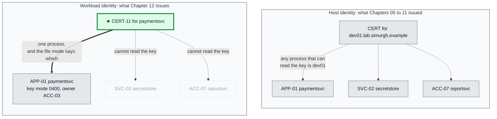
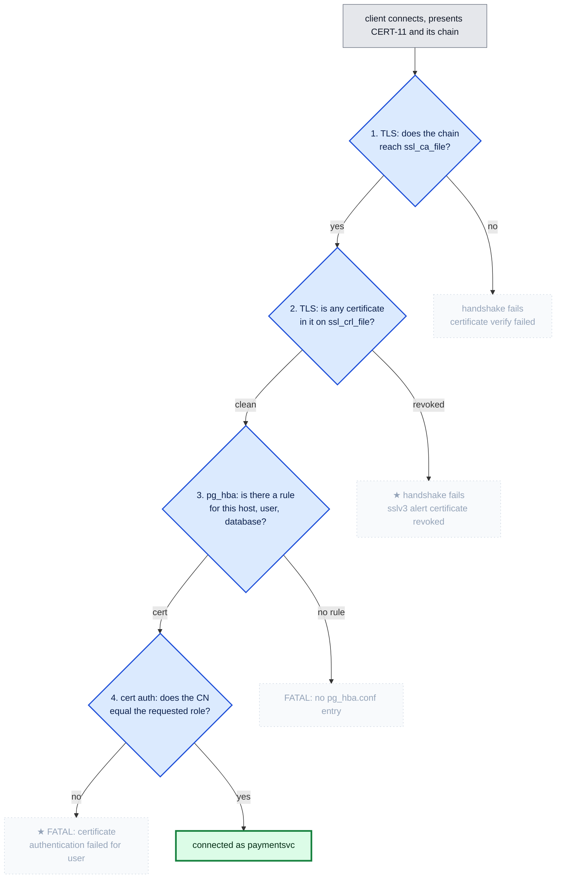
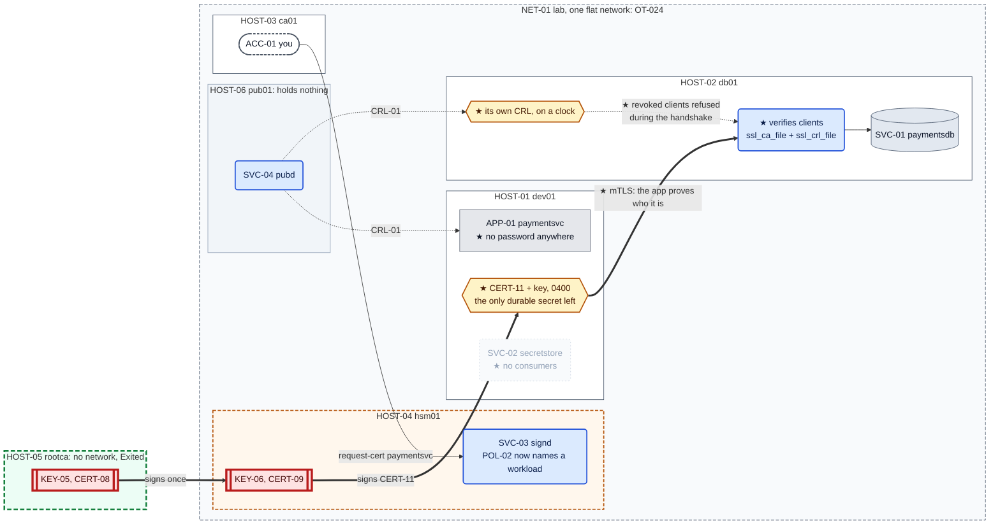

# Chapter 12 — The application stops holding a password

## The system before this chapter

Six machines, a two-tier PKI, revocation that works, a pipeline that keeps it fed, and an
endpoint that reports how much margin is left.

And an application that logs into its database with a password, exactly as it did in Chapter 01.

## The pressure

`OT-019`, open since Chapter 04: **the database still authenticates the application with a
password.** Everything built since then has been about certificates, and the one connection that
matters to the business has not used them.

`OT-006` stands behind it, open since Chapter 01: the credential lives in the application's
memory for the life of the process.

The two are not the same problem and this chapter closes one of them. Be clear about which,
because the difference is the honest half of this chapter and the reason there is a Chapter 13.

---

## 0. If your output differs

Serials, dates and container IDs will differ. This chapter installs packages into running
containers, which needs the lab to have network access.

```bash
cd "chapters/Chapter 12/lab"
ls
```

Expected: `docker-compose.yml`, and the directories `dev01/`, `db01/`, `ca01/`, `hsm01/`,
`rootca/` and `pub01/`.

### The lab in full

What **this** chapter writes is marked ★:

```
lab/
├── docker-compose.yml                Chapter 10
├── dev01/
│   ├── Dockerfile                    Chapter 01
│   ├── entrypoint.sh                 Chapter 01
│   ├── initdb.sql                    Chapter 01
│   ├── fetch-crl.py                  Chapter 10
│   ├── crl-status.py                 Chapter 11
│   ├── crontab                       Chapter 11
│   ├── app/
│   │   ├── config.yaml             ★ changed: an identity, and no password anywhere
│   │   └── paymentsvc.py           ★ changed: connects with a certificate
│   └── secretstore/
│       ├── secretstore.py            Chapter 03
│       ├── secretstore-set.py        Chapter 02
│       └── policy.json               Chapter 03
├── db01/
│   ├── Dockerfile                    Chapter 04
│   ├── entrypoint.sh                 Chapter 04
│   ├── impostor.py                   Chapter 04
│   └── crontab                     ★ new: the database becomes a verifier and needs a CRL
├── ca01/
│   ├── Dockerfile                    Chapter 07
│   ├── entrypoint.sh                 Chapter 07
│   └── request-cert.sh               Chapter 08
├── hsm01/
│   ├── Dockerfile                    Chapter 07
│   ├── entrypoint.sh                 Chapter 07
│   ├── hsm-init.sh                   Chapter 07
│   ├── ica-init.sh                   Chapter 08
│   ├── sign-leaf.sh                  Chapter 10
│   ├── signd.py                      Chapter 10
│   ├── stop-signd.sh                 Chapter 08
│   ├── policy.json                 ★ changed: a workload name joins the policy
│   ├── ca.cnf                        Chapter 09
│   ├── crl-refresh.sh                Chapter 09
│   ├── revoke-cert.sh                Chapter 09
│   └── crontab                       Chapter 11
├── rootca/                           Chapter 09, unchanged
└── pub01/                            Chapter 11, unchanged
```

### Before you start

```bash
sudo docker start db01 ca01 hsm01 dev01 pub01
sudo docker exec -d -u signd hsm01 \
    sh -c 'python3 /usr/local/bin/signd >>/var/log/signd.out 2>&1'
sudo docker exec -d -u pub pub01 sh -c 'python3 /usr/local/bin/pubd >>/var/log/pubd.out 2>&1'
for h in hsm01 pub01 dev01; do sudo docker exec -d $h cron; done
sleep 2
sudo docker exec dev01 sh -c '
  for i in $(seq 1 30); do pg_isready -q -h 127.0.0.1 -p 5432 && break; sleep 1; done
  pg_ctlcluster 15 main stop'
sudo docker exec -d -u secretstore dev01 \
    sh -c 'python3 /opt/secretstore/secretstore.py >>/var/log/secretstore.out 2>&1'
sleep 1
sudo docker exec -d -u paymentsvc dev01 \
    sh -c 'python3 /opt/paymentsvc/paymentsvc.py >>/var/log/paymentsvc.out 2>&1'
sleep 2
curl -s http://127.0.0.1:8080/payments/1001/status
curl -s http://127.0.0.1:8080/healthz; echo
```

Expected: the payment record, and `{"status": "ok", ...}` with both lists reported `ok`.

---

## 1. What the password actually costs

The application authenticates like this today:

```bash
curl -s http://127.0.0.1:8080/credinfo; echo
```

Expected: `"db_user": "paymentsvc_a"` or `_b`, a `credential_version`, and `"sslmode":
"verify-full"`.

That is Chapter 02's design and it works. Two login roles, one live at a time, rotated by
`PROC-01` in six steps with no outage, fetched from `SVC-02` over a Unix socket by a process the
kernel identifies. Nothing about it is careless.

**And it has one property nothing above can fix: the database knows the secret.**

```bash
sudo docker exec db01 su postgres -c \
    "psql -tAc \"SELECT rolname, substring(rolpassword,1,14) FROM pg_authid \
     WHERE rolname LIKE 'paymentsvc%'\""
```

Expected: the two login roles and the beginning of a `SCRAM-SHA-256$` verifier for each.

That is not the password, and SCRAM is a real improvement over storing one: what is on disk is a
salted, iterated verifier, and Chapter 01 §5 measured that the password itself never crosses the
wire. But the shape of the thing has not changed. **Two parties have to agree on a value.** The
application holds it, the database holds something derived from it, and a compromise of either
end is a compromise of the credential.

Everything `PROC-01` does is an attempt to make that survivable: rotate often, keep two roles so
there is no window, verify convergence before retiring the old one. Six steps, two roles, one
store, one policy, all of it in service of a shared value.

**The alternative is not a better secret. It is not sharing one.** A private key is held by
exactly one party. The database can verify a signature made with it and has never seen it, cannot
leak it, and cannot be made to give it up under any amount of compromise. That is a property no
rotation schedule buys.

We have had the machinery to do this since Chapter 05.

---

## 2. The identity moves from the machine to the workload

There is a shift here that is easy to miss because the mechanism is familiar.

Every certificate this estate has issued names a **machine**: `db01.lab.simurgh.example`,
`hsm01.lab.simurgh.example`, `ca01.lab.simurgh.example`. The name is a hostname, the SAN matches
what a client dials, and the identity being asserted is "I am this host".

`APP-01` is not a host. It is a process running as `ACC-03` on `HOST-01`, alongside `SVC-02` and,
in Chapter 03, a deliberately similar `reportsvc` account that exists to prove the store can tell
them apart. A certificate naming `dev01.lab.simurgh.example` would authenticate **the machine**,
and every process on that machine that can read the key would inherit it.

So the certificate is named for the workload: `paymentsvc`.

**Figure 12.1 — what the certificate names**



**Read the dotted lines in the upper box.** A host certificate is a credential every process on
that host shares, limited only by file permissions, which is exactly the argument Chapter 03 made
about `SEC-01` before `SO_PEERCRED` existed.

**And read what the lower box depends on**, because the honesty matters: the separation is a file
mode. `0400` owned by `ACC-03` is what stops `SVC-02` from becoming `paymentsvc`, and root on
`HOST-01` still reads everything. That is `OT-004`, and Chapter 12 does not touch it.

**This is also the shift Kubernetes will force.** A pod has no stable hostname worth naming and
may run anywhere; the thing worth authenticating is the workload. Getting there now, with
certificates we understand, means Stage 4 is a change of mechanism rather than a change of idea.

---

## 3. Give the application an identity

The key is generated where it will be used and never travels. `D-036` and `D-044`, unchanged
since Chapter 05:

```bash
sudo docker exec -u paymentsvc dev01 sh -c '
  openssl ecparam -name prime256v1 -genkey -noout -out /opt/paymentsvc/client.key
  chmod 0400 /opt/paymentsvc/client.key
  openssl req -new -key /opt/paymentsvc/client.key \
      -out /tmp/paymentsvc.csr -subj "/CN=paymentsvc"
  ls -l /opt/paymentsvc/client.key'
```

Expected: `-r--------  1 paymentsvc paymentsvc ... client.key`.

**`/opt/paymentsvc` is root-owned**, and `ACC-03` can still write `client.key` into it because
Chapter 01 gave that account ownership of its own files there. The CSR goes to `/tmp` because it
is public and about to travel.

The authority will not issue this yet. `POL-02` decides who may ask for which name, and nobody
has ever asked for `paymentsvc`:

```bash
sudo docker cp dev01:/tmp/paymentsvc.csr /tmp/paymentsvc.csr
sudo docker cp /tmp/paymentsvc.csr ca01:/opt/ca-client/requests/paymentsvc.csr
sudo docker exec ca01 chown ca:ca /opt/ca-client/requests/paymentsvc.csr
sudo docker exec -u ca ca01 request-cert /opt/ca-client/requests/paymentsvc.csr paymentsvc
```

Expected:

```
request-cert: refused or unreachable:
{"error": "denied", "you_are": "ca01.lab.simurgh.example", "requested": "paymentsvc",
"detail": "POL-02 does not permit this caller to request this name"}
```

**That refusal is the system working**, and it is worth pausing on. The request was authentic,
the caller was who it claimed to be, and the name was refused because nobody had decided that
`ca01` may speak for a workload. Chapter 07 built that gate and this is the first time it has
said no to a legitimate request.

Add the rule:

```json
{
  "ca01.lab.simurgh.example": [
    "db01.lab.simurgh.example",
    "paymentsvc"
  ]
}
```

```bash
sudo docker cp hsm01/policy.json hsm01:/etc/signd/policy.json
sudo docker exec hsm01 chmod 0644 /etc/signd/policy.json
sudo docker exec -u ca ca01 request-cert /opt/ca-client/requests/paymentsvc.csr paymentsvc
```

Expected: `leaf:` and `chain:` lines, `subject=CN = paymentsvc`, and `issuer=CN = Simurgh Lab
Issuing CA 1`.

**`POL-02` is re-read on every request**, which Chapter 07 chose deliberately, so no restart was
needed. Note also what the policy now contains: a hostname and a workload name, side by side,
with nothing in the file marking which is which. That is `OT-016`'s complaint arriving at
`POL-02`.

Install it:

```bash
sudo docker cp ca01:/opt/ca-client/issued/paymentsvc.chain.crt /tmp/client.crt
sudo docker cp /tmp/client.crt dev01:/opt/paymentsvc/client.crt
sudo docker exec dev01 sh -c '
  chown paymentsvc:paymentsvc /opt/paymentsvc/client.crt
  chmod 0444 /opt/paymentsvc/client.crt
  openssl x509 -in /opt/paymentsvc/client.crt -noout -subject -ext extendedKeyUsage
  grep -c "BEGIN CERTIFICATE" /opt/paymentsvc/client.crt'
```

Expected: `subject=CN = paymentsvc`, `TLS Web Client Authentication`, and `2`.

**Two certificates in the file**, because `sign-leaf` writes the chain and `D-064` says the chain
travels with the certificate. `§5` explains why that matters less here than it did in Chapter 10,
and why we do it anyway.

---

## 4. The database becomes a verifier

`db01` has never checked a client certificate. Giving it that job means giving it three things it
does not have: the anchors, a revocation list, and a way to keep the list fresh.

### 4.1 The third runtime install, and the argument it settles

```bash
sudo docker exec db01 sh -c 'apt-get update -qq >/dev/null 2>&1 && \
    DEBIAN_FRONTEND=noninteractive apt-get install -y -qq --no-install-recommends \
    python3 cron >/dev/null 2>&1; command -v python3 cron'
```

Expected: `/usr/bin/python3` and `/usr/sbin/cron`.

**That is the third chapter in a row to install something into a running container.** Chapter 10
added a listener to `hsm01`, Chapter 11 added `cron` to three machines, and this adds `python3`
and `cron` to a fourth. Every one of them was forced by the same fact: `hsm01` cannot be rebuilt
without destroying `KEY-06`, so nothing is ever rebuilt, so the `Dockerfile`s describe a system
that has not existed for three chapters.

`OT-020` has stopped being a tidiness complaint. **A reconciliation pass follows this chapter**,
and it will bring every `Dockerfile` up to date with what its machine contains without rebuilding
anything, because the substrate definition may reset freely and the system state may not.

### 4.2 The anchors and the list

```bash
sudo docker exec db01 sh -c '
  mkdir -p /var/lib/postgresql/crl
  chown postgres:postgres /var/lib/postgresql/crl
  curl -sS -o /etc/postgresql/15/main/ca-bundle.pem \
      http://pub01.lab.simurgh.example/ca-bundle.pem
  chown postgres:postgres /etc/postgresql/15/main/ca-bundle.pem
  chmod 0644 /etc/postgresql/15/main/ca-bundle.pem
  grep -c "BEGIN CERTIFICATE" /etc/postgresql/15/main/ca-bundle.pem'
```

Expected: `2`, the root and the intermediate.

Deploy the agent and put it on a clock:

```bash
sudo docker cp dev01/fetch-crl.py  db01:/usr/local/bin/fetch-crl
sudo docker cp dev01/crl-status.py db01:/usr/local/bin/crl-status
sudo docker cp db01/crontab        db01:/var/lib/postgresql/crontab
sudo docker exec db01 sh -c '
  chmod 0755 /usr/local/bin/fetch-crl /usr/local/bin/crl-status
  chown postgres:postgres /var/lib/postgresql/crontab
  crontab -u postgres /var/lib/postgresql/crontab'
sudo docker exec -d db01 cron
sudo docker exec -u postgres db01 fetch-crl \
    --url http://pub01.lab.simurgh.example/crl.pem \
    --anchors /etc/postgresql/15/main/ca-bundle.pem \
    --install /var/lib/postgresql/crl/crl.pem \
    --state /var/lib/postgresql/crl/state.json
```

Expected: `installed: /var/lib/postgresql/crl/crl.pem`, with both authorities and their numbers.

```
# The database, on a timer. Installed for `postgres` on HOST-02.
#
#   crontab -u postgres /var/lib/postgresql/crontab
#
# WHY THE DATABASE NOW HAS A CRON JOB AT ALL. From Chapter 12 db01 verifies
# client certificates, which means it checks revocation, which means it needs
# a current CRL. It has become the estate's second verifier, and a verifier
# that cannot get a fresh list is a verifier that refuses everybody.
#
# That is the half of OT-037 this chapter closes and the new risk it brings.
# Before Chapter 12, a stale CRL on db01 was impossible because db01 had no
# CRL. Now a stale one takes the database offline for every client at once,
# which is a larger blast radius than the same failure on dev01.
#
# EVERY THIRTY MINUTES, matching dev01. Both are clients of the same
# publication point with the same seven day list, and there is no reason for
# them to disagree about how far behind they are willing to be.
#
# WHAT IS MISSING, and it is deliberate rather than forgotten: nothing on
# this machine reports how much life the installed list has left. dev01 has
# /healthz because APP-01 is an HTTP service that was already being polled.
# PostgreSQL is not, so the same question has to be asked from outside, by
# hand, with crl-status. OT-040 on a second machine.
SHELL=/bin/sh
PATH=/usr/local/bin:/usr/bin:/bin

*/30 * * * * fetch-crl --url http://pub01.lab.simurgh.example/crl.pem --anchors /etc/postgresql/15/main/ca-bundle.pem --install /var/lib/postgresql/crl/crl.pem --state /var/lib/postgresql/crl/state.json >>/var/lib/postgresql/crl/fetch.out 2>&1
```

**The database now has a dependency it did not have this morning.** If that list goes stale,
PostgreSQL refuses **every** client, not merely revoked ones, which is Chapter 09's measurement
arriving on a machine with a much larger blast radius than `dev01`.

### 4.3 Turn verification on

```bash
sudo docker exec db01 sh -c '
  cat >> /etc/postgresql/15/main/postgresql.conf <<CONF

# Chapter 12: db01 verifies its clients.
ssl_ca_file = "/etc/postgresql/15/main/ca-bundle.pem"
ssl_crl_file = "/var/lib/postgresql/crl/crl.pem"
CONF
  sed -i "s|\"|'"'"'|g" /etc/postgresql/15/main/postgresql.conf
  tail -4 /etc/postgresql/15/main/postgresql.conf'
sudo docker exec db01 pg_ctlcluster 15 main restart
sudo docker exec db01 su postgres -c "psql -tAc \"SHOW ssl_ca_file\""
sudo docker exec db01 su postgres -c "psql -tAc \"SHOW ssl_crl_file\""
```

Expected: the two paths.

**Nothing has changed for the application yet.** `pg_hba` still says `scram-sha-256`, so the
password path still works and the certificate is not being asked for. That is deliberate: the
verifier is switched on before anything depends on it, so a mistake here is discovered while the
old path still functions.

```bash
curl -s http://127.0.0.1:8080/payments/1001/status
```

Expected: the payment record, still authenticated by password.

---

## 5. Make it fail: a certificate that names the wrong thing

Before switching `pg_hba`, understand exactly what PostgreSQL will check, because two of the
three checks are not where you would look for them.

Ask `ca01` for a certificate naming the **database**, which `POL-02` has permitted since Chapter
07, and try to log in as `paymentsvc` with it:

```bash
sudo docker exec -u paymentsvc dev01 sh -c '
  openssl ecparam -name prime256v1 -genkey -noout -out /tmp/wrong.key
  chmod 0400 /tmp/wrong.key
  openssl req -new -key /tmp/wrong.key -out /tmp/wrong.csr \
      -subj "/CN=db01.lab.simurgh.example"'
sudo docker cp dev01:/tmp/wrong.csr /tmp/wrong.csr
sudo docker cp /tmp/wrong.csr ca01:/opt/ca-client/requests/wrong.csr
sudo docker exec ca01 chown ca:ca /opt/ca-client/requests/wrong.csr
sudo docker exec -u ca ca01 request-cert /opt/ca-client/requests/wrong.csr \
    db01.lab.simurgh.example | head -2
sudo docker cp ca01:/opt/ca-client/issued/db01.lab.simurgh.example.chain.crt /tmp/wrong.crt
sudo docker cp /tmp/wrong.crt dev01:/tmp/wrong.crt
```

Expected: an issued certificate. **`POL-02` allowed this**, because `ca01` is permitted to
request the database's name and always has been.

Switch `pg_hba` to certificate authentication and try it:

```bash
sudo docker exec db01 sh -c '
  cp /etc/postgresql/15/main/pg_hba.conf /etc/postgresql/15/main/pg_hba.conf.scram
  sed -i "s|^hostssl.*scram-sha-256|hostssl paymentsdb paymentsvc all cert clientcert=verify-full|" \
      /etc/postgresql/15/main/pg_hba.conf
  grep -v "^#" /etc/postgresql/15/main/pg_hba.conf | grep -v "^$"'
sudo docker exec db01 pg_ctlcluster 15 main reload
sudo docker exec db01 su postgres -c "psql -tAc \"ALTER ROLE paymentsvc LOGIN\""
sudo docker exec -u paymentsvc dev01 sh -c '
  PGSSLCERT=/tmp/wrong.crt PGSSLKEY=/tmp/wrong.key \
  PGSSLROOTCERT=/opt/paymentsvc/ca.crt \
  psql "host=db01.lab.simurgh.example dbname=paymentsdb user=paymentsvc sslmode=verify-full" \
       -tAc "select 1"' 2>&1 | tail -2
```

Expected:

```
psql: error: connection to server at "db01.lab.simurgh.example" (172.x.x.x), port 5432 failed:
FATAL:  certificate authentication failed for user "paymentsvc"
```

**Two gates said yes and one said no, and they were answering different questions.** `POL-02`
decided whether `ca01` may **request** that name. `db01` decided whether this certificate may
**be** `paymentsvc`. An estate that only had the first would let any certificate its own
authority ever issued log in as anything.

That is Chapter 09 §1's lesson pointed at the database, and this time the answer is a refusal
rather than an incident.

### 5.1 What the database checks, and in what order

**Figure 12.2 — three checks, and only one of them is authentication**



**Steps 1 and 2 happen in the TLS handshake, before `pg_hba` is consulted at all.** That was
measured, and it was measured by accident: a spike with a broken `pg_hba` still returned `sslv3
alert certificate revoked`, which places the revocation check unambiguously.

**The consequence is worth stating plainly.** Revocation on this server cannot be weakened by
editing an authentication rule. Somebody who changes `cert` back to `scram-sha-256` has not
disabled revocation checking; they have only changed what happens after it passes. That is an
unusually good property and it is the opposite of where most people would look for it.

---

## 6. The switch

Deploy the application that has no password:

```yaml
# /opt/paymentsvc/config.yaml
database:
  host: db01.lab.simurgh.example
  port: 5432
  name: paymentsdb
  sslmode: verify-full
  # Chapter 12. The role this process logs in as, and there is no password
  # anywhere in this file or in the secret store to go with it.
  #
  # This name has to equal the Common Name of the certificate below.
  # PostgreSQL's `cert` authentication takes the CN and requires it to match
  # the role being requested; measured, a valid certificate naming anything
  # else is refused with `certificate authentication failed for user`.
  #
  # Note what the name is NOT. Every other certificate in this estate is named
  # for a machine. This one is named for a workload, because the thing being
  # authenticated is the application and not the host it happens to run on.
  user: paymentsvc
  # CERT-11 and its key. The certificate is the chain, leaf followed by
  # CERT-09, for the reason every other holder here presents a chain: the
  # server can build the path itself today, and that depends on somebody
  # else's configuration staying right.
  sslcert: /opt/paymentsvc/client.crt
  sslkey: /opt/paymentsvc/client.key
  # Chapter 05: the anchor is the authority, not the server.
  #
  # This was /opt/paymentsvc/db01.crt, a copy of the certificate db01
  # presents. Pinning that meant re-issuing db01's certificate broke this
  # client, which is OT-017. Now it is CERT-02, the root, and db01 can be
  # re-issued as often as it likes without this line or this file changing.
  #
  # The path is the only thing that had to change on the client. That is
  # the whole payoff, and it is a one-time cost.
  sslrootcert: /opt/paymentsvc/ca.crt
  # Chapter 09: check whether the certificate has been taken back.
  #
  # The anchor above answers "did our authority sign this". It cannot answer
  # "does our authority still stand behind it", and those became different
  # questions the moment a credential was stolen. This line is the second
  # question.
  #
  # It is not a free improvement. With this set, libpq refuses any
  # certificate whose revocation status it cannot establish: no file, an
  # unreadable file, or a list past its nextUpdate all stop this application
  # from starting, healthy certificates included. Deleting the line turns
  # revocation checking off and everything works again, which is exactly why
  # it is worth knowing that the line is load-bearing.
  #
  # Chapter 10: moved out of this directory, and the reason is least privilege
  # rather than tidiness. The list is now maintained by fetch-crl, running as
  # `paymentsvc`, and an atomic replace needs a temporary file in the same
  # directory as the target. Granting that here would make /opt/paymentsvc
  # writable by the application, which would let APP-01 rewrite its own
  # configuration, and that has been forbidden since Chapter 01.
  #
  # A revocation list is not configuration. It is state an agent maintains, so
  # it lives where the agent can own it.
  sslcrl: /var/lib/fetch-crl/crl.pem
# Chapter 12: still configured, and no longer used for the database.
#
# SVC-02 has no consumer as of this chapter. That is not a reason to delete
# it, and the chapter says why: a store with nothing in it is the correct
# outcome of removing the thing it was holding, and the next secret this
# estate acquires will want somewhere to live. What it does mean is that
# OT-011, a single point of total compromise holding everything in
# plaintext, currently holds nothing worth compromising.
secret_store:
  socket: /run/secretstore/sock
  secret_name: paymentsvc-db
server:
  listen: 0.0.0.0:8080

# Chapter 11. How close to the deadline counts as a problem.
#
# Two days against the intermediate's seven means two consecutive missed
# refreshes are needed before /healthz goes amber, so a single missed run is
# not an incident and a broken pipeline is. Set it too low and the alarm
# arrives at the same time as the outage, which is the same as no alarm.
crl:
  warn_days: 2
```

```python
#!/usr/bin/env python3
"""APP-01 paymentsvc, answers 'what is the status of payment X?'

Chapter 04 change: SVC-01 now lives on its own machine, so the database
connection crosses a network. It is made with TLS and the server
certificate is verified against a pinned copy, which is what stops anything
that answers on port 5432 from being handed our queries.

The credential still comes from SVC-02 over a Unix socket on this host, and
this process still stores no credential of its own.
"""

import http.client
import json
import logging
import os
import pwd
import socket
import subprocess
import sys
from http.server import BaseHTTPRequestHandler, ThreadingHTTPServer

import psycopg2
import yaml
from psycopg2.extras import RealDictCursor

CONFIG_PATH = os.environ.get("PAYMENTSVC_CONFIG", "/opt/paymentsvc/config.yaml")

logging.basicConfig(
    level=os.environ.get("LOG_LEVEL", "INFO").upper(),
    format="%(asctime)s %(levelname)s %(message)s",
    handlers=[
        logging.FileHandler("/var/log/paymentsvc.log"),
        logging.StreamHandler(sys.stdout),
    ],
)
log = logging.getLogger("paymentsvc")


def load_config(path):
    log.info("loading configuration from %s", path)
    with open(path) as fh:
        cfg = yaml.safe_load(fh)
    log.debug("effective configuration: %s", cfg)
    return cfg


class UnixHTTPConnection(http.client.HTTPConnection):
    """An HTTP client that speaks over a Unix domain socket.

    The only difference from an ordinary HTTPConnection is where connect()
    points. Everything above it, requests, status codes, headers, is
    unchanged, which is why moving SVC-02 off TCP cost so little here.
    """

    def __init__(self, socket_path, timeout=5):
        super().__init__("localhost", timeout=timeout)
        self.socket_path = socket_path

    def connect(self):
        sock = socket.socket(socket.AF_UNIX, socket.SOCK_STREAM)
        sock.settimeout(self.timeout)
        sock.connect(self.socket_path)
        self.sock = sock


def fetch_credential(socket_path, secret_name):
    """Ask SVC-02 for the current database credential.

    We present no token and assert no identity. The kernel tells the store
    our uid when we connect, and the store applies POL-01 to it. If it says
    no, we get a 403 and fail loudly, being refused is not something to
    paper over.
    """
    conn = UnixHTTPConnection(socket_path)
    try:
        conn.request("GET", f"/v1/secrets/{secret_name}")
        resp = conn.getresponse()
        body = resp.read().decode()
        if resp.status == 403:
            raise PermissionError(
                f"secretstore refused this process: {json.loads(body).get('detail')}"
            )
        if resp.status != 200:
            raise RuntimeError(f"secretstore returned {resp.status}: {body}")
        payload = json.loads(body)
    finally:
        conn.close()
    cred = json.loads(payload["value"])
    log.info("fetched %s version %s as user %s",
             secret_name, payload["version"], cred["user"])
    return cred["user"], cred["password"], payload["version"]


def check_crl_usable(path):
    """Refuse to start rather than run with revocation checking silently off.

    THIS FUNCTION EXISTS BECAUSE libpq FAILS OPEN, AND IT WAS MEASURED.

    Naming a CRL is supposed to turn revocation checking on. libpq only turns
    it on if the file loads; if it cannot, the flags are never set, the
    connection succeeds, and a revoked certificate is accepted exactly as
    before. Four ways of being unusable were tested against PostgreSQL 15 and
    all four connected: the file missing, the file unreadable, the file
    containing something that is not a CRL, and the file empty.

    None of them warned. The last is the one that happens in real life: a
    fetch that failed and left a zero-byte file behind, after which the
    estate stops checking revocation and nothing anywhere says so.

    So the application checks on the platform's behalf, and refuses to start
    when the answer is no. That is D-011: a service configured to require a
    protection should fail loudly rather than run without it. A crash at
    startup is a page; a silently disabled security control is a year of
    believing something that is not true.

    Note what is NOT checked here: whether the file carries a list from every
    authority in the chain. libpq fails CLOSED on that one, refusing healthy
    certificates, so it is already loud and needs no help.
    """
    if not os.path.exists(path):
        raise SystemExit(f"sslcrl is set to {path}, which does not exist. "
                         "Refusing to start: revocation checking would be off.")
    if not os.access(path, os.R_OK):
        raise SystemExit(f"sslcrl is set to {path}, which is not readable by "
                         f"{pwd.getpwuid(os.getuid()).pw_name}. Refusing to start.")
    if os.path.getsize(path) == 0:
        raise SystemExit(f"sslcrl is set to {path}, which is empty. "
                         "Refusing to start: a failed download looks exactly like this.")

    # Parse every list in the file and report the issuers, so the log says
    # what is actually being enforced rather than that a setting is spelled.
    proc = subprocess.run(["openssl", "crl", "-in", path, "-noout", "-issuer"],
                          capture_output=True, text=True)
    if proc.returncode != 0:
        raise SystemExit(f"sslcrl is set to {path}, which openssl cannot parse. "
                         "Refusing to start.")
    log.info("CRL file %s parses, first issuer %s", path, proc.stdout.strip())


class Database:
    """Owns the connection and the credential it was made with."""

    def __init__(self, cfg):
        self.cfg = cfg
        self.conn = None
        self.user = None
        self.version = None
        self.connect()

    def connect(self):
        """Open the connection. CHAPTER 12: WITH NO PASSWORD AT ALL.

        Everything above this line about fetching a credential is still here,
        still correct, and no longer used for the database. SEC-02 and SEC-03
        are retired: what proves who this process is now is a private key it
        holds and a certificate our own authority signed, and the database
        checks both at the TLS layer before it looks at any authentication
        rule.

        Read what has NOT improved, because it is the honest half. There is
        still exactly one durable secret on this host, it still lives for the
        life of the process, and it is still readable by root. It changed
        shape from a password fetched at startup into a private key read at
        startup, which is a different object with the same lifecycle. OT-006
        is not closed by this chapter, it is renamed.

        What DID improve is that the secret is no longer shared. A password
        is a thing two parties know; a private key is a thing one party has.
        The database has never seen this key and cannot leak it, which is the
        property no amount of rotation could buy.
        """
        db = self.cfg["database"]
        user = db["user"]
        conn_args = dict(
            host=db["host"], port=db["port"], dbname=db["name"],
            user=user,
            # No password= at all. Not an empty one: absent. If pg_hba on the
            # far side ever falls back to a password method, this connection
            # fails rather than quietly negotiating something weaker, which
            # is the same argument as sslmode=verify-full over require.
            sslmode=db["sslmode"],
            # The identity. sslcert is presented during the handshake and
            # PostgreSQL matches its Common Name against the role named
            # above; measured, they must agree or it refuses with
            # `certificate authentication failed for user "..."`.
            sslcert=db["sslcert"], sslkey=db["sslkey"],
        )
        # The anchor is optional, and leaving it out is not neutral. libpq
        # verifies the server certificate whenever a root CA file is
        # present, even under sslmode=require, so naming one here makes a
        # weak-looking config stronger than it reads. Section 7 is what
        # happens when the line is missing and nobody noticed it mattered.
        if db.get("sslrootcert"):
            conn_args["sslrootcert"] = db["sslrootcert"]
        # Chapter 09. Naming a CRL turns revocation checking ON, and that is
        # not a small switch: libpq then refuses any certificate it cannot
        # check, not merely the ones that were revoked. A missing file, an
        # unreadable one, or a list whose nextUpdate has passed all stop this
        # application from starting. That is correct and it is expensive, and
        # section 7 is what it looks like when nobody refreshed the list.
        if db.get("sslcrl"):
            check_crl_usable(db["sslcrl"])
            conn_args["sslcrl"] = db["sslcrl"]
        # The key file's mode is checked by libpq, not by us, and the error
        # is one of the clearest in this build: `private key file ... has
        # group or world access; file must have permissions u=rw (0600) or
        # less`. Nothing here needs to duplicate it.
        self.conn = psycopg2.connect(**conn_args)
        self.conn.autocommit = True
        self.user, self.version = user, "certificate"
        log.info("connected to %s@%s:%s/%s (auth %s, sslmode %s, crl %s)",
                 user, db["host"], db["port"], db["name"], "certificate",
                 db["sslmode"], "on" if db.get("sslcrl") else "off")

    def query(self, sql, args):
        """Run a query; on a connection-level failure, re-fetch and retry once."""
        try:
            return self._query(sql, args)
        except psycopg2.OperationalError as exc:
            log.warning("connection failed (%s), re-fetching credential", exc)
            self.connect()
            return self._query(sql, args)

    def _query(self, sql, args):
        with self.conn.cursor(cursor_factory=RealDictCursor) as cur:
            cur.execute(sql, args)
            return cur.fetchone()


cfg = load_config(CONFIG_PATH)
database = Database(cfg)


class Handler(BaseHTTPRequestHandler):
    server_version = "paymentsvc/0.4"

    def _json(self, code, payload):
        body = json.dumps(payload).encode()
        self.send_response(code)
        self.send_header("Content-Type", "application/json")
        self.send_header("Content-Length", str(len(body)))
        self.end_headers()
        self.wfile.write(body)

    def do_GET(self):
        if self.path == "/healthz":
            # CHAPTER 11: THIS ENDPOINT FINALLY ANSWERS A QUESTION.
            #
            # Until now it returned a hardcoded ok, and the book complained
            # about it twice: Chapter 08 section 10 found it reporting healthy
            # while the application could not reach its database at all, and
            # Chapter 10 section 0 warned against using it as a state check.
            #
            # It is not being given a database probe. That was the right call
            # and stays: a health endpoint that opens a connection turns every
            # poll into load, and Chapter 08's complaint was that it claimed
            # more than it knew, not that it knew too little.
            #
            # What it reports now is the one thing about this process that
            # degrades silently and takes the estate down with it: how much
            # life is left in the revocation list. Measured in Chapter 11, a
            # cron job that stops working leaves no trace anywhere, so the job
            # cannot be the thing that is watched. The artefact can.
            #
            # It shells out to crl-status rather than reimplementing it, for
            # the reason SVC-03 shells out to sign-leaf: two copies of a rule
            # about expiry is one copy too many, and the one that drifts will
            # be the one nobody runs by hand.
            crl = cfg["database"].get("sslcrl")
            if not crl:
                return self._json(200, {"status": "ok", "crl_checking": False})
            proc = subprocess.run(
                ["/usr/local/bin/crl-status", "--crl", crl,
                 "--warn-days", str(cfg.get("crl", {}).get("warn_days", 2))],
                capture_output=True, text=True)
            detail = [ln for ln in proc.stdout.splitlines() if ln.strip()]
            if proc.returncode == 0:
                return self._json(200, {"status": "ok", "crl": detail})
            # 503, not 200 with a flag. A monitoring system reads the status
            # line; a field inside a 200 is a thing somebody has to remember
            # to look at, which is the failure this whole chapter is about.
            return self._json(503, {"status": "degraded", "crl": detail})

        if self.path == "/credinfo":
            return self._json(200, {
                "db_user": database.user,
                "secret_name": cfg["secret_store"]["secret_name"],
                # Chapter 12: there is no credential version any more,
                # because there is no credential. What identifies this
                # process is a certificate, so report that instead.
                "auth_method": database.version,
                "client_cert": cfg["database"].get("sslcert"),
                "running_as": pwd.getpwuid(os.getuid()).pw_name,
                "uid": os.getuid(),
                "db_host": cfg["database"]["host"],
                "sslmode": cfg["database"]["sslmode"],
                # Chapter 09: whether this client is checking revocation at
                # all. Worth exposing, because the difference between
                # checking and not checking is invisible from the outside
                # and is the difference between refusing a revoked
                # certificate and accepting one.
                # Effect, not intent. Reporting that a setting is spelled
                # would be the Chapter 08 /healthz defect again: with an
                # unusable file libpq checks nothing while the config still
                # says sslcrl. The process refuses to start in that case, so
                # if this says true it is true.
                "crl_checking": bool(cfg["database"].get("sslcrl")),
            })

        parts = self.path.strip("/").split("/")
        if len(parts) == 3 and parts[0] == "payments" and parts[2] == "status":
            try:
                payment_id = int(parts[1])
            except ValueError:
                return self._json(400, {"error": "payment id must be an integer"})
            row = database.query(
                "SELECT id, reference, amount_cents, currency, status "
                "FROM payments WHERE id = %s",
                (payment_id,),
            )
            if row is None:
                return self._json(404, {"error": "no such payment"})
            return self._json(200, dict(row))

        return self._json(404, {"error": "not found"})

    def log_message(self, fmt, *args):
        log.info("%s %s", self.address_string(), fmt % args)


if __name__ == "__main__":
    host, _, port = cfg["server"]["listen"].rpartition(":")
    srv = ThreadingHTTPServer((host, int(port)), Handler)
    log.info("listening on %s", cfg["server"]["listen"])
    srv.serve_forever()
```

```bash
sudo docker cp dev01/app/config.yaml   dev01:/opt/paymentsvc/config.yaml
sudo docker cp dev01/app/paymentsvc.py dev01:/opt/paymentsvc/paymentsvc.py
sudo docker exec dev01 sh -c '
  chown paymentsvc:paymentsvc /opt/paymentsvc/config.yaml /opt/paymentsvc/paymentsvc.py
  chmod 0400 /opt/paymentsvc/config.yaml
  chmod 0444 /opt/paymentsvc/paymentsvc.py'
sudo docker exec dev01 pkill -f 'python3 /opt/paymentsvc/paymentsvc.py' || true
sudo docker exec -d -u paymentsvc dev01 \
    sh -c 'python3 /opt/paymentsvc/paymentsvc.py >>/var/log/paymentsvc.out 2>&1'
sleep 2
curl -s http://127.0.0.1:8080/payments/1001/status
curl -s http://127.0.0.1:8080/credinfo; echo
```

Expected: the payment record, and `"db_user": "paymentsvc"`, `"auth_method": "certificate"`,
`"client_cert": "/opt/paymentsvc/client.crt"`.

Confirm from the database's side, which is the view that cannot be faked by the client:

```bash
sudo docker exec db01 su postgres -c \
    "psql -tAc \"SELECT usename, ssl, client_dn, issuer_dn FROM pg_stat_ssl \
     JOIN pg_stat_activity USING (pid) WHERE usename = 'paymentsvc'\""
```

Expected: `paymentsvc|t|CN=paymentsvc|CN=Simurgh Lab Issuing CA 1`.

**The database is recording who connected and which authority vouched for them**, which is
something a password connection could never tell it. `SVC-02` has logged consumer identity since
Chapter 03; this is the first time `SVC-01` can.

### 6.1 The file mode, which libpq checks and we do not

```bash
sudo docker exec dev01 sh -c 'chmod 0644 /opt/paymentsvc/client.key'
sudo docker exec dev01 pkill -f 'python3 /opt/paymentsvc/paymentsvc.py' || true
sudo docker exec -u paymentsvc dev01 python3 /opt/paymentsvc/paymentsvc.py 2>&1 | tail -3
sudo docker exec dev01 sh -c 'chmod 0400 /opt/paymentsvc/client.key'
```

Expected, ending in:

```
private key file "/opt/paymentsvc/client.key" has group or world access; file must have
permissions u=rw (0600) or less if owned by the current user, or permissions u=rw,g=r (0640)
or less if owned by root
```

**That is one of the clearest errors in this build**, and it is worth noticing what it does not
do: it does not warn and continue. A private key that others can read is treated as a
configuration error rather than a risk to be accepted, which is the behaviour Chapter 09 had to
write by hand for the CRL because libpq would not do it there.

Restart the application:

```bash
sudo docker exec -d -u paymentsvc dev01 \
    sh -c 'python3 /opt/paymentsvc/paymentsvc.py >>/var/log/paymentsvc.out 2>&1'
sleep 2
curl -s http://127.0.0.1:8080/payments/1001/status
```

Expected: the payment record.

---

## 7. Make it fail: revoke the application

The estate has been able to revoke certificates since Chapter 09 and it has never protected
anything the business depends on. It does now.

```bash
sudo docker cp dev01:/opt/paymentsvc/client.crt /tmp/appcert.crt
sudo docker cp /tmp/appcert.crt hsm01:/var/lib/ca/requests/appcert.crt
sudo docker exec hsm01 chown signd:signd /var/lib/ca/requests/appcert.crt
sudo docker exec -u signd hsm01 sh -c '
  awk "/BEGIN/{n++} n==1" /var/lib/ca/requests/appcert.crt > /var/lib/ca/requests/appleaf.crt'
sudo docker exec -u signd hsm01 \
    revoke-cert /var/lib/ca/requests/appleaf.crt keyCompromise | tail -4
```

Expected: the republished list, and one more revoked entry.

Push it through the pipeline to the machine that will act on it:

```bash
sudo docker exec -u pub pub01 pull-artifacts --from http://hsm01.lab.simurgh.example:8080 --once
sudo docker exec -u postgres db01 fetch-crl \
    --url http://pub01.lab.simurgh.example/crl.pem \
    --anchors /etc/postgresql/15/main/ca-bundle.pem \
    --install /var/lib/postgresql/crl/crl.pem \
    --state /var/lib/postgresql/crl/state.json | head -1
sudo docker exec db01 pg_ctlcluster 15 main reload
sleep 1
sudo docker exec dev01 pkill -f 'python3 /opt/paymentsvc/paymentsvc.py' || true
sudo docker exec -u paymentsvc dev01 python3 /opt/paymentsvc/paymentsvc.py 2>&1 | tail -3
```

Expected, ending in:

```
psycopg2.OperationalError: connection to server at "db01.lab.simurgh.example" (172.x.x.x),
port 5432 failed: SSL error: sslv3 alert certificate revoked
```

**`sslv3 alert certificate revoked`, and read where it came from.** That is the **server**
speaking during the handshake. The client was not consulted, `pg_hba` was not reached, and no
authentication rule was involved. `db01` was told this certificate had been withdrawn and refused
to continue.

**This is the first time in twelve chapters that revoking something has protected the application
path.** Chapters 09, 10 and 11 built the register, the publication point, the agent and the
clock, and every one of them protected the authority's own connections. The work only becomes
valuable at the moment a second verifier uses it.

`OT-037` is half closed: two of three verifiers now check. `SVC-03` still does not.

Issue a replacement, which is what an incident actually looks like:

```bash
sudo docker exec -u paymentsvc dev01 sh -c '
  openssl ecparam -name prime256v1 -genkey -noout -out /opt/paymentsvc/client.key.new
  chmod 0400 /opt/paymentsvc/client.key.new
  openssl req -new -key /opt/paymentsvc/client.key.new \
      -out /tmp/paymentsvc2.csr -subj "/CN=paymentsvc"'
sudo docker cp dev01:/tmp/paymentsvc2.csr /tmp/paymentsvc2.csr
sudo docker cp /tmp/paymentsvc2.csr ca01:/opt/ca-client/requests/paymentsvc.csr
sudo docker exec ca01 chown ca:ca /opt/ca-client/requests/paymentsvc.csr
sudo docker exec -u ca ca01 request-cert /opt/ca-client/requests/paymentsvc.csr paymentsvc | head -1
sudo docker cp ca01:/opt/ca-client/issued/paymentsvc.chain.crt /tmp/client2.crt
sudo docker cp /tmp/client2.crt dev01:/opt/paymentsvc/client.crt
sudo docker exec dev01 sh -c '
  mv /opt/paymentsvc/client.key.new /opt/paymentsvc/client.key
  chown paymentsvc:paymentsvc /opt/paymentsvc/client.crt /opt/paymentsvc/client.key
  chmod 0444 /opt/paymentsvc/client.crt
  chmod 0400 /opt/paymentsvc/client.key'
sudo docker exec -d -u paymentsvc dev01 \
    sh -c 'python3 /opt/paymentsvc/paymentsvc.py >>/var/log/paymentsvc.out 2>&1'
sleep 2
curl -s http://127.0.0.1:8080/payments/1001/status
```

Expected: the payment record.

**A new key, a new certificate, the same name, and nothing on `db01` changed.** No role was
altered, no password was set, no rotation procedure ran and no second identity was needed. The
database's configuration is a statement about *who may connect*, and it did not have to know that
the answer had been re-issued.

---

## 8. What was retired, and why that is the point

Four objects and one procedure stop being needed. Retire them properly rather than leaving them
lying around:

```bash
sudo docker exec db01 su postgres -c "psql -q -c \"DROP ROLE IF EXISTS paymentsvc_a\""
sudo docker exec db01 su postgres -c "psql -q -c \"DROP ROLE IF EXISTS paymentsvc_b\""
sudo docker exec db01 su postgres -c \
    "psql -tAc \"SELECT rolname, rolcanlogin FROM pg_authid WHERE rolname LIKE 'paymentsvc%'\""
```

Expected: one row, `paymentsvc|t`.

| Retired | Was | Why it is gone |
|---|---|---|
| `SEC-02`, `SEC-03` | the two rotating database passwords | there is no shared secret to rotate |
| `ACC-05`, `ACC-06` | `paymentsvc_a` and `paymentsvc_b` | they existed only so one could be changed while the other served |
| `PROC-01` | the six-step zero-downtime rotation | replaced by issuing a certificate, which needs no coordination at all |

**Chapter 02 was not wrong.** Given a shared password, every step of `PROC-01` was necessary, and
the two-role dance is the correct answer to "how do I change a value two parties must agree on,
without a window where neither works". The complexity was real and it was in service of a
constraint.

**Remove the constraint and the complexity evaporates.** That is the more valuable lesson, and it
is one this build could only teach by living with the password for eleven chapters first. A
reader told in Chapter 02 that certificates would be simpler would have learned a slogan. A
reader who built `PROC-01`, ran it, verified convergence, and then watched all of it become
unnecessary has learned something about where complexity comes from.

**`SVC-02` now has no consumers.** It is still running, still holds `POL-01`, and holds nothing
the estate needs. That is not a reason to delete it, and it does mean `OT-011`, a single point of
total compromise holding everything in plaintext, currently holds nothing worth compromising. The
next secret this estate acquires will want somewhere to live.

---

## 9. What this bought, and what it did not

**Bought.** The database and the application no longer share a value. `SVC-01` records who
connected and which authority vouched for them. A compromised credential can be withdrawn and the
withdrawal is enforced by the server during the handshake, where no authentication rule can
weaken it. Replacing the credential is one command and touches nothing on the database.

**Not bought, and the first of these is the important one.**

**`OT-006` is renamed, not closed.** There is still exactly one durable secret on `HOST-01`, it
is still read at startup and held for the life of the process, and root still reads it. A
password became a private key: a different object with the same lifecycle. Nothing here fetches a
credential at run time, uses it, and discards it. `OT-006` stays open and is now the clearest gap
in the build.

**The separation between workloads is a file mode.** `0400` owned by `ACC-03` is what stops
`SVC-02` becoming `paymentsvc`. That is `OT-004`, untouched since Chapter 01.

**`db01` acquired a dependency it cannot report on.** If its CRL goes stale, PostgreSQL refuses
every client at once. `dev01` has `/healthz` because `APP-01` was already being polled;
PostgreSQL is not, so the same question has to be asked by hand. `OT-041`.

**`POL-02` now mixes hostnames and workload names** with nothing distinguishing them, and one
rule grants both. `OT-016` and `OT-023`, on a policy that has just become more powerful.

**And `SVC-03` still checks no revocation.** The authority is the last verifier that does not.
`OT-037`, half closed.

---

## 10. What just changed in the architecture

**Figure 12.3 — after Chapter 12**



**`SVC-02` is drawn dotted for the first time.** It has not been removed and has nothing to do,
which is what happens to a component when the problem it existed for is solved somewhere else.

**`HOST-02` gained a blue box.** The database decides something now: whether the certificate in
front of it is one this estate still stands behind. It is the second verifier in the estate and
the first one whose refusals protect the business.

**The thick edge from the application to the database** is the one that mattered from Chapter 01
and it finally carries an identity rather than a shared value.

### Current one-line state

Six machines. The application authenticates to its database with a certificate naming the
workload rather than the host, issued by an intermediate whose root is switched off, checked by a
database that verifies the chain and the revocation list during the handshake. No password exists
anywhere in the path. One durable secret remains on `HOST-01`, held for the life of the process,
and nothing fetches, uses and discards anything.

---

## 11. Decisions we made (and what would change them)

| ID | Decision |
|---|---|
| `D-084` | The certificate names the workload, not the host |
| `D-085` | `db01` verifies clients, which makes it the estate's second verifier |
| `D-086` | One login role, not two |
| `D-087` | `SVC-02` stays, with nothing in it |

**`D-084`, and why it matters more than it looks.** A host certificate is shared by every process
on that host, limited only by file permissions, which is exactly the argument Chapter 03 made
about `SEC-01`. Naming the workload makes the certificate mean what it says. The cost is that the
separation is still a file mode, and the benefit is that this is the same shift Kubernetes
forces, met now with a mechanism we understand.

**`D-085`, and the property that came free.** Measured: `ssl_crl_file` is enforced during the TLS
handshake, before `pg_hba` is consulted. So revocation on this server cannot be weakened by
editing an authentication rule, which is the opposite of where anybody would look for that
guarantee. The cost is a new hard dependency: a stale CRL on `db01` refuses every client at once.

**`D-086`, why `PROC-01` could be retired rather than adapted.** Two login roles existed so that
one could be changed while the other served, which is the only way to rotate a value two parties
must agree on. Certificates for the same name can overlap in validity without the database being
told anything, so the second identity has nothing left to do. Chapter 02 was not wrong; its
constraint was removed.

---

## 12. Where this still hurts

**`OT-006`, renamed and now the clearest gap in the build.** A password held for the life of the
process became a private key held for the life of the process. Nothing here fetches a short-lived
credential at run time, uses it and discards it, which is the property that would make this
estate's story about secrets complete, and the one that has to exist before Kubernetes can be
shown to lack it.

**`OT-041` — `db01` cannot report on the dependency it just acquired.** Its CRL must stay fresh
or every client is refused, and there is no endpoint to ask. `crl-status` is installed there and
nothing runs it for anybody's benefit. `OT-040` on a second machine, with a larger blast radius.

**`OT-037`, half closed.** `APP-01` and `SVC-01` check revocation. `SVC-03`, the authority
itself, does not, so the stolen client credential from Chapter 09 §1 still opens a connection to
the thing that issues certificates.

**`OT-016` and `OT-023` — `POL-02` now grants a workload name and a hostname from one rule**,
with nothing in the file marking which is which, no reason recorded and no expiry. The policy
became more powerful and no more reviewable.

**`OT-004`, untouched and now load-bearing.** The separation between `APP-01` and every other
process on `HOST-01` is `0400` on one file. Root reads it.

**`OT-020`, and the pass that follows this chapter.** Three chapters have installed software into
running containers. The `Dockerfile`s describe a system that has not existed since Chapter 09.

---

## 13. Chapter recap

- Looked at what the password actually cost: not weakness, but the fact that two parties must
  agree on a value, and every part of `PROC-01` existed to make that survivable.
- Established the difference between a certificate naming a host and one naming a workload, and
  that the second is what Kubernetes will require.
- Asked the authority for a workload name and were refused by `POL-02`, correctly, for the first
  time.
- Made `db01` a verifier: anchors, a revocation list, an agent and a clock, at the cost of a
  third runtime install and a dependency that can take the database offline.
- Presented a valid certificate for the wrong name and watched `POL-02` allow the issuance while
  PostgreSQL refused the login, because they answer different questions.
- Established the order of checks, and that revocation is enforced in the handshake where no
  authentication rule can reach it.
- Switched the application to certificate authentication and confirmed the identity from the
  database's own view.
- Revoked the application's certificate and watched the server refuse it: the first time in
  twelve chapters that revocation protected the business.
- Retired two passwords, two roles and a six-step procedure, and were clear that Chapter 02 was
  not wrong, its constraint was removed.

---

## 14. Prove it to yourself

**Q1. SCRAM never puts the password on the wire and stores only a verifier. So what was actually
wrong with it?**

Nothing was wrong with it as a password scheme; it is a good one. The problem is structural
rather than cryptographic: two parties have to agree on a value, so the credential exists in two
places and a compromise of either is a compromise of it. Every part of `PROC-01` was an attempt
to make that survivable. A private key is held by one party, and the database can verify it
without ever having seen it.

**Q2. `POL-02` allowed `ca01` to obtain a certificate for `db01.lab.simurgh.example`, and the
login was refused anyway. Which control was wrong?**

Neither. `POL-02` answers "may this caller request this name", and `ca01` may, and has been able
to since Chapter 07. PostgreSQL answers "may this certificate be this role", which is a different
question about a different thing. An estate with only the first control would let any certificate
its own authority ever issued log in as anything, which is exactly the Chapter 09 §1 attack with
the database as the target.

**Q3. Why is it significant that `sslv3 alert certificate revoked` comes from the server rather
than the client?**

Because it means revocation is enforced by the transport, before `pg_hba` is consulted, so it
cannot be disabled by changing an authentication rule. Somebody who switches `cert` back to
`scram-sha-256` has changed what happens *after* the certificate is accepted; they have not
stopped the certificate being checked. Controls that live below the layer people edit are
unusually durable.

**Q4. `PROC-01` took six steps and two roles. Certificate replacement took one command. Was
Chapter 02 wasted?**

No, and this is the most useful thing in the chapter. `PROC-01` is the correct answer to its
constraint: changing a value two parties must agree on, with no window where neither works. The
six steps were not accidental complexity, they were the shape of that problem. Removing the
shared value removed the problem, and the complexity went with it. Complexity is usually a
constraint wearing a costume, and the way to find out is to remove the constraint.

**Q5. `OT-006` is called renamed rather than closed. What would closing it require?**

A credential that is fetched at run time, used, and discarded, rather than read at startup and
held until the process exits. That means something short-lived: a certificate valid for hours
rather than ninety days, or a database credential issued on demand with a lease. Both need a
component that can mint credentials on request and expire them, which this estate does not have.
The private key on `HOST-01` today lives exactly as long as the password did.

**Q6. `SVC-02` now holds nothing. Should it be deleted?**

No, for two reasons. It is the only component in this estate that authenticates a caller from
kernel-supplied peer credentials and records every decision, and that machinery is worth keeping.
And the next secret the estate acquires will need somewhere to live. What is true is that
`OT-011`, a single point of total compromise holding everything in plaintext, currently holds
nothing worth compromising, and a component with no consumers is a component nobody will notice
breaking.

**Q7. `db01` refuses every client if its CRL goes stale. Is checking revocation worth that?**

It is a real trade and the answer is not automatic. Without it, a compromised application
certificate works until it expires, which is up to ninety days. With it, an unattended pipeline
failure takes the database offline for everyone, and Chapter 11 measured that nothing on `db01`
reports how close that is. The honest position is that the check is worth it **and** it moved a
security problem into an availability one, which is `D-066`'s trade appearing for the third time.

**Q8. The application's key is `0400` owned by `ACC-03`. What exactly does that protect against,
and what does it not?**

It stops every other unprivileged process on `HOST-01`, including `SVC-02` and `reportsvc`, from
reading the key and becoming `paymentsvc` at the database. It does not stop root, which reads
everything and always has. So the workload separation this chapter introduces is exactly as
strong as the file permissions on one machine, which is stronger than a shared password and
weaker than it sounds.

---

## 15. Leaving the lab standing

```bash
sudo docker ps -a --format '{{.Names}}\t{{.Status}}'
curl -s http://127.0.0.1:8080/credinfo; echo
sudo docker exec -u postgres db01 crl-status --crl /var/lib/postgresql/crl/crl.pem
sudo docker exec db01 su postgres -c \
    "psql -tAc \"SELECT usename, client_dn FROM pg_stat_ssl JOIN pg_stat_activity \
     USING (pid) WHERE usename IS NOT NULL\""
```

Expected: five machines `Up` and `rootca` `Exited`; `"auth_method": "certificate"`; both lists
reported `ok` on `db01`; and a live connection from `CN=paymentsvc`.

**Nothing in this lab knows a database password any more.** There is no value to rotate, no store
entry to fetch, and no role that could be compromised by learning a string.

**And there is still exactly one durable secret on `HOST-01`**, read at startup, held until the
process exits, protected by a file mode. That is the next chapter, and it is the one the whole
build has been walking toward.
