# Chapter 13 — The folder catches up

## The system before this chapter

Six machines, a two-tier PKI with an offline root, revocation that is published, fetched, checked
and scheduled, and an application that authenticates to its database with a certificate naming
the workload.

And six `Dockerfile`s that would not build any of it.

## The pressure

`OT-020`, open since Chapter 04 and widened in four chapters since.

Nothing in this estate has been rebuilt since Chapter 07, because `hsm01` holds `KEY-06` inside a
token and a rebuilt container starts from its image with no token at all. So every change since
has arrived by `docker cp` or `apt-get` into a running machine, and the recipes have been quietly
falling behind.

**That is now a problem with a date on it.** Chapter 14 moves workloads onto a new substrate, and
a migration is a rebuild. An estate whose recipes do not describe it cannot be re-provisioned,
and the parts that cannot be captured at all are exactly the parts that make the migration
expensive.

This chapter does two things and neither is a feature: it makes the folder true, and it records
what the folder can never express.

---

## 0. If your output differs

Container IDs and image IDs will differ. This chapter builds one throwaway image and recreates
one container, and is explicit each time about which and why.

```bash
cd "chapters/Chapter 13/lab"
ls
```

Expected: `docker-compose.yml`, `capture-state.sh`, and the six machine directories.

### The lab in full

What **this** chapter writes is marked ★:

```
lab/
├── docker-compose.yml                Chapter 10
├── capture-state.sh                ★ new: measures the estate, changes nothing
├── dev01/
│   ├── Dockerfile                  ★ changed: secretstore, two accounts, the agent, cron
│   ├── entrypoint.sh                 Chapter 01
│   ├── initdb.sql                    Chapter 01
│   ├── fetch-crl.py                  Chapter 10
│   ├── crl-status.py                 Chapter 11
│   ├── crontab                       Chapter 11
│   ├── app/                          Chapter 12
│   └── secretstore/                  Chapter 03, and copied by the image at last
├── db01/
│   ├── Dockerfile                  ★ changed: python3, cron, the agent's directory
│   ├── entrypoint.sh                 Chapter 04
│   ├── impostor.py                   Chapter 04, deliberately not installed
│   └── crontab                       Chapter 12
├── ca01/
│   ├── Dockerfile                    Chapter 07, and the only one that never drifted
│   ├── entrypoint.sh                 Chapter 07
│   └── request-cert.sh               Chapter 12
├── hsm01/
│   ├── Dockerfile                  ★ changed: six scripts, the register, cron
│   └── ...                           unchanged
├── rootca/
│   ├── Dockerfile                  ★ changed: the CRL tooling and its register
│   └── ...                           unchanged
└── pub01/
    ├── Dockerfile                  ★ changed: cron and the crontab
    └── ...                           unchanged
```

### Before you start

```bash
sudo docker start db01 ca01 hsm01 dev01 pub01
sudo docker exec -d -u signd hsm01 \
    sh -c 'python3 /usr/local/bin/signd >>/var/log/signd.out 2>&1'
sudo docker exec -d -u pub pub01 sh -c 'python3 /usr/local/bin/pubd >>/var/log/pubd.out 2>&1'
for h in hsm01 pub01 dev01 db01; do sudo docker exec -d $h cron; done
sleep 2
sudo docker exec dev01 sh -c '
  for i in $(seq 1 30); do pg_isready -q -h 127.0.0.1 -p 5432 && break; sleep 1; done
  pg_ctlcluster 15 main stop'
sudo docker exec -d -u secretstore dev01 \
    sh -c 'python3 /opt/secretstore/secretstore.py >>/var/log/secretstore.out 2>&1'
sleep 1
sudo docker exec -d -u paymentsvc dev01 \
    sh -c 'python3 /opt/paymentsvc/paymentsvc.py >>/var/log/paymentsvc.out 2>&1'
sleep 2
curl -s http://127.0.0.1:8080/payments/1001/status
curl -s http://127.0.0.1:8080/credinfo; echo
```

Expected: the payment record, and `"auth_method": "certificate"`.

---

## 1. Measure the drift

Do not take the previous chapters' word for it. Ask each recipe what it copies, and compare that
with what is in the folder beside it:

```bash
for m in dev01 db01 ca01 hsm01 rootca pub01; do
  echo "--- $m ---"
  for f in $m/*; do
    b=$(basename "$f")
    [ "$b" = "Dockerfile" ] && continue
    [ -d "$f" ] && { grep -q "$b" $m/Dockerfile || echo "  $b/  NOT COPIED"; continue; }
    grep -q "COPY.*$b" $m/Dockerfile || echo "  $b  NOT COPIED"
  done
done
```

Expected, before this chapter's changes are applied, something close to:

```
--- dev01 ---
  crl-status.py  NOT COPIED
  crontab  NOT COPIED
  fetch-crl.py  NOT COPIED
  secretstore/  NOT COPIED
--- db01 ---
  crontab  NOT COPIED
  impostor.py  NOT COPIED
--- ca01 ---
--- hsm01 ---
  ca.cnf  NOT COPIED
  crl-refresh.sh  NOT COPIED
  crontab  NOT COPIED
  ica-init.sh  NOT COPIED
  revoke-cert.sh  NOT COPIED
  stop-signd.sh  NOT COPIED
--- rootca ---
  root-crl.sh  NOT COPIED
  root.cnf  NOT COPIED
--- pub01 ---
  crontab  NOT COPIED
```

Packages drifted too, and the recipes do not mention any of them:

```bash
for m in dev01 db01 hsm01 pub01; do
  printf "%-7s cron in image recipe: %s   installed at runtime: " "$m" \
      "$(grep -c '^\s*cron' $m/Dockerfile)"
  sudo docker exec $m sh -c 'command -v cron >/dev/null && echo yes || echo no'
done
sudo docker exec db01 sh -c 'command -v python3 >/dev/null && echo "db01 python3: yes" || echo no'
grep -c python3 db01/Dockerfile | sed 's/^/db01 python3 in recipe: /'
```

Expected: `cron` present on all four machines and in none of the recipes, and `python3` on `db01`
and not in its recipe.

**`ca01` is the only machine that never drifted**, and the reason is worth more than the
observation. Every file it has arrives through its `Dockerfile`, and it is also the only machine
that was **rebuilt** when its contents changed: Chapters 06 and 07 both rebuilt it, because
everything on it was being replaced and nothing on it could not be.

**Machines you can rebuild do not drift.** Machines you cannot rebuild drift every time you
change them, and the drift is invisible because the running system is fine.

### 1.1 `dev01`'s missing directory is eight chapters old

```bash
grep -c secretstore dev01/Dockerfile
sudo docker exec dev01 ls -1 /opt/secretstore/ /etc/secretstore/
sudo docker exec dev01 id secretstore
```

Expected, before this chapter: `0` from the first command, and then the running service, its
policy, and an account, none of which the recipe creates.

`SVC-02` has been in `lab/dev01/secretstore/` since Chapter 02 and no `Dockerfile` has ever
copied it. That is the complaint `OT-020` was raised for in Chapter 04, and it has been true for
eight chapters while the system worked perfectly.

---

## 2. Two things that were tangled

The word "state" has been doing two jobs, and separating them is most of this chapter.

**Figure 13.1 — what may reset, and what may not**

```mermaid
flowchart LR
    subgraph SUB["Substrate definition: may reset freely"]
        direction TB
        S1["packages"]:::app
        S2["directories and their modes"]:::app
        S3["accounts"]:::app
        S4["scripts and configuration"]:::app
        S5(["rebuilding this costs<br/>a minute and a docker build"]):::human
    end

    subgraph SYS["System state: the curriculum, and it may NOT reset"]
        direction TB
        T1[["KEY-05 and KEY-06 in tokens<br/>cannot be exported, only re-created"]]:::crypto
        T2{{"issued certificates,<br/>the register, crlNumber"}}:::secret
        T3{{"database rows,<br/>the payments table"}}:::secret
        T4{{"Chapter 01's DEBUG log line,<br/>an exhibit, not an accident"}}:::secret
        T5(["rebuilding this costs<br/>a ceremony, or the lesson"]):::human
    end

    SUB -->|"a Dockerfile can express all of this"| SYS
    SYS -->|"and none of this"| OUT(["what capture-state.sh records,<br/>and cannot reproduce"]):::human

    classDef human fill:#ffffff,stroke:#4b5563,stroke-width:2px,stroke-dasharray:4 3,color:#111827
    classDef app fill:#e5e7eb,stroke:#6b7280,stroke-width:1px,color:#111827
    classDef crypto fill:#fee2e2,stroke:#b91c1c,stroke-width:4px,color:#450a0a
    classDef secret fill:#fef3c7,stroke:#b45309,stroke-width:2px,color:#451a03

    style SUB fill:#f8fafc,stroke:#475569,stroke-width:1px
    style SYS fill:#fff7ed,stroke:#b45309,stroke-width:2px,stroke-dasharray:6 3
```



**`OT-020` is these two having drifted apart.** The recipes stopped describing the substrate,
because every change was applied to a running machine instead. Nobody noticed, because the
running machines were correct and the recipes are only consulted when something is rebuilt, and
nothing ever was.

**The distinction is not academic and Chapter 14 is why.** Moving to a new substrate rebuilds the
left-hand box by definition. Everything in the right-hand box either travels, is re-created by a
ceremony, or is lost, and knowing which is which before you start is the difference between a
migration and an incident.

---

## 3. The recipes, made true

Five `Dockerfile`s change. `ca01` does not, because it never drifted.

### 3.1 `dev01`

```dockerfile
FROM debian:12-slim

ENV DEBIAN_FRONTEND=noninteractive

RUN apt-get update && apt-get install -y --no-install-recommends \
        postgresql-15 \
        python3 python3-yaml python3-psycopg2 \
        procps psmisc iproute2 tcpdump curl less nano ca-certificates \
        cron \
    && rm -rf /var/lib/apt/lists/*

# `cron` arrived in Chapter 11, installed into the running container because
# hsm01 could not be rebuilt and the estate had to stay consistent. It is in
# the recipe now. That is the whole point of the reconciliation pass: a
# Dockerfile that does not build the machine it names is documentation of a
# system that does not exist.

# belt and braces: the Debian package normally creates the main cluster on
# install, but that step relies on an init system we do not have in a build
# container. Create it if it is missing.
RUN pg_lsclusters | grep -q '^15 *main' || pg_createcluster 15 main

# the identity the application will eventually run as. It exists from the
# start because the log file needs an owner; nothing runs as it until §7.
RUN useradd --system --home-dir /opt/paymentsvc --shell /usr/sbin/nologin paymentsvc

# ACC-04 and ACC-07, created in Chapters 02 and 03 and absent from this file
# until now. ACC-07 runs nothing and exists so that Chapter 03 can prove the
# store tells two plausible service identities apart; a policy that has never
# refused anybody has not been tested.
RUN useradd --system --home-dir /var/lib/secretstore --shell /usr/sbin/nologin secretstore \
 && useradd --system --home-dir /nonexistent --shell /usr/sbin/nologin reportsvc

COPY app/paymentsvc.py /opt/paymentsvc/paymentsvc.py
COPY app/config.yaml   /opt/paymentsvc/config.yaml
COPY initdb.sql        /opt/paymentsvc/initdb.sql
COPY entrypoint.sh     /usr/local/bin/entrypoint.sh

# SVC-02, from Chapter 02. This directory has been in lab/dev01/ since that
# chapter and this file has never copied it, which is the complaint OT-020
# was raised for.
COPY secretstore/secretstore.py     /opt/secretstore/secretstore.py
COPY secretstore/secretstore-set.py /usr/local/bin/secretstore-set
COPY secretstore/policy.json        /etc/secretstore/policy.json

# The revocation agent, Chapter 10, and the thing that asks whether its
# output is any good, Chapter 11.
COPY fetch-crl.py  /usr/local/bin/fetch-crl
COPY crl-status.py /usr/local/bin/crl-status
COPY crontab       /opt/paymentsvc/crontab

# COPY reproduces whatever mode the file had on your laptop, and that is
# decided by your umask: 0644 under the common 022, 0664 under 002. Pin it,
# so section 3.1 shows you the same thing it shows everyone else. An image
# whose file modes depend on who built it is a bad image regardless.
# Directories the workload OWNS, as opposed to directories it merely reads.
#
# /opt/paymentsvc is root-owned so APP-01 cannot rewrite its own
# configuration, which has been true since Chapter 01. Anything the workload
# must CREATE or REPLACE therefore lives elsewhere: an atomic replace needs
# write permission on the directory, not on the file. Chapter 10 found this
# with the CRL and Chapter 12 found it again with the client key.
RUN mkdir -p /var/lib/fetch-crl /var/lib/paymentsvc /var/lib/secretstore /etc/secretstore \
 && chown paymentsvc:paymentsvc /var/lib/fetch-crl /var/lib/paymentsvc \
 && chown secretstore:secretstore /var/lib/secretstore \
 && chmod 0755 /var/lib/fetch-crl \
 && chmod 0700 /var/lib/paymentsvc \
 && chmod 0700 /var/lib/secretstore \
 && touch /var/log/secretstore.out /var/log/secretstore-access.log \
 && chown secretstore:secretstore /var/log/secretstore.out /var/log/secretstore-access.log \
 && chmod 0644 /var/log/secretstore.out \
 && chmod 0600 /var/log/secretstore-access.log

RUN chmod 0755 /usr/local/bin/fetch-crl /usr/local/bin/crl-status \
               /usr/local/bin/secretstore-set \
 && chmod 0644 /opt/secretstore/secretstore.py /etc/secretstore/policy.json \
 && chown paymentsvc:paymentsvc /opt/paymentsvc/crontab

RUN chmod 0644 /opt/paymentsvc/paymentsvc.py \
               /opt/paymentsvc/config.yaml \
               /opt/paymentsvc/initdb.sql \
 && chmod 0755 /usr/local/bin/entrypoint.sh

EXPOSE 8080
ENTRYPOINT ["/usr/local/bin/entrypoint.sh"]
```

**Three kinds of thing were missing** and they are worth naming separately, because they went
missing for different reasons.

`cron` was installed at run time in Chapter 11, because `hsm01` could not be rebuilt and the
estate had to stay consistent. That is a package the recipe simply did not mention.

`secretstore/` was never copied at all, since Chapter 02. That is a whole service that the folder
claimed to describe and did not.

And `/var/lib/paymentsvc` and `/var/lib/fetch-crl` are directories the workload **owns**, created
by hand in Chapters 10 and 12 after two separate failures taught the same rule: an unprivileged
process that must create or replace a file needs write permission on the directory, and
`/opt/paymentsvc` is root-owned on purpose so the application cannot rewrite its own
configuration. The recipe now says so once, in a comment, instead of the lesson living in two
chapters' errata.

### 3.2 `hsm01`

```dockerfile
# HOST-04 hsm01, the machine that holds the key and signs.
#
# This is the smallest machine in the build and that is the point. It holds
# KEY-04 and answers one question: "sign this". Everything a general purpose
# host carries is another way to reach the key, so nothing a general purpose
# host carries is installed. There is no application, no database, no secret
# store, no curl and no editor.
#
# Compare it with ca01 as Chapter 06 left it. That machine held the key AND
# ran the issuing procedure AND was where an operator worked. Chapter 07
# splits those, because OT-026 is about what root on a busy host can take.
FROM debian:12-slim

ENV DEBIAN_FRONTEND=noninteractive

# Chapter 06 adds three packages and they are worth naming separately:
#
#   softhsm2                  the token itself, a PKCS#11 implementation in
#                             software. Honest about being software, which
#                             is exactly why we start here.
#   opensc                    gives us pkcs11-tool, the way to talk to a
#                             token directly rather than through openssl.
#   libengine-pkcs11-openssl  the bridge. Lets openssl use a key it cannot
#                             read, by asking the token to sign instead.
RUN apt-get update \
 && apt-get install -y --no-install-recommends \
      openssl \
      ca-certificates \
      softhsm2 \
      opensc \
      libengine-pkcs11-openssl \
      python3 \
      cron \
 && rm -rf /var/lib/apt/lists/*

# ACC-09. The identity that owns the token on THIS host and runs SVC-03.
# ACC-08 stays behind on ca01 and no longer has a key to own.
RUN useradd --system --home-dir /var/lib/ca --shell /usr/sbin/nologin signd \
 && usermod -aG softhsm signd

# The softhsm2 package gates /etc/softhsm and /var/lib/softhsm on the
# `softhsm` GROUP, mode 0750 and 2770, not on ownership. Chowning them to
# `ca` would fight the package and break on the next upgrade. Joining the
# group is how the platform intends this to work, and it is worth noticing
# what that means: membership of a Unix group is the access control on the
# signing key. That is OT-025.

# /var/lib/ca          CERT-04 and the record of what has been issued
# /var/lib/ca/issued   a copy of every certificate this CA has ever signed
# /var/lib/ca/requests incoming CSRs. Not /tmp: a CSR is public, so this is
#                      not about secrecy, it is that /tmp is world-writable
#                      and anything local could swap a request between it
#                      being written and being signed. On the machine that
#                      holds the key, do not hand the signer a file every
#                      process on the host can replace.
# The token itself lives under /var/lib/softhsm/tokens, which the package
# owns and which `ca` reaches through group membership above. The PINs live
# in /var/lib/ca, which `ca` owns outright, rather than in /etc/softhsm,
# which it does not.
#
# Note what is no longer here: there is no ca.key. From Chapter 06 the
# private key is not a file this Dockerfile could create, chmod or copy.
# db/ is the authority's register, added in Chapter 09. index.txt records what
# has been taken back and crlnumber is the monotonic counter that makes a
# replayed list detectable. Both start empty and neither can be reconstructed,
# which is why this directory is created and not populated.
RUN mkdir -p /var/lib/ca/issued /var/lib/ca/requests /var/lib/ca/db /etc/signd \
 && chown -R signd:signd /var/lib/ca /etc/signd \
 && chmod 0700 /var/lib/ca /var/lib/ca/issued /var/lib/ca/requests \
 && touch /var/log/signd-audit.log /var/log/signd.out \
 && chown signd:signd /var/log/signd-audit.log /var/log/signd.out \
 && chmod 0600 /var/log/signd-audit.log \
 && chmod 0644 /var/log/signd.out

# signd.out has to exist and be owned by ACC-09 BEFORE anything starts.
# /var/log is root-owned 0755, so `signd` cannot create a file in it, and
# the shell performs `>>/var/log/signd.out` as that user. If the file is
# missing the redirect fails, the process never starts, and docker exec -d
# returns success while telling you nothing. Chapter 01 hit this for
# paymentsvc.out and Chapter 02 section 4.4 hit it for secretstore.out.

COPY hsm-init.sh     /usr/local/bin/hsm-init
COPY ica-init.sh     /usr/local/bin/ica-init
COPY sign-leaf.sh    /usr/local/bin/sign-leaf
COPY signd.py        /usr/local/bin/signd
COPY stop-signd.sh   /usr/local/bin/stop-signd
COPY crl-refresh.sh  /usr/local/bin/crl-refresh
COPY revoke-cert.sh  /usr/local/bin/revoke-cert
COPY policy.json     /etc/signd/policy.json
COPY ca.cnf          /var/lib/ca/ca.cnf
COPY crontab         /var/lib/ca/crontab
COPY entrypoint.sh   /usr/local/bin/entrypoint.sh

# Pinned rather than inherited from your umask, for the same reason
# Chapter 01 pinned the modes on dev01: a file mode that depends on who
# built the image is not a file mode anyone chose.
# POL-02 is 0644 for the same reason POL-01 is: a policy holds rules, not
# values, and a rule nobody can read is a rule nobody can review. D-028.
RUN chmod 0755 /usr/local/bin/hsm-init /usr/local/bin/sign-leaf \
               /usr/local/bin/signd /usr/local/bin/entrypoint.sh \
 && chmod 0644 /etc/signd/policy.json

ENTRYPOINT ["/usr/local/bin/entrypoint.sh"]
```

**Six scripts and a register.** `ica-init`, `stop-signd`, `crl-refresh` and `revoke-cert` arrived
in Chapters 08 and 09 by `docker cp`; `ca.cnf` and the `db/` directory are the authority's
register from Chapter 09.

**The register is created empty and that is deliberate.** `index.txt` records what has been taken
back and `crlnumber` is the counter that makes a replayed list detectable. Neither can be
reconstructed from anything else, so the recipe creates the files and the estate fills them.

### 3.3 `rootca`, `pub01` and `db01`

```dockerfile
# HOST-05 rootca, the machine that holds the root key and is almost never
# running.
#
# Compare it with hsm01, which is already the smallest machine in the build.
# This one is smaller. hsm01 holds a key AND answers a network request AND
# runs a policy engine, because something has to issue certificates all day.
# This machine issues one certificate every few years, so it needs none of
# that: no python3, no service, no listening socket, and in the compose file
# no network at all.
#
# The interesting property is not in this file. It is that the container
# built from it spends its life in state `Exited`, and is started only for
# the length of a ceremony. That is what "offline" can honestly mean when
# every machine in the lab is a container on one laptop, and D-060 is where
# the limits of that claim are written down.
FROM debian:12-slim

ENV DEBIAN_FRONTEND=noninteractive

# The same three packages Chapter 06 introduced, and nothing else. There is
# deliberately no curl and no python3: this host has nothing to talk to.
RUN apt-get update \
 && apt-get install -y --no-install-recommends \
      openssl \
      ca-certificates \
      softhsm2 \
      opensc \
      libengine-pkcs11-openssl \
 && rm -rf /var/lib/apt/lists/*

# ACC-10. A third account that owns a token, on a third machine, and the
# reason it is not ACC-09 is D-002: this is a different principal on a
# different host, and the whole point of the chapter is that the two are
# not the same and must not be able to act for each other.
RUN useradd --system --home-dir /var/lib/rootca --shell /usr/sbin/nologin rootca \
 && usermod -aG softhsm rootca

# /var/lib/rootca          CERT-08 and the ceremony log
# /var/lib/rootca/issued   every CA certificate this root has ever signed.
#                          There will be one. That is the measure of the
#                          chapter: a root that signs once is a root whose
#                          log you can read in full.
# /var/lib/rootca/requests incoming CSRs, for the reason hsm01's Dockerfile
#                          gives: a request that arrives in a world-writable
#                          directory can be swapped between landing and
#                          being signed.
RUN mkdir -p /var/lib/rootca/issued /var/lib/rootca/requests \
 && chown -R rootca:rootca /var/lib/rootca \
 && chmod 0700 /var/lib/rootca /var/lib/rootca/issued /var/lib/rootca/requests

COPY root-init.sh  /usr/local/bin/root-init
COPY sign-ca.sh    /usr/local/bin/sign-ca
COPY root-crl.sh   /usr/local/bin/root-crl
COPY root.cnf      /var/lib/rootca/root.cnf
COPY entrypoint.sh /usr/local/bin/entrypoint.sh

# No cron here, and that is not an oversight. This machine is Exited except
# during a ceremony, so a scheduler on it would have nothing to schedule.
# Its ten year list is republished by a human starting the container, which
# is OT-029 and OT-035 and cannot be fixed by a timer.
RUN chmod 0755 /usr/local/bin/root-init /usr/local/bin/sign-ca \
               /usr/local/bin/root-crl /usr/local/bin/entrypoint.sh \
 && chmod 0644 /var/lib/rootca/root.cnf \
 && mkdir -p /var/lib/rootca/db \
 && touch /var/lib/rootca/db/index.txt \
 && echo 1000 > /var/lib/rootca/db/crlnumber \
 && chown -R rootca:rootca /var/lib/rootca

# There is no sign-leaf here, and its absence is a control rather than an
# omission. The only tool this machine has stamps CA:TRUE on everything it
# signs, so the root cannot issue a server certificate by accident even if
# somebody starts the container and asks it to. hsm01 has the mirror of
# this: sign-leaf stamps CA:FALSE and has no way to produce an authority.
# D-063.

ENTRYPOINT ["/usr/local/bin/entrypoint.sh"]
```

**No `cron` on `rootca`, and that is not an oversight.** The machine is `Exited` except during a
ceremony, so a scheduler on it would have nothing to schedule. Its ten year list is republished
by a human starting the container, which is `OT-029` and `OT-035` and cannot be fixed by a timer.

```dockerfile
# HOST-06 pub01, the publication point.
#
# The smallest machine in the build, and the first one whose compromise costs
# nothing at all. It holds no key, no certificate, no PIN and no token. Every
# file it serves is public by construction and signed by somebody else.
#
# WHY IT EXISTS, given that hsm01 already serves these files. So that nothing
# except this machine ever has to reach hsm01. A publication point is read by
# every client in the estate, on a schedule, forever; the machine holding the
# signing key should not be the one absorbing that. In a real estate this is a
# CDN or a bucket, and the CA pushes to it and runs no listener at all.
#
# WHY IT VALIDATES NOTHING. It is a cache. If it checked signatures, somebody
# would eventually rely on the fact that it checked, and the whole design rests
# on clients verifying content rather than trusting a channel or a host. A
# publication point that is trusted is a publication point that has to be
# secured; this one does not, which is why it can be thrown away and rebuilt at
# any time without a ceremony.
FROM debian:12-slim

ENV DEBIAN_FRONTEND=noninteractive

# python3 for the two scripts, ca-certificates because Debian is unhappy
# without it. No openssl: this machine has no reason to inspect what it
# serves, and not installing the tool is the clearest way to say so.
RUN apt-get update \
 && apt-get install -y --no-install-recommends \
      python3 \
      ca-certificates \
      cron \
 && rm -rf /var/lib/apt/lists/*

# ACC-11. Runs SVC-04 and owns what it publishes. It cannot write to the
# scripts it runs, which is the same split every other service here has.
RUN useradd --system --home-dir /srv/pub --shell /usr/sbin/nologin pub

# /srv/pub is world readable on purpose. Everything in it is public: a
# revocation list, a root certificate and an intermediate. A file mode
# protecting a published certificate would be a mode protecting nothing while
# suggesting otherwise.
RUN mkdir -p /srv/pub \
 && chown -R pub:pub /srv/pub \
 && chmod 0755 /srv/pub \
 && touch /var/log/pubd.out /var/log/pull-artifacts.out \
 && chown pub:pub /var/log/pubd.out /var/log/pull-artifacts.out \
 && chmod 0644 /var/log/pubd.out /var/log/pull-artifacts.out

# Both log files exist and are owned before anything starts, because the
# shell performs `>>/var/log/...` as the unprivileged user and /var/log is
# root owned. Chapter 01, Chapter 02 section 4.4 and Chapter 07 all lost time
# to this; it is written into the image here so a fourth chapter does not.

COPY pubd.py            /usr/local/bin/pubd
COPY pull-artifacts.py  /usr/local/bin/pull-artifacts
COPY crontab            /srv/pub/crontab
COPY entrypoint.sh      /usr/local/bin/entrypoint.sh

RUN chmod 0755 /usr/local/bin/pubd /usr/local/bin/pull-artifacts \
               /usr/local/bin/entrypoint.sh \
 && chown pub:pub /srv/pub/crontab

ENTRYPOINT ["/usr/local/bin/entrypoint.sh"]
```

```dockerfile
FROM debian:12-slim

ENV DEBIAN_FRONTEND=noninteractive

RUN apt-get update && apt-get install -y --no-install-recommends \
        postgresql-15 \
        openssl \
        procps iproute2 tcpdump curl less nano ca-certificates \
        python3 cron \
    && rm -rf /var/lib/apt/lists/*

# Same belt-and-braces as dev01: the Debian package normally creates the
# main cluster on install, but that step relies on an init system a build
# container does not have.
RUN pg_lsclusters | grep -q '^15 *main' || pg_createcluster 15 main

COPY entrypoint.sh /usr/local/bin/entrypoint.sh
RUN chmod +x /usr/local/bin/entrypoint.sh

EXPOSE 5432
# Chapter 12: db01 became the estate's second verifier, so it needs the
# revocation agent, somewhere to keep what it fetches, and a clock. python3
# and cron were installed into the running container at the time, for the
# reason everything else in this pass was: hsm01 cannot be rebuilt, so nothing
# is, so the recipes drifted.
COPY crontab /var/lib/postgresql/crontab

RUN mkdir -p /var/lib/postgresql/crl \
 && chown postgres:postgres /var/lib/postgresql/crl /var/lib/postgresql/crontab \
 && chmod 0755 /var/lib/postgresql/crl

ENTRYPOINT ["/usr/local/bin/entrypoint.sh"]
```

**`impostor.py` stays uncopied on purpose.** It is an attack tool the reader copies into a
throwaway container in Chapter 04 §7, and it has never run on `db01`. A recipe that installed it
would be describing a machine we do not want.

---

## 4. Make it fail: build the true recipe and find it is not the machine

The recipes are now honest. Test what honesty buys by building one and looking inside it.

**This does not touch `hsm01`.** It builds a separate image under a separate tag and runs it as a
separate container:

```bash
sudo docker build -t ksm/hsm01:probe ./hsm01
sudo docker run -d --rm --name hsm01probe --entrypoint sleep ksm/hsm01:probe infinity
sleep 1
echo "=== the recipe reproduces the substrate ==="
sudo docker exec hsm01probe sh -c '
  ls -1 /usr/local/bin/ | tr "\n" " "; echo
  id signd
  ls -ld /var/lib/ca /var/lib/ca/db
  cat /var/lib/ca/db/crlnumber'
```

Expected: the six tools, the `signd` account in the `softhsm` group, the directories with the
right owners, and `1000`. **Every substrate fact is reproduced.**

Now ask it for the things the estate actually runs on:

```bash
echo "=== and none of the system state ==="
sudo docker exec -u signd hsm01probe sh -c '
  softhsm2-util --show-slots 2>/dev/null | grep -c "Label:" | sed "s/^/  tokens: /"
  for f in /var/lib/ca/ica.crt /var/lib/ca/signd.crt /var/lib/ca/ica-pin \
           /var/lib/ca/crl.pem /var/lib/ca/root-crl.pem; do
    [ -e "$f" ] && echo "  $f present" || echo "  $f ABSENT"
  done
  echo "  register entries: $(grep -c . /var/lib/ca/db/index.txt)"
  echo "  issued: $(ls -1 /var/lib/ca/issued 2>/dev/null | wc -l)"'
```

Expected: **zero tokens**, every file `ABSENT`, an empty register and nothing issued.

Compare the machine that is actually serving the estate:

```bash
sudo docker exec -u signd hsm01 sh -c '
  softhsm2-util --show-slots 2>/dev/null | grep -c "Label:" | sed "s/^/  tokens: /"
  echo "  register entries: $(grep -c . /var/lib/ca/db/index.txt)"
  echo "  issued: $(ls -1 /var/lib/ca/issued | wc -l)"
  openssl x509 -in /var/lib/ca/ica.crt -noout -subject'
```

Expected: at least one token, several register entries, a directory of issued certificates, and
`CN = Simurgh Lab Issuing CA 1`.

Clean up the probe:

```bash
sudo docker stop hsm01probe
sudo docker rmi ksm/hsm01:probe
```

Expected: the container name, then the image being untagged.

### 4.1 What that proves, and what it does not

**The recipe is correct and insufficient, and those are not in tension.** A `Dockerfile` can
express every fact about the substrate and cannot express `KEY-06`, because `KEY-06` was
generated inside a token and cannot be exported. That is not a limitation of the recipe format.
It is the property Chapter 06 bought and Chapter 07 paid for again, working exactly as intended.

**So the estate cannot be rebuilt from this folder**, and after this chapter it can be
*re-provisioned* from it: build the machines, then run the ceremonies, then re-issue. That is a
different and much better position than before, where step one was also impossible.

**This is the shape of every migration.** The substrate is reproducible and the state is not, so
the work is deciding, for each thing in the right-hand box of Figure 13.1, whether it travels, is
re-created, or is lost. Chapter 14 does that with a real destination.

---

## 5. The tag that cannot move

Each service names an image: `ksm/dev01:chapter01`, `ksm/hsm01:chapter07`. Those tags now name
recipes that build something quite different from what they built then, and the obvious tidy-up
is to renumber them.

**Do not.** Demonstrate why on the one machine where being wrong costs nothing:

```bash
sudo docker inspect pub01 --format 'before: {{.Id}}' | cut -c1-24
sudo docker exec -u pub pub01 sh -c 'ls -l /srv/pub/crl.pem | cut -c1-40'
sudo docker compose up -d --force-recreate pub01
sleep 1
sudo docker inspect pub01 --format 'after:  {{.Id}}' | cut -c1-24
sudo docker exec -u pub pub01 sh -c 'ls -l /srv/pub/ 2>&1 | tail -2'
sudo docker exec pub01 sh -c 'command -v cron; crontab -l -u pub 2>&1 | tail -1'
```

Expected: a different container id, an empty `/srv/pub`, and no crontab. `pub01` has been reset
to its image.

**That is what a changed `image:` tag does.** Compose compares the container's configuration with
the file, finds a difference, and recreates. `--force-recreate` above is the same operation made
explicit, so that the demonstration is a decision rather than an accident.

**On `pub01` this costs a minute.** It holds no key, no anchor and no state, which is `D-074` and
the reason `HOST-06` exists. Put it back:

```bash
sudo docker exec pub01 sh -c 'apt-get update -qq >/dev/null 2>&1; \
    DEBIAN_FRONTEND=noninteractive apt-get install -y -qq --no-install-recommends cron \
    >/dev/null 2>&1' || true
sudo docker exec -d -u pub pub01 sh -c 'python3 /usr/local/bin/pubd >>/var/log/pubd.out 2>&1'
sudo docker exec pub01 sh -c 'crontab -u pub /srv/pub/crontab'
sudo docker exec -d pub01 cron
sudo docker exec -u pub pub01 \
    pull-artifacts --from http://hsm01.lab.simurgh.example:8080 --once
```

Expected: two published lines.

**On `hsm01` the same command destroys the estate.** `ica-token`, `KEY-06`, `CERT-09`, the
register and every issued certificate, and there is no way back that does not involve a new
intermediate and a ceremony on a machine that is switched off.

So the tags stay, and they mean something narrower than they look: **the tag records which
chapter introduced the machine, not what the recipe now contains.** That is an uncomfortable seam
and it is better than the alternative. `D-088`.

It also has an expiry date. Chapter 14 re-provisions, and a machine that is being rebuilt anyway
can be retagged in the same movement.

---

## 6. Record what the recipe cannot express

```sh
#!/bin/sh
# Record what every machine in this estate actually contains.
#
#   ./capture-state.sh [output-file]
#
# Run from this chapter's lab/ folder, against the running lab. Writes a
# report to state-capture.txt unless told otherwise.
#
# WHY THIS EXISTS. Chapter 14 moves workloads onto a new substrate, and a
# machine that is rebuilt starts from its image with none of the accounts,
# file modes, database rows, tokens, issued certificates or deliberate debris
# the chapters put inside it. Before that happens the build needs a record of
# what is there.
#
# WHY IT IS A TOOL AND NOT A DOCUMENT. A hand-written inventory is a guess
# about a system nobody measured, which is D-040's exact shape and the
# mistake this build has made more than once. This reads the machines.
#
# WHAT IT IS CAREFUL ABOUT.
#
# It is READ ONLY. Nothing here writes to a container, starts a process, or
# touches the token. `rootca` is deliberately left Exited: a capture that
# starts the offline root to look inside it has opened the window OT-029 is
# about, for a report.
#
# It records ABSENCE as well as presence. A missing file is a fact, and a
# report that only lists what it found cannot be used to check a rebuild.
#
# It NEVER prints a secret. PINs, private keys and the secret store's values
# are recorded by path, mode, owner and size, never by content. A state
# capture that leaks the estate's PINs into a text file has traded one
# problem for a worse one.

set -u

OUT="${1:-state-capture.txt}"
MACHINES="dev01 db01 ca01 hsm01 pub01 rootca"

# Paths worth recording per machine: what the chapters created, and what
# would have to exist again after a rebuild.
paths_for() {
    case "$1" in
    dev01)  echo "/opt/paymentsvc /opt/paymentsvc/config.yaml /opt/paymentsvc/paymentsvc.py \
                  /opt/paymentsvc/ca.crt /opt/paymentsvc/ca-bundle.pem /opt/paymentsvc/crontab \
                  /var/lib/paymentsvc /var/lib/paymentsvc/client.crt /var/lib/paymentsvc/client.key \
                  /var/lib/fetch-crl /var/lib/fetch-crl/crl.pem /var/lib/fetch-crl/state.json \
                  /opt/secretstore/secretstore.py /etc/secretstore/policy.json \
                  /var/lib/secretstore/secrets.json /var/log/paymentsvc.log" ;;
    db01)   echo "/etc/postgresql/15/main/server.crt /etc/postgresql/15/main/server.key \
                  /etc/postgresql/15/main/ca-bundle.pem /etc/postgresql/15/main/pg_hba.conf \
                  /var/lib/postgresql/crl/crl.pem /var/lib/postgresql/crontab" ;;
    ca01)   echo "/opt/ca-client/ca.crt /opt/ca-client/ca01.crt /opt/ca-client/ca01.key \
                  /opt/ca-client/issued /opt/ca-client/requests" ;;
    hsm01)  echo "/var/lib/ca/ica.crt /var/lib/ca/ca.crt /var/lib/ca/signd.crt \
                  /var/lib/ca/signd.key /var/lib/ca/ica-pin /var/lib/ca/ica-so-pin \
                  /var/lib/ca/ca.cnf /var/lib/ca/db/index.txt /var/lib/ca/db/crlnumber \
                  /var/lib/ca/crl.pem /var/lib/ca/root-crl.pem /var/lib/ca/issued \
                  /etc/signd/policy.json /var/log/signd-audit.log" ;;
    pub01)  echo "/srv/pub/crl.pem /srv/pub/ca-bundle.pem /srv/pub/crontab" ;;
    rootca) echo "/var/lib/rootca/root.crt /var/lib/rootca/pin /var/lib/rootca/so-pin \
                  /var/lib/rootca/root.cnf /var/lib/rootca/root-crl.pem \
                  /var/lib/rootca/ceremony.log" ;;
    esac
}

running() {
    docker ps --filter "name=^$1$" --format '{{.Names}}' 2>/dev/null | grep -qx "$1"
}

section() { printf '\n========== %s ==========\n' "$1"; }

{
printf 'STATE CAPTURE  %s\n' "$(date -u +%Y-%m-%dT%H:%M:%SZ)"
printf 'Read only. No container is started, stopped or modified.\n'
printf 'No secret value is recorded: PINs and keys appear by path, mode and size only.\n'

section "containers"
docker ps -a --format '{{.Names}}\t{{.Status}}\t{{.Image}}' 2>/dev/null | sort

for m in $MACHINES; do
    section "$m"
    if ! running "$m"; then
        printf 'NOT RUNNING. Nothing below was measured.\n'
        if [ "$m" = "rootca" ]; then
            printf 'This is correct for rootca: Exited is its steady state, and starting it\n'
            printf 'to take a census would open the window OT-029 exists to keep shut.\n'
            printf 'What it contains is recorded in the ledger and in its ceremony log,\n'
            printf 'which is the one place this capture trusts a document over a measurement.\n'
        fi
        continue
    fi

    printf -- '--- packages ---\n'
    docker exec "$m" sh -c 'dpkg-query -W -f="${Package} ${Version}\n" 2>/dev/null | sort' \
        2>/dev/null | head -60

    printf -- '--- accounts (non-system logins and service accounts) ---\n'
    docker exec "$m" sh -c \
        'awk -F: "\$3 >= 100 && \$1 != \"nobody\" {print \$1, \$3, \$4, \$6, \$7}" /etc/passwd' 2>/dev/null
    printf -- '--- group membership that matters ---\n'
    docker exec "$m" sh -c 'getent group softhsm ssl-cert 2>/dev/null' 2>/dev/null

    printf -- '--- paths ---\n'
    for p in $(paths_for "$m"); do
        docker exec "$m" sh -c "
            if [ -e '$p' ]; then
                stat -c '%n  %A  %U:%G  %s bytes' '$p'
            else
                echo '$p  ABSENT'
            fi" 2>/dev/null
    done

    printf -- '--- processes started by hand ---\n'
    docker exec "$m" sh -c '
        for d in /proc/[0-9]*; do
            [ -r "$d/cmdline" ] || continue
            c=$(tr "\0" " " < "$d/cmdline")
            case "$c" in
              *paymentsvc.py*|*secretstore.py*|*signd*|*pubd*|*pull-artifacts*|*cron*|*postgres*)
                echo "  ${d#/proc/}  $c" ;;
            esac
        done' 2>/dev/null | sort -k2 | head -20

    printf -- '--- scheduled work ---\n'
    docker exec "$m" sh -c '
        for u in paymentsvc postgres signd pub; do
            out=$(crontab -l -u "$u" 2>/dev/null | grep -v "^#" | grep -v "^$")
            [ -n "$out" ] && echo "  [$u] $out"
        done' 2>/dev/null

    printf -- '--- certificates held ---\n'
    for p in $(paths_for "$m"); do
        case "$p" in *.crt|*.pem)
            docker exec "$m" sh -c "
                if [ -r '$p' ] && grep -q 'BEGIN CERTIFICATE' '$p' 2>/dev/null; then
                    printf '  %s\n' '$p'
                    openssl x509 -in '$p' -noout -subject -issuer -enddate 2>/dev/null \
                      | sed 's/^/      /'
                fi" 2>/dev/null ;;
        esac
    done
done

section "PKCS#11 tokens"
printf 'Recorded by label and object attributes. No PIN is printed and no key is touched.\n'
if running hsm01; then
    docker exec -u signd hsm01 sh -c '
        softhsm2-util --show-slots 2>/dev/null | grep -E "^Slot|    Label:" | sed "s/^/  /"
        echo "  --- objects in ica-token ---"
        pkcs11-tool --module /usr/lib/softhsm/libsofthsm2.so --token-label ica-token \
            --login --pin "$(cat /var/lib/ca/ica-pin)" --list-objects 2>/dev/null \
            | grep -E "label|Access|ID" | sed "s/^/    /"' 2>/dev/null
else
    printf 'hsm01 not running.\n'
fi
printf 'rootca holds root-token with KEY-05. Not measured: the machine is Exited\n'
printf 'and starting it for a census is not a good enough reason.\n'

section "database"
if running db01; then
    docker exec db01 su postgres -c \
        "psql -tAc \"SELECT rolname, rolcanlogin, rolpassword IS NOT NULL AS has_password \
         FROM pg_authid WHERE oid > 16383 ORDER BY rolname\"" 2>/dev/null | sed 's/^/  role  /'
    docker exec db01 su postgres -c \
        "psql -d paymentsdb -tAc \"SELECT count(*) FROM payments\"" 2>/dev/null \
        | sed 's/^/  payments rows  /'
    docker exec db01 grep -E '^(host|hostssl|local)' /etc/postgresql/15/main/pg_hba.conf \
        2>/dev/null | sed 's/^/  pg_hba  /'
else
    printf 'db01 not running.\n'
fi

section "the deliberate debris"
printf 'Things the chapters left on purpose, which a rebuild would silently clean up.\n'
if running dev01; then
    docker exec dev01 sh -c '
        if [ -r /var/log/paymentsvc.log ]; then
            n=$(grep -c "SEC-01\|hunter2\|password=" /var/log/paymentsvc.log 2>/dev/null || echo 0)
            echo "  /var/log/paymentsvc.log: $n line(s) matching the Chapter 01 leak pattern"
        else
            echo "  /var/log/paymentsvc.log ABSENT"
        fi' 2>/dev/null
fi

section "end"
printf 'What this capture CANNOT record, and Chapter 13 section 6 is about:\n'
printf '  the private keys themselves, which is the point of them;\n'
printf '  what is inside a token, beyond the attributes above;\n'
printf '  and therefore the estate cannot be rebuilt from this file alone.\n'
} > "$OUT" 2>&1

echo "wrote $OUT ($(wc -l < "$OUT") lines)"
echo "Nothing was started, stopped or modified."
```

```bash
sudo ./capture-state.sh
head -30 state-capture.txt
```

Expected: a report of a few hundred lines, beginning with the timestamp, the read-only notice,
and the container list.

**Three properties of that script are the reason it is a script.**

**It is read only.** Nothing in it starts, stops, copies into or modifies a container. That
matters most for `rootca`: a capture that started the offline root to take a census would have
opened the window `OT-029` exists to keep shut, for a report. So `rootca` is recorded as `NOT
RUNNING`, and what it holds is taken from the ledger and its ceremony log, which is the one place
this capture trusts a document over a measurement.

**It records absence.** A path that is missing prints `ABSENT` rather than nothing. A report that
only lists what it found cannot be used to check a rebuild, because you cannot tell a machine
that lacks a file from a machine the script forgot to ask about.

**It never prints a secret.** PINs, private keys and the store's values appear by path, mode,
owner and size. A state capture that leaked the estate's PINs into a text file would have traded
one problem for a considerably worse one, and this file is about to be read by whoever plans the
migration.

Look at what it says about the things that matter:

```bash
grep -A4 "PKCS#11 tokens" state-capture.txt
grep -A6 "deliberate debris" state-capture.txt
tail -8 state-capture.txt
```

Expected: the token labels and their object attributes with no PIN in sight; the count of Chapter
01's leaked log lines; and the closing note about what cannot be recorded.

**The last section is the important one.** The report ends by saying that the private keys, and
whatever is inside a token beyond its attributes, are not in it and cannot be, so the estate
cannot be rebuilt from this file alone. A capture that did not say so would be read as a backup.

---

## 7. What this prepares

Chapter 14 moves workloads onto Kubernetes. Three things from this chapter are what make that
possible rather than reckless.

**The recipes describe the machines**, so the ones that are rebuilt can be rebuilt correctly
rather than approximately.

**The capture says what each machine holds**, so for every item there is a decision: it travels,
it is re-created by a ceremony, or it is deliberately left behind.

**And the boundary is already drawn.** `rootca` and `hsm01` do **not** move into the cluster. An
offline root inside the platform it issues certificates to is not an offline root, and a token
the cluster's control plane can reach has given up the property Chapter 06 bought. Stage 4 is a
**partial** migration in which the PKI keeps its identity and acquires a new kind of client,
which is both more realistic and more interesting than a clean slate.

**One thing to carry into it deliberately.** `APP-01` currently holds `KEY-07` as a file, mode
`0400`, owned by one account, on a machine where the separation between workloads is that file
mode. Chapter 12 was explicit that this is `OT-006` renamed rather than closed. When that key
becomes a pod's key, ask what is protecting it there, and compare the answer with `0400`.

---

## 8. What this bought, and what it did not

**Bought.** `OT-020` closes. Six recipes describe six machines. The one machine that never
drifted explains why the others did. And there is a measured record of the estate, produced by a
tool that cannot lie about what it found because it went and looked.

**Not bought.**

**Nothing was rebuilt, so nothing was proven end to end.** The `hsm01` probe in `§4` shows the
recipe produces the right substrate; it does not show that the estate would work if every machine
were rebuilt and the ceremonies re-run. The first real test of these recipes is Chapter 14.

**The tags still say the wrong thing.** `ksm/hsm01:chapter07` builds a Chapter 13 machine. That
is `D-088`, taken deliberately, and it stays wrong until something can safely be rebuilt.

**The capture is a snapshot and nothing keeps it current.** Run it today, change something
tomorrow, and the file is quietly wrong. It has no expiry, nothing compares it with reality, and
it will be read as though it were true. `OT-043`.

**And `docker cp` is still how everything is deployed.** This chapter made the recipes catch up
once. Nothing stops them falling behind again the next time something is deployed into a running
machine, which is every chapter until the substrate can be rebuilt.

---

## 9. Decisions we made (and what would change them)

| ID | Decision |
|---|---|
| `D-088` | The image tags stay wrong, because moving them recreates containers |
| `D-089` | The capture is a tool, read only, and never prints a secret |
| `D-090` | The registers are created empty by the recipe |

**`D-088`, and it is the least comfortable decision in this build.** Changing a service's
`image:` tag makes compose recreate the container, and recreating `hsm01` destroys `KEY-06`,
`CERT-09`, the register and every issued certificate. So a tag that says `chapter07` names a
recipe that builds a Chapter 13 machine. The alternative is a correct label and a destroyed
estate. It expires at Chapter 14, where machines are being rebuilt anyway.

**`D-089`, why the capture refuses to start `rootca`.** The obvious capture logs into every
machine and inventories it. `rootca` is `Exited` on purpose, and starting it opens the only
window in which its key is reachable. A census is not a good enough reason, so the report records
the machine as not measured and says why. **A tool that quietly weakens a control in order to
describe it has described something else.**

**`D-090`, why `index.txt` and `crlnumber` are created and not populated.** They are the
register: what has been taken back, and the counter that makes a replayed list detectable.
Neither can be reconstructed from any other source, so the recipe creates them empty and the
estate fills them. Baking a `crlnumber` into an image would mean two machines built from it could
issue lists with the same number, which is exactly the ambiguity the counter exists to prevent.

---

## 10. Where this still hurts

**`OT-043` — the capture has no expiry and nothing checks it.** It is true the moment it is
written and quietly wrong afterwards, and it will be read as though it were current. What would
fix it is running it on a schedule and diffing, which is `OT-033`'s answer applied to a different
artefact, and which nothing yet does.

**`OT-020` closes and its cause does not.** Every deployment in this build is still `docker cp`
into a running machine, because `hsm01` cannot be rebuilt. The recipes are true today and the
mechanism that made them false is untouched.

**`OT-006`, waiting.** `KEY-07` is a file on `HOST-01`, read at startup, held for the life of the
process, protected by a file mode. Chapter 14 will move that workload somewhere the file mode
means something different, and the question of what protects it there is the one to keep in view.

**`OT-041` and `OT-040`, unchanged.** `db01` cannot report on its own CRL freshness and nothing
polls `/healthz`. This chapter added a tool that measures the estate on demand and no one asking
it regularly, which is the same gap in a new place.

---

## 11. Chapter recap

- Measured the drift rather than trusting four chapters of notes: five machines, eleven uncopied
  files, two packages installed at run time and never recorded.
- Found that `ca01`, the only machine ever rebuilt when its contents changed, is the only one
  that never drifted.
- Separated substrate definition from system state, and identified `OT-020` as those two having
  come apart.
- Made five recipes true, including a service directory that had been missing since Chapter 02.
- Built the reconciled `hsm01` recipe into a throwaway image and confirmed it reproduces every
  substrate fact and none of the system state.
- Watched `--force-recreate` reset `pub01` to its image, on the one machine where that costs
  nothing, and understood what the same command would do to `hsm01`.
- Kept the tags deliberately wrong, and wrote down why and when that expires.
- Captured the estate with a read-only tool that records absence, never prints a secret, and
  refuses to start the offline root in order to describe it.

---

## 12. Prove it to yourself

**Q1. The system worked perfectly with five wrong recipes. What was actually at risk?**

Nothing, until something is rebuilt. That is precisely what makes the drift dangerous: it has no
symptom. A recipe is consulted when a machine is created, so a wrong one is invisible for as long
as nothing is created, and the first time it matters is a rebuild, a new environment, or a
migration, which are all moments when you least want a surprise.

**Q2. Why is `ca01` the only machine that never drifted?**

Because it is the only one that was rebuilt when its contents changed. Chapters 06 and 07 both
rebuilt it, since everything on it was being replaced and nothing on it could not be. A machine
you can rebuild forces you to keep its recipe true, because an untrue recipe breaks the next
rebuild immediately. A machine you cannot rebuild has no such feedback.

**Q3. The `hsm01` probe had the right tools, accounts and directories and could not sign
anything. Is the recipe wrong?**

No, and this is the distinction the chapter is built on. The recipe expresses the substrate
completely. `KEY-06` is not part of the substrate: it was generated inside a token and cannot be
exported, which is the property Chapter 06 bought. A recipe that could reproduce it would mean
the key had been exportable all along.

**Q4. Why not simply retag the images to `chapter13` and be honest?**

Because compose recreates a container whose configuration no longer matches the file, and
recreating `hsm01` destroys `KEY-06`, `CERT-09`, the register and every issued certificate. The
honest label and the surviving estate are, for now, mutually exclusive. Chapter 14 rebuilds
machines anyway, so the tags can move then, in the same movement, with the ceremonies already
planned.

**Q5. `capture-state.sh` refuses to start `rootca`. Does that not leave a hole in the record?**

It leaves a gap that is filled from the ledger and the ceremony log, and the report says so. The
alternative is worse: starting the offline root opens the only window in which its key is
reachable, and doing that to produce a text file spends the property the machine exists for. A
tool that quietly weakens a control in order to describe it has described a different system.

**Q6. What in the report would let you detect a machine that had been rebuilt behind your back?**

The absences and the counters. A rebuilt `hsm01` would show zero tokens, an empty register and a
`crlnumber` of exactly 1000. A rebuilt `dev01` would have no `client.key` and no Chapter 01 log
line. Those are the facts that only accumulate, so a low or missing value is a machine that has
started again.

**Q7. The chapter closes `OT-020` and says its cause is untouched. What would actually fix the
cause?**

Being able to rebuild every machine, which means no machine holding a key that cannot be
exported, which means either hardware that can be physically moved or an estate that treats
re-issuing as routine rather than as a ceremony. The second is the direction short-lived
credentials point in, and it is `OT-006` seen from the substrate's side.

---

## 13. Leaving the lab standing

```bash
sudo docker ps -a --format '{{.Names}}\t{{.Status}}'
curl -s http://127.0.0.1:8080/payments/1001/status
curl -s http://127.0.0.1:8080/healthz; echo
sudo docker exec -u pub pub01 \
    curl -sS -o /dev/null -w "pub01: %{http_code}\n" http://127.0.0.1/healthz 2>/dev/null \
  || sudo docker exec ca01 curl -sS http://pub01.lab.simurgh.example/healthz
ls -l state-capture.txt
```

Expected: five machines `Up` and `rootca` `Exited`; the payment record; `{"status": "ok", ...}`;
`pub01` serving both files again after its recreation in `§5`; and the capture on disk.

**Nothing about the running system changed in this chapter except `pub01`, which was reset on
purpose and put back.** That is the point: the folder caught up with the estate, and the estate
did not have to move.

**Keep `state-capture.txt`.** Chapter 14 rebuilds machines, and the only way to tell whether a
rebuilt one is right is to compare it with a record of what was there. Take a fresh capture
immediately before starting, because the one you have now will be a few days old and this chapter
has already said what that is worth.
