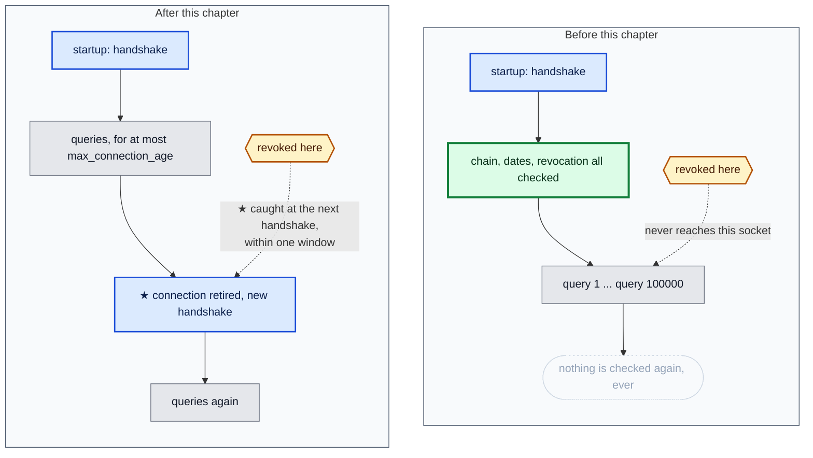
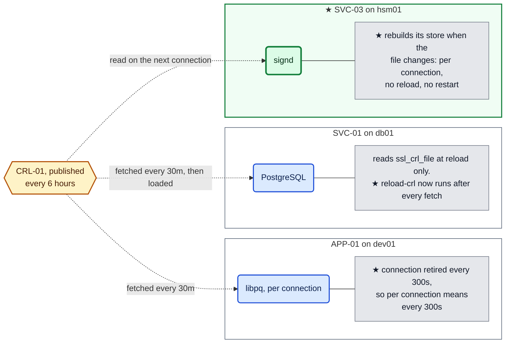
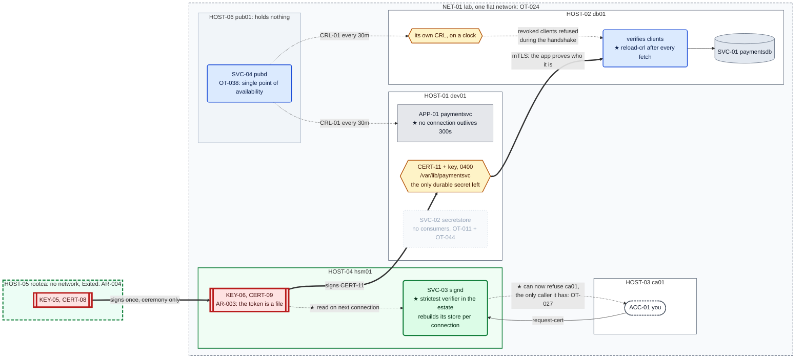

# Chapter 14 — Never trust, always verify

## The system before this chapter

Six machines. A two-tier PKI with an offline root, revocation that is registered, published,
fetched, checked and scheduled, and an application that authenticates to its database with a
certificate naming the workload.

Every **new** connection is a full handshake: chain, hierarchy, dates, revocation. Connection one
hundred thousand gets the same scrutiny as connection one.

## The pressure

`OT-006`, open since Chapter 01, and it is not what its title says any more.

The thread was written about a password sitting in a process's memory. Chapter 12 replaced the
password with a private key and the thread survived unchanged, because the lifecycle did: read at
startup, held until the process exits.

**But the credential was never the interesting half.** `APP-01` opens one connection at startup
and uses it for the life of the process. Verification happens during the handshake, and a
connection that never handshakes again is never verified again. So:

> Revoke that certificate now, and the running application keeps working.

Not because anything failed. Because *verify once, then trust* is what a long-lived connection
is, and it is the opposite of what this estate has spent five chapters claiming to do.

---

## 0. If your output differs

Serials, dates and container IDs will differ. Two sections wait on a clock. The handshake timings
will differ from the ones printed here and should be the same order of magnitude.

```bash
cd "chapters/Chapter 14/lab"
ls
```

Expected: `docker-compose.yml`, `capture-state.sh`, and the six machine directories.

### The lab in full

What **this** chapter writes is marked ★:

```
lab/
├── docker-compose.yml                Chapter 10
├── capture-state.sh                  Chapter 13
├── dev01/
│   ├── Dockerfile                    Chapter 13
│   ├── app/
│   │   ├── config.yaml             ★ changed: a connection may not outlive its verification
│   │   └── paymentsvc.py           ★ changed: revalidates instead of trusting
│   └── ...                           unchanged
├── db01/
│   ├── Dockerfile                  ★ changed: installs the reload tool
│   ├── crontab                     ★ changed: fetching a list and not loading it did nothing
│   ├── reload-crl.sh               ★ new
│   └── ...                           unchanged
├── hsm01/
│   ├── signd.py                    ★ changed: the last verifier starts verifying
│   └── ...                           unchanged
├── ca01/                             unchanged
├── rootca/                           unchanged
└── pub01/                            unchanged
```

### Before you start

```bash
sudo docker start db01 ca01 hsm01 dev01 pub01
sudo docker exec -d -u signd hsm01 \
    sh -c 'python3 /usr/local/bin/signd >>/var/log/signd.out 2>&1'
sudo docker exec -d -u pub pub01 sh -c 'python3 /usr/local/bin/pubd >>/var/log/pubd.out 2>&1'
for h in hsm01 pub01 dev01 db01; do sudo docker exec -d $h cron; done
sleep 2
sudo docker exec dev01 sh -c '
  for i in $(seq 1 30); do pg_isready -q -h 127.0.0.1 -p 5432 && break; sleep 1; done
  pg_ctlcluster 15 main stop'
sudo docker exec -d -u secretstore dev01 \
    sh -c 'python3 /opt/secretstore/secretstore.py >>/var/log/secretstore.out 2>&1'
sleep 1
sudo docker exec -d -u paymentsvc dev01 \
    sh -c 'python3 /opt/paymentsvc/paymentsvc.py >>/var/log/paymentsvc.out 2>&1'
sleep 2
curl -s http://127.0.0.1:8080/payments/1001/status
curl -s http://127.0.0.1:8080/credinfo; echo
```

Expected: the payment record, and `"auth_method": "certificate"`.

---

## 1. Make it fail: revoke a running application

Chapter 12 §7 revoked `APP-01`'s certificate and the database refused it. Read that section again
and notice the line before the test: it **restarts the application**. This time, do not.

Confirm what is running and how long it has been connected:

```bash
curl -s http://127.0.0.1:8080/payments/1001/status
sudo docker exec db01 su postgres -c \
    "psql -tAc \"SELECT usename, client_dn, backend_start FROM pg_stat_ssl \
     JOIN pg_stat_activity USING (pid) WHERE usename = 'paymentsvc'\""
```

Expected: the payment record, and one row naming `CN=paymentsvc` with a `backend_start` from when
you started the application.

Now revoke that exact certificate and push it all the way through the pipeline built in Chapters
09 to 11:

```bash
sudo docker cp dev01:/var/lib/paymentsvc/client.crt /tmp/live.crt
sudo docker cp /tmp/live.crt hsm01:/var/lib/ca/requests/live.crt
sudo docker exec hsm01 chown signd:signd /var/lib/ca/requests/live.crt
sudo docker exec -u signd hsm01 sh -c '
  awk "/BEGIN/{n++} n==1" /var/lib/ca/requests/live.crt > /var/lib/ca/requests/live-leaf.crt'
sudo docker exec -u signd hsm01 \
    revoke-cert /var/lib/ca/requests/live-leaf.crt keyCompromise | tail -3
sudo docker exec -u pub pub01 \
    pull-artifacts --from http://hsm01.lab.simurgh.example:8080 --once
sudo docker exec -u postgres db01 fetch-crl \
    --url http://pub01.lab.simurgh.example/crl.pem \
    --anchors /etc/postgresql/15/main/ca-bundle.pem \
    --install /var/lib/postgresql/crl/crl.pem \
    --state /var/lib/postgresql/crl/state.json | head -1
```

Expected: the republished list, a published line from `pub01`, and `installed:` on `db01`.

**The revocation is now everywhere it needs to be.** The authority registered it, the publication
point served it, and the database has the current list on disk.

Ask the application to do some work:

```bash
curl -s http://127.0.0.1:8080/payments/1001/status
curl -s http://127.0.0.1:8080/payments/1002/status
```

Expected: **the payment records.** Both of them.

**The certificate is revoked and the application is still serving.** Nothing is broken and no
control failed. Every check `db01` makes happens during the TLS handshake, and there has not been
one since the application started.

---

## 2. And the list the server never read

There is a second failure hiding underneath the first, and it is worse because it affects
connections that *do* handshake.

Open a brand new connection with the revoked certificate:

```bash
sudo docker exec -u paymentsvc dev01 sh -c '
  psql "host=db01.lab.simurgh.example dbname=paymentsdb user=paymentsvc \
        sslmode=verify-full sslrootcert=/opt/paymentsvc/ca.crt \
        sslcert=/var/lib/paymentsvc/client.crt sslkey=/var/lib/paymentsvc/client.key" \
       -tAc "select 1"'
```

Expected: **`1`**. A completely new handshake, presenting a certificate the authority withdrew
minutes ago, accepted.

Ask PostgreSQL when it last read its configuration:

```bash
sudo docker exec db01 su postgres -c \
    "psql -tAc \"SELECT pg_conf_load_time()\""
sudo docker exec db01 stat -c '%n %y' /var/lib/postgresql/crl/crl.pem
```

Expected: a load time from when the cluster last started or reloaded, and a file modified
**after** it.

**PostgreSQL reads `ssl_crl_file` at startup and at reload, and not per connection.** The list on
disk is current, the list in memory is not, and nothing was going to bring them together, because
`db01`'s crontab from Chapter 12 fetches and stops.

Tell it to read:

```bash
sudo docker exec db01 pg_ctlcluster 15 main reload
sleep 1
sudo docker exec -u paymentsvc dev01 sh -c '
  psql "host=db01.lab.simurgh.example dbname=paymentsdb user=paymentsvc \
        sslmode=verify-full sslrootcert=/opt/paymentsvc/ca.crt \
        sslcert=/var/lib/paymentsvc/client.crt sslkey=/var/lib/paymentsvc/client.key" \
       -tAc "select 1"' 2>&1 | tail -2
```

Expected:

```
psql: error: connection to server at "db01.lab.simurgh.example" (172.x.x.x), port 5432 failed:
SSL error: sslv3 alert certificate revoked
```

**And the application is still serving.** Check:

```bash
curl -s http://127.0.0.1:8080/payments/1001/status
```

Expected: the payment record, on a socket opened before any of this happened.

**That is a defect in Chapter 12's work**, found by asking a question Chapter 12 did not ask.
From Chapter 12 until this section, `db01` fetched revocations faithfully every thirty minutes
and honoured none of them, and everything visible worked.

---

## 3. What "always verify" actually requires

**Figure 14.1 — when verification happens, and when it does not**



**Read the dotted arrow in each box.** Above, the revocation never reaches the connection at all.
Below, it is caught at the next handshake, and **the window is the connection's maximum age**.
Zero trust bounds the window. It does not remove it, and a chapter that claimed otherwise would
be selling something.

**So three things have to be true**, and this estate had none of them.

**A connection must not outlive its verification.** That is the client's job and `§4` does it.

**A verifier's answer must be current.** Reading a list once at startup is verifying against
history. That is `§5` for the database and `§6` for the authority.

**And every verifier must actually check.** `SVC-03` has never looked at a CRL. It is the machine
that issues certificates and it is the least diligent verifier in the estate, which is `OT-037`
and `§6`.

---

## 4. The client: a connection may not outlive its verification

```python
#!/usr/bin/env python3
"""APP-01 paymentsvc, answers 'what is the status of payment X?'

Chapter 04 change: SVC-01 now lives on its own machine, so the database
connection crosses a network. It is made with TLS and the server
certificate is verified against a pinned copy, which is what stops anything
that answers on port 5432 from being handed our queries.

The credential still comes from SVC-02 over a Unix socket on this host, and
this process still stores no credential of its own.
"""

import http.client
import json
import logging
import os
import pwd
import socket
import subprocess
import time
import sys
from http.server import BaseHTTPRequestHandler, ThreadingHTTPServer

import psycopg2
import yaml
from psycopg2.extras import RealDictCursor

CONFIG_PATH = os.environ.get("PAYMENTSVC_CONFIG", "/opt/paymentsvc/config.yaml")

logging.basicConfig(
    level=os.environ.get("LOG_LEVEL", "INFO").upper(),
    format="%(asctime)s %(levelname)s %(message)s",
    handlers=[
        logging.FileHandler("/var/log/paymentsvc.log"),
        logging.StreamHandler(sys.stdout),
    ],
)
log = logging.getLogger("paymentsvc")


def load_config(path):
    log.info("loading configuration from %s", path)
    with open(path) as fh:
        cfg = yaml.safe_load(fh)
    log.debug("effective configuration: %s", cfg)
    return cfg


class UnixHTTPConnection(http.client.HTTPConnection):
    """An HTTP client that speaks over a Unix domain socket.

    The only difference from an ordinary HTTPConnection is where connect()
    points. Everything above it, requests, status codes, headers, is
    unchanged, which is why moving SVC-02 off TCP cost so little here.
    """

    def __init__(self, socket_path, timeout=5):
        super().__init__("localhost", timeout=timeout)
        self.socket_path = socket_path

    def connect(self):
        sock = socket.socket(socket.AF_UNIX, socket.SOCK_STREAM)
        sock.settimeout(self.timeout)
        sock.connect(self.socket_path)
        self.sock = sock


def fetch_credential(socket_path, secret_name):
    """Ask SVC-02 for the current database credential.

    NOTHING CALLS THIS. Since Chapter 12 the database credential is a
    certificate, so this function has no call site and this process never
    opens the store's socket. It is kept because Chapters 02 and 03 built
    it and a learner reading this file at Chapter 14 should be able to see
    what was replaced, not just be told about it.

    That is a deliberate choice with a cost, and the cost is worth naming:
    this is unreached code that opens a socket and asks for a secret. It
    will not be exercised by any test, it will not break when the store
    changes, and it is one line away from being live again. Dead code on a
    credential path is a real finding in a real review, and the honest
    thing is to record it as one rather than to let a docstring make it
    look intentional and therefore safe. OT-044.

    We present no token and assert no identity. The kernel tells the store
    our uid when we connect, and the store applies POL-01 to it. If it says
    no, we get a 403 and fail loudly, being refused is not something to
    paper over.
    """
    conn = UnixHTTPConnection(socket_path)
    try:
        conn.request("GET", f"/v1/secrets/{secret_name}")
        resp = conn.getresponse()
        body = resp.read().decode()
        if resp.status == 403:
            raise PermissionError(
                f"secretstore refused this process: {json.loads(body).get('detail')}"
            )
        if resp.status != 200:
            raise RuntimeError(f"secretstore returned {resp.status}: {body}")
        payload = json.loads(body)
    finally:
        conn.close()
    cred = json.loads(payload["value"])
    log.info("fetched %s version %s as user %s",
             secret_name, payload["version"], cred["user"])
    return cred["user"], cred["password"], payload["version"]


def check_crl_usable(path):
    """Refuse to start rather than run with revocation checking silently off.

    THIS FUNCTION EXISTS BECAUSE libpq FAILS OPEN, AND IT WAS MEASURED.

    Naming a CRL is supposed to turn revocation checking on. libpq only turns
    it on if the file loads; if it cannot, the flags are never set, the
    connection succeeds, and a revoked certificate is accepted exactly as
    before. Four ways of being unusable were tested against PostgreSQL 15 and
    all four connected: the file missing, the file unreadable, the file
    containing something that is not a CRL, and the file empty.

    None of them warned. The last is the one that happens in real life: a
    fetch that failed and left a zero-byte file behind, after which the
    estate stops checking revocation and nothing anywhere says so.

    So the application checks on the platform's behalf, and refuses to start
    when the answer is no. That is D-011: a service configured to require a
    protection should fail loudly rather than run without it. A crash at
    startup is a page; a silently disabled security control is a year of
    believing something that is not true.

    Note what is NOT checked here: whether the file carries a list from every
    authority in the chain. libpq fails CLOSED on that one, refusing healthy
    certificates, so it is already loud and needs no help.
    """
    if not os.path.exists(path):
        raise SystemExit(f"sslcrl is set to {path}, which does not exist. "
                         "Refusing to start: revocation checking would be off.")
    if not os.access(path, os.R_OK):
        raise SystemExit(f"sslcrl is set to {path}, which is not readable by "
                         f"{pwd.getpwuid(os.getuid()).pw_name}. Refusing to start.")
    if os.path.getsize(path) == 0:
        raise SystemExit(f"sslcrl is set to {path}, which is empty. "
                         "Refusing to start: a failed download looks exactly like this.")

    # Parse every list in the file and report the issuers, so the log says
    # what is actually being enforced rather than that a setting is spelled.
    proc = subprocess.run(["openssl", "crl", "-in", path, "-noout", "-issuer"],
                          capture_output=True, text=True)
    if proc.returncode != 0:
        raise SystemExit(f"sslcrl is set to {path}, which openssl cannot parse. "
                         "Refusing to start.")
    log.info("CRL file %s parses, first issuer %s", path, proc.stdout.strip())


class Database:
    """Owns the connection and the credential it was made with."""

    def __init__(self, cfg):
        self.cfg = cfg
        # Seconds. 0 or absent means "hold the connection forever", which is
        # what every chapter before this one did.
        self.max_age = cfg["database"].get("max_connection_age", 0)
        self.opened_at = 0.0
        self.conn = None
        self.user = None
        self.version = None
        self.connect()

    def connect(self):
        """Open the connection. CHAPTER 12: WITH NO PASSWORD AT ALL.

        Everything above this line about fetching a credential is still here,
        still correct, and no longer used for the database. SEC-02 and SEC-03
        are retired: what proves who this process is now is a private key it
        holds and a certificate our own authority signed, and the database
        checks both at the TLS layer before it looks at any authentication
        rule.

        Read what has NOT improved, because it is the honest half. There is
        still exactly one durable secret on this host, it still lives for the
        life of the process, and it is still readable by root. It changed
        shape from a password fetched at startup into a private key read at
        startup, which is a different object with the same lifecycle. Chapter
        12 renamed OT-006 rather than closing it; this chapter closes it, by
        bounding how long the connection may go without being re-verified
        rather than by shortening the credential's life.

        What DID improve is that the secret is no longer shared. A password
        is a thing two parties know; a private key is a thing one party has.
        The database has never seen this key and cannot leak it, which is the
        property no amount of rotation could buy.
        """
        db = self.cfg["database"]
        user = db["user"]
        conn_args = dict(
            host=db["host"], port=db["port"], dbname=db["name"],
            user=user,
            # No password= at all. Not an empty one: absent. If pg_hba on the
            # far side ever falls back to a password method, this connection
            # fails rather than quietly negotiating something weaker, which
            # is the same argument as sslmode=verify-full over require.
            sslmode=db["sslmode"],
            # The identity. sslcert is presented during the handshake and
            # PostgreSQL matches its Common Name against the role named
            # above; measured, they must agree or it refuses with
            # `certificate authentication failed for user "..."`.
            sslcert=db["sslcert"], sslkey=db["sslkey"],
        )
        # The anchor is optional, and leaving it out is not neutral. libpq
        # verifies the server certificate whenever a root CA file is
        # present, even under sslmode=require, so naming one here makes a
        # weak-looking config stronger than it reads. Section 7 is what
        # happens when the line is missing and nobody noticed it mattered.
        if db.get("sslrootcert"):
            conn_args["sslrootcert"] = db["sslrootcert"]
        # Chapter 09. Naming a CRL turns revocation checking ON, and that is
        # not a small switch: libpq then refuses any certificate it cannot
        # check, not merely the ones that were revoked. A missing file, an
        # unreadable one, or a list whose nextUpdate has passed all stop this
        # application from starting. That is correct and it is expensive, and
        # section 7 is what it looks like when nobody refreshed the list.
        if db.get("sslcrl"):
            check_crl_usable(db["sslcrl"])
            conn_args["sslcrl"] = db["sslcrl"]
        # The key file's mode is checked by libpq, not by us, and the error
        # is one of the clearest in this build: `private key file ... has
        # group or world access; file must have permissions u=rw (0600) or
        # less`. Nothing here needs to duplicate it.
        self.conn = psycopg2.connect(**conn_args)
        self.conn.autocommit = True
        self.opened_at = time.monotonic()
        self.user, self.version = user, "certificate"
        log.info("connected to %s@%s:%s/%s (auth %s, sslmode %s, crl %s, max age %ss)",
                 user, db["host"], db["port"], db["name"], "certificate",
                 db["sslmode"], "on" if db.get("sslcrl") else "off",
                 self.max_age or "unbounded")

    def stale(self):
        """True when this connection is older than the estate is willing to trust.

        NEVER TRUST, ALWAYS VERIFY, AND WHY A LONG CONNECTION BREAKS IT.

        Every check the database makes happens during the TLS handshake: the
        chain, the dates, and the revocation list. A connection that never
        handshakes again is therefore never re-checked. Measured: revoke this
        certificate while the process is running and the open socket goes on
        serving indefinitely, before AND after the server reloads its list.

        So the credential is not the problem and neither is the database. The
        problem is that verification is an event and we were treating it as a
        state. Bounding the connection's age turns it back into an event that
        recurs.

        WHAT THIS COSTS, MEASURED: a full handshake is 10 to 12 ms. At the
        default below that is one extra handshake every five minutes, which is
        not a number worth optimising against a credential that may have been
        withdrawn.

        WHAT IT DOES NOT BUY, and the chapter is explicit about it: the window
        is the lifetime. Revoke at minute one of a five minute window and the
        compromised socket has four minutes left. Zero trust bounds the window;
        it does not remove it.
        """
        if self.conn is None or self.conn.closed:
            return True
        if not self.max_age:
            return False
        return (time.monotonic() - self.opened_at) >= self.max_age

    def query(self, sql, args):
        """Run a query, revalidating first if this connection has aged out."""
        if self.stale():
            age = None if self.conn is None else time.monotonic() - self.opened_at
            log.info("connection age %s exceeds max_connection_age %ss, reconnecting "
                     "so the certificate is verified again",
                     "n/a" if age is None else f"{age:.0f}s", self.max_age)
            self.close()
            self.connect()
        try:
            return self._query(sql, args)
        except psycopg2.OperationalError as exc:
            log.warning("connection failed (%s), reconnecting", exc)
            self.connect()
            return self._query(sql, args)

    def close(self):
        if self.conn is not None and not self.conn.closed:
            try:
                self.conn.close()
            except Exception:
                pass
        self.conn = None

    def _query(self, sql, args):
        with self.conn.cursor(cursor_factory=RealDictCursor) as cur:
            cur.execute(sql, args)
            return cur.fetchone()


cfg = load_config(CONFIG_PATH)
database = Database(cfg)


class Handler(BaseHTTPRequestHandler):
    server_version = "paymentsvc/0.4"

    def _json(self, code, payload):
        body = json.dumps(payload).encode()
        self.send_response(code)
        self.send_header("Content-Type", "application/json")
        self.send_header("Content-Length", str(len(body)))
        self.end_headers()
        self.wfile.write(body)

    def do_GET(self):
        if self.path == "/healthz":
            # CHAPTER 11: THIS ENDPOINT FINALLY ANSWERS A QUESTION.
            #
            # Until now it returned a hardcoded ok, and the book complained
            # about it twice: Chapter 08 section 10 found it reporting healthy
            # while the application could not reach its database at all, and
            # Chapter 10 section 0 warned against using it as a state check.
            #
            # It is not being given a database probe. That was the right call
            # and stays: a health endpoint that opens a connection turns every
            # poll into load, and Chapter 08's complaint was that it claimed
            # more than it knew, not that it knew too little.
            #
            # What it reports now is the one thing about this process that
            # degrades silently and takes the estate down with it: how much
            # life is left in the revocation list. Measured in Chapter 11, a
            # cron job that stops working leaves no trace anywhere, so the job
            # cannot be the thing that is watched. The artefact can.
            #
            # It shells out to crl-status rather than reimplementing it, for
            # the reason SVC-03 shells out to sign-leaf: two copies of a rule
            # about expiry is one copy too many, and the one that drifts will
            # be the one nobody runs by hand.
            crl = cfg["database"].get("sslcrl")
            if not crl:
                return self._json(200, {"status": "ok", "crl_checking": False})
            proc = subprocess.run(
                ["/usr/local/bin/crl-status", "--crl", crl,
                 "--warn-days", str(cfg.get("crl", {}).get("warn_days", 2))],
                capture_output=True, text=True)
            detail = [ln for ln in proc.stdout.splitlines() if ln.strip()]
            if proc.returncode == 0:
                return self._json(200, {"status": "ok", "crl": detail})
            # 503, not 200 with a flag. A monitoring system reads the status
            # line; a field inside a 200 is a thing somebody has to remember
            # to look at, which is the failure this whole chapter is about.
            return self._json(503, {"status": "degraded", "crl": detail})

        if self.path == "/credinfo":
            return self._json(200, {
                "db_user": database.user,
                "secret_name": cfg["secret_store"]["secret_name"],
                # Chapter 12: there is no credential version any more,
                # because there is no credential. What identifies this
                # process is a certificate, so report that instead.
                "auth_method": database.version,
                # How long this connection may go without being verified
                # again, and how long it has actually been open. The second
                # number is the one that matters during an incident.
                "max_connection_age": database.max_age or "unbounded",
                "connection_age_s": round(time.monotonic() - database.opened_at, 1),
                "client_cert": cfg["database"].get("sslcert"),
                "running_as": pwd.getpwuid(os.getuid()).pw_name,
                "uid": os.getuid(),
                "db_host": cfg["database"]["host"],
                "sslmode": cfg["database"]["sslmode"],
                # Chapter 09: whether this client is checking revocation at
                # all. Worth exposing, because the difference between
                # checking and not checking is invisible from the outside
                # and is the difference between refusing a revoked
                # certificate and accepting one.
                # Effect, not intent. Reporting that a setting is spelled
                # would be the Chapter 08 /healthz defect again: with an
                # unusable file libpq checks nothing while the config still
                # says sslcrl. The process refuses to start in that case, so
                # if this says true it is true.
                "crl_checking": bool(cfg["database"].get("sslcrl")),
            })

        parts = self.path.strip("/").split("/")
        if len(parts) == 3 and parts[0] == "payments" and parts[2] == "status":
            try:
                payment_id = int(parts[1])
            except ValueError:
                return self._json(400, {"error": "payment id must be an integer"})
            row = database.query(
                "SELECT id, reference, amount_cents, currency, status "
                "FROM payments WHERE id = %s",
                (payment_id,),
            )
            if row is None:
                return self._json(404, {"error": "no such payment"})
            return self._json(200, dict(row))

        return self._json(404, {"error": "not found"})

    def log_message(self, fmt, *args):
        log.info("%s %s", self.address_string(), fmt % args)


if __name__ == "__main__":
    host, _, port = cfg["server"]["listen"].rpartition(":")
    srv = ThreadingHTTPServer((host, int(port)), Handler)
    log.info("listening on %s", cfg["server"]["listen"])
    srv.serve_forever()
```

The change is `stale()` and three lines in `query()`. Everything else is Chapter 12's.

```yaml
# /opt/paymentsvc/config.yaml
database:
  host: db01.lab.simurgh.example
  port: 5432
  name: paymentsdb
  sslmode: verify-full
  # Chapter 12. The role this process logs in as, and there is no password
  # anywhere in this file or in the secret store to go with it.
  #
  # This name has to equal the Common Name of the certificate below.
  # PostgreSQL's `cert` authentication takes the CN and requires it to match
  # the role being requested; measured, a valid certificate naming anything
  # else is refused with `certificate authentication failed for user`.
  #
  # Note what the name is NOT. Every other certificate in this estate is named
  # for a machine. This one is named for a workload, because the thing being
  # authenticated is the application and not the host it happens to run on.
  user: paymentsvc
  # Chapter 14. The longest this process will use a connection without the
  # database checking its certificate again.
  #
  # Every check db01 makes happens in the TLS handshake, so a connection that
  # is never re-made is never re-checked. Measured: a revoked certificate goes
  # on serving on an open socket indefinitely. Bounding the age turns
  # verification from a state back into an event.
  #
  # 300 seconds against a measured handshake cost of 10 to 12 ms is one extra
  # handshake per five minutes. The number is not chosen for performance, it
  # is chosen for how long the estate is willing to be wrong.
  max_connection_age: 300
  # CERT-11 and its key. The certificate is the chain, leaf followed by
  # CERT-09, for the reason every other holder here presents a chain: the
  # server can build the path itself today, and that depends on somebody
  # else's configuration staying right.
  #
  # NOT in /opt/paymentsvc, and Chapter 10 learned why the hard way. That
  # directory is root-owned so that APP-01 cannot rewrite its own
  # configuration, which has been true since Chapter 01. Creating a key
  # there, and replacing it during an incident, both need write permission
  # on the DIRECTORY and not merely on the file. So the identity lives
  # where ACC-03 owns the directory, exactly as the CRL does.
  sslcert: /var/lib/paymentsvc/client.crt
  sslkey: /var/lib/paymentsvc/client.key
  # Chapter 05: the anchor is the authority, not the server.
  #
  # This was /opt/paymentsvc/db01.crt, a copy of the certificate db01
  # presents. Pinning that meant re-issuing db01's certificate broke this
  # client, which is OT-017. Now it is CERT-02, the root, and db01 can be
  # re-issued as often as it likes without this line or this file changing.
  #
  # The path is the only thing that had to change on the client. That is
  # the whole payoff, and it is a one-time cost.
  sslrootcert: /opt/paymentsvc/ca.crt
  # Chapter 09: check whether the certificate has been taken back.
  #
  # The anchor above answers "did our authority sign this". It cannot answer
  # "does our authority still stand behind it", and those became different
  # questions the moment a credential was stolen. This line is the second
  # question.
  #
  # It is not a free improvement. With this set, libpq refuses any
  # certificate whose revocation status it cannot establish: no file, an
  # unreadable file, or a list past its nextUpdate all stop this application
  # from starting, healthy certificates included. Deleting the line turns
  # revocation checking off and everything works again, which is exactly why
  # it is worth knowing that the line is load-bearing.
  #
  # Chapter 10: moved out of this directory, and the reason is least privilege
  # rather than tidiness. The list is now maintained by fetch-crl, running as
  # `paymentsvc`, and an atomic replace needs a temporary file in the same
  # directory as the target. Granting that here would make /opt/paymentsvc
  # writable by the application, which would let APP-01 rewrite its own
  # configuration, and that has been forbidden since Chapter 01.
  #
  # A revocation list is not configuration. It is state an agent maintains, so
  # it lives where the agent can own it.
  sslcrl: /var/lib/fetch-crl/crl.pem
# Chapter 12: still configured, and no longer used for the database.
#
# SVC-02 has no consumer as of this chapter. That is not a reason to delete
# it, and the chapter says why: a store with nothing in it is the correct
# outcome of removing the thing it was holding, and the next secret this
# estate acquires will want somewhere to live. What it does mean is that
# OT-011, a single point of total compromise holding everything in
# plaintext, currently holds nothing worth compromising.
secret_store:
  socket: /run/secretstore/sock
  secret_name: paymentsvc-db
server:
  listen: 0.0.0.0:8080

# Chapter 11. How close to the deadline counts as a problem.
#
# Two days against the intermediate's seven means two consecutive missed
# refreshes are needed before /healthz goes amber, so a single missed run is
# not an incident and a broken pipeline is. Set it too low and the alarm
# arrives at the same time as the outage, which is the same as no alarm.
crl:
  warn_days: 2
```

Deploy it:

```bash
sudo docker cp dev01/app/config.yaml   dev01:/opt/paymentsvc/config.yaml
sudo docker cp dev01/app/paymentsvc.py dev01:/opt/paymentsvc/paymentsvc.py
sudo docker exec dev01 sh -c '
  chown paymentsvc:paymentsvc /opt/paymentsvc/config.yaml /opt/paymentsvc/paymentsvc.py
  chmod 0400 /opt/paymentsvc/config.yaml
  chmod 0444 /opt/paymentsvc/paymentsvc.py'
```

Expected: no output.

**Three hundred seconds is a policy, not a performance setting.** A full handshake was measured
at **10 to 12 ms**, so the cost is one extra handshake every five minutes: about two thousandths
of one per cent of that interval. The number is chosen for how long this estate is willing to be
wrong, and the fact that it is nearly free means the argument is entirely about risk.

Before restarting, issue the application a certificate that has not been revoked, since the one
it holds no longer works for new connections:

```bash
sudo docker exec -u paymentsvc dev01 sh -c '
  openssl ecparam -name prime256v1 -genkey -noout -out /var/lib/paymentsvc/client.key.new
  chmod 0400 /var/lib/paymentsvc/client.key.new
  openssl req -new -key /var/lib/paymentsvc/client.key.new \
      -out /tmp/pv.csr -subj "/CN=paymentsvc"'
sudo docker cp dev01:/tmp/pv.csr /tmp/pv.csr
sudo docker cp /tmp/pv.csr ca01:/opt/ca-client/requests/paymentsvc.csr
sudo docker exec ca01 chown ca:ca /opt/ca-client/requests/paymentsvc.csr
sudo docker exec -u ca ca01 request-cert --client \
    /opt/ca-client/requests/paymentsvc.csr paymentsvc | head -2
sudo docker cp ca01:/opt/ca-client/issued/paymentsvc.chain.crt /tmp/pv.crt
sudo docker cp /tmp/pv.crt dev01:/var/lib/paymentsvc/client.crt
sudo docker exec dev01 sh -c '
  mv /var/lib/paymentsvc/client.key.new /var/lib/paymentsvc/client.key
  chown paymentsvc:paymentsvc /var/lib/paymentsvc/client.crt /var/lib/paymentsvc/client.key
  chmod 0444 /var/lib/paymentsvc/client.crt
  chmod 0400 /var/lib/paymentsvc/client.key'
sudo docker exec dev01 pkill -f 'python3 /opt/paymentsvc/paymentsvc.py' || true
sudo docker exec -d -u paymentsvc dev01 \
    sh -c 'python3 /opt/paymentsvc/paymentsvc.py >>/var/log/paymentsvc.out 2>&1'
sleep 2
curl -s http://127.0.0.1:8080/credinfo; echo
```

Expected: `"auth_method": "certificate"`, `"max_connection_age": 300`, and a small
`"connection_age_s"`.

Watch the age climb and the connection turn over:

```bash
for i in 1 2 3; do
  curl -s http://127.0.0.1:8080/credinfo | tr ',' '\n' | grep connection_age_s
  sleep 20
done
sudo docker exec dev01 grep -c "reconnecting" /var/log/paymentsvc.out
```

Expected: an age that increases by about twenty each time, and `0` reconnections so far. The
turnover happens at three hundred seconds, which `§7` will not wait for.

---

## 5. The database: load what you fetch

```sh
#!/bin/sh
# Tell PostgreSQL to re-read its revocation list. Run as `postgres` on HOST-02.
#
#   reload-crl
#
# WHY THIS IS NOT PART OF fetch-crl. fetch-crl runs on every client in the
# estate and knows nothing about what consumes the file it installs. On
# HOST-01 the consumer is a process that re-reads on each connection; here it
# is a server that caches until told otherwise. The knowledge of how a
# particular consumer notices belongs beside that consumer.
#
# WHY IT IS NEEDED AT ALL, measured in Chapter 14: PostgreSQL reads
# ssl_crl_file at startup and at reload, and not per connection. A revoked
# certificate presented on a NEW connection was accepted while the current
# list sat unread on disk. From Chapter 12 until Chapter 14 this machine
# fetched revocations every thirty minutes and honoured none of them.
#
# WHAT A RELOAD DOES NOT DO, also measured: it does not end sessions that are
# already open. A connection established before the revocation keeps working
# afterwards. Ending those is a separate act and a deliberate one, because it
# disconnects innocent clients too. See PROC-13.

set -eu

CRL=/var/lib/postgresql/crl/crl.pem

[ -r "$CRL" ] || { echo "reload-crl: no list at $CRL, nothing to load" >&2; exit 1; }

# Refuse to load something unusable. PostgreSQL will not start or reload with
# a malformed ssl_crl_file, and finding that out during a reload is finding it
# out at the worst moment.
openssl crl -in "$CRL" -noout >/dev/null 2>&1 || {
    echo "reload-crl: $CRL does not parse as a CRL. Not reloading." >&2
    exit 1
}

BEFORE=$(psql -tAc "SELECT pg_conf_load_time()" 2>/dev/null || echo unknown)
pg_ctlcluster 15 main reload
AFTER=$(psql -tAc "SELECT pg_conf_load_time()" 2>/dev/null || echo unknown)

echo "reload-crl: $(date -u +%Y-%m-%dT%H:%M:%SZ) reloaded"
echo "  config load time before: $BEFORE"
echo "  config load time after:  $AFTER"
echo "  lists in $CRL: $(grep -c 'BEGIN X509 CRL' "$CRL")"
```

```
# The database, on a timer. Installed for `postgres` on HOST-02.
#
#   crontab -u postgres /var/lib/postgresql/crontab
#
# WHY THE DATABASE NOW HAS A CRON JOB AT ALL. From Chapter 12 db01 verifies
# client certificates, which means it checks revocation, which means it needs
# a current CRL. It has become the estate's second verifier, and a verifier
# that cannot get a fresh list is a verifier that refuses everybody.
#
# That is the half of OT-037 this chapter closes and the new risk it brings.
# Before Chapter 12, a stale CRL on db01 was impossible because db01 had no
# CRL. Now a stale one takes the database offline for every client at once,
# which is a larger blast radius than the same failure on dev01.
#
# EVERY THIRTY MINUTES, matching dev01. Both are clients of the same
# publication point with the same seven day list, and there is no reason for
# them to disagree about how far behind they are willing to be.
#
# CHAPTER 14 ADDED THE SECOND HALF OF THIS LINE, AND WITHOUT IT THE FIRST
# HALF DID NOTHING.
#
# PostgreSQL reads ssl_crl_file when it starts or is reloaded, and not per
# connection. Measured: with a revoked certificate and the new list already on
# disk, a NEW connection was ACCEPTED until the server was reloaded. So from
# Chapter 12 until now this machine fetched revocations faithfully every
# thirty minutes and honoured none of them.
#
# `&&` rather than `;` on purpose. A reload after a failed fetch would tell
# PostgreSQL to re-read a file that has not changed, which is harmless, and it
# would also hide the failure by making the line always succeed. If the fetch
# fails there is nothing new to load and the exit status should say so.
#
# WHAT IS MISSING, and it is deliberate rather than forgotten: nothing on
# this machine reports how much life the installed list has left. dev01 has
# /healthz because APP-01 is an HTTP service that was already being polled.
# PostgreSQL is not, so the same question has to be asked from outside, by
# hand, with crl-status. OT-040 on a second machine.
SHELL=/bin/sh
PATH=/usr/local/bin:/usr/bin:/bin

*/30 * * * * fetch-crl --url http://pub01.lab.simurgh.example/crl.pem --anchors /etc/postgresql/15/main/ca-bundle.pem --install /var/lib/postgresql/crl/crl.pem --state /var/lib/postgresql/crl/state.json >>/var/lib/postgresql/crl/fetch.out 2>&1 && /usr/local/bin/reload-crl >>/var/lib/postgresql/crl/fetch.out 2>&1
```

**`&&` rather than `;` is deliberate.** A reload after a failed fetch tells PostgreSQL to re-read
a file that has not changed, which is harmless, and it also makes the line always succeed, which
hides the failure. If there is nothing new to load, the exit status should say so.

**And the reload lives beside the consumer, not inside `fetch-crl`.** That agent runs on every
client in the estate and knows nothing about what reads the file it installs. On `dev01` the
consumer re-reads on every connection; here it caches until told. Knowledge of how a particular
consumer notices belongs with that consumer. `D-092`.

`db01`'s recipe installs it, so a rebuilt machine has it rather than acquiring it later, which is
the habit Chapter 13 was about:

```dockerfile
FROM debian:12-slim

ENV DEBIAN_FRONTEND=noninteractive

RUN apt-get update && apt-get install -y --no-install-recommends \
        postgresql-15 \
        openssl \
        procps iproute2 tcpdump curl less nano ca-certificates \
        python3 cron \
    && rm -rf /var/lib/apt/lists/*

# Same belt-and-braces as dev01: the Debian package normally creates the
# main cluster on install, but that step relies on an init system a build
# container does not have.
RUN pg_lsclusters | grep -q '^15 *main' || pg_createcluster 15 main

COPY entrypoint.sh /usr/local/bin/entrypoint.sh
RUN chmod +x /usr/local/bin/entrypoint.sh

EXPOSE 5432
# Chapter 12: db01 became the estate's second verifier, so it needs the
# revocation agent, somewhere to keep what it fetches, and a clock. python3
# and cron were installed into the running container at the time, for the
# reason everything else in this pass was: hsm01 cannot be rebuilt, so nothing
# is, so the recipes drifted.
COPY crontab      /var/lib/postgresql/crontab
COPY reload-crl.sh /usr/local/bin/reload-crl

RUN mkdir -p /var/lib/postgresql/crl \
 && chown postgres:postgres /var/lib/postgresql/crl /var/lib/postgresql/crontab \
 && chmod 0755 /var/lib/postgresql/crl \
 && chmod 0755 /usr/local/bin/reload-crl

ENTRYPOINT ["/usr/local/bin/entrypoint.sh"]
```

Deploy:

```bash
sudo docker cp db01/reload-crl.sh db01:/usr/local/bin/reload-crl
sudo docker cp db01/crontab       db01:/var/lib/postgresql/crontab
sudo docker exec db01 sh -c '
  chmod 0755 /usr/local/bin/reload-crl
  chown postgres:postgres /var/lib/postgresql/crontab
  crontab -u postgres /var/lib/postgresql/crontab'
sudo docker exec -u postgres db01 reload-crl
```

Expected: two configuration load times, the second later than the first, and the number of lists
in the file.

**`reload-crl` refuses to load a file that does not parse.** PostgreSQL will not reload with a
malformed `ssl_crl_file`, and discovering that during a reload is discovering it at the worst
possible moment. That is the same argument as `check_crl_usable` in Chapter 09, made on the other
side of the connection.

---

## 6. The authority: the last verifier

`SVC-03` verifies that our authority signed the caller and has never asked whether the authority
still stands behind them. It is the machine that issues certificates and the least diligent
verifier in the estate.

```python
#!/usr/bin/env python3
"""SVC-03 signd, the signing service on HOST-04 hsm01.

The token lives here and nothing else does. Callers send a certificate request
over mTLS and get a certificate back; the key never leaves this machine, and
after Chapter 07 it never leaves this machine's token either.

CHAPTER 08 CHANGES ALMOST NOTHING HERE, WHICH IS THE POINT. The key this
service signs with is now an intermediate rather than a root, and the code did
not need to know: sign-leaf changed a token label and this file gained one
field in its reply. What changed is what a compromise of this host costs. An
attacker who takes this machine can issue certificates under CERT-09 until
CERT-09 is replaced, and replacing it is a ceremony on a machine that is
switched off, which touches no client at all. Before Chapter 08 the same
attacker took the estate's trust anchor.

The one field is `chain`. A leaf signed by an intermediate does not verify
against the root on its own, so every reply now carries the issuer beside the
certificate. Callers that ignore it get a certificate that works nowhere, with
an error naming neither this service nor the missing file.

Three things this deliberately does, and one it deliberately does not.

DOES take the caller's identity from the TLS layer rather than from the request.
The client certificate is checked against CERT-05 by the kernel of the TLS
handshake before a single byte of the request body is read, and the name comes
out of that certificate. It is Chapter 03's SO_PEERCRED argument moved onto a
network: an observation, not a claim.

DOES consult POL-02 on every request. mTLS answers "did our authority sign your
certificate" and nothing else. Any holder of any certificate we ever issued can
open this connection, which is exactly what Chapter 07 section 5 demonstrates,
so authentication and authorization stay separate questions.

DOES record every decision, allowed or refused, with the identity the TLS layer
reported and the name that was requested. SVC-02 has done this since Chapter 02
and the authority has never done it at all.

DOES NOT hold the key. It shells out to sign-leaf, which asks the token. This
process could be compromised entirely and the attacker would gain the ability to
request signatures while this process lives, not a key they can keep.
"""
import http.server
import json
import os
import re
import ssl
import subprocess
import sys
import threading
import tempfile
import datetime

LISTEN = ("0.0.0.0", 8443)
CA_CRT = "/var/lib/ca/ca.crt"                 # CERT-08, the root we verify clients
                                              # against. Holds TWO roots during
                                              # the Chapter 08 overlap, because a
                                              # trust anchor is a bundle and not
                                              # a certificate. That is the fact
                                              # that made all three of this
                                              # build's root migrations survivable.
SRV_CRT = "/var/lib/ca/signd.crt"             # CERT-06 followed by CERT-09. This
                                              # file must hold the CHAIN, not the
                                              # leaf alone, or no client can build
                                              # a path from us to the root.
SRV_KEY = "/var/lib/ca/signd.key"
ICA_CRT = "/var/lib/ca/ica.crt"               # CERT-09, returned with every leaf
CRL = "/var/lib/ca/crl.pem"                   # CRL-01, both lists, public
VERIFY_STORE = "/var/lib/ca/verify-store.pem" # CERT-08 + CERT-09 + CRL-01,
                                              # rebuilt whenever CRL-01 changes
PUBLIC_LISTEN = ("0.0.0.0", 8080)             # see PublicHandler
POLICY = "/etc/signd/policy.json"             # POL-02
AUDIT = "/var/log/signd-audit.log"

# A name we will sign for has to look like a hostname. This is not a security
# control, it is a guard against a malformed request becoming a malformed
# openssl invocation; POL-02 is the control.
NAME_RE = re.compile(r"^[a-z0-9]([a-z0-9-]*[a-z0-9])?(\.[a-z0-9]([a-z0-9-]*[a-z0-9])?)*$")


def audit(caller, requested, decision, detail=""):
    """Append one line per decision. Allowed and refused both, or the log only
    tells you about the requests that worked."""
    line = "\t".join([
        datetime.datetime.now(datetime.timezone.utc).strftime("%Y-%m-%dT%H:%M:%SZ"),
        f"caller={caller}", f"requested={requested}",
        f"decision={decision}", detail,
    ])
    with open(AUDIT, "a") as fh:
        fh.write(line + "\n")
    print(line, flush=True)


def load_policy():
    """Re-read on every request, so an edit takes effect on the next call.
    Inefficient and deliberate, exactly as POL-01 is in SVC-02."""
    with open(POLICY) as fh:
        return json.load(fh)


class Handler(http.server.BaseHTTPRequestHandler):
    server_version = "signd/1.0"

    def _json(self, code, obj):
        body = json.dumps(obj).encode()
        self.send_response(code)
        self.send_header("Content-Type", "application/json")
        self.send_header("Content-Length", str(len(body)))
        self.end_headers()
        self.wfile.write(body)

    def peer_name(self):
        """Who is calling, according to the certificate they proved they hold.

        getpeercert() returns the parsed client certificate. It is present only
        because the context was built with CERT_REQUIRED, so by the time this
        runs the chain has already been verified against CERT-05. Nothing here
        trusts anything the caller wrote in the request.
        """
        cert = self.connection.getpeercert()
        if not cert:
            return None
        for dns in [v for k, v in cert.get("subjectAltName", ()) if k == "DNS"]:
            return dns
        subject = dict(x[0] for x in cert.get("subject", ()))
        return subject.get("commonName")

    def do_POST(self):
        caller = self.peer_name() or "unknown"
        if self.path != "/v1/sign":
            return self._json(404, {"error": "not found"})

        length = int(self.headers.get("Content-Length") or 0)
        if length <= 0 or length > 16384:
            audit(caller, "-", "deny", "detail=bad request size")
            return self._json(400, {"error": "csr required, 16k max"})
        try:
            req = json.loads(self.rfile.read(length))
            csr, fqdn = req["csr"], req["fqdn"]
            extra = req.get("alt_names", [])
            # CHAPTER 12. sign-leaf has had --client since Chapter 07 and this
            # service never passed it, because the only client certificate in
            # the estate was issued by hand during the bootstrap in Chapter 07
            # section 5. The first one requested through the API arrived five
            # chapters later, stamped serverAuth, and was refused by PostgreSQL
            # with `sslv3 alert unsupported certificate`: the same error
            # Chapter 07 section 5.1 spends a page on, and the same cause.
            #
            # A capability that exists in a tool and not in the interface to it
            # is a capability nobody has.
            usage = req.get("usage", "server")
        except Exception:
            audit(caller, "-", "deny", "detail=malformed json")
            return self._json(400, {"error": "malformed request"})

        if usage not in ("server", "client"):
            audit(caller, fqdn, "deny", f"detail=unknown usage {usage!r}")
            return self._json(400, {"error": f"usage must be server or client: {usage}"})

        for name in [fqdn] + list(extra):
            if not isinstance(name, str) or not NAME_RE.match(name):
                audit(caller, fqdn, "deny", f"detail=bad name {name!r}")
                return self._json(400, {"error": f"not a hostname: {name}"})

        # POL-02. mTLS said who is calling. This says whether they may speak
        # for the name they are asking for, which is a different question and
        # the one Chapter 03 section 7.4 is about.
        # POL-02 answers which NAMES this caller may request. It has nothing
        # to say about which USAGE, so a caller permitted to request a name
        # may request it as either a server or a client certificate. That is
        # OT-042 and it is not obviously wrong, because the name is what the
        # certificate asserts; it is unexamined, which is the complaint.
        allowed = load_policy().get(caller, [])
        if fqdn not in allowed:
            audit(caller, fqdn, "deny", "detail=POL-02 does not permit")
            return self._json(403, {
                "error": "denied", "you_are": caller, "requested": fqdn,
                "detail": "POL-02 does not permit this caller to request this name",
            })

        with tempfile.TemporaryDirectory() as tmp:
            path = os.path.join(tmp, "req.csr")
            with open(path, "w") as fh:
                fh.write(csr)
            # sign-leaf owns the token interaction. This process never sees a
            # key, and could not leak one if it were compromised.
            argv = ["/usr/local/bin/sign-leaf"]
            if usage == "client":
                argv.append("--client")
            argv += [path, fqdn] + list(extra)
            proc = subprocess.run(argv, capture_output=True, text=True)
            if proc.returncode != 0:
                audit(caller, fqdn, "error", f"detail=sign-leaf exit {proc.returncode}")
                return self._json(500, {"error": "signing failed"})
            issued = f"/var/lib/ca/issued/{fqdn}.crt"
            with open(issued) as fh:
                cert = fh.read()

        # The issuer travels with the certificate. It is public, it is the
        # same bytes for every caller, and sending it is the difference
        # between a certificate that works and one that fails at whichever
        # client is unlucky enough to be first.
        with open(ICA_CRT) as fh:
            chain = fh.read()

        audit(caller, fqdn, "allow", f"detail=issued {fqdn} usage={usage}")
        return self._json(200, {"certificate": cert, "chain": chain,
                                "issued_for": fqdn})

    def do_GET(self):
        if self.path == "/healthz":
            return self._json(200, {"status": "ok"})
        return self._json(404, {"error": "not found"})

    def log_message(self, *args):
        """Silence the default access log. Everything that matters goes through
        audit(), which records the verified identity rather than an IP."""
        return


class PublicHandler(http.server.BaseHTTPRequestHandler):
    """Serves the artefacts that are public by construction, over plain HTTP.

    WHY THIS IS NOT ON THE mTLS LISTENER. A client needs CERT-08 and CRL-01 in
    order to verify anybody, including us. Requiring a verified connection to
    collect the things you need in order to verify is a bootstrap that does not
    close. So these are served unauthenticated.

    WHY PLAIN HTTP IS NOT A MISTAKE. Every file here is signed by a key the
    client already trusts, carries a serial or a crlNumber, and has dates in
    it. A forger gains nothing from controlling the channel because they cannot
    produce a signature. Verifying the transport would be a second and weaker
    control than verifying the content, and it would tempt a client into
    skipping the check that actually matters.

    WHAT IT IS NOT SAFE AGAINST is replay: an authentic OLD file, served by
    anybody. That is not fixable here, at the source, because the file is
    genuine. It is fixed at the client, which remembers the highest crlNumber
    it has installed and refuses to go backwards.

    THE DEVIATION, STATED. D-054 says hsm01 carries nothing a general purpose
    host carries, and this is a second listening socket on the machine that
    holds the key. A real estate has the CA push its artefacts outward and run
    no inbound listener at all. This one cannot: adding a shared volume to this
    service would make compose recreate the container, and recreating it
    destroys ica-token and everything Chapter 08 and 09 built inside it. The
    surface is one GET over an allow-list of two filenames, and pub01 exists so
    that nothing except pub01 ever needs to reach it.
    """

    server_version = "signd-public/1.0"

    # An allow-list, not a directory. Serving a path the caller supplies is how
    # a static file server becomes a way to read /var/lib/ca/ica-pin.
    FILES = {
        "/crl.pem": (CRL, "application/x-pem-file"),
        "/ca-bundle.pem": (None, "application/x-pem-file"),  # assembled below
    }

    def _send(self, code, body, ctype="text/plain"):
        if isinstance(body, str):
            body = body.encode()
        self.send_response(code)
        self.send_header("Content-Type", ctype)
        self.send_header("Content-Length", str(len(body)))
        self.end_headers()
        self.wfile.write(body)

    def do_GET(self):
        if self.path not in self.FILES:
            return self._send(404, "not found\n")
        path, ctype = self.FILES[self.path]
        try:
            if self.path == "/ca-bundle.pem":
                # Assembled on every request rather than cached, so it cannot
                # be stale. Two certificates: the anchor, and the intermediate
                # a client needs in order to check the intermediate's own CRL.
                with open(CA_CRT) as fh:
                    body = fh.read()
                with open(ICA_CRT) as fh:
                    body += fh.read()
            else:
                with open(path) as fh:
                    body = fh.read()
        except OSError as exc:
            audit("public", self.path, "error", f"detail={exc}")
            return self._send(503, "not available yet\n")
        return self._send(200, body, ctype)

    def do_POST(self):
        return self._send(405, "read only\n")

    do_PUT = do_DELETE = do_POST

    def log_message(self, *args):
        return


def build_verify_store():
    """CERT-08, CERT-09 and CRL-01 in one file, for checking callers.

    The anchor alone is not enough once revocation is being checked. OpenSSL
    needs the issuer of the client certificate in order to find the list that
    covers it, so CERT-09 goes in beside the root, and CRL-01 goes in with
    them because `load_verify_locations` accepts certificates and CRLs from
    the same file.

    Returns the file's modification time, so the caller can tell when the
    published list has moved on.
    """
    parts = []
    for path in (CA_CRT, ICA_CRT, CRL):
        with open(path) as fh:
            parts.append(fh.read())
    tmp = VERIFY_STORE + ".new"
    with open(tmp, "w") as out:
        out.write("".join(parts))
    os.replace(tmp, VERIFY_STORE)
    return os.path.getmtime(CRL)


def server_context():
    """A fresh TLS context that checks the caller against the current CRL.

    CHAPTER 14 CLOSES OT-037 HERE. Until now SVC-03 verified that our
    authority had signed the caller and never asked whether the authority
    still stood behind it. The estate had two verifiers that checked
    revocation and one that did not, and the one that did not was the machine
    that issues certificates.

    VERIFY_CRL_CHECK_LEAF is the whole of it. Measured: with it, a revoked
    client is refused with SSLV3_ALERT_CERTIFICATE_REVOKED.

    AND MEASURED THE OTHER WAY, WHICH MATTERS MORE: under TLS 1.3 the
    client's handshake COMPLETES before the server has validated the client
    certificate. The refusal arrives afterwards as an alert, so a caller that
    connects and never reads cannot tell it was refused. A test that connects
    and reports success has measured that the network works.
    """
    ctx = ssl.SSLContext(ssl.PROTOCOL_TLS_SERVER)
    ctx.load_cert_chain(SRV_CRT, SRV_KEY)
    ctx.load_verify_locations(VERIFY_STORE)
    # Without this line the service would accept anyone and read a name out of
    # nothing. With it, the handshake fails before do_POST is ever entered.
    ctx.verify_mode = ssl.CERT_REQUIRED
    ctx.verify_flags |= ssl.VERIFY_CRL_CHECK_LEAF
    ctx.minimum_version = ssl.TLSVersion.TLSv1_2
    return ctx


class RevalidatingHTTPSServer(http.server.ThreadingHTTPServer):
    """Wraps each accepted socket with a context built from the current CRL.

    THE ORDINARY WAY IS TO WRAP THE LISTENING SOCKET ONCE, and that is what
    this service did until Chapter 14. It means the CRL is read at startup and
    never again, so a revocation published an hour ago is not honoured until
    somebody restarts the process.

    PostgreSQL has the same shape and needs a `reload`, which was measured: a
    new connection presenting a revoked certificate is ACCEPTED while the new
    list sits unread on disk. That is the gap this class exists not to have.

    The cost is one stat() per connection and a context rebuilt only when the
    file has actually changed.
    """

    def __init__(self, *args, **kwargs):
        self._crl_mtime = build_verify_store()
        self._ctx = server_context()
        super().__init__(*args, **kwargs)

    def _current_context(self):
        try:
            mtime = os.path.getmtime(CRL)
        except OSError:
            return self._ctx          # keep serving with what we have
        if mtime != self._crl_mtime:
            self._crl_mtime = build_verify_store()
            self._ctx = server_context()
            audit("-", "-", "reload", f"detail=CRL-01 changed, verify store rebuilt")
        return self._ctx

    def get_request(self):
        sock, addr = self.socket.accept()
        return self._current_context().wrap_socket(sock, server_side=True), addr


def main():

    # The public listener runs in a daemon thread beside the mTLS one. It is
    # started first so that a client polling for the CRL gets an answer even
    # while the signing side is still coming up.
    pub = http.server.ThreadingHTTPServer(PUBLIC_LISTEN, PublicHandler)
    threading.Thread(target=pub.serve_forever, daemon=True).start()
    print(f"signd public artefacts on {PUBLIC_LISTEN[0]}:{PUBLIC_LISTEN[1]}, "
          "no authentication, read only", flush=True)

    # The listening socket is NOT wrapped here. RevalidatingHTTPSServer wraps
    # each accepted connection instead, with a context built from whatever
    # CRL-01 says at that moment.
    srv = RevalidatingHTTPSServer(LISTEN, Handler)
    print(f"signd listening on {LISTEN[0]}:{LISTEN[1]}, mTLS required, "
          "revocation checked per connection", flush=True)
    srv.serve_forever()


if __name__ == "__main__":
    sys.exit(main())
```

**Three things in there are worth reading closely.**

`build_verify_store` puts `CERT-08`, `CERT-09` and `CRL-01` in one file, because OpenSSL needs
the **issuer** of the client certificate in order to find the list that covers it. The anchor
alone finds nothing.

`VERIFY_CRL_CHECK_LEAF` is the whole of the enforcement, and it was measured: a revoked client is
refused with `SSLV3_ALERT_CERTIFICATE_REVOKED`.

And `RevalidatingHTTPSServer` wraps **each accepted socket** rather than the listening socket
once. That is the difference between this service and PostgreSQL: it notices a new list on the
next connection, with no reload and no restart. The cost is one `stat` per connection and a
context rebuilt only when the file has actually changed. `D-093`.

**Deploy everything this section needs, in one step.** Three files change on two machines, and
the rest of `§6` assumes all three are in place. `signd` re-reads `policy.json` on every request,
so only `signd` itself needs the restart:

```bash
sudo docker cp hsm01/signd.py    hsm01:/usr/local/bin/signd
sudo docker cp hsm01/policy.json hsm01:/etc/signd/policy.json
sudo docker cp ca01/request-cert.sh ca01:/usr/local/bin/request-cert
sudo docker exec hsm01 chown signd:signd /etc/signd/policy.json
sudo docker exec ca01  chmod 0755 /usr/local/bin/request-cert
sudo docker exec hsm01 chmod 0755 /usr/local/bin/signd
sudo docker exec -u signd hsm01 stop-signd
sudo docker exec -d -u signd hsm01 \
    sh -c 'python3 /usr/local/bin/signd >>/var/log/signd.out 2>&1'
sleep 1
sudo docker exec -u signd hsm01 tail -2 /var/log/signd.out
sudo docker exec -u ca ca01 request-cert --client \
    /opt/ca-client/requests/paymentsvc.csr paymentsvc | head -1
```

Expected: `signd listening on 0.0.0.0:8443, mTLS required, revocation checked per connection`,
and a successful issuance. `ca01`'s own certificate is not revoked, so nothing changes for it.

**Now check what actually landed, and check the contents rather than the copy.** `docker cp`
reports success for the wrong file just as cheerfully as for the right one, and every file above
exists in the previous chapter's `lab/` too. Three questions, one per file:

```bash
sudo docker exec -u signd hsm01 python3 -c \
  'import json;print("policy callers:", len(json.load(open("/etc/signd/policy.json"))))'
sudo docker exec -u ca ca01 sh -c \
  'grep -c -- --break-glass /usr/local/bin/request-cert'
sudo docker exec -u signd hsm01 sh -c \
  'grep -c VERIFY_CRL_CHECK_LEAF /usr/local/bin/signd'
```

Expected: `policy callers: 2`, then `2`, then a non-zero count. **A `1` on the first line or a
`0` on the second means you copied this chapter's `signd.py` and the previous chapter's other
two files**, which is the shape this failure takes and is invisible from `docker cp`'s output.

If any of the three is wrong, re-run the copy from `chapters/Chapter 14/lab` and check again
before going on.

**Before proving it refuses one, give the operator a second way in.** `SVC-03` now checks
revocation on every connection, and `ca01` holds the only credential it accepts. Revoke that and
the operator cannot ask for a replacement, because asking is the thing that just stopped working.

`ca01` **cannot ask `signd` for its own certificate.** `POL-02` lets it request
`db01.lab.simurgh.example` and `paymentsvc`, and nothing else. That is why the recovery below
could not simply be "ask again": the operator has never been able to issue itself.

That constraint decides the design. The break-glass credential is a **separate identity**,
`CERT-12` for `ca01-bg.lab.simurgh.example`, and `POL-02` grants it exactly one power:

```bash
sudo docker exec -u signd hsm01 cat /etc/signd/policy.json
```

Expected: two callers. `ca01-bg.lab.simurgh.example` may request `ca01.lab.simurgh.example` and
nothing else: not `db01`, not `paymentsvc`, not itself. `signd` re-reads the file on every
request, so no restart.

**The grant `POL-02` must never make is `ca01` to itself.** If the operator could renew its own
certificate, revoking it would stop meaning anything, because a compromised `ca01` would simply
issue itself a fresh one. Revoking an operator has to be able to remove that operator. A second
identity with one narrow power keeps that true, and can be revoked on its own when you want the
lockout to be real.

The credential itself is signed at the token, by hand, because nothing in the estate is allowed
to mint it:

```bash
sudo docker exec -u ca ca01 sh -c '
  mkdir -p /opt/ca-client/break-glass
  chmod 0700 /opt/ca-client/break-glass
  openssl ecparam -name prime256v1 -genkey -noout -out /opt/ca-client/break-glass/ca01-bg.key
  chmod 0400 /opt/ca-client/break-glass/ca01-bg.key
  openssl req -new -key /opt/ca-client/break-glass/ca01-bg.key \
      -out /opt/ca-client/requests/ca01-bg.csr -subj "/CN=ca01-bg.lab.simurgh.example"'
sudo docker cp ca01:/opt/ca-client/requests/ca01-bg.csr /tmp/ca01-bg.csr
sudo docker cp /tmp/ca01-bg.csr hsm01:/var/lib/ca/requests/ca01-bg.csr
sudo docker exec hsm01 chown signd:signd /var/lib/ca/requests/ca01-bg.csr
sudo docker exec -u signd hsm01 \
    sign-leaf --client /var/lib/ca/requests/ca01-bg.csr ca01-bg.lab.simurgh.example | head -2
sudo docker cp hsm01:/var/lib/ca/issued/ca01-bg.lab.simurgh.example.chain.crt /tmp/ca01-bg.crt
sudo docker cp /tmp/ca01-bg.crt ca01:/opt/ca-client/break-glass/ca01-bg.crt
sudo docker exec ca01 sh -c '
  chown ca:ca /opt/ca-client/break-glass/ca01-bg.crt
  chmod 0400 /opt/ca-client/break-glass/ca01-bg.crt'
sudo docker exec -u ca ca01 sh -c '
  openssl x509 -in /opt/ca-client/ca01.crt -noout -subject
  openssl x509 -in /opt/ca-client/break-glass/ca01-bg.crt -noout -subject'
```

Expected: `issued:`, then two **different subjects**, `CN=ca01.lab.simurgh.example` and
`CN=ca01-bg.lab.simurgh.example`.

**Provisioning break-glass needs a human at the token, and that is correct.** Issuing it is a
planned act, done once, by someone who could already sign anything. Recovery is the
part that must not need that, and now it does not.

**Now prove it refuses one that is revoked.** `ca01` still holds the credential Chapter 09 §1
stole and never revoked:

```bash
sudo docker exec -u ca ca01 openssl x509 -in /opt/ca-client/ca01.crt -noout -serial
sudo docker cp ca01:/opt/ca-client/ca01.crt /tmp/ca01now.crt
sudo docker cp /tmp/ca01now.crt hsm01:/var/lib/ca/requests/ca01now.crt
sudo docker exec hsm01 chown signd:signd /var/lib/ca/requests/ca01now.crt
sudo docker exec -u signd hsm01 sh -c '
  awk "/BEGIN/{n++} n==1" /var/lib/ca/requests/ca01now.crt \
    > /var/lib/ca/requests/ca01leaf.crt'
sudo docker exec -u signd hsm01 \
    revoke-cert /var/lib/ca/requests/ca01leaf.crt superseded | tail -2
sudo docker exec -u ca ca01 request-cert --client \
    /opt/ca-client/requests/paymentsvc.csr paymentsvc 2>&1 | tail -3
```

Expected:

```
curl: (56) OpenSSL SSL_read: OpenSSL/3.0.20: error:0A000414:SSL routines::sslv3 alert certificate revoked, errno 0
request-cert: refused or unreachable:
```

The OpenSSL version will be whatever your image ships.

**`signd` refused its own operator, on the next connection, with no restart.** The `stat` on
`crl.pem` saw a newer file, the store was rebuilt, and the caller was checked against it. That is
`OT-037` closed, and it closed on the machine that had the least excuse.

**Read the exit code, because it is not the one you would guess.** `curl: (56)` is *failure
receiving network data*. The code for a refused handshake is `35`, and this is not that. The
handshake **succeeded**: `signd` completed it, then decided against the caller, and the decision
arrived as an alert while `curl` was reading the reply. That is why the curl line comes out
**before** `request-cert`'s own message, and why the response body is empty. `§7` is that
observation on purpose, with a client that can be told not to read.

**Break the glass.** No token, nobody on `hsm01`, no hand-signing:

```bash
sudo docker exec -u ca ca01 sh -c '
  openssl req -new -key /opt/ca-client/ca01.key \
      -out /opt/ca-client/requests/ca01.csr -subj "/CN=ca01.lab.simurgh.example"'
sudo docker exec -u ca ca01 request-cert --client --break-glass \
    /opt/ca-client/requests/ca01.csr ca01.lab.simurgh.example | head -2
sudo docker exec -u ca ca01 sh -c '
  cp /opt/ca-client/issued/ca01.lab.simurgh.example.chain.crt /opt/ca-client/ca01.crt'
sudo docker exec -u ca ca01 request-cert --client \
    /opt/ca-client/requests/paymentsvc.csr paymentsvc | head -1
```

Expected: the warning on stderr, `issued:`, and then a normal issuance using the **primary**
credential again.

**The operator recovered without anyone touching the key.** The revoked certificate is still
revoked, the register is honest, and the estate did not have to weaken a check to get back in.

**What this does not buy, and it matters.** `CERT-12`'s key sits on `ca01` beside the primary at
`0400` in a `0700` directory. Anyone who compromises `ca01` gets both. This closes the
**lockout**, an availability problem created by strictness. It does nothing about **compromise**,
and a real break-glass credential lives somewhere the host cannot reach. That is the same gap
`AR-004` records about calling a stopped container offline.

**A second credential is also a second thing to forget.** It is rarely used, therefore rarely
checked, and it expires on the same ninety day clock as everything else. `OT-018` already says
nothing tracks expiry, and this chapter just gave that thread a credential whose expiry nobody
would notice until the day it was needed. `PROC-13` records the drill.

---

## 7. Make it fail: the refusal that arrives after the handshake

The obvious way to check whether the estate is enforcing anything is to connect and see whether
it works. Under TLS 1.3 that does not measure what you think.

`§6` proved that `SVC-03` refuses a revoked caller, using `request-cert`, which uses `curl`. What
that does not show is **where** the refusal happens, or what a client that does not read would
have concluded. Both need a revoked certificate and a client you control.

Issue a second certificate for the same workload, through the ordinary path:

```bash
sudo docker exec -u paymentsvc dev01 sh -c '
  openssl ecparam -name prime256v1 -genkey -noout -out /tmp/scratch.key
  openssl req -new -key /tmp/scratch.key -out /tmp/scratch.csr -subj "/CN=paymentsvc"'
sudo docker cp dev01:/tmp/scratch.csr /tmp/scratch.csr
sudo docker cp /tmp/scratch.csr ca01:/opt/ca-client/requests/scratch.csr
sudo docker exec ca01 chown ca:ca /opt/ca-client/requests/scratch.csr
sudo docker exec -u ca ca01 request-cert --client \
    /opt/ca-client/requests/scratch.csr paymentsvc | head -2
sudo docker cp ca01:/opt/ca-client/issued/paymentsvc.chain.crt /tmp/scratch.crt
sudo docker cp /tmp/scratch.crt dev01:/tmp/scratch.crt
```

Expected: `issued:` and a path. `POL-02` permits `ca01` to ask for `paymentsvc`, so this is a
legitimate request and a legitimate certificate.

Now revoke it, and nothing else:

```bash
sudo docker cp /tmp/scratch.crt hsm01:/var/lib/ca/requests/scratch.crt
sudo docker exec hsm01 chown signd:signd /var/lib/ca/requests/scratch.crt
sudo docker exec -u signd hsm01 sh -c '
  awk "/BEGIN/{n++} n==1" /var/lib/ca/requests/scratch.crt > /var/lib/ca/requests/scratch-leaf.crt'
sudo docker exec -u signd hsm01 \
    revoke-cert /var/lib/ca/requests/scratch-leaf.crt superseded | tail -2
```

**The application is unaffected, and that is worth one sentence.** Revocation names a serial,
not a name. `APP-01` holds a different certificate with the same `CN=paymentsvc`, and it keeps
working throughout this section. A reader who expected revoking "the paymentsvc certificate" to
break the application has just learned what the register actually indexes.

No reload, no restart, no `pull-artifacts`. `SVC-03` reads its own list on the next connection,
which is what `§6` built. Connect with the revoked certificate and **do not read**:

```bash
sudo docker exec -i dev01 python3 - <<'PY'
import socket, ssl
ctx = ssl.SSLContext(ssl.PROTOCOL_TLS_CLIENT)
ctx.load_cert_chain("/tmp/scratch.crt", "/tmp/scratch.key")
ctx.load_verify_locations("/opt/paymentsvc/ca-bundle.pem")
raw = socket.create_connection(("hsm01.lab.simurgh.example", 8443), timeout=5)
tls = ctx.wrap_socket(raw, server_hostname="hsm01.lab.simurgh.example")
print("  handshake returned:", tls.version(), "-> looks ACCEPTED")
PY
```

Expected:

```
  handshake returned: TLSv1.3 -> looks ACCEPTED
```

**The handshake completed against a server that had already decided to refuse.** Under TLS 1.3
the client finishes its side before the server has finished validating the client certificate, so
`wrap_socket` returns while the refusal is still in flight.

The same connection, with one `recv` added:

```bash
sudo docker exec -i dev01 python3 - <<'PY'
import socket, ssl
ctx = ssl.SSLContext(ssl.PROTOCOL_TLS_CLIENT)
ctx.load_cert_chain("/tmp/scratch.crt", "/tmp/scratch.key")
ctx.load_verify_locations("/opt/paymentsvc/ca-bundle.pem")
raw = socket.create_connection(("hsm01.lab.simurgh.example", 8443), timeout=5)
tls = ctx.wrap_socket(raw, server_hostname="hsm01.lab.simurgh.example")
print("  handshake returned:", tls.version())
try:
    tls.sendall(b"GET /healthz HTTP/1.0\r\n\r\n")
    print("  read:", tls.recv(64)[:60])
except ssl.SSLError as exc:
    print("  read raised:", type(exc).__name__, exc)
PY
```

Expected:

```
  handshake returned: TLSv1.3
  read raised: SSLError [SSL: SSLV3_ALERT_CERTIFICATE_REVOKED] ssl/tls alert certificate revoked (_ssl.c:<line>)
```

The `_ssl.c:<line>` number depends on your Python build and means nothing.

**Same client, same server, same certificate, one line apart.** The first script reports a
working connection to a service that had already dropped it. Alert 44 is `certificate_revoked`,
so the refusal is in the TLS layer and no request was ever read. That completes what `§6`
started: `SVC-03` refuses **before** `POL-02` is consulted, and it did so with no reload.

`openssl s_client` will not show you this asymmetry, and the reason is worth knowing: it always
reads, so it reports the alert whether or not you send anything. A tool that cannot demonstrate
the bug is not evidence the bug is absent.

That is also why `request-cert` in `§6` reported its refusal at all, and why it did so with
`curl: (56)` rather than `35`. `curl` reads a response, so it met the alert on the read, not on
the connect. A hand-written client that only writes would have logged success.

**This estate has now met that shape three times.** Chapter 04's impostor produced `EOF detected`
because the handshake completed and the protocol did not. Chapter 09 `§1` used the same string to
prove a certificate had been **accepted**. Here a handshake completes against a server that has
already refused.

**The rule, and it is not about TLS:** a check that only establishes a connection has measured
connectivity. To know whether the other end accepted you, **read**.

---

## 8. What this bought, and what it did not

**Bought.** A revoked credential stops working within one connection window rather than never.
`db01` honours the lists it has been fetching since Chapter 12. `SVC-03` checks revocation, per
connection, without a reload, which makes it the strictest verifier in the estate. All three
verifiers now verify.

**Not bought, and the first is the one to keep in view.**

**The window is the connection's lifetime.** Revoke at second one of a three hundred second
window and the compromised socket has two hundred and ninety-nine seconds left. Shortening the
window shortens the exposure and increases the handshakes, and at 10 ms a handshake there is a
lot of room before that trade bites. There is no setting that makes the window zero.

**A reload does not end existing sessions.** Measured: after `pg_ctlcluster reload`, the
connection opened before the revocation kept working. Ending it is a separate, deliberate act,
because `pg_terminate_backend` disconnects innocent clients too. `PROC-13`.

**`db01` still cannot report on its own freshness.** It fetches, and now loads, and nothing says
how much life the installed list has. `OT-041`, narrowed rather than closed.

**The break-glass credential is a second thing to lose.** `§6` closed the lockout with `CERT-12`,
so recovery no longer needs a human on `hsm01`. It bought that with a credential that is rarely
used, therefore rarely checked, kept on the same host as the primary, and expiring on the same
clock nothing watches (`OT-018`). Strictness did not stop costing; the cost moved.

---

## 9. Re-measuring what we call open

Every chapter has ended by naming what is still wrong, and the list has only ever grown. Nobody
has gone back to check whether the old entries are still true. This one does, and a quarter of
them were not.

**Closed here.**

| Thread | Why it closes |
|---|---|
| `OT-006` | The credential no longer outlives its verification |
| `OT-037` | `SVC-03` checks revocation, and does it per connection |
| `OT-008` | Chapter 02's `D-016` did the work. What was left was a retired string kept as an exhibit |
| `OT-012` | Chapter 12 deleted the dependency without noticing. There is nothing left to manage |

The last two close on a re-measurement rather than on work done in this chapter, and `§9.1` is
about how they were found.

**Left open on purpose**, because the answer to each is a scheduler, a probe or a network
policy, and writing a worse version of one by hand teaches nothing:

| Thread | What it needs |
|---|---|
| `OT-009` | something that restarts what stops |
| `OT-040` | something that asks `/healthz` whether it is well |
| `OT-024` | something that segments a flat network |

**Converted to accepted risks**, because they cannot close in a lab made of containers, and an
entry nobody can act on makes the whole list easier to ignore:

| Was | Becomes | The honest statement |
|---|---|---|
| `OT-004` | `AR-002` | Root reads everything. The separation between workloads on a host is a file mode |
| `OT-026` | `AR-003` | Root on a machine running a token can copy the token and the PIN. Only hardware closes it |
| `OT-029` | `AR-004` | "Offline" is a stopped container on the same disk. Only physical custody closes it |

Each records what would reopen it, and in all three cases that is hardware or a different
substrate rather than more care.

### 9.1 Four threads that were open for reasons that had stopped being true

That list was written first, and then checked against the machines, and the check changed it. It
is worth showing what the check was, because it is the cheapest useful thing in this chapter and
it takes one question:

> **Is the failure this thread describes still reproducible?**

Not *is the problem still important*, which invites agreement, and not *does the thread still
read well*, which it always does. Run the demonstration again.

All twenty-four open threads went through it. Twenty came back confirmed, most in a single
command: `POL-02` really does still grant a hostname and a workload name from one rule with no
reason and no expiry recorded, and you can read that off `policy.json` in five lines; `signd` and
`secretstore` really do still each write their own audit log; `pub01` really is still the only
`http://` any client fetches from; the token really is still gated on a Unix group and a shared
PIN. Confirming a thread is not wasted work. It is the difference between a queue you believe and
a queue you have checked.

**Four failed the question.** Two of them turned out not to be threads at all.

**`OT-012`: the dependency does not exist.** The thread says
`APP-01` cannot start without `SVC-02`, demonstrated in Chapter 02 by stopping the store and
watching the application die with `Connection refused`. Try it now:

```bash
docker exec dev01 grep -n "fetch_credential" /opt/paymentsvc/paymentsvc.py
```

Expected: one line, the `def`. **No call site.** Chapter 12 replaced the password with a
certificate and `paymentsvc.py` stopped contacting the store; it has not opened that socket in
two chapters. Stop `SVC-02` and the application starts, connects and serves.

An orchestrator manages a dependency. It cannot manage one that was deleted. Had that row stayed
in the table above, the next thing built would have got credit for solving a problem this estate
no longer had, which is the precise way tools acquire reputations they have not earned. The
general form, *nothing sequences or restarts anything*, is `OT-009`, and that one is real.

**`OT-008`: half its reasoning was false.** It stayed open for two reasons: a `DEBUG` line in
`/var/log/paymentsvc.log` still holding the retired `SEC-01`, and "the credential is still a live
Python string in the process". The second stopped being true in Chapter 12. There is no password
in this process. `libpq` reads the key file and hands it to OpenSSL; it is never a Python object,
so no traceback and no crash reporter can render it. The thread survives as the exhibit, which is
a much smaller thing than it was claiming.

**`OT-014`: the escape it asked for was built, for somebody else.** It asks what replaces
`SO_PEERCRED` when the caller is on another machine, and answers its own question: a credential
verifiable by a party holding no copy of it. `db01` has done exactly that since Chapter 12 and
`SVC-03` since Chapter 08. The thread is answered in principle and unbuilt only for `SVC-02`, and
`SVC-02` has no caller to build it for.

**`OT-030`: a person stopped having to remember in Chapter 10.** "The mechanism for getting the
chain to holders is a person remembering" was true when written. `pull-artifacts` has carried
`ca-bundle.pem` beside `crl.pem` for four chapters. What is left is a *new* holder's first copy,
which is `OT-031`, which is irreducible.

None of those four is a small correction. Three of them had the queue describing an estate that
had not existed for two chapters, and the fourth had a false promise attached to the next
chapter. **A queue is a claim about the present, and claims decay.**

### 9.1.1 A measurement that comes back negative closes the thread

There is a second mistake available here, and this chapter made it before catching it. Having
established that `OT-008` and `OT-012` were open for reasons that were false, the first instinct
was not to close them. It was to soften the label. One became "narrowed to the exhibit", the
other "dormant", and both stayed in the queue with wording that made them harder to argue with.

That is the worse outcome, and it is worth being precise about why. A softened status keeps a
solved problem on the list of things to work on, so the queue overstates. And it reads as
diligence, so the next person to look does not re-check it. **A relabelled thread is a stale
thread with better prose**, which makes it exactly what `§9` is about, one level up.

So both close.

`OT-008` closes here, on Chapter 02's work. The problem it named is an application logging its
own credential,
and `D-016` answered it structurally by removing the secret from the thing being logged rather
than teaching the log line to be careful. What remained was a `DEBUG` line holding `SEC-01`,
which the ledger records as `RETIRED (Chapter 02)` and worthless in all sixteen of its locations,
kept on purpose as an exhibit. Deliberately retained worthless data is debris, and this book has
a place for debris: Chapter 13's census, which already records it.

`OT-012` closes here too, on a deletion Chapter 12 performed **without noticing**, and the
lineage should say so. No ordering was managed and no service manager was written. The thread
went away because the dependency did. The first attempt marked it dormant by analogy with
`OT-011`, and the analogy
fails. `OT-011` is open because the flawed thing *exists*: `SVC-02` is still one process holding
everything in plaintext, and that is true whether or not it currently holds anything. A
dependency that does not exist has no weakened version still present. If something consumes the
store at startup again, that is a new thread with a new number, not this one waking up.

The rule that falls out is the half `D-095` was missing. Re-measuring is only useful if the
negative result is allowed to do something: **a thread whose failure no longer reproduces is
closed or rewritten, never relabelled.**

### 9.1.2 One confirmation worth its own line

`OT-018` moved without breaking. `OT-018` says nothing
tracks certificate expiry, and that is still true: the only thing in this estate that reads a
`notAfter` is Chapter 13's census, which a person runs by hand. What changed is that the data now
exists and nothing looks at it, where before it did not exist at all. That is a thread getting
closer to closing without any of its words needing to change, and it is the reason the sweep asks
for a command rather than an opinion.

### 9.2 What the audit found that nothing had raised

Following the `OT-012` grep produced a finding of its own. `fetch_credential()` is still in
`paymentsvc.py`: forty lines that open a Unix socket, ask `SVC-02` for a database password, parse
the reply and raise on a 403. It is unreachable. Its docstring describes, in the present tense,
behaviour that has not happened since Chapter 12.

It is kept on purpose, so that you can see what certificate authentication replaced rather than
being told. That is a good reason in a book and a poor one in production. Unreached code on a
credential path is exercised by no test, breaks when nothing changes, and is one line from being
live. A reviewer skimming this file sees an application that fetches secrets from a store.
So it is now marked as unreached in the source, and raised as `OT-044` rather than left to look
intentional and therefore safe.

Note how it was found: not by reading the code, which had been read many times, but by testing a
claim that a *document* made. The gate did not find it either. The build's checker verified that
every thread ID was printed in the right chapter, and printed green, because it checks that
references resolve and not that statements are true. That check has been extended in this
chapter, and the extension found something too: `OT-030` had silently fallen out of the queue
table while keeping its full entry below. It was `OPEN`, it was complete, and it had stopped
being in the list anybody reads to decide what to do next.

**Still open and carried in knowingly:** `OT-011`, `OT-014`, `OT-015`, `OT-016`, `OT-018`,
`OT-023`, `OT-025`, `OT-027`, `OT-030`, `OT-031`, `OT-035`, `OT-036`, `OT-038`, `OT-039`,
`OT-041`, `OT-042`, `OT-043`, `OT-044`. `OT-011` and `OT-014` are dormant in a specific sense:
`SVC-02` still exists and still has both flaws, and nothing calls it, so neither can hurt
anything today. They wake together, the moment something does.

Twenty-four went into the sweep, `OT-008` and `OT-012` came out of it closed, leaving twenty-two
open, three accepted risks and eighteen closed. None of the twenty-two is about credential
lifecycle, which is the thing this chapter was for.

---

## 10. What just changed in the architecture

**Figure 14.2 — three verifiers, and how each one learns**



**The three boxes learn at different speeds and that is the finding.** `signd`, the machine with
the key, is now the fastest: it notices on the next connection. PostgreSQL is the slowest: it
notices when told, and until this chapter nothing told it. The application sits between, bounded
by a number somebody chose.

**Figure 14.3 — the whole estate at the end of Stage 3**



**No machine, key or certificate changed in this chapter.** Chapter 14 changed *when* things are
checked, not what exists. That is why it took until now to draw: a figure that repeats the
previous one is padding, which is why Chapter 13 correctly drew none.

**It is drawn here anyway, and the reason is Chapter 15.** The next chapter changes the substrate
underneath every box in this picture. A reader needs one complete image of what the estate *is*
before it is rebuilt, or every Stage 4 comparison becomes an argument about what was there
before. This is that image, and `PROC-12`'s capture is its machine-readable half.

**`HOST-04` is green now.** The machine holding the key became the strictest verifier in the
estate: it checks revocation on every connection, with no reload and no restart. The dotted arrow
back to `ca01` is new and is the uncomfortable part — `SVC-03` can refuse the only caller it has,
and recovery is a human on `hsm01` issuing by hand (`PROC-13`, `OT-027`).

**Three boxes carry an `AR-` label for the first time.** `rootca` is offline by convention rather
than control, the token is a file root can copy, and neither is a problem more care fixes.
Drawing them as accepted risks rather than leaving them undrawn is the point of `D-094`: a label
that hides the thing it names has described a different system.

**What is still amber on `HOST-01`** is one key and one certificate, at `/var/lib/paymentsvc`
rather than `/opt/paymentsvc`, because the application must be able to replace its own identity
during an incident and must not be able to rewrite its own configuration. The two requirements
need two directories.

**`SVC-02` stays dotted and gained a second thread.** It has no consumers (`OT-011`) and now
carries dead code on a credential path (`OT-044`), which is what happens to a component nobody
calls: it stops being maintained before it stops existing.

### Current one-line state

Six machines. Certificates name workloads, are issued by an intermediate whose root is switched
off, and are checked by three verifiers that now all check revocation: the client on every
connection and at most every five minutes, the database after every fetch, the authority on the
next connection. A revoked credential stops working within one window, and the window is a number
in a configuration file rather than the life of a process.

---

## 11. Decisions we made (and what would change them)

| ID | Decision |
|---|---|
| `D-091` | Bound the connection's age, not the credential's life |
| `D-092` | The reload lives beside the consumer, not inside the agent |
| `D-093` | `signd` rebuilds per connection rather than reloading |
| `D-094` | Three threads become accepted risks |
| `D-095` | An open thread is re-measured before a stage boundary, not re-read |
| `D-096` | The gate checks that claims are true, not only that references resolve |
| `D-097` | The operator gets a second identity, not a weaker check |

**`D-091`, and it is the decision this chapter nearly got wrong.** The obvious reading of
`OT-006` is "make the credential short-lived", and that was designed and spiked before being
discarded. Re-issuing on every login consumes a serial, writes a register line and grows a CRL
every time, which is a certificate authority drowning in its own bookkeeping. **What has to
happen on every use is the verification, not the issuance.** The certificate can live ninety
days; the trust derived from it may not outlive one window.

**`D-093`, why the authority is stricter than the database.** PostgreSQL wraps its listening
socket once and caches the CRL until reload. `signd` wraps each accepted socket with a context
built from whatever the file says at that moment, so a revocation is honoured on the next call
with nothing to remember. It costs one `stat` per connection. The reason PostgreSQL does not work
this way is that it is a general-purpose server optimised for connection rate, which is a real
trade and worth naming rather than treating its behaviour as an oversight.

**`D-094`, why three threads stop being threads.** `AR-002`, `AR-003` and `AR-004` cannot be
closed by anything this lab can do: they need hardware or a different substrate. Carrying them as
`OPEN` would make the queue overstate the estate's problems at exactly the moment it is about to
be compared with something else. Each records the single event that reopens it.

**`D-095`, an open thread has to be re-measured, not re-read.** `§9.1` found four threads whose
stated reasons had stopped being true, three of them for two chapters. The alternative was to
keep trusting prose written by whoever raised the thread, which is a document describing a system
that has since changed. That is `D-040`'s exact shape, arrived at from a new direction. So the
rule is now mechanical: **before a stage boundary, every open thread's demonstrated failure gets
run again, and a thread whose failure no longer reproduces is rewritten or closed on the spot.**
It costs a grep per thread. Not doing it cost a promise the next chapter could not have kept.

**`D-097`, why the answer to a lockout is another identity and not a looser check.** `§6` made
the authority strict enough to refuse its only operator, and the first draft of this chapter
simply described that. An exemption for the operator's own re-issuance path would have been a
hole with a good reason attached, and the hole outlives the reason.

The grant `POL-02` must never make is `ca01` to its own name. Self-renewal would make revoking an
operator meaningless: a compromised `ca01` would issue itself a replacement and carry on. So
break-glass is a **separate** identity holding exactly one permission, which is also what makes
it revocable on its own the day you want the lockout to be real.

---

## 12. Where this still hurts

**`OT-041` — `db01` loads what it fetches and still cannot say how fresh it is.** The dangerous
half is fixed; the reporting half is not, and PostgreSQL is not an HTTP service that can be
polled.

**A new one, unnumbered because it is `PROC-13` rather than a gap:** revoking during a real
incident takes three acts, not one. Revoke, reload, and terminate the sessions that were opened
before. The third disconnects innocent clients, so it is a decision and not a step.

**`CERT-12` is a credential nobody will look at until they need it.** `§6` closed the lockout,
and the thing that closes it is used perhaps once a year, kept on the same host as the primary,
and expiring on the same ninety day clock `OT-018` says nothing watches. A break-glass credential
that has quietly expired is worse than none, because you find out at the only moment it mattered.

**`OT-027` and `OT-035`, unchanged and still the deeper version.** `CERT-12` handles a revoked
operator certificate. It does nothing for a compromised `ca01`, a lost `hsm01`, or an
intermediate that has to be replaced, and all three still come down to one person being able to
reach the machine that holds the key.

**`OT-042`, unchanged and now louder.** `POL-02` grants names and says nothing about usages, on
an authority that has just become the strictest verifier in the estate. Strict about who, vague
about what.

**`OT-044` is new, and the chapter found it by accident.** `fetch_credential()` in
`paymentsvc.py` opens a socket and asks for a password, and nothing has called it since Chapter
12. It is kept as an exhibit, which is a good reason here and no reason at all in production.
Dead code on a credential path looks exactly like live code to anyone reading the file.

**The queue itself, which is the uncomfortable one.** `§9.1` found four threads open for reasons
that had expired, and `§9.2` found the checker printing green over a queue that had lost an
entry. Both were failures of the same kind: a record was trusted because it was well written.
Every chapter of this book has argued that a claim about a system is worth what its last
measurement is worth, and the build's own bookkeeping was the last place that rule got applied.

---

## 13. Chapter recap

- Revoked a running application's certificate, pushed it through the whole pipeline, and watched
  the application keep serving.
- Found that a brand new connection was accepted too, because PostgreSQL caches `ssl_crl_file`
  until reload, and that `db01` had been fetching revocations since Chapter 12 and honouring
  none.
- Separated the three requirements of "always verify": the connection must not outlive its
  verification, the verifier's answer must be current, and every verifier must check.
- Bounded the connection's age at three hundred seconds, against a measured handshake cost of 10
  to 12 ms.
- Made `db01` load what it fetches, with the reload beside the consumer rather than in the agent.
- Gave `SVC-03` revocation checking that re-reads per connection, making the authority the
  strictest verifier in the estate, and watched it refuse its own operator.
- Met TLS 1.3's post-handshake refusal and the rule it implies: to know whether the other end
  accepted you, read.
- Gave the operator a break-glass certificate, so an authority strict enough to refuse its own
  operator no longer needs a human at the token to recover.
- Triaged every open thread, and converted three that no lab can close into accepted risks.
- Re-ran all twenty-four open threads' demonstrated failures. Twenty reproduced. Four did not:
  two were rewritten and two closed, including one whose dependency Chapter 12 had already
  deleted.
- Learned that softening a thread's label instead of closing it is the worse outcome, because it
  keeps a solved problem on the work list and reads as diligence.

---

## 14. Prove it to yourself

**Q1. The certificate was revoked, the CRL reached `db01`, and the application kept working.
Which component was wrong?**

None. Every check `db01` performs happens during the TLS handshake, and the application's socket
was opened before the revocation existed. Verification is an event, and the estate had been
treating it as a state. That is not a bug in PostgreSQL, in `fetch-crl` or in the application; it
is what a long-lived connection means, and the fix is to stop having one.

**Q2. A brand new connection with the revoked certificate was also accepted. Why?**

Because PostgreSQL reads `ssl_crl_file` at startup and at reload, not per connection. The current
list was on disk and the cached one was not. Chapter 12 added `ssl_crl_file` and issued a reload
without asking whether the reload was required, so `db01`'s crontab fetched lists nobody loaded
for two chapters, and nothing visible was wrong the entire time.

**Q3. Why not simply issue certificates that live five minutes, and skip all of this?**

Because issuance is expensive in ways validation is not. Every certificate consumes a serial,
writes a line in the register, and if it is ever revoked it joins a list every client in the
estate fetches forever. A service logging in a hundred thousand times a day would produce a
register nobody can read and a CRL that grows without limit. The thing that must happen on every
use is the check, and the check is 10 ms.

**Q4. `signd` notices a revocation on the next connection and PostgreSQL needs to be told. Is
PostgreSQL wrong?**

No, it is a different trade. `signd` handles a handful of calls a day, so a `stat` per connection
costs nothing. PostgreSQL is built for connection rates where per-connection file checks are a
real cost, so it caches and offers a reload. Knowing that is the difference between configuring
it correctly and being surprised by it, and the surprise here lasted two chapters.

**Q5. What exactly does `max_connection_age` buy, stated precisely?**

It bounds the time between a credential being withdrawn and this client stopping the use of it,
to one window plus however long the revocation took to reach the database. It does not prevent
use during that window, does not affect connections other clients hold, and does nothing about a
credential that was copied rather than revoked. It converts an unbounded exposure into a bounded
one, which is the whole claim.

**Q6. `§7` connected to port 5432 and printed success. What did that prove?**

That TCP works. No TLS was attempted, no certificate was presented and nothing was verified. The
same shape appears one layer up: under TLS 1.3 a client's handshake completes before the server
has validated the client certificate, so a client that connects and never reads cannot tell it
was refused. Three chapters have now produced a misleading success from a connection that was
already doomed.

**Q7. `signd` refused `ca01`, and `ca01` is the only machine that can ask `signd` for a
certificate. Was making it that strict a mistake?**

No, and it has a cost that must be written down rather than discovered. Every verifier that can
refuse can refuse the thing that would fix it, which is why bootstrap paths exist and why
`PROC-13` documents the way back in through `hsm01`. A system with no manual path is a system
that locks itself out; a system whose manual path is undocumented locks itself out at three in
the morning.

**Q8. Three threads became accepted risks. Is that not just relabelling problems as features?**

It would be if the label were the whole of it. An accepted risk here records what the exposure
is, what mitigates it, and the single event that reopens it, which for all three is hardware or a
different substrate. The alternative is worse: carrying `OPEN` threads that no work can close
makes the queue mean less every chapter, and it is about to be used to judge a platform.

---

## 15. Leaving the lab standing

```bash
sudo docker ps -a --format '{{.Names}}\t{{.Status}}'
curl -s http://127.0.0.1:8080/credinfo; echo
sudo docker exec -u signd hsm01 tail -1 /var/log/signd.out
sudo docker exec -u postgres db01 crl-status --crl /var/lib/postgresql/crl/crl.pem
sudo docker exec db01 su postgres -c "psql -tAc \"SELECT pg_conf_load_time()\""
```

Expected: five machines `Up` and `rootca` `Exited`; `"max_connection_age": 300` with a
`connection_age_s` under three hundred; `signd` reporting revocation checked per connection; both
lists `ok` on `db01`; and a configuration load time from this chapter rather than from Chapter
12.

**Take a fresh state capture before the next chapter.**

```bash
sudo ./capture-state.sh
```

Chapter 15 changes substrate, and Chapter 13 §6 was explicit about what that record is for: it is
the only way to tell whether a rebuilt machine is right, and the one you took two chapters ago is
already old.

**One thing to notice on the way in.** `APP-01` holds `KEY-07` as a file, mode `0400`, owned by
one account, and a certificate that is checked on every connection and at most every five
minutes. When that workload becomes a pod, ask what protects the key there, how often anything
checks it, and who would know if the answer were nothing.
